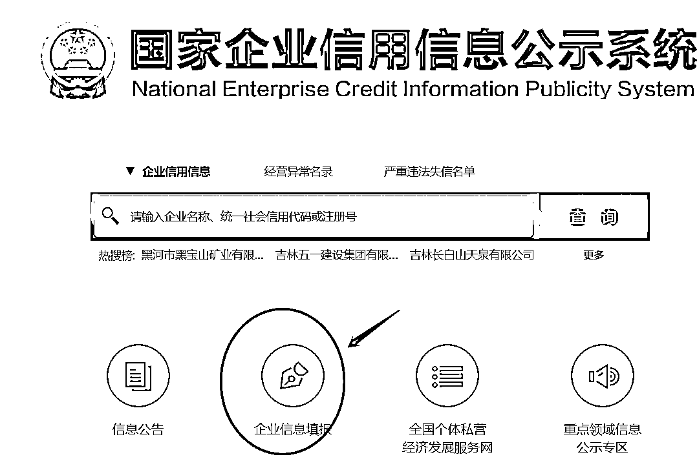
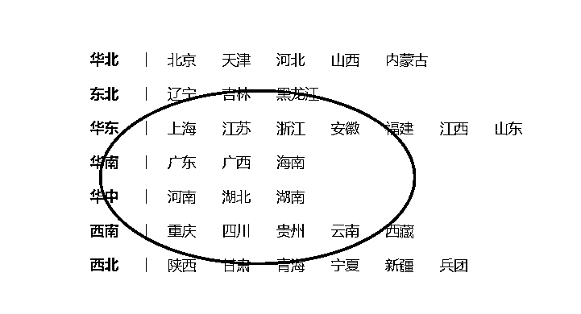
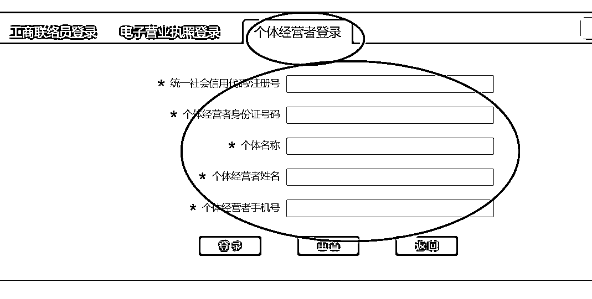
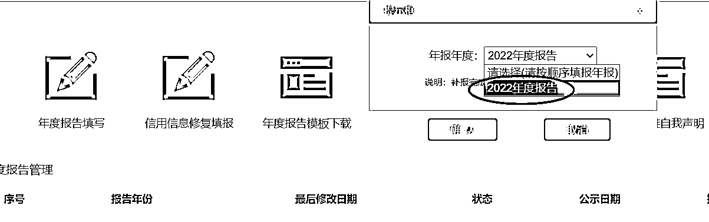
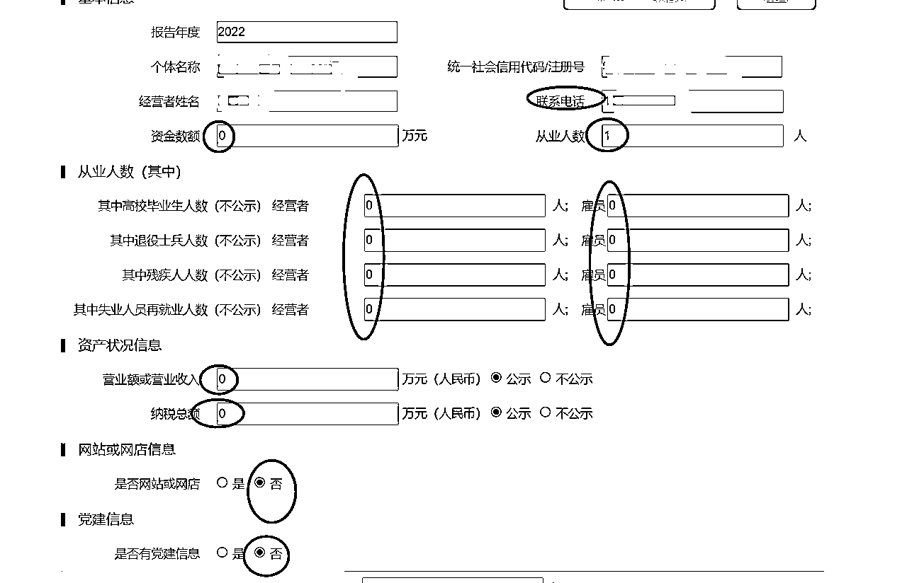
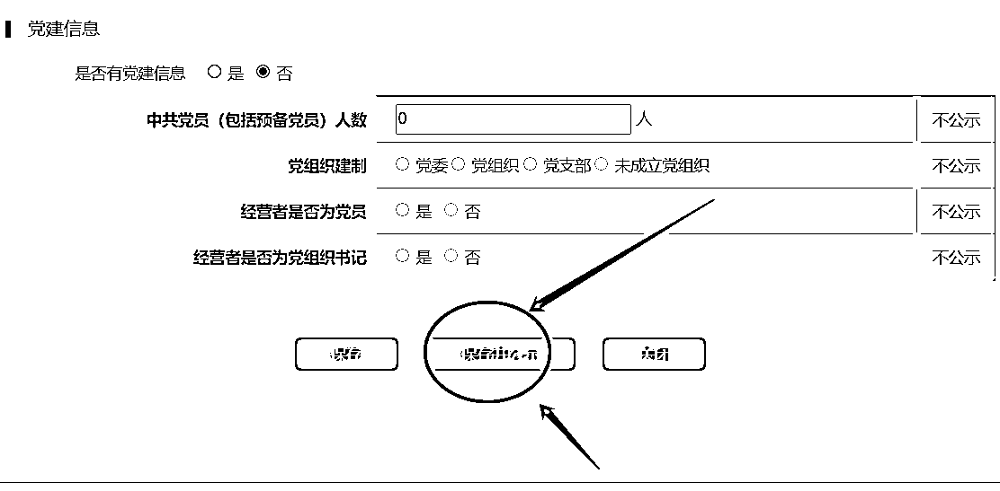
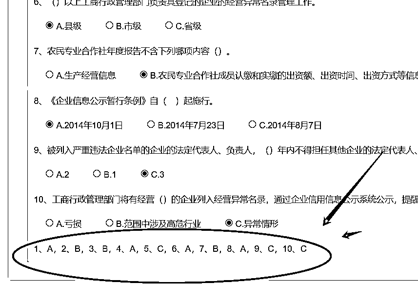
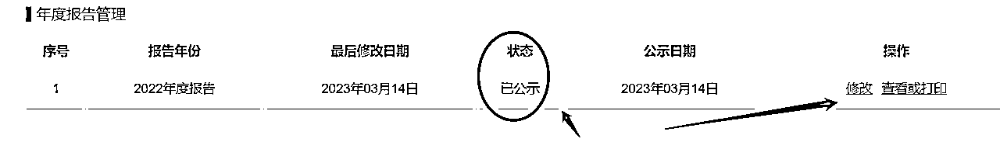

# 年报（图文详解）---小副业 副本

> 来源：[https://p0xfhvmcoj.feishu.cn/docx/VM9QdCfqkoo0dUxtzZZcROAvnbc](https://p0xfhvmcoj.feishu.cn/docx/VM9QdCfqkoo0dUxtzZZcROAvnbc)

1，打开网站：https://www.gsxt.gov.cn/corp-query-homepage.html

2，选择企业信息填报，每年1-6月份年审上一年的执照

个体和公司年审步骤都是一样的

3，选择执照所在地

4，登陆，选择个体经营者登陆，然后按照信息填写即可！

也可以选择电子营业执照登陆，微信搜索小程序：电子营业执照，打开小程序扫码登录。也是方便简洁，主要是看怎么登录方便怎么来，多研究一下就行。

5，选择年报填写，跳弹窗，选择：已阅

6，填写年报内容，自行根据实际情况填写

7，保存并公示

8,答题，答案再最下面

9，公示成功

小副业，也可以出去外面接单，帮别人年报！几分钟完事。价格10-200不等。

还有一些执照小知识以及线上申请执照的资料，大家可以看看：

有需要代办的也可以滴我哈~全国执照代办