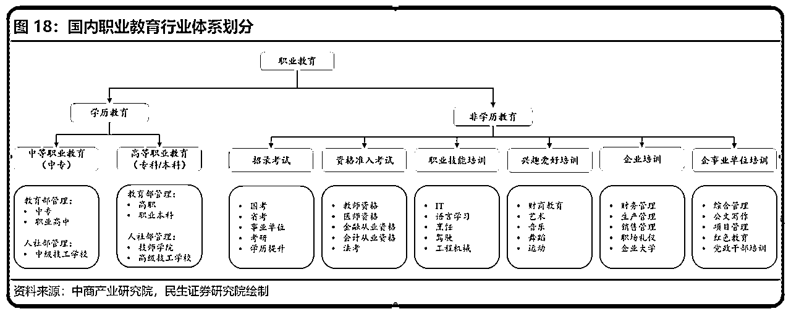

# 七小的2023年终总结

> 来源：[https://mkfwp3u79v.feishu.cn/docx/VOq8dDA3Go5NA6xbaqMchydbn3c](https://mkfwp3u79v.feishu.cn/docx/VOq8dDA3Go5NA6xbaqMchydbn3c)

2023年还有几天就过完了，又到了一年一度写年终总结的时候了。

今天写这篇文章的时候我还挺开心的，因为最近也是积攒了太多太多太多的想法，能把很多想说的话表达出来，把混乱的思绪给清空，是一件值得开心的事情。

那么话不多说，就直接进入正题吧。

以下是本文目录：

# 一、关于商业

## 1）背景

先来说说这一年是怎么过的吧。

1月份，卖生财案例库、冲了个榜前排。卖百度答题的小项目，小赚几万块。

2月份，卖GPT社群、小赚几万块。参与了一下GPT书籍出版的事务。

3、4月，参与生财的拉新活动，团队拉新200+人，GMV约40w。卖了下自己的私教产品。

5月，参与一个AI写作的课程发售，小赚几万块。

6月，去到杭州，了解一下按摩店的商业模式，学了企业经营的一些课程。

7、8、9、10，研究了人生发展、社会运转、阶层规则、企业管理的知识去了。

11月，参与了一个养生按摩的品牌的线下地推；看了朋友的按摩店开分店；搞了一个大学生的圈子。

12月，来上海，接触房地产行业，了解房产卖方代理这个职业。

嗯，极其动荡的一年。

你问我为什么那么动荡？

我的答案是，为了破局，为了寻找出路。

我的困局是什么？

我有极其明显的长板，以及极其明显的短板。

长板是，内容能力出色、分析能力出色，很多人看过我的文章，看完后直呼牛逼。记住了我，认可并欣赏我。

短板是，我没有一个清晰的定位，没有一个基本盘，可以和别人进行业务上的合作。每次被人问到你在做什么业务，你是干什么的，我就很难回答，有些尴尬。

如果你问我，那你为啥不去搞个自己的基本盘呢？

我：你以为我不想咩？我的能力全都点在底层能力，给人打辅助的能力上了。围绕着他人的某些需求做些事情，我很清楚该怎么做，但是围绕自己的能力去做，我是真不知道该做什么。

我花了两年多的时间，研究底层学习方法，这项能力点满了，对我的帮助很大，我学啥都快。

但是靠这项能力去培训变现，虽然我也算跑通了，赚过10w左右。但是，有个很尴尬的局面。

学员在我这里学习，学完了，他是没法证明他的学的很好的。

你说你是教物理化学的，学生在你这学完之后，考试成绩提升了，这就证明你的教学有效，对吧？

但是教通用能力的，学完之后呢？得干什么事情才能证明他学好了？让他说，我1个月就入门了一个新领域？那么什么叫做入门呢？这又如何证明呢？... 难搞。

可怕的就是，我擅长的点，全是底层通用能力，难以证明和衡量。别人给我一个具体事情做，或者我主动给人打辅助，我都能发挥的很好。 但你要我自己想，我要去干啥事？ 我真想不到...

已有的所有喜欢擅长的东西，都找不到一个具体的落脚点，以及想不出一套好的商业模式，长期稳定变现。

目前视野里面能看到的，能够长期稳定变现，有一整套完整商业模式的，全是别人的业务。

如果是你，你是相信自己，还是相信别人嘛？

是坚信自己做的事情有价值，一定赚钱，然后想办法把自己的东西跑出来一套模式，变得长期赚钱？

还是，认为自己做的事情虽然有价值，但是离变现远，放弃掉自己有积累的东西，换个现成的能赚钱的，从头再来？

年初的话，卡在上面提到的尴尬局面当中：

我很厉害，大家都知道我，但都不知道我业务是啥，有啥可交流合作的点？

我有明显的一技之长，但是这套操作太少见，没有类似的商业模式供我参考（甚至今年上半年，我连商业模式的概念都没有），想走下去，全靠自己摸索。但我想摸索，连个明确的方向都没有...

让我继续延续以前，靠各种分销赚钱？那暂时也还是可以的，但毕竟不是长久之计，还得去找个自己的基本盘。

所以我今年花了很多时间在各种尝试，以及在外面跑。

因为我信奉乔布斯了【连点成线】理论：

混乱开局，疯狂尝试打点，然后等点够多了，连点成线，到时就知道自己该怎么做了。

所以今年的主线就是：

有啥能参与的项目，就都去参一脚，疯狂打点。有啥现成项目，朋友在做的，就过去看看学习一下，或许能够复制。

于是就有你们上面看到了：

干了一大堆的事情，还在外面跑了大半年，每个都做了点，虽然没做出啥成绩。（虽然阶段性的看起来跟个傻子一样，搞的乱七八糟的。不过还好，到了2024年我就能安定很多了）

## 2）什么是项目？小项目和大项目的区别？网络副业和正规公司有啥区别？

有一些问题，我真的困惑了很久。

之前我没有基本盘的时候，一些朋友就建议我说：你也像别人那样子去跑通一个小项目，然后把这个项目包装成培训去赚培训的钱不就好了吗？你光一直输出认知有啥用啊？ 讲道理没有用的，你得去卖项目才行。

我就在纳闷和困惑：为啥在一些朋友眼中，小红书虚拟资料、小红书无货源、无人直播之类的才叫项目？ 我这种卖社群、卖课程，咋就不是项目了？

我认为这样的说法是很有问题的，所以往下深挖：什么叫做项目？自营项目和培训项目的区别在哪？

以前我总结过： 项目 = 流量 X 转化 X 产品 ，在哪个流量入口，通过什么方式获取到流量，在哪里进行转化，给客户提供什么产品交付？

### ①大部分的培训项目的本质是什么？

以3个项目为例子：

小红书上卖学科资料，这个培训项目的本质是： 老师提供已经整理好的学科资料，作为【产品】，以及提供一整套的sop，搞流量的内容素材、模板，私域成交客户时常见的销售话术，百问百答。

即： 小红书虚拟资料 = 在【小红书】这个平台，学员去发布内容获取【流量】，在私域私聊【转化】用户，然后以老师提供的整理好的资料作为【产品】来售卖变现。

在这项目中，学员的主要的是【前端】 （流量+转化），老师负责的是【后端】，满足的是客户需要学习资料的需求。

以常见的写作变现项目为例，这个培训项目的本质是： 老师教授一套关于写稿子的技能作为【产品】，然后学生掌握技能后，写出符合要求的稿子，由老师来对接一些内容平台，把学员的稿子卖给收稿平台，然后把一部分稿费给到学员，来变现。

老师赚的是：前期收的一笔培训费 + 后期学员的稿费差价

学员收获的是：写作技能 + 后期投稿的稿费

在这项目中，学员的主要的是【后端】 ，供应内容。 老师负责的是【流量+转化】，即对接收稿平台，满足的是收稿平台需要优质内容的需求。

再比如说，百度答题这个项目。这个培训项目的本质是： 老师教授用GPT+全网搜资料的方法，教学员如何快速答题。 学员答题后，客户满意了，平台就会给答题学员一定的金额奖励。

在这项目中，百度答题平台提供【流量】，即提出问题的客户。 学员提供答案，让用户满意后才可赚到钱，即负责【转化+交付】。培训老师提供是：商机+操作方法， 即包含了 赚钱机会+岗前培训的，这样一个产品。

所以说，其实所有培训项目的本质是：通过培训，让学员掌握【流量】【转化】【交付】的一个、两个、或全部的环节，通过这种分工，让学员和老师都赚到钱。

### ②为什么会有人出培训项目？

培训项目的方式和目的，分为两大类：

第一类是教学员一到两个环节，由老师把握其中最关键的环节。只要学生出单，老师也跟着赚钱。老师主要赚【把握产品供应】或者【把握收货/结算渠道】的钱。

比如说：

小红书有货源电商，学员卖的是老师供应的产品，老师赚培训费+供应链的钱。

写作投稿项目，学员提供内容赚稿费，老师把控收稿渠道，赚培训费+收稿的差价费。

第二类是，教学员全部的环节，老师纯赚培训费。 学员赚钱后跟老师没有半毛钱关系，但是老师节约了时间和降低了风险。

比如说：

教人投资理财，老师赚的是确定性的钱，稳赚不赔。 学员去投资，则是有亏损风险。

教人百度答题项目，老师收学员是299/399一单的收，学员赚钱则是1块、3块、5块的赚。学员一个月内可以连本带利赚回来，但是肯定不如老师赚钱速度快。

### ③直营项目和培训项目的区别在哪？

什么样的项目适合培训，什么样的项目适合直营？我认为主要是这三点因素：复制性、控制性、利润率。

1、有些项目是适合直营的，但是老板也是新手老板，对公司的运作能力不够强。 想要放大项目的时候，如果是招员工来做，那么可能因为把控不好，每月发完工资还倒亏钱。 所以会在这个阶段，选择用培训的方式来放大。不光没有人员成本，还能有培训费的前置收益。

好处是：收益提高，风险和成本都下降了。

可能存在的弊端是：因为培训的人员不好直接控制，学员也不会天天8小时的来干这事，所以项目的出单速度，肯定是比不上招员工来做的速度的。

2、除掉风险和成本的问题外，有些老板生性爱自由，不想搞个场地管一堆的人。所以也会选择做培训来放大，而不招员工直营。或者是自营团队三五个人，剩下的全靠培训。

3、能拿出来在市场上大规模培训的项目，既然要大规模招人，那么注定了，项目的门槛不能太高，是适合更多的普通人。 适合更多的普通人的方式有两种，要么项目本身就没那么难，要么项目负责人能力很强，能把sop拆解的足够的精细，强行把项目难度降下来。

如果是项目本身不难，所以可以大规模培训的，那么也会出现一个问题。难度低，门槛低，进入的人多，内卷起来了，利润又下去了。 培训项目的属性决定了，大多能拿来短期快速上手的培训项目，大部分都不会赚很大的钱。（一般来讲，培训学员能月入1w，已经算优秀了；月入2w，绝对佼佼者了。）

想赚更多的钱，多数情况下的方式是：要么自己多账号矩阵放大，要么也出去搞培训方法。

4、总之就是：

利润高且难以复制的，一个人一个账号搞就行，最多带几个助手。

利润高、可复制、且成功率可以自己把控好的，开公司，招人复制。

利润高，可复制，但成功率难以把控，招人也不一定能保证带出来的，搞培训卖商机。

利润中等或一般，可复制，成材率不低的，搞培训。

5、我对培训项目的看法是：

1.如果你的目标，就是1k-3w的收益，那么把一个培训项目做精通，然后自己多开几个号+招募几个兼职协助你，达到目标是不难的。你找个靠谱点的项目，长期搞就行。

2.如果你的目标，是5w-10w，或者再往上。那你跟着别人做培训，就比较难了。你得自己找个项目，自己去带人搞培训，才有可能达到这水平。

3.纯新手，前期跟着别人做项目，先掌握技能，不用太在意收益；当技能全都精通了，有更大的追求了，再去看看是要成为项目的培训方，或者自己弄个直营的项目。

### ④大项目和小项目的区别是啥？

评价大项目和小项目，我觉得可以从三个维度来讲：

1、行业规模

2、客单价

3、扩张方式

前两者，指项目属性的大小。

有些赛道是非常大的，比如房地产，是万亿市场；有些赛道则是比较小的，比如一些二次元的细分类目，最多就是千万市场；有些产品，一单就是几万到上千万，比如留学规划、买房子。而有些则是一单几块到几百块，比如学科资料、社群。

第三个，指的是运作方式的大小。

单人模型：同样的一个项目，有的人就一人一号一产品的卖。

品类扩张：而有的人，一人一号，但是多个产品去卖。 课程搞初中高，实物产品搞低配中配高配；

机器自动化怼流量：有些人上rpa+gpt+python，用机器自动化，起矩阵号来做

堆人怼量：有的人搞三五人小团队来做，有的人疯狂招人，弄个上百号人的公司来做，用人来放大流量和后端承载量。

股权激励：还有的人内部搞股权激励，阶梯激励/分红/期权/实股/部门公司制齐上

招商加盟：还有的人，搞外部的招商加盟，全国开连锁。

有句话说的是：没有小项目，只有把项目做小的人。我是认可的。

当你觉得项目不行的时候，想一想，到底是项目没有复制属性？还是你自己不会、没做好复制扩大的动作？

再小的项目，只要扩张方式OK，那一年做个50w-100w的利润，都是没问题的。

### ⑤网络副业和正规公司有啥区别？

以前我问过我的大哥这个问题，他给我的回答是：项目没啥区别，只是运作上的精细程度不一样。

上周又问了亦仁老板，他的回答是： 正规化= 公司化+ 品牌化 + 付费投流

结合我自己以前的积累，我的理解是：

公司化 = 股权设计+ 组织架构 + 薪酬绩效 + 人员管理

品牌化 = 品牌标识设计 + 商标注册 + 打造行业影响力

以及从自然流量，薅平台羊毛，到付费投流，和平台共生。

对于这个问题，我个人的看法是：

如果你只是想搞点网络副业，每个月多个几千块，或者月入个1-5w之间，那你只需要记住：

【细分定位】【流量】【转化】【产品】，然后努力干就完事了。

但如果你以后想成为真正的创业者，开公司，招员工，实现年入百万，那你得对这张图里提到的东西，有点概念。

如果你以后想开个中大型规模的公司，建立行业级的影响力，拿融资，搞招商加盟...那些下面这个商业计划书里的东西，你是需要有个基本概念的，以后肯定用得上。

## 3）我干的东西属于哪个行业？我怎么设计我的商业模式？什么叫做扎根于行业？

### ①我属于哪个行业？

我还困惑于一个问题，就是人家问我：你是干啥呢？你是哪个行业的？

我就懵逼了，emmm.... 我确实说不出我是所处哪个行业的。或者说，我对于行业有哪些？都没有一点概念。

于是我去找了专业的行业报告网站，看我到底属于哪一块的？

翻了行业大类目，以及细分类目，我看到几块，可能跟我做的事情沾边的行业。

然后看到，我干的这种，算是： 职业教育--非学历教育--职业技术培训--新媒体技术培训

### ②我怎么设计我的商业模式？

像这种培训类的东西，最终的、高级的商业模式，应该是怎样的？ 大佬是怎么玩的？

在翻行业报告的过程中，我发现了这样图，然后明白了：噢，最后成熟的模式，就是成立学校/培训机构，然后走校企合作模式。这样能把 学生、企业、人才机构、政府机构、投资机构，一系列的相关人都圈进来~

看完这张图之后，我是大为震惊的，心想：卧槽，要是早点去看行业报告，去看行业里成熟的商业模式是怎样的，我做个体户的生意，参考参考，照搬就完事了！哪还用拍脑袋，想这么久啊...太傻了。

看完了职业培训的东西后，我心想：职业技能培训+人力资源，这两个生意是绝配的呀。那我来看看，人力资源的模式可以怎么玩？然后找到了这张图。然后看懂了，我之前想干的那种方式，算是【灵活用工】

在这里，拿这两张图来展示，是想告诉大家。 作为一个新手，很多时候我们去想自己的商业模式，其实是不容易的。与其自己拍脑袋想，我更建议，去翻翻行业报告，看看自己属于哪个大类？这个类目下的常见玩法是怎样的？

拿现成的成熟模式来参考，肯定是比拍脑袋想，要来的靠谱的。

推荐网站:https://www.hanghangcha.com/

### ③什么叫扎根行业，深耕行业？这和普通人赚钱有啥关系？

行业，这个词听起来真的很大，如我上面所说，我也困惑过：什么叫做行业？啥叫深耕行业？我卖产品就能赚钱，为啥还要深耕？ 深耕行业，具体的行为是怎样的？

这些玩意，听着真是头疼呀。

后来资料看得多了，看到两个具体的例子，我觉得挺适合用来回答这个问题的。

1、我12月之后就开始接触房产行业，然后查找了一堆房产相关的资料。看到一份报告里，讲【贝壳如何解决房产经济行业痛点？贝壳如何改变行业】？ 然后找到了下面两份图片资料（简单看看就行，不用细看，看不懂也没关系）

从下图中，我开始理解了，所谓行业痛点，可以理解为以下几个问题：

1.这个行业里的消费者，有什么需求？ 他们的需求有哪些还没被满足？哪些需求虽然有解决方案，但效率不够高/体验感不够好？（思考C端需求）

2.同样的，这个行业的从业者们（如中介、店主），他们又有哪些痛点？哪些需求虽然有解决方案，但效率不够高/体验感不够好？（思考B端需求）

3.这个行业相比于其他行业，有哪些技术和商业模式，在其他行业已经大规模应用了，但在这个领域还没有？（行业之间对比）

深耕行业，从价值链的角度来看，也可以理解为是： 先占据价值链上的其中一个环节，站稳后，逐渐把上下游的环节给吃掉一部分。 如下图，来源于《商业模式与基因工程》 作者戴天宇。

总结来说： 围绕C端/B端/行业的痛点，提出更优的解决方案； 以价值链的一个环节为基点，然后向上下游延伸，吃掉更多的环节。 这是我目前理解的：扎根行业，深耕行业。

那和赚钱有什么关系呢？ 和我们普通人有啥关系呢？

我目前的理解是： 咱们普通人想赚个年入百万，其实挑个七八十分的产品，然后疯狂搞流量转化，就够了。 在产品这块，并不需要花很大的力气去研究产品，也不怎么需要去思考所谓的技术/商业模式创新，这些太遥远了，轮不到咱凡夫俗子来做。

但如果想开个年入千万到上亿的公司，就必须对于【行业】【产业链】这些概念有所了解了。 要不要学，主要看自己的目标是多大。

## 4）今年最惨痛的领悟？

今年最惨痛的教训就是以为自己啥都行，啥都能干，结果就是啥都不能干。

我以前总觉得凭借我超强的学习能力，我想干什么都能学会，都能做到80分的水平。然后就因此陷入迷茫，觉得啥都能干，反而不知道选啥。

现在回头看，我觉得这想法真是耽误发展... 太愚蠢，太坑了。

如果现在的我，穿越回半年前，或者今年年初的时候，来给我自己做定位的建议，我会说这些话：

别说你啥都能干，因为理论上只要不是傻子，给一个聪明点的人足够时间，每个人聪明人也都是啥都能干的。

定位方法，常规的说法是：喜欢、擅长、市场需要， 在此我调整一下：

喜欢替换成【愿意投入足够时间】 = 你不排斥这事，在这事情上花时间，你觉得是愿意的；最好，还能乐此不疲。 有些人对于一件事情喜不喜欢，其实是没啥感觉，难以判断的。 但是一干这个事情，注意力能持续多久，是几分钟就跑偏了/不耐烦了，还是能干好多个小时，这个是容易判断的。 想想，哪些事情，你是能够一天花4-8小时去研究，并且坚持两三年的？

擅长替换成【有竞争优势】 = 你在这事上，要么专业能力远超平均水平、要么履历背书远超平均水平、要么客户或资源方的数量质量超越平均水平。

市场需要替换成【价值容易感知】 = 这东西的好处，是容易描述的；可以通过数据、或者对比照、或者简短的文字描述，让别人一看一听就觉得，这东西好，有用。你也容易去写客户成功案例的。 绝不能是那种：有用，但难以描述，无法量化或可视化这事情的好处。

如果当初用这3个条件去筛，我就会立刻发现：

其实我也有一大堆事情，大概率是打不过别人的，能做但没有竞争优势；

又或是价值难以感知，有用，但无法让人看完介绍就愿意买单，转化率是不可能高的；

以及还有挺多事情，我做了，但其实也是有头无尾，我并没有足够的热情在这上面，也不愿意在这事上一直投入时间；

聪明反被聪明误呀。对于脑子转的快，感觉什么都能干两下的人来说， 用更严格的筛选条件，来发掘自己其实并不适合做什么，真的是一件很重要的事。 觉得啥都能干，啥都想干，那早晚会废掉的。

## 5）学会独立判断赚钱机会

今年走出去，去其他领域看机会，然后就发现了很有意思的事情，让我感慨【小马过河】这个寓言故事真是太经典了。

我去了解朋友的中医理疗按摩馆的项目，体验完之后感觉效果挺好，并且也看到了一些客户付几万块的高价，购买了高级服务。我知道这样的店，肯定是可以搞全国加盟的。但是当我和其他的一些朋友去聊这种项目，他们开口就说：现在按摩店已经很卷啦，这样的项目前期投入大，做不好还容易亏，你可别干这些啦。

如果我不是亲眼见到我朋友的店，开的还挺好的。那我肯定会听信其他朋友的话，觉得这事情危险，红海，不适合入局，不要干。

后来我还去看了下房产的机会，现在一提到房地产，几乎大部分人都会觉得：下行期、夕阳产业、不值得干。别去。以及我认识的两位身家上亿的大佬，也确实是这么劝我的，别碰。但有意思的是，我那做房产的大哥，在这下行市场里，还是可以每年赚个几百万。。 并且干的事情，还是有增长的趋势。

那我该听谁的呢？

这就让想起了经典的【小马过河】的寓言故事。每个人站在各自的视角、体感，说的话都是对的。 但是最终这道理适不适用于你？ 那是另外一码事。

松鼠说很难过河，老牛说很容易，都是对的。 对于小马来说，这河没那么深，也没那么浅，但还算能过。

同理，一个项目到底能不能做，还是看：自己能不能做，而不是别人能不能做。

想起以前学投资里讲的一些方法： 不做预测、只做对策。

盘点一下自己现有的资金，然后分成多份，根据市场的情况来调整。

什么情况补仓？什么情况止损？什么情况止盈？ 通过什么手段，来进行风险对冲？

点位、仓位、风险管理，把这些做好了，才是投资者。

光是做预测，然后听天由命的，那就真是赌徒，太危险。

# 二、关于友情

## 1）被请吃饭的愿望达成

2022年4月2号，我在推文里写下这段话。在2023年年末的节点，回头看这句话，愿望实现了。

今年也去了挺多地方：深圳、广州、东莞、杭州、梅城、郑州、南京、合肥、上海、南昌、长沙。

真是实现了，到哪里都有朋友好吃好喝招待，还有朋友开车带我兜风，真是美滋滋~

感谢生财圈友、感谢生财有术、感谢自媒体，给了我梦想成真的机会~

## 2）为什么以后想开个公司？

我以前一直觉得，当个自由职业者，没有场地租金和人工成本的压力，每个月赚个五六位数，美滋滋~

这日子多潇洒呀？为啥要开公司，束缚自己，给自己背那么多压力呢？

直到后来遇到了两件事：

1、遇到了特别志趣相投的朋友，价值观相似、性格和能力互补，觉得这也太适合一起做点事了，不做点事情，感觉都说不过去呀。

2、遇到了几个我特别喜欢的小助手，有的还在学校、有的刚毕业。我心想着，遇到自己喜欢的人，必须得把他们留在身边，助我成就一番大业呀。 让他们在外面飘着，去到别人那里打螺丝，我看着难受啊！我接受不了呀！

因为遇到了这两件事，前者让我和朋友已经一起注册了公司，一起做些事情；

后者让我想着以后必须做个一年100-300w左右的盘子，我必须有钱可分，必须养得起我想带的人，才行。

## 3）感谢朋友们的照顾和支持

今年感动的事情实在是太多了。

有姐姐操心我未来的发展，单独约我和女朋友一起吃饭，又给感情建议，又给风险预警、发展建议的；有姐姐带我减肥10斤，还带我进入到企业管理、B端生意人的世界里。

有大哥带我在杭州吃喝玩乐，聊过来人经验；有大哥给机会，让我在千人场演讲；有大哥给项目机会；有大哥凌晨两三点还给我打电话帮我修改合同细节...

......

和东莞三人组的组建了干饭同盟，有时去他们的别墅里约饭，有时让他们来我们深圳约饭，相聊甚欢。

有了广州好兄弟，一通电话，我就从深圳跑过去约星巴克，或是对方从广州来深圳吃日料。

在郑州和好兄弟一起撸烧烤、彪摩托、露营下午茶，还一起注册了公司。

......

有了媳妇；

有了自己的左膀右臂的助理；

有了十几个信任我、愿意追随我的私教学员；

......

总的来说，对于今年的关系经营还是很满意的，结交了很多新朋友，一起经历了有意思的、难忘的事情。

感谢生财平台提供链接的机会，感谢朋友们的招待和支持。铭记在心，感恩。

# 三、关于爱情

## 1）和女朋友怎么认识的？

我有个粉丝，是我和我女朋友溟桥的共同好友。 去年年底的时候，我和溟桥还不认识的时候，这个粉丝朋友，先是和溟桥安利了我，说七小很厉害，推荐她加入我的社群。不过那时溟桥听完，并没有加我，对粉丝的安利并不感冒。

粉丝也和我说了，她向溟桥安利我。 当时我觉得也没啥。结果没想到，第二天刷公众号，就看到系统推荐溟桥的公众号了。 我点了关注，看到微信名片，就加了个好友，随意聊聊。

刚好那天闲着没事，就主动提出和溟桥打个电话聊聊。 我想着是看看同99年 同深圳的女生，是啥水平，看看实力。她想着只是交个朋友，随意聊聊。

然后聊完了，我觉得就一般般，正常99年小女生的心智水平，准备溜了。 结果没想到，她聊完，觉得还挺有收获，于是给我转了一笔钱，加了我的社群。 我寻思着：芜湖，打钱了那就好说，当个朋友随意聊聊呗。

后来生财案例库推广，我参与打榜活动。当时溟桥看到了，主动提出帮我一起冲榜，要助力我一波。

我一听：多一个人助力，多一个榜前的机会，行呀。

先正常社交礼仪的感谢一下，然后实际上心里也没抱啥太大期望，因为觉得应该也不会出很多单，还得靠我自己。

结果万万没想到啊，卧槽！！ 给我贡献了近50单。 我200多单的业绩，她给我贡献了25%的助力呀！

这一波可把我弄感动了，这队友太给力了！ 我必须得请吃个饭，感谢一下。

然后就线下见面了。

第一次见面的时候，刚好离我家不远，于是我就开电动车过去。

吃完了饭，本来是该走了，但我顺口提一句：要不要坐我电动车，出去兜风？

她想着也没啥事，就答应了。然后又多聊了1小时...

本来她该坐地铁回去了，我说我可以载你一程，送你到XX地铁站，你就不用换线了。

她一听，可感动了，觉得我太贴心了，还专门送她。 然后一路上，又多聊了1小时...

聊得多了，后来嘛，就拐回家了。

## 2）女朋友带给我的生活变化

如果让我顺应本性，自然行事的话，那我是这样子的👇

感谢女朋友给我填充了【生活】和【人情味】的板块。

让一个每天疯狂干活的事业狂，有了休息的时间，能看到事业之外的其他有趣的事情了。

让一个本来天天扒拉两口饭，糊弄过去就完事的人，开始会关注美食、寻找吃喝玩乐的去处，有了享受生活的概念。

让一个跟老母亲就隔3个地铁站，但半个月到一个月都不一定回去一趟的熊孩子，也会每周回家看看家人，更会照顾一些父母、爷爷奶奶的感受了。

让一个杀伐果断、总以价值来对人做区分的人，开始多了些人情味，不再以己度人，会去考虑他人的处境、他人的性格、意向，给他人提供 对方真正需要的帮助。

...

另外一个比较大的改变是，现在遇事不决的时候，就找女朋友商量。 听女朋友给我算一卦hh。

虽然算卦的道理未必科学，未必管用。 但挺多次，通过这种神奇的方式，倒确实坚定了我做一些事的决心。

感谢女朋友一直给我的鼓励和支持，让我有足够的能量勇往直前。

# 四、关于家庭

## 1）全家的希望？

我的家庭，算是个大家庭。我爸这边，上面有3个姐姐，1个哥哥；我妈这边，有1个弟弟、1个妹妹。

爷爷辈基本都是农民，父辈都是进城打工的。 我爸妈小学文凭，父辈最高的也就高中文凭。

到了我这一辈，我有1个90后的堂姐、2个90后的堂哥、1个00年的堂弟，3个00后的表妹。我的兄弟姐妹们，要么专科、要么复读后才去二本，貌似只有我一个是一次考上一本学校的？

然后毕业出来后，我这一辈基本都是去打工的，有几个是中间创业过，但基本都是以赔钱收场的，只有我算是正儿八经走上创业的路，还赚到钱的。

本来我也想当个被人庇荫的弟弟的，结果一个不小心，卧槽，成了全家的希望了...

如果你要采访我，问我是啥感想？我觉得有两点吧。

1、太难了，真的太难了。成长过程中，我父辈基本只给了思想品德的教育，教我当个好人。除此之外，中学时期学科辅导、大学选学校选专业、毕业后选工作，这些真是啥也没指导，纯放养... （不过父辈也确实没能力指导）

俗话说富人靠科技、穷人靠变异，我是有种强烈的中彩票了，刚好变异成功的感觉。没变异成功的话，家族全员打工的状态，唉，不敢也不想去多想...

2、我们家族的氛围还是挺好的，逢年过节都会聚聚，关系挺融洽。这也让我是有种，我和家族里其他成员是血脉相连的感觉的。上一辈没有完成的，没法给到的一些东西，我希望从我这一辈开始，能有所改变吧。真正发挥【全家的希望】的作用，带领家族能往上走点。

## 2）让我感觉长大的瞬间

今年是有点明显感觉到，家族里的权力更替的感觉。

比如以前都是姑爷开着车，带着一家老小出去玩。 现在变成我堂哥开车，带大家到处转了。

比如以前家庭聚餐，买单的时候都是父辈出钱，自己就坐孩子桌，等干饭就行了。现在一顿一千多的饭，也都是由我来买单了。

比如上次和我这一辈的兄弟姐妹出去玩，姐姐还单身，哥哥还读书，我和弟弟都还未成年。现在姐姐孩子都快上小学了，哥哥都工作五年买车了，我也毕业快3年了。只有弟弟一个人专升本，还在读书。等他出来了，我们这一辈就全都进入社会了。

这两年在外面跑了很多地方，北京、杭州、郑州、上海... 有很多次，都是飞机落地深圳，第二天回家和父母、爷爷奶奶吃顿饭，然后过个几天，又是拎着行李箱出发了。

有时感觉能请客吃饭、能给家人花钱了，有种经济独立的骄傲自豪感；有时感觉也得为碎银几两奔波，没空在深圳多陪年迈又生病的爷爷奶奶，也会有些苦涩。嗐，这就是长大的感觉吧。

# 五、关于对人生的理解

## 1）为什么要追求30岁1000w？

我对于赚钱确实是有一些执念的，在我2020年的时候，我给自己确定了一个目标，就是要30岁之前赚到1,000万。

为什么会产生这样的目标呢？来自于两类事情吧。

第1类事情是，我从小到大的校园环境都不算特别好，小学和初中都有一定程度上的经历校园中的语言暴力和身体暴力，高中的时候也是和同班同学关系不合，被一些人在背后黑了3年。

在那些苦逼的时候就经常会想着：你们都给我等着，30年河东30年河西，等以后哥飞黄腾达了，一定把你们这些人踩在脚下。

嗯，是有一种要反击、报复的执念。这个信念一直驱动着我，必须要混得好。

然后在2019年的时候卖洗衣机在珠三角卖了5000多台，业绩做了300多万；再到2020年开始去混一系列的社群，在几乎所有社群中我都是KOL，并且得到了很多比我大5~15岁的职场人的认可。当时我心想：这些比我有很多经验，并且自己混的也挺不错的前辈，都这么看得起我，那我以后不干一番大事业，岂不是辜负了大家的期待？

所以，那就搞一个大的，30岁之前努力赚个1,000万吧。

这个目标发展到现在取得哪些进展？

1、一年50w-100w的水平，已经达到了。

2、年入百万到千万的项目选择、模式设计、组织架构，脑子里有个概念了。（引用一下花爷的文章）

往后走，我还有6年多的时间，搏一搏，实现这个目标还是有点希望的。

从目标设定到现在已经过去三年多了，心境有什么变化？

最开始的驱动力就是报复和炫耀，嗯，草根屌丝逆袭的第一驱动力。

发展到现在，这种负面的驱动力已经没了。

因为对我来说，我已经比这些同学跑的快太多了，甩着他们连影子都看不到，再去关注这些人的想法是没有什么意义的。以及，更大概率来说，后面一辈子都不会再偶遇一次，真的没有必要在乎这些人的看法。

现在对我来讲，去实现这个目标，纯属就是想挑战一下自我，还是和我多年前在文章中写过的那样：

我自认为自己或许是上天的宠儿，上帝赏赐了那么一些些天分，让我去走一个草根逆袭的剧本。我想试试看，以我的天资才能，这辈子能走到怎么样一个高度？

在我触碰到我的天花板之前，我这个躁动的心是不可能安定下来的。等我真正达到了我的天花板之后，无论这个天花板是高是低，只要能让我深刻的意识到我这辈子其实就到这了，能死心了。那我之后也就没什么执念，能够安心的去过悠闲的生活了。

哈哈，我承认我身上是有很重的赌性的。

赌成了，以后就有能吹一辈子的辉煌事迹，高兴。

赌输了，以后也能安心享受生活，也OK，挺好。

## 2）人生不是轨道，是旷野

今年似乎是挺流行“人生不是轨道，是旷野”这句话的。经历了很多事情之后，我也有这样的感受。

今年在不同的圈子，和不同的人相处，感受到了多种多样的生活方式。

比如跟我以前的合作伙伴一起，那时候满脑子都是，今天写作了没？搞钱了没？进步了没？

6月多的时候在杭州，跟着我那做养生的姐姐，每天被问到的是：运动了没？规律饮食、细嚼慢咽了没？昨晚有没有熬夜，早睡了不？

跟我深圳的一哥们玩，则是：哪里又开了一家店，去看看不？ 出去兜风拍照不？ 去滑雪不？

跟着MBTI圈子、以及东莞三人组聊，则是： 我家的这位平时xxx，哎我家的这个也一样，他还说xxx，我这个也是！！

在搞钱的圈子里，每天没有日入斗金，今年没有年入百万，都会让人有点压力呀，生怕自己落后了；

而在另外的一些圈子里，你张口闭口就是搞钱，人家还觉得你这太功利了，或是太草根野蛮了，不够优雅；

有些地方，你花了很多心思在穿着打扮上，但是工作业绩一般，人家觉得你花里胡哨，屁用没有；

而在另外一些地方，就算你工作业绩很出色，但是穿着打扮太普通，人家只觉得你是个土包子，没文化没审美；

......

以前没见过世面，总觉得有钱人一定和精英划等号。

直到后来遇到一些在深圳和上海的拆迁户、包租二代。

人家也真没啥文化和能力，但... 就是挺有钱。

以前总以为富二代就一定会继承一些父辈的家学，意识能力会比普通人强。

直到见到了，也只是找个清闲工作，混个月入过万的工资，月光的二代...

发现也不完全是，二代也不全是有光环的。

这世界有各种各样的生活方式，多出去不同的圈子里看看，你会发现其实有很多人：

他们选择朋友伴侣时，你看重的，认为一定要有的东西，他们可以接受没有； 让你自卑的点，人家觉得无所谓，依旧认可喜欢你； 让你觉得引以为傲的点，人家也不在乎，不会因此高看你一眼；

你认为这辈子一定要拥有，有了才能幸福，才能把日子过的舒坦的东西，比如金钱、能力，人家就算没有，其实日子过的也是幸福舒适的。

人生不是轨道，是旷野。 看的人多了，见到的生活方式多了，我们才能摆脱惯性思维，重新审视自己的生活：思考到底哪些是自己真的想要的，哪些是所处环境影响我们，让我们误以为自己需要的？

最终，摆脱环境塑造的轨道，重新自定义自己的生活，选择自己想要的东西，做自己想做的事，成为自己想成为的人。

## 3）内心强大是坚守道心，独立判断

以前我每次听到“真正的强大，是内心的强大” 这种话，我都会觉得：鸡汤呀，谁会信这种鬼话呀。读的书多了，营销活动做多了，发现这玩意还真不是个鸡汤。

人只要活着，就每天都会发点信息，以及刷文章视频，接受一些信息。 交互的过程中，我们不是在影响别人，就是被别人影响。 言语之间，刀光剑影，每天都是如此。

什么叫做内心强大？ 我的定义是： 在你接受外界对你质疑、反对、攻击、压迫的信息的时候，你能够坚持自己的意志，不被外界所改变你的态度，并且不对内产生过多的负面情绪。

举几个例子：

有人评价你外貌不好，你长的不好看，你太胖了，你这样肯定没有人会喜欢你的，你找不到对象的。

有人质疑你的想法和规划是不通的，你说根据你的推算，这样是没问题的，人家说：你是对的，那你赚了几个子呀？ 一句话堵死你。

有人说你性格不对，说你野心勃勃，攻击性太强了，这样会让很多人讨厌的！要收敛，不要给自己树敌！

有的说你性格不好，说你唯唯诺诺，太弱了。这样下去，以后在社会上肯定会被人欺负，你得凶点，得支楞起来！

有人说你交付不行，你纯纯割韭菜。

有人说，看你兜兜转转，东搞搞，西搞搞，啥成绩也没干出来。瞎忙，你这样以后肯定要废掉了。

.......

样貌、身材、性格、人品、能力、赚钱水平、生活方式、服务质量... 我们身上有很多点，都会被他人拿来议论、吐槽、批评、嘲笑、攻击。

面对这一堆负面的信息，你是会自我怀疑，陷入内耗？ 还是能帅气的说出：

嗯，你说的都是屁话，我选择不听，气死你，略略略。

嗯，你说的确实是对的，但你让我改我就改，那我岂不是很没面子？我就不改。

嗯，骂完了，笑完了？随意你们，怎么说都行，我专心干好我自己的事就好了。

人和人之间，只要开始交互，那么就必然是：言语之间，刀光剑影。 不是你改变我，就是我改变你。

有些是好的改变，那就允许它发生。

有些是坏的、错误的改变，那就要坚守道心，坚定自己的判断，不为他人所动摇。

面对外界的信息冲击，坚定自己的道心，自己的目标和判断，不动摇不内耗，是谓内心强大。

# 六、尾言

## 1）碎碎念

以上，就是本文的全部内容了。

2023，跌跌撞撞，做了大量的尝试，虽说成绩不多，但幸好没白尝试，让我把缺失的知识板块给补齐了。

2024，咱们都继续努力，一起生财有术，一起暴富！

## 2）联系方式，欢迎链接

最后：

我是七小，99年的深圳靓仔，知识管理专家。

精通搜索、采集、内容整理、关键词挖掘，擅长把碎片化信息整合成体系化的知识产品来变现。

江湖人称生财课代表，专业解决生财新人圈友的各种问题，致力于帮助圈友发挥好生财有术的价值。

微信：rickea150，添加请备注：生财圈友。欢迎交流。

公众号：七小的人生游戏攻略

