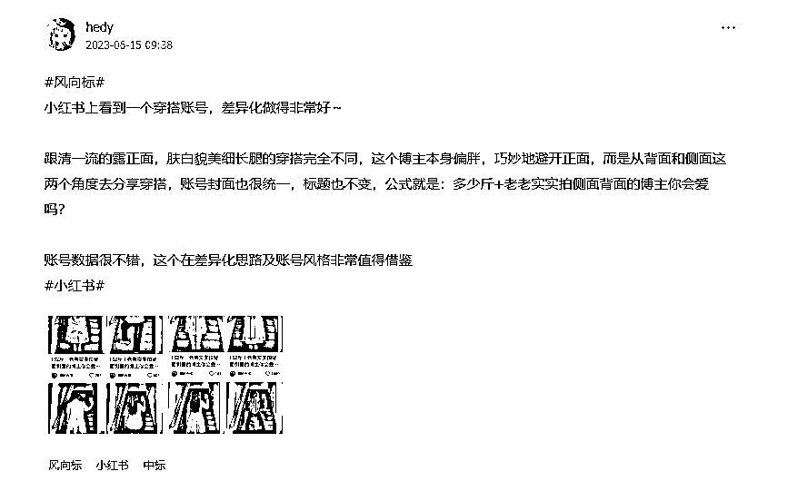

# 新手挖掘风向标，如何提高中标率？

> 来源：[https://d1b2c9b6c0.feishu.cn/docx/VbnkdASLToXXdOxo8ffcGrYWnzg](https://d1b2c9b6c0.feishu.cn/docx/VbnkdASLToXXdOxo8ffcGrYWnzg)

各位圈友大家好呀，我是hedy，目前是专注于小红书护肤赛道的全职自媒体。

前几天，鱼丸跟我说，在过往风向标栏目中，我发布了50条，中标了21条，有42%的中标率，希望我来分享一些经验。

在看到消息的时候，很意外又深感荣幸，感谢生财官方的邀请，我也趁着这次内容整理，复盘梳理了这一年的风向标，收获很大。

今天就跟大家分享我在挖掘风向标方面的一点心得，分享主要围绕这3个方面：

一、新手友好风向标挖掘法：评论区+tb/pxx组合拳

二、如何写一条差异化的风向标

三、3个刷风向标的小技巧get高中标

希望能给大家在【如何挖掘出高中标率的风向标】方面提供一些思路，也希望与各位结识，一起交流对风向标的理解，一起生财有术！

## 一、新手友好风向标挖掘法：评论区+tb/pxx组合拳

现在开始入局写风向标的圈友真的很幸福，风向标航海手册里提供了十几种挖掘风向标的方法，航线图也给出了非常清晰的路径。

对于刚开始写风向标的圈友，跟着航线图，把每一种方法都实际操作一遍，相信都能写出中标的风向标。

我在写了很多条风向标后，发现自己很擅长在小红书笔记评论区挖掘需求，同时借助淘宝或拼多多，通过搜索相关关键词初步验证赚钱市场大小和需求情况。

如果你是一个风向标新手，非常建议你多刷刷评论区，很多潜在的未被满足的需求都悄悄地藏在了评论区。我的很多中标内容都是来自于评论区。

比如拿下面这条P图月赚200w的风向标举例，跟大家详细分享下背后的挖掘过程~

共分5步：

1.刷到小红书上推荐来的笔记--主动点开；

2.连着刷了十几条带图的评论区后，发现很多人都有这种p掉路人的需求--刷评论发现需求；

（PS：当时发风向标的截图找不到了，时间上有偏差，大家理解其思路就好哈，同时这个图从时间线来看，也间接说明了p图需求之大）；

3.同时刷的过程中又让我想起，2个月前，一个同事在淘宝上花30块找人p了几个字--与个人经历连接；

4.在小红书站内搜关键词：【可以p掉】，获取下拉词，从下拉词中初步验证需求--初步验证需求；

5.上淘宝搜【p图】关键词，意外发现，月销量竟然有40w--进一步验证付费需求及需求大小

到这一步，其实这条靠p图赚钱的风向标信息大致就清晰了：

小红书上p掉xx的p图需求很大，月销量高达40w。

再加上当时发布风向标那会7月初，马上就要到暑假了。赶上暑假外出游玩高峰期，拍照自然变多。

所以，不管从短期（暑假）的需求高峰，还是疫情放开后外出游玩增多这个大背景来看，我自己判断出这个p图项目大有可为。

发出这条风向标后，有圈友评论说，看到过好几次这个了，但是没想到发风向标。

我最初在刷中标帖的时候，也经常会有这种感受：这条内容我也刷到过哎，为啥他能想到写风向标，而我想不到呢。

这个状态很正常，提升商业嗅觉确实需要长期坚持才能习得。

不过在写了几十条风向标的过程中我发现，刻意练习【刷评论区+淘宝/1688/pxx搜索】这个组合拳，非常适合初期挖掘赚钱信息。

除了上面p图的风向标，我下面这条中标的风向标也是利用【刷评论区+淘宝/1688/pxx搜索】这个组合拳挖掘出来的。

此外，除了用【评论区+淘宝/1688/pxx】这套组合拳去挖掘产品和服务的需求，单独深挖评论区也可以拓展出不同的垂直生财信息。

从评论区【脚臭】的需求到做账号

比如这条有关脚臭的风向标，我是这样发现的：

先是刷到一篇有关脚臭的求助帖子，被笔记有趣的文案所吸引。

然后在看评论区的时候，发现评论量涨得非常快（异常值出现）。

快到几乎每秒都有人评论，作为一个自媒体人着实被这流量惊到了，然后就搜了下【脚臭】这个关键词，发现不仅需求非常大，各个年龄段的人都有，而且网上支的招数也特别多。

从这些信息，我总结出一条：这个痛点足够痛，用户想解决的欲望特别强烈。

好，那一个普通人看到这种足够痛的痛点该如何变现呢？

作为一个自媒体，我首先想到的就是做账号。因为成本低，简单易操作。通过内容吸引精准人群，然后在小红书挂链接带货或引到私域带货都可以。

而内容选题，也不难，做一个治疗脚臭的信息整合即可。

至此，一条有关脚臭的风向标就完成了。

最后，借用圈友整理的评论区需求词库，新手可以保存下来。在日常刷评论区的时候，重点关注评论区里的指引词，刻意锻炼自己的商业嗅觉。

## 二、如何写一条差异化风向标

在评论区挖掘需求发到风向标后，很多新手可能会面临风向标重复的问题。放弃重新找吧，有点不甘心，自己花时间花精力了，就这么放弃确实可惜。

我也遇到过这种问题，我的解决思路是，从需求-产品/服务-流量-变现4大板块的不同维度去写风向标。

比如小红书夜校这条风向标，我在发布之前，刷了下当天的风向标，发现已经有人抢先一步写了。

不过，经过一番分析后，他这篇主要写的是一个热点-年轻人上夜校，以及夜校火的原因。但是如何获取到这些上夜校的用户，并没有提及。

于是我就借助夜校这个热点，从【流量】角度去写了一条风向标。通过分享北京夜校相关课程的小红书笔记，在小红书建群进而引流到私域。举一反三，这个玩法其他城市也可快速复制。

意料之中，我这条风向标也中标了。更重要的是，通过这条风向标，让我学会了从不同维度去看待风向标，看待赚钱背后需要考虑的各种因素，这种认知上的收获比中标更让我有成就感。

所以，下次如果遇到相同的风向标时，别灰心，换个维度去拆解，你会收获更多~

## 三、3个刷风向标的小技巧get高中标

最后，跟大家分享几个我日常在刷风向标时的一些个人经验，不夸张地说，每个月都能中标，跟这些小技巧息息相关。

1.定时刷

这个小方法很简单：给自己设置一个固定的整块时间而不是碎片时间。

比如每个月的15号，在这一天刻意去刷小红书、抖音或者自己平时关注的平台，目标就是要写中标风向标。

因为碎片时间，新手非常容易被内容本身带偏，最后可能压根想不起要发风向标。我自己原来就是这样，后来集中时间去写风向标后，中标率有了明显提升。

2.把自己当成亦仁

还有一个在刷风向标时，锻炼自己商业嗅觉的低成本好方法，就是把自己当成亦仁，不刷中标的风向标，而是刷最新的风向标。

然后根据自己的理解，提前预判哪条风向标可能会中标，原因是什么。

根据我的个人经验，这里建议大家每天下午4点前刷当天最新的风向标，看到有潜力的风向标，就点个赞并截图。到了晚上10点以后，一般亦仁就把当天的中标风向标筛选出来了，然后你再对比下，看自己猜的是否正确，猜对了几个。

坚持一星期，你对什么样的内容可能会【中标】就会有一个全面的体感。

我个人的体会是，这种扮演的方法，比起自己直接看中标风向标，对中标的理解会更深刻。

这就好比让你当一次出题人，你答题的准确率，要比自己刷几百道题来得更高效~

3.从熟悉中寻找差异化

最后，要跟大家分享的一条是经验是：风向标从自己熟悉的领域、熟悉的平台入手，会更容易找到异常值。

比如下面这条有关差异化的风向标，就是我在工作中发现的。

当时我还在上班，负责推广公司新出的一款衣物喷雾，需要找一些穿搭类的小红书达人种草。

因为预算有限，只找万粉以内的达人，我在品牌蒲公英账号下，设置条件时就找到了这位博主。

虽然最后没有与她合作，但她的账号信息我印象深刻，就发到了风向标。

所以，如果你本身是某个平台的重度用户，就优先考虑从某个平台去找自己感兴趣并且关注的内容，这样更容易觉察到异常。有异常才有商机。

以上就是今天的分享啦，再次感谢生财官方邀请，祝大家在航海期间写的风向标都能百发百中，不断在风向标中锻炼自己的商业嗅觉~