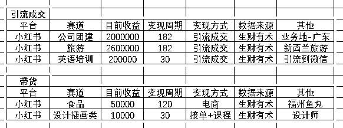
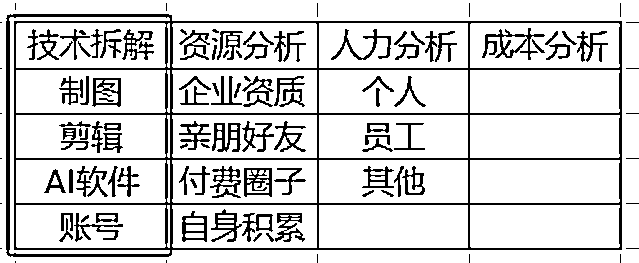
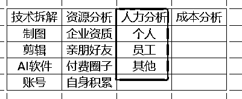
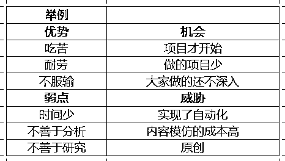
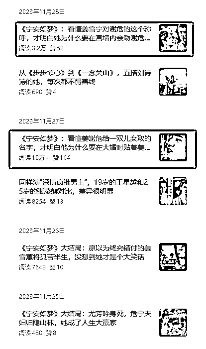
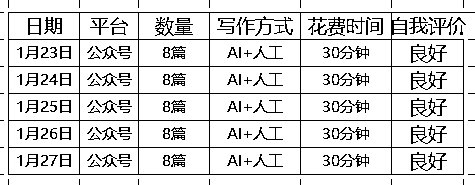

# 《航海项目-个体/副业项目实践操作初步指南》

> 来源：[https://k170ac9yh31.feishu.cn/docx/Vrxrd2WLFoVULsxLZSNcFqwOnDh](https://k170ac9yh31.feishu.cn/docx/Vrxrd2WLFoVULsxLZSNcFqwOnDh)

我自己加入生财也快一年了，看到生财这么多航海，我自己也彻底跑通了几个项目，这次我痛下决心，付出时间，我要把生财的所有项目全部都参加一遍，找到项目的共性，让自己能够合理的监控做的项目状态，我以前就是项目经理，数据分析师。感觉只要自己去实践还是可以做出一个通用的工具的，因此本次报了15多个航海。

我结合了PMP相关的知识，数据分析相关知识，以及其他的工具等。做了一个方便记录状态的模板，希望能帮助大家快速在每一个项目上进行复盘，希望大家通过工具快速找到自己的不足，也方便给其他导师或者大佬进行交流。希望新的一年大家，可以去尝试每一个可能赚钱的项目，找到最适合自己的项目，早日赚到钱，而不是各种犹豫不决。

# 一、项目寻找

## 数据收集

在寻找项目的时候，要尽可能的多的收集一些数据，例如项目平台、变现周期、项目收益等方面的数据，还要自己能够确定信息是不是比较准确，如果信息不够准确的话，可能会导致误判，在项目寻找的时候，还是要先收集数据，先不要管数据是不是合理，尽可能多的进行数据的收集。

*   数据收集梳理:

我认为收集的数据表头，如上图所示，根据自己收集的数据进行填充，在实际的操作中，发现需要添加的内容，自己也可以进行调整。

我这里用几条生财的几篇文章来做讲解：

*   聚光投放做广东公司团建业务，从0-1半年200w营收复盘分享

*   小白从0到1跑通小红书电商渠道，4个月卖了1000斤福州鱼丸，变现50000的复盘

*   小红书做新西兰旅游半年销售额260W+，我的经验分享和新人入局建议

*   设计师下班后做小红书，一年涨粉1.3w，副业月入1w+，设计插画类账号的变现历程

*   夫妻搭档做英语培训，通过小红书月入20w

通过梳理后，能够很轻松的看到这些已经变现的项目大致情况，可以做一个简单的判断这些项目是不是符合自己的心理预期，主要项目筛选的话，我觉得主要还是针对变现周期+变现金额，进行分析。如果在这里手机对比出来的收益或者时间难以符合你的心理预期，自己就要换项目了，这个项目肯定不适合你。

*   数据质量讲解:

前期自己一定要把我数据的质量，数据的质量决定了，一个项目的成败，以及项目可能的最大收益，或者说最小的收益，我认为在前期数据的收集的时候，如果自己身边有资源的话，建议询问一下已经跑通的，或者说身边的朋友。

*   平台+赛道: 这两个数据可能就是简单的一句话，或者说自己通过简单的观察就能够看到，这些数据很难造假，这一块的数据质量自己担心的不需要太大。

*   目前收益+周期+数据来源: 这三个的数据才更关键，尽可能的询问身边的朋友或者微信的圈友是不是有人能够告诉你一个相对准确的数字；或者看相关帖子的数据；付费购买其他人的课程，或者直接付费询问收益的情况。

## 数据分析

*   数据验证:

*   一致性检查: 主要涉及到两个方向内部和外部。内部一致性：例如《聚光投放做广东公司团建业务，从0-1半年200w营收复盘分享》《小红书做新西兰旅游半年销售额260W+，我的经验分享和新人入局建议》变现方式以及项目的周期基本都差不多，我认为属于内部的一致性。外部一致性: 将自己收集到的数据，问一问在这个项目做的时间比较久的大佬，这个数据是不是符合一个预期。

*   连续性检查: 例如《聚光投放做广东公司团建业务，从0-1半年200w营收复盘分享》《小红书做新西兰旅游半年销售额260W+，我的经验分享和新人入局建议》这两个大佬的分享出来的时候时间相差不大，而不是一个是年初一个是年尾，如果是这样话，时间间隔太久，数据的一致性就无法保证，尽可能保持数据的连续性。

*   数据完整性检查: 收集的数据内容，是不是有大致的业务逻辑，大致的方法，以及大致的感悟，这些虽然都无法展现在上面的表格中，相关的内容越多，代表有些数据越准确。

*   综合验证: 根据自己实际的情况，进行综合的判断，这条信息是否值得可信，这个需要自己长期的进行的积累的经验。

*   数据陷阱（辛普森悖论）：

数据陷阱是因为数据收集的时候，没有找到合理的数据，在数据的收集的时候，自己也要做个判断，只有合理的数据，合理的进行分类才不会陷入辛普森悖论的陷阱。

*   业务分析

上面的业务进行分析，发现引流成交和带货等收入的收益差别太大，如果自己做笔记的话收益预计在1-5w之间比较合理；如果是引流成交的项目，收益就可能是20w左右。

如果出现一条数据，笔记的话突然有几个一下子几十万w月收入；或者说做的时间比较久的引流项目还是几w；如果分析的时候不把这些数据区分出来，很容易就陷入了数据悖论，得出的结果就不太准确。

# 二、项目拆解

## 技术需求

*   剪辑: 例如抖音视频、小红书视频、B站视频、视频号等，这些本身以视频为介质的平台，需要自己掌握一些技能。

*   制图：图文类型的平台，需要首图比较好，可以使用PS或者创可贴、稿定设计这类的师徒软件；

*   AI软件：文案创作如果自己的灵感不够，可以学习一下GPT指令调出一个比较的指令，能够批量的输出文案。

*   账号：有些平台需要大量的平台账号，或者其他的账号，接码或者电话卡，这些都是技术。

## 资源分析

分析需要哪些资源，例如企业资质、亲朋好友、付费圈子、自身积累。

*   企业资质：平台是否需要企业资质或者个体工商资质的，如果需要的话自己有没有能用的。

*   亲朋好友：是不是需要的大量的个人账号，这个就需要身边亲戚朋友的手机号码、个人信息协助注册账号。

*   付费圈子：自己的付费圈子是不是有相关的资料，能不能支撑起来这个项目。

*   自身积累：自己积累的知识是不是能够支撑的起来自己做这个项目，自己是不是还要额外的进行学习。

## 人力资源

这个项目前期大概需要几个人，以及每个人大概需要每天投入多长的时间，自己心理要有个预期，这个决定了投产比，很多小项目更加考验的是人力资源，如果一个项目的话需要投入时间过多的话，就得不偿失了。

## 成本分析

成本分析就需要考虑投入的成本费用，例如：GPT账号：20美元/月，服务器成本，付费成本等。

## 竞争对手分析

寻找3~5个自己的竞争对手，然后进行分析，这里的话我直接用我做的通用的表格。

*   对标库通用：

制作一个对标库，找到对标账号，分析账号的类型，更新频率，以及账号的类型，以及简介或者头像等。

*   内容通用：

制作一个内容库，找到有些的帖子，分析阅读量，自己快速的进行模仿，最好质量高于对方，来源于对方还要高于对方。

# 三、项目论证

## SWOT分析

需要分析自己是不是适合做这个项目，例如需要大量的时间，自己每天工作比较忙碌，不要自己欺骗自己，说自己的时间充足等，对自己做一个合理的SWOT。

## 贝叶斯分析

结合上面的对标库，把对标的数据进行填充，例如上面有12项数据，自己的数据越接近对方，自己成功的概率就会越大；如果要是121项数据，也就1-2项可能成功的概率就比较小了。

要么自己做创新，要么真的就是天选之子了。

## 最好/最差分析

收集的数据，例如上图中的数据，有些是10w+，有些是39,；一看就是极好或者极差，自己要做好自己的心理预期。找到比较平均的数据，这样才比较符合账号的大多数时候。

## 风险管理

*   风险描述: 详细介绍风险管理的整个流程，包括识别、评估、优先级分配等。

*   应对策略: 提供不同类型风险的具体应对策略实例，帮助自己能够快速的完成项目。

# 四、项目执行

项目执行的话，我认为还是要能够客观公正的记录自己遇到的问题，而不是全都记在自己的脑子里，例如下图每天做了什么，自己遇到的问题的时候，请教别人也能够知道你遇到的问题，借鉴了《一页项目管理表》。

## WBS拆解

红框内容，我觉得就是在做就是WBS，直接把任务分成几个阶段，然后每个阶段要做什么事情，任务拆解的话要合理，不要把一些内容聚集到一起，尽可能按照自己的实际情况做拆解。

项目→任务→工作→日常活动，将一个大项目分解成一个个任务，将任务再分解成可以完成的工作，最后将工作分解成一次次的日常活动。

## 进度表

*   进度跟踪和监控: 通过图示把数据填充，数据收集能够有效跟踪进度，并监控项目时间表，便于后期及时的追踪进度。

*   目标日期: 目标的日期建议直接按照天为单位，每天做了什么事情，这样便于后期的一些复盘，要是有什么新的操作，直接在概述预测上进行描述。

## 责任分配矩阵

*   RACI矩阵的实际案例: 每个人按照自己的职责干好自己的事情，详细的记录也便于大家找到问题。

*   沟通与协作: 例如对于其他人的请教，自己做好记录，便于后期进行复盘。

## 风险管理更新

在实际做项目的时候，还得进行风险管理内容的更新，及时把我动向，找到相关的问题，而不是不撞南墙不回头的玩法，一定要及时的分析，及时的进行整理。

# 五、项目复盘

## 数据/收益分析

*   数据分析: 统计自己发布的内容，以及相关的阅读量、点赞、转发等等，通过定期的书籍复盘，找到自己的不足之处。

*   收益分析: 每天的收益，看看是不是在增加，投入与产出是不是成正比，收益是在增加还是一直很稳定。

## 执行表（进度、质量）

*   看看自己的进度，是不是对比自己的目标，如果是执行不过关的话，也是没有目标。

*   写作方式是不是能够符合现在需要，能不能有竞争性。

*   花费时间自己一定要把握好，不要造成投产比太低的事情发生。

# 六、未来规划

## 换赛道

*   根据上面复盘的数据，如果发现自己的自己做了一段时间，效果不是太理想的话；而且复盘很认真，做的详细，每个问题都考虑到了，可能是自己真的不合适。

*   如果发现自己在一个平台上测试的不错，感觉相关技术可以迁移的话，例如抖音视频，发到视频号、或者小红书视频，说不准自己可以有其他意想不到的收获。

## 扩大规模

感觉收益很多，花费的时间还是比较的少，可以考虑增加账号。例如公众号爆文项目很多人在跑通了一个项目后，就考虑后期的增加账号。

开始增加内容，例如小红书笔记几篇比较好的时候，可以考虑每天多添加几条。

## 坚持复盘

就好比这个复盘的循环模式，一旦自己迈出了第一步，就要在不断地循环中，要么自己彻底的方式，安于平淡的现状。

完整的表格请访问：