# 如何利用节假日实现最低成本摆摊-拍立得摆摊

> 来源：[https://dw5nac7ctm.feishu.cn/docx/WSzIdC02CoUkEmxYeOGcaWk1nph](https://dw5nac7ctm.feishu.cn/docx/WSzIdC02CoUkEmxYeOGcaWk1nph)

全文共计5455字

阅读时间约10分钟

各位圈友大家好，我是希阳，通过播客《搞钱女孩》- 主播陈雪的推荐，在2023年9月加入生财。

本人是95后前互联网上市公司B端产品经理，2023年裸辞，在积极探索适合自己的搞钱项目。

目前实操的项目主要包含原创手工饰品、通过饭饭老师习得的AI+简历/求职辅导服务项目。

这是我第一次在星球上发表文章，主要想分享近期发现的超低成本摆摊的经验，希望提供另一种摆摊思路。

# 一、前言

从12月的圣诞节开始，近期的节日氛围真的很浓，年底了大家辛苦一年都想要犒劳自己，旅游玩耍的频率增加，消费力也上涨了。我们自己到哪儿玩儿都是人挤人的节奏，那趁着节假日的这股人潮，尝试下摆摊，真的是能赚钱吗？

作为老摆摊选手，我看行。

# 二、为什么要摆摊

2024年半佛老师公众号的第一篇文章就是《2024 最重要的事情，去摆摊》（文章链接直达：mp.weixin.qq.com），那句“人教人不如事教人”让我印象深刻。

另外还有这句话。

当你摆摊之后，只要你不傻，你立马就会意识到这个世界运转的规律，你会看破大部分无关紧要的事情，直达问题核心。甚至过去你疑惑不解的东西，代入到摆摊里面，你立马就理解了。

裸辞半年以来，尝试了两个项目，也摆摊了十余次，在这段时间里，事教我给我的教训，让我深刻理解了之前上班时领导耳提面命的那些话。

而摆摊，是一件最低成本的全流程体验，能够在短期内通过实践快速接触到商业运转的模式、用户需求洞察、财务成本营收计算，以及真正理解最终挣到钱才是对一个项目是否做成的评判标准等等。

建议目标是通过副业赚到第一笔收入的跟我一样的小白，不妨都试试，一定会让你有启发的。

# 三、拍立得摆摊说明

### 1、什么是拍立得

在我实际摆摊的时候遇到有些客户其实不知道拍立得是什么，所以大概还是会有一些信息偏差。

所以这里简单介绍一下什么是拍立得⬇️

顾名思义，拍立得就是拍下画面，立刻得到。

更为专业的说法叫做「一次成像相机」。可以把拍立得理解为一种特殊的「胶片」相机，只不过这种「胶片」是立马成像的（通常在90秒左右）。这种即时成像技术使得用户无需等待冲洗过程，能够在拍摄瞬间就获得实体照片。

相机上呈现的画面，反映的是按下快门时候的场景，独一无二的，无法复制。

所以，拍立得不仅简单易用，在某种层面上，拍立得画面更加具有纪念意义和价值。而且拍立得的相纸比一般打印的照片质量要好，可以保存很长时间。

目前市面上最常用的拍立得来自日本富士胶片公司（Fujifilm）其产品最著名的是富士Film的Instax系列。

以下这些都是富士拍立得的Instax系列⬇️

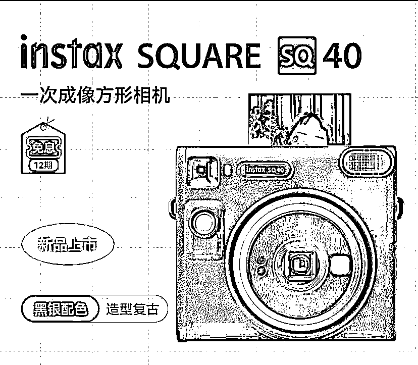

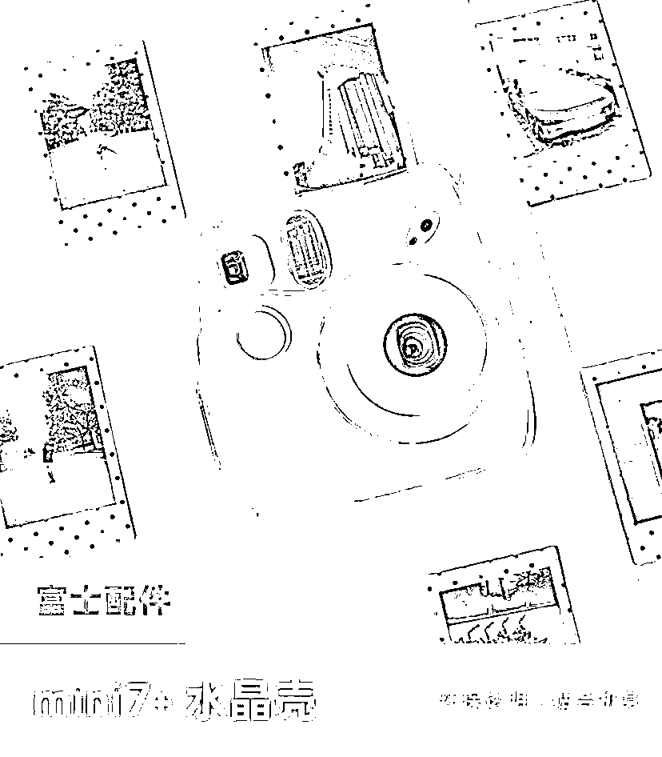

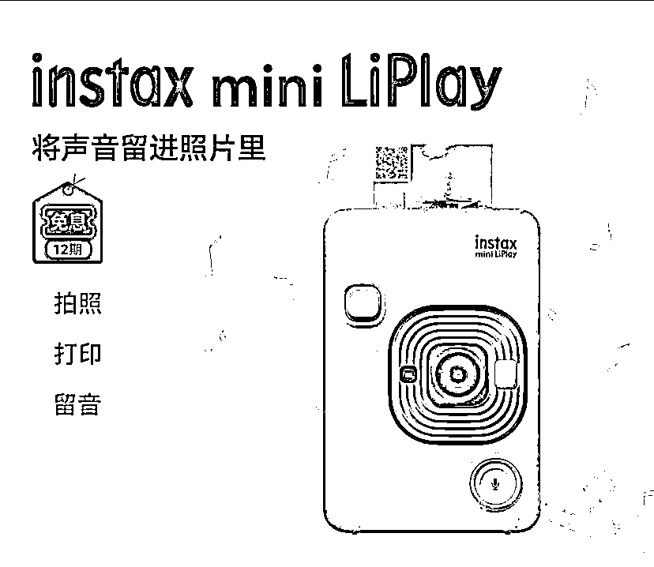

### 2、拍立得摆摊全流程

作为摊主，你的职责本质上就是一个移动摄影师。

你的主要任务：拿着拍立得在路上向游客介绍拍摄服务，拍摄结束后，现场提供即拍即出的相片，游客扫码付款。

摆摊全流程如下：

1.  准备相机+相纸+介绍展示板（以及其他赠送的小礼品，如有）

1.  确定摆摊区域及具体点位

1.  在该点位上以最出片的角度为背景用拍立得拍摄样片

1.  向来往的游客/行人介绍拍摄服务、展示样品、介绍价格

1.  客户扫码付款

1.  为客户拍摄，并提供拍立得照片

# 四、为什么推荐拍立得摆摊

### 1、成本低

星球上目前也已经有关于各种项目的摆摊经验分析，也有整理好的地摊攻略集锦，我都有学习过，并践行在我之前的手作饰品项目的摆摊上。但是手作饰品成本实在太高，逃不掉的大量原材料+人力手工成本，所以至今我还没能回本。不过鉴于它是从我的兴趣衍生而来的，我很喜欢手作，做给自己戴，或者送朋友做礼物，即使没挣钱也可以接受，扯远了～

其他的摆摊例如情人节卖花，以及元旦节卖气球，都是要做提前做好商品采购的，量不好做估计，如果当天同行较多，采购超了最终卖不出去只能砸手里，而我不太愿意承担这样的风险。

但是拍立得摆摊是我目前找到的一个尤其适合初次摆摊的同学的，它对于有拍立得的人来说，也几乎没有其他额外物料成本，只要有人拍摄即可。相纸如果没用完，自己之后完全可以继续用，毕竟一般相纸有效期是1-2年的。

唯一只用考虑囤多少相纸即可。

相纸买多少来源于自己摆摊时计划会卖掉多少，这个也可以参考小红书上的笔记分享➡️

参考截图：其中收入相对低的数据是两小时600块；

估算一下：

两小时600块，一张照片10块来计算，这个姐妹一小时拍了30张，那么两分钟拍一张。这个效率是有点高了，我实操下来，2分钟一张还是比较难做到。

而其他圈出来的例如12小时4000+、15天入账1W的这些情况，只能说他们呈现了这个项目结果比较好的一面，这源于多重因素（有多人组队一起干、线上运营提前预热、多台拍立得设备客单价均值更高等），所以大家不要看到有好的结果就立马囤几百张相纸。

我在这里是想提供一种摆摊思路，建议大家初期可以用两盒相纸去摆摊试试水，看下反馈，之后就有了手感，大概能预估自己每次出摊能卖出多少张了。

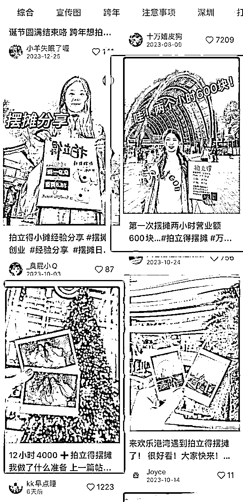

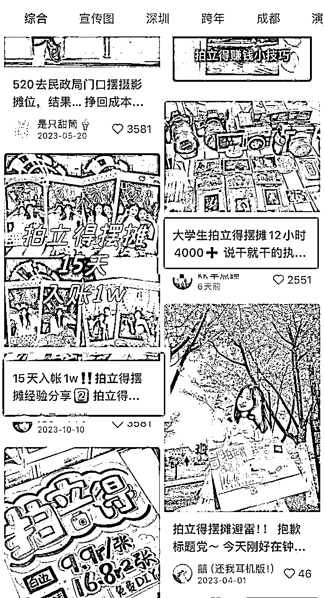

而我自己的具体实操是在2024年1月1日下午4-6点

深圳湾公园摆摊，2小时卖出去了一盒，还是不难的，因为我的装备异常简陋，而且还是自己边玩边摆摊。

如果按照认真摆摊、持续宣传的情况，我差不多3-4分钟是可以拍摄一张，1小时就是15-20张，单张均价10元。扣除相纸成本，收益率差不多是50%，那1小时能赚75-100元，对于摆摊尝试，效果还是不错的。

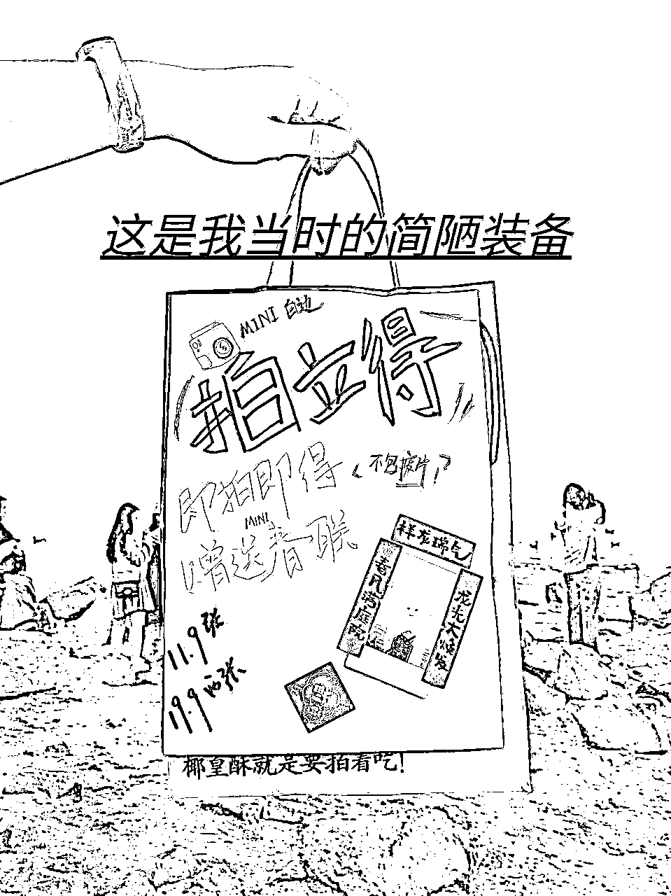

当然，如果自己没有拍立得，或者不喜欢用拍立得拍照的同学，还是算了，毕竟一台相机在闲鱼最少也要300块，拍立得相纸最低也要5块，如果摆摊效果不好，后续也是一样砸手里了，没有必要。

### 2、客群广泛

典型的摆摊尤其看重所在集市或者商场的人流量、客群画像和消费力等各种因素，我之前在深圳龙岗区地铁站门口、福田区的公园集市和深圳湾附近商场摆摊，效果都平平无奇。待一整天最多也才几百块的业绩，还没刨除我的产品成本。

而且非常看重选品，选品不对，一切努力都白费。去年圣诞节那天，我在深圳湾附近商场摆摊，隔壁摊主是卖热红酒的，坐了一整天，一单没出，即使不要摊位费，那也是浪费了一整天时间和那些切好的新鲜水果。

但拍立得相片受众广泛，目标客户就是游客，那你在景区或者网红打卡区摆点，岂不是所有举起相机拍照的人都是你的客户，这种感觉真的很好。

### 3、可以不要摊位费

正常摆摊都要收费的，商场里的摊位更是仿佛租了一个门店一样。

随便展示两个商场集市摊位的定价，这对于客单价低的产品来说是很大的一部分支出了。

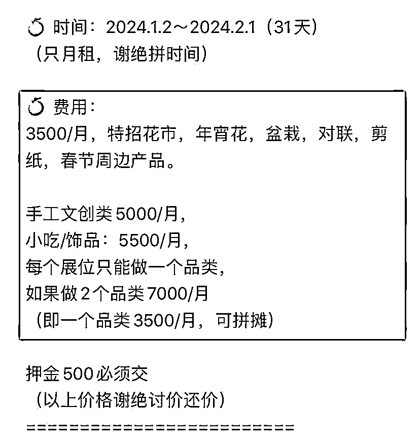

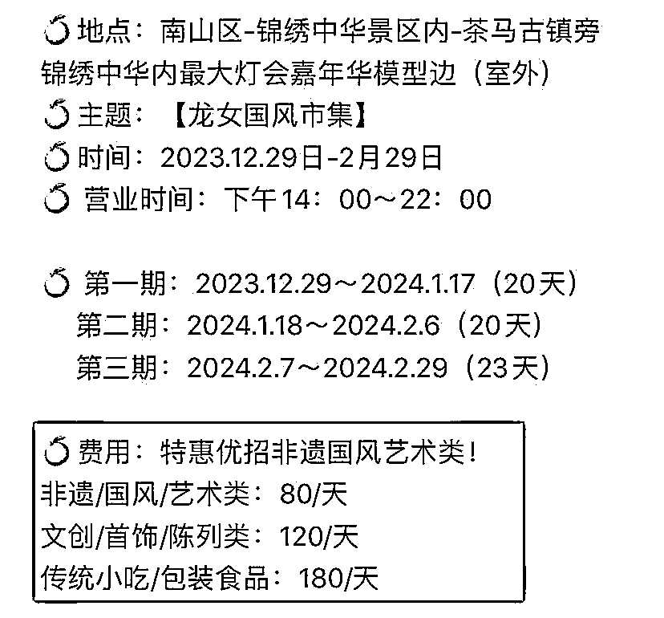

不过拍立得摆摊说是摆摊，其实也可以是流动的，因为你最重要的设备就是一台相机，你甚至可以边走边吆喝，哪里人多去哪里，非常灵活。

当然如果你所在的点位可以免费摆摊，你也可以在固定位置上，支个小摊放上一些DIY的小贴纸贴画或者彩笔等，供客户做DIY（如下图⬇️）增加你的拍立得照片的附加价值，提升客户转化率，也能让你的客人拍照分享帮你打广告。

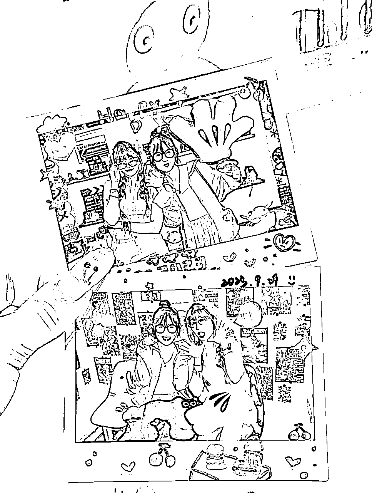

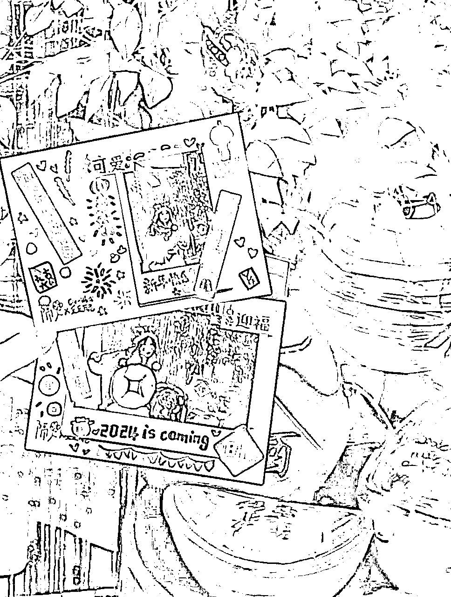

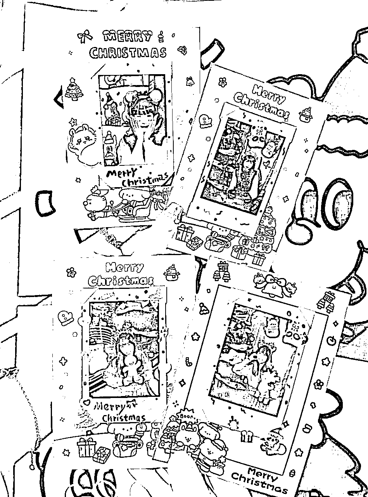

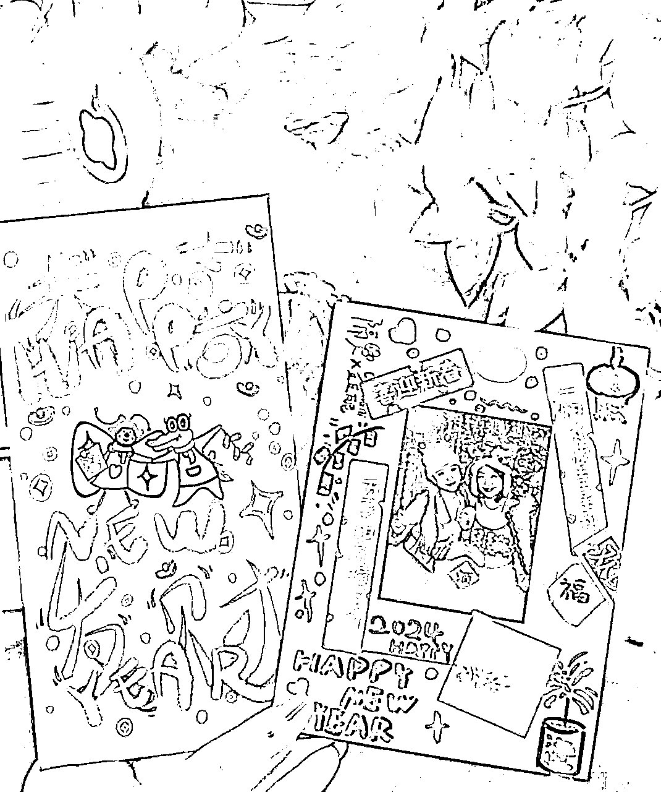

*内容源自小红书，如侵删

# 五、项目来源及思考

### 1、拍立得网红门店

现在网红的拍立得照相馆很火，很多小姐姐会专门去打卡。

我在年底去上海时，也体验了一把，店内很小，每面墙都装饰成了拍照背景，店里有个DIY手工桌，供客人在拍立得上贴贴纸和写写画画。成品做出来真的很出片，打卡发平台还能获得小礼物。

就是这样的简单模式，门店生意络绎不绝，小小的店铺很拥挤，唯一拍照的那个小姐姐忙到一刻没有坐下。

甚至周末还需要提前去拿号才能拍得上！

小红书上有很多抱怨的说拿到号了都没能拍到要大家避雷，可见需求多么旺盛。

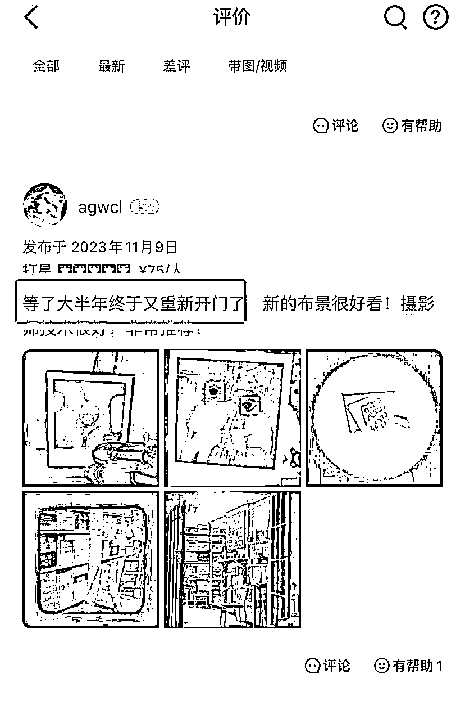

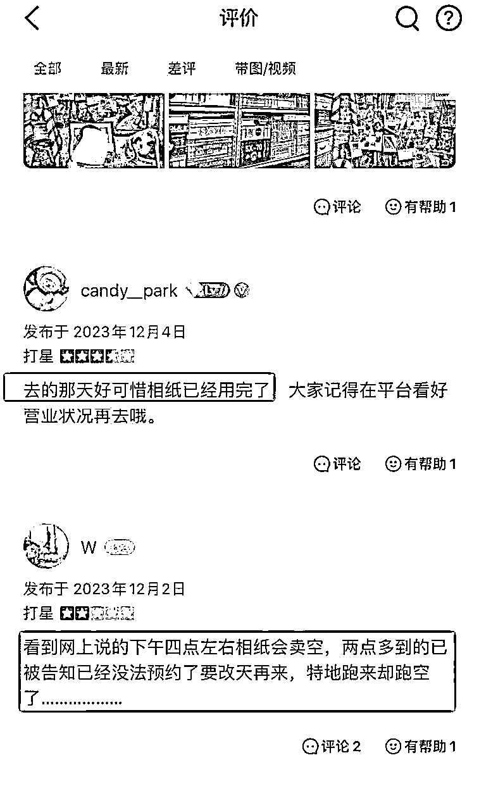

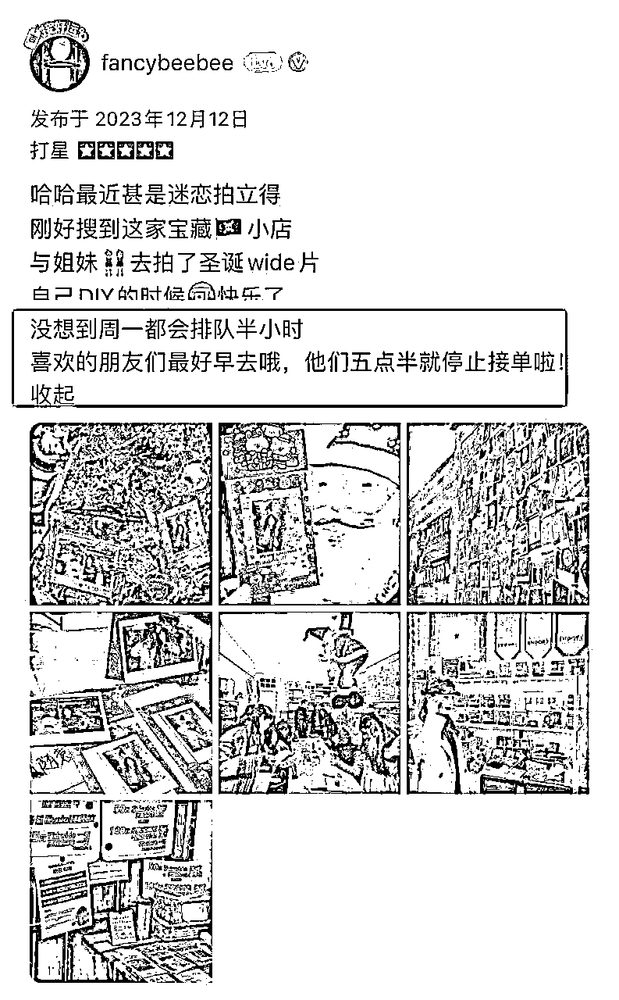

### 2、自己旅行途中的需要

依据我作为用户的需求，如果在旅行途中，能获得一张实体的拍立得照片，是会大大增加幸福感的。

曾经我在桂林梯田就主动找了旁边用拍立得拍照的小姐姐帮忙给我拍了一张，所以这个需求是真实存在的。尤其是在景区，稍微宣传介绍一下，客人也是很愿意买单的。

* * *

接下来我会通过保姆级教程来分享拍立得摆摊步骤和注意事项，覆盖了所有的实操细节！

争取在你看完后，可以立马实操，挣到你的第一笔摆摊收入！

# 六、摆摊前准备

### 地点选择

一定选在人流密集的地方，有好看的景色或者地标性建筑，最好是在游客多的区域。这样满大街的人都是来玩来拍照的，那都是你的潜在客户，根本不愁没有客流。

### 装备

*   如果是第一次试水：那就直接准备一个纸袋，里面装相纸和小礼品（准备赠送的照片小贴纸，如有），外面写上价格、规则和宣传文案，可以用亮色的彩笔画得吸睛一点。

*   如果有丰富的摆摊经验了，想要提升客单价和转化率：也可以准备一个广告牌，把介绍文案做的醒目一点打印下来，如果是晚上可以用灯牌或者ipad，这样可以让客户一眼了解所有信息。

*   如果有固定点位：可以参考拍立得门店的DIY，准备一些相纸贴纸、贴画、卡头卡背，这些在pxx上都很便宜，一点小成本就能让你的照片很出彩，也和同行拉开差距，有利于后续线上运营，引流更多客户。适用于要长期拍立得摆摊的小伙伴。

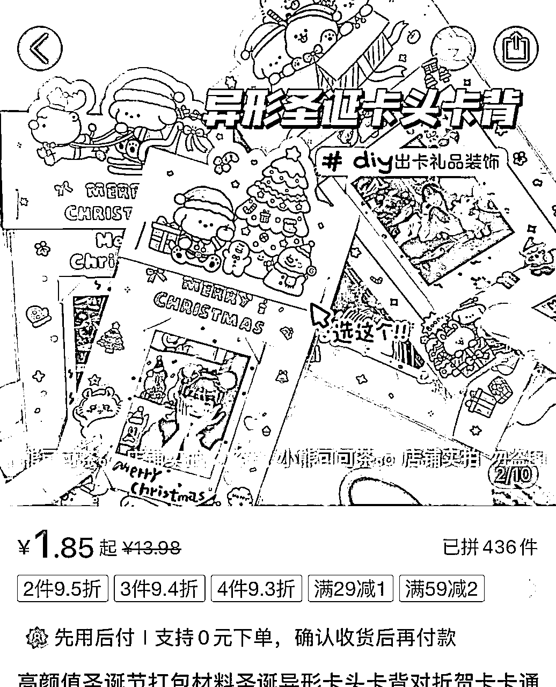

### 相纸准备

拍立得相机不贵，相纸越来越贵，很难买到原价的相纸。在网上搜罗了一圈，给大家提供相对便宜的相纸购买渠道：

1.  淘宝：富士宏敏专卖店。直播间不定时上架58元+10元邮费的10张懒蛋蛋、皮卡丘的花边相纸。

1.  淘宝：富士宏腾伟业专卖店。直播间不定时抽92元买20张白边相纸的购买权益。

1.  淘宝：展兄数码。有60元包邮不限购的花边相纸。

1.  淘宝：秀水数码专营店。不定期上架90元+邮费的20张白边相纸。

### 定价

mini型号的拍立得可以定价为：单张9.9/11.9/15.9元，两张16.6/18.8/19.9元，可根据当地消费水平或者拍立得型号做调整。

另外如果是彩色边框的相纸或者是宽幅的拍立得都可以适当上调价格。

### 同伴

最好有同行一起的人，可以帮客人拿包包和水杯，这个在海边拍照还是很需要的。

### 拍照pos准备

提前下载一些个人拍照或者两人拍照pos照片。因为实际给客人拍时，会发现大家都不知道怎样的动作合适，如果能提供pos指导，会高效很多，也会更出片。

其实就是自己就是在做一个摄影师的角色，摄影师拍摄时通常也需要指导动作和角度。

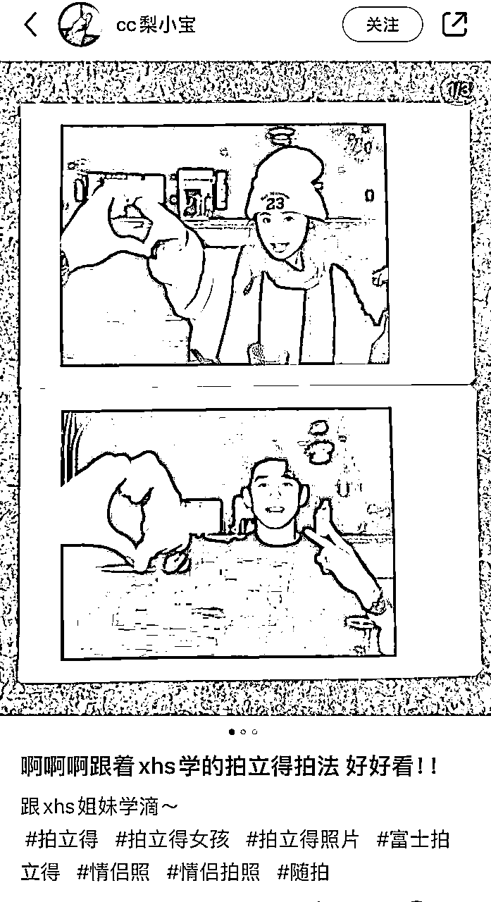

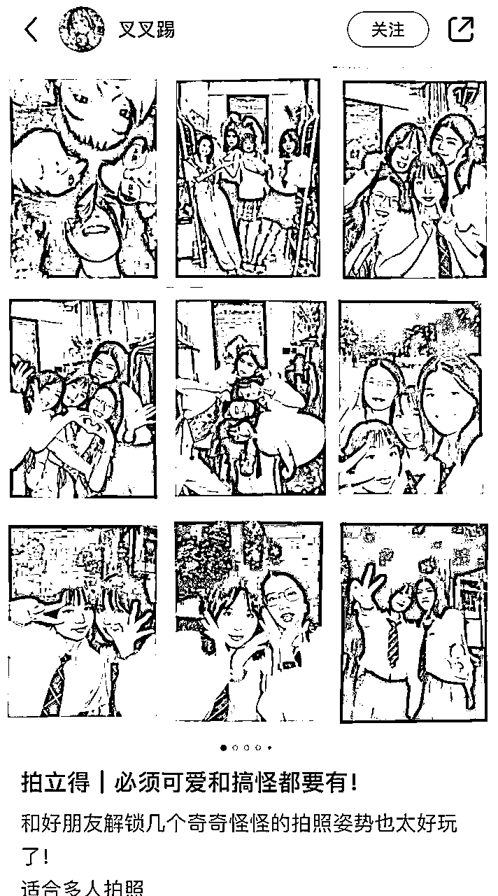

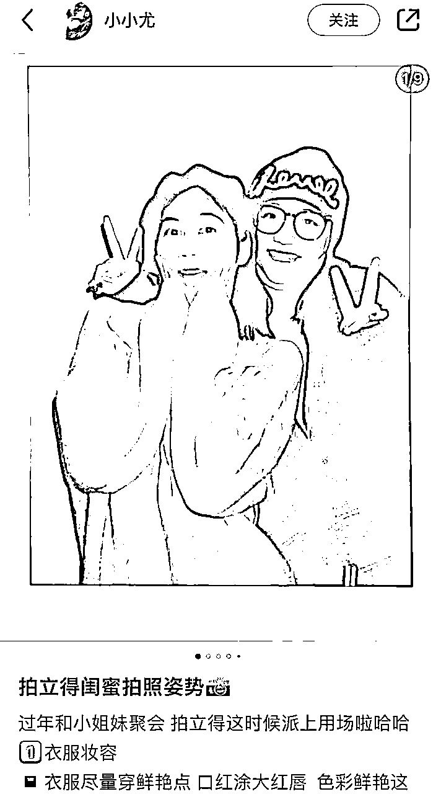

### 道具准备

情人节可以带花，春节可以带糖葫芦、圣诞节可以带红色围巾或手套，都是可以作为给到客人拍照的小道具，有的话可以增加效果，让你的出片比同行更具特色，没有的话也没关系。

### 提前建群

如果需要，可以打印群二维码，现场给客户拍摄后，邀请入群并引流到私域，做后续的运营和转化。

下次再出摊也可以提前宣传通知。

### 避免过地铁安检

小红书上有些笔记提到相纸不能过地铁安检机，会让相纸都过曝。经过我的经验，相纸如果拆开装进了拍立得，整个拍立得最好就不要过安检了。如果是未开封的相纸，是可以过的。

### 小红书预热

可以提前在小红书等平台上发布即将拍立得摆摊的预热笔记，记得带上地点标记，这样在对应地点的游客可以在小红书上直接约你拍照啦～

# 七、摆摊中注意事项

### 具体地点

首选一个容易出片的点位，因为游客是流动的，所以自己可以不动，在一旁观察有合适的客人就赶紧上前介绍。

### 拍立得模式

如果型号是mini7+（7c/7s/8/9） 可以参考：白天户外空旷首选大太阳模式，树荫屋檐和黄昏阴天的选择云朵，阴影处选小房子。可以有效防止过曝或者太暗的问题。

### 样片拍摄

如果是室外，拍立得的照片根据光线强度及角度呈现不同效果，所以选定地点后，先给自己拍摄一张样片，看下效果，以防直接上来给客户拍的光线不好。如果样品黑了就往黑的模式调整（往小房子模式调），如果太亮或者过曝了就往亮的模式调整（往大太阳或者小太阳模式调）。

### 客人选择

最好是一对情侣，我有一半都是给情侣拍的，情侣之前会喜欢这种有仪式感的小物件。其次是一对姐妹。对于两人一起拍会比较好直接卖掉两张，出单更高效。另外需要避开自己带设备的客人，专业玩家瞧不上拍立得，会觉得是玩具。

### 需求明确

一定要问客人想拍到哪里？半身还是全身？竖着还是横着？人大一点还是小一点？确保明确需求，因为按下快门成本就出去了。

### 规则说明

拍摄前明确说明不包废片。可以只在全黑、全白或者发绿的情况，给客人重拍。降低自己的损耗。

### 客片拍摄

拍完后询问客人是否可以拍下买家秀，因为在给其他客人介绍时会被问到：拍摄效果怎么样呀？所以买家秀可以作为样片展示，也对于后续线上引流有帮助。

### 辅助变现

如果你有其他单反类专业设备，也可以给客人拍，因为愿意拍立得留影的人，通常也愿意用其他相机拍。可以增加多一种变现方式。

在小红书上搜索关键词“摄影摆摊”，也有很多通过摄影赚钱的人，如果喜爱拍照，有拍立得或者单反的小伙伴，都可以尝试一下！

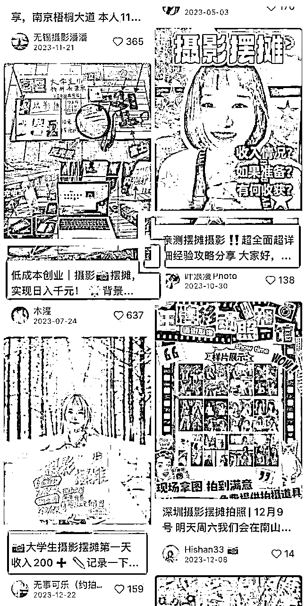

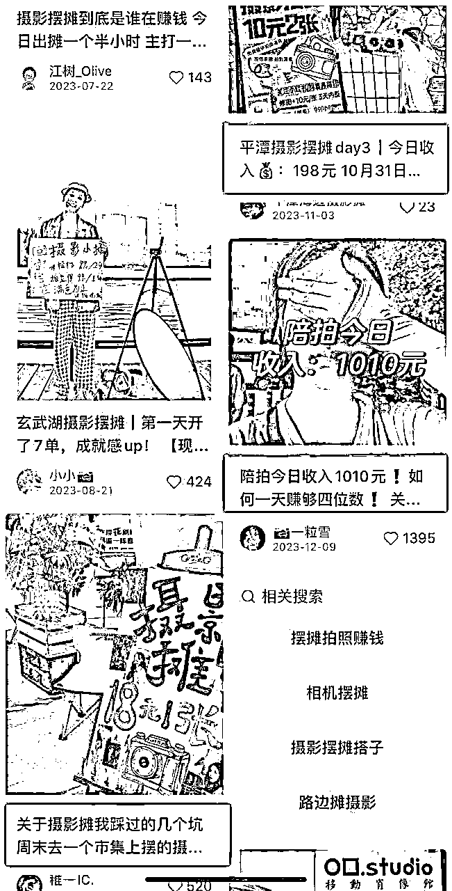

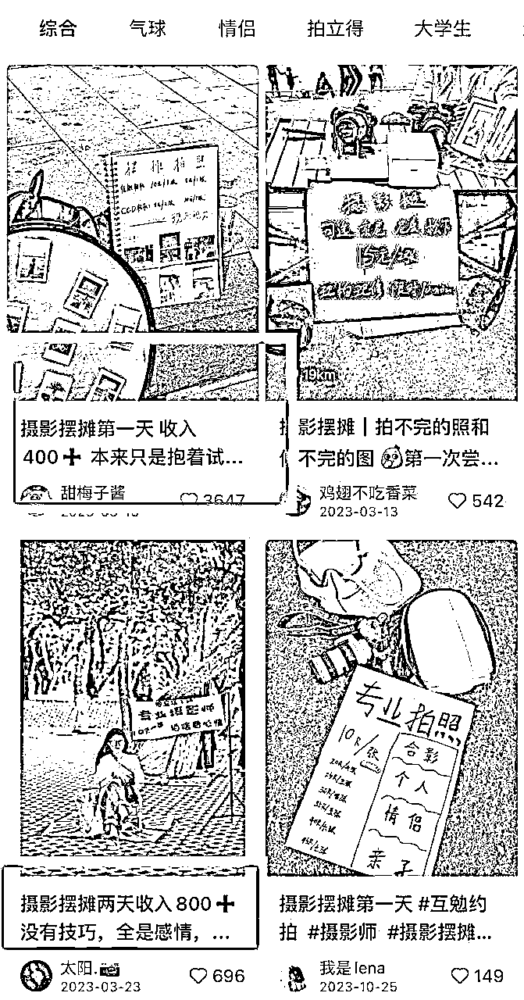

### 注意城管和保安驱赶

有的地方城管比较严格，可能会驱赶，甚至收掉你的广告牌等，可以提前先去踩点看看，或者在小红书上了解哪里摆摊安全再尝试，不要让第一次摆摊遇到城管而浇灭你后续摆摊的热情。

### 固定点位

尽量不要更换地点，可能会有线上的顾客或者老顾客过来。

# 八、摆摊后

### 线上平台宣传

好的客片可以发在平台上，作为自己的作品宣传，经营得好，会有用户在底下评论XX时间还会不会去拍呀，这客流就从线上引流到线下啦，源源不断。也可以分享拍立得摆摊经验在平台上。

### 相机维护：

如果拍立得后续长期不用，一定记得把电池取出，否则电池很可能漏液损坏拍立得（别问我是怎么知道的）。

# 九、预估收入

拍立得摆摊首先靠人力拍摄的劳动成本，其次相纸是硬成本也很不便宜，所以利润空间相对有限。

估算了下一天一个人拍摄8小时，封顶拍摄160张，以单张平均售价10元，相纸单张5元成本为例，使用mini拍立得设备能达到800元收入。

如果使用宽幅的拍立得，收入预计还能提升15%达到920元左右。

它更适合想低成本体验摆摊的小伙伴，毕竟行动力很重要，而且只要你愿意去介绍你的服务，大概率能出单，这个小项目能让你收获到信心，也有利于后续在其他项目的探索。

# 十、写在最后

这里我更多是提供一个思路，一切有需求的地方都能做生意，这很有趣。

最后感谢生财提供的交流平台，在生财上也看到了很多干货实战的帖子，链接到很多优秀的同行小伙伴，2023我的年度关键词是勇敢+感恩，希望2024的年度关键词里会有利他。

这是我在生财的第一篇帖子，很感谢陈雪和鱼丸提出的真诚建议！

如果这份实操手册对你有用，欢迎在帖子下面评论呀，一起交流。