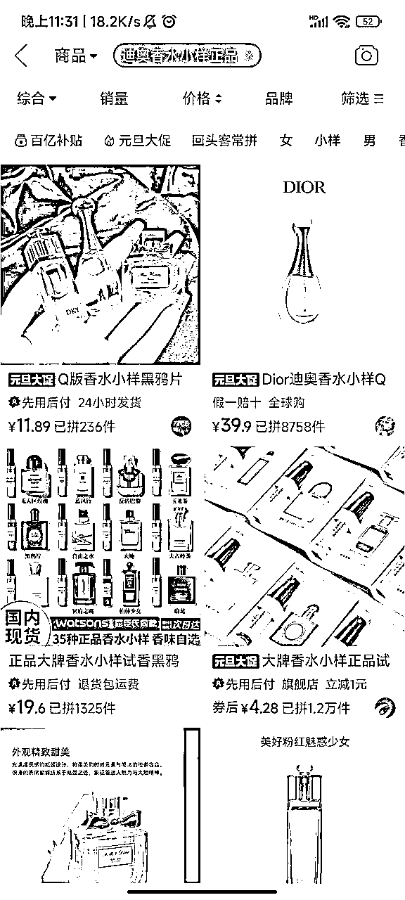

# 风向标拆解第 2 期--小红书送礼账号真的赚钱吗--磊爷

> 来源：[https://sznbedsl1y.feishu.cn/docx/WdqndGmlmoVDZUxb4FOcYldtnJg](https://sznbedsl1y.feishu.cn/docx/WdqndGmlmoVDZUxb4FOcYldtnJg)

一个项目有很多种拆解方式，但一定会涉及流量和产品，两个关键环节。

所以，当我们能搞清楚流量怎么来，产品怎么解决以后，就能知道这个项目大概长什么样子；再通过核算成本与利润，就能知道这个项目是否值得做；最后通过拆解可达路径以及矩阵玩法，就能知道这个项目自己能不能做，有多少放大空间。

以下是4个项目拆解需要解决的核心问题：

✅流量怎么运营？

✅产品怎么解决？

✅利润怎么核算？

✅项目如何做&如何放大？

# 案例拆解

接下来我会以小红书-用味道写一封情书为例，为大家进行拆解。

#### 基本情况

账号：用味道写一封情书

类目：送礼账号

带货形式：通过图文起号，日常更新，图文挂车。

选择该账号拆解的原因：

*   小红书一家专卖香水的礼品店👉垂类店铺

*   靠图文带货👉起号简单

*   一款香水销量2k+👉销量很高

## 1 流量怎么运营？

该账号免费流量主要来自图文笔记，下面将重点分析这个板块。

1）图文信息（30天）

（笔记里12月3号第一条笔记）（数据不准确，赞藏总数和展示出来的笔记赞藏数不一致）

*   新增图文60条，其中挂车50条，基本全挂车，尽可能多的引导用户购物。

*   一天发2条，以量取胜，内容很简单，差不多是相同的商品图，基本每隔30条图文，会出现一个几百赞的小爆款。

*   从某一天发的笔记，里面提到了「显贵」关键词，流量开始增加，后续笔记基本都是「显贵」礼物。

*   图文内容：每个图文放多张香水图，主图是香水外观。标题，“xxxr……却被误以为很贵的xx（节日、生日）礼物”，精准吸引想送礼，但是想送看起来「高端不贵」的用户（送出去的东西，退货率不高）。

2）视频信息（30天）

*   新增视频10条，其中挂车10条，基本全挂车，尽可能多的引导用户购物。

*   几天发1条，可能是测试不同内容出单。

3）付费投流情况

*   不清晰。

4）结论

*   图文：通过挂车尽量引导用户购买；通过怼量来打造爆款；通过垂类产品和「高端不贵」，精准吸引送礼用户。是出单的大头，基本全是图文笔记出单。

*   视频：坚持发视频，也可以承接一部分图文来的流量，图文爆了的内容，做成视频也爆了。

*   付费流量：不清晰。

## 2 产品怎么解决？

用味道写一份情书专卖香水，显示的是小红书个人店。没有找到直接货源，不过这个香水也不能保证正品，虽然评论里面很多想要的，但是担心是不是正品的也很多（不影响有人买）。

可以无货源，或者闲鱼找其他代理商拿货发货

1）闲鱼

*   没找到可以直接发货的（可能会违规），但是闲鱼上会有代理，也有单独卖的，可以做整合，单个利润在10%左右，但是比较费精力，这个店看起来不是这种模式

2）自备货源模式

*   闲鱼购买礼盒，拼多多买香水小样，组合出来。

*   利润率10%-20%（差价）

*   香水礼盒1差价：礼盒100（可能更便宜）+4瓶便宜正品香水（100左右），总价200左右，售价229

*   香水礼盒2差价：礼盒80+4瓶正品香水小样（80左右），总价160，售价178

## 3 利润怎么核算？

1）收益分析

*   利润率10-20%

*   单月售卖2000+件

2）成本分析

*   资金投入：保证金+少许投流费用+垫付资金+工商执照费用。

*   正常退货率30-40%（礼品退货率应该低一些）

3）综合利润

*   按最低算（利润率10%，退货率40%，销售额40w），实际到手为2.4w

*   按最高算（利润率20%，退货率30%，销售额40w），实际到手为5.4w

最后减去前期的开店费用，综合来看，这个号是赚钱的，单店月利润区间为，2-5w。

## 4 项目如何做&如何放大

#### 1）项目如何做

一句话：图文持续发。

项目核心：坚持。

1.  开通店铺

1.  资金投入：保证金+少许投流费用+垫付资金+工商执照费用

1.  开店：一个人办2-3个店；每个店都要有一个营业执照。店开多了容易连坐。

1.  开通橱窗（图文挂车）

1.  条件为：实名认证；

1.  找到对标账号（操作简单、涨粉快），进行模仿

1.  选品方法

1.  赛道定位：越垂越好，比如只卖香水。

1.  整体流程：选品-测品-微付费，只要能正常测出一个小爆品一天20件 基本上一个月的利润过万是比较容易的

1.  选品方法：找到15天内起的速度特别快的同行新号

1.  测品标准：如果在五天内里面点击率没有超过15%的款，或者支付里没有超过5%的款承接

1.  付费投放：

1.  图文起号

1.  基本要求：画质清晰，数量大于等于 2 张

1.  图片来源：选品或找对标账号时积累的素材；其他平台的素材；自己实拍

1.  图片去重：通过加贴纸水印、抠图、拼图、提升画质等方法，进行去重，换背景实拍

1.  连怼玩法：一天至少2条图文，用数量博取爆款概率。

#### 2）项目如何放大

1.  矩阵放大

1.  多店操作：一个人开2-3家

1.  多账号操作：1人5个号，每天10条图文，相对比较轻松。靠图文带货。

1.  多平台操作：小红书成功后，可以将玩法同时复制到视频号、快手、抖音等平台。

1.  付费投流

1.  投流主要用于测品，测出爆品后，还是靠自然流进行转化

1.  如果roi低于3，一般都属于打不正，亏本状态。

## 5 项目结论

从上面的分析来看，垂类图文+爆款的模式确实是有机会的。单店月利润区间为，2-5w，利润可观。

这种图文送礼模式确实能做，通过1天多条图文以及矩阵的形式效果比较好；付费投放没仔细分析。