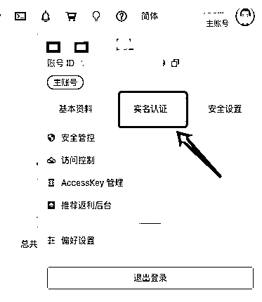
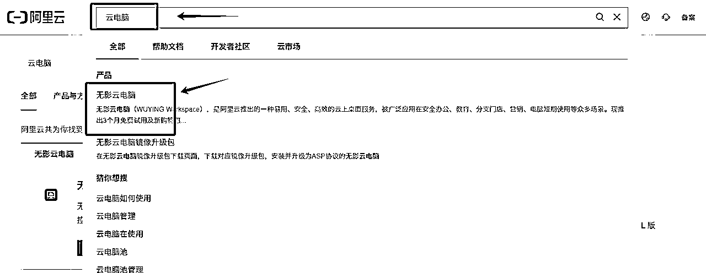
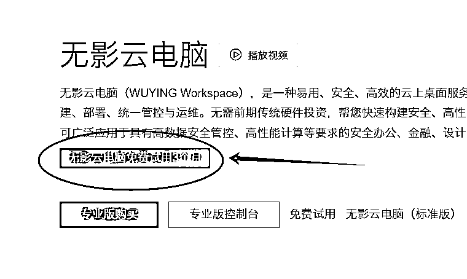
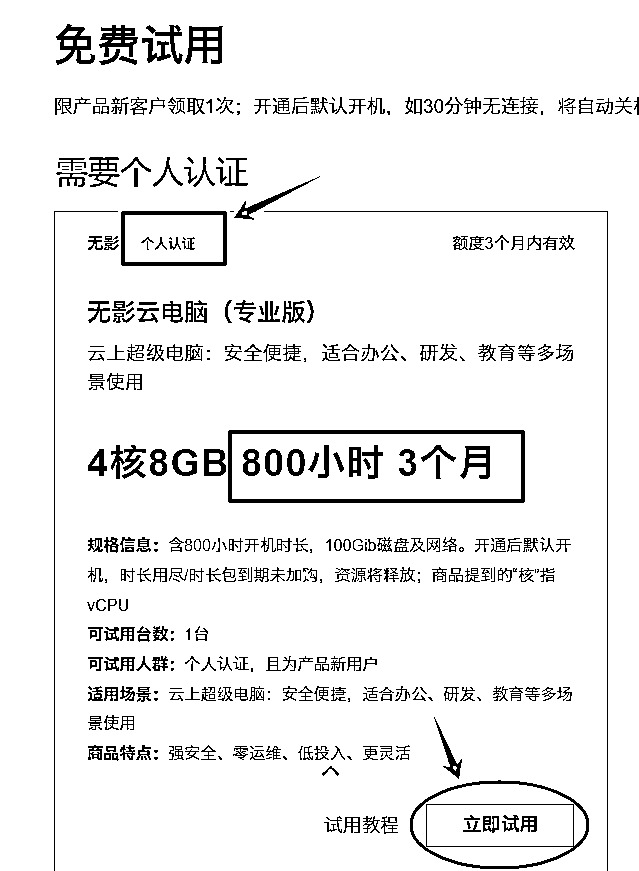
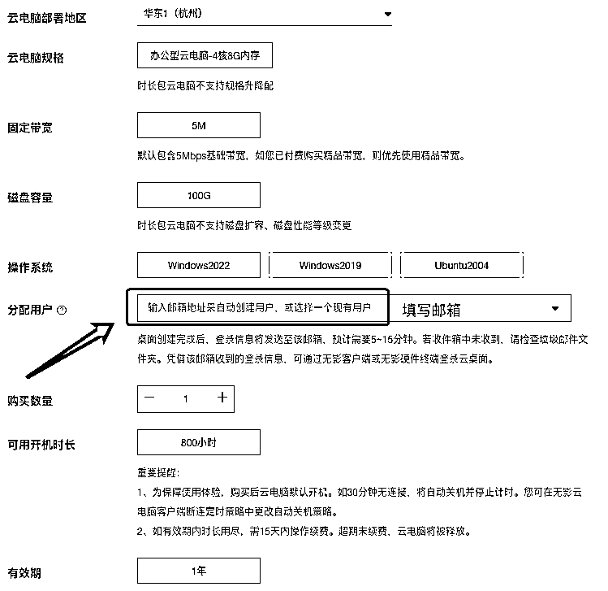
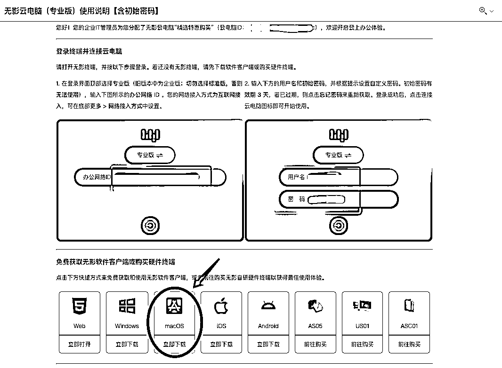
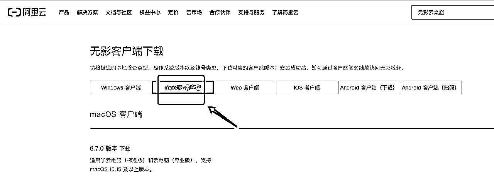
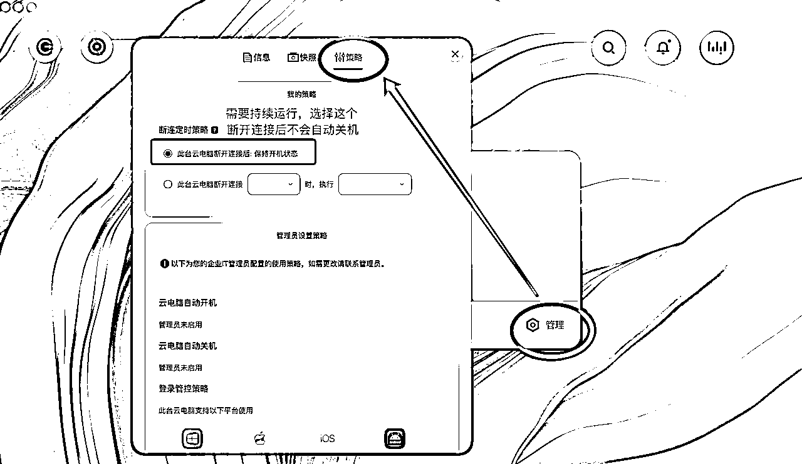
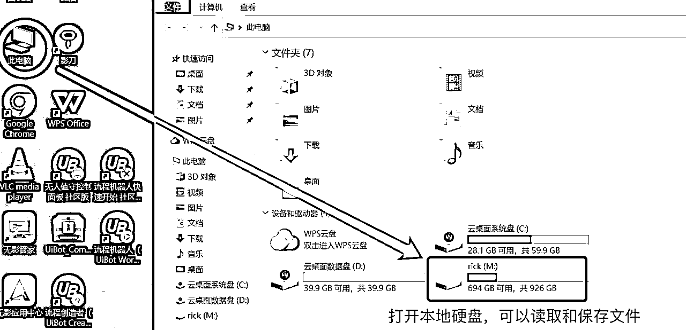

# RPA云端方案 ｜ MAC用户如何简单快速用上RPA？

> 来源：[https://ih195hg9y3.feishu.cn/docx/XC0Rd0Vt2oU3Pqx3HJuc98BYn3d](https://ih195hg9y3.feishu.cn/docx/XC0Rd0Vt2oU3Pqx3HJuc98BYn3d)

很多使用MAC作为主力设备的圈友，在RPA航海刚上船就被卡住了，uibot没有MAC版，影刀虽然有MAC版，但是功能和稳定性比起Win版，也是差了一截。

如果现在选购Win电脑加上物流都得花上几天，安装双系统虚拟机又更繁琐，那么，MAC用户怎么低成本地丝滑开始用上RPA呢？

刚好今年阿盛也刚换了MAC电脑，所以找到的一个免费且快速的解决方案，是用阿里的无影云电脑，原因有4点：

1.新用户可以免费使用3个月，有800小时的运行时长，足够完成新手入门的阶段。

2.相对其他云电脑，系统更加接近本地的Win环境，不用费心在环境配置。

3.无影云电脑有MAC客户端，操作更加方便。

4.试用期后，199/年可以买800小时版的云电脑，成本也相对较低。

其实这个方案，对于正在使用WIN系统的用户，同样有用，配置云端环境后，不会占用现有的电脑，随时可以远程控制。对于WIN系统出现各种奇怪问题，没法运行的朋友，也可以临时用这个方案，学习技术u优先，别在环境配置阶段浪费太多时间。

简单6步，开启RPA云端运行环境：

1.进入阿里云官网：https://www.aliyun.com/

2.注册账号后，点击右上角头像，选择“实名认证”，按认证指引完成操作。（免费试用必须是实名认证的用户）

3.搜索“云电脑”，选择“无影云电脑”

4.选择“免费试用3个月”

5.在配置页面里，填写一个用来接收初始账号的邮箱地址

5.在邮箱里会收到初始的账号信息，在页面下方下载客户端，然后使用ID和账号登录。

如果邮件里的链接没法跳转，可以用官网的地址，在下载页面选择macos客户端：

https://www.aliyun.com/product/wuying/download

6.在客户端登陆进入云电脑，自带有chrome浏览器，但是还需要下载必备的RPA软件和wps，后面就可以按照航海手册的操作开工了。

系统默认是断开连接后，也就是关闭窗口后，30分钟就会进入休眠，RPA就没法运行，如果有任务需要一直运行，在管理-策略 可以进行修改。

同时附上传送门，可以直接下载：

uibot：https://down.uibot.com.cn/OFFICIAL/UiBot/6.0.1/UiBot_Community_Official_X64_V6.0.1_2022.06.29.1740.exe

影刀：https://www.yingdao.com/client-download/

WPS：https://platform.wps.cn/

微信（方便传图片和文本）：https://pc.weixin.qq.com/

如果从云电脑完成了数据抓取，可以直接在“此电脑”找到本地硬盘，保存到本地文件夹，同样也可以进行文件上传。

以上，就是RPA的云电脑教程，MAC用户可以无缝衔接进入RPA的世界，WIN用户如有需要，可以多开设备进行批量操作，预祝各位在自动化之路一往无前～