# 风向标拆解-怎么在小红书做一个赚钱的身心灵账号-木土

> 来源：[https://wfxjxt5sza.feishu.cn/docx/YEoYdq6dhoLMOOxSTetcvlj5nEc](https://wfxjxt5sza.feishu.cn/docx/YEoYdq6dhoLMOOxSTetcvlj5nEc)

# 项目背景

疫情开放后，年轻人更在意自己身体及心理的健康程度

在高速和高压的生活中，都希望有一个可以迅速恢复身心能量的方式

就自己身边人，很多人白天养生（枸杞加红枣），晚上养“心”（正念，冥想）

而且在生财听到多次听到多个大佬提到身心灵赛道

所以向拆解了解下身心灵赛道是怎么盈利及门槛有哪些

# 了解身心灵

什么是身心灵

## 身：身体

包括身体的健康、健身运动、饮食营养、睡眠质量等

如:舞动、芳香疗法、身体调理、瑜伽、冥想、音乐疗法、中医等身体上的疗法

## 心：心灵

关注情绪健康、心理抗压能力、自我意识、情绪管理、心理成长等。

如：情绪、情感体验、正念、心理学、催眠、专注力等

## 灵：精神

探索个人的意义和目的、寻求内心的平静与连接、实践冥想、修行、宗教信仰等。

如:儒释道、圣贤文化、佛学、国学、阿卡西、塔罗、占星、能量疗愈、显化、命理、风水

身心灵只有一个目的：摆脱痛苦，获得内外在的和平和幸福

# 拆解框架

需求：身体的感官给心灵创造愉悦，舒适满足等情绪， 对情绪和精神进行疗愈的用户

流量：小红书流量分为免费流量和付费流量

*   免费流量：直播，笔记（图文/视频），搜索

*   付费流量：薯条推广，达人推荐

营销：

*   免费福利课/低客单小课程引导➕微信

*   小红书群聊转化

*   直播

变现

*   卖疗愈周边商品：木鱼，手鼓，书等

*   个案咨询

*   接广告

*   课程变现

*   1v1服务

*   线上陪伴群

*   线下修心营

# 怎么做一个身心灵账号

## 图文

#### 优点

1.  无需真人出镜

1.  快速出稿，用数量博概率，起号快，容易拿到正反馈

1.  可矩阵化

#### 缺点

1.  无人设，没法建立信任感，后续不好转化

1.  同质化严重

#### 案例

1.  空青。(粉丝数:9.8w 赞粉比: 4:1)

*   特点:清单列举式内容，配色看起来舒服

*   笔记制作:

*   背景用 PS (形状+高斯模糊+渐变) 做好后 可以用稿定设计或者可画做模板

*   文案: 知乎，抖音，小红书等找疗愈文案

*   产品

*   疗愈陪伴营:399 元 21 天

*   同质化内容

小红书上很多每日正念内容，模板文案基本一样，背景图我自己做了几个也收集了一些阅读体验问题先提供两个底图，

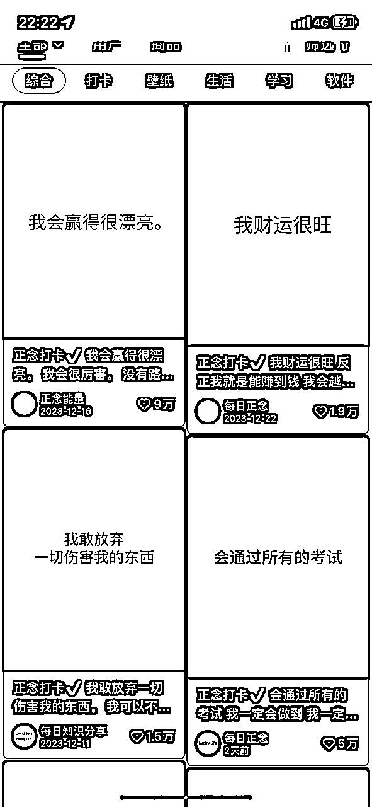

## 真人出镜

所有平台上的用户都需要信任感，而真人出镜是建立信任感最好的途径

有信任感才容易出高客单

身心灵最核心的是词「舒服，愉悦」，所以视频最重要的要有氛围感

怎么搭建一个有氛围感的是入场前必须思考的

#### 案例

##### 卖陪伴

###### 案例账号: 朱诺 (粉丝数 11.6w，赞粉比 12:1)

<h7>账号介绍</h7>

IP:为需要心理疗愈的人提供陪伴的生命教练

是否MCN:是

更新频率：一周 2～4篇

粉丝画像：一二线女性

笔记特点：真人出镜，视频

<h7>转化方式</h7> <h7>1V1 陪伴服务</h7> <h7>课程专栏</h7> <h7>利润预估（多为私域产品，无法预估）</h7>

| 收费项目 | 价格 |
| 生命教练体验陪伴 | 500 |
| 生命教练陪伴 | 5500/12次 |
| 恋爱课程 | 138 |

<h7>引流方式</h7>

评论区私信引流

##### 卖会员卖课

###### 案例账号: 能量派钰昕(粉丝数 11.6w，赞粉比 12:1)

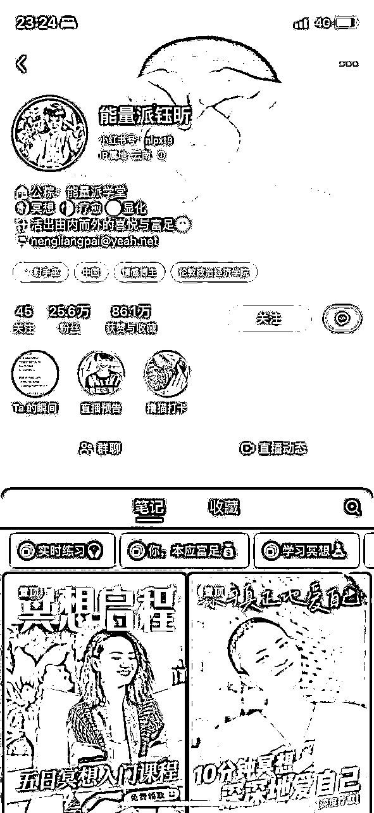

<h7>账号介绍</h7>

IP:为需要心灵成长和疗愈的人提供体系化的课程和陪伴式训练营

是否MCN:否

更新频率：一周 1～2篇

粉丝画像：一二线女性

笔记特点：真人出镜，视频

<h7>转化方式</h7> <h7>小鹅通课程</h7> <h7>小鹅通会员</h7> <h7>利润预估 ：332w</h7>

| 收费类型 | 价格 | 售卖数量 | 总价格 |
| 会员费 | 2088/1年 | 362 | 75w |
| 会员费（觉醒者） | 2988/1年 | 342 | 102w |
| 训练营 | 4888 | 232 | 113w |
| 训练营 | 5888 | 102 | 42w |

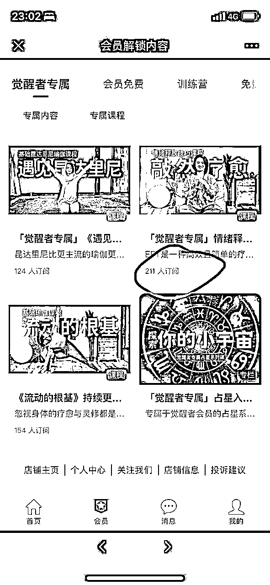

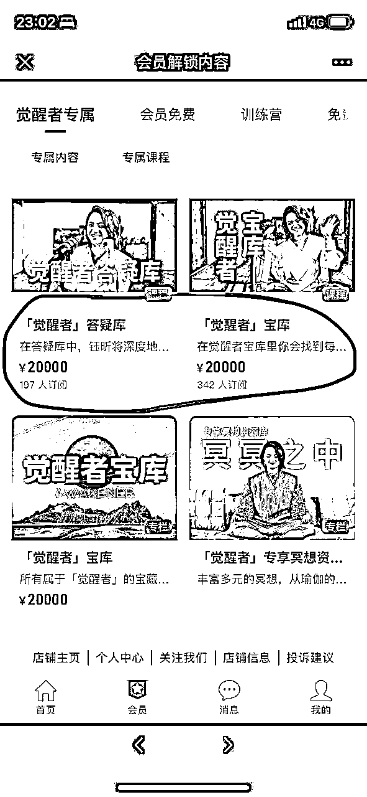

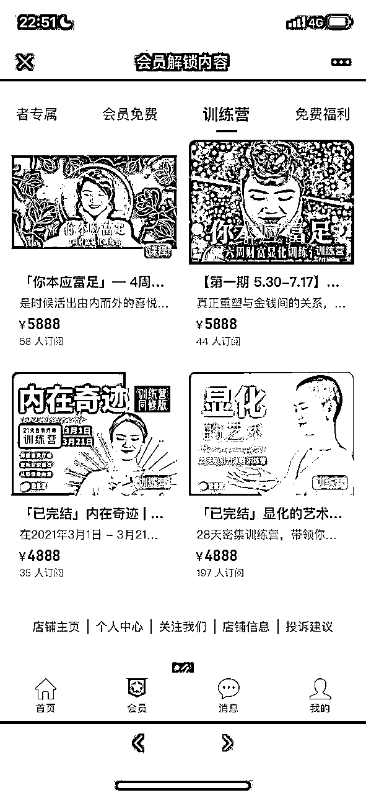

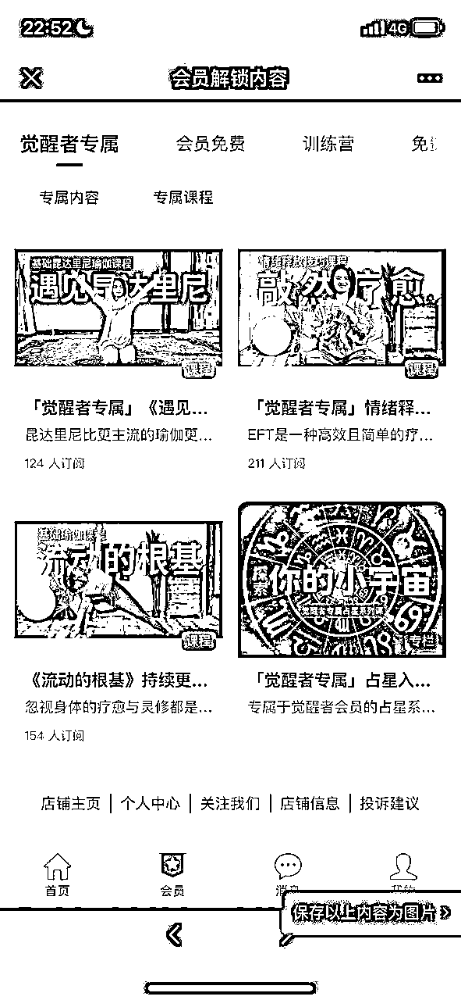

<h7>引流方式</h7>

*   小红书首页置顶免费课程 -->小红书群聊 --> 公众号

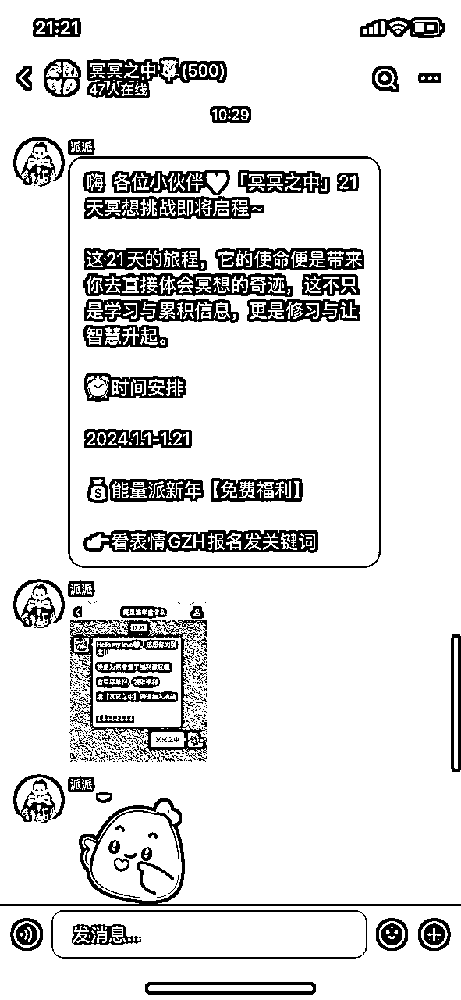

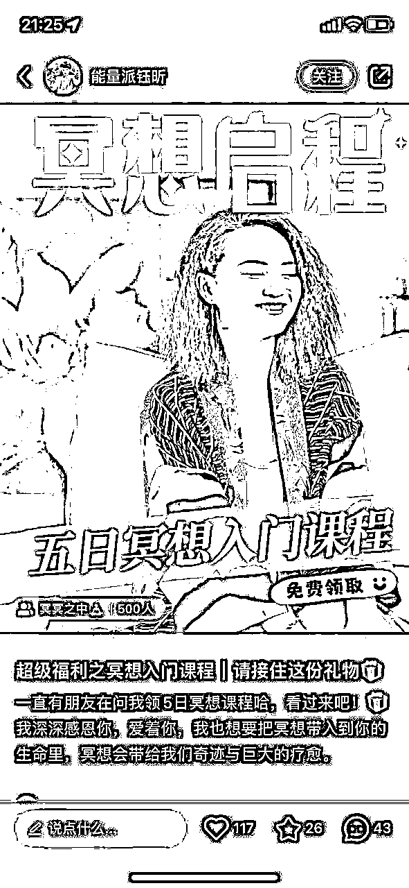

*   直播引导群聊 --> 小红书群聊 --> 公众号

##### 教人做疗愈

###### 案例账号: 柿橙 (粉丝数 1663，赞粉比 1:4.2)

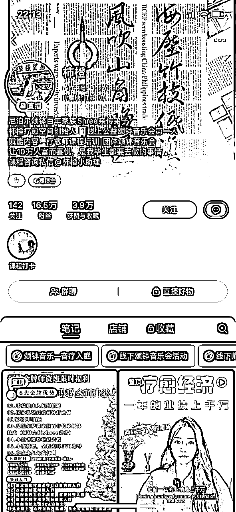

赞粉比异常: 基本每天都在直播，通过直播卖课涨粉

参考数据

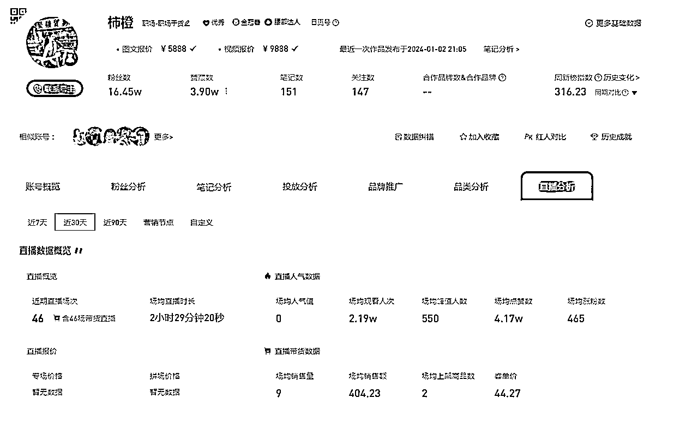

<h7>账号介绍</h7>

IP:为想学习颂钵疗愈的人提供线下课程

是否MCN:否

更新频率：一周 3～6更

粉丝画像：一二线女性

笔记特点：线下课程实拍分享+真人 ，图文+视频

<h7>转化方式</h7>

*   薯店自制网盘音乐

*   直播带货

<h7>利润预估</h7>

| 收费项目 | 价格 | 售卖数量 | 总价格 |
| 颂钵疗愈音乐 | 39.9 | 2000+ | 8w～10w |
| 进口钵 | 491 | 34 | 16.69w |
| 线下疗愈课程 | 4988 | 未知 |  |

<h7>引流方式</h7>

*   小号评论区&主页引流微信

 <h7>

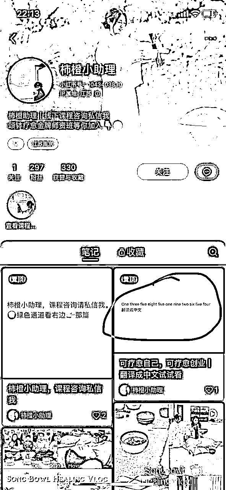

*   群聊

##### 线下训练营

###### 案例账号: SY三 (粉丝数 1663，赞粉比 3:1)

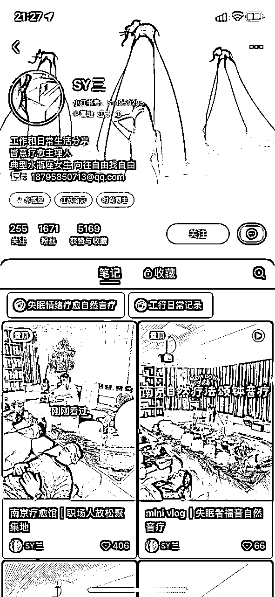

<h7>账号介绍</h7>

IP:为需要疗愈放松的南京人提供线下颂钵疗愈

是否MCN:否

更新频率：日更

粉丝画像：一二线女性

笔记特点：疗愈馆+真人 ，图文+视频

<h7>转化方式</h7>

线下疗愈馆

<h7>利润预估 无数据可估算</h7>

朋友圈: 线下疗愈 198/一位 （封顶10位）

参考数据源：美团

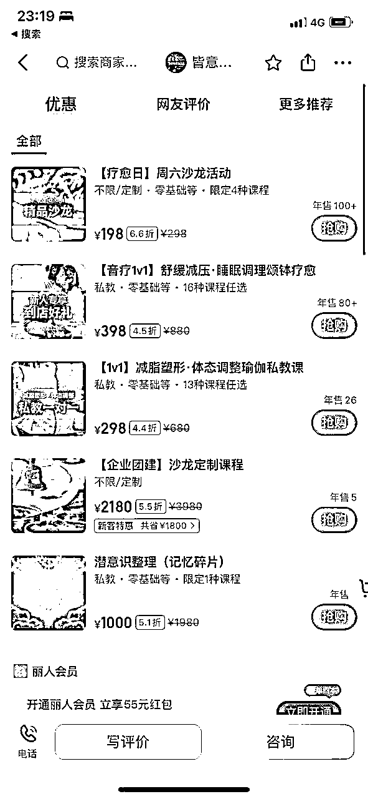

###### 引流方式

1.评论区用户私信--> 微信

2.邮箱 -->微信</h7>