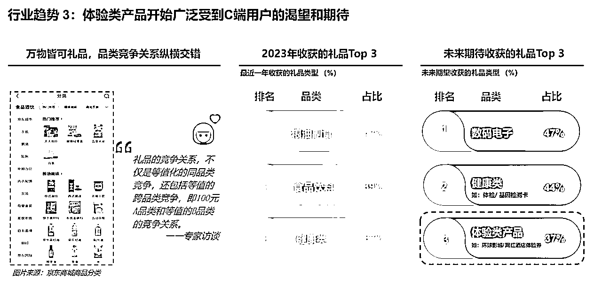
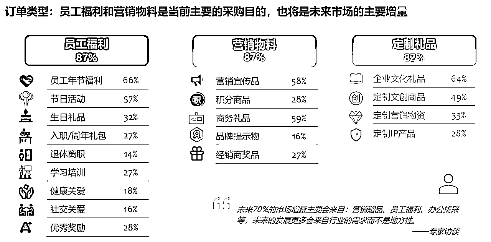

# 风向标拆解第 2 期--white jade--小红书送礼账号真的赚钱吗

> 来源：[https://p5p3srwl41.feishu.cn/docx/YjHKdWn8IoqUIRxBEBlcoCTzn70](https://p5p3srwl41.feishu.cn/docx/YjHKdWn8IoqUIRxBEBlcoCTzn70)

# 1\. 引言

## 1.1 背景说明：

小红书作为一款在中国广受欢迎的社交媒体平台，其用户群体以女性为主，年龄集中在18至30岁之间，多为白领和大学生，这些用户通常对审美有较高要求，对时尚、美妆、生活方式等领域有浓厚兴趣。

在这样的背景下，小红书的“送礼账号”可能是一个比较有意思的切入点，因为它是符合这个领域所对应的人群和兴趣特点的。

尤其是，在商品化严重内卷的当下，标准化、工业化的商品，都在不断卷服务，卷价格，而送礼这件事，它的非标属性和定制属性，再加上潜在的传播属性，很可能是一个小的创业机会，所以本文就小红书上的送礼账号这个切入点，来看看这类账号目前的玩法、现状，以及后续的成长空间。

## 1.2 研究目的：

本项目的研究目的集中在以下三个方面：

1.  变现模式分析：研究小红书送礼号的主要变现模式，包括变现形式、内容创作策略。

1.  收入评估：评估一个典型送礼号在小红书产生的收入。

1.  收入增长策略：探讨可以采取哪些措施来提高送礼号的收入。比如粉丝群的扩散、矩阵号，或者聚光投流。

通过此研究，我们希望能够为想要在小红书上开送礼号的朋友提供实用的指导和策略。

# 2\. 方法论

## 2.1 研究方法：

1、通过关键词和标签，找到粉丝量超过1000的账号；

2、梳理出他们的共同点和差异，进行分组归类；

3、移除数据不佳且相似度高的账号，保留差异化明显的账号（预计20个左右）；

4、挑选5个典型账号，深入分析变现形式、内容创作策略，并且评估变现情况。

## 2.2 分析框架：

从作品类型（图文/视频）、更新频率、更新难度（是否可快速复制）、赞藏情况、是否开橱窗或接广、是否有粉丝群、月收入估算、增长潜力等角度进行分析。

# 3\. 账号分析（核心部分）

## 3.1 账号分析表：

*   表中仅列举代表性账号，完整表格请看：

## 3.2 具体内容：

目前观察到的账号类型有以下几类：

### 第一类：原天猫店、淘宝店玩家入住小红书

代表：盒与道礼品、yokooshop等

笔记特点：制作精美，门槛高

商品特点：售价高，品类丰富

小结：如果有相关品牌方授权，可考虑开店，认可度还是很高的，尤其是盒与道礼品，半年时间销量破百万，粉丝量仅1000左右，成长空间巨大

### 第二类：小众、IP品牌

代表：简恰、瑜公瑾

笔记特点：风格统一，模版可复用

商品特点：充电宝等常用商品的IP化开发，有较高溢价

小结：颜值即正义，小红书用户真的很喜欢这一套，一年时间，销量百万，数据也很可观，增长空间较高

### 第三类：养生类品牌

代表：A晓婷婷滋补养生批发

笔记特点：风格统一、实拍为主，强调送长辈、去男友家拜访

商品特点：滋补养生类，迎合送礼需求

小结：养生话题长盛不衰，搭配见家长话题，是一个很好的切入点，适合过年送礼、婚前拜访等场景，增长空间大

### 第四类：企业定制

代表：懂礼网·礼品定制、i seven 爱柒礼品定制

笔记特点：产品展示为主

商品特点：套装为主，针对年会、公司福利、伴手礼

小结：公司采购女性居多，小红书恰好匹配相关人群，想象空间巨大，增长空间巨大

### 第五类：送个人-家居服

代表：高甜定制礼物馆

笔记特点：拆盒展示为主

商品特点：定制家居服，刺绣，溢价可观

小结：主打送闺蜜，送男友，账号量不少，销量一般，但基于小红书用户基数，增长空间可观

### 第六类：达人号

代表：CSHNAN

笔记特点：实拍+介绍，挂链接+接广告变现

商品特点：种类丰富

小结：专做礼品达人号不多，但观察这个账号来说，每天一更，收入还是比较可观，但账号数量稀少，增长空间未知

### 第七类：其他

其他账号捎带做礼品类的推广，还有很多商家联系素人推广

# 4\. 综合分析

## 4.1 趋势：

1、目前很多淘宝、天猫头部玩家还未入场，小红书礼品市场还不够成熟，处于早期阶段，但随着部分账号开始日更，预计竞争会逐渐加剧；

2、目前观察的账号50%是今年6月以后入驻的，粉丝量普遍不高，但已经有可观销量了，销量较高的账号都能保持日更，预计24年会有更大的投入（矩阵号）。

## 4.2 潜在机会和挑战：

机会一：

目前观察到的账号，更新频率、笔记模版，都是固定的，更新压力几乎可以说没有，说明赛道本身不够拥挤，可发挥空间巨大；

挑战：即便是固定模版，但照片、视频拍摄的角度以及画质、配色，要求还是较高的。

机会二：

送礼类账号商品溢价高，很容易在小红书爆单，带来的销量和利润很可观；

挑战：如何将商品卖爆，非常考验选品和审美能力。

机会三：

送礼类账号头部玩家不多，目前观察到的两家店铺，都在粉丝量仅几千的情况下，就有百万级别的营收了，说明站内对类似商品需求足够多，如果可以拿到相关品牌授权，是一个非常好的潜在机会；

挑战：如果品牌方下场，该如何平衡这中间的利益，是一个比较大的考验。

机会四：

送礼类账号的达人号，目前看在小红书还不存在头部，较为分散，如果可以抓紧机会做成头部，广告费用就很可观了；

挑战：目前没有头部达人，是因为没人注意到，还是因为性价比不高？礼品作为小众市场，是否需要专业的达人IP，有待考究。

## 4.3 单店利润计算

模型一：个人店铺

以店铺号“yokooshop”为例，该账号可查更新最早时间为23年6月28日，距今半年时间。

月流水：根据小红书店铺销量预估，半年该店铺流水30万（销量6000），平均每月收入5万

利润率：销量第一商品为海绵宝宝好朋友手办（销量3000+），小红书店铺售价42元，1688售价21元，利润率50%计算

月利润：5万/月*50%=2.5万/月

更新频次：日更

笔记类型：图文

更新难度：简单

小结：一人操作笔记发布，后端合作1688商家，难度不大，按单人模式，待账号稳定，月入3-5万问题不大

模型二：商家店铺

以店铺号“盒与道“礼品为例，该账号可查笔记时间23年6月14日，距今半年时间。

月流水：根据小红书店铺销量预估，半年该店铺流水100万+（销量8316件），平均每月收入16万

利润率：销量第一商品为盒与道创意礼品围你而来生日礼物（销量1000+），小红书售价118，商品：围巾、香膏、钥匙扣等，预计利润率50%

店铺月利润：16万/月*50%=8万/月

更新频次：日更

笔记类型：图文

更新难度：简单

小结：该店铺小红书4个号，按2人小组负责小红书渠道计算，单人单月产出4万，且未计算溢出至天猫店流量，待24年账号稳定，年收入500万问题不大

# 5、收入如何扩大

在4.3中列举的两个例子，虽然他们的店铺模型不同，但考虑商品价格区间，单账号单月产出2万+利润还是比较轻松的，而单账号每月上限，也在6万左右。

如果基于这个假设计算，扩大收入最直接的方式，就是增加账号数量。

稳定单账号可做到4万+销量后，顺势铺设更多账号，以增加曝光和店铺GMV。

其次，就是投聚光了。

小红书也遵循打造爆款原则，前三的销量可以占店铺总销量的50%以上，在测出爆款之后，顺势投聚光，可以有效提升销量和店铺GMV，其余时间保持活跃、测品，确保基本更新即可。

最后，就是联系站内达人分销。

目前小红书上专业做礼品并开通小店的品牌不多，而素人较多，可以联系站内素人协助带品，提升测品效率，并且增加店铺GMV。

# 6\. 结论与建议

## 6.1 主要发现：

1、针对个人送礼场景，观察到的账号大多为：给闺蜜、老公送刺绣家居服，拜访长辈送保健品，均为非标商品，相关场景值得深挖；

2、颜值即正义，尤其是非标的礼盒，半年时间有百万销量，说明需求量还是很旺盛的；

3、发现很多针对B端送礼需求的账号，针对场景为年会、伴手礼、员工福利等等，采购人员一般为女性，符合小红书典型用户画像，是一个水下的市场，值得深挖；

4、带IP的小众商品，在小红书上受众还是很可观的，也可视为一个机会点。

## 6.2 策略建议：

### 针对从业者

建议尽早入场，目前观察到的送礼账号还处于混沌状态，不论是账号数量还是产品销量，空间都是巨大的，只要找对切入点，比如保健品切入“第一次去男友家送什么”这个话题，就很好地匹配了用户和场景，找到类似的点去打，很容易扩大现有规模

### 针对个人

1、目前观察到的送礼IP号不多，更新频次也低，可以考虑联系供应链自己开店，针对个人的家居服是小红书上较为常见的轻定制，是否可延展一下：定制手机壳+定制保温杯+定制袜子一组，定制家居服+定制袜子+定制手环，去切入情侣市场

2、参考瑜公瑾这个账号，做自己的个人IP，送礼不一定送别人，送给自己，也是一个不错的选择

# 7、行业数据及趋势

## 7.1 智研咨询数据

### 7.1.1 行业规模及分类占比

### 7.1.2 线下&电商行业渗透情况

## 7.2 华经产业研究院

### 7.2.1 市场规模

### 7.2.2 采购用途

## 7.3 2024中国礼品行业展望白皮书

### 7.3.1 行业趋势

### 7.3.2 送礼场景

### 7.3.3 信息获取通道

### 7.3.4 品类发展启示

### 7.3.5 礼品使用人群画像

### 7.3.6 礼品采购人员需求

# 8、结语

1、暂未找到1688、淘宝关于这块市场的数据分析报告，但就观察小红书账号相关帖子来看，目前针对个人送礼场景的需求，均外溢到淘宝、天猫满足，形成小红书种草，淘宝拔草的小闭环，单就这块，小红书的成长潜力巨大。

2、根据调研报告，线下礼品场景，还未完全迁移到线上，而公司采购、HR等行政人员，以女性居多，天然匹配小红书群体，故B端增长空间巨大。

3、个人送礼赛道，目前观察到的香薰、家居服、礼盒等，还有更多场景可挖掘，从里面成长出来几个小红书本土品牌不是没有可能，有相关兴趣爱好和从业者可以考虑。

4、大品牌小红书代运营、代投放，也是一个非常巨大的空间。目前看到的广告投放，都是大品牌联合素人号进行的，但品宣较多，未见到投放商品落地页的行为，这块也可以考虑。

5、场景的混搭，也是一个新的带货切入点，比如养生+去男友家拜访，再结合一点小故事，不失为一种带货形式，如果开发出类似场景的固定开头，做一个带货账号也可以。

6、深挖定制，比如定制家居服、定制手机壳等等定制套装，也可以作为产品的切入点，成本增加不多，但溢价可以很多。

7、再做下延伸，蟹卡、认养茶园、旅游卡等虚拟卡片，是否也可作为礼品号的切入点。

# 9、数据引用

## 9.1 调研报告

## 9.2 调研账号详情