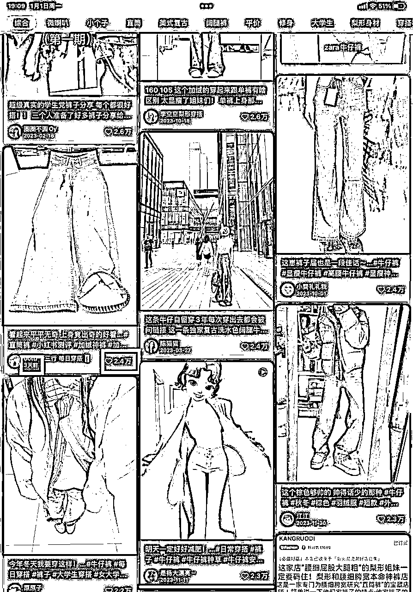

# 在校做小红书无人直播，10天30万GMV玩法拆解

> 来源：[https://b0mbxbbhstw.feishu.cn/docx/ZaqudvFmSopCfkxFX6ycKcp6nAf](https://b0mbxbbhstw.feishu.cn/docx/ZaqudvFmSopCfkxFX6ycKcp6nAf)

# 一、自我介绍

Hello，生财的圈友们好，我是秋风，今年大四，也是这次生财小红书直播和店铺的航海教练，刚加入生财两个月，一直在路上不断学习。

简单介绍一下自己的互联网创业历程，我是从5月份开始做了三个月小红书无货源电商，主做女装类目，靠着平台红利赚到了第一个六位数，后来11月转战小红书百货赛道再到无人直播项目，靠着红利不到十天卖了30w，半个月变现了六位数。

因为这半年多都是在做小红书电商这个项目，所以在这个项目上我自认为还是很有发言权的哈哈哈哈。

由于之前是做笔记带货的，我明显感觉到笔记带货越来越卷了，加上平台审核机制的不断升级，搬运的笔记动不动就违规，流量越来越难拿，得要不断转实拍才行，但是实拍的话投入的精力又太大，正好无意间发现了直播这个赛道，然后就慢慢的转到了直播这个赛道，做了之后发现真香哈哈哈。

期间一共做了10个号左右，起了七个号，其中有四个大爆品的账号，三个女装一个百货，10天下来GMV破30W。

最后感谢一下@书豪，最初跟着书豪哥才接触到这个赛道的，感谢书豪哥平时的真诚耐心分享，我也算是第一批做这个项目的人，然后取得了点成绩，分享给大家嘿嘿。

然后的话这篇文章主要是介绍小红书无人直播项目，所以开店的那些流程我就不提了哈，星球里有很多大佬写的很详细，小白的话可以先去看看哈哈哈。

我将从这几个方面介绍无人直播：

1、为什么选择小红书无人直播

2、小红书无人直播介绍

3、做无人直播前的准备工作

4、需要用到的软件及使用

5、如何找对标账号

6、如何打造爆款直播间

7、小细节及注意事项

8、总结

话不多说，直接上干货！！

# 二、为什么选择小红书无人直播？

## 初做笔记带货

我是从十一月份开始接触了解到这个项目，当初还是做笔记带货，做的是百货赛道，百货赛道因为我入场的比较晚，平台在双十一那段期间审核异常的严格，我期间爆了两个号，持续了两天就凉了，动不动就判我账号原创度过低，然后就账号限流。

后面不甘心，于是我把样品买回来，租了个酒店，拍了一个下午，期间差不多拍了有五十个不同的素材，我想着这下应该没问题了吧。

我重建了一个新号，从头开始，果然功夫不负有心人，第一篇笔记就爆了，我清楚的记得那一天卖了六千多，当时又做的是百货赛道，我只能说百货这条赛道是真的香，售后不到3%，基本没有客服问题，而且利润能够达到60%，起号还快，比我之前做的女装好太多了。

就这样正当我觉得终于好起来了之后，又收到了平台发来的违规通知，账号原创度低，又是同样的原因，果然小红书的机器人都杀疯了，我拿着所有的证据，拍摄记录，拍摄时间，相册截图，总之能证明我是清白的我都用上了，然而，并没有什么卵用。平台审核人员都是外包的，他们也不懂业务，所以我的笔记带货之旅又以失败告终。

身边也是在做百货的朋友也明显的感觉那段期间小红书审核机制非常严格，不管是原创还是非原创的笔记，通通违规，关键还不是简单的笔记优化提醒，是直接告诉你账号违规，申诉的话还得发一个礼拜原创再账号申诉，还不一定成功，当时就很头疼，主要还是入场晚了，当初七八月份开始做百货那些人的早已吃满红利了呜呜呜。

## 转战无人直播

后来看到了身边的人在做无人直播，我二话不说赶紧学习入场，也算是第一批做这个项目的人，当时在小红书站内就偶尔会刷到有人直播卖货，然后比较好奇，加上项目比较新颖，又被笔记带货搞得头大，就想着尝试一下。

后来发现是真的很香，我做的第一个直播账号，是跟着站内有一个卖发饰的人做的，她的直播间是偏教学方面的，场观很高，然后我就跟着模仿，在抖音上查找素材，录了十个不同的直播间，找到几个好封面，每天换着素材直播，播了三天号起来了，那一场在线人数也来到了两百多。

但是我发现了一个问题，就是同样的场观，我发现朋友直播间卖了三万，而我百货只能卖一千，这差距也太大了吧，30倍。

百货客单价低，加上直播的话大多是教学类风格，虽然场观和在线人数高，但是转化太低了，然后我就慢慢的转到了女装类目。

做女装类目，可以让你真正感受到做电商的“喜和悲”。当你直播间爆了之后，半天出个七八百单，你会感受到出单时的喜悦，心想：“卧槽，一场直播卖了3w，扣掉退货等七七八八，一场赚6k。”

你又会因为爆单而感到烦恼，

“糟了，这一两百单订单要超时了，一单罚三块。”

“这个厂家发不出去货，完蛋喽。”

“这个货源找不到咋办，聚水谭erp不会使用。”

但是的话我建议大家都去尝试一下女装类目哈哈哈，虽然累了点，但是利润也是真的很可观。

而且我感觉直播的话，因为是用的是抖音直播间的素材，然后有些品的货源相对来说品质会好一些。

我之前做笔记带货的时候退货率达到了66%左右，然后我这次直播带货的时候，退货率稳定在30%，利润自然就上来了。

## 无人直播优势：

为什么现在很多人在笔记带货上都没有取得成绩，然后在小红书无人直播这个项目上取得很好的成绩呢？我认为主要有以下三点原因。

## 1、刚刚兴起，相比小红书笔记带货，卷度更低

小红书电商从今年年初就开始出现了，在当时的话起个号，稍微会有点选品能力和剪辑能力，就能轻松出单，但是现在入场的人变多了，不断再卷，再加上平台审核机制的不断升级，无货源店铺的稽查，靠着以往的搬运混剪，账号爆了之后持续周期很短，得要从搬运转实拍，投入精力过大。

然后正巧最近小红书无人直播刚刚兴起，做的人不算多，竞争压力小，就类似于年初时的小红书电商，然后平台的审核力度比较轻，对于新手更加容易一些。

## 2、操作简单，上手快，矩阵化轻松

小红书无人直播相比电商的话投入时间短一些，有做过小红书电商的再尝试这个项目就简单得多，关键点无非就是选品，测品，测封面，这两点搞定了后起号就快了，且一个账号起来之后，跑通了0-1后，就可以通过矩阵迅速扩大，复制性强。

## 3、平台扶持阶段，起号容易

这阶段平台对直播有扶持，封面点击率大于4%且人均停留时常大于30秒，平台会对直播间有流量激励，个人最快两天起号成功，第三场直播销售额三万多，所以我建议趁着小红书直播赛道野蛮生长的阶段抓住风口，然后多吃点红利。

# 三、小红书无人直播介绍

小红书无人直播带货的主要是利用直播录制软件从其他平台带货直播间录制直播带货素材，接着使用播放软件将录制素材投影至小红书直播软件进行直播带货，无非就是走抖音之前走过的路，只不过现在应用在小红书上。然后恰巧现阶段是平台扶持阶段，起号就会比较快一些。

一般录制的直播间来源于抖音，可以是教学类的直播间也可以是简单的直接卖货直播间。

带货直播间：

这种直播间大家应该都很熟悉，就是典型的直接带货直播间，适用于各种类型的类目，如女装，零食，饰品，百货等。

优点：商品讲解比较多一些，转化会比较高一些。

弊端：起号会慢一些。

教学直播间：

这个直播间主要是教我们怎么叠衣服的，然后场观和在线人数就会比较高，偏干货类的教学直播间，一般多适用在百货这个类目。

优点：场观和在线人数会比较高。

弊端：转化偏低。

# 四、准备工作

## 1、准备设备

一机一卡一号，手机尽量都用流量，不要连wifi，防止多台设备连接一个wifi出现一起违规的现象，然后账号违规要换号的时候要记得刷机格式化处理。

然后一般一台电脑一个直播间，尽量不要一台电脑挂多个直播间，容易出现一台多个直播间关联违规的现象。

## 2、养号

我认为还是主要是看账号状态，若是正常使用的号无发过过多笔记的号，或者是刚注册的新号，之前没有任何违规记录的号，可以先发一篇笔记测试一下流量情况如何，若是大于100小眼睛则是正常的现象，可以直接把号拿来用。

若是小眼睛始终在50以内上不去，或者发布的笔记都无法薯条投放，则需要养号一下。

养号的基本流程就是平时多刷刷手机，有时间的话就打开小红书刷一刷，搜索想做的那个类目，然后刷一刷笔记或者是直播间就完事了，偶尔点赞，收藏，评论一下，增加账号的权重，重复个3-5天。

## 3、账号基础信息

对于直播账号的话，我自认为这些都不是很关键，多花些时间在选品和封面上比什么都强，只要不是太浮夸都是小问题！！

但是咱们还是讲究一点细节哈哈哈。弄个头像和昵称就可以了。

### 头像

头像可以用网图，背景图，侧脸图，动漫图等等，个人认为头像这一块比较随意，一般用一个女网图就可以了，只要不是那种大网红的头像，太浮夸的都可以。

### 昵称

昵称的话可以根据你所做的类目来设置，比如说你

想做女装类的，可以取个：XX爱穿搭，XX服饰，XX穿搭日记等等

想做百货类的，可以取一个：XX的百宝箱，XX好物等等

想做零食类的，就取一个：XX零食铺，XX零食分享。

# 五、需要用到的软件及使用

## 软件

一般使用到三个软件：江湖工具箱，剪映专业版，OBS，小红书直播助手和VLC，我把软件的链接分享到下面了，只需要下载安装即可。

江湖工具箱：http://jianghudata.com/

OBS：https://m.onlinedown.net/soft/637537.htm

小红书直播助手：https://www.xiaohongshu.com/web-login/canvas?redirectPath=https://www.xiaohongshu.com/zhibo/login

VLC：https://www.xiaohongshu.com/zhibo/login?redirectPath

## 江湖工具箱

江湖工具箱是一个录制抖音直播素材的软件，我们只需要把抖音直播间链接复制到江湖工具箱里，然后点自动监控功能，然后他就会自动开始录制，一般网络不错的话可以多放几个链接进去，然后等主播开播了它会自动录制的，我们就不用再管主播有没有开播了，省掉很多时间。

一段素材至少得录个2小时，循环两遍，至少得播个六个小时，拉拉时长，因为新号的话前几场都是没什么流量的，尽量通过拉时长的方式先让系统把人群标签打清楚，然后后面的话对封面和素材进行优化，然后流量就会越来越高。

然后多录几个素材有一个好处就是对我们后续测素材，就可以每天测一个不同的素材，直到测到一个转化率高，停留时间高的素材，然后就可以一直用了。

具体操作如下：

## 剪映专业版

剪映这个软件大家应该都很熟悉哈哈哈，但是因为我们是做无人直播的，每次录制的素材都会很长，所以我建议用电脑版的来处理视频素材，一次的话处理个两小时的素材差不多，因为太大的话，识别字幕和导出视频会很卡，所以两小时两小时的处理会比较方便些。

剪映在这个项目里的主要作用是处理违禁词，一般的违禁词包括抖音，小黄车，最低，最高，最便宜等等。

违禁词可以参照我下面这张图片：

我们就把之前江湖下载下来的素材，添加到剪映里，然后通过剪映的识别字幕功能，查找这些违禁词，再定位到对应的地方，最后把整个片段裁剪掉就行了，这个方法会比较慢一些。

分享一个小技巧，可以把这些违禁词替换成一些比较显眼的字，我一般是替换成2222222222222，既直观又明了，然后只需要一直滑动字幕就好了，提高效率。

我一般处理一段两小时素材的违禁词需要10分钟左右。

或者是通过剪映识别字幕，然后把音频导出，再通过飞书妙计查找到违禁词，然后删除就可以了。

还有一种更快的方式就是通过小绿点这个软件，功能类似于江湖工具箱，但是有个功能就是可以直接把违禁词消音掉，比较省时，但是要付费，我建议可以先用江湖工具箱，剪映先跑通一下流程，等后面矩阵化了，再试试这个软件哈哈哈。

## OBS

对于有做过直播的，这个软件应该都很熟悉，没用过的也没事，只要做好几个设置就行，并不难，保证看完就会哈哈哈哈。

把VLC下载完后这个软件不用管哈

先添加好VLC

然后记得点循环播放！！

然后下面这两个设置一下就可以了

确认无误后就可以开启虚拟摄像头了

## 小红书直播助手

想要在小红书上直播，需要用到这个软件，开播的时候只需要在打开摄像头，然后把分辨率调整为1080*1920，接着在OBS上打开虚拟摄像头，画面就会自动同步到直播助手上，然后我们设置一下封面，设置一下标题，封面和标题的选择我下面会分享经验哈哈，最后一切准备完毕之后，开启直播，最后点击左下角有一个管理工具，进去设置一下要上架的商品就好了。

然后点击开始直播过后记得得要立刻上架商品，防止出现违规现象。

这里记得开启直播之后，可以先用小号进入直播间看看有没有声音，有没有挂车，要是没声音就关掉直播间，然后快速再点进来重新开播。

# 六、如何找对标账号

找对标账号，主要靠在小红书直播广场刷，遵循着这几点：

1、那种笔记发布的少，甚至没发过的

2、粉丝数2000以内

3、直播次数少且在线人数高

4、主页多次推荐

5、出单量高

找对标账号的作用是让我们知道什么样的品适合什么样的直播风格，然后我们在做这个品的时候，就可以去抖音上找到用品类似风格的直播间当我们的直播素材。

以下这个直播间就是近期才火的直播间，且在线人数稳定两百多人，这个在线人数放在小红书已经算是相当炸裂的存在了，说明了他的直播间的风格类型和这个品适合我们去跟。

但是尽量不要找一同一个素材，换一个直播间跟着播，大概率也能爆。

# 七、如何打造爆款直播间

在小红书想要打造一个爆款直播间，需要具备两个因素，一个是高点击率封面一个是高停留率的素材。

注：新号想快速起号就取决于这两点的水平，一般的话要前期做到封面点击率大于4%，5秒停留率大于30%才行，这点非常非常非常非常非常重要，所以我建议前期要多准备几个素材和封面，然后一直测，直到测到达标为止。

我之前找了一个素材和封面，第一场封面点击率就大于4%，5秒停留率大于30%，然后第二场就起号成功了，那个号播了5天卖了10w。

然后前期能做到封面点击率就大于4%，5秒停留率大于30%就行，因为前期观看人数少，很多人看到直播间人数少，会不想点进来，或者是点进来后看到没人会一下子就划掉很正常。

这个数据到后期人数高了，封面点击率能达到10%，5秒停留率能达到50%差不多，已经算是很夸张了。

话不多说，分享干货哈哈哈。

## 1、封面的选择

封面的好决定了你的点击率高，说明会有更多人点封面的话分为猎奇类的，痛点对比类的，还有就是种草美观类的，围绕着这三点找准没错。

猎奇类：

痛点类：

美观类：

进来看到我们的直播，那如何找到一个高点击率封面呢，我一般采用两种方法，一种是截同品爆款直播间封面，第二种是站内搜近期高点赞的同品类的封面。

### 直播间跟爆款封面

比如我们要做棉服，就可以去小红书站内发现页面里，点击直播，找到也是在做棉服的直播间，看直播间右下角的场观，大于一万的直播间，它的封面就可以保存下来，不一定是要跟我们做的那个品一摸一样，大概相似就行了，只要不要是差别太大的都行。

场观大于10000，在线人数大于100人的，这些直播间都是经过验证过的，所以只要照“抄”就完事了，前期比较没有选封面经验的话可以用这个方法。

### 笔记爆款封面

这个的话就是在小红书发现页里，搜索想要做的品类，比如说要做牛仔裤，就搜索牛仔裤，筛选最热的笔记，然后找到点赞大于10000，粉丝少于10000，近期一个月发布的笔记，总之就是点赞越高，粉丝越少，发布时间越短的笔记封面越好。

多保存几个下来，后期每场直播都要测试不同的封面，总之要测到点击率大于百分之4的封面，然后后面的直播就可以一直用。

然后找到合适的封面后把封面保存下来，用作直播间的封面。

## 2、选品

都说七分选品三分钟运营，在小红书无人直播中选品也相当重要。

选品的话也分为站内选品和站外选品，还可以通过灰豚和考古加这些第三方软件进行选品。

### 小红书站内直播间选品

这个方法主要靠在小红书直播广场刷，点带货直播间，通过刷站内爆款直播间，然后刷到场观大于1w，在线人数大于100的我会留意一下。

然后去1688上以图搜图看看品有没有利润空间，有的话我就会留意直播素材画面是属于什么风格的，暖色系还是冷色系，主播是单人的还是双人的，主播的直播风格如何，确认完毕后，我就会去抖音上以图搜图，然后找到相似的直播间作为素材。

为什么不用一样的直播间作为素材呢，因为站内太多人用同一个直播间作为素材的话，容易被系统判定多账号使用同一个素材，然后被判定为录播，造成违规现象。所以我建议找类似的直播间作为素材。

### 抖音刷低粉高在线的直播间

这个方法是直接去抖音上刷直播间，也是一样先看看品有没有利润空间，然后在看看是否是暖色系直播间，是不是低粉爆款直播间，然后品不要太多，品太多的话后续爆了后对接厂家会很麻烦。

一般是主讲三个品及以内的直播间，然后找直播间的时候尽量找那些提到违禁词少的，可以省掉很多后期处理素材的时间。

然后的话直播间尽量找低粉在线高的直播间的直播间，可以找大于1000人的，也可以找大于100人的，取决于这一类直播间是否跟小红书站内同品爆款直播间是否一个风格，如果风格一致的话可以选择在线人数少的，毕竟这样的话说明了用这个素材的人会比较少，就不那么容易违规了。

下面这个素材虽然你看他在线人数就一百多人，但是小红书站内就有人录他的直播间作为素材，然后一场直播间卖了5w营业额，在线人数稳定三百人。人群不一样，有些直播风格在抖音火不了，但是在小红书就火的了哈哈哈。

### 跟爆品截流

这个方法比较适合有一定基础有经验的人，我会通过灰豚数据查看近期榜单，找到近期才爆的无人直播的直播间，然后去抖音上查找素材，然后在其基础上做适当优化。

比如说你的画质比原来的那个人高清，或者是添加一个主播标签信息，再或者评论区进行优化，这些都是小细节，大概率你的直播间会起的很快，而且做的比他还好。本人吃过亏的惨痛经验分享给大家。

## 3、测品

测品其实就是测封面和直播素材。

封面的测试方法就如上面所说的那样，找到几个合适的封面，然后的话每场直播都用不同的封面去测，直到测到点击率大于5%的封面，我就会一直用下去，电脑后台可以看到每场直播过后的数据。

因为小红书有个直播激励务，封面点击率得大于4%，所以一定要测出大于4%的封面一直用。

素材的查找就是我上面产品方面说的那样找到合适的素材进行测。

判断素材的好坏我一般看五秒停留率，前期的话至少得大于百分之30才行，一个直播间测个一两场，不行就换，换成同品不同的直播间素材，一般一个品我会测三场。

反正直播跟笔记一样的逻辑，就是测测测，换换换，我甚至感觉比笔记还简单。

因为小红书有个直播流量扶持激励计划，要三场直播的封面点击率大于4%，人均停留时长大于30秒，所以我们要做到的是测出这样的封面和素材，然后一直用，会发现新号起来的很快。

在直播爆单起量后，在线人数两百人后，评论区会出现很多带节奏的人，我们可以通过设置屏蔽词，把“录播”，“录像”，“举报”等不利于我们直播的词给屏蔽掉哈哈哈，防止影响转化。

然后评论区多互动，设置大额优惠券，秒杀等都是提高转化的方法，这些都是后面直播间爆了后再做的，不用急的哈哈哈。

前期先慢慢的完成激励任务，得到平台的曝光奖励，会很香。

# 八、小细节及注意事项

1、在起号前期，发现素材的数据还不错，观看人数不高的时候，可以运用曝光卡增加曝光，可以加快起号速度。

2、直播上架的商品可以自己增加几个高利润的商品，低利润的产品出单可以带动高利润的产品出单。

3、新号在第一场直播的时候，可以发一篇不挂车的笔记，增加直播曝光，更能起号成功，最好是所带的产品的细节讲解图，可以提高转化。

4、直播间主推的品提高商品价格，设置一个大额优惠券，绝对时间设为一天，也是一种提高转化的方式。

5、直播素材测两三场数据不行就换，不要过多浪费时间，不要相信自己的眼光，要相信小红书群众的眼光。

6、新手在做小红书无人直播的时候，可能会看到站内很多人做一个品，比如说很火的鲨鱼裤，糯米裤，看到很多人在做，然后发现流量都还不错，挺高的，然后就想着我也去跟一下，我也能起来，结果发现自己还没做起来然后号就被判违规录播没了。

虽然品是很不错，容易出单，但是为了出一两单，把号搞没了很不值得，你做的那个品，那个素材可能上百人上千人都在做，同质化太严重了，所以我建议超级爆品就不要跟了，尽量做一些那种站内出现不多的，或者是尝试一些没人做的品，这样虽然可能起号会慢一些，但是不容易违规，然后爆了的话，都是千单起步的。

在这里我在讲一下出现了录播违规，录播违规在直播领域中算是大违规了，前两次出现基本都可以申诉成功后，流量恢复后，后面的直播就得低调些，直播时间不要太长，素材尽量用没人用过的素材，因为再违规可能就申诉不回来了，显示14天后复审，基本是凉凉的状态。就得换号了，但好在无人直播起新号容易，所以其实也不是什么大问题。

7、一般的话我们做小红书无人直播，素材来源于抖音，然后我们直播间商品链接价格得和直播间一样，不然就会发现对不上价格的情况。

但是我们会发现多数抖音上的商品价格跟1688差不多或者相差不大，这个时候我们可以看一下直播间主播提到商品价格的频率，若是十分钟及以上提到一次的话，我们可以适当的涨价，不然要是做女装的话，客服售后压力太大，加上运费险，然后从1688上发货的话，买家退货是要扣掉运费的，要是利润太低的话是没有利润空间的，还累死累活何必呢？！

所以我一般都会找那些不怎么提价格的直播间，偷偷涨价哈哈哈，有个品1688进货30，抖音上卖39.9，我涨价49.9，虽然直播间提价格了，但是我那个品十天卖了4000单！！

问我怎么价格不一样，统一回复：“宝子，直播间主播价格说错了哈，实在不好意思哈。”

主播说39.9元，我就在直播间设置个屏蔽词，把39.9，49.9屏蔽了，这样就不会出现这种带节奏的弹幕了，都是细节！！！

8、直播间爆了后，在线人数稳定一百多人后，若出现录播的违规，不要急着下播，就一直播下去，播到实在没有推流为止，然后就算违规了话也没事。

小违规不用管，小违规一般指：绝对化词语，或者是提到其他平台信息，后面的直播素材注意处理好违禁词就好了。

然后大违规的话不用怕，大违规是指直播素材被判录播，多账号播相同的素材，申诉一下就好了，基本前两次大违规都可以申诉回来哈哈哈哈，都是经验。

# 九、总结

小红书无人直播本身就是利用小红书平台发展直播赛道野蛮生长的阶段管控较轻，然后利用抖音搭建的人货场免费给我们打工，用最少的成本吃一波红利，优点就是起号快，适合矩阵，弊端就是容易违规限流。

常在河边走哪有不湿鞋，玩无人直播心态要好，号没了就再起，小违规不用怕，大违规就申诉，基本都能通过，我的有个号小违规无数次，大违规两次了，还在继续播，前前后后播了半个月了，出了四千多单了还有流量，播到实在没有流量为止。所以违规根本不用慌，再起新号就完事了。

然后的话无人直播这个赛道门槛相对较低，有兴趣的朋友可以去试试哈，然后欢迎各方朋友跟我交流，然后有问题的话可以在评论区留言哈哈哈哈，让我们一起破认知，破信息，破圈层，一起生财有术！！