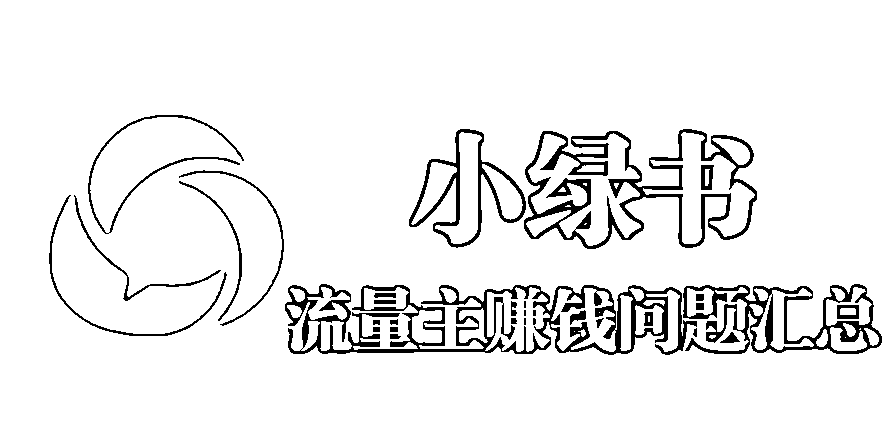
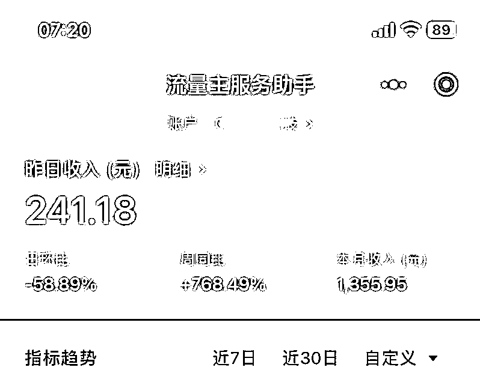
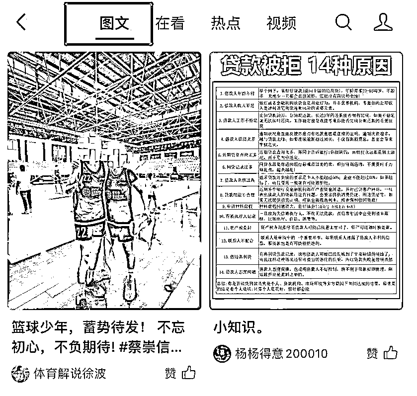
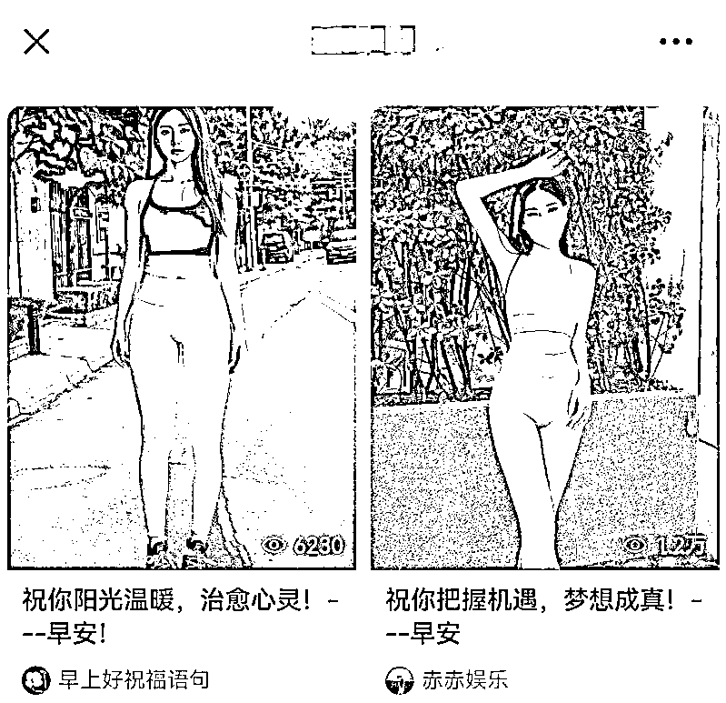

# 关于小绿书目前的问题一次说清楚

> 原文：[`www.yuque.com/for_lazy/thfiu8/ag4dmrp2r8a1b7b3`](https://www.yuque.com/for_lazy/thfiu8/ag4dmrp2r8a1b7b3)

## (33 赞)关于小绿书目前的问题一次说清楚

作者： 深圳老刘

日期：2024-01-04

最近小绿书引起了圈内同行的高度关注，关注的**焦点主要集中在通过流量主可以赚取收益**，当然还有些人关注能否引流，引流不是我们今天的重点，下次有机会再说。

与公众号爆文赚流量主收益需要编写长段的原创文章和使用 AI 流程等复杂手段不同。

小绿书的风格风格由于比较简短，在内容制作和生成方面都比较容易，同时小绿书与小红书的内容可以很丝滑的进行“**跨平台兼容”**，那么自然就更容易吸引原来在小红书上面操盘的广大运营者们的关注。

再加上原有公众号大批的从业者的**转型**，所以目前在圈内形成了一定的热度。

首先作为从业者，我们做这个业务肯定要了解业务的背景和预期方向，特别是对于一些还在观望人来说。可以预料的是，小绿书的业务是长期的，但能长到什么时候，现在咱们谁都说不清楚。

我们可以从三方面了解一下，提升一下对这个新领域了解和信心：

一、**小红书发展迅猛腾讯也看到了机会**，这种决策是有利益驱动的，不会是心血来潮，也有维护江湖地位的考虑，所以不会随随便便，决定了就不会轻易更改。现在官方在试水，没有开放更多的入口，接下来几个月我们应该还会看到更多的动作出来。

**二、激活那些不发朋友圈的人**，小绿书是展示给公域用户看的没有私域好友的顾虑，是对于用户来说用来写写笔记，分享生活是相当近的切入点，现在都很多人压根没用过小红书，但一定有微信。

**三、丰富内容矩阵**，微信现在有订阅号长文，有朋友圈短图文，有视频号短视频，却没有中长图文。有了小绿书这种形态的中长图文，可以丰富内容矩阵，打造更丰富的内容平台。目前微信体系内没有别的内容渠道有类似小绿书这种风格的展示形式。

下面我们来说说老刘最近遇到的与小绿书相关的一些常见问题：

**一、流量主要求**

目前官方对于流量主的要求是 500 个粉丝，这个要求并不算高，毕竟这个是有收益的，相比在小红书发笔记用爱发电来说，已经不错了。

只要发的内容符合用户的阅读爱好，有一定的浏览量，基本上每天也可以自然涨粉，这一块还是很不错的。

帐号不需要认证，也就是说完全免费的。公司、个体户、个人性质的都可以。

**二、公众号数量问题**

目前每个自然人可以免费申请注册一个公众号，个体户可以申请两个，公司性质现在虽然由原来的五个降到两个了，但是在运营正常的情况下可以陆续申请扩量。

以前是可以扩到 50 个帐号，目前能扩到多少个，没有最新的信息可供汇报。

**三、流量主收益分配问题**

流量主的默认收益归帐号拥有者所有，填写财务信息即会定期打款。个人帐号会要代缴个人所得税，公司帐号需要邮寄发票后进行全额结算。

个人帐号的收益也可以由第三方公司或者他人代收款，但需要提供申请者本人的身份证照片并签署一个代运营协议即可。这一块可能是比较多从业者关注的细节。

**四、小绿书的入口在哪？**

小绿书目前并没有统一入口，有些灰度测试用户可能在看一看页面可以看到图文的 Tab 页，但是大部分用户没有这个 Tab 页。

大部分用户可以通过浏览别人的小绿书图文，再通过推荐文章到别的内容，一层一层地进去，可以刷到很多内容。

**五、哪里领域可做？**

目前每个细分领域都可以做，而且很多新号入池的速度都比较快。很多以前的小八卦账号都换成小绿书玩法了，发一些娱乐明星图片等等。

目前小绿书主要的爆文领域是娱乐八卦、成长智慧、明星身材、电影情节、生活技巧、体制生存、男女关系、搞笑图文等等。

这边给大罗列一些相关爆文链接：

娱乐八卦 3.0W [`mp.weixin.qq.com/s/LWYuoSA2Rhqu4m3S8K2uHw`](https://mp.weixin.qq.com/s/LWYuoSA2Rhqu4m3S8K2uHw)

娱乐八卦 2.0W [`mp.weixin.qq.com/s/WEi5M0s-FSTv_TB50MtNbQ`](https://mp.weixin.qq.com/s/WEi5M0s-FSTv_TB50MtNbQ)

罗翔说 5.5W [`mp.weixin.qq.com/s/psxhvL3-M222JIExvOHjUQ`](https://mp.weixin.qq.com/s/psxhvL3-M222JIExvOHjUQ)

罗翔说 1.1W [`mp.weixin.qq.com/s/7uoJRrZM5jfQeevc9OG4xA`](https://mp.weixin.qq.com/s/7uoJRrZM5jfQeevc9OG4xA)

娱乐八卦 3.2W [`mp.weixin.qq.com/s/t238MftYQReDLO2Gu5UjWA`](https://mp.weixin.qq.com/s/t238MftYQReDLO2Gu5UjWA)

明星身材 1.3W [`mp.weixin.qq.com/s/vNewbyRUFS1YBX8PxmAfmg`](https://mp.weixin.qq.com/s/vNewbyRUFS1YBX8PxmAfmg)

明星身材 5.4W [`mp.weixin.qq.com/s/cYFYbK5w8LcY27Vlgilllg`](https://mp.weixin.qq.com/s/cYFYbK5w8LcY27Vlgilllg)

电影情节 10W [`mp.weixin.qq.com/s/yCUoHmKAP2DwulGEa3yvPQ`](https://mp.weixin.qq.com/s/yCUoHmKAP2DwulGEa3yvPQ)

电影情节 10W [`mp.weixin.qq.com/s/O8xEel5bCG6NcaVNUcE0Uw`](https://mp.weixin.qq.com/s/O8xEel5bCG6NcaVNUcE0Uw)

生活技巧 10W [`mp.weixin.qq.com/s/KBFYJOfn4MEVo86C4zTE0A`](https://mp.weixin.qq.com/s/KBFYJOfn4MEVo86C4zTE0A)

体制生存 2.2W [`mp.weixin.qq.com/s/qRMu_4iidMg2jL446Dbx7Q`](https://mp.weixin.qq.com/s/qRMu_4iidMg2jL446Dbx7Q)

创业成长 1.6W [`mp.weixin.qq.com/s/B58MpBz2Sbu7zUBCX5sv_w`](https://mp.weixin.qq.com/s/B58MpBz2Sbu7zUBCX5sv_w)

男女关系 1.1W [`mp.weixin.qq.com/s/JBu_72mzQ26iyOvToTK7uQ`](https://mp.weixin.qq.com/s/JBu_72mzQ26iyOvToTK7uQ)

男女关系 1.4W [`mp.weixin.qq.com/s/Qf4vbgY_lh2HW5or5sxEdw`](https://mp.weixin.qq.com/s/Qf4vbgY_lh2HW5or5sxEdw)

青春爱情 6.6W [`mp.weixin.qq.com/s/dyVajHtaN5gV4UkDgdkHkA`](https://mp.weixin.qq.com/s/dyVajHtaN5gV4UkDgdkHkA)

男女关系 10W [`mp.weixin.qq.com/s/GZjwvmwbkAf_B15p5yGy1g`](https://mp.weixin.qq.com/s/GZjwvmwbkAf_B15p5yGy1g)

搞笑图文 8.8W [`mp.weixin.qq.com/s/0ExrmCd8vXnyhth3Z3mLpA`](https://mp.weixin.qq.com/s/0ExrmCd8vXnyhth3Z3mLpA)

**六、版权问题怎么处理？**

原创的肯定不存在版权问题，只有搬运的才有版权问题。目前小绿书属于一个野蛮生长期，并且没有将内容标注为原创的选择。

但并不表示就可以不原创，因为原创的保护并不取决于平台方，而是取决于版权权益方的意愿。

但即使是这样，其实仍然还是有很多没有版权的素材可以使用的，比如一些小众的 APP，或者自由论坛。也有一些大媒体的素材，可能懒得理你，真要理的话，也轮不到你。

另外现在有 AI 的加持，其实很多内容是可以自主生成的，一些已经成型的领域可以想办法通过 AI 进行原创。

**七、流量主收益怎么样**

浏览收益取决于很多因素，主要看是否能匹配高价的广告方，这一块不是我们自己可控的。

单个帐号的收益，如果不是精细化运营的话，利润并不算可观。

目前 10000 个浏览大约收益有 50-100 元之间，又或者还少一些。正常运营的帐号，不涉及爆文的情况下，一般有 2-10 元的收益。

可能很多人感觉这个收入并不算高，如果需要赚取更多的收益，只能批量化运营。

相比很多 200，300 人的老淘客社群发一天的单也才产出 10，20 块钱，这边只需要发一条图文就可能也有一半的收益了。其实还是算很不错的。

好了，今天就说这到多。老刘能一口气想到的相关问题也就这些了，或许还有些遗漏的，有兴趣也可以一起交流。

* * *

评论区：

qqqqqq : 小绿树现在开放了吗
辰风 : 早开放了呀

* * *