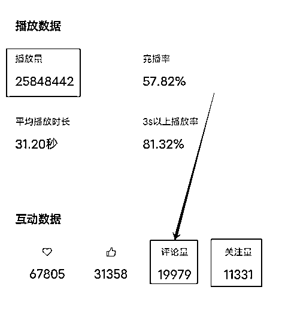
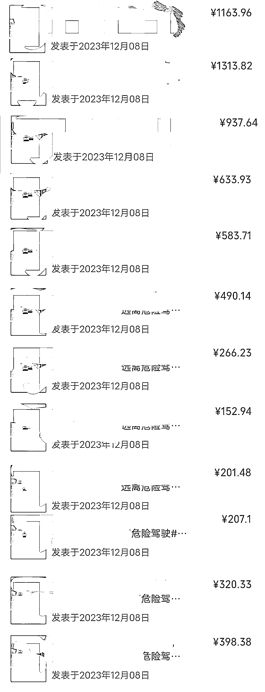
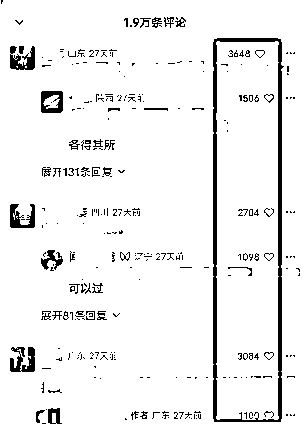
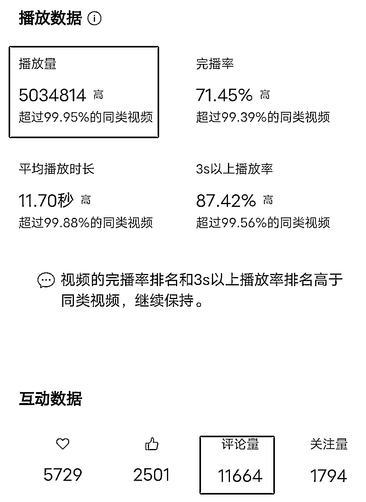
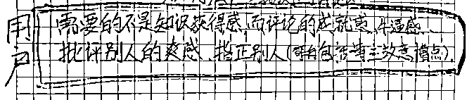
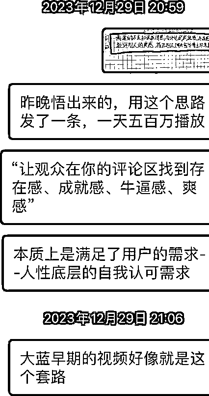

# 创作分成计划一条视频赚了 7200 元，分享一种提高视频评论量的方法

> 原文：[`www.yuque.com/for_lazy/thfiu8/ho6bbctckfg77z65`](https://www.yuque.com/for_lazy/thfiu8/ho6bbctckfg77z65)

## (26 赞)创作分成计划一条视频赚了 7200 元，分享一种提高视频评论量的方法

作者： 旭宏

日期：2024-01-04

按我们生财的规矩，分享之前，先展示我取得的成绩：一条混剪二创视频，近 2600 万播放、近**2 万条评论数，**拿到了 7200 多块钱的广告收益：

每天的收益图：

第十五天开始，这条视频的每天收益下滑到低于 100 块了，我就不贴上来了。

其实，这条视频的评论率并不高：2 万➗2600 万≈万分之 7，也就是一万个观众只有 7 个人评论。

但我们要更深入地思考一下这个问题：

评论数越高，广告收益才能越高吗？

我相信绝大多数人都会回答：是的。

但其实不是的。

更准确的答案是：

**看评论**的人越多，广告收益才越高！

对，核心是“**想看评论**”的人数量要高。

来看一下我这条视频里面高赞评论的点赞数量：

点赞数排名前三的评论，以及这三条评论的最高赞回复，总共 6 条评论的点赞数加起来，超过了：

**1 万 3000 条！**

这意味着，有很多观众虽然不评论，但是他们会看评论！

所以，收益高的视频，不一定评论率特别高，但是“看评论率”一定很高！

那么，我们做这个项目的问题就可以转化为：

如何提高观众的“看评论率”呢？

我经过一段时间的复盘总结、测试验证、二次复盘、二次验证......，总结出 2 个可靠的方法，分享给大家：

1.**选题时提高****争议性**：

不要选那种一眼就能看出谁对谁错的素材/话题。比如：

王自如比当年被罗永浩怼的时候进步了 VS 中年男人都应该向王自如学习，后者更有争议性

2.用坏人为第一人称去陈述“自己”好的一面、做得对的部分，比如，我有两条视频，一条就是上面 2600 万播放的，还有一条是 500 万播放的时候掉广告的，这两条都是以一位犯法坐牢者为第一人称去写的短视频文案，因为他们明显是“犯错者”的身份，所以观众“很容易无痛地评论犯错者”，从而显著提高评论率。下面这个截图就是我用了这个方法优化之后的数据：

可以明显看出，这条只有 500 万播放却有 1.1 万评论的视频，**评论率明显高过**那条近 2600 万播放才 2 万评论的爆款。

甚至，这条视频的评论数已经超过了“喜欢”+“推荐给朋友”+“转发”的总数量：

而后台私信也收到了不少观众的谩骂和指责--因为他们以为我就是视频中那个犯了严重罪行的人。

这似乎验证了“找骂就是流量密码”......

但是为啥也有这么多人点赞和推荐呢？因为我的文案说的都是客观事实，就像电影《色戒》里面梁朝伟演的那个角色是一个汉奸，但是导演告诉大家：这个坏人很帅（梁朝伟来演而不是王宝强、黄渤来演）、很痴情、很舍得给女人花钱。这种叙事手法，一定会火的。

再举一个生财圈友更有感觉的例子：

  如果有一个生财圈友发一条视频，说他花 2000 多块钱加入了一个叫做生财有术的社群，然后在 2 个月的时间里天天看帖子看到凌晨 1-2 点，导致白天正常工作时出问题被扣了奖金，还在第一次参加的航海中花了 1000 多块钱押金参加了 6 个航海项目，结果每个项目都没拿到成果，还因为摔断了腿住院没时间打卡拿回押金，焦虑万分后，盲目报名了一位生财圈友的 XXX 项且的陪跑营，了一位生财圈友的 XXX 项目的陪跑营，又花了 1 万大洋，然后这条视频就结束了。

你们觉得这条视频的评论率会高吗?

我认为一定会有很多生财圈友去这条视频下评论的，因为“生财有术”社群是一个特别好的社群--这对于绝大多数生财圈友来说，就像梁朝伟演的角色是汉奸一样明显(原谅我，请忽视我用汉奸来比喻生财，只关注“明显” ，而

且，几千几万人通过生财赚到了远超门票的收入!

“**比如说我，已经通过一条视频，就赚回了 3 倍的生财有术的门票!**”--如果真看到这么一条视频，我一定会去发这样的评论的。

再次提醒大家:这样的一条视频，**很可能这位圈友说的内容全是客观事实**，但它就是能够引起我的评论--因为当我评论时，我获得了爽感!

总结一下提高短视频评论这件事情的本质：

好了，提高评论率的底层逻辑和方法都分享给大家了，大家可以落地到自己的赛道中去。

生财虽然叫做“生财有术”，但生财并不“只有术”，透过术去看到“道”，就可以举一反三啦！

第一次在生财分享长文，文笔比较差，大家将就着看哈~

我坚信”不能复制的经验没有价值”+"分享不能复制的经验会误导别人"的理念，所以，上面两个方法，是我自己先多次验证确实有效的，希望能够帮到大家！

希望后续有圈友实操这两个方法以后，来评论区报个喜，那样我会很开心的，哈哈！！

* * *

评论区：

一朵云 : 太牛了，有启发
旭宏 : 短视频是我们的“货”，而评论（和看评论）就是观众在花“钱”，要让观众心甘情愿地“花钱”买我们的“货”，方法有且只有一个：让我们的视频能够满足他们的某个需求，而“很轻松地表达出意见并且很容易得到认可”就是一个现实存在且有着巨大市场的心理需求。赚钱的本质就是满足别人的需求；你能满足一种需求，你就会有钱；你能快速满足很多人的同一种需求，你就能快速赚到很多钱。
旭宏 : 生财里面有很多短视频大咖，希望这篇文章能够给小白带去知识获得感的同时，也能给大咖们带来轻松批评我的爽感😂
旭宏 : 实操起来哈💪
田春先 : 危险驾驶，看样子虚拟车祸视频是老板的号[强]
旭宏 : 不是啊，您说的那个账号名称叫什么啊？

* * *