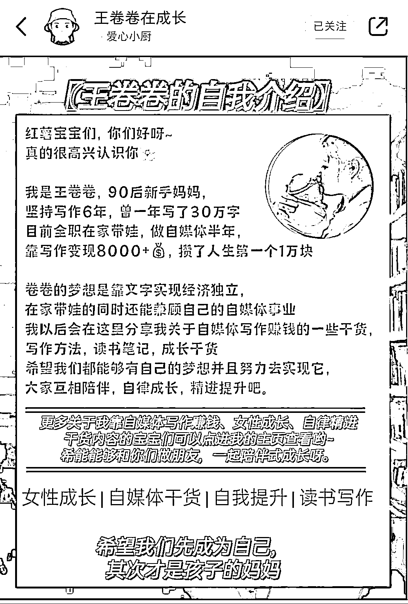

# 小红书丨付费学来的小红书干货分享给大家

> 原文：[`www.yuque.com/for_lazy/thfiu8/ilgwq0xd4bu9gigg`](https://www.yuque.com/for_lazy/thfiu8/ilgwq0xd4bu9gigg)

## (73 赞)小红书丨付费学来的小红书干货分享给大家

作者： 王卷卷在成长

日期：2024-01-04

大家好，我是卷卷，一个 93 年的全职妈妈，边带娃变做自媒体，一年变现 10 万+，2023 后半年时间精力花在小红书多一点，所以对于小红书的输出会更多，今天想给大家分享一点我自己做小红书以来的经验。

卷卷在做小红书之前，也是一个什么也不会的小白，听别人说普通人也可以做小红书，说很简单，但是我自己就是不会。

听别人说，网上学习就可以了，但网上找来的都是碎片化的东西，写的也比较零散，于是我东一句西一句的拼凑起那些信息，去做小红书，最终是时间花了，我的小红书也没有做起来。

（我之前自己做的账号毫无美感，也没有定位，学习之后的笔记就更加美观一点了）

后来我跟着老师的小红书训练课程学习，每天娃睡着的时候就是写文案作图，很多笔记都是我抱着娃写出来的。

好在努力没有白费，在课程结束的时候做到了 1000+的粉丝。

700 多粉丝的时候我就接到美物的广告，开始变现了。

后来因为回娘家后宝宝不适应，每天根本放不下，就暂停更新了，但是有一些当时没有火起来的笔记开始爆发出它的长尾流量，火起来了，现在粉丝已经快 2000 了。

天气慢慢暖和起来，宝宝越来越大，身体也好起来了。

我开始想做另外一个领域，也想看看我自己把学到的东西能不能灵活运用，于是我重新开了一个号。

这个号就是人设不强，专注做爆款，起号一周数据便起来了，三个月涨粉 3000+，收到很多广告咨询，只是价格偏低我就没有接。

所以变现方式有很多种的，大家只要做起来就不害怕变现问题。

（部分好物体验）

后来定了目标，接下来一个月做到 5000 粉丝，开通蒲公英合作，而我，也通过坚持发笔记实现了这个目标。

现在我特别有自信，如果新开一个号，我也能够很快做到千粉。

所以我今天想把自己这些付费学来的经验和自己的实践操作经验给大家分享一下。

让你们少走很多弯路。因为我也是从不会的阶段自己摸索了很长的时间，知道那种迷茫和无助，所以我想帮助跟我一样的朋友，在自媒体这条路上，走的顺畅点。

ps：我觉得这篇文章至少价值几百元，所以我希望你能够好好阅读并理解，最后能够上手去操作，这样我的目的也就达到了，

不然只是放收藏夹吃灰，那你永远也不会做小红书赚钱。

**今天的内容包括以下 9 个方面：**

1、你想做什么领域？

2、你要准备什么？要不要养号？

3、找对标账号研究（可以建立自己的选题库）

4、账号搭建，头像，简介，背景图，ID 号，昵称

5、学会制作一篇笔记（这篇步骤参考这篇文章）我再加一个点就是，我们的个人介绍页如何制作：

6、第一篇笔记完成并发布

7、零克查词查违规

8、文案部分字数不超过 1000 字

9、笔记不正常，但又没提示违规怎么办？

10、主动寻找灵感

**一、你想做什么领域？**

卷卷就自己接触过的几个领域和小红书上现在比较火的领域给大家分析一下。

1、成长领域：

我现在的一个是做的全职妈妈成长领域的，涉及一些女性成长，婚姻方面，自媒体成长的内容，也就是下面这个账号，近期处于断更状态，后面考虑转型。

卷卷自己的成长账号

**成长博主笔记类型**

**2、情感领域：**

我下面这个号刚开始就是走女性成长，后来转成情感恋爱方向的，因为定位不太精准，盲目追逐爆款，

所以粉丝虽然上去了，但是广告价格并不多，可接广告也少。后期的变现主要是走的好物体验。

大家可以参考一下。

**3、读书博主：**

有很多小伙伴很喜欢读书，但平时读过就忘记了，不习惯写读书笔记，也不喜欢分享，只是觉得自己读了就记住了。

但是好记性不如烂笔头，我们还是要把自己读完一本书的感悟写下来，通过加入自己的思考和人生经历，打造一个有人设的读书账号。

读书账号只要你认真写自己的读书感悟和思考，对别人有用，读者看了有收获，数据就会慢慢起来，一两百粉丝就可以接到书籍置换的合作。

只要坚持做，距离纸质书自由也是很容易的，而且出版社一般都是会和你保持一个长期的合作，

我第二个账号，每次快读慢活出新书了就会找我合作推新书。也算是一部分纸质书自由了。

**4、vlog 领域：**

其实这个我自己之前尝试过，拍视频比较麻烦我就暂停了，一个短短一分钟的视频，要拍很多个镜头，然后剪辑，配文案，音乐，一个视频剪辑下来真的很累。

但也有很多宝妈做这个做的很好的，就算记录自己带娃的生活，一日三餐，可拍的东西比较多，所以后期变现很广，且没有什么广告痕迹。

如果你是一个耐得住性子，又喜欢拍视频的人，你就可以试试，做法也很简单，去小红书上找你想要拍的领域即可。

***需要注意的是：**

现在小红书上那种精致生活的独居生活，带娃生活的视频太多了，如果我们的生活环境和自己的能力，拍不出那种很精致的感觉，

那就换个思路，或许普通人的生活也会引起大部分人的共鸣呢？

可以朝着这个思路去想想自己要做的领域。

**5、文案号**

如果实在不知道自己该做什么，那就做文案号，字写的好，就做手写文案号，如果字写的不好看，就自己在网上找图片，作图。

文案号出爆款的机率很大，但是文案号不值钱，所以后期变现不咋地，可以接接公众号推广，

也可以做起来之后 mai 号，不过我了解过，出售的号几千粉丝也没多少钱，这个就看大家怎么考虑了。

**6、育儿博主/母婴博主**

卷卷之前做过一个号就算育儿类型的，但是育儿领域的太卷了，加上我自己发宝宝照片，

发自己带娃生活根本没人看，就涨粉 600 多个，接到过一些置换就再没有做了，那个账号我注销了。

所以想给打算做育儿领域的，可以提供两个方向：

一个是育儿干货，这个不用自己真人出境，但是需要会作图，等会给大家看一下这些图片，就是这种图片，

一般稿定设计，黄油相机，美图秀秀这些就能够完成，但是要更上一层楼，就需要大家研究一下 ps，我自己是不会做 ps 了，大家可以研究一下。

还有一个就是用 vlog 的形式记录自己的带娃生活，因为这种就是咱们普通人的生活嘛，也会有很多人看的，重在坚持。

这种账号后期变现是很不错的，很多广告可以衔接在视频里，读者又不容易看出来。

这种账号也给大家找了几个我平时喜欢看的给大家研究一下。

以上就是对于领域的一些建议和分析，大家可以去参考一下小红书上这些领域的账号，也可以做其他类型的，因为我对其他领域不了解，所以这边就不多说了。

**2、你要准备什么？要不要养号？**

准备好坚持做一件事的心态，长期主义，

也要做好笔记发出去没水花的心态，

还有准备个手机（这个很重要😊）开个玩笑哈哈~

**关于养号：**

我当时注册账号之后没有想清楚做什么领域的，就什么信息都没有改，

每天去刷刷推荐页面，自己喜欢的就点赞收藏了，也会关注，不知不觉就当纯刷客当了一个多星期。

关注了有一百多人，但是那个账号确实流量很不错，我发第一篇笔记就有十几个赞了，然后小眼睛有 600 多，连着发了三天我就出了一个小爆款，涨粉 100 多。

后来爆款也出了很多，有很多上万浏览量的笔记！

所以养号这个你们看自己的时间吧，如果觉得时间多就多刷一刷，时间少就少刷几天，这个也只是我的一个经验吧。

**3、找对标账号**

当我们确定好自己想做的领域之后，就可以通过关键词搜索这个领域的博主去研究了，比如你要做育儿领域的，就搜育儿。

想做读书博主就搜读书，可以搜索用户，也可以直接通过笔记页面关注，对标账号可以是很多个，不限制一个账号哦。

**4、账号搭建，头像，简介，背景图，ID 号，昵称**

当我们知道自己想做什么领域，研究了对标账号，我们就可以注册自己的账号了，需要一个电话号码，自己准备好。

一个手机尽量不要一个账号换手机登录，换来换去麻烦，也不利于自己操作，而且还有被限流的风险。咱们就是普通的素人，想好好做号，不要搞乱七八糟的就行了。

昵称：给自己起一个跟自己领域相关的名字，一定要好记，比如你做读书博主，就起某某读书，或者什么书单之类的。

**简介：**

第一句话写自己的定位，打算输出什么类型的内容

第二句话写自己的人设，比如我是全职妈妈，我就会写出来

第三句话可以写一句自己喜欢的座右铭，也可以写鼓励自己的正能量的话，也可以不写。

（需要注意的是，前期我们的账号权重不高，先不要写邮箱号）

**Id 号**：这个是可以帮助我们引流的一个地方，建议没有想好的话先不要修改，只能修改一次哦。

**头像：**可以是自己的真人头像，也可以是符合自己人设的漫画头像，这个建议最好是真人头像，如果实在不愿意露面，那就选择漫画头像吧，也可以自己设计，我的是再美图秀秀上用动漫化身做的，很简单，你们也可以试试哦。

5、我们的个人介绍页如何制作：

个人介绍页的元素：大家可以看我王卷卷在成长的这个账号的个人介绍页，给大家分享做法；

黄油相机部分：

名字（王卷卷在成长）字体稍大一些，

**自我介绍部分：**

一句金句，可以是符合定位的话，也可以是自己喜欢，适当的小表情加持点缀。

美图秀秀部分：头像

贴纸，扣图，选圆形，即可

我刚开始的个人介绍页没有做，因为那会觉得自己没有什么可以介绍的，但其实是我想错了，其实我们每个人都有优点。

比如你坚持早起一年，取得什么成就，比如你大学赚了多少钱，这些都可以写，每个人都有自己独特的闪光点。用心去找出来用简练的语言写出来就行了。

**6、第一篇笔记完成并发布**

当我们把这些细节都做好之后，就可以写自己的文案了，当然前面做的工作没有白费哦，你在找对标账号的时候，就可以看看你喜欢写什么。

根据卷卷的试验，爆款是可以再爆的，我们可以根据自己的经历和思考，写出不同角度的同选题内容，记住不是抄袭哦。

**7、零克查词查违规**

写完笔记文案之后，用零克查词去查一下有没有违禁词提前用谐音或者表情替换了。

查完没有违规后，可以给自己的内容想一个标题，记住文案标题控制在 20 字，可以加表情符号，

文案标题可以和封面标题一样，但卷卷觉得既然有起两个标题的机会，那我们就不要浪费，

说不定有的小伙伴不喜欢这个标题，但喜欢封面标题，也会被吸引尽力看你的笔记内容呢？

**8、文案部分字数不超过 1000 字**

笔记文案部分也要注意，字数控制在 1000 字，写不下的可以写在图片部分，写的超过 1000 字了，就提炼小标题，把干货内容写在图片上

记住文案部分要分段，不然看起来不好看哦，密密麻麻的，看起来头晕乎乎的。

适当在文案中加一些小标题，因为小红书的女性用户比较多，小表情比较吸引人。

**9、笔记不正常，但又没提示违规怎么办？**

发布后可以复制链接到微信，点击后看一下是审核中还是违规，尽早做出修改，

如果正常情况下，小眼睛就会往上走，笔记内容优质的话，也会有点赞收藏，这个时候就不用再复制到微信查看有没有违规了。

**10、主动寻找灵感**

多刷推荐页，看最近的爆款是什么类型，也可以到热门话题去找找灵感，也可以参加一些热门的活动，可以瓜分官方流量。

好了，以上就是卷卷花了三天的时间写出来的新手如何从 0-1 去做一个小红书的干货内容，全文 5000+字，多图预警，

这次免费分享给大家，希望你们真的拿去用，不要只是问，要去行动，如果你把这些内容真的能够吃透了，再去行动，那你一定能够做出一个可以赚钱的小红书账号的。

最后，希望你们真的去实践之后，发现我漏掉或者我也没有遇到过的问题，欢迎你来咨询评论区留言交流。

我不一定全都知道，但我可以和你一起交流，说不定说着说着，答案就出来了。

以上，就是今天的内容了，在这里祝大家早日做出成绩！

#小红书#小红书干货

* * *

评论区：

林林 AIGC 写作 : 谢谢卷卷的分享，祝 2024 多出爆款～
王卷卷在成长 : 谢谢林林老师的鼓励呀
Annie : 感谢分享，请问可以加你吗？
阿格 : 从文字看的出来王卷卷老师是一个很真诚的人，谢谢分享
王卷卷在成长 : 谢谢阿格的夸夸😊
Love&Peace : 谢谢卷卷老师的分享，真的很有参考价值，辛苦啦
辰风 : 感谢卷卷分享
王卷卷在成长 : 谢谢辰风[害羞]

* * *