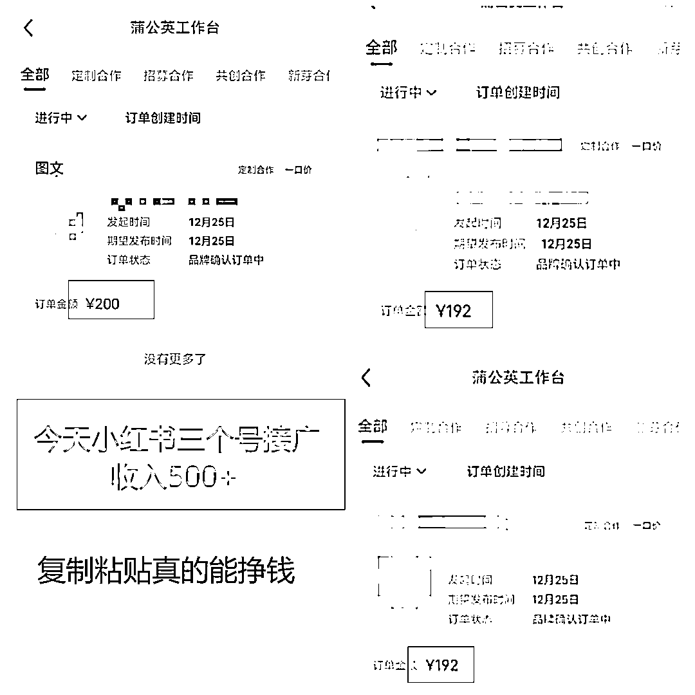
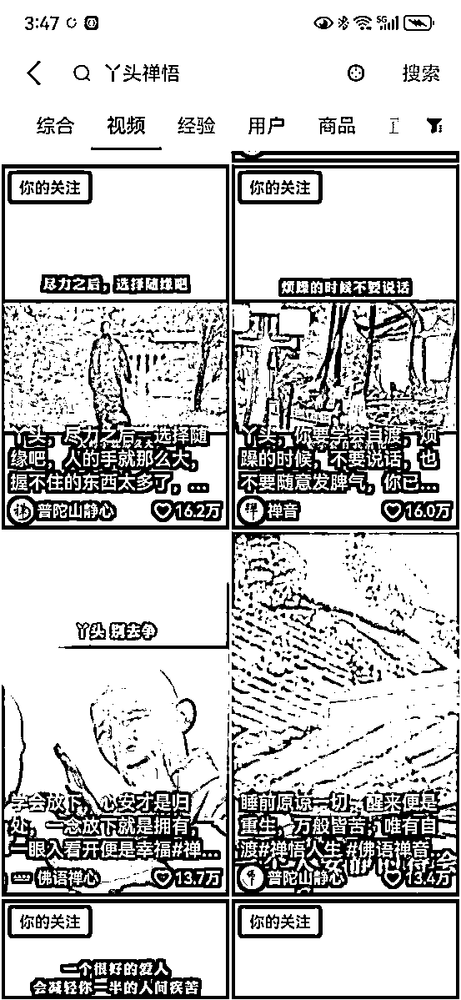
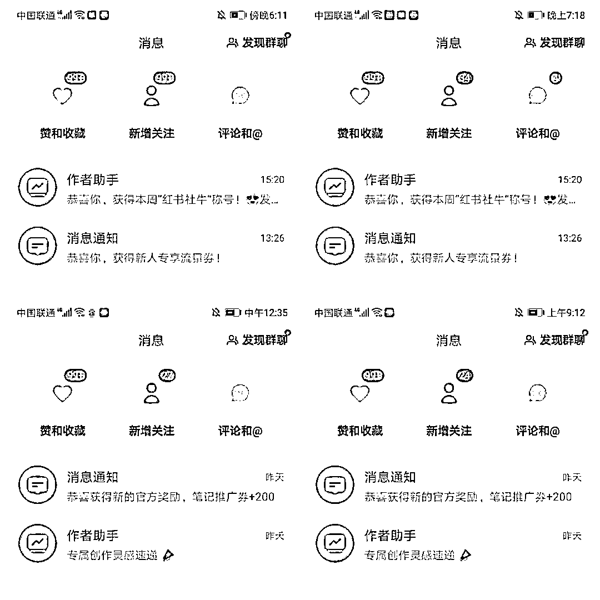
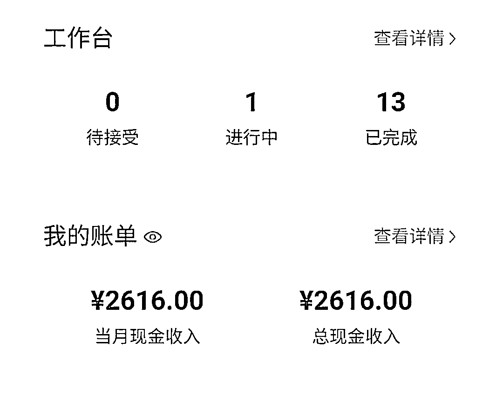
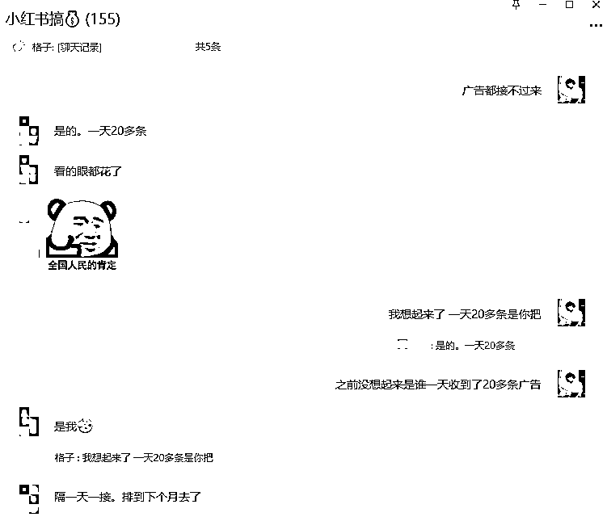
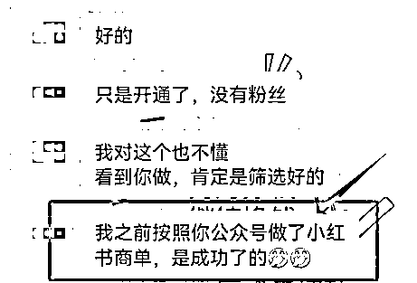

# 小红书简单粗暴无脑接广告，轻松变现 6000-8000 元

> 原文：[`www.yuque.com/for_lazy/thfiu8/bryn2uctf1t6gz6i`](https://www.yuque.com/for_lazy/thfiu8/bryn2uctf1t6gz6i)

## (102 赞)小红书简单粗暴无脑接广告，轻松变现 6000-8000 元

作者： 格子

日期：2024-01-05

小红书商单变现这个项目是我 6 月份就开始做的，并且投入了我 80%的精力，我是非常看好这个项目的，因为这个项目是我们普通人能挣到的钱，而且我认为接下来的一年小红书还有一波大的爆发。

说实话，日入四位数、五位数离我们还是很遥远的，不如把自己能挣到的钱先挣到，不管小钱大钱，能挣到的钱才属于我们，否则只会给自己徒增焦虑罢了。

这篇文章，可以说是保姆式分享，学习能力强的朋友，直接跟着这篇文章就能成功涨粉 1000 了，如果看完还不懂的，欢迎来找我。

**一、小红书怎么变现？**

其实小红书的变现途径不多，主要是这几种方式：

**1、引流到私域变现。**现在小红书对于引流越来越严格了，我为了引流废了五六个账号，但是小红书引流确实不错，吸引来的人都是很精准的。

**2、直播变现。**这个和抖音直播一样的，真正挣大钱应该在这里。

**3、图文带货/视频带货。**目前小红书是只要 1000 个粉丝，就能开通商品合作，发布文章/视频可以带货挣佣金。不过带货对于带货笔记要求很高，有时候明明笔记跑得很好，一旦你挂车后，平台就说你违规了。当然做得好的话，一条笔记能挣到的钱没有天花板。

**4、自己在小红书开店。**这种大部分做的都是无货源模式，不过这个需要你有很强的选品能力，而且需要花很多精力才能做起来，并且无货源平台打击得很严。

**5、接广告。**这个就是我们今天要说的，简单粗暴无脑式挣钱的项目。

**二、小红书接广告怎么做？（本次分享重点来啦）**

目前小红书只要你账号粉丝到 1000，就能开通博主合作，这个就是通过官方接广告，也就是我一直在做的商单变现。

像我们如果是新号，也就是刚刚过 1000 粉的话，一条图文广告报价就是 200-240 元，这个钱还是很好挣的，因为图文都是广告商准备好的，我们只需要复制粘贴发布就好了。

其实之前开通蒲公英接广告的要求是要 1 万粉丝的，前段时间小红书降低了门槛，只需要 1000 个粉丝了，这对于我们来说就是个好机会。

如果你本来就有 1000 粉小红书号的话，那就直接开通博主合作就行啦，如果没有粉丝，怎么办呢？

小红书这个平台，说实话应该是全网平台最难涨粉的平台了，很多人一个月两个月大半年甚至 1 年都涨不到 1000 粉，我相信这种情况还是挺多的。

但是其实呢，任何平台都是有它的流量密码的，找准了流量密码，涨粉也不难。最近不少小伙伴都给了不错的正反馈，有小伙伴直接第一篇笔记就到 1000 粉的，也有小伙伴三五天就到了 1000 粉，当然更多的还是需要大半个月或者 20 多天。

所以今天的重点分享就是，小红书到底如何才能快速涨粉到 1000 呢？

不知道大家平时有没有在抖音刷到这种账号：

禅悟其实也是心灵鸡汤的一种，可能是大家生活节奏越来越快，压力越来越大，这种鸡汤视频流量出奇地好。

目前抖音上做这种的蛮多，但是小红书上不多，并且经过我们实操一段时间下来，这种类型的流量不错，转粉率也可以，涨粉较快，且因为视频是自己制作的，基本不会出现非原创违规。

很多机构培训的都是教大家如何去搬运如何去重，但实际上搬运的账号在平台上根本走不长远，动不动就违规，违规次数多了，就会被限流。

这种禅悟的视频制作其实也简单，我给大家说下简单的步骤：

1、抖音找爆款视频/素材

2、用小程序配音神器提取文案

3、配音神器配音

4、剪映剪辑

5、小红书发布

如果本身就有视频剪辑基础的，相信我这么一说，大家就知道怎么去剪辑这个视频了！

视频需要用到的素材，自己全网找，通过小程序去水印保存下来就可以用，也可以花钱去淘宝/拼多多花钱买素材。

关键是这类视频在各个平台流量都很好，抖音就不说了，看我一开始的截图你们就知道，在视频号上也不错，视频号上有个创作者分成，也可以挣广告费，另外就是视频号也可以短视频带货的。

同理，抖音和小红书变现途径也是一样的，接广告视频带货都可以，真正实现一鱼多吃！

**三、小红书接广告应该注意什么？**

说实话，小红书这个平台，动不动限流，不管是你做个人 ip 还是接广告，都是莫名其妙就给你限流了，确实搞得人很烦躁。

所以我们接广告的时候一定要注意，这真的是血的教训，我 5 个账号都因为接到违规的广告被限流了，一旦被限流，就基本很难救活，所以下面的点一定要注意：

**1、不接私单。**官方渠道的都是从蒲公英来沟通的，如果是私信你的，要问清楚对方走不走官方渠道的，如果不走的，千万不要接，除非是靠谱人介绍的。

2、**不能什么广告都接。**这些产品千万别接，容易违规：涉及到功效、疗效，涉及到医疗、保健、传销、金融的一律不接。

**3、接广告的频率不能过高，不能天天接。**

广告如果连续接得太多，那账号流量扛不住，很容易废掉，反正具体得看你自己账号流量，如果流量不太好，最好是隔一天接一条，不要贪心，只要账号优质，不怕挣不到钱。

很多人可能有段时间流量特别好，后台邀约很多，就有点贪心了，巴不得天天接广告，那只是眼前一时的利益，说不定你连续接三四天，你的账号就废了，得不偿失。

**所以这个项目，一个账号能挣到的钱是有限的，一个号只能挣 2000-3000， 我有个号 11 月底到的 1000 粉，12 月就挣了 2000+，这个收入是已经完成的，算上进行中的一单，收入是 2800+。**

**四、怎么多账号运营，实现月入 6000-8000 元？**

因为一个号挣得有限，那我们可以多做几个账号。

我们有了做第一个账号的经验，做第二个就有心得了，涨粉也就快了，你知道什么样的素材流量更好，也知道什么样的素材更能涨粉，而且我们前面发过的视频，我们又可以重新剪一剪发到新号上呀。

只要我们账号流量好，那么广告真的接不过来的，有个小伙伴一天接到 20 多条广告，直接把一个月的档期排满了。

并且这个项目多账号运营更好做，因为你微信里的广告商越来越多，如果我们有几个号，那么就 1 号账号没档期，那就和对方约 2 号或者 3 号。

**如果你做了三个账号，那么一个月能挣到 6000-8000 元，想要挣得更多，那就矩阵化运营更多，小红书这个变现方式相比其他变现方式真的要简单粗暴无脑很多，真的很简单！**

目前我小红书群里 190 多个学员，除了最近新加入的，之前加入的，只要听话照做了的，80%已经变现，有些学员甚至做了三四个账号，变现了大几万。

当然我们今天分享的这种起号方式只是我培训学员的其中一种，我的课程是培训了 10 多个领域了，且不断在更新新的领域。像最近我们新做的领域涨粉更快，我一天涨粉 1500+。

我说这些只是想告诉大家，我很看重这个项目，因为是我们普通人能挣到的钱，大家不用担心只是挣一波快钱，我从 6 月份就开始做这个项目了，如果是一个短期项目，我也早就不干了，不可能投入那么多精力进去的。

好啦，今天的分享就到这里啦！如果学习能力强的小伙伴，看完这场分享完全可以自己去起号了，前段时间我有个公众号粉丝给我反馈，他就是看了我公众号关于小红书商单的分享，他跟着我的分享去做，真的挣到了钱。

所以只要你有这个学习能力，一点就通，相信你也一样可以。

最后送给大家一句话：**自媒体人必须具备的要素就是强悍的执行力，如果你对这个项目感兴趣，那就立即去做，想 100 步不如走 1 步。**

祝大家早日千粉，早日挣钱！

* * *

评论区：

梧桐 : 谢谢分享
杨子鸣 : [强][强][强]
刘七八 : 有无商单资源的 mcn 机构，手里有一批千粉号，求对接
格子 : 有
侯的住 : 想问去哪搞那么多实名号呢？
格子 : 七大姑八大姨都可以呀
justfk : 一个实名只能搞一个号吗？
格子 : 对的，但是这个很容易，亲朋好友都可以，也可以花钱解决

* * *