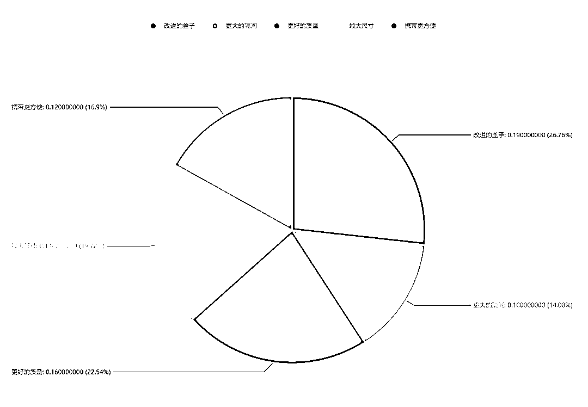

# TikTok 美国小店亿级赛道“午餐盒”市场调研报告

> 原文：[`www.yuque.com/for_lazy/thfiu8/wvol5hfar8zo0pkm`](https://www.yuque.com/for_lazy/thfiu8/wvol5hfar8zo0pkm)

## (20 赞)TikTok 美国小店亿级赛道“午餐盒”市场调研报告

作者： 阳光杉木

日期：2024-01-03

**美国市场午餐盒调研**

通过**PIPIADS**广告大数据检测，午餐盒类目开始涌入玩家入场 tk 小店测试，多家美国 tiktok 小店投放这类产品拿到结果，最好的一家出了**6 万单**。

皮皮调研其中五个店铺，数据可以看到，**排名前五均拿到万单**的销售结果

以 tiktok 小店店铺 **MegaMart724 举例，** 观察该小店在 tiktok 上部分投流数据

详情（[`www.pipiads.com/zh/tiktok-shop-store/8646959139956229525#nav2`](https://www.pipiads.com/zh/tiktok-shop-store/8646959139956229525#nav2)）

广告首次发现时间-最后发现时间：**2023.09.15-2023.12.26**

天数与展现：累计投放**94**天 共计**13.5M**展现

广告条数：**3**条广告

主要投放地区：美国

按照美区通用**cpm~5**美金估算出广告主在 Tik Tok 上投放的广告费约**67500**美金

小店只上架了一个产品，售价为**1.29**美元，出了五万单。同类产品定价 10 美金左右，可以判断该店铺大概率是**全托管模式。**

观察其投放数据

广告展现合计**13.5M** 主要有三条素材进行投放,投放展现量最高素材如下： 

每条素材都是达人**出镜+口播**的方式去进行产品演示和讲解，可以更清晰的展示产品功能。像午餐盒这类功能性产品，素材内容直接强调产品的实际用途，有兴趣的用户就会停留，更容易提高产品转化率。

分析大盘部分午餐盒数据

平均 CPA**18.5$**一单 目前年末投放相对较少，整体表现普通。

观察 TikTOK 相关关键词（**launch box**）

可以看到有关午餐盒的品有大量广告主在投放，视频播放量很高，且评论区购买意愿较强，说明这个产品在国外市场有需求。

观察亚马逊售卖情况

产品销量很高

分析售卖 Top 1 产品：**多功能沙拉盒**

**使用场景**

**客户期望**

**购买动机**

提炼评论区消费者评论可以得出

**1:  ** 客户的购买意愿更偏向于**便捷、恰到好处**的大小同时容纳更多的食物、耐用且制作精良、设计酷炫可爱

**2：**客户在意收纳盒的**密封性、尺寸个性化选择**、多隔间。

**3：**客户更喜欢便当盒配有**勺子和叉子、易于清洁**、帮助控制饮食习惯

这些需求对应的也是选品的重要机会点之一：

如需要更多的评论需求内容，**点赞文章后私信皮皮获取。**

观察 etsy 售卖情况

通过**[etsyshop.ai](http://etsyshop.ai)**选品网站搜索关键词

发现大多的店铺售卖木质定制餐盒，有更多的图案和创意可提供选择，定位个性定制。。

观察谷歌搜索趋势（地区为美国）

在谷歌上搜索" lunch box"，发现搜索量趋于稳定。**8 月份**会有明显爬坡增长，因为美国地区这个时间段是返校季，对该类产品关注度较高，需求明显。

1688 拿货价参考（5~20 元左右）

1688 午餐盒供应商非常多，对应的价位也是**￥5-20**不等，爆品玩家直接找没有做 tt 的货盘开普货测试，长期深耕的玩家可以走建联稳定供应商 开模测试

当然，开模意味着更多的成本，据工厂反馈，一般开模费**10-20 万**不等。

**分析产品**

与国内大环境不同，从以上各个平台的数据可以看出午餐盒在国外有一定规模的市场需求。

**1.**学生带饭需求： 学校不提供午餐，学生需要自己带午饭，同时像小学或幼儿园，家长更加注重孩子的饮食质量。午餐盒能够提供**方便携带、分隔食物的功能**，可以满足用餐的日常需求。

**2.**健康意识： 国外大多数对健康饮食的关注度较高，像大多上班族或成年人喜欢自定制饮食计划，健康饮食延伸的**沙拉盒、轻食盒**有明显上升趋势

**3.**个性化需求：午餐盒使用频率比较高，那么它不仅要有功能上的完善，**通过颜色、外观等差异**来满足心理上的个性需求。这也是后续商家可微创新打造爆款或品牌调性的思路之一。

**热销时间**

美国的每年 7 月中旬至 9 月中旬的返校季（**Back to School**）可谓是购物的黄金季节。这段时间被认为是仅次于圣诞节的购物旺季，因为家长和学生会踊跃购买学习用品、电子设备、衣物以及其他必需品。午餐盒作为生活必需品在这个时间段销量比较高，广告主在**6~7 月**预热自己的产品反馈比较好。

与此同时，南北半球的季节相反，澳洲的返校季在接近秋季的二月份。那么**一月份**左右也可以考虑往这个地区进行投放。

所以，建议大家在投放产品的过程中也要留意地区和时间的差异。同时与儿童返校相关的产品是可以深入挖掘的一个领域。比如饭盒、餐具、包装盒、清洗产品等，大家可以借鉴爆款的理念，延伸爆款类目，挖掘更多的可能性。

**选品延伸**

拿 tiktok 关键词举例

搜索 lunch box 会发现关联关键词 **lunch bags**延伸出来

这个选品调研的过程，又进一步的去搜索相关数据信息：

查询 lunch bags 投放数据:

观察到目前投放的商家很少，销量普遍很低，继续研究

观察亚马逊售卖情况

发现亚马逊销量好几个链接都卖的很好，证明这个赛道有机会，只是 tiktok 还没有人把这个品做爆

这里，我们就可以考虑进行微创新，或者进一步挖掘这个赛道和机会

是否可以**午餐袋和午餐盒一起做捆绑**售卖

是否可以通过 etsy 做一些贴纸进行**微创新**更符合 tt 调性

是否可以去**挖掘自然流**数据，了解午餐袋的市场情况....

* * *

评论区：

暂无评论

* * *