# 做一个出海工具真的不难，2024 一起赚美金

> 原文：[`www.yuque.com/for_lazy/thfiu8/xgg5ptntxsdilanv`](https://www.yuque.com/for_lazy/thfiu8/xgg5ptntxsdilanv)

## (60 赞)做一个出海工具真的不难，2024 一起赚美金

作者： Jason Yu

日期：2024-01-05

一个下载量不到 5k 的充电动画 APP，月营收 40k 刀，靠的是什么？

选品。在需求足够精准的情况下，哪怕没有巨额流量，产品也可以很赚钱。

正确的方向，是产品成功的一半。尤其对于资源有限的小企业和独立开发者来说，如果一开始方向就选错了，很可能就会导致项目的夭折，甚至放弃独立开发。

探讨工具 APP 如何成功“出海”是一个广阔而复杂的主题，涵盖了团队组建、账号注册、产品开发流程、上架流程、ASO 优化、运营投放策略等多个方面，同时也包括本篇万字长文的选品指南。

今天我会告诉你，如何规避那些有风险的产品方向，如何找到找到那些高用户需求、低市场竞争、高用户价值、良好商业潜力的、现有解决方案尚不完善的细分市场或类别，以及如何找到选品。

这是一个真正躺赚的模式，产品做好了，放在商店等收钱即可。或许有一天，你的 APP 就会给你带来泼天的富贵。

坦白说，这篇文章是我自出生以来写得最长的一篇，我的第一次长篇大作就献给了“生财社区”和各位圈友。有帮助的话，希望大家多多点赞、评论，给予我更多的信心。

大家好，我是 Jason Yu～～今年 9 月份加入的生财，作为新成员，在这里向大家问好🙏🙏。

我还有个打造中的 IP，叫**鱼总聊 AI**，所以大家称呼我 Jason 或者鱼总都可以。

我今天分享的主题是和**出海工具 APP 选品方向**有关，非常的细分，适合哪些人听呢？

1、初创小团队/初创企业家

2、个人开发者/独立程序员

3、技术爱好者和学生

4、移动应用市场分析师

5、投资者和创业孵化器

我呢也手动打上几个关键词标签，方便合适的受众进行观看的选择，对此无兴趣的同学可以带着遗憾划走了。

出海工具 出海 APP 、选品 、个人开发者、iOSAPP 、AppStore、程序员 、产品经理 、移动互联网

在我开始正式的分享前呢，我还是想仔细的介绍一下我自己，毕竟在我不被大家熟知前，我所分享的内容并不重要，而更重要的是：**我是谁？凭什么能分享这个主题？**

我是一名从 2022 年 9 月开始的创业者，在此之前，我在一家专注于海外市场的公司工作了近四年时间，参与了许多出海工具产品从无到有的过程。

我曾经负责的产品登顶了美国 App Store 的下载榜单，其中一款产品还得到了苹果 ASM 官方网站的长期展示。我的职业生涯也经历了从资深 UI 设计师到产品经理，再到业务负责人的转变。

现在，我既是出海工具领域的创业者，也是 AI 领域的自媒体人。从去年九月到今年十二月，我上线了 12 款 iOS 工具应用和 2 款 Android 应用，还有 4 款 APP 正在开发中。这些产品每月为我带来的收入接近 1 万美元。

而今年六月到九月底，我几乎全身心投入到 AI 自媒体事业中，这为我赢得了超过 10 万的粉丝，尽管变现能不多，但这也为我开辟了新的赛道：AI 自媒体+知识付费。

OK，正片开始。

# 一、出海工具选对方向的重要性

对于出海工具 APP 的选品方向至关重要。在生财社区，大家对于“出海”这一概念应该不陌生，对工具的认识也同样如此。然而，“出海工具 APP”这个概念，可能会让很多人感到新奇，因为关于这个主题的分享确实不多。

另外，APP 作为一种产品形态，它的开发和运营相对较为复杂，需要团队的紧密协作。

为了让大家更清楚地理解，我打算将“出海工具 APP”这一概念分解开来。请想象一个由这三个部分组成的结构图：

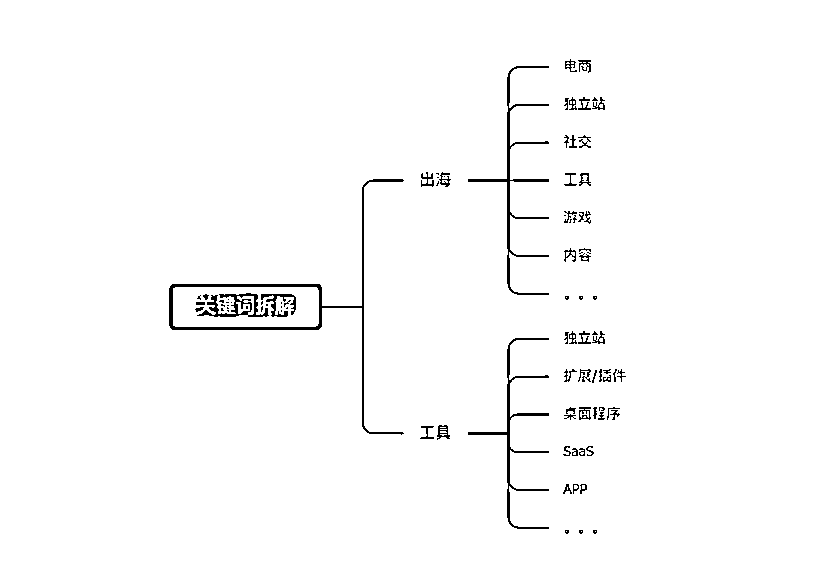

1、出海：指的是将产品推向海外市场。

2、工具：这里的工具指的是能够帮助用户解决特定问题的软件。

3、APP：应用程序，是用户通过下载来使用的软件。

当我们将这三个广泛的概念相结合，便构成了一个非常细分的市场领域。

那么，“出海工具 APP”到底是什么呢？GPT 为我们提供了一个非常直观的答案。

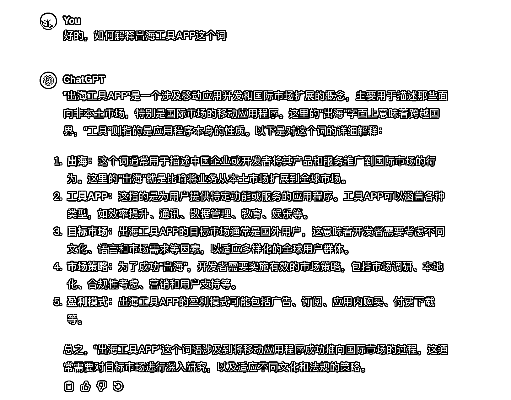

开发一款出海工具 APP 是一个复杂而多环节的过程，包含了市场调研、产品规划、设计开发、测试验证、上市推广等关键步骤，以下是通用的一个流程：

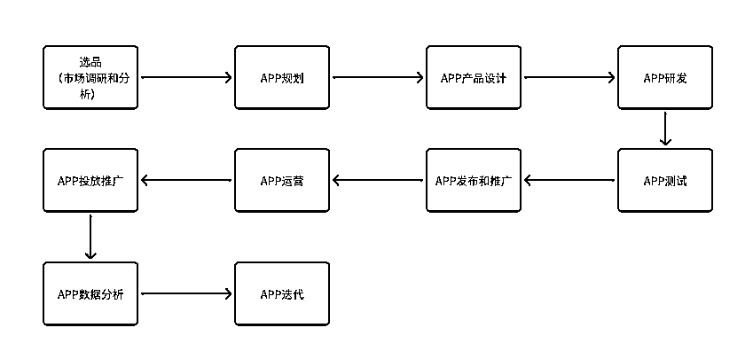

选品，或者说选定正确的产品方向，仅是这个复杂流程中的起点。但正因为它是起点，它的重要性不言而喻，特别是对于资源有限的小企业和独立开发者。

没有足够资源去试错，如果一开始方向就选错了，很可能就会导致项目的夭折，甚至放弃独立开发。

在我自己的 APP 开发经历中，有过凭直觉而非市场数据来决策的时候，而这导致的结果就是产品都是没有流量和收入的。这里分享两个教训和启示的例子：

1、Instagram 最初是一个名为 Burbn 的社交平台，功能繁多。但创始人通过市场研究和用户反馈意识到，用户最喜爱的是分享照片的功能。

因此，他们裁剪了其他功能，专注于简化和完善照片分享体验，这个决策直接促成了 Instagram 的爆炸性成功。

2、抖音在计划出海的时候，进行了深入的市场研究，针对不同国家的文化和用户喜好进行了本地化调整，最终孕育出了全球现象级产品 TikTok。

因此，无论是对市场的敏感洞察，还是对用户反馈的迅速回应，都是独立开发者成功的关键。这意味着我们需要投入时间和努力去深入理解市场和用户，找到那些最有潜力、最贴合市场需求的方向。

**正确的方向是产品成功的一半。**

我知道，在这个流量至上的时代，很多人可能会反对我的观点，认为流量才是关键。没错，流量确实重要，但我认为，如果产品是“1”，那么流量就是“0”。只有有了好的产品，流量才能发挥最大的作用。

# 二、哪些产品方向尽量不要选择

在选择出海工具 APP 的产品方向时，有些路可能不太适合小团队和个人开发者走。这些建议来源于我个人多年的行业经验，但请注意，这并不是一成不变的规则。

毕竟，每个人的经历和认知都是独一无二的。我自己目前的经验主要集中在工具类应用上，而对其他类型的产品了解不多。

如果你对我的观点有不同的看法，欢迎来找我理性讨论。当然，如果你是那位隐藏的大佬，轻喷，如果能指点一二，我会虚心接受。

在产品选型时，我总结了一套“三不选”的原则，供各位参考：

**1、避免选择竞争激烈的市场方向。**

在一个竞争白热化的领域，即使是微小的创新也难以脱颖而出，更不要说是资源有限的小团队或个人了。

**2、不选择需要高成本投入的市场方向。**

大规模的广告投放、昂贵的用户获取成本，这些都可能会迅速耗尽有限的资金。

**3、规避难以合规的市场方向。**

面对严格的监管环境，合规的难度和成本都可能成为发展的绊脚石。

在产品之路上选择正确的路径，能为你节省大量的时间和资源。记住，选择正确的不仅是起点，它还关乎你能走多远。

### （1）不选高度竞争的市场方向

当我们谈论不选择高度竞争的市场方向时，我们指的是那些巨头云集、用户基数巨大、利润丰厚的品类。在这些领域，大型企业和成熟开发者纷纷角逐，市场已经变成了一片红海。

以 APP 市场为例，许多品类都属于高度竞争的市场方向，例如社交媒体、流行游戏（如三消、策略、角色扮演类）、视频流媒体、健康健身应用等。

今天我们的焦点主要是工具类应用，这意味着我们已经排除了那些竞争异常激烈的赛道。

例如，浏览器这一工具类产品。市场上已有的主要玩家，如 Google Chrome、Mozilla Firefox、Apple Safari 和 Microsoft Edge，不仅功能丰富，而且经过多年发展已经拥有庞大的用户群和高度市场认可。

在这样的情况下，再想进入这一市场，面临的挑战将非常大，大概率难以获得显著流量。

同样的情况也适用于邮件客户端 APP、云存储 APP、防病毒和安全软件等高度竞争的市场。对于我们这些资源有限的小团队和个人开发者来说，进入这些市场的风险和挑战可能远远超出我们的承受范围。

### （2）不选高成本投入的市场方向

在选择产品方向时，另一个需要避免的是高成本投入的市场。APP 的高成本可能体现在开发人力、技术、服务器、维护和投放等方面。让我们通过一些具体的例子来详细了解这些成本：

**1、开发人力成本高：**

专业图形和视频编辑软件，如《Adobe Photoshop Express》和《剪映》，就是开发成本极高的例子。这类 APP 需要复杂的图像和视频处理功能，要求开发者具备专业技能和深厚的领域经验。

这类产品不仅开发周期长，而且成功的不确定性很大。

**2、技术成本高：**

需要使用昂贵 SDK 的产品。例如，涉及人像分割和特效的视频处理 APP，年费用可能高达数十万元。如果产品推广不成功，这些成本可能就打了水漂。

**3、服务器成本高：**

云存储服务类 APP，如《Dropbox》，需要大量的服务器资源来存储和同步用户数据。如果 APP 的商业模式不足以支持这些前期投资，这些成本可能无法回收。

**4、维护成本高：**

社交应用和企业 CRM 系统工具需要持续更新和维护，以适应不断变化的商业需求。这也是资源有限的小团队和个人开发者应该避免的方向。

**5、投放成本高：**

VPN、清理工具、健康类 APP 等，在市场上竞争激烈，推广通常需要大量广告投放和市场营销活动。这些产品的成本回收周期往往较长，对于个人开发者来说风险较高。

选择低成本、高回报的产品方向对于个人开发者和小团队尤为重要。避开这些高成本的市场方向，可以更好地利用有限的资源，寻找那些既能发挥自身优势又能满足市场需求的机会。

### （3）不选难以合规的市场方向

**一定要合规、一定要合规、一定要合规！**

开发者最怕的不是缺乏流量或盈利能力，而是面临产品无法上线或被下架封号的风险。所有的努力如果因不合规而付诸东流，那将是极大的损失。

因此，稳健赚钱的首要原则是尽量避免涉足不合规的产品。如果确实要做，那么妥善处理账号隔离至关重要（这个话题我们可以在另一篇帖子中详细探讨）。

许多人都说，《刑法》里提到的行业往往最赚钱。同样，在 APP 市场中，那些不被允许的领域往往利润最丰厚。

因此，一些开发者会想尽办法伪装上架这类应用，但这类做法风险极大，尤其不适合独立开发者和小企业。下面我列举一些应该避免的产品类型，希望能帮助大家规避风险：

**1、VPN 服务 APP：**身在国内，就千万别想着去做这种应用，否则等待你的可能是缝纫机，即使你做海外，那也一定得充分了解市场和法规，在没有足够的成本前，不要轻易尝试。

**2、密货币钱包和交易 APP：**加密货币相关的应用由于涉及金融监管、安全性和欺诈风险，可能在审核过程中面临更严格的审查。

**3、呼叫录音或间谍 APP：**这些应用由于涉及隐私和法律问题（例如电话录音需要对方同意），通常在 App Store 的上架审核中受到限制。

**4、版权内容共享 APP：**用于共享或下载版权受保护内容的工具可能因侵犯版权法而无法上架，即使上架，以后也有可能面临着法律风险，被罚款或者踩缝纫机。

除了以上的一些产品类型，还有几个在独立开发者卷到不行的品类，被称为**中国独立开发者的三件套**：ToDo，记账，日记（笔记）。

这几个品类在国内做，机会相对较小，市面上的竞品数量已经相当庞大，而且难以体现差异化。我在的很多独立开发者群里，做的类型最多的产品就是 ToDo 和日记类，要想赚到钱，不建议新入局 APP 市场的开发者再次去做。

如果要做出海，那么需要克服市场竞争、本地化和用户习惯等方面的挑战，在产品的调研、规划和设计上多下功夫，来做出适应国际化的特色产品。

总之，对于小型开发者和小企业，避免接触上述产品类型是明智的选择。只有在你有相关产品经验并懂得如何规避风险时，才可以考虑尝试。

# 三、那到底要如何去选产品方向呢？

选择正确的产品方向是一项既复杂又关键的任务。基于我的个人经验，我总结出了五个选品法则来指导这个过程：**做自己、近市场、近流量、看榜单、抄同行。**

让我来详细解释这些法则：

### （1）做自己

**"做自己"意味着从个人需求出发来寻找产品方向。**对于许多普通开发者来说，这是一个挑战，因为他们要么缺乏创意，要么他们的想法恰好落在了之前讨论过的不宜选择的方向上。

那么，如何更好地挖掘自己的需求呢？这是一个值得深入探讨的话题。有些人可能在上厕所时突然灵光一闪，有些人可能在睡梦中梦到一个好点子，还有些人能在日常生活中发现需求。

我的许多灵感来源于日常生活的琐事，尤其是上厕所、睡觉的时候，以及我在体验不同 APP 的时候。

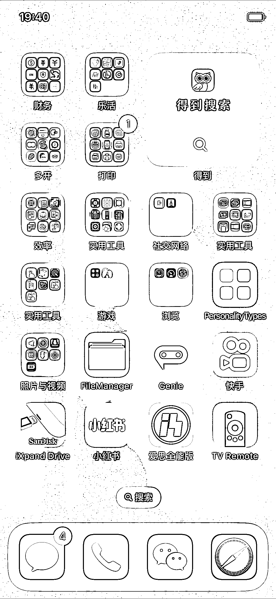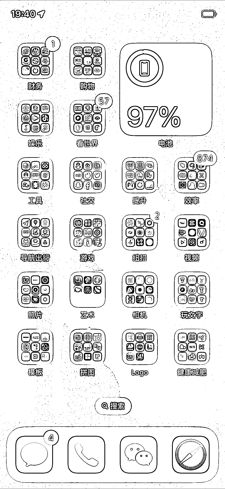



例如，我手机上的应用超过 400 个，覆盖了各种品类。我会根据自己的需求下载并体验多种同类产品。

这不仅能帮助我发现潜在的需求，还有助于我在众多应用中寻找灵感（小提示：也许你也可以从这些 APP 中找到一些不错的产品方向）。

举个例子，有一次我在上厕所的时候，因为便秘（这下被大家知道了～～），我想到是否有应用可以记录排便情况，以帮助判断健康状况并提供饮食建议。

在 App Store 上搜索后，我确实找到了类似的应用。虽然这类产品的下载量不高、市场小众，但竞争也少。

如果设计和体验出色，这类产品有可能被推荐。但由于商业价值不高，这类产品并不在我的考虑范围内。这只是一个从个人需求出发寻找产品需求的例子。

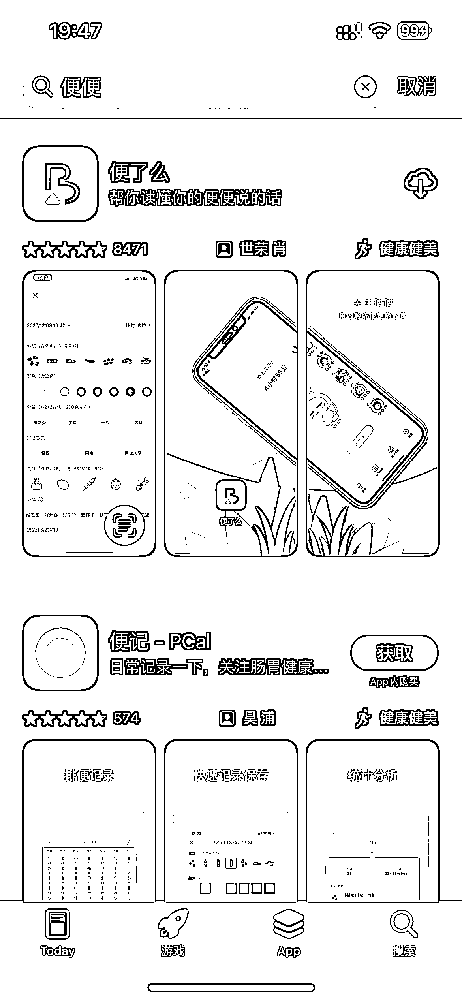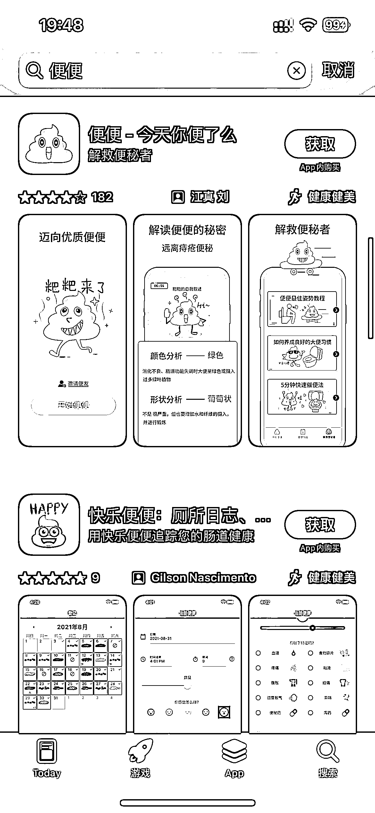

#### 1、**发掘需求的方法：**

**发掘自身需求的方法可以多种多样，以下是一些有效的策略：**

A：回顾自己在日常生活或工作中遇到的问题和挑战。思考是否有可能通过一个 APP 来解决这些问题。很多成功的 APP 起源于开发者自己的需求，比如“钱迹”的开发者李唐，“白描”APP 的开发者陶乐正等。

B：从个人爱好或趣味活动中发掘 APP 的创意，例如你热爱园艺，可能就会想到开发一个园艺管理或植物识别的 APP，你爱好阅读，那就可能想到一个摘录书籍内容的 APP。

C：深入探索自己的情感和心理需求，如减压、焦虑管理等，这些往往是许多人共有的需求，可以转化为心理健康类的应用，如白噪声、失眠记录这种都是很有市场的。

#### 2、**在发掘需求时的注意事项：**

A、记录灵感：当你发现一个潜在的需求时，一定要立刻记录下来。我曾经有过几次夜间想到好点子，却因为没及时记录而忘记，事后非常后悔。

现在，不论是晚上想到的还是梦中出现的点子，我都会立刻在手机上记录下来，然后在市场上寻找类似产品进行体验。

B、整理和调研：我会将记录的产品思路整理在 Notion 中，当需要进行头脑风暴或开发新产品时，我会拿出这些思路进行详细的整理和市场调研。

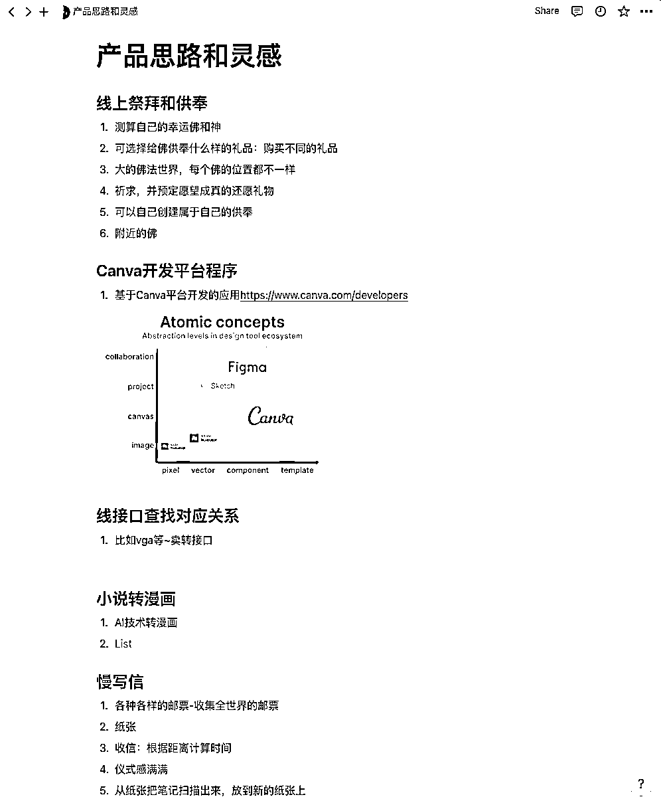

### （2）近市场

"近市场"的概念指的是靠近市场，即**关注市场上投放较多的工具产品**，了解它们的品类、数据表现和变现方式。为了有效执行这一策略，以下是一些关键的方法和技巧：

**1、成为市场运营专家：**如果你本身是市场运营人员，那么你自然懂得投放策略，并且可能已经积累了相关资源。这包括对一些产品的投放数据的访问能力，这通常需要通过付费平台获得。

**2、利用数据平台：**中国国内有许多数据平台，如广大大、热云数据等，可以提供有关 APP 市场和投放的数据。如果你关注 ASA（苹果搜索广告）方面的投放，七麦数据和点点数据也是很好的资源。

**3、建立合适的网络关系：**如果你本身并不是市场专家，那么建立一些在这一领域内的人脉网络也是非常有用的。结交懂得市场投放的朋友可以为你带来巨大的好处。

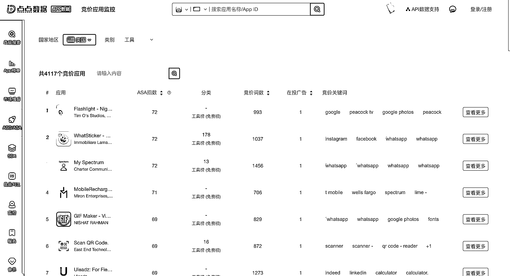

当然了，在查看投放数据时，一个有效的技巧是专注于一年内上线的小团队产品。这样做可以排除掉大公司和资金雄厚的团队，同时也避开了那些拥有高权重老账号和老产品的竞争。

在大致相同的起跑线上，你可以看到哪些产品值得被重点投放，进而进行进一步的筛选。

这种方法可以帮助你识别出市场上正在受到关注的产品类型，从而更好地定位自己的产品开发方向。

### （3）近流量

“近流量”这个原则强调的是：**流量在哪里，我们的产品方向就应该在哪里。**在这里，所说的“流量”主要是指那些大型平台，比如 Instagram、YouTube、Canva、TikTok 等。

这些平台掌握着互联网的主要流量，因此，基于这些平台未被满足的需求开发应用，是一个非常明智的选择。

以下是一些基于不同平台的 APP 产品示例，来帮助大家更好地理解这一原则：

#### 1、**基于 Instagram 的 APP 产品**

A：Layout from Instagram: 一款图片拼接工具，允许用户在 Instagram 上发布创意拼贴。补充 Instagram 帖子发布不能使用拼图的痛点。

B：Text On Photo，用于图片上添加文字的工具，仅此一个功能，补充 Instagram 发帖时图片无法添加文字的痛点。

#### 2、**基于 YouTube 的 APP 产品**

A：VidIQ: 一个 YouTube 优化工具，提供视频分析、观众洞察和 SEO 建议等功能，在美区的摄影榜榜单也是比较靠前的。

B：HD Video Downloader：YouTube 视频下载 APP，基于 Youtube 没有会员无法下载视频的痛点，这类产品在前两年还非常的火爆，流量也非常不错，不过这种产品会有一些潜在的侵权风险和上架风险。

#### 3、**基于 TikTok 的 APP 产品**

A、InShot: 视频编辑应用，提供视频剪辑、滤镜、音乐叠加等功能，非常适合制作 TikTok 视频。

B、SaveTik：同样的 Tiktok 视频下载的应用，刚需，而且实现的技术也不难，只要先于其他开发者做出来，你就可以获得很好的流量和营收。

通过这些例子可以看出，**挖掘大平台上未被满足的需求**，并围绕这些需求开发 APP，是一个高效的策略。这不仅能帮助你抓住现有的流量，还能提供有价值的服务给用户，从而提高你的产品成功率。

近年来，很多成功的产品都是基于像 TikTok 这样的新兴平台以及像 Instagram 这样的老牌社交平台推出的。

例如，Prequel 这样的视频特效 APP 就是基于短视频和社交平台崛起的，成为了该品类的超级巨头，年营收高达 2440 万美元。

每一个新兴平台的崛起都伴随着新机会的出现。例如，近期的 GptS 商店，我们可以围绕它开发辅助性质的 APP，比如专门用于排名或分类 GptS 商店中的应用的 APP，或者提供 GptS 商店应用独立存储的 APP。

甚至可以在 GptS 商店的框架下开发全新的非 APP 类产品。

同样，AI 绘画领域的巨头 Midjourney，直到现在也没有自己的 APP，因此，那些冒充或模仿 Midjourney 的 APP 也能获得不错的流量。

如果能在此基础上进一步提升用户体验和降低使用门槛，将有助于获得更多流量和良好口碑。更进一步，可以将 AI 绘画技术应用于具体场景，开发专门的细分 APP，如专门用于电商图设计的 APP、专门用于设计 Logo 的 APP 等。

随着新平台和技术的不断涌现，探索和利用这些机会，可以为开发者带来巨大的潜在市场和盈利空间。

### （4）**看榜单**

"看榜单"是我多年修炼的内功之一，现在我将这套方法系统地整理成一套《内功心法》，供大家参考。看榜单对于 APP 开发者来说，是一个重要的步骤。以下是具体的步骤和要点：

#### 1、看什么榜单

**A、先定位市场和平台：**

在开始分析榜单之前，需要确定你的主要市场（国家）、平台（iOS 或 Android）和品类。例如，你可能专注于美国市场的 iOS 工具类应用，或者印尼的 Android 商务应用

**B、如果不确定市场：**

如果你还不确定要专注哪个市场，可以先观察几个成熟的市场国家，如美国、日本、韩国。选择多个国家会增加分析的时间和精力。

**C、平台选择：**

如果不确定从哪个平台开始，我建议先从 App Store 开始。App Store 相对于 Google Play 有几个对开发者更友好的方面：

1.  **用户付费意愿：**iOS 用户通常更愿意为应用和内购支付费用，意味着在 App Store 的收益潜力通常高于 Google Play。

1.  **市场分割较少：**iOS 生态系统相对于 Android 来说更加统一，意味着在开发和测试应用时需要适配的设备和系统版本较少，降低开发和维护成本。

1.  **更人性化的处理：**App Store 市场在处理违规问题时通常会给出警告，即使封号也会结算你的收益。而在 Google Play，可能会遇到不明原因的封号和收益没收，想再次上架也更困难。

通过仔细分析榜单，你可以了解市场的热门趋势、用户偏好和潜在的盈利模式，从而为自己的产品开发提供重要的指导。

#### 2、榜单从哪儿来？

榜单的来源无非就是几个大的平台**：App Annie（data ai）、Sensor Tower、**点点数据、七麦数据。如果要导出榜单的话，可以按照我给出的这个顺序作为优先级选择。

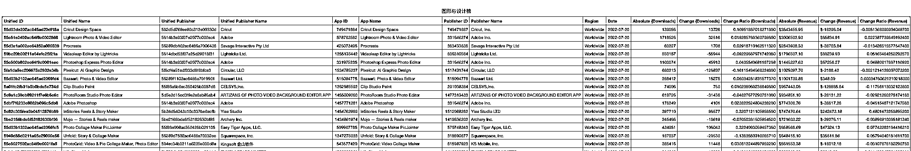

以上是 Sensor Tower 的榜单数据导出结果

以上是 App Annie 的榜单数据导出结果

App Annie 提供的数据可能包括上线日期、商店页面的查看次数、活跃用户数、使用渗透率、打开率等关键数据。而点点数据和七麦数据在收入数据的准确性方面可能稍逊于前两者，特别是对于海外产品。

不过，使用这些平台的一个主要障碍是它们的数据大多是付费的，而且费用相当高昂，通常一年的费用都是数万元人民币。这就需要你运用人际关系网络，例如：

**A、利用人脉资源：**如果你有从事 APP 投放或运营的朋友，可以请他们吃个饭，亲切地请求他们帮助你导出所需数据。

**B、在线市场寻找服务：**你可以在闲鱼或淘宝等平台上寻找拥有这些平台账号的人提供服务，费用可能因情况而异，但通常与请人吃饭的花费相当。

**C、使用免费榜单：**如果上述两种方式都不可行，你还可以使用一些平台提供的免费榜单，如七麦的免费榜和畅销榜。

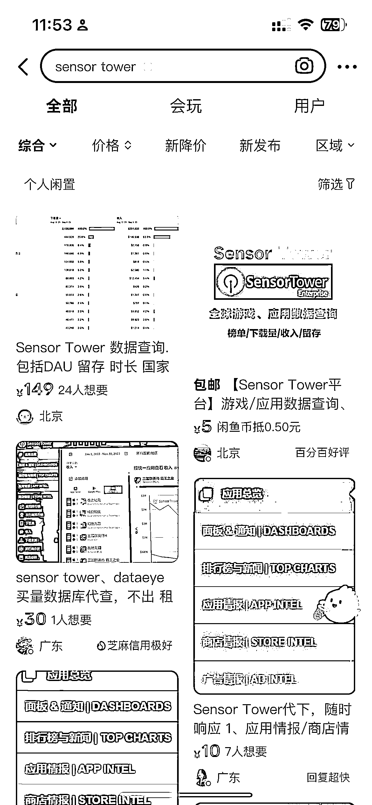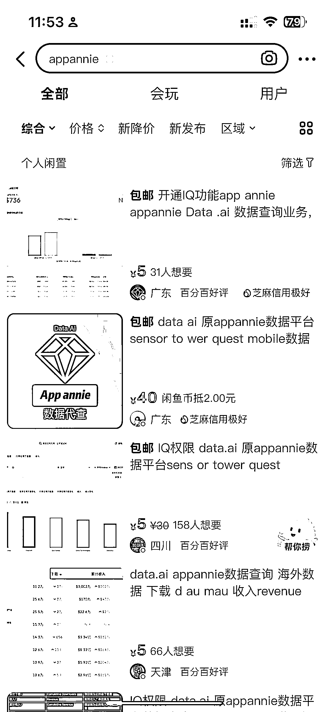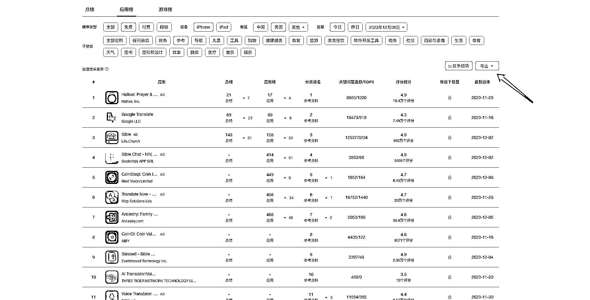

#### 3、榜单如何筛选

在筛选榜单数据时，确保数据的可操作性和相关性至关重要。以下是一些关于如何有效筛选榜单数据的建议：

**A、时间范围：**通常选择 3 至 6 个月的数据是合适的。这个时间跨度足够长，可以帮助你清晰地识别和理解市场的趋势，包括周期性的变化和长期的发展趋势。同时，这也有助于避免被短期的异常数据所误导。

**B、下载量：**我通常会选择月下载量在 3000 以上的应用，即日下载量超过 100 的应用。如果下载量过低，可能意味着该品类的市场需求不大，或者竞争过于激烈。

**C、收入：**通常会筛选月收入在 500 美元以上的应用。虽然 500 美元并不多，但对于个人开发者或小团队来说，能够找到具有稳定营收的产品已经是相当不错的成果。

通过对这些关键数据的筛选，可以帮助你更有效地锁定那些有潜力且符合你资源和能力范围的应用类型。这样的筛选过程不仅有助于减少分析工作量，也能提高你找到合适市场机会的可能性。

#### 4、榜单如何看**（☆重点）**

说到具体的看法之前，我们明确下我们看榜单的目的，那就是为了找到：**高用户需求、低市场竞争、高用户价值、良好商业潜力的、现有解决方案尚不完善**的细分市场或类别

**A、先做数据清洗**，一般我们拿到的榜单数据中包含了很多的字段信息，这些字段包含：开发者名称、开发的公司、Bundle ID 等等，这些对于我们做判断的作用不大，可以忽略。

所以先把这些列删除掉，以使表格更加整洁、易于查看和比较。

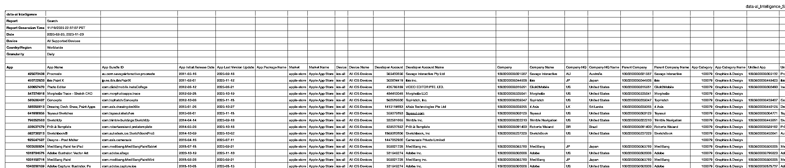

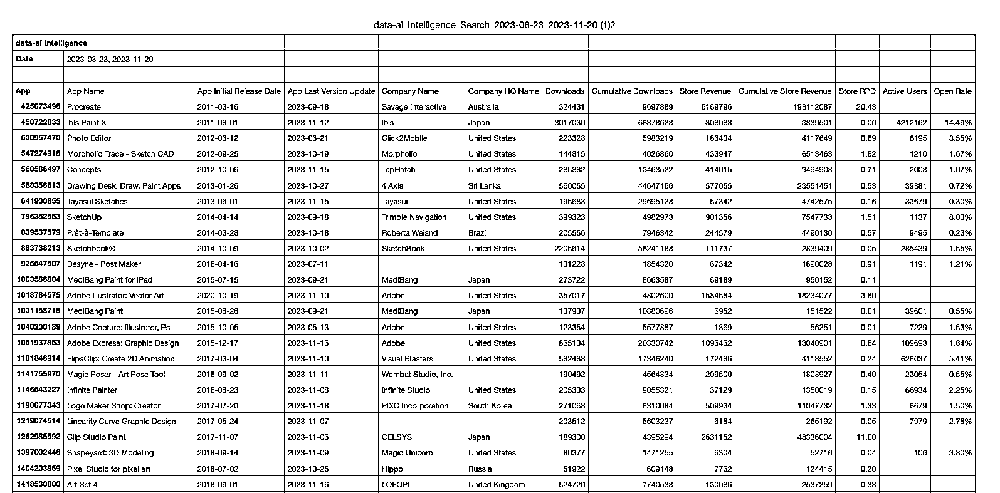

以上就是清洗前后的字段对比，第一张图的字段远没有展示完。

**B、再做一遍数据筛选，**这个阶段我会过滤掉那些上线时间很久的 APP，尤其是那些在下载排行前 50 的。

这些老牌 APP 可能已经占据了大部分市场份额，权重也非常高，为新应用留下的空间较小，我们去参考他们的话没有什么价值和意义。

而且 App Store 的市场，在那些年是有红利的，我们要参考就要参考那些在没有红利期下成长起来的应用，更有意义。

从时间的维度，我会忽略掉那些在 17 年以前发布的，并且长期在下载榜单前 50 的产品。比如在下图中，我就会筛掉红框中的这些产品。

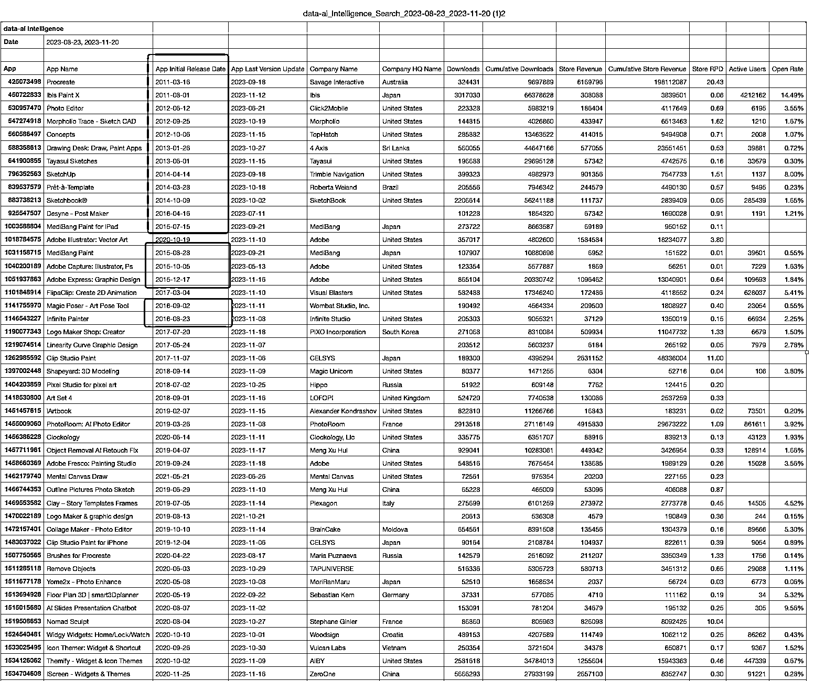

**C、按下载量进行排名，找到下载和 Arpu 都比较高的产品进行标注。**

怎么算 Arpu 比较高呢，那我们按照表格中的 Store RPD 来进行降序排列（我们暂且把 Arpu 和 RPD 当做一个数值），然后找到排名中间的对应的 RPD 数字，超过这个数的则表示 Arpu 值为高。

例如我们有 700 组数据，那我就找第 350 个对应的 RPD 值，我这里找到对应的数值为$0.36。

然后按照下载量从高到低开始标记，也不需要标记太多，排名前 200 的标记出来即可（大榜单如工具、摄影榜可以多标记些，图形设计这种小榜单可以少点）。

注：RPD（每下载收入） RPD = 累积收入/累积下载量 RPD 是指定应用的累积收入与下载量的比率。

Arpu 值=总收入 / 用户数

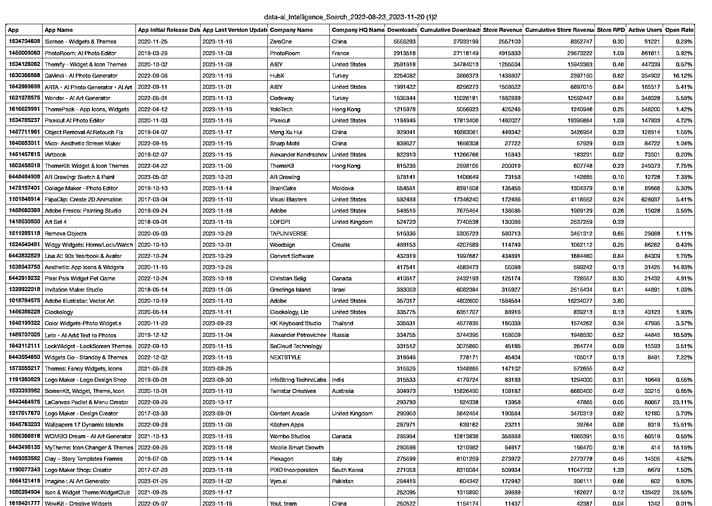

这一步通过筛选和标记，我们找到了一些高需求、高用户价值的产品。

**D、通过筛选排序补充一些产品**，在这个榜单中也有一些特殊存在需要去关注到的，比如 Arpu 值异常高的，比如下载榜和收入榜前列中非常近期才上线的产品，我会特意关注和进行标记。

ARPU 值（平均每用户收入）异常高的产品意味着用户对该产品的付费意愿非常强烈，表明用户群体的价值较高。这类产品往往能够带来更高的盈利潜力。

在榜单中，那些最近一年内才上线并且已经获得不错下载量和收入的产品，表明这些产品拥有良好的市场接受度和发展趋势。这类产品的成功可能归因于创新的概念、优秀的用户体验或者精准的市场定位。

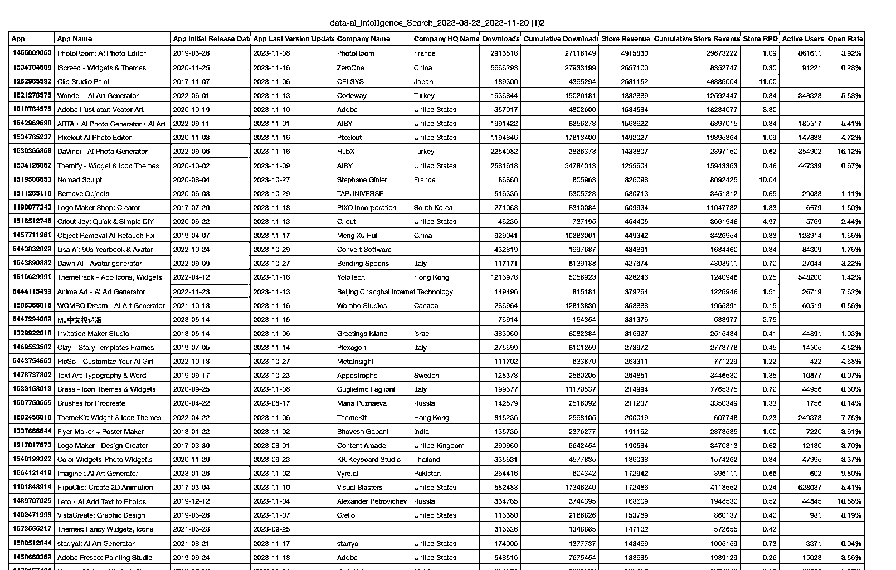

**E、对标记的产品进行整理和分类**，将所有我们已经标记过的 APP 放到一个新的表格或者 Sheet 页中。经过前几轮的筛选，我把榜单中的近 700 个应用，筛选到剩下 110 个左右。但这个如果要去逐个分析，那也太多了，肯定不合适啊。

**F、标记的产品整理到新表格：**把所有标记过的应用整理到一个新的表格或 Sheet 页中，以便进行更详细的分析。

**G、根据上线时间排序和筛选：**经过前几轮筛选后，如果应用数量仍然过多，可以继续通过上线时间进行筛选。例如，可以考虑淘汰 2019 年以前上线的应用，以聚焦于近期上线并显示良好潜力的应用。

**H、再次筛选下载量低和 ARPU 低的应用：**对于下载量和 ARPU 都相对较低的应用进行筛选，以缩小分析范围。

**I、利用变化趋势数据（如果可用）：**如果可用，可以利用如 Sensor Tower 等其他数据来源，来分析下载量和收入的变化趋势。这可以帮助识别那些虽然目前表现良好，但趋势正在下降的应用，从而避免投资于可能即将衰退的市场。

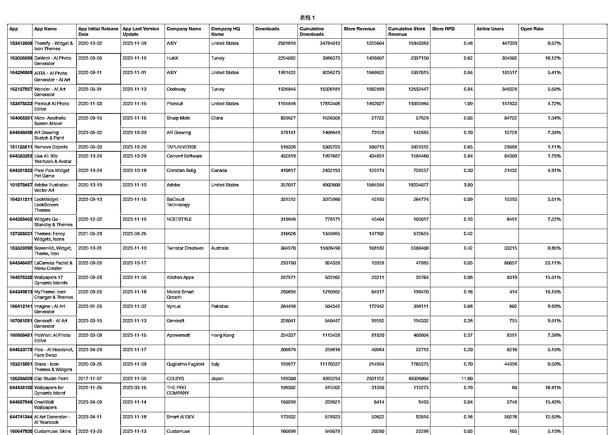

在进行了上述筛选和分类工作之后，下一步是深入分析那些被标记为重点的 APP。这一步是至关重要的，因为它能帮助我们理解当前市场的热点趋势和竞争格局。以下是具体的分析方法：

**A、重点分析标记的 APP：**从筛选出的应用中挑选出大约 20 个标记过的 APP 作为重点进行深入分析。

**B、识别共同点和趋势：**在这些标记的产品中，观察到一个显著的共同点：大多数是 AI 绘画类的 APP，只有少数是海报或 Logo 设计 APP。这一观察表明，在当前的艺术和设计榜单中，AI 绘画类应用正成为一个重要趋势，这类产品具有巨大的商业潜力和高用户付费意愿。

**C、评估竞争情况：**尽管 AI 绘画类应用市场热门，但与此同时，竞争也非常激烈。这需要我们进一步分析，以决定是否进入这个领域。

**D、综合分析决定是否进入：**在最终决定是否开发某类 APP 之前，需要综合考虑市场趋势、用户需求、竞争态势以及自身的资源和能力。这一步骤至关重要，因为它将直接影响产品的成功可能性和盈利能力。

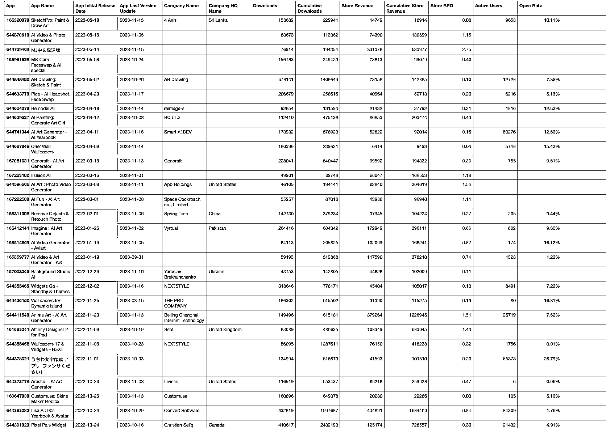

在完成了对标记 APP 的重点分析之后，下一步是对其他 APP 进行分类，这有助于我们识别出具有高市场潜力、高用户需求和商业价值的产品方向。以下是对不同类别 APP 的分类：

A、P 图类：包括 AI 图片视频特效、AI 换脸、图片矢量化等。

B、设计类：包括家具设计 AI、壁纸设计、AI P 图、团扇制作、游戏皮肤制作、海报设计、Logo 设计、3D 建模、印章制作、Story 创作等。

C、绘画类：包括专业绘画软件、AI 绘画软件等。

D、小组件：包括普通小组件、灵动岛宠物、充电动画等。

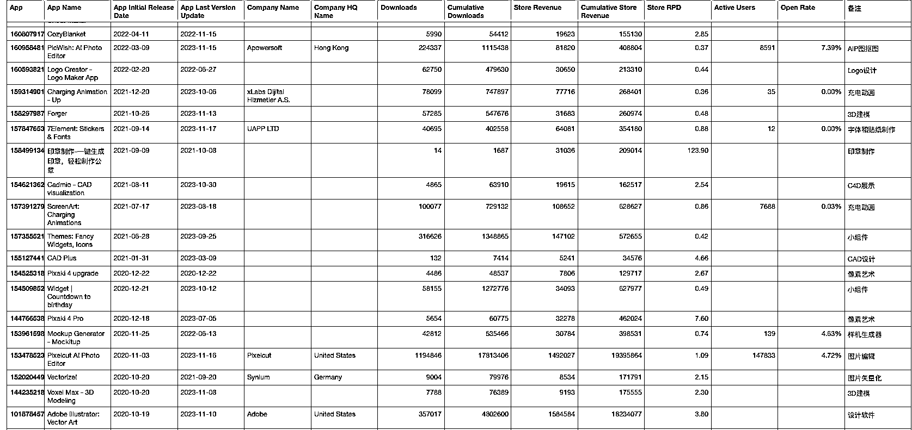

通过这样的分类，我们可以更清晰地理解不同类别的 APP 在市场上的表现和潜力。接下来，结合我们自身的经验、兴趣以及即将在第四个重点步骤中讨论的方法，进行最后的分析和决策。

值得注意的是，一些分类中的产品可能不太适合个人开发者，例如 3D 建模、图片矢量化和专业绘画软件等，因为这些产品在技术难度、开发周期和市场竞争方面可能存在较高的挑战。

不过，这只是初步判断，要进行更客观和深入的分析，我们将在下一个环节进一步探讨。

**手动挑选每个分类的头部产品，**根据下载量、营收、RPD、打开率等综合数据挑选出每个品类中的一个产品。

进行手动挑选并分析每个分类中的头部产品是一项重要的任务。这一过程涉及综合考虑下载量、营收、RPD（每下载收入）、打开率等多个关键指标，以挑选出每个品类中的顶尖应用。

不过，在这个过程中需要注意几个关键点：

**数据的准确性：**

大家有没有发现这个表里面是有异常数据的，这么高的价值，说明数据是存在一些问题的。有时数据平台提供的数据可能存在异常或不准确的情况，所以需要谨慎对待这些数据。

例如，异常高的价值可能表明数据有误。因此，这些数据应作为参考，而不是绝对的决策依据。

**真正的头部产品：**

在某些情况下，所选榜单可能并未完全展示出一个领域的真正头部产品。例如，在图形设计榜单中挑选的海报设计和 Logo 设计 APP 可能不是该领域的顶尖产品，因为在摄影摄像榜单中可能有更多的头部产品。

**打开思路：**

这个筛选过程的目的是找到具有高用户需求、高用户价值和良好商业潜力的产品方向，从而帮助开发者打开思路，跳出自己原有的思维框架。

比如这里有一个团扇制作的 APP，就是一个帮我打开思路的方向，这个产品只在日本区上架，但是排名非常靠前，且营收很不错，这个思路能否扩展到其他国家呢？能否在其他领域运用呢？

当你能够通过分析榜单上的产品来全面了解它们的核心功能、目标用户群、变现方式以及独特的商业策略时，你的“内功”就已经修炼到了一定的水平。

这种能力的培养需要你不断地观察、分析竞品，全面地审视你想要涉足的产品类型所在的市场。这是一个持续的过程，但其价值是显而易见的。

内功的修炼就需要你不断的的去看去分析竞品，把你想要做的产品类型榜单横扫一遍，这是一个长期的过程。

当你能做到说产品应用你就能脑补这个 APP 产品的所有，你就可以算是“修仙界”的元婴大能了，这个时候想要突破到化神期，你就需要再去修炼一些外功，这个我们在第四大点里面详细讲。

**Tips：大家在做一些数据分析的时候可以让 GPT4 介入来帮你提高效率哈。**

### （5）**抄同行**

正所谓天下产品一大抄，做产品的，都要有**先抄后超**的觉悟。我余某一向其实是非常鄙视抄的行为的，因为我自己做设计出身，在对于抄这件事情上，会有天然的鄙夷之情。我后来做博主的时候也是一样，别人发什么我就不发什么，这也导致了我的流量起来的比较慢。

不过，创业这个过程，活下来真的很重要！慢慢的，我也得改变自己这方面的想法，不要把抄这个事情当做可耻的事情，换个想法：我们只不过是为了向用户提供更优质的服务，增加一个竞争对手，让这个市场不被垄断而已。

——这么一想心里就舒服多了。那我接下来就把我的抄同行的秘籍传给大家：

1.  **蹭热度：**大家记得去年“木鱼”APP 在抖音的火爆吗，这个时候最快的复制一个就是流量密码

2.  **看社媒：**经常刷一些社媒或者网站，比如 producthunt、Twitter

3.  **找朋友：**直接找你做投放的朋友，问问 TA 都在投放哪些产品？

当你通过这些方法去搞到产品路子后，如果你知道数据，那你其实就可以直接去做一个更好的，如果你不知道，那就按我们的第四点去分析。

# 四、如何最终确定你的方向是可以做的？

当你通过前面的步骤积累了许多潜在的产品点子后，选择具体要开发哪一个产品可能会变得令人困惑。

在这个阶段，所谓的“外功修炼”变得至关重要，它关乎你是否能够进入到更高层次的产品开发阶段，也就是步入修仙的化神期的重要基础。

### （1）产品方向考虑的维度

很多人可能迟迟不敢动手，因为根本无法判断值不值得做，也不知道如何去判断。我给大家提供一下我思考某个产品方向值不值得做的维度：

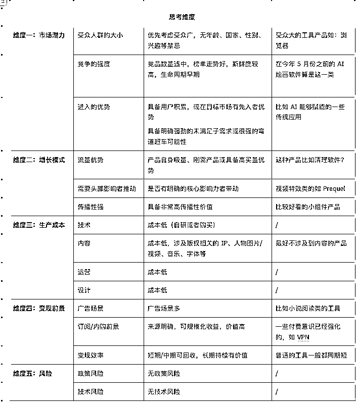

### （2）小开发者重点考虑的维度

这里也并不是要所有的维度都是好的我们才能做，因为这种产品基本是不存在的，再者，对于我们小企业和个人开发者来说，我们如果刚开始去做，在能有效控制成本的情况下，我们也不用太瞻前顾后，考虑到所有的因素。对我而言，我一般会考虑以下几个主要的因素：

**1、这个产品的受众人群不需要太多，只要不是少的可怜，那还是可以考虑的，重点是竞争和变现如何；**

**2、这个产品的竞争局势如何，是不是头部一家独大，其他的小产品基本没有流量和收益，对于工具类产品，我更喜欢百家争鸣的这种，即使上去的新品，也能分到一杯羹；**

**3、这个产品最好不要是那种全靠投放和运营才能起来的，不适合我这种不懂流量玩法的小团队；**

**4、我的整体的开发周期在 1～2 个月，我的产品研发成本不会超过 3 万；**

**5、这个产品的受众群体一定是有还算不错的付费意愿的，单价也还可以；**

**6、没有政策风险，技术能实现**

**7、不要忽视你个人的兴趣和热情，如果你非常的有信心和热情，而且这个事情确实被验证过，那就不要犹豫**

我在我们深入研究榜单的过程中，主要目的是寻找那些用户需求旺盛、市场竞争相对较低、用户价值高、商业潜力良好且现有解决方案尚有提升空间的细分市场或品类。

然而，要完全洞悉市场竞争程度和现有解决方案的成熟度，光靠榜单上的数据是远远不够的。这就需要我们投入更多精力进行深入的市场调研，比如在数据平台上深挖竞品数量、翻阅用户评论等，以获得更全面的市场视角。

至此，我将自己的“武功秘籍”毫无保留地分享给了大家。在这里，我想强调一点：

如果你对某个方向充满信心，并且成本处于你的可控范围内，那么动手去做往往比光做分析更为关键。毕竟，在这个充满竞争的时代，行动力才是最宝贵的。

许多人都有闪光的想法，但真正付诸行动的却屈指可数。所以，别犹豫，大胆去实现你的想法吧！

# 五、聊聊出海工具是否还值得做？

先明确结果：**值得！很值得！非常值得！**

### （1）为什么值得呢？

一是因为做工具 APP 的这个**商业模式实在是太好了**，这个是真正的躺赚模式，产品做好了，放在商店等收钱就可以了呀，就是这么简单。

二是因为**成本低**啊，哪个创业项目可以几万块就能启动的起来，还能撬动千万市场的？

三是因为**有机会财务自由**啊，跟自媒体一样，做的 APP 也可能因为一些运气成分给你带来泼天的财富，你接是不接？

### （2）还能不能做？

**想做一件事情，任何时候都不算晚！弱者找借口，强者找方法。**

即使这个应用市场已经下行，即使开发者已经卷到不行，但你只要坚持在这个圈子，总有新的机会产生，总有新的方向等你开拓。

举几个简单的例子：

1、18 年 Pre-Order 带来了预定 APP 的机会

2、iOS 14 带来了桌面小组件的小红利机会

3、iOS16 带来了锁屏小组件的小红利机会

4、今年 AI 的发展带来了 AI 对话、AI 绘画的新产品机会

... ...

不要太悲观，找机会突破才是你应该做的。作为一个小小的创业者，我是始终相信自己的，也希望你能相信你能做到。

### （3）工具 APP 出海能赚到钱吗？

把“吗”字去掉，我来截图展示一下。

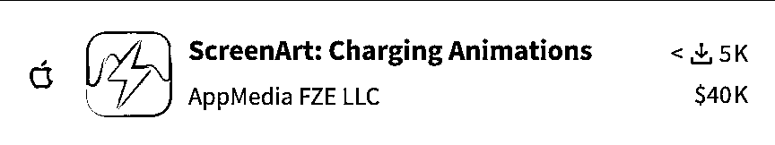

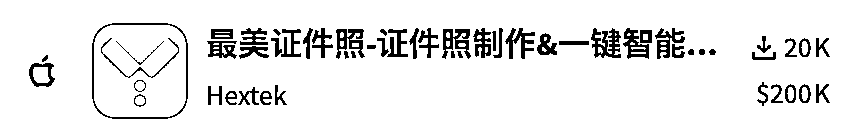

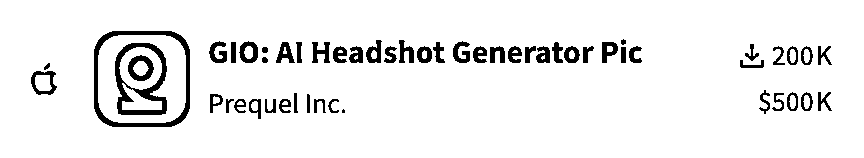

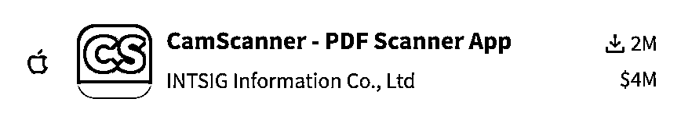

看到这些真实存在于你眼前的数据，你有没有震惊到？反正我每次看到其他产品那可怕的营收，也会给我很多激励，好像那些营收很快就会到我的钱包一样，哈哈。

### （4）工具 APP 出海该如何做？

探讨工具 APP 如何成功“出海”是一个广阔而复杂的主题，涵盖了**团队组建、账号注册、产品开发流程、上架流程、ASO 优化、运营投放策略**等多个方面，同时也包括本篇万字长文的选品指南。

显然，这个话题实在太庞大，不可能在一篇文章中全部涵盖。

坦白说，这篇文章是我自出生以来写得最长的一篇，我的第一次长篇大作就献给了“生财社区”和各位圈友。我目前还不确定是否能在未来继续产出这样的实操干货内容，毕竟，这需要巨大的精力和投入，除非...除非...

终于完成这篇文章了，我可以深深地吐出一口长气。从构思文章结构到今天，整整五天的时间，我全身心投入到了这篇作品中。

这种专注的感觉非常奇妙。在过去的一段时间里，我的精力被分割成了无数小片段，除了思考新的产品方向，我还忙于处理这些事情：

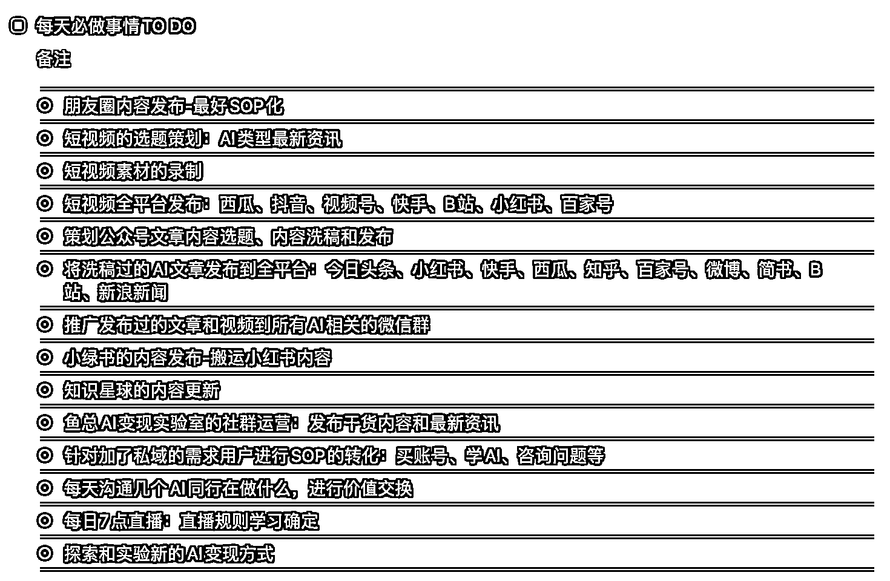

大家知道我有多么的忙和多么的碎片化了吧。。。

在这篇文章的最后，我想重申一点：虽然我分享的内容主要集中在技术层面，目的是为那些刚入门或感到迷茫的开发者提供一些方向指引，但要在这个领域真正取得成就，关键还是在于不断提升自己、打磨团队，并最终打造出优秀的产品。

总之一句话：**找到正确的需求是产品成功的一半！这条道路可能既漫长又充满挑战，但只要坚持不懈，目标明确，成功就在不远处。**

如果大家还想听更多关于出海工具 APP 相关的内容，可以在评论区里面写一下主题，后续有机会还会给大家分享的。

* * *

评论区：

May | 游戏发行 : 可以链接一下嘛？曾在全国工具下载量第一的公司
小鹅老师 : 余总终于出手啦
拾柒|玩赚旅行 : 支持余总🐛
韩北樱 : 👍🏻👍🏻👍🏻，厉害的
阿凯 KK : 鱼总不愧是六边形战士，实在是太强了！
Jason Yu : 可以的，个人资料有 V
大云 : 深度好文[强][强]，终于有人好好讲讲 App 了，之前只知道看榜单，但具体怎么看却没有方法。
一.向余总提问：
1.按照榜单，对数据清洗，找到了高用户价值新上线的 AI 应用，比如 AI 绘画的 App，符合筛选榜单的指标，但上线了同样功能的 App 却还是没有量，原因是什么，如何破解？
之前的套壳 AI 应用，如 chatgpt，已经赚的盆满钵满，现在入局是不是晚了？
2.按照余总提供的方法论，对筛选后的方向，再继续定向搜索，发现还是一堆竞品，有的已经做的很好了，抄了一个后，进一步如何超过它？比如文章开头的充电动画的 App、团扇 App，抄一个后，如何再超过他？

二.希望后续的拆解：
1.对应一些新的或者流量大、收入高的 App，如何分析他们的流量来源？像网站可以通过反链能看到，但如何反向知道 App 的推广渠道来源，进而确定自己的推广方式？
2.分享一些 ASO 相关的比较实用的文章；
3.买量、投放的实操；

三.最后感谢余总的万字长文，非常实用。
Jason Yu : 像小鹅老师学习[奋斗]

* * *