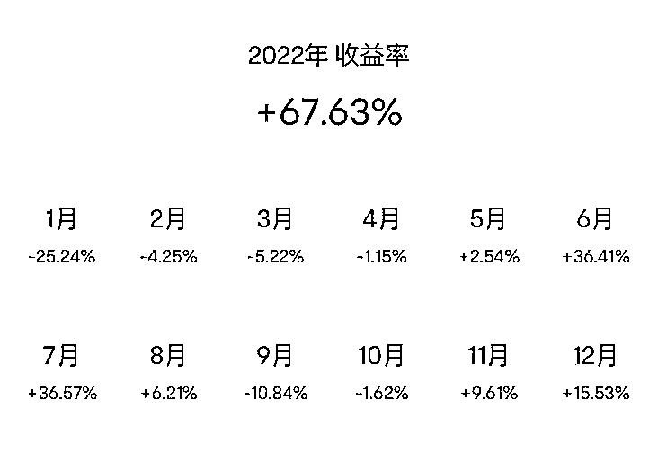
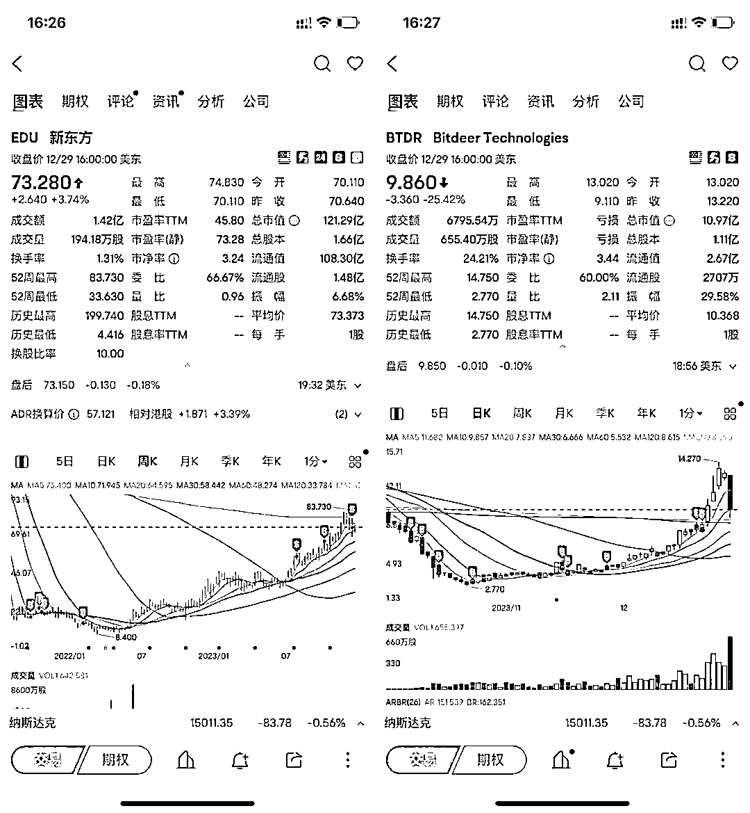

# 禅与股票投资艺术

> 原文：[`www.yuque.com/for_lazy/thfiu8/cs553nxz5kowkfav`](https://www.yuque.com/for_lazy/thfiu8/cs553nxz5kowkfav)

## (32 赞)禅与股票投资艺术

作者： 逗砂

日期：2024-01-02

2023 年港美股最后一个交易日结束了。从 2021 年开始接触港美股市场到现在，差不多两年半的时间。我的成绩是：**2021 年收益率 2.47%，2022 年收益率 67.63%，2023 年收益率 133.17%。**

这篇文章是总结从 2017 年到现在接触各种投资品 6 年的时间里自己的一些感受。这 6 年的时间里经历了大概两轮数字货币的熊牛市，接触了各种各样的理论和方法，到现在总算是找到了一条适合自己的路径。

**警告⚠️**：这并不是一篇主流观点分享，里面的所有内容都仅针对我个人的经历，不做任何普适性的推荐。

投资是一面关照自我的镜子，如实的反应出你的贪婪和恐惧。

我对于金钱和投资的信念分为四个阶段：

1.  **第一个阶段：钱只能辛苦的获得，绝不投资。**

2.  **第二个阶段：依靠金融知识来投资。**

3.  **第三个阶段：参考术数来投资。**

4.  **第四个阶段：通过禅修来投资。**

# ****第一个阶段：钱只能辛苦的获得，绝不投资。****

**每个人都希望自己富足，但是很多人的内心却觉得钱是肮脏的，赚钱是痛苦的，赚大钱的人都是道德败坏的。**

**这些是这个社会大部分人包括我自己之前的想法，它隐藏在内心深处，始于从小父母对于赚钱不容易的反复念叨，是一次又一次的对他人“割韭菜”的批判，也每一次觉得东西太贵了自己不配的匮乏感。**

**在这个阶段，我的收入只有工资，顶多接一些设计类的私活，还不敢报价报高了。从来不买股票，也不关注投资，觉得那是有钱人的游戏跟我没有关系，虽然不怎么乱花钱但是也没什么存款，很喜欢买一些便宜但是无用的东西。**

**在这个路径下的我理论上的路径是努力工作，好好做设计，然后再 35 岁被优化掉。但是这条路径在 2016 年出现了两个变量：**

****1、误打误撞去了一家数字货币的公司的人工智能事业部。****

****2、开始写文章做自媒体了。****

**2017 年，得益于公众号的发展，我做的设计类自媒体：**非科班设计**，得到了不错的流量。因为这个契机认识了一些自媒体圈子的朋友，其中一些朋友仅广告的收入就超过了工资所得。之前只能靠工作来赚钱的这个信念开始动摇。**

**也是在 2017 年，数字货币大牛市，在 BTC 的暴涨下，我终于在 2017 年花了 6000RMB 买了第一个 BTC，并且因为在人工智能行业，也同时买了美股英伟达，购买的理由非常简单，**无论数字货币还是人工智能成为未来，那么算力都是需要去抢占的资源，所以英伟达在未来一定很重要。****

**这本该是爽文故事里财富自由的开头，命运几乎都把泼天的富贵硬塞到手里了。**

**但很不幸，我，一个都没抓住。**

# ******第二个阶段：依靠金融知识来投资。******

****在 2017 年我跟风买入 BTC 和英伟达之后，我其实是很不安。那个时候几乎完全不懂任何金融方面的知识。虽然自己在最多内幕消息的领域，但是因为不懂所以恐惧，我买的很少，但即使这样一点点涨跌就会让我情绪紧张。****

****但是 BTC 和英伟达呈现出来了我两种不同的心态，现在想象也是很有趣，在花了 6000RMB 买入 BTC 之后，它一路涨到 1.2w，收益高达 100%，这个收益让我恐惧，加上当时政策的一些消息，我很快就把币给卖掉了。而英伟达就更好笑了，我买入之后不久就开始下跌，当它跌到 10%的时候我就受不了了，于是也卖掉了。****

****我把这一切都归结于我不懂交易，不懂金融，不懂市场。于是，从 2017 年开始看了很多投资，金融，交易方面的书。我周围也有很多知识渊博的朋友，他们热爱交易，判断的也挺准确的，但是奇怪的事情是他们也都不怎么赚钱，尤其是熊市的时候。****

****2021 年在我刚把香港卡办好之后不久，也是一个契机加入了一家做港美股交易所的公司，虽然仍然是个设计，但是可以因为工作的便利好好研究股票了。2021 年是港美股和数字货币的双重牛市，我还跟风买了一些 NFT，但是这些 NFT 基本上都归零了。****

****如果你在圈子里呆的时间足够的长，就会发现，大部分人都是一段时间赚钱一段时间赔钱，无论他的理论体系多完美，尤其是现在这个时代，黑天鹅遍地都是，哪怕是那些美国最优秀的投资机构，仍然会出现暴雷，特斯拉火的那段时间很多人去研究木头姐的投资策略，但是重仓科技股的公司这两年并不好过。****

# ********第三个阶段：参考术数来投资。********

****当金融专业知识无法解释一些现象的时候，我开始试图用术数的方式寻找规则。比如 2021 年辛丑年，金旺，利好金融，利好医疗，那一年医疗股和金融相关的确实很火热：金旺，金克木，教育属木，因为政策的影响 K12 教育一片哀嚎，但是 2022 年和 2023 年这两年都是木旺的流年，理论上 2021 年是抄底教育股的最好时机，于是我在 2021 年买了新东方。现在回过头去看，判断大体正确，但是又不完全正确，新东方的最低点在 2022 年上半年，而我那时因为恐惧不敢继续抄底了，甚至一度怀疑我的判断。所以，即使新东方的最低点和最高点相差 10 倍，而我因为买入卖出点位的问题并没有赚到多少，2022 年的整体收益率只有 60%。****

********

****我也认识不少同时精通金融，术数的朋友，但是基本上也没赚到什么，哪怕是每个预测都是准确的，总有无数种骚操作可以让你亏钱。****

****我试图充当预言家的时候忘记了一件重要的事情，那就是自己仍在局中，你本身就是这盘棋的棋子，并不是下棋人。而我发现最终控制一切的是每个人的恐惧和贪婪。我们每个人都被自己的认知和信念困在一个非常狭小的范围，即害怕得到，又害怕失去，动弹不得。****

# ********第四个阶段：通过禅修来投资。********

****今年上半年在朋友推荐的一个 YouTube 视频（[`www.youtube.com/watch?v=A-nMYGvPVUo`](https://www.youtube.com/watch?v=A-nMYGvPVUo)）里发现了一个叫孔令艺的期货交易员，据说只靠禅修获得了 2020 年和 2022 年两届期货大赛的冠军，成绩是几十万到 3000w。他的方法非常特别，比用术数还离谱。他不看基本面，不分析数据，也不去看各种内幕消息（虽然他这些都会），重仓，只凭借感觉交易，只用一部手机。他做期货 20 年，修行十年，参加比赛只是想验证下自己的修行成果。****

****他不开课，也不帮人炒股，接受过一些采访，有一个公众号讲的也基本上是修行的内容，我最近试图整理了他的这种奇特的投资理论体系，详细的可以见下面这个链接：****

****[`dousha0228.notion.site/3390a80ea75c4c33a9262e5e1f0c68b8?pvs=4`](https://dousha0228.notion.site/3390a80ea75c4c33a9262e5e1f0c68b8?pvs=4)****

****大致的理论就是：**这个世界一切都是虚幻的，大部分人是心随境转，所以大部分人被欲望和恐惧限制在命运之中。但是如果你可以通过每日关照来察觉自己的情绪和念头，并且能够转念，那么就可以做到境随心转。******

****这不是什么新鲜的概念，B 站小红书上那些灵修老师们都讲的头头是道。但是很多人天天空性，觉知，禅修不离口，自己的生活过得一团糟，实在没什么说服力。但是孔不一样，他直接在比赛的实盘交易上验证了，还是连续两次。****

****他在一次参访中说，**我们每个人都在想着怎么战胜市场，怎么对抗市场，但是实际上市场无法被战胜，因为最后你会发现你就是市场，**市场如实的映射出了你的贪婪和恐惧。****

****孔令艺在 2022 年的比赛中并没有一直都是第一，中间还出现了非常大的回撤，他的选择是想办法让自己的状态好起来，怎么开心怎么来，不去想具体的数据，状态好了之后再去做交易，并且一直坚信自己能拿第一，最终他在比赛的最后几天拿到了第一。****

****就我个人的体验来说，得益于之前两轮熊市，我对于暴跌这种事情已经没有最开始那种恐慌感了。并且对于自己的选择信念也更强了，今年下半年逐渐卖掉了新东方，逐步买入 bitdeer，而在 bitdeer 的抄底过程之中，敢于在最低点坚持自己的判断抄底了。相比与去年，可以更好的处理自己的恐惧，而今年的收益率也远超去年。****

****孔令艺的投资方式非常反直觉跟主流的大部分方式都不一样，而我这两年的方式跟孔老师也有点像，主要有三个点：****

******1 重仓******

****看准了就满仓一两只股票。****

****我从 2021 年年底到今年上半年，大概两年的时间里，新东方占了差不多 9 成的仓位。如果相信自己的判断，但是只买一点点是没有用的。很多人会买很多只股票，分散风险，但是大部分的时候只是分散了收益。我基本上不会因为别人推荐就去购买，如果不相信这个股票就根本不买，宁可空仓，如果相信就 all in。****

******2 直觉******

****让自己通过冥想，禅修尽量处于放空的状态，依照那个时候的直觉来行动。这种状态可以帮助你摆脱恐惧带来的骚操作。并且直觉的想法往往超越逻辑最后被验证非常的准确。****

****举个例子：今年下半年我逐步把新东方的仓位降低，开始购买 bitdeer，但是一直到 12 月我还留着三成的新东方仓位，忽然在 12 月 21 日的时候我觉得自己不能再拿着新东方了，于是那一天把新东方全部清仓了，并且把这部分的钱全部购买了 bitdeer。结果第二天开始 bitdeer 开始以每天 20%的涨幅连涨了三天。****

****不过最后一个交易日直接回撤了 25%，不过我不抄短线，新东方拿了 2 年，bitdeer 也差不多在等 BTC 的减半周期。不抄短线的原因是对自己的定力暂时没有很高的预估，我可以有相对高的把握长周期的趋势，却无法精准的预判每一次的涨跌。所以这个情况下不动是最好的。****

********

******3 富足******

****回到这篇文章的开头，早期没有把握住机会的主要原因是匮乏，而匮乏只能创造更多的匮乏，你不可能一边匮乏，一边想要富足。所以今年我搬了家，换到了一个有着大落地窗的阳光房，我会尽可能的让自己开心，对自己慷慨，带自己去吃很贵的餐厅，去旅游，去看美丽的风景。神奇的事情发生了，我对自己越好，越开心，生活便也回应给我开心的事物，我花钱最多的那个月，投资收益也是最高的。****

****这里并不是在建议大家盲目消费，而是想说的是：**我们每一个人都值得最好的东西，都值得被爱，要坚信这一点。******

******钱会流向不缺钱的人。******

****很多人都说这两年是市场极度低迷的两年，低迷是大家的共识，也是自我实现的预言，但是反过来也是如此，你是否富足，是否匮乏，也都如实的反应到了你的投资上。****

******市场什么都不是，它只是你的镜子。******

* * *

****评论区：****

****五叶 : 神奇
毛茸茸 : 需要很高的能量
Star : 市场什么都不是，它只是你的镜子[强]
冲冲冲 : 去年港股-85w
S·光宇 : 太赞了👍👍👍👍👍👍👍
xueping : 真好[玫瑰][玫瑰]感谢分享****

********

* * *