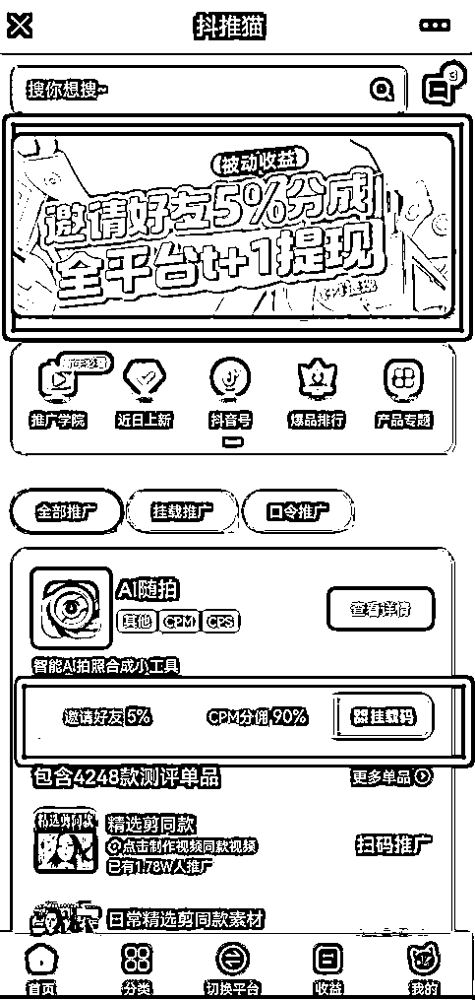
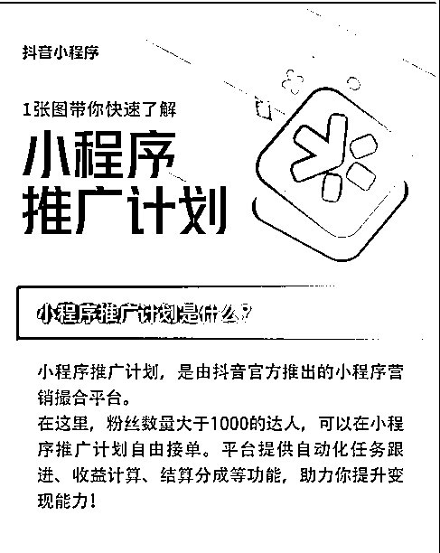
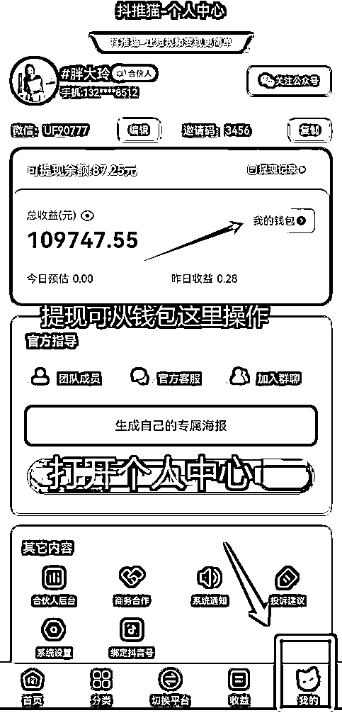

# 前两年猛赚的抖音推广小程序，现在还有机会吗？

> 原文：[`www.yuque.com/for_lazy/thfiu8/tq8c1nntt48aqbpn`](https://www.yuque.com/for_lazy/thfiu8/tq8c1nntt48aqbpn)

## (30 赞)前两年猛赚的抖音推广小程序，现在还有机会吗？

作者： 胖大玲

日期：2024-01-03

抖音小程序推广，和小说推文一样，本质上也是 cps 项目——通过创作短视频推广小程序，用户如果消费了，你就能拿到 90%的分成。除此之外，抖音小程序还有另一种收益方式，广告分佣收益 cpm，简单来说，用户在小程序看广告，你也能拿到一定分成。

可以很直白的告诉大家，抖音小程序肯定没有前两年好做了，赛道越来越卷，平台监管越来越严，不可能轻松赚得盆满钵满。

相应的，随着抖音平台的不断完善，对小程序板块的扶持也只增不减，不断给流量扶持，制定各种激励政策，对于新手来说，这仍是一个可以入场喝汤的机会，至少门槛够低、资产够轻、项目够稳定。

那么，接下来我将会从项目介绍、项目实操、抖音运营等方面，重塑大家对于抖音小程序的认知，也帮助想要入局的圈友快速上手。

# **一、前言**

各位生财的圈友，大家好，我是胖大玲，生财编号：46301。

从事短视频行业至今 5 年，做过多种变现项目，例如：抖音 IP 知识付费，抖音小游戏培训，小程序培训等等，曾创建 10 万+人小程序团队，成功帮助数万学员实现流量变现，自己也在小程序这个项目里，赚到了人生的第一个一百万。

这次来分享【小程序】这个项目，在市场上已经运行了三四年，很多的培训课程都已经公开了，包括咱们生财有术里面也有很多关于小程序的帖子，但绝大部分人会觉得这个项目已经那么长时间了，应该快黄了吧？

其实在今时今日，做这个项目的人仍然不少，小程序的平台也日渐完善，抖音，快手，视频号等平台对小程序广告植入这个板块的创收盈利很大，算是平台收益较大的一个板块，抖音也好，快手也罢，是不会轻易切掉这块业务的。

抖音上变现的项目千千万，找到适合自己那个才是最好的，那对于我们普通的短视频玩家（新手玩家）来说，小程序这个赛道的真的比较友好，门槛相对较低，不限制账号粉丝量，也不要求剪辑技巧，甚至连文案都没有那么严苛。

接下来我把【小程序】这个项目的赚钱操作详细拆解给大家，感兴趣的新手小伙伴不妨可以试试，找到适合自己的切入点，小赚一笔！

我先会从【项目介绍】带大家了解小程序这个项目的相关信息，包括：

1、小程序的概念

2、视频挂链接时是什么样？

3、项目的收益

4、为什么要推广小程序

5、这个项目的其他变现方式

6、小程序平台都有哪些

然后再带大家实操一遍【项目操作流程】，从注册平台到成功发布作品，只要跟着我的讲解走，都能学会操作这个项目

1、如何注册并熟悉功能

2、如何选品，做账号定位

3、实操剪辑视频

4、发布作品挂链接

5、爆单运营技巧

学会实操之后，可能还会遇到一些【抖音运营常见的问题】，这里也给大家做一个快问快答，但是抖音运营是一项需要花时间和耐心去学习的技能，在分享中，也告知了学习了途径，希望我们能一起进步一起生财！

**（1）小程序项目行业的现状**

娱乐测试类小程序在抖音上是受欢迎的，因为它们能够提供有趣的互动体验，符合用户在抖音上寻找轻松娱乐的趋势。

19 年发展至今，随着抖音平台的不断完善，对小程序板块的扶持也只增不减，不断的给流量扶持，制定各种激励政策，对于推广者来说前景一片光明。

**（2）现在入局与以往的差异化**

虽然现在小程序这个项目已经不在蓝海期，但是现在入局仍然有喝汤的机会，理由：

1、推广者竞争少（蓝海期的很多推广者都坚持不到最后）

2、可参考的案例多（前辈们爆火过的案例，都可以拿来分析重组，打造新的爆款视频，撬动大单）

3、随着这两年的积累，小程序平台对市场热度的敏感度也在大幅度提升，产品的迭代更新也是日益增加。（推广者不用担心产品问题）

4、抖音平台的规范管理（推广者不用担心没有变现的机会）

5、用户接受度高（以往用户会排斥或者猜疑，现在市场已经被教育好了）

# 二、项目介绍

**（1）小程序的概念？**

小程序是一种轻量级的应用程序，它不需要用户通过应用商店下载和安装，而是可以直接在设备上使用。这类应用程序通常由第三方开发者创建，用户可以通过扫描二维码、搜索或其他方式直接访问和使用。

小程序通常有以下特点：

1、不需安装： 用户无需从应用商店下载和安装小程序，可以直接在设备上访问和使用，这降低了用户的使用门槛。

2、跨平台： 小程序通常支持多个平台，如 iOS、Android 等，而不需要开发者分别为不同平台开发独立的应用版本。

3、轻量级： 小程序相对于传统应用程序来说，体积较小，占用设备资源较少，更适合一些简单的任务和功能。

4、即时更新： 开发者可以即时更新小程序的内容，无需用户进行手动更新。

5、互联互通： 小程序通常能够在用户使用的同时获取一些设备信息，以提供更个性化的服务。

在不同的平台上，小程序可能有不同的名称。例如，微信推出了"小程序"，支付宝有"小程序"，而其他平台也可能有类似的概念。这种模式的兴起使得开发者可以更灵活地提供服务，而用户也能更方便地获取所需的功能。

**可以理解为：**不管是抖音小程序还是快手小程序或是微信小程序，都是各家自媒体平台内部的一个生态系统，允许开发者创建基于平台的小程序，这些小程序可以为用户提供不同的体验，例如游戏、工具、社交互动等。

例如：抖音小程序的推出旨在扩展抖音的生态系统，为用户和开发者提供更多选择和互动的机会，同时也为抖音的广告主，增多了一个广告分发的渠道，给了推手们一个变现的机会......

1.  小程序项目适合的人群：上班族，宝妈，大学生...

2.  投入成本：一些平台的会员费

3.  花费时间：每天 1-2 小时

4.  风险：账号运营方面的问题（如：操作不当被封账号，限流等，解决方案：多学运营技巧和遵循平台运营规则发布左右即可）

**（2）小程序这个项目在各个平台上的呈现形式？**

**1、抖音平台小程序的呈现方式**

① 推广者发作品时，左下角会挂载一个链接入口，用户点击进入即可使用

② 发作品时，通过引导用户在抖音上通过搜索某个小程序产品的名称进入，输入专属口令使用在视频里看到的小程序产品。

口令的引导语在评论区呈现，也可以私信给粉丝，或者评论区回复粉丝等。

**2、快手平台小程序的呈现方式**

① 推广者发作品时，左下角会挂载一个链接入口，用户点击进入即可使用

② 发作品时，通过评论区引导用户在快手上通过搜索某个小程序产品的名称进入，输入专属口令使用在视频里看到的小程序产品。

引导语在评论区呈现，也可以私信给粉丝，或者评论区回复粉丝等。（如上抖音平台的截图）

**3、视频号平台小程序的呈现方式**

① 推广者需要授权给公众号，然后发视频时挂载公众号的文章链接进行挂载，用户通过文章链接进去使用产品（视频号的链接在评论区才可以看到，推广时，需要在文案部分进行引导，打开评论区找到链接）

② 发作品时，在评论区通过引导用户在微信上通过搜索某个小程序产品的名称进入，输入专属口令使用在视频里看到的小程序产品。

**（3）项目收益**

**1、小程序项目的变现逻辑？**

小程序的变现逻辑就是推广者通过抖音（快手，视频号等）短视频内容，引导用户点击进入小程序，进行“娱乐性产品”的使用，过程中会出现“广告”或者“付费”才可以完成使用，“广告”和“付费”就是推广者的收益来源，

（例如，某个测试类的产品，用户填写完前面的测试部分，到获得结果前，需要看完一个广告或者付费才能得到结果）

可以理解为：推广者“卖”的其实就是小程序里面的“广告”或者引导付费，至于“小程序”这个词，它只是一个入口，“一个穿着各种各样花衣服的吸引体”，它也许会“穿着”娱乐测试、答题互动、图片生成、功能服务，小说，短剧等产品的外衣。

### 2、什么是付费分佣收益（CPS）？

**接下来详细介绍“付费分佣收益（CPS）”和“广告分佣收益（CPM）”的区别：**

（以下用【抖推猫】小程序开发平台来举例子，其他小程序平台的分佣比例可自行去查看，每个平台的分佣比例会有出入，可根据产品和分佣进行选择推广）：

**先说付费 CPS 分佣收益：**

用户通过每一个小程序产品实际的销售量（使用量）进行收费的，即每真实成交 1 单，商家（小程序开发平台）会按照设置的佣金比例给推广者分佣费。

如原价 100 元，设置推广佣金比例 10%，则每成功推广一单，支付 10 元佣金给推广者（具体的分佣比例可以参考各个小程序开发平台具体产品的设定）

#### 例 1：**抖推猫平台抖音渠道**

**《风云定制》合集里面的产品 CPS 分佣比例都为 70%：**

这个《风云定制》合集里面包含几十款小程序产品，每一个产品 CPS 分佣都是 70%。

例如：抖音上打开《风云定制》这个小程序合集，打开任意一个小程序产品，如：《头像定制》制作一次需要消费 6.8 元，推广者可以拿到 6.8*70%=4.76 元

#### 例 2：**抖推猫平台快手渠道**

**《照片工具箱》合集里面的产品 CPS 分佣比例都为 90%：**

这个《照片工具箱》合集里面包含几百款小程序产品，CPS 分佣都是 90%，用户在快手上使用某个小程序产品时，付费的金额*90%得到的就是推广者的分佣（计算方式如同上面抖音的举例）

#### 例 3：抖推猫平台微信视频号渠道

### 3、什么是广告分佣收益（CPM）？

另外一种收益方式是广告分佣收益（CPM），用户可以免费使用小程序，但是小程序会嵌入激励视频广告，广告每展示一千次，小程序开发平台会获得对应的广告费，推广者则会获得小程序开发平台制定的对应分成比例的佣金。

ecpm 为千分之一的广告收益，一般小程序平台都会预估次日的 ecpm 值（这个部分不懂也没有有关系，只需要理解 cpm 和 cps 只是用户消费上的不同，作为推广者的我们，获得报酬的方式不同）。

#### 例 1：**抖推猫平台抖音渠道**

《AI 随拍》这个合集内 4000 多款产品，如果我们推广者任意挑选一个单品去推的话，抖推猫平台会给 90%的 cpm 广告分佣。

例如：每日的千次播放量收益（ecpm)预估是 120（每天都不一样，会有浮动），实际的 ecpm 是 120，推广者就可以根据自己推广的小程序产品的访问量去推算广告完播，从而计算收益

#### 例 2：**抖推猫平台快手渠道**：

《趣测趣玩》这款合集产品，抖推猫平台通过快手渠道推广也是给推广者 90%的分佣，但不同的是快手平台的 ecpm 值没有抖音的高。

这个部分也需要看推广者更适合在那个平台上发展，也就是制作的视频更符号哪个平台用户的调性，才能转化观众打开小程序进入使用！

#### 例 3：抖推猫平台微信视频号渠道

抖推猫平台给微信视频号渠道的推广者分佣也是 90%，查看后台每日实际的 ecpm 值，相对抖音和快手都是比较可观的，能到达 200-300，非常奈斯。

### 4、结算周期

关于佣金的结算周期，具体要根据：变现的方式（cps&cpm）或者平台的规则来看，推广产品时，可以留意一下，一般结算方式有：T+1 结算（次日结算），T+7 结算（七天后结算），T+30 结算（三十天后结算）...

以抖推猫给大家列举：CPS 分佣的结算是 T+7，CPM 分佣的结算方式是 T+1

**（4）推广小程序的优势有哪些？**

如果你是一个纯新手入门玩家，想在短视频上面找一个副业，赚点小钱，那么自己去推广小程序，无疑是一种不错的选择，为什么一定要推广小程序呢？

因为小程序这种项目具有以下优势：

**1、门槛低**

无需实名认证，0 粉也可以推广，对账号没有粉丝量的要求，不像带货或者小游戏都需要粉丝量或者开通某个功能或者押金

**2、视频数量无上限**

每天可以发无数条挂载小程序的视频（具体根据抖音，快手，视频号平台的要求来）

**3、不挑推广者，不挑账号类型**

无论是新手小白还是剪辑老手，只要是想赚钱的都可以推广小程序，任何赛道的账号都可以推广，只需要找到想推广的小程序产品植入到作品里面就可以。

如果找不到跟自己账号垂直相关的小程序产品，也可以跟小程序开发平台提出产品制定的需求，定制专属你账号的小程序（当然是你的账号有一定的影响力的情况下，可以申请定制）

**4、作品类型易上手**

对于新手小白来说，推广小程序类的作品，你只需要把你的作品内容和你要推广的小程序产品挂钩就可以，你的创作灵感就来自有你要推广的这个小程序产品。

举个例子 1：以下这个是作品就是用小程序产品《测试前世身份》里面的产品展示，推广者直接截屏，做成了图文发布抖音，挂载小程序

举个例子 2：这个视频推广的小程序产品是《AI 查看你的古代身份》，用的视频画面是明星电视剧的宣传画面混剪，场景和小程序产品不违和。

制作推广小程序的视频，种类比较多（在此就不过多的举例，在【项目操作流程】环节详细介绍制作方式），根据不同的小程序产品，可以混剪各种各样的视频类型出来，目的是引导用户点击链接进入小程序。

（但是由于各个平台的规则限制，引导方法可以多元化）

总的来说，视频作品可以是几张照片也可以是一个几秒钟的混剪小视频。

**5、消费群体广**

我们先来了解小程序的产品都有哪些？

例如：

抖推猫平台的小程序产品分类为：动漫，趣味，颜值，塔罗，游戏，心理，性格，星座，书单，穿搭，新年，奥特曼，明星，知识，工具，体育，穿越，宠物，情感，影视，音乐，文案，教育等，涵盖的领域比较多，产品类型也是丰富多彩，小程序产品也是个个经典，而且紧跟抖音时下热点，爆款比较多。

总的来说：这些小程序平台的产品适应的人群面广，只要视频内容引导得好，10-45 岁人群都会去使用，消费群体广。

**6、小程序平台的模式好**

现在各个小程序平台都有邀请分佣制度，拿抖推猫来举例：你作为一个推广者，不光可以推广小程序产品赚分佣，平台还给了 5%邀请的奖励，比如《AI 随拍》这个合集里面的所有产品，你自己推广可以拿到 90%的分佣。

如果你邀请的人，他推广了某一个小程序单品，他可以拿 90%分佣，而平台会给你额外奖励他推广的那个小程序产品的 cpm 或者 cps 的 5%，收益记录在后台均可以查看。所以说，不光可以自己单干，还可以组建团队一起干！

还有更高级的合伙人制度，在这里暂时不细说，因为这个需要根据业绩或者平台当下的制度来定。

**7、产品转化极高**

只要视频内容和小程序的名称相关，在视频里说出粉丝需求和小程序产品免费使用等话术，可以转化粉丝去下方链接测试，链接有明显的名称，粉丝也不会感觉不安全，免费的东西转化率还是蛮高的。

**8、佣金分成高**

佣金分成高这个部分，咱们上面也提到过很多次了，拿抖推猫平台来举例：推广小程序产品，cpm 分佣可以拿到 90%,相对于同小游戏来说，分佣比小游戏高，cps 分佣可以拿 70%，相对带货来说，分佣不低。

**9、平台背书强**

抖推猫平台也和抖音小程序官方平台达成战略合作，强强联手，不光可以获得官方 Buff 加持，而且【视频自带推荐】【不轻易掉链接】【视频持续转化高】【官方精准推流】，在抖音小程序官方平台上，关于抖推猫的相关视频解释有 99 个，在这里就不一一列举了，感兴趣的可以去搜索查看。

**10、结算快**

小程序推广 cpm 分佣结算是 T+1，次日就结算了，cps 顶多也是 7 天就结算，如果换成抖音小游戏或者带货的话，可能结算的周期会拉长，而且有退货的风险。

**（5）小程序项目的其他变现方式有哪些？**

关于小程序项目的变现方式，除了上面我们一直提到的自己推广赚佣金之外，还有以下几种方式：

**1、自推赚分佣**

如果你制作视频的能力强，可以自推通过 CPS 分佣或者 cpm 分佣变现，可以有两种方式：

（1）运营一个账号，大量制作视频，全平台（抖音，快手，视频号）发布，用量来累计。

（2）多账号运营，推广小程序不需要实名认证，可以多申请几个账号，做矩阵打法。

**2、邀请好友加入，组建自己的团队**

小程序平台都设有邀请分佣制度，拿抖推猫来举例：你作为一个推广者，不光可以推广小程序产品赚分佣，平台还给了 5%邀请的奖励，比如《AI 随拍》这个合集里面的所有产品，你自己推广可以拿到 90%的分佣。

如果你邀请的人，他推广了某一个小程序单品，他可以拿 90%分佣，而平台会给你额外奖励他推广的那个小程序产品的 cpm 或者 cps 的 5%，收益记录在后台均可以查看。所以说，不光可以自己单干，还可以组建团队一起干！

别小看这 5%的分佣，假如你团队做大，哪怕每天团队里面只有 50%的人在出单，视频爆单了，收益也是不可估量的，而且平台还有更高级的合伙人制度...

**3、收学员赚学费**

做任何项目都少不了收学费这个门槛，这是对知识的一种尊重，也是对教你做项目赚钱的人的一种认可，现在很多做小程序项目的团队都有设定培训门槛。

比如 299，399，599，1980 等，如果你想做这个项目也可以制定一套收费体系和对应的培训价值。收学员和邀请赚 5%分佣是不可分离的，两者要一起做。

不管选择做那个环节，只要是自己感兴趣的，适合自己能力范围内的，都是可以赚到钱的。

**（6）有哪些小程序开发平台适合新手推广者做？**

我做过的小程序平台推荐给大家：

**1、抖推猫**

优势：老平台，19 年至今一直在为短视频创业者提供可持续变现的机会，产品丰富，迭代更新快，紧跟时下热点，跟抖音小程序官方平台合作。

门槛：没有门槛，新手老手皆可以入驻来做，对账号也没有要求。

**2、神图君**

优势：产品新颖，教学完善，客服态度好，功能完善，细节做得好

门槛：没有门槛，新手老手皆可以入驻，对账号没有要求

**3、抖音小程序推广计划**

优势：（由抖音官方发起的推广平台）

门槛：粉丝量大于 1000

没有一千粉丝之前，我们可以先推广抖推猫或者神图君平台的产品，边成长边赚钱，等达到一千粉丝以后，我们的选择就会变得更多。

**4、创作猫**

优势：创作工具多，变现渠道多，短视频运营课程多，创作灵感多，模式好...

门槛：很多功能需要充值会员

# 三、项目操作流程

**前期准备：**

1、一个稳定做项目的心态！！！（做短视频，心态很重要哟）

2、一部手机，每天花费 1-2 个小时

3、申请：抖音，快手，视频号（实名与否都可以）新老账号皆可

4、注册：【抖推猫】或者【神图君】或者【创作猫】平台（任选）

5、下载剪辑软件：剪映或者其他

**实操一：注册要推广的平台并熟悉平台页面**

第一步：我们申请一个抖音号（快手，视频号），作为我们获客的销售渠道

第二步：我们选定一个自己想推广的平台之后，先注册下来，因为后期的收益提现，都要从这个平台上操作，这个小程序平台相当于是我们的选品中

这里给大家强行灌输一个自学逻辑：不管你要推广哪个平台，通过邀请码，注册成功之后，一定一定要自己去熟悉平台的操作页面，体验每个功能。

每一个平台都会有一些他们自己做的关于平台的介绍和基础教学，这些都是需要推广者自行学习，这样哪怕没有人带，你自己也能摸索出一套方法出来（以抖推猫为例，给大家用图文的方式呈现）

第三步：在抖推猫平台绑定自己的抖音号，具体绑定流程，根据提示进行操作即可，这一步是跟你今后推广小程序产品的收益挂钩，一定不要大意

第四步：了解从哪里看收益，如何提现等问题，这个应该是所有推广者最关心的问题，所以咱们拿到前面来说

关于提现，根据抖推猫平台的提示绑定对应的银行卡即可。

**实操二：选择爆款产品，然后再确定账号定位！**

对平台的基础功能都了解之后，做为新手的我们目的是非常明确的，主要是推广小程序产品所以对平台上的小程序产品也要熟悉一二，先选定要推广的小程序产品，然后来策划账号发布的内容和账号的定位！

可以根据当下爆火和出单量比较高的小程序产品，大量的寻找对标作品，先模仿再超越！

**寻找爆款小程序产品方法 1：在抖推猫首页，找到【爆款排行榜】，参考这些推广得比较好的产品：**

**寻找同款产品对标的爆款作品方法**

1、去抖音上搜索【小程序产品的名字】；

例如：【2.25 英寸测长短发】，可以在综合里面查看同行的爆款视频，也可以在#话题#里面寻找,还可以根据发布时间，视频时长，内容形式等来筛选对标，对标作品找到之后，照着模仿混剪就可以了！

2、先去各大平台（抖音，头条，知乎，微博等）查看热点榜，根据热点榜来搜索相关的小程序产品，这个不一定每天都能遇到匹配的小程序，需要锻炼自己的网感，做时间长了，慢慢就会了。

**寻找视频素材的方式：**

根据热点，在各大平台，直接收集素材，再到剪映来混剪，这种方式是可以蹭上热点榜，带动视频的播放量。

其次就是可以根据自己的喜好在抖推猫平台选择想推广的产品，自己去各大平台寻找素材，然后制作成视频，挂载相关小程序即可。

**关于账号定位**

这里我简单说一下：做小程序类的项目，咱们目的就简单直接一些，根据小程序的产品分类来定位账号。

**实操三：剪辑相关的推广视频**

以上其实也介绍了，如何找到相关的素材，剪辑视频，是一个熟能生巧的技术活，关于剪映的使用，可以在抖音上搜索教学来跟着学习，也可以打开剪映 APP 里面的教学跟着练习。

这个没有技巧，是需要勤学苦练得来的，也可以在生财有术【[剪辑特训航海手册](https://search01.shengcaiyoushu.com/docx/STTDdDfX0osaamxXIr7cErS3nkf)】里面学习剪辑的混剪技巧，剪辑是一个熟能生巧的过程，现在抖音对原创的要求高。

那么就需要咱们推广者，把混剪这门技术练到如火纯青，剪辑是一个必须要下苦功夫学习的技能，特别推荐学习【[剪辑特训航海手册](https://search01.shengcaiyoushu.com/docx/STTDdDfX0osaamxXIr7cErS3nkf)】（电脑版剪辑）

剪辑小程序相关的推广视频步骤大致如下：

1.找到素材（抖音快手小红书都可以直接去搜）

2.去水印（微信小程序可以直接搜比如轻抖，或者神图工具箱，等都可以去水印）

3.导入剪映通过各种混剪去重处理，（通过蒙版，抠图，特效，贴纸，滤镜，关键帧，画中画等等一系类操作）剪辑成品

在这里给大家几个剪辑的学习路径(仅供参考）做小程序推广，要多刷抖音，多学习剪辑技巧，多跟同行学习，更新自己做视频的技能：

**实操四：抖音发布作品，挂上链接即可（我们的作品也可以同步发到快手也是可以挂载链接的。变现逻辑也是一样的）**

发抖音挂链接这里就不过多讲解了，上面视频里有演示，

**实操五：发布作品后的运用**

发布作品挂载链接之后，并不代表这个工作完成，不能光坐着等天意，等官方发流量，我们还需要一些技巧来加持，才能让我们的作品上热门，流量多了，小程序的曝光使用的人多了，我们才能爆单：

**1、爆单秘籍思路**

**2、重点打造评论区：**

**第一步 ： 自己制造槽点**

首先就是发布作品以后等个 15 分钟左右，大家要学会自己去评论区制造观点，如果不知道怎么去做，直接去模仿，模仿同类的作品，看一下他的评论区置顶的是什么评论，你把它搬到自己的评论去就行。

用自己的小号或者是大号，当自己的评论区慢慢起来，热了以后呢，自己就要学会去评论区里边去引导，如果评论区有评论比较多的，以选择把这个评论置顶，在点赞最多的那个评论里边去直接回复，回复的内容就是直接跟咱挂的这个产品相关的。

再说一遍，如果没有这样的评论怎么办？就是回到第一步学会去自己制造槽点，学会去搬别人的评论区

#### 第二步：置顶最好的一条评论

你置顶的那个评论，一定要是最好的一条，，或者说是别人给你评论的，有那种说是测试很准的，你再去回复附和一下，然后把这样的评论置顶。

如果你没有置顶功能，也没有这类直接对产品好评类的评价怎么办？

那就在你的评论区第一个评论里边，上边几条点赞量最多的，你用自己发作品的号去回复他，你回复的内容就如同上边截图的那样。思路就是你挂的产品结果好评加免费测试，这样子的引导。

或者直接用自己的小号顶一个这样的优质评论，直接搬评论区都可以。

评论区里点赞量比较高的，会发现他的赞会越来越高，它这个点赞比较吸引人，那肯定看过你作品的人他都会看第一个评论，甚至是前几个他都会去看，那么就在这几个人的评论下边学会去引导。

不管怎么聊，主心就是左下角免费测试。

当自己的流量没有那么高的时候，去玩自己的评论区，在你玩自己评论区的这个过程当中，你的流量也会提高，然后你自己又把这个评论区的引导做好了，这样你的完播率和成交就会越来越多。

评论区越热、作品是会越热门的，关于评论区的高情商话术，有需要的话，后续再给大家更新吧。

**资料补充：**

做小程序这种项目：想要爆大单，赚更多的收益，主要考验的是对【用户需求的网感】，【作品的创意】，【剪辑技巧】，而这些都是需要大量的实操项目和时间来累计的，不可急于一时，心态要稳住。

1.不要盲目的去追求粉丝多少，小程序是零粉新账号都可以做的。

2.我们大部分都是混剪为主，所以容易出现原创度低，或者被封号，这些都是赚钱路上必须要经历的过程，心态先调整好，毕竟遇到的困难都将成为我们宝贵的经验。

3.同样的素材尽量不要重复多用，否则会限制挂载。（这个处罚是最近几个月开始的）

4.一个设备不要登录多个账号，否则很容易跳实名认证

5.千粉以后 也可以接抖音官方的星图任务（小程序推广计划）

6.这个项目最重要的就是长期发作品。

7.给自己制定一个作品数量，比如，要更新 30 个作品以上看效果，然后做调整，不断学习！

8.这个项目很考验，短视频的运营和剪辑技术，所以一定要给自己一点学习的时间，给自己制定一个学习的周期！

这里给大家提供一些，我们往期的小程序培训资料，有需求的可以自学：[`m.qlchat.com/wechat/page/channel-intro?channelId=2000007873407979&_sfAuth=1`](https://m.qlchat.com/wechat/page/channel-intro?_sfAuth=1&channelId=2000007873407979) （千聊视频课）

**四、抖音运营常见的问题**

**（1）不知道什么样的视频内容能上热门?**

首先，可以到同行账号热门视频的评论区，了解他们想要知道什么，想看什么，最想了解什么，根据他们的需求制作热门视频；

其次，要多关注同行账号，看一下他的视频是怎么上热门的，在他上热门的基础上，优化他的作品，同时，看他的评论区，利用这个思路很容易做出热门视频。

还可以去抖推猫首页观看爆单分析，学习技巧，或去抖推猫首页商学院学习爆单课程。

**（2）我发了作品却没有收益？粉丝越多是不是收益越高?**

作品发布只是第一步，用户进入小程序测试并看广告，才会有收益。

粉丝数量和收益高低没有必然联系哦，只有高的广告完播才能带来高的转化收益，因此，即便你的抖音号 0 粉丝，但是你的视频可以有高完播，也可能有高收益。

**图片类素材：**

1、抖音：关注同类型的大号，把视频保存到手机，打开手机截屏，截屏的图片可以用 Foodie 和 inShot 软件调色，裁剪成 3：2 的比例即可；

2、百度：搜索关键字查找，比如要做情感路线的，可以搜索情感、恋爱等关键词图片；

3、快手：搜关键字，比如风景图、健身图、汽车图片等等，同样以截屏的方式图片保存到手机，再进行调色裁剪；

**文案素材：**

文案在抖音和快手都可以找，要有互动性，共鸣性，引导性，可以使用上过热门的视频文案，只要跟所做内容相关就可以，千万不要是讲道理的文案，越是看不懂的文案越是能吸引吐槽，能引发用户去评论，这样能带来更高的播放。

**（3）新号怎么快速出单呢?**

多刷抖音，多看同行，找灵感，看他们的内容，好的内容保存，音乐收藏，到评论区了解找哪方面的文案，了解 00 后的想法，找感觉；

第 2-3 天发视频，可以把对标账号热门的视频下载下来，图片直接截屏，裁剪为 3:2 的比例，直接用这个热门视频的文案或是略作修改，音乐换个符合内容调性的，然后发布。（切记要做好去重）

**核心要点**： 1、网感， 2、持续发，总会爆； 3、情感类的引起共鸣；

听话照做，一定有收益，收益多少取决于用心程度。看懂这句话，你每个视频都能上热门：抖音是最了解我的人，把我心里的想法表达出来。

**（4）视频的发布时间点？**

没有特别制定的统一标准，常规发布时间为：中午 11-12 点，下午 17-18 点，晚上 21 点-23 点。

**（5）新号如何冷启动呢？**

前期视频的冷启动很重要，好的文案标题能够带给我们更多的流量，并引发更多的用户评论，所以尽可能的让我们的文案标题更有互动性，或者引发槽点，文案要足够长，再搭配当下热门的音乐，视频控制在 7 秒左右即可。

**（6）提高抖音号曝光的方法？**

热评：多关注自己领域的大号，在对方视频推送之初，抢先留下精彩评论，一旦视频上热门，你的评论点赞量和关注度也会一同起来，而大号的粉丝本身也是你的潜在粉丝，通过不断抢热评便会源源不断的引流过来。

**（7）短视频背后的核心逻辑？**

点赞背后是认同 评论背后是参与 转发背后是感动 关注背后是期待

**（8）抖音根据什么给我推荐流量？**

点赞量+评论量+转发量+完播率。

**（9）视频发出去 0 播放量怎么回事？**

首先到创作者服务中心视频管理里面，看一下视频是否还在发布中或者是在审核中，如都没有，说明这个视频未发布成功，建议更换其它内容的视频再次上传。

如仍然未发布成功，说明账号活跃度不够，先暂时不要再发视频，去刷一下账号的活跃度，点赞关注评论刷同城看直播，大概要 2 天左右；

如果视频发布成功，但是播放量一直都是 0，那就是视频内容质量问题，需在视频内容和文案上多下功夫。

**（10）关注这 5 个抖音账号，不迷路**

1.  抖音安全中心：了解规则，避免踩坑；

2.  抖音小程序：了解小程序相关的更多资讯；

3.  巨量课堂：了解基础知识，教你运营机制；

4.  抖音小助手：热点分析和运营技巧；

5.  抖音创作者学院：满满的实操干货。

**（11）视频作品是不是发的越多涨粉越快？**

粉丝的多少，与作品的多少没有直接关系，有时发太多还会起到反作用，同质化的刷屏让粉丝形成审美疲劳。所以，宁愿多花时间打磨好 1 个作品，也不要低质视频连怼。

**（12）我是不是被限流了？为什么我的视频没有以前火了？**

抖音是基于算法的内容分发平台，不存在运营干预，所以不存在热门/限流的逻辑。视频没有以前火，首要思考内容的问题，算法分发非常公平公正，优秀的内容就能脱颖而出，没有其他因素。

且现在有更多的优质创作者，更多的优质视频，用户对视频的要求也在不断提升，所以大家切忌一成不变，要不断打磨内容质量，多学习、多总结。

# 五、最后总结

**给入局者的一些建议：**

**（1）蓝海已过，是否不赚钱了？**

**从 20 年蓝海一直到今日，有些人会担心这个项目已经不在蓝海期，是不是就不赚钱了？**

那我想说：蓝海期，只能说明项目的门槛低，平台监管不严格，做起来轻松，但任何赚钱的事情，都不会一直轻松，到今天小白或者新手入局，能够更规范操作和借鉴的同行爆款也比较多，算是踩在了巨人的肩膀上。

不求这个项目能像前两年一样，轻轻松松的让我们赚得盆满钵满，作为小白来说，能跟上这个时代的潮流，喝一点汤也不错。至少它的门槛低，属于轻资产项目。

**（2）做这个项目，什么时候可以拿到结果？**

做小程序这种项目：前期都会有一个积累的过程，并不是随便剪辑一个作品，就会爆单，首先要学习【短视频的运用技巧】【剪辑技术】先让作品热门，然后才是爆单。

想要爆大单，赚更多的收益，主要考验的是对【用户需求的网感】，【作品的创意】，【剪辑技巧】，【心态】，而这些都是需要大量的实操项目和时间来累计的，不可急于一时，心态要稳住。

**1、如何解决【用户需求的网感】：**

解决方案：多刷抖音，多看热点榜，多看同行作品，看评论区了解现在的短视频用户都在聊什么，多看热门的同行作品，了解用户喜欢什么类型的作品形式。

网感的培养是需要时间和积累的，只要是做短视频相关的项目，都需要大量的培养网感，这点希望大家能沉下心来，慢慢积累。

**2、如何解决【作品创意】：**

解决方案：同样也是要大量的学习热门的同行视频，善于做总结和分析，取其精华弃其糟粕！

**3、如何解决【剪辑技巧】：**

解决方案：多实操剪辑技术，熟能生巧，拆分同行热门视频，照猫画虎，剪辑多了，经验也就有了。

**4、如何解决【心态问题】：**

关于心态这块，也需要跟大家强调一下：不管是做任何项目，包括小程序，没有一上来就爆单的，千万不要看到别人爆单几万几十万的，感觉自己也可以，结果做两天，没有收获，就放弃，赚钱的事情都需要点耐心和沉淀！

小程序这个项目，因为门槛低，收益快，操作时间短等原因，能成为目前比较火的项目之一。也正是因为他很火所以玩的人也很多，竞争也非常大。

作为一个什么都不懂的行业小白想在这里面赚到钱也就显得非常难，我作为一个沉浸（掉坑）在这个行业里的老虫，今天给大家说说我做这个的心得，希望能帮助想入门又不得其门的你。

如果要问我，做这个项目最重要的是什么，那我会毫不犹豫的说，是心态，心态，心态！（敲黑板，拿笔记记好）。

**心态很重要！**

我为什么会这样说，因为必须得承认一件事，做这个前期收益真的很慢，可能会慢到怀疑你人生的那种。

特别是短视频火爆的今天，赚钱的项目，竞争都非常大。目前玩短视频的真的太多了，模式也很多，多种多样的，只有你想不到没有现在做不到的。

作为新手，我们初期没有更好的思维和创新，我们只能先模仿，再创新！

所以我就想告诉你们，在这种情况下心态就显得很重要。做这个的很多人都在刚开始的时候就结束了（能坚持到最后的都是王者），前期没人关注你，没人点赞你，没人评论你，做着做着，你当初的热情就灭掉了，这样的人有很多很多，是这个行业不好吗，还是这个行业虚假吗？

不，我可以很明确的告诉你，这个行业很赚钱，非常赚钱，但是为什么那么多人都没有真正的做成，除了一定的专业原因外，没坚持住就是最大的原因！

也许你每天都有一个或者几个作品发布，两天都没有什么起色，你感觉没什么，但是十天、二十天、一个月都没有什么起色，你还能继续坚持吗，也许都不用一个月你的心态就崩掉了，这里面可能存在【短视频运营】【剪辑技巧】等方面的原因，是需要花时间学习和积累的！

另一个影响心态的原因，受身边人的干扰，就是别人对你的眼光和看法。可能会有人对你说别做了，你做不好这个，这个竞争这么大，你干不下去的，别干了，换个吧，尤其是你作品也没有起色的时候，最容易受影响，所以坚定自己的选择也很重要！

做短视频要戒躁戒躁，不能心急也不能乱了方寸，要有目标有方向，有恒心，更不能在意别人的眼光，保持一个良好的心态，等你撑过了初期，你会感谢没放弃的你。

* * *

评论区：

胖大魔 : 在学剪辑了
战劲 : 可以留个联系方式链接下？
星月 : 大玲威武

* * *