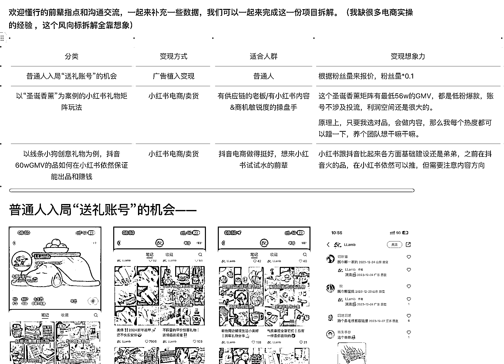

# 风向标拆解第 2 期--小丸子--小红书送礼账号真的赚钱吗

> 原文：[`www.yuque.com/for_lazy/thfiu8/cnvo3mzzcca67srm`](https://www.yuque.com/for_lazy/thfiu8/cnvo3mzzcca67srm)

## (28 赞)风向标拆解第 2 期--小丸子--小红书送礼账号真的赚钱吗

作者： 小丸子

日期：2024-01-05

风向标拆解第 2 期--小丸子--小红书送礼账号真的赚钱吗

Hi，大家好呀，我是丸子。23 年从人大毕业，现在在做小红书相关的副业，大概连着三个月副业稳定月入过万了。

从十二月到现在贡献了三条小红书风向标，虽然错过了风向标拆解提交的 DDL，但生财是我商业和副业的启蒙，非常愿意不出于任何目的的来贡献一点好玩的东西。

关于小红书送礼账号真的赚钱吗？我的答案是：必然赚钱。同时我对礼物的想法是“万物皆可礼物，只要我想让他是个礼物，他就可以是”。

以小红书的货物为例，拆解了三个品/账号，分别适合不同的玩家来参与，大家按需查看：

1.  普通人入局“送礼账号”的机会，八百粉丝账号，单篇报价 100 块，内容创作简单，可批量，非常适合萌新来玩。

2.  以“圣诞香薰”为案例的小红书矩阵账号，适合有商品供应链/有小红书内容&商机敏锐度的操盘手一起共创，两个月不到 500 粉丝的两个小红书账号，可以做到大概 56w 的 GMV，同时因为是低粉素人账号，所以不涉及投流费用，相当划算的一笔买卖，粗略估计在没扣除人员相关成本的利润大约 30w 左右。

3.  以“线条小狗创意礼物”为案例，抖音 60w GMV 的品如何在小红书依然稳定出品和赚钱。适合抖音电商做挺好的，但橘生淮北/水土不服的电商前辈。

这个拆解全靠我自己想象和简单市场调研，缺乏电商的数据和行业补充以及真正把手弄脏的经验补充，欢迎有经验的前辈指点和讨论，我们可以一起把这个内容做得更好，从而帮到更多人。

👉[`btd7lq93bx.feishu.cn/docx/BS4edRjqeoqBg2xQUXPcBepWnFg?from=from_copylink`](https://btd7lq93bx.feishu.cn/docx/BS4edRjqeoqBg2xQUXPcBepWnFg?from=from_copylink)

* * *

评论区：

薇姐创富 : 真的很棒，用心写了~
小丸子 : [爱心]
灵然 : 好棒的内容，能感觉到用心，可以链接一下吗？
小丸子 : alwayswithone，知识星球主页也留～

* * *