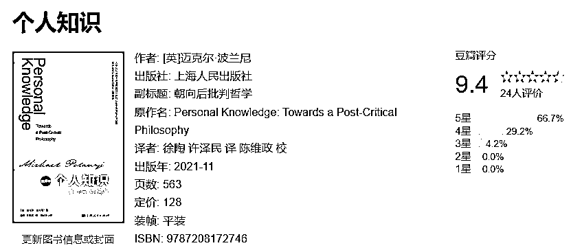
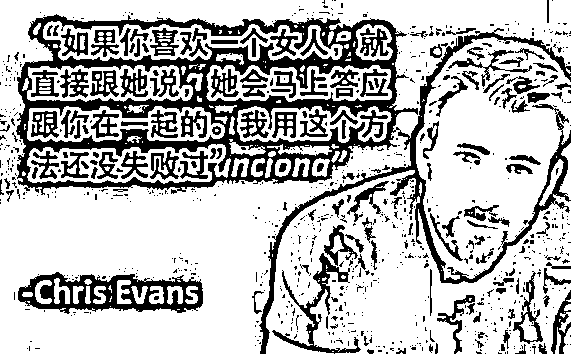

# 谈谈生财大航海的三层价值，看航海手册只在第一层

> 原文：[`www.yuque.com/for_lazy/thfiu8/cngv2l5b64d50kd9`](https://www.yuque.com/for_lazy/thfiu8/cngv2l5b64d50kd9)

## (74 赞)谈谈生财大航海的三层价值，看航海手册只在第一层

作者： 老黄牛

日期：2024-01-12

对于普通人，参与航海分三个级别，每个级别收获都不同。

1.  第一级：不参与实践，只看航海手册，获得“客观知识”。

2.  第二级：与一群人一起参与实践，获得属于自己“主观知识”。

3.  第三级：通过“公开努力”，获得贵人辅助，获得贵人的“主观知识”＋资源，改变命运机会。

最近对我影响很大的一个概念“个人知识”，下面简明扼要分享给大家：

### 第一级：行可兼知，而知不可兼行。只有行动才能获得“个人知识”

大航海是一个“软硬兼施”（群体压力、押金）让你实践的活动。

毛泽东和曾国藩都非常崇拜一个人“王夫之”，他说过一句“**行可兼知，知不可兼行**”

意思是：实践可以兼带掌握理论知识， 而理论知识不能代替实践。

为什么呢？

著名物理化学、哲学家迈克尔·波兰尼在《个人知识》提出了一些核心概念：**个人知识（Personal Knowledge）。**

什么是“个人知识”？

大部分人认为：知识是客观、公共、普遍适用、与个人无关的。

波兰尼认为除了客观知识，还有深深**植根于个体经验、直觉和信念**，主观性的“个人知识”

**①知识和个体情况有关**。

为什么很多人会开杠？因为他们都认为自己的知识是对的，他们觉得应该“唯一”正确的知识。

举例子

实体书和电子书，应该看哪个？

认为看实体书的，可能家里有个大书房，每天 3 小时在家。

认为看电子书的，可能由于工作大部分时间在路上跑、拿着实体书看不方便。

其实他们都对，实事求是。

给个图你们感受一下（美国），他说得对吗？

**②有些知识，只能通过实践掌握**

举个例子，骑自行车原理这样的：

当他开始向右摔倒时，他把车把转到右边，这样自行车的行进路线就沿着一条曲线向右偏转。这样产生的离心力将骑车人推向左侧，并抵消将他拖向右侧的重力。这一动作很快使骑车人失去平衡而偏向左侧，他将车把转向左侧以抵消这种牵引力；因此，他继续通过一系列适当的曲线前进来保持自己的平衡。

知道这个理论了，新手就会骑车吗？

**赚钱、创业同样需要个人知识（一些主观的、需要实践才能获得的知识。）**

### 第二级：比信息更重要的，是承载信息的人。如何借用“别人的个人知识”

假设你有疑问：广州的北京路卖冰糖葫芦能赚钱吗？

如果你问一个厉害的生意人，通过对话的形式，可以调动他里面的经验和意见。他会针对特定的情境给出相关的建议。或者通过交流，让你知道坑在哪里。

但这个独特情景，你极难通过搜索获得答案。

毕竟高手很少、也很难把自己所有经验输出成理论放在网上。

**而在航海群里就提供这种情景。**

有经验的群友、有杰出成果的教练供你提问交流。

如果没有航海，靠自己链接到教练，和教练交流，难度大很多。

### 第三级：贵人相助，实现“质”的飞跃。努力让别人看见

个人努力往往是在“量”的基础上叠加，是线性的。除非遇到“质”的跃迁。

所谓量的叠加，如考试刷题。只有参与高考，才是“质”的跃迁的机会。

比如你持续定投，遇到大牛市，才能有一个“质”的跃迁。

#### 通过行动力，获得贵人青睐。

那么你量的努力，如果遇上贵人，也能质跃迁。

但要遇到贵人，最重要的是自己有值得别人的信任和帮助。

所以前提你的优秀品质，要尽可能被人看见。

#### 航海创造了被发现的场景

以“做无货源”为例，你不断上架，勤勤恳恳，结果是线性的，毕竟有一大帮竞争对手和你做同样的事。

但如果的在航海上，你的行动力足够好，公开复盘和思考，被一位老板看见了，他带你去做“他的事”，结果就大不一样了。

因为他是有自身资源，而且能招人，证明他的事业盘还在上升期。

事实上，很多执行力强，就被很多生财老板挖走了。

老板需要行动力强的人，行动力强的人需要好机会。

那么，大家在第几层呢？

* * *

评论区：

koalabear : 第一层
老黄牛 : 💪🏻

* * *