# 2024 微信公开课，视频号第一手信息分享

> 原文：[`www.yuque.com/for_lazy/thfiu8/qdm6m8mhwiociw4i`](https://www.yuque.com/for_lazy/thfiu8/qdm6m8mhwiociw4i)

## (101 赞)2024 微信公开课，视频号第一手信息分享

作者： 亚超

日期：2024-01-11

大家好呀，我是亚超，今天被邀请去了「2024 年微信公开课」，重点参加了“视频号原创作者专场”和“直播带货专场”，得到了很多关于视频号的扶持政策，流量规则等第一手信息，回家以后第一时间就做了整理，来分享给大家~

以下是视频号的短视频创作以及直播带货的重点笔记，全程以 Q&A 问答形式来记录，对于视频号感兴趣的圈友们一定不要错过。

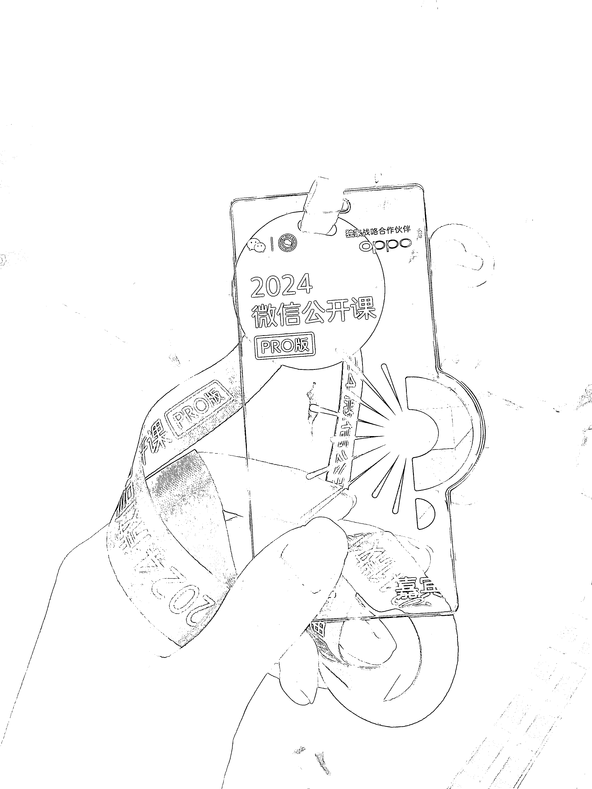

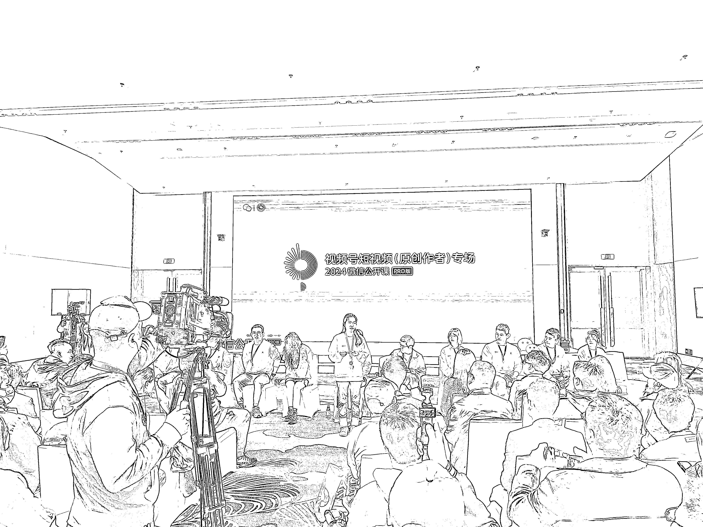

（前面坐的那一排都是视频号各个模块的负责人，以下回答代表视频号平台的态度）

### Q：视频号怎样获得更大的流量？

A：首先平台鼓励原创的内容，会有三个方面考核标准：

1.  （1）内容质量，比如 3 秒、5 秒要留住观众，用户互动行为，朋友点赞等都是核心指标。

2.  （2）内容垂直程度，更新频率，鼓励发垂类的内容，并且持续更新。

3.  （3）创作者在视频号上的经营意愿是否强烈，比如回复评论、回复私信的频率。

### Q：什么样的视频内容更容易变现？

A：内容要有对品牌的诠释，做自己擅长的，并且得到粉丝认可的垂直内容（平台不太鼓励突然变换账号方向）

视频号推出了多种方式帮助创作者获得收益

1.  （1）互选平台：可接产品广告

2.  （2）创作者分成计划：靠流量价值变现

3.  （3）重点行业的扶持：比如游戏赛道，可跟主播合作 cps 分成、比如知识博主，内测了会员制专栏

4.  （4）短视频电商：平台加大了挂车视频流量的分发优化，挂车的带货视频也会有很多流量，并且明年的带货流量还会继续放大。

### Q：认证黄 v 对于流量有影响吗？

A：账号认证主要是身份标识的作用，便于用户分辨，也能用于开通更多功能权限，不会影响流量。

平台鼓励做账号认证，没有明确说会有流量扶持，但肯定不会打压，一些垂类赛道，比如财经、医疗，认证之后才能更好地发一些特殊内容。

### Q：授权其他账号发同样的内容，自身流量是否会受影响？

A：为了治理搬运，从 22 年开始，视频号原创内容的流量就占了绝大多数，23 年推出原创声明功能，跟更多变现权益所挂钩。

至于授权功能，授权本人和被授权账号，都不会影响流量，并且如果持续发原创内容，还会有流量扶持。

被授权账号发布的内容也是可以声明原创的。

### Q：违规的视频，比如诱导点赞是机器审核还是人工审核？

A：存在人工审核的环节，也有可能是用户举报，影响了用户体验。

“喜欢的话可以点赞”这类话术本身是没有问题的，但是不能整个视频只有这样的信息。

如果账号流量不行，感觉被限流了，但是并没有收到处罚通知，这种情况就是没有限流，多找一下自己的问题，平台更加鼓励原创真人出镜的内容。

### Q：挂车带货的视频流量会受到影响吗？

A：作者通过挂车带货获得收入是很鼓励的，平台不会做任何的负向处理，不会对挂车视频做打压，挂车视频流量低，更多是因为你的带货视频会影响视频内容，影响用户观看体验，导致数据不好，所以要保证账号内容风格统一。

### Q：能在视频号上面讲视频号的教学知识吗？

A：平台鼓励建立圈子一起交流，但是这个过程中平台要对用户有一些保护，但不会限制这类内容。

### Q：平台对矩阵号的态度

A：平台不太愿意，同一个人用不同角度拍多个视频，分发到不同的账号上面。而如果同一个公司，不同脚本，不同人物出镜，是鼓励的。

重复性太高的账号会有限制的，并且一个人最多 10 个矩阵号。

### Q：评论或者私信回复敏感词，比如功效类的，会违规吗？

A：正常宣传产品是可以的，但不能直接说出可以解决 xxx 医疗问题等。

### Q：视频号的实名认证能更改吗？

A：目前不能，但正考虑做，因为之前有一些监管要求。

### Q：视频号有敏感词库吗？可以提供给作者用于检测吗？

A：不能开发这类的功能，因为是否存在敏感词，会根据政策，大的环境随时变化，有可能今天发布的视频是合规的，过一段时间就会被违规。因此视频内容中有关于经济环境、政策方针等内容要特别注意一下。

### Q：视频号的文案查重做到了什么程度？

A：针对真人出镜洗稿搬运的情况，平台目前正在继续攻克。

还有一键投诉的功能正在设计了，减少投诉的操作路径

### Q：直播切片可以发短视频带货吗？

直播切片可以发短视频，不会特别限制，跟正常的短视频一样去审核推流，只要真人原创，对用户体感好就可以。

### Q：短视频和长视频的推流机制有区别吗？

A：没有区别，但是用户就是喜欢看短视频的，所以短视频的流量可能会比长视频好一些。

下半年开始，会对中长视频做一些流量扶持，比如推出“稍后看”功能。

### Q：视频号有白名单吗？

A：没有白名单，都是统一的规则。

### Q：利用 AI 生成的内容，会受到限制吗？

A：用 AI 来做内容只是手段，手段是无害的，不会有限制，只要是用户喜欢就可以，本质上还是看内容，包括数字人的视频，如果你觉得使用数字人能表达你的想法，输出你的内容，得到用户喜欢，那也可以，创作的内容大于创作的形式。但是建议在视频里面增加提示，避免误导用户。

### Q：视频号引流私域的路径会调整吗？

A：视频号去年做了引导加企业微信的链路，但是后来被下掉了，原因是有很多人利用这个功能，将用户引流到私域里面去卖一些违规产品，收到了很多用户投诉，因此才将这个功能改为了客服功能，主要是为了保护用户。

### Q：2024 年会扶持哪些赛道吗？

A：2024 年不会特别扶持某个赛道，都是统一的。

但是 2024 年会加大对视频号原生作者的扶持，就是那些只做视频号或者在视频号投入更多精力的作者，会在各个场景下提供帮助扶持。

**怎样判断视频号原生作者？**

比如你经常回复用户的评论，回复用户的私信，在视频号上投入了更多时间。（尤其提到了回复用户评论的次数等，会在接下来作为考核指标之一。）

### Q：关于挂车视频的加热投放

A：当前的内容加热更倾向于让更多人看到，而交易转化会为前者让步。所以挂车类视频投放的话，转化数据不会太好。

针对挂车视频，用户在产生的交易之后是否满意，也会影响后续的流量推送。

2024 年视频号还会有一个重点，就是培养用户习惯，比如怎样更好地引导用户点击小黄车下单等。

### Q：为什么之前账号流量不错，后来逐渐下滑了？

之前流量不错，后来流量下降了，更大的可能是进来的作者变多了，流量都被竞争走了。

如果流量有波动，可以去创作者中心看到视频数据，跟同类作者的差异，找找自身内容的原因。

### Q：私信能不能直接发微信？

A：这种形式是可以的，但是不能给用户带来不好的体验，或者恶意引导，比如给用户发一半话，另一半需要加微信才能看。

短视频增加手势动画，引导用户进入直播间的行为，会受到限制，因为会影响用户体验，可以尝试通过口播来介绍

（通过数据也能看出来，增加手势并不能增加转化，反而因为不同平台的位置不一样，影响用户体验，因此不鼓励）

### Q：挂车视频和不挂车视频的流量考核是两套规则吗？

A：这两者并不是互相独立的考核标准，规则只有一套，看的还是内容本身。

但是挂车带货视频会额外考虑一些电商因素。

中长视频与短视频的推荐策略也都是一致的，没有两套标准。

### Q：账号被处罚，恢复后会影响流量吗？

A：账号被处罚恢复之后，只要新发的内容是符合规范的，就没有问题，不会影响

单个账号建议有清晰的定位，只做一个垂直方向。

### Q：同城账号会有扶持吗？

A：本地同城会继续加大关注。

### Q：一个人能认证几个视频号

A：由于监管要求，未来**一个人只能认证两个视频号实名。**

### Q：视频号会限制引流私域吗？

A：平台希望公域和私域两者应该是联动的，而不是只从公域往私域导流，因此接下来会更多考虑的是两者如何联动，比如更新视频时如何通过推荐触达到粉丝，未来还会考虑视频号如何跟小程序公众号联动等。

### Q：视频号是否有账号权重一说？

A：没有。账号只有是否违规的判定

### Q：视频号入口会放在微信一级 tab 吗？

A：不可能，谣言！

### 关于直播带货

下午我还去旁听了视频号直播带货的分享会，有几个重点信息：

1、直播带货团队，从去年底就开始补充了很多人进来。（团队内部没有赛马的情况，一直只有一个团队）

2、接下来还会投入更多产研去做直播的基建功能。

3、给商家以及服务商打造一套成长机制，比如完成任务，逐步提高分数等级。针对服务商，会尽快给出一些明确的政策以及成长体系，从而跟平台一起成长。

4、线上会继续完善直播大屏、数据罗盘等后台数据、

5、平台会尽可能把直播算法的黑盒做得透明，比如每场直播给一些保底流量，并且给出数据指标，方便你去优化，这些都会反馈在数据大盘上，包括跟同行的对比差异，跟大盘数据的差异，让你能清楚的知道为什么自己的流量不如别人。

6、直播怎样跟私域结合？

目前正在思考和尝试，之前上线过直播间推送企业微信的功能，但是很多人拿去去引流卖黑五类等违规产品，所以就下掉了，目前还在探索，今年内会想出一个更好的方案。（微信不愿意去模仿别人，更想要结合自己的优势去做出解决方案）

7、达人部分 ，继续支持真人原创，以及主战场在视频号的达人，会给你更多流量扶持，佣金扶持，不会刻意的限制达人的流量，欢迎更多人来做内容做直播，继续鼓励原创内容。

8、过去的一年，视频号直播带货的 gmv 增长了三倍。

9、今年会重点优化用户购买体验，比如推出“用户三个月内可以有 5 次退货包邮的机会”。

10、对部分品类的商家会提供全程的团队陪跑服务，一起来做。

11、对于直播带货，官方没有标准答案，实践是检验真理的唯一标准。

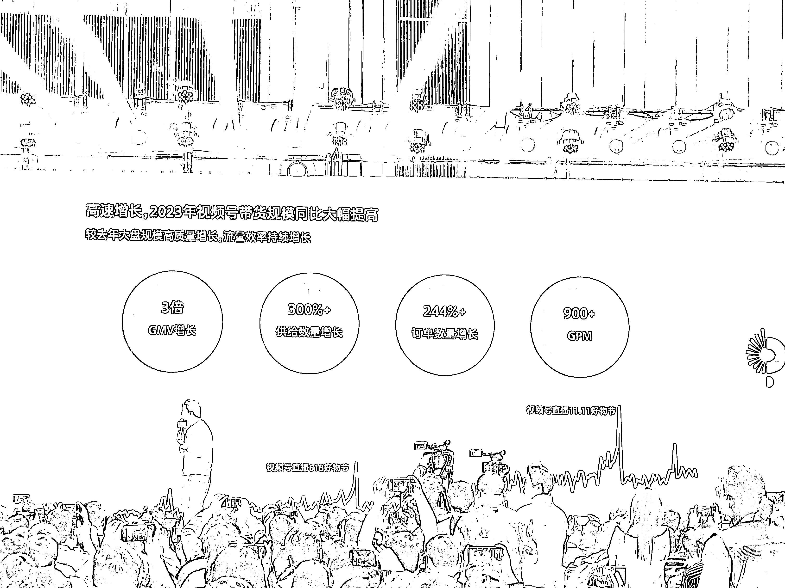

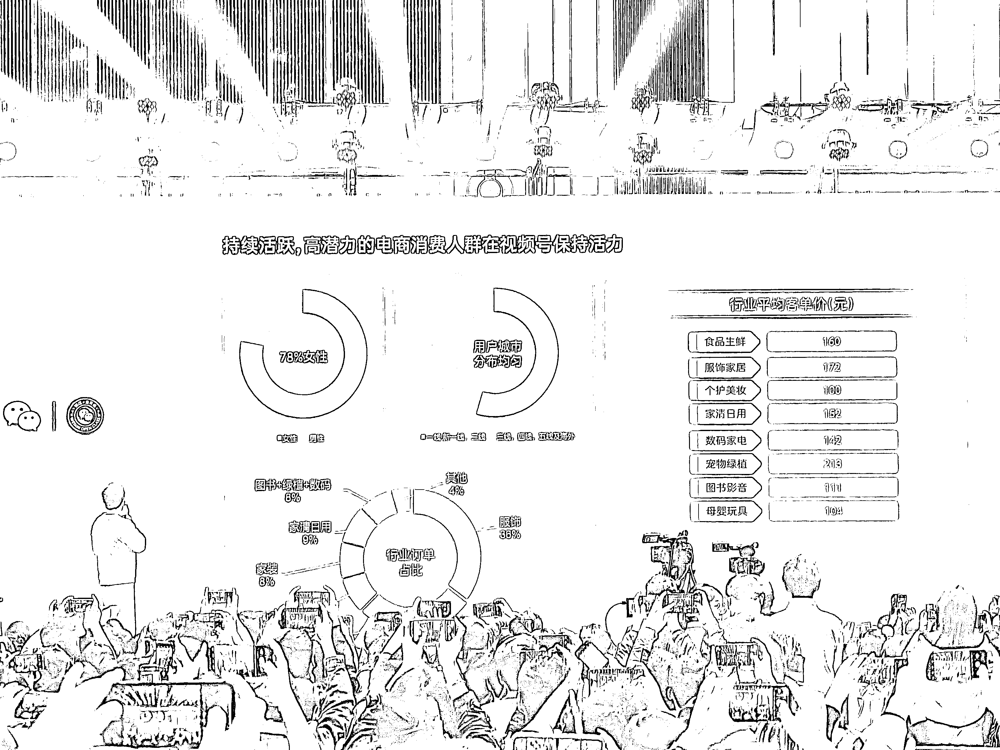

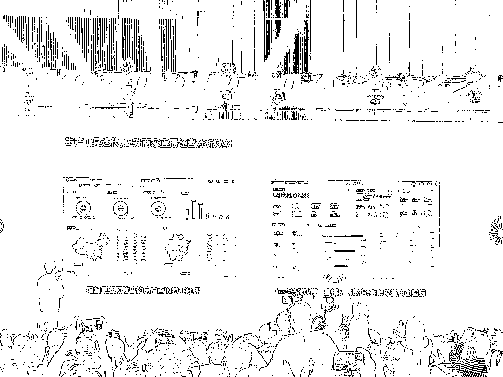

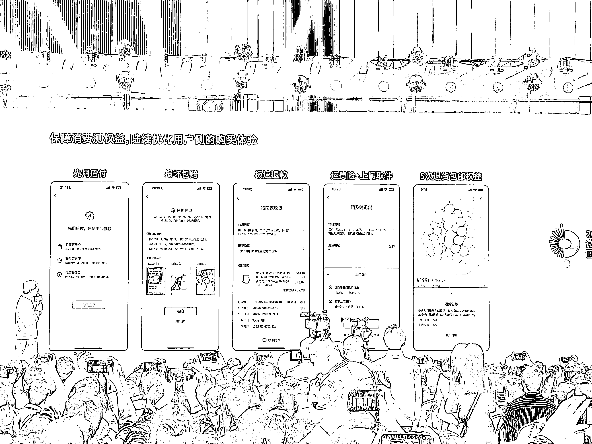

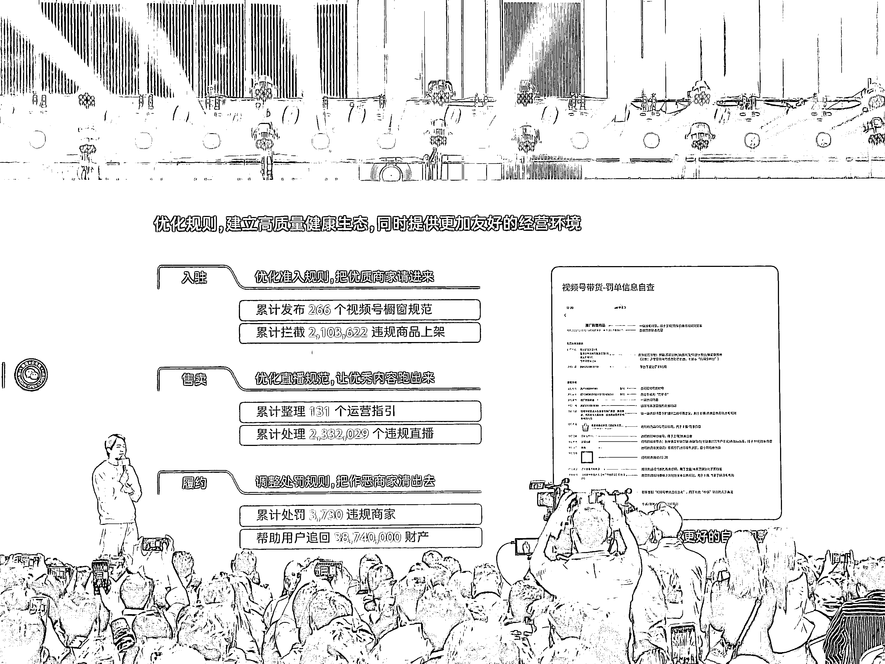

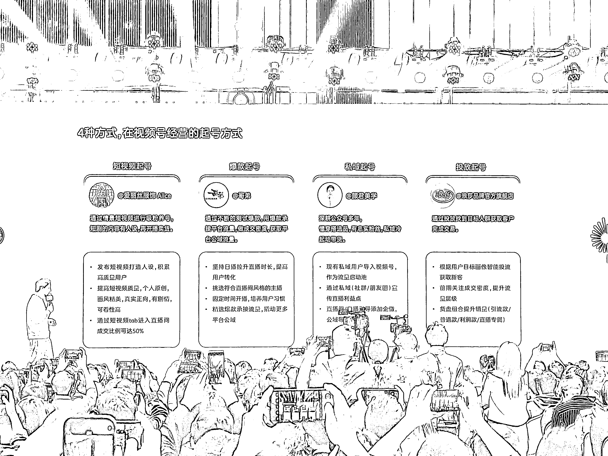

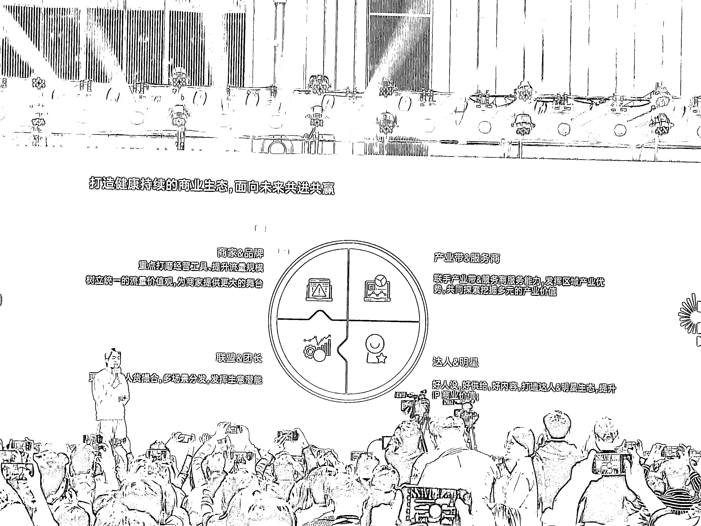

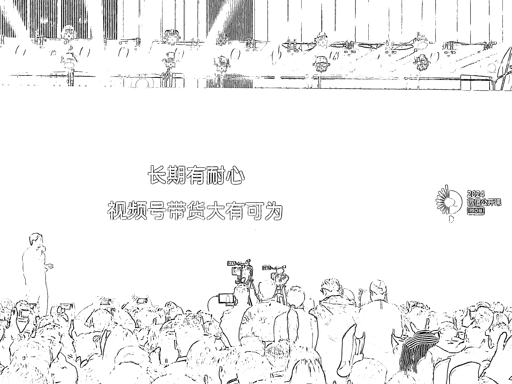

最后，微信还会在今年推出更多 AI 能力，比如微信对话平台，小微助手等。具体产品全景图以及上线规划如下：

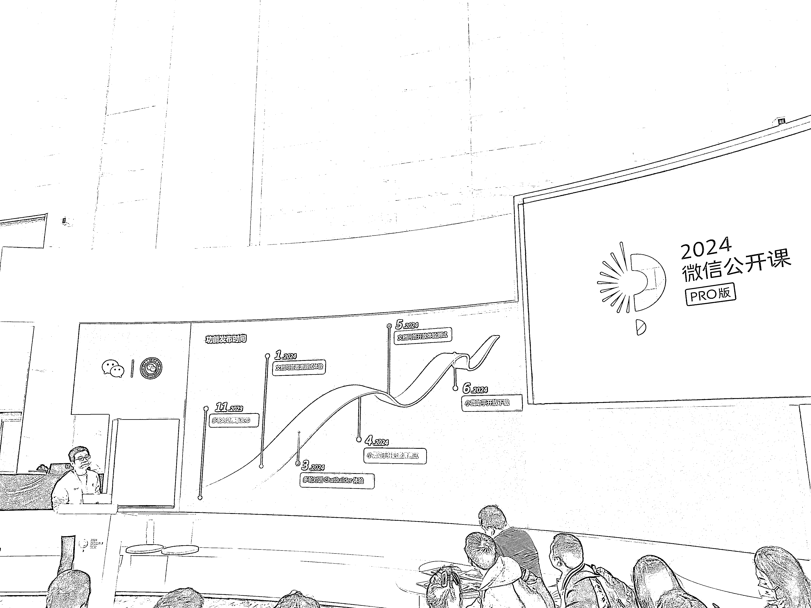

* * *

评论区：

程为自己 : 晚上还想着问下之前不是有直播吗，今年只有线下了吗？谢谢老师分享，感谢[抱拳][抱拳]
芮 rui : 太棒了。6666 好好
书豪 : 牛
旭宏 : 感谢分享
浅浅 : 感谢分享
西瓜🍉 : 感谢🙏
风与月 : 很及时 感谢分享

* * *