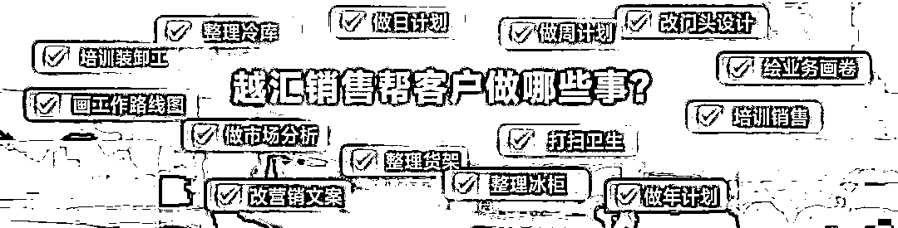
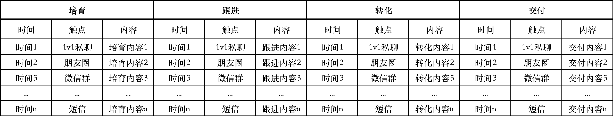

# 2024“时间的朋友”跨年演讲，与私域有关的 7 个要点

> 原文：[`www.yuque.com/for_lazy/thfiu8/hkirpghbhlmzwlut`](https://www.yuque.com/for_lazy/thfiu8/hkirpghbhlmzwlut)

## (26 赞)2024“时间的朋友”跨年演讲，与私域有关的 7 个要点

作者： 大江

日期：2024-01-08

今年“时间的朋友”你看了吗？我看完后整理了跟私域有关的 7 个要点和启发，想跟你分享，好废话不多说。

**1、什么是真正的为客户服务？**

河南鹤壁的一个卖鸡肉卷的工厂，他们是怎么做客户服务的？

第一，他们的销售人员跑到客户那，不是去跟老板吃饭喝酒喝茶，也不是张嘴就推销产品，而是帮老板们清扫和整理冷库，比如他们帮一个客户通过打扫和整理冷库，减少了冷库的数量，光冷库费一年就省下 17 万。

第二，他们销售在卖场看到客户货没码好，会帮他们码好货，让客户更好卖。

第三，除了以上两点，他们通常需要帮客户做的事可多了，从打扫卫生，到设计动线，都会干。

素材来源：得到

鸡肉卷工厂的这一套打法叫“客户经营改善型营销”。说白了，就是通过帮客户改善经营、帮客户赚到钱的方式，来实现自己的营销。

这放在私域经营里，不就是我们常说的“利他思维”么。

1.  卖服装的，有没有想过帮你的客户变得更得体适配，而不是忽悠别人穿什么都好看；

2.  做保险的，有没有想过帮你客户量身定制符合他利益最大化的方案，而不是只看佣金推荐；

3.  做医药的，有没有想过在客户需要你的时候第一时间出现，给与关怀或安慰，而不是只会卖药；

4.  卖软件的，有没有想过帮你的客户把软件用起来，而不是只想、只能把软件卖给别人；

5.  做知识服务的，有没有想过如何帮你客户行动起来，交付应有的价值，而不是只想收割别人；

  ……

我们不妨都想想，自己为客户服务了什么？

**做私域的核心是在提供服务、价值，经营关系后，客户主动的选择。**

**2、最小业务单元决定成败**

鸡肉卷工厂，他们的销售模式是地推，地推是他们最小业务单元。

他们是怎么做地推拜访客户的？

什么时间去？下午 1:30 左右，因为这个时候午餐高峰已结束，店里稀稀拉拉有客人，但不太忙；

怎么去？不能开好车去，不能让客户觉得你很赚钱；

去干什么？带着锅碗瓢盆去，现场煮给他们的老板、主厨，还有客人吃，让客人说好吃。

你看，都是多么「细节」的东西，**细节决定拜访成功率。**

其实，私域不也是如此嘛。

私域的最小业务单元是什么？是一次消息推送

任何一次消息推送都涉及 4 个要素：时间、人群、场景（触点）、内容，细节就藏在这些要素里。

我们每一次的消息推送，都应该认真思考，**这次推送是针对哪个人群，在什么时间发合适，通过哪个触点发送，发什么内容是他们感兴趣的。**

只有这样，我们才对得起每一次有限且宝贵的触达客户的机会，就像鸡肉卷工厂的对推一样。

遗憾的是，**我们普遍把私域当成了广告渠道，在私域里肆意群发广告，为了转化少部分人而得罪大多数人。**

**我们也普遍太过于关注运营技巧和群发效率，而忽略了私域最小业务单元（一次消息推送）的决定性作用。**

试想一条消息都发不好，何谈做好私域？

**3、内容的重要性无处不在**

在讲到美容院的案例时，有这么一段店长给客人的电话话术：

> 想象一下，这样的话术即便不是电话里说，微信里发给客户，可不可以？
> 
> 这个话术的最大特点是什么？
> 
> 说人话，真诚。
> 
> **真诚是最大的套路，说人话是最好的销售语言。**
> 
> 越淳朴的东西越难能可贵，然而我们能看到很多的私域是铺天盖地的广告，把微信干成了短信。
> 
> 不怪客户不鸟你、烦你、删你呀。
> 
> 试想下，假如你私域里都是这样真诚地和客户“说人话”，你的客户会不喜欢吗？你的私域会做不好吗？
> 
> 坦白说，上面的话术可能不是最好的，但无妨，你只需要比你同行的好，是不？不是有句话是这么说的吗，“不是我做得有多好，全靠同行衬托”。
> 
> 大盘的私域内容水平，我斗胆给个分值 30、40 分，不真诚、不说人话、不利他，其他的什么排版、花花绿绿表情我就不说了。所以，你哪怕只需比你同行好一点点，客户可能就会在你和他们之间选择你。
> 
> 好，现在我假使你意识到内容的重要性了，接下来的问题是谁来生产这样的内容呢？
> 
> 要么自己写，要么招人写，要么请人写。
> 
> 无他。
> 
> **4、服务和体验**
> 
> 服务和体验有什么区别？
> 
> 满足客户的基本需求、帮客户解决问题，这些是服务，体验是让人有「感动时刻」。
> 
> 怎么做好体验？
> 
> 两个字：用心。
> 
> 有一家做戈壁徒步旅行的，为了让客户看到日出，他们会计算好看日出的时间，为了给生日的客户惊喜，他们在戈壁会在客户许愿时放烟花，还有深圳的一家美容院会用 AI 给客户写藏头诗。
> 
>   
> 
> 素材来源：得到
> 
> 要知道这些本可以不在服务范围内，但用心去做就会客户带来惊喜，带来超出预期的体验。
> 
> 遗憾的是，我们大多数的私域，还停留在没服务阶段，更很少有私域，开始在做客户体验。
> 
> 但我们要知道，方向在哪里，**客户体验才是真正能打动客户、能黏住客户的东西。**
> 
> **5、学会降本增效**
> 
> 随着经济下行，降本增效会是越来越多企业不得不去面对的问题。
> 
> 怎么降本增效？
> 
> 有一家餐厅是这么做的：
> 
> 第一，用消毒筷子机代替一次性包装，一年下来省下了 30 多万。第二，用剪刀代替菜刀切菜，每天可以节约 5%左右新鲜食材，第三，减少冰箱倒逼餐厅管理者对第二天的销售做精准预算。
> 
> 
> 
> 素材来源：得到
> 
> 是啊，**从经营中，我们总能找到降本增效的地方**。
> 
> 那么，私域能不能帮企业降本增效呢？
> 
> 还真能。
> 
> 不管 b2c 还是 b2b 都可以。
> 
> b2c，比如餐饮企业，利用微信小程序点餐和买单，可以大大提高点餐效率和买单效率，提高翻台率，甚至通过小程序菜单里的组合推荐，增加销售额。
> 
> b2b，通常重销售堆人力，是销售都有一个问题，销售跟进客户不了太长时间，最多 30 天算长的，30 天以后把客户忘了，或者骚扰客户，被客户删了，这里面是巨大的资源浪费，假如 3%的转化率，意味着 97%都沉默流失了，哪个老板能承受得了，哪个老板能说无所谓。
> 
> **对于很多企业而言，3%是生存，97%是发展。**
> 
> 在《销售越来越难做，怎么办？》里我有讲到我们可以在微信这个特定环境里设计一套标准化的销售流程，这套流程代表的是销冠的最佳实践。
> 
> 标准化到什么程度呢？
> 
> 什么时间，什么触点，给什么客户，推送什么内容
> 
> 
> 
> **这套精心设计的时间内容序列（剧本）， 谁来执行效果都一样。**
> 
> **销售不再是单纯的筛选客户，而是精心的培育客户。**
> 
> **这能消灭多少的资源浪费！省下来的就是赚的。**
> 
> 其实私域天然就是一个降本增效的渠道，光从曝光来讲，能为企业节省了大量的营销费用。
> 
> 因为你可以通过私域免费触达你的客户，而在其他地方，你的每一次曝光都需要付费。
> 
> 学会借助私域给企业降本增效吧。
> 
> **6、人和工具的关系**
> 
> AI 越来越强大，写文章、画图、写软件、做音乐、做视频，没有它不会的。
> 
> 但 AI 时代对我们的真正考验是你怎么用好它。
> 
> 是啊，我们对待工具的立场不也理应如此吗？
> 
> 做私域我们常常会用到工具，但也容易在工具上面踩坑，根本原因是我们没有搞清楚和工具的关系。
> 
> 我们总想找一款功能强大的工具，以为工具强，我们就越强，真实情况是，**工具越强，对我们要求越高。**
> 
> 我们不知道怎么做私域，以为买了工具就会做，实际上**咱缺的哪是一个工具，咱缺的是策略、是内容、是懂私域的人。**
> 
> 我们私域做不好，以为是工具不行，其实大多时候跟工具关系没那么大，**工具是做好私域的必要不充分条件。**
> 
> 值得我们思考的是，到底是应该人仰仗于工具，还是应该工具仰仗于人？
> 
> **7、组织变革**
> 
> 云南昆明有一家柠檬茶品牌，叫“麒麟大口茶”，他们研发了一种“店型”：一家茶饮店，只用一个人当班。
> 
> 咋一想，好像觉得不可能，但他们真实现了。
> 
> 当然，这背后攻克了很多难题。
> 
> 比如：
> 
> 1.  把跟顾客介绍产品
> 
> 2.  收银的岗位砍掉了
> 
> 3.  产品也只做一款
> 
> 4.  把所有设备全部集成到前面的操作台上
> 
> 5.  把动作集中到一个人的臂展长度之内，这就得一大轮研发。
> 
> 6.  为了让动作具有表演性，专门请武术老师设计了每一个动作
> 
> 7.  为了不让一个人的店面显得单调、冷清，他们重新设计了店铺的装修，海报里突出夸张的表情和笑脸，热热闹闹闹的。
> 
> 8.  ......
> 
>   
> 
> 素材来源：得到
> 
> 结果是店面面积小了、人工成本低了，管理效率高了，最重要是还盈利。
> 
> 还有北京第一实验学校，把课间 10 分钟压缩成了 5 分钟。
> 
> 随即而来的是一连串的连锁反应：
> 
> 1.  取消了上课“起立、老师好，同学们好，请坐”的那套仪式
> 
> 2.  教学方式变成了老师讲一会儿，学生讨论一会儿，并且集中讲授时间不超过 15 分钟
> 
> 3.  学生可以随时去上厕所
> 
> 4.  教室的空间设计也变了，根据不同的学习任务，学生分布在不同空间里
> 
> 5.  学校上课实行的走班制，根据课程表 ，在不同教室上课
> 
> 6.  多了一个“自主时间”，学生可以自己安排。
> 
> 7.  学生需要在一节课后快速整理自己的书包、学习用品，用跑的方式进入下一个教室
> 
> 8.  校园的霸凌事件减少了
> 
> 9.  老师不拖堂了
> 
>    ……
> 
> 素材来源：得到
> 
> 从这两个案例，不知道你想到了什么？
> 
> 我想到的是组织变革的意义和关键所在。
> 
> 变革是一连串的连锁反应，或者说会引起一连串的连锁反应，而决定这件事成败的首先是决策人。
> 
> 柠檬茶店如果没有老板决策，那一系列的难题不可能攻克；学校如果没有校长决策，课间 5 分钟及一连串的连锁反应就不会发生。
> 
> 做私域其实也一样。
> 
> 我们常说：“私域是个一把手（CEO）工程”，这句话里有两个关键词：“**一把手（CEO**）”、“**工程**”。
> 
> **前者代表了私域的重要性，后者说明了私域的复杂性。**
> 
> 私域的开展过程会遇到一系列难题:
> 
> 1.  人的问题，团队没人做过私域，是从外面招人，还是内部培养人，还是找第三方机构；
> 
> 2.  引流问题，电商平台不愿意把流量导流给私域；
> 
> 3.  定价问题，私域跟公域的定价是否一致，如一致，客户为什么要到私域买，如不一致，公域觉得不公平；
> 
> 4.  业绩归属问题，如何追溯是私域的业绩？私域用户到公域下单，算谁的？
> 
>   ......
> 
> 你说这些难题谁能解决？不只有老板本人嘛。
> 
> 只有老板才能让变革的齿轮转动起来。
> 
> 在这一点上，很多企业只看到了局部，不够重视。
> 
> 一次私域的组织变革是怎样发起的？
> 
> 我分享一个医疗行业的案例，是我服务过的一个客户。
> 
> 他们是做体检的，也有门诊，两三年前就开始了数字化转型，但没有实质进展。后来他们董事长亲自带队，做了一系列动作：
> 
> 1.  开会，立项，定战略，盘资源
> 
> 2.  从各部门中选拔人才，组建私域团队
> 
> 3.  多个岗位发布新的人事任命，有的连升三级，被委以重任。
> 
> 4.  私域部门制定新的薪酬制度
> 
> 5.  取消所有以往其他预约形式，比如电话预约、代预约，一律微信小程序预约（预约后引导加企业微信）
> 
> 6.  设计线上线下协作的标准化业务流程
> 
> 7.  开发了小程序，从体检预约到体检过程的指引，再到体检结果和报告解读，再到门诊就诊和就诊情况，全都可以查看到。
> 
> 8.  随着体检报告解读率和门诊就诊率的提高，增加更多医生资源
> 
>  ......
> 
> 我讲这个不是要每个企业做私域都学他们一样，毕竟每个企业的情况不一样，而是想让大家知道，私域是一个系统性工程，需要各部门配合，又牵扯各部门利益，老板应该重视并参与决策。
> 
> 7 个要点写完了，我突然发现，这 7 个要点正是能决定私域成败的 7 要素。
> 
> 利他、服务、体验、降本增效、内容、工具、人
> 
> 当你想做私域，或者做私域遇到问题时，我希望你能从这篇文章里，找到你的答案。
> 
> 祝：
> 
> 做好私域
> 
> * * *
> 
> 评论区：
> 
> 三生 : 说的太好了[强][强][强][强]
> 
> 
> 
> * * *