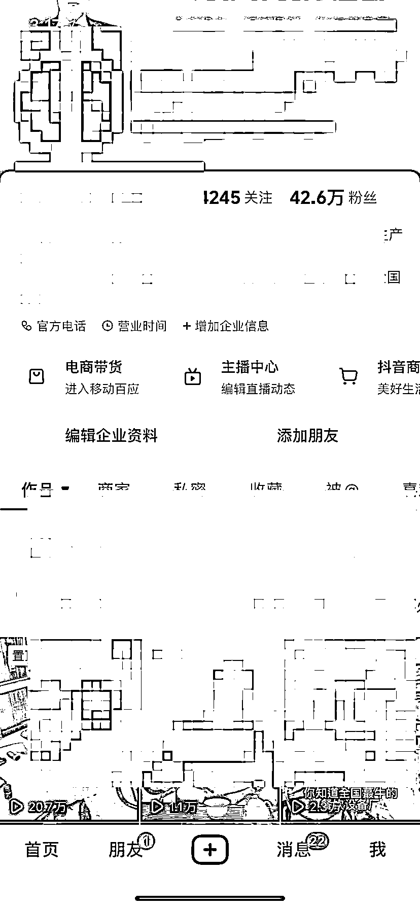
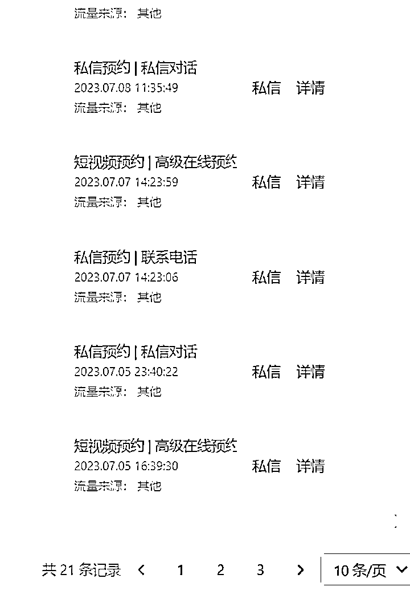
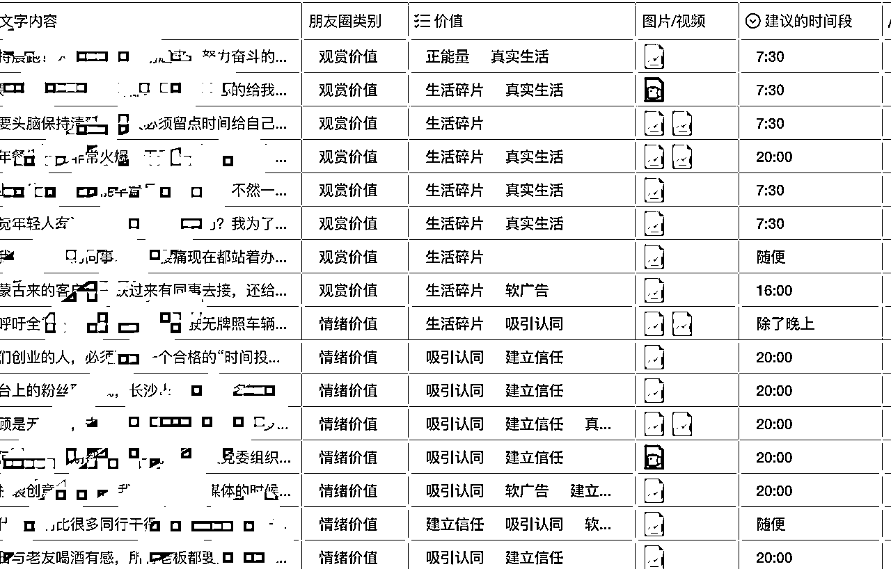

# 航海如何为传统企业赋能？通过 100%的线上流量卖了 3000w

> 原文：[`www.yuque.com/for_lazy/thfiu8/ua4rxgdrqzec9o54`](https://www.yuque.com/for_lazy/thfiu8/ua4rxgdrqzec9o54)

## (45 赞)航海如何为传统企业赋能？通过 100%的线上流量卖了 3000w

作者： Jason wey

日期：2024-01-10

“所有的行业都可以在抖音重新做一遍”

2022 年 7 月，我开启了自己的第三次创业，在抖音上卖传统餐饮设备。第一年靠纯线上流量，卖了 3000w。

在此之前，我开过剧本杀实体店，运气不错赚到了一点小钱；也曾孤注一掷，卖掉正在盈利的店铺，投了全副身家，去做一个剧本杀 app，结果自然是创业失败、团队流散。

最终选择这条赛道，几乎是破而后立。

我报了非常多的课程，去学习怎么做抖音，最终花了两个月时间，快速起盘，做成这样一个高变现账号。最终每日客资突破 150。

后来我加入生财，参加抖音 seo 航海，意外为我现在的业务赋能，增加了不少客流。现在我们每天都会收到 seo 的精准客资，重点是精准，并且只要通过 seo 来的客人，信任度极高，成交率在 20%左右，是我们平常成交率的五倍。

在文章开始之前，我想希望大家重视这两句话：模仿大于创新，选择大于努力。虽是老生常谈，但这两句话确实改变了我的命运。

我的经历都是在解释我为什么重视以上这两句话，希望大家读完能够有所收获。

# 一、自我介绍

**（1）我是谁？**

大家好，我是小魏，山东人，一个 97 年的初级创业者。

我是一个追梦男孩，一直无休止的做梦，梦想自己成功的样子是什么，自己的未来是怎样的，而我现在在山东的比较小的县城。

由于社交圈的受限，这种信息闭塞的环境也束缚了我的个人发展。我们都知道，看的足够多、听的足够多，才能让我们的选择足够多，我非常喜欢生财的机制，加入生财不到一年的时间，让我获取的信息量远远超过我创业四年中得到的信息总和。

进入生财使我打开眼界，获取足够多的信息和思维方式，通过别人的成功找我自己的方法，但是只看不执行是一定不可行的，所以大家要执行起来，想到看到才能做到，我们想到了、看到了，一定要去“做”。

**（2）我的工作和成就**

2019 年大学毕业开始创业，开办第一家剧本杀店创业，从 200 平米小店到 4 家店最大一家超过 3000 平米，运营至 2022 年。

2022 年跨入抖音这个领域，操盘的机械设备项目，仅仅一年时间，做到年营收超 3000w+

# 二、创业经历

**（1）第一次创业，入局**

2019 年毕业，脑子一热，奔赴到了江苏一个陌生的城市发展，由于没有任何朋友、资源，当时的想法就是开一个能聚集年轻人的店，多交交朋友，在这个城市能够扎根。

我是一个除了抽烟喝酒之外没什么爱好的人，也是习惯了被人围绕的生活，单打独斗有些不习惯，听说当时的年轻人都爱玩剧本杀，我就不经深度思考的开了一家剧本杀店。

当时没开过店，不懂怎么做怎么经营，我就去了南京、杭州、上海等地考察，半个月的考察期看中了一家符合我预期的店，我就蹲在他门口开始数他们一天能赚多少钱，最后算了算，能干，就开始盘点我的开店之路。

我当时从选址、装修、营销方式，都一头雾水，后来看到他们在创意园区开店，那我也找我所在城市的创意园区，他们装潢什么样子，我也都记录下来成为我的装潢方式。

甚至他们的服装、道具、员工数、剧本、如何办理会员卡、如何激励消费、如何发朋友圈、微信群怎么维护、大众点评的评价是什么、好坏评如何应对、如何改进等等，全都被我模仿过来，就这样我开启了我的第一家店。

当时很顺利，借助模仿来的东西，赶上了《明星大侦探》栏目的播出，整个行业发展迅猛，我很快就收回了我的成本。

**（2）做出创新，开始发展**

我具有一定的敏锐性，又看到 2020 年铺天盖地的 ZF 新闻打造新文旅的信息向我扑涌而来，我觉得剧本杀这个行业是可以把文化融入到旅游景区的，中华文化博大精深，又有非常多的名胜古迹中的文化故事可以做成剧本。

让年轻人们在游戏中学习历史，就做成了一本商业计划书，一直心想什么时候能遇到一个伯乐，能看中我这个千里马，让他支持支持我。

恰巧，在 2020 年底，我所在的城市某文旅 G 企，有这个想法，我们就递交了我们的商业计划书。

虽然没有得到一分的投资，但是成功拿下一座受保护的古宅，免费的房租，给我们机会让我们开展剧本杀，吸引更多的人了解到这个地点。

借此机会，我成功的检验了我的模式是可行的，赚到了一点小钱，又在该企业的项目管理者的支持下，同年，开了第三家、第四家店。

**（3）第二次创业，我踩的坑**

2021 年，当时市场的火热和我自身的发展速度让我迅速膨胀。我觉得我不应该只赚这开店的小钱，就想做一些大事，我拒绝了所有想加盟和想学我们模式的人，当即把还在盈利的店铺全部转让，自断后路。

带着我的伙伴们，去做这个行业的 app，当时的想法是我想做一个平台，其实就是摘下大众点评的这一板块成为单独的 app，让年轻人在我的 app 上面社交，幻想着从这个 app 开始，我们就能打败大众点评。

我投入了我的所有积蓄，开发了 app，靠我的一腔热血，吸引了合伙人，组建了开发团队、运营团队、bd 团队，虽然都不是专业的选手，我幻想着能抢占市场，有人投资，走向人生巅峰。

当时的我们甚至都没有完整的团队体系，没有合理的运营方案，单纯靠一个创新的想法在支撑我们几十个人走下去。

很可惜，当我们第四个月的时候，账上没钱了，app 被我们改的四不像，只获取了几家店挂在这个平台上，交互都没有做好，没有获得任何一个用户，虽然大家还在满腔热血，幻想改变世界，我想来想去，停止了这个项目。

显然，未经市场验证的创新行为，很有可能在自讨苦吃。

**（4）现在第三次创业，恢复状态，从头再来**

**1、背景**

2021 年末，我的春秋大梦创业失败，我失去了团队的信任，只有两个人还愿意跟随我，但是我当时没有了店，没有了项目，不知道该从什么地方做起。

所以盲目创业会带来的影响，不只是失去金钱、信任，还会打击跟随者们对创业这件事情的信心。

当时下载了抖音，我发现各行各业都在努力做短视频，我也是看到**“所有的行业都可以在抖音重新做一遍”**这句话，所有的线下生意通过线上可以无限放大，让我陷入了深深的焦虑中。随即我就带着剩下跟着我的兄弟，开始学习抖音之路，我们报名了非常多的课程，乐于当韭菜。

学完后又苦于没有任何项目可以入手（单纯学会这个技能没有用武之地），当时我问了一下我剩下的两个伙伴，我在山东有餐饮设备的资源，能不能跟我回山东，我们从头开始。

所以从 2022 年 7 月正式转型，全身心进入抖音+传统机械设备这个行业。

进入这个行业的原因：我的老家是中国餐饮机械设备的集中产地，可以最快速度获取最好的供应链资源。

所以**我非常建议很多圈友，如果没有目的性的找项目找了超过一个月了，不如利用自己学到的技能，先把周围的资源利用起来，再小再垃圾的项目，在中国市场，一年也有赚一百万的机会。**先活下来，再发展。

**2、目前成绩**

目前我们全网矩阵粉丝超过 100w，第一年的年营收超过 3000w，下面我就分享一下，我是怎么做的，大家也不要焦虑，我们能做到 3000w 也得益于我们的平均客单价是高于 1w 的，有时候也有部分 10-20w 的订单。

（以下是我们大号）

# 三、我是如何做好一个高变现的账号的

**（1）我踩的坑：不要一上来就创新**

先说一下我踩过的坑，经过我们四处学习抖音的玩法，学到的最多的就是创始人 IP，我看到整个行业中没有任何 IP，都在发普通产品视频，又萌生了跨越创新的念头。

我们模仿了广东家具 IP 的打法，模仿其结构、文案、镜头、引流方式等等，坚持了一个多月，并没有任何显著的效果，几乎没什么流量，更没有询单。

这次创新行为给我带来了深刻反思。

1.  我们做的产品本身是几乎无复购属性，不应该做 IP；

2.  不应该拿 100%精力去做确定性的低的事情；

3.  我们的产品在市场中大家追求的是价格优势；

4.  不要一上来就创新。

这一个月的时间，我只获得了 **30+**客资，还不如电销来得快，让我陷入了深深的自责，如果转型过来第一个项目就失败，可能我仅有的团队就会打散。

最终我们决定，利用我们曾经开店的开店经验，先照同行深度模仿，有结果后再进行创新。

**（2）两个月快速起盘：像素级模仿**

**1、深度关注十个优质对标，你想问的答案他都告诉你了**

首先深度关注十个优质的同行，他们的一切行动和变化永远逃不过我们的眼睛，在开始的阶段，认准只要做的比我好的，都是我的老师。

他们如果有一个改变动作，我们会立刻第二天进行模仿。

**举例**：他们爆了一个视频，每秒我们都拆解掉，我们需要做的是：他们为什么爆？爆的点在哪？音乐、画面、呈现形式、我的素材能不能结合他的做法、是否足够新鲜、我能否突破他的流量、我能不能做？

#### 2、如何判定这个对标账号优不优质？（一定要有确定性，先判断优质账号）

1.  看他数据是否正常，只有点赞没有评论的不要；

2.  看他更新是否有规律，如果没有规律三五天一条的不要；

3.  看评论区问价的多不多，如果很多与问价无关的就不要；

4.  加微信，问价、咨询、看朋友圈；

**3、跟着同行的动作，确定自己做什么**

我们模仿对标的 **BGM、文案、标题、字体、字体颜色、话题、发布时间、评论区前几条、回复方式、引流方式**等，他多细，我多细，他做什么我做什么，在初始阶段，哪怕是我觉得竞品的错误动作都会跟着模仿。

我们立刻根据同行换了我们的打法，同时起五组账号，全部发产品视频、新闻体短视频。我当时的想法是，我如果跟对标一模一样，别人哪怕获取一千个客户，我获取十个就够了。

#### 4、阶段成绩

当我们像素级模仿开始，并利用 dou+的加持，五组账号，我们就已经有了每天 **50+**的客资，1-2 个销售就能承接的住。

**（3）微创新：借鉴其他行业的打法完善自己的项目**

同行都模仿完了，适当进行一些微创新，我平常看知识博主较多，知识博主的引流方式是**“送资料，链接我”**

我们做实体产品的哪有资料可以送？所以我们就开创了**“送服务，链接我”**的模式。别人送资料，我送设计方案，只要对方把平面图给我们，我们就为客户送免费的设计方案。

正常一份设计方案每平方 50-100 元，我们现在多招聘了两个设计师，免费送。

**1、抗击流量的不稳定性**

每天固定的行为+矩阵，是有一定的基础播放量，但是基础播放量也只是概率问题，每天还需要 dou+，有的投的出去，有的投不出去，还经常会收到“减少推荐”的提示，是因为我们的产品视频与对标的太像了，不光与对标像，跟自己的也很像，每天基本都一样。我们自己分析的原因是：内容同质化严重、内容千篇一律、剪辑手法无创新。

解决减少推荐（玄学）：我们开始投信息流广告，信息流广告就像是通关文书，当你盈利之后，一定要交。

#### 2、阶段成绩

当我们“送服务，链接我”加上信息流广告的助力，我们的日平均线索量能够**破百**，信息流虽然有效，但是来白嫖的客户居多，成交率不增反降，

但既然做营销，这个钱我觉得该花，流量的不稳定性让我们心里每天都再担心明天，广告费能让我们业务相对稳定的转起来。

**（4）故事软广：大量制作相同结构的故事（养成记）视频，通过 dou+微撬动**

偶然我们遇到一个甘肃的客户，线上联系到后来到山东本地进行采购，当时我们也纳闷，来线下是不是因为不信任，车马劳顿顾客也麻烦，所以我们开始加强私域建立信任的举措。

一周后，销售联系我说该客人发了一个 00 后开火锅店的视频，从如何选址、装修、买设备、开业筹备等等，都浓缩成了一条短视频，虽然流量不大。但是一条视频陆陆续续一周内导流了二十多个的咨询并留资。

随即我们开始用大量的亲朋好友用自己的抖音号发这种 00 后开餐厅、90 后开餐厅、80 后辞职餐饮创业、大学生开餐厅、宝妈开奶茶店等等的系列视频，并@我们，这一阶段每次来的客户非常非常精准，信任度也高一些。

适当投 dou+撬动，如果投产比是正的，在过程中加大 dou+投放力度就可以了，因为成为爆款可能还是比较低，还是要借助付费。

#### 1、阶段成绩

这一阶段，通过多种举动的持续运营。我们的日均客资突破 150，在 150-200 之间，留资量，偶尔能够破 200。

**（5）我们的两个核心能力**

**1、找准自己的节奏：**

1.  在调研的时候就是做调研

2.  在测试的时候就是测试

所有事情都要有自己准确的节奏，举个例子，如果没有调研没有充足的数据支持你去做视频，那大有可能没有流量，如果没有流量，一般情况下是不是就放弃了？要么就盲目去代运营来做事情了？

**在不同阶段的突破，难点并不在于技术，而是在于往哪个方向发力，能让项目实现利益最大化。所以没有节奏就会错，做错了错就会慢下来，慢下来就会迷茫，迷茫执行力就会拉不满。最后就是放弃！**

**2、复盘：重要的是起号能力**

一定要掌握复盘能力，我觉得我们一年之间从 0-1 的原因是我们每天都在复盘，每个关键的结果都在复盘改进。

我们复盘的流程：

1、确定预期目标

2、制定计划、执行

3、观察实际结果

4、结果高于预期，原因分析做对了哪点，学习经验：重复做、矩阵做

5、结果低于预期，原因分析哪点没做好，学习经验：检查改进从头做

**当复盘做到极致的时候，我们就离成功不远了**

# 四、生财航海赋能，客户增量

**（1）航海：做好抖音的关键词 SEO，事半功倍**

抖音 seo，就是通过优搜索关键词来提升视频搜索排名。

大家都知道，抖音现在已经是很多人心中的“百度”，60%的用户会用抖音的搜索功能，搜索来的用户一般目的性比较强，所以搜索流量=超精准流量=被动赚钱的流量

在某个搜索词下，你的视频排名越靠前，就越容易被客户看到，也能更有说服力。

#### （2）我做的动作

我分出来三个人做 seo，拿了一个几千粉的小号每天至少保障三条视频，实不相瞒，口播视频加插片段的视频做肯定是比较消耗时间。

经过续航 14 天的学习，我们被动获取了 16 个客户。经过计算，客户价值约为 7 万（因为我们有成交周期和客户的需求改动）。

虽然不是很多，但是这个效果也足够让我们惊喜。下面我来具体讲一下，我们在本次航海中做出了哪些动作：

##### 1、团队合理分工——先做零件再做船，就不会没有产出

我们发现，部分同学在航海时，面对大量工作无从下手，或者一天只能完成一件事情。等所有工作全部完成，往往已经过去了一周的时间，此时视频才刚制作完成，还未开始进行投放。

在面对大量工作时，我们认为应将其进行有效的拆分。只要你将工作步骤详细罗列整理，哪怕只有一个人，也能完成至少一天 1 条视频的工作量。这样你每天都在进步，而不是被繁复的工作压身。

我整理了我们团队的项目分工与工作 SOP，希望对大家有所帮助。

**我们参与航海的员工一共是 3 人，分别是：**

1.  A 负责——筛选 SEO 关键词、制作选题、制作文案。

2.  B 负责——手动修改文案、快速布置镜头、真人出镜、配音、剪辑视频。

3.  C 负责——拍摄视频、剪辑视频、发布视频、创建合集、投流与数据分析。

**有了明确的分工，我们也制作了明确的流水线制作 SOP，具体是：**

预备期：A 负责筛选和整理 SEO 关键词、寻找可参考对标视频

正式工作时间：

1.  9:00——11:00，A 负责制作选题→利用 Chatgpt 生成文案。这一步结束，我们得到初稿，并且获得当日稿量。

1.  11:00——12:00，B 负责手动微调文案，并筛选出我们无法用素材替代或必须真人出镜的镜头，这些镜头将由 IP 亲自出镜，利用与场景互动的口播弥补。此类镜头，我们称为“必拍镜头”

1.  13:00——14:00，由 B 负责出镜，C 负责拍摄，将必拍镜头拍摄完毕。（由于其他画面都是用我们之前累积的素材代替，所以拍摄过程并不需要背稿，一个镜头只需要 1-2 句台词，穿插在其他素材中）

1.  14:00——14:30，由 B 负责完成配音。

1.  14:30——17:00，由 B 和 C 共同负责完成剪辑作业。

1.  17:00——，在晚上的多个时间段内，由 C 完成视频发布，并创建视频合集。

1.  次日 9:00——11:00，由 B 和 C，分别负责完成：查看视频数据、投放抖加、客户追踪。

1.  若有同学是一个人完成项目，需要同时担当多个职位。希望你能在工作拆分中找到灵感，列出属于自己的 SOP。

**2、精准寻找客户**

**蓝海词与下拉词的选题：**

不管是航海手册还是大神分享，大家都多次强调了蓝海词与下拉词的重要性。具体操作我不作过多赘述，我们做的事情是持之以恒，将所有的本赛道关键词全部做成选题，并让 5 踩法等技巧得到活学活用。

**真人出镜+场景运用：**

首先，我们的竞争对手由于各种原因，不愿意露脸出镜，这给了我们很大的优势。抖音在机制上本就推崇真人口播，加上真人 IP 可给人一定的记忆点，也能更加增强信任感。所以真人出镜不管在什么行业都是一项优势。

其次，我们的 IP 在出镜时，都会结合场景。不管是身后出现各种产品，还是在工厂内走动，都会让观众联想到我们是具备势力的源头工厂，这也是增强信任背书的一种方式。

**用户痛点挖掘，生成选题文案：**

通过竞品的评论区、SEO 排行榜上的对标视频，我们能发现用户关注更多的品类、关注更多的问题。针对这些问题，我们可生成更多的选题与文案，以引起用户的兴趣和关注。

**3、提升视频质量与账号价值——常规化运营**

首先，从我们以往做短视频的经验来看，任何类型的账号，都需要常规化运营，对数据做分析与调整，这样可以不断提升视频质量，最终优化和提高账号的价值。

在本次航海中，我们作出了以下动作：

**筛选视频——什么视频适合进行抖+投流？**

由于我们的赛道相对冷门，凡是发布以后的视频，必有个别是直接可以冲上 SEO 排行榜的。标准如下：

①使用 5 款新手机（未注册抖音号的），对关键词进行搜索，一般至少有 3-4 块手机查询的数据相似，有个别手机会有异数据。若大部分手机搜索关键词后，发现某个视频在搜寻关键词后的排名，都 15 名以内（包含广告），则说明此视频具备投抖+的价值。

②部分视频在发布以后，会直接显示占领关键词（数据分析→关联词搜索→从以下关键词发现你的视频），则说明此视频具备投抖+的价值。

③部分视频在投放抖+后，再次利用新手机进行监测，发现其排名进行了有效提升（例：投流前：第 14 名，投流后：第 5 名），则说明此视频具备继续投抖+的价值。

④部分视频在发布以后，有明显询单效果的，例：视频标题：粉店应该如何购买设备？客户咨询：您好，请问粉店设备你们有哪些？

则说明此视频具备投抖+的价值。

其他说明：本次航海我们并没有注入重资投流，而是利用少投多试的方式，目的是为了挖掘更多有效的方法。

**分析 SEO 排行榜中的优质视频：**

根据对标分析，我们发现部分图文内容，可以有效占领 SEO 榜。对此我们进行了一些投放，发现确实有效果，但预计需要进行一些抖+投流才能使效果更加明显。

此次我们本着主打 IP 内容形式的原则，且 SEO 的本质就是花少量资金撬动更多客户，所以最终我们没有进行深度投流。

**关于抖+投放的一些技巧：**

我们本次使用的是新蓝 V 号进行测试，以下是我总结的航海手册学到的知识和我们过往的经验：

**①新号选择点赞评 +24 小时。有的行业比较特殊，新手不建议玩 2 小时 +24 小时双轮投流。**

**②新号必选相似达人+客户属性投放。**

相似达人：

1.  必须是没买粉的，赞粉比在 3-10 以内的

1.  有成交的，看评论，全是大拇指说明是乱投的，有很多问价格的，说明是有成交的。

1.  选 5 个本行业达人 +5 个辐射行业达人。比如说你卖珠宝首饰，你的本行业达人就是珠宝行业，辐射行业还可能存在：婚庆、司仪、婚拍等等。

客户属性：必选年龄段、性别。部分需要所在城市（例如去除港澳台等）。不懂的话，利用工具查看同行后台数据，比如说蝉妈妈、灰豚等。

**③关于续投：**之前在 SEO 效果方面，需要续投的视频类型已经分享过了。这边分享一个进阶的续投技巧：当你的视频质量很高，可以不通过 SEO 直接获取客资的话，那也一定不要放过这次机会，具体的参考参数如下：

**背景前提：**

1.  之前投的是点赞评，其他参数随意。

2.  你行业的客单价或例如，必须是我以下参数的 10 倍以上。

出现情况（必须同时满足）：

（1）粉丝价格≤0.3 元（100 元点赞评投出 300 粉丝）

（2）评论出现询单，咨询费≤5 元（100 元有 20 个人问）

（3）点赞价格≤0.2 元（100 元点赞评投出 2000 个赞）

**续投方法：**

第一阶段：追加测试，立即投出 500 元 +24 小时，其他数据不变，观察你的投流效果是否变低。

第二阶段：金额调整。若你的数据效果完全没有变低，你可以继续每天投 500 元，或者再往上追加到 1000。若你的数据效果变低，则改成（1）500 元 48 小时，或（2）200 元 24 小时。以此类推，不断试错运营。

小结：做好一件事情，就是不断试错。错的路全部走过了，剩下的路就是正确的。

**4、根据客户追踪，调整视频内容**

我们的整个团队，分为前端流量团队与后端销售团队。

当一个线索出现后，它会进入我们的 CRM 里，并且被分配给责任销售，之后销售会频繁更新客户状态，都会在 crm 系统中显示出来。

例如客户的需求、意向、想要什么产品、是什么时候添加，客户位置、客户来源（是 seo 还是其他平台）、微信号、电话、姓名等等

我们只需要提供任意信息（比如在系统里输入客户电话），就可以调取客户的全部已知资料，了解当前进程。

所以，当客户属于 seo 来源，他们就一定具备相似性，这种相似性会在客户详情里被挖掘。例如：意向程度、需要的产品相似、客户素质等等

如果我们寻找到了客户的相似性，例如：有 10 位客户通过 SEO 留下客资，虽然他们都有不同的产品需求，但他们都关注同一个产品，或者设备电压、质保服务等内容，那我们就可以根据这些内容生成新的选题。

#### 阶段成绩：

毫不夸张的说，抖音 SEO 在我们听话照做的情况下，效果非常显著。从上次航海以来，我查了一下数据，平均每周 55 个左右客资，虽然不多，但是及其精准。

由于我们的产品成交有周期性，在航海期间仅仅成交了 7w+，但 seo 视频的优势是，做一次，吃永久，现在就是有收租一样的快乐。

现在我们每天都会收到 seo 的精准客资，重点是精准，并且只要通过 seo 来的客人，信任指数极高，成交率在 20%左右，是我们平常成交率的五倍。

当你看到分享主题是【航海如何为传统企业赋能？通过 100%的线上流量卖了 3000w】会不会觉得有点好奇？

或者觉得我在吹牛 x，通常情况下像服装、零食等等消费品才能够在抖音做出一些成绩，抖音又是一个娱乐型平台，机械设备能在抖音做出成绩，你一定很好奇是怎么做出来的吧？

请保持住你们的好奇心，听我娓娓道来。

**航海：学会发朋友圈，增加客户触达**

我们的最早私域运营能力也很差，搜罗了很多碎片化的知识，也仅仅是知道了要重视朋友圈和私域而已。

我刚加入生财的第一天就打开了航海手册中的私域《朋友圈运营》进行学习，由于我们的精力虽然没有达到专业私域的运营方式，但是我们每个账号跟客户的互动率翻了几倍，这就是带给我们最大的效果吧。

互动率的提升一定会带来成交率的提升，因为我们同时做了多个举措，所以很难计算提高了多少。

以下是我们朋友圈的素材库案例：

# 五、总结

非常感谢**生财有术**团队的邀请，这是我人生中第一次梳理我走过的路，毫无保留的进行分享，如果有不全面的地方，大家可以私信我。

如果有做传统机械设备的同学们，我相信你们按照我的方法，也能一步一步在抖音重新做出曾经的成绩。

大家可以看到我的经历，其实一直都是“模仿大于创新”，包括我模仿带的效果，因为创新而踩的坑，我在我们公司常说的几句话：

**模仿能够让我们活下来；模仿后“微创新”能让我们有发展；发展中提升“产品力”才能让我们走的更高更远。**

我加入过很多付费社群，几乎都是 0 交付，群里除了很基础的一些资源对接，几乎毫无可能让我获取到有用的信息。

而在生财，我有我几个月都读不完的精华帖，不仅是让我能够获取更多其他行业的信息，也会让我去按我的方向获取资源，我也可以做的项目去实操。

文字分享的模式，能让我戒去浮躁，可能也是我的习惯，我在很多环境中可以刷抖音，但是只有安静下来在办公室或者在床上的时候，才能当我能看的下文字，用文字去了解一件事情、一个创业者的故事、了解一个人。

我觉得比短视频平台分享的东西让我更加深刻，在生财每天源源不断的帖子里，能看到每个人在自己的领域发光且无保留的分享，在这种环境下让我不被大家的能量所影响都很难。

近朱者赤，近墨者黑，我看到很多付费社群都在聊怎么做黑五类，怎么割韭菜。

而生财这种正能量且积极的氛围是一定能够让我们积极向上的，不面对面就感觉自己被优质信息包围，被全都是创业者环绕的感觉，真好。

* * *

评论区：

邓 致远 : 朋友圈素材表那个是什么软件
Jason wey : 就是飞书多维表格
V 先生 : 极致行动力，是个猛人。
Jason wey : [拳头][拳头][拳头]
王任重 : 好厉害
猫尾芋圆 : app 是啥？我一个朋友 21 年和我说认识了一家店老板要做剧本杀线上拼本 app 来着...
餐饮供应链小祥哥 : 留个 v，兄弟，我是搞餐饮食材，你这个厉害了，学习下
Jason wey : 看了你的 IP，搞不好那个人就是我哦 哈哈 世界真小

* * *