# 什么？我绝不允许我身边的人不懂 dou+投放

> 原文：[`www.yuque.com/for_lazy/thfiu8/do3f5y4si3m33vhb`](https://www.yuque.com/for_lazy/thfiu8/do3f5y4si3m33vhb)

## (44 赞)什么？我绝不允许我身边的人不懂 dou+投放

作者： 钱哥老矣

日期：2024-01-08

     夜深人静，这该死的生物钟又睡不着了，作为常年混迹抖音的老玩家，写一篇关于 dou+投放的小文章吧。说是老玩家，其实前前后后投放也就 10W+，和那些大手们是没法比的。但是作为一个互联网老韭菜，我喜欢去向有结果的人付费学习，所以啊，市面上关于 dou+投放讲解不错的课我基本都有买，今天把它们全部揉碎了结合我的投放经验讲出来，希望对你们有帮助~

      先晒结果，这是 2023 年起的一个账号，一共投了 1w 左右 dou+，一共撸了抖音千万流量，视频爆了就开播带货或评论区引导下单，一共卖货 1w+，客单价 60，佣金 55%一共变现 30w 左右。

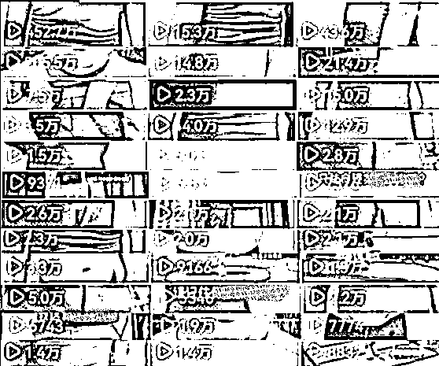

下面步入正题，讲下我的见解

## 一、 dou+的作用

### 1.1 提前过审或者不过审

     正常发布作品都是先机审，当播放量到达 1w 左右的节点时会触发人工审核，投 dou+后，人工会直接介入审核，让你提前进入人工审核阶段，从而提前知道自己作品的问题点和是否能过审进入更高的流量池。当然面临的结果就是审核过或不过。

### 1.2 放大样本数据

     说白了就是花钱买观众当评委，如果每次发作品都靠抖音给的那三五百边角料观众，大概率好作品也难跑出来，这时我们可以花钱投 dou+给那些我们认为会喜欢我们作品的观众来证明我们的实力，或从他们的反馈里优化我们的作品。

      尤其对于一些细分赛道的垂直领域，不投 dou+很难起来的，通过 dou+可以帮你快速测试作品的优劣，减少起号及试错的时间。

## 二、 投放技巧

### 2.1 投放方法

     对于新号，一般是不投粉丝量的，就投【账号经营】下的【点赞评论】就行，新号的目的是给账号打上创作者标签，我们需要大量的赞和评论来给系统喂数据，当系统吃够足够多的数据时就知道你的作品该推给什么样的人了，即标签打成功。

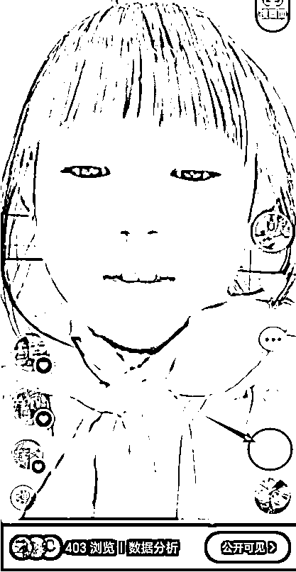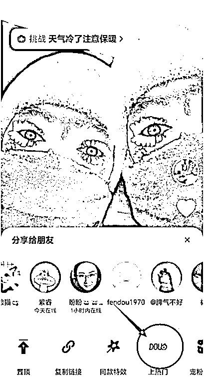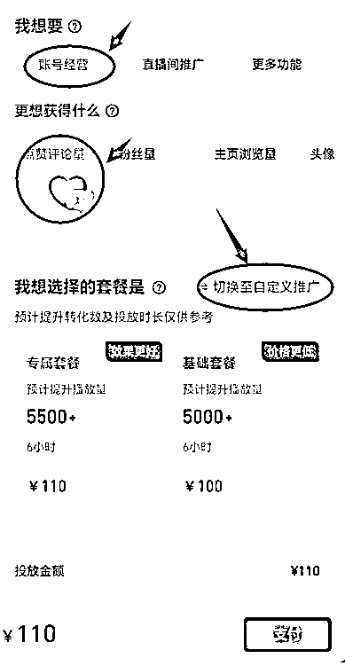

### 2.2.投放时长选择

      投放时长越长人群越精准，一般不会投 24 小时以上。

投放时间越短人群相对越泛，但短时间投放可以给作品快速做数据，达到羊群效应。通过点赞量的数量来吸引用户给你的视频做数据，刷抖音时候有没有遇到过这种疑问，明明很烂的视频怎么这么多点赞，从而不自觉的看看其主页，看看其评论或看到视频的最后一秒，试图找出其中的猫腻，不知不觉你已给对方做足了数据。

#### 2.3.对标达人

      新号起号建议只投【达人相似粉丝】，如果泛娱乐账号可以试试投【智能推荐】

      同样 100 元的投放金额，对标达人和智能推荐给的播放量是不一样的 对标达人给 2500 播放量 ，智能推荐是 5000 播放量

      当账号标签相对精准了可以投【智能推荐】，如果智能推荐人群有点跑歪了，我们也可以框选【自定义投放】下的年龄和性别。

      【地域】的话一般排除不包邮或其它特定区域就行

      【兴趣标签】一般选择不限

       注意，【自定义定向投放】可以理解成加个条件下的【智能推荐】

### 2.4 如何找对标达人

       2.4.1 对标达人就是你的同行，可以通过抖音热点宝去查看其粉丝画像和你的目标人群画像是否一致。

       2.4.2 通过其作品的评论、内容、选题、高频提问来二次确定其人群是否和你的目标人群一致.

**               他的作品是对谁说的？**

**想传达的讯息？**

**               想引导用户什么行为？**

       2.4.2 步骤：抖音通过关键词搜索用户,用热点宝来核对粉丝画像

找粉丝量小的（5-10w）近期（最近一个月）起来的账号效果更好

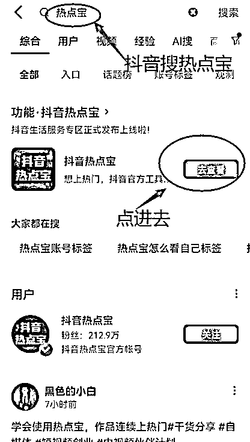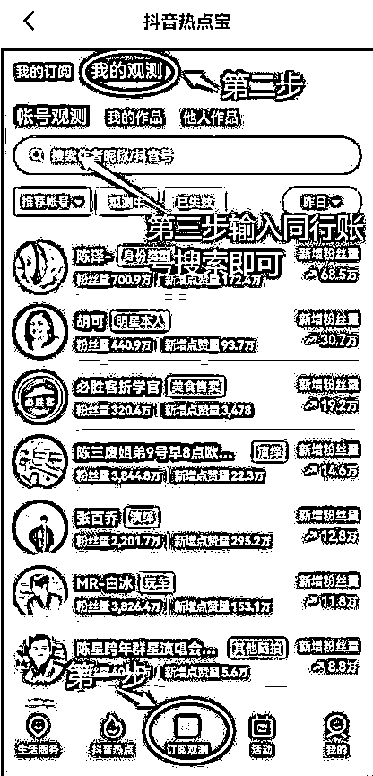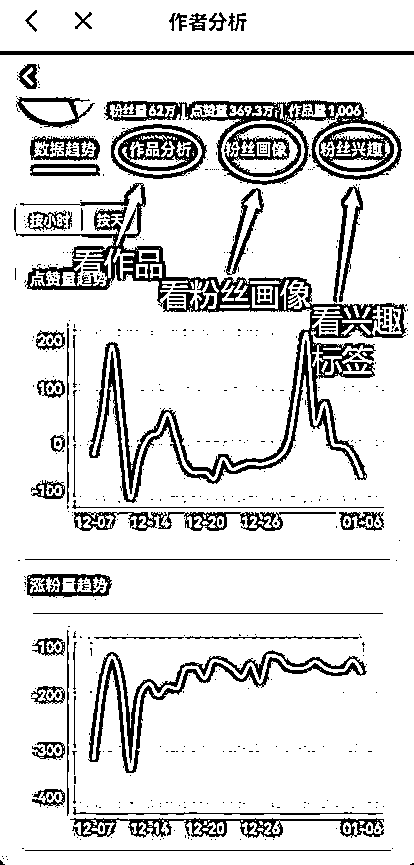

**注：投对标并不是投给对标的粉丝，只是画像相似的人群，我曾用小号投过我大号，开播进来的人还是不认识我。对标账号尽量选多些，同一作品同一时间投不同的对标，选出数据最好的对标达人或者达人组合，一直投他直到起号。**

### 2.5  30%测试原理

        建议新号一发作品即投 dou+100 元（现在不投钱，靠抖音给你的那些边角料流量，我觉得可以洗洗睡了），投点赞评论+自定义+达人相似，投放数据不好不用等数据跑完，一般跑到 30-50 元就可以停了。          

**        中途停止方法：权限设置—仅自己可见—成功后—所有人可见（秒操作即可）**

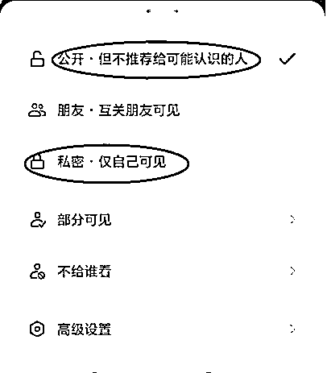

**优质作品不是靠运营和投放怼出来的，而是靠不断筛选出来，与其纠结拍的这么好为什么没有流量，不如投 100 元让自己死心。**

我这面好作品的一个判断数据：

**均播时长>50%**

**5s 完播>45%**

**点赞率>15%**

**2s 跳出<20%**

      当然不同行业标准不一样,这个你作品发的多了自然就有感觉了,举个例子,日常你发的作品 2 小时只有 1000 播放,今天发的突然 5000+或更高,那不追投还等啥?

**每个作品的第一个 100 的投放是为了计算测试目标成本,那什么情况下追加第 2 到 N 笔投放呢?**

**这个要根据你的目的去决定是否追投？**

**目的:**

**①单纯为了面子工程(就是想有几个高赞作品）**---------------可以投

**②上热门**--------------100 元系统给你分配 5000 播放,但你投了 100 元，作品多了 1w+或更高的播放,那 100 元当 200 元甚至 500 元花了，只要在你的承受范围，一个字投。

**③涨粉**-----------------投入产出比(roi)在你的目标投入内，可以投。比如你心里价位是 2 元涨个精准粉,投了 100 元涨了 50+个粉丝,那就可以继续追投。

     以下我了解的市面上价格的参考:

            泛娱乐粉：     0.2 元/个

            垂直粉：        3 元/个

            泛粉点赞 ：    0.1 元/个

            垂直粉赞：      0.3 元/个

## 三、实操

      实操以目的为导向分为两种情况：以①打破播放量为导向和②涨粉丝为导向。下面我将对不同阶段如何操作详细说明一下。

### 3.1 打破播放量为导向

我将讲下作品从 0 播放量一步步到 10w+播放量下我们对应应该做哪些操作

**3.1.1  0 播放：**

**对应操作：**发布作品 0 播放，说明账号没有过风控，需要模拟正常用户刷抖音、带你的抖音号遛弯、购物，3-5 天，能投抖加就说明号基本正常了。

**3.1.2   基础播放低**

**对应操作：**没有关系，最终我们是要通过 dou+测试找出优质作品去追投，所以基础播放低问题不大，我之前做过一个账号，新发作品也就几十或一百多播放量，最后也做起来了。

**3.1.3   500 播放量**

**对应操作：**500 左右属于基础播放量，我们要做的动作就是不断发作品、投 dou+、淘汰、筛选、优化我们的作品，最终目的通过小额投放撬动自然播放量。

**3.1.4   1000-2000 播放量**

**对应操作：**作品播放量达到一两千后，通过投 dou+去校正看播人群即你的流量池，人群正确，且数据较好，就可以追投测试，数据不好果断放弃，直接测下一条。

**3.1.5   1w-10w 播放量**

**对应操作：**作品 5w、10w 播放量后流量变慢可以通过投放 dou+来插队快速过审。

**3.1.6   10w+播放量**

**对应操作：**10w 播放量后再投意义不大了，除非目的是重启推流。何为重启推流？作品发布一周后或一个月后不怎么推流了，可以试着投 100 元重启下流量。如果观众反馈好还是可以激活一些长尾流量的。

**3.1.7   之前播放量很高最近掉下来了**

**对应操作：**由于目前抖音的铁粉系统，有可能作品没跑出粉丝圈，一般同时批量投放 3-5 条没破播的作品，找出数据最好的，单独投，单独拉爆播放量，互动值和粉丝基础。

### 3.2.涨粉为导向

#### 3.2.1    0-1000 粉

**对应操作：**①持续发作品。 ②每条投 dou+：利用 30%测试原理，找出数据优秀、有爆款潜质的内容，进行追投从而达到撬动自然流的作用，进而达到涨粉目的。

**3.2.2    1000+粉丝**

**对应操作：**①看粉丝画像，是否是目标人群画像。②看兴趣标签，2-5 级标签是不是我们想要的。③通过不断投流，校正我们的用户。

#### 3.2.3     2000-3000 粉

**对应操作：**粉丝达到 2000-3000，账号模型基本稳固了，不断更新筛选出相对优质的作品投【粉丝量】+【智能推荐】

#### 3.2.3     卡粉

何为卡粉？粉丝播放占比高，破不出粉丝池。

**对应操作：**换选题、换场景，蹭热点，通过 dou+的投放增加粉丝量为自己的账号注入新鲜血液。

## 四、常见问题:

**4.1  Dou+投不出去**

**可能原因：**

①账号处于风控期，去养号 3-5 天

②若出现不适宜加热提示的具体内容，根据提示去整改作品即可。

**4.2  dou+不消耗**

**可能原因：**

①新号基础数据小，冷启动慢，多建计划，看哪条能跑的出去。

②定向人群太窄，把人群条件限制放宽一些，比如只投达人放开自定义，或自定义只限制年龄性别不限制达人。

**4.3 哪里看作品数据**

**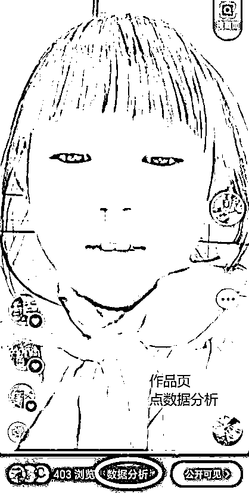**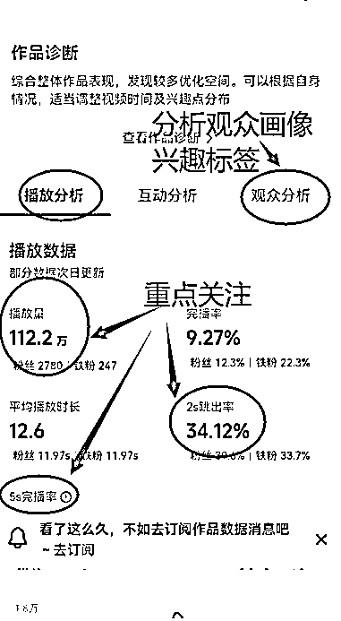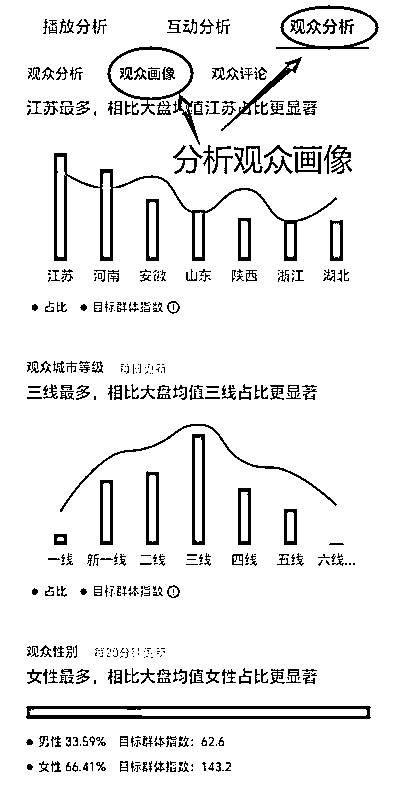

**4.4  优化作品方向**

    写了这么多，你们也不一定看完，看了又不做，做了又做错，错了也不一定改，哎~就这样吧~写完收工！

* * *

评论区：

杰杰杰杰杰， : 感谢大佬，解决燃煤之急！
钱哥老矣 : 有用就好，都是热乎的经验，也欢迎讨论
AI 小陈 : dou+投放
蜜蜂 : 谢谢分享，认真看完并关注您了。
钱哥老矣 : 一起加油
蜜蜂 : 一起加油[握手]
子鹏 : 文风有点像某个 dou+培训课的老师，是一个团队的不？

* * *