# 我把动漫周边卖给外国人，一个月赚 5W

> 原文：[`www.yuque.com/for_lazy/thfiu8/aovwu3341adg8spz`](https://www.yuque.com/for_lazy/thfiu8/aovwu3341adg8spz)

## (33 赞)我把动漫周边卖给外国人，一个月赚 5W

作者： 青川

日期：2024-01-11

要我说，做电商选品，就是得吃透一个人群。

具体而言，就是用圈子思维，针对某一个特定人群去做选品。比如，针对二次元 coser，我就会去找最新最热的动漫，考虑服装、道具、发饰、衍生周边等多个产品。

这样选品的弊端是用户群比较窄，但与此同时，也足够精准。

刚好，在国外这类二次元产品还比较空白，亚马逊又对这种小众蓝海类目比较友好，容易给流量。我就开始在亚马逊做起了动漫类目，采用的是更简单的自发货模式，花更多时间在选品上。这些店铺没有推广成本，辅以 seo 等手段，源源不断有自然流量进来。

一年下来，单店铺所有站点加起来销售额在 5w 美金左右，这样的店铺大概有三十个。

接下来，我会分享新人如何在亚马逊，用自发货+蓝海选品的模式，跑通从 0-1。当然，如何在受众基数不大的情况下，放大做增量，也会一并分享给大家。

最后还是要提醒下大家，做亚马逊一点也不简单，稍有不规范就会满盘皆输；如果你想在亚马逊一夜暴富，就不是很建议入局了。

大家好，我是青川，21 年从国内直播电商辞职后开始做亚马逊跨境电商，一直在做亚马逊自发货的项目，目前是铺货加精铺的模式，尝试过多个赛道，今天借一些案例来分享一下自发货如何通过类目细分找到蓝海产品并且打造爆款。

入局亚马逊的原因是和大多数人一样，打算出海寻找新的增长点，入局的时候没有测试成本利润，也没有关注相关风险，21 年 3 月开始注册店铺，找了一款铺货软件直接上架。

一开始和大多数新手一样，盲目铺货也不会推广导致并没有多少订单，但是经过学习研究和调整之后找到了一些利润相对还可以的蓝海赛道。

先看一些截图

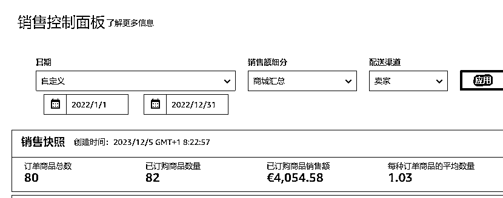

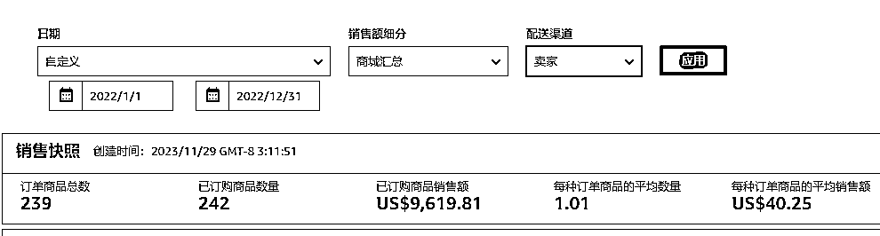

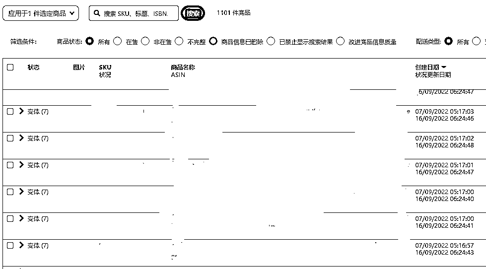

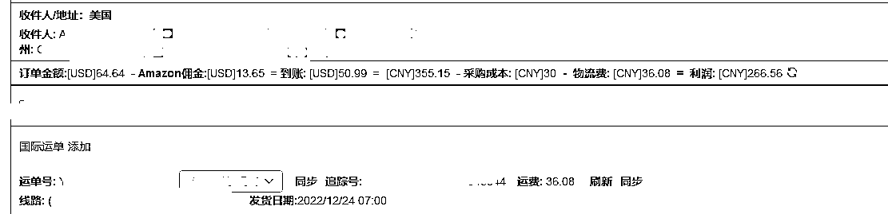

截图只是做个参考，全部店铺都是做自发货的，也就是 FBM 模式，截图是一个店铺的两个站点的销售额，每个站点的产品数量都差不多。

比起传统的铺货模式，产品种类比较单一，不论是管理还是订货都没有很复杂，更重要的是到今天为止，这些店铺没有推广成本（几乎不开广告没有站外推广只做部分 QA），纯自然流，平时运营方面花费的更多是选品的时间成本。

总体算下来单店铺所有站点加起来一年销售额也就 5w 美金左右（不同站点的销售情况不一样），这样的店铺大概有三十个的样子，利润可以参考单个订单的利润进行核算。

我深知比起大卖只是九牛一毛，在这里希望我的选品和思维方式可以给到大家一些启发。

到今天为止，做 FBA 好还是 FBM 好依然是很多人在探讨的问题，我觉得不管是哪种模式，存在即合理，赚到钱才是正确的，没有高低之分，有的只是大家对于平台、用户、产品、运营的不同思路。

对于新手卖家一开始来说，FBM 相对资金投入比较少，试错成本相对比较低，但是核心还是在于你是否有足够的用户思维，从用户需求角度出发去打造自己的产品和店铺，真正做到一定的壁垒。

另外，盲目铺货在任何平台都是属于早期为了填补足够的产品库默认的一种行为，在平台规则和类目足够完善的今天，这种又累又没有利润的模式早已不适用，正文主要分为以下几点：

1、FBM 新手之路需要解决的前端问题

2、怎么用圈子思维去选品

3、如何找到用户真正的深层需求

4、产品一些运营思路

5、关于 QA 和广告

6、退款以及售后问题

7、这个赛道的一些风险和挑战

8、新人建议

## 一、**FBM 新手之路需要解决的前端问题**

**（1）店铺注册**

店铺注册问题是最基础的，对于个人卖家来说，还是建议稳定自己注册店铺，关于注册店铺流程不管是圈里大佬分享还是一些论坛都有很基础的注册流程分享，也没有特别复杂，只是需要一定的时间去操作和等待。

对于亚马逊卖家来说，店铺合规性是最关键的，没有之一，不管你店铺资金有多少，只有到自己口袋的才是你自己的。

当然如果在这个行业深耕并且非常有经验的话，测试过程完全可以找号商来买店铺，因为这样更省时间和精力。

这里说一点，不管是美洲还是欧洲我觉得都是可以做，更多的还是需要对不同国家人群的需求需要极致细分，这一点会在后文选品中提到

**（2）产品上架问题**

我一般是用 erp+表格的形式上架产品，新手不知道的直接亚马逊后台找卖家大学，卖家大学里有非常细致全面的产品编辑以及产品上架流程，只要耐心学习多练习上架产品这一步只是非常基础的知识

**（3）产品采购**

一般是 1688、拼多多、淘宝这几个渠道，大部分 1688 厂家都支持一件代发，后端对接好国际物流的收货地址就可以

**（4）物流对接问题**

一般的产品配送，国内已经有很多的国际物流渠道，直接找客户经理要表格对接渠道就可以。

常见的像云途、燕文之类的时效都比较稳定，适合小包配送，不是很偏远的国外城市一般两周左右都可以到货，大件一开始风险比较大而且运费昂贵，建议后期有资金实力和经验再去操作。

## **二、用圈子思维来选品**

卖什么是电商人入行最关心的话题。做电商都离不开爆款思维，赛道选择也是一样的，即便是蓝海产品也要有爆款元素才能快速拿到结果并且出单，那么哪里去找爆款元素，我这里是根据圈子挖掘小众需求来选品。

先说圈子，比如生财的圈友大家都是拥有共同的目的，就是挖掘赚钱的赛道，那么生活中其实也有很多的圈子。

比如骑行、烘焙、写作、剧本杀、摄影等，那么选品也可以用圈子思维来细分，每个圈子里都有更细分的小群体；

比如摄影有拍人像的、有拍星空的，那么拍人像的用的相机设备和拍星空的肯定是有区别的。公路自行车和野外自行车的装备肯定也是有区别的。

正确筛选圈子的细分赛道，那么选品也可以用这个思维来做细分，所以在选品前建议先找圈子，这里我想表达的一个观点是：**不是去挖掘表面的需求，而是要挖掘用户的深层需求。**

这里举个例子：有许多的国外骑行爱好者，表面的需求是大家需要一辆适合自己的车，然后不断找到合适队伍以及线路去探索。

但其实深层次的需求是大家会针对不同的线路难度长短去采购不同的装备去赋能自己的骑行之路，这里深层的细分需求更值得去挖掘。

## 三、**如何找到真正的深层需求**

怎么找到真正的用户需求，我想以我的选品之路来为大家拆解详细的方法论。

（1）自身的职场经历对选品的思考

在盲目铺货失败后，我开始挖掘不同平台用户对于产品的需求，自己本身在创业之前是给头部直播间组货的运营，日常接触到的的产品都是不同类目各大品牌的标品。

但是标品就意味着竞争激烈内卷严重，对于出海的生意来说更是如此，能在 1688 看到的产品，在亚马逊迟早会进入内卷，然后有些人会说那就开模做产品。

但其实开模很多卖家最终的结局也是被模仿进入价格战然后开始内卷，所以还是要有自己的核心竞争力。

（2）结合自身兴趣爱好从买家需求出发选品

我日常比较喜欢看一些动漫，大学时期也有关注很多的电竞比赛，看到很多国内大厂游戏以及动漫出海的一些新闻，就在想国内二次元电竞圈赛道的年轻人越来越多，那么国外肯定也有这样的受众。

所以这个赛道作为切入点是可以尝试选择的，既然选择这个赛道，肯定不能凭借感觉来选品，肯定是要通过数据分析拿结果的，我们先分析一些已经有的产品案例。

下面用书包这个案例来帮助大家更好的理解这种选品模式，产品只做参考！

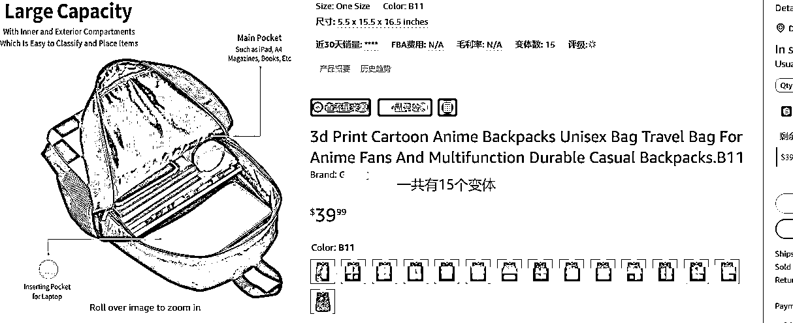

通过截图可以看到是一款书包，上面有印着不同的动漫元素图案，本质上是一个产品，只是需要找厂家去给到不同的图案印在书包上。

主要是针对喜欢这个动漫的群体，只要找足够的图案用 ps 先做好主图，可以创建更多的变体，那么这个链接针对的就是喜欢这部动漫的群体。

看到这里我们回到刚才的思路，挖掘深层需求，如果我们这里直接对标书包这个品去 1688 搜索采集上传，或者找这部动漫的其他书包上传，那还是回归本质，没有竞争力。

因为你能看到的买到的其他卖家也能采购到，而且卖的比你更便宜。所以我们只是通过产品挖掘出来这个赛道是可行的。

对于二次元群体来说一方面是对于这部动漫的喜爱，更深层的需求是什么，是角色代入感或者可以是提供情感价值，就好像每个人看金庸都有武侠梦一样，看动漫也是一样，或是温暖或是热血，深层的是精神需求，我们用数据分析再来看看动漫赛道的深层需求有哪些。

数据分析新手推荐卖家精灵，用关键词组合反查看搜索量，可以直观的体现用户需求，或者用 ABA 数据反查也可以，数据分析的基础是对于整个赛道有一定的理解，要明白产品的定位是基于哪些用户群体的。

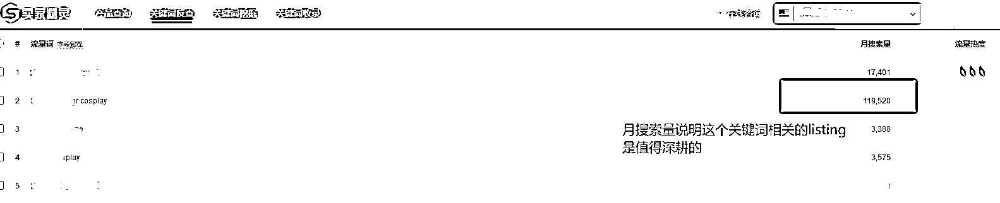

通过动漫名称人物名称等关键词组合反查，这里挖掘出来 cosplay 用品的搜索量是不低的，这个赛道值得拿来做一次，说明现实中 cos 成为二次元人物是深层精神需求。

这里我们单独的把这个需求做拆分，有的人想要穿衣服来扮演，有的人要用道具来扮演，所以这里需求可以拆分成为服装、道具、发饰、以及衍生周边。

通过以上的细分我们知道了这个赛道可以做很多细分，但是具体要选择哪个类目入手还是需要参考一些数据，我们先通过 BSR 去筛选类目，BSR 是一个很好的参考点。

因为 BSR 是 listing 基于销量的排名，而自然排名是 listing 基于关键词的排名，关键词组合可以帮助我们找到一些用户需求的产品列入我们的选品库。

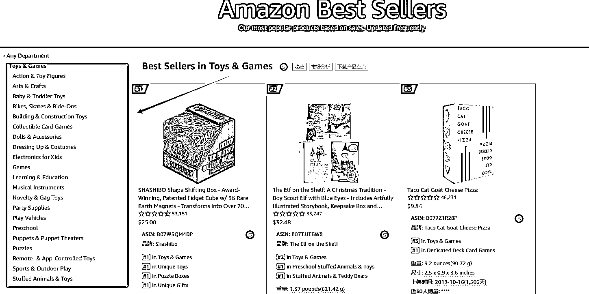

找好产品以后就要找一些爆款元素给产品做赋能，我们这时候我们还是用圈子思维来做筛选，比如可以通过国外的某些动漫排行网站分析本月本周的实时收视排行，取排名前几的一些动漫。

我这里一般从 MAL [`myanimelist.net/`](https://myanimelist.net) 做筛选，按照不同周期内的排名去选择合适的动漫去挖掘粉丝的需求，这个网站类似于国内的豆瓣，可以通过评分以及投票数来做筛选，可以快速的找到基数还不错的群体。

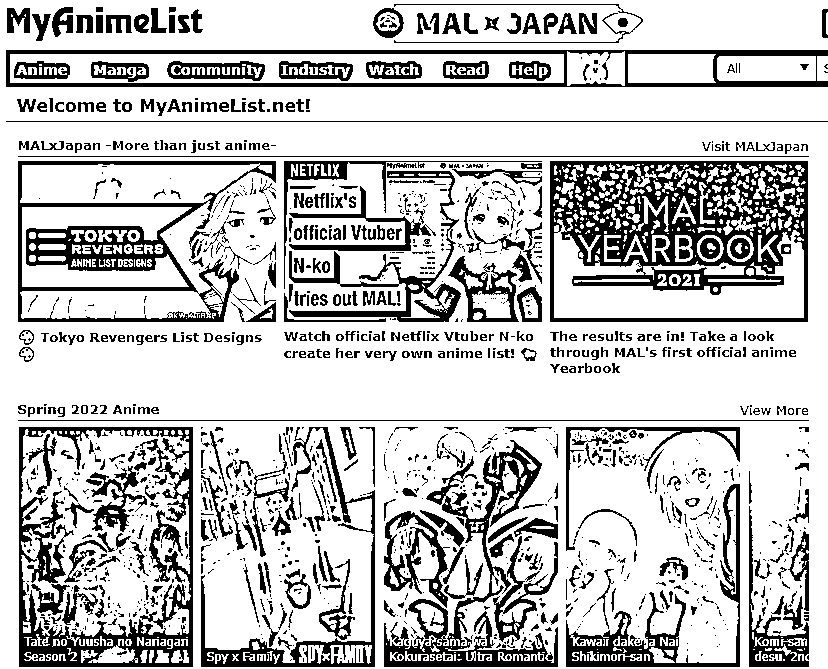

在这里一定要注意，动漫是知识产权侵权比较严重的，选择爆款元素一定要规避侵权风险。

## 四、产品的一些运营思路

有人说自发货尤其是铺货的卖家是不需要做运营的，盲目的以量取胜在初期是可以获得流量和订单的，但是长期还是要有自己的竞争壁垒。

尤其是对于蓝海产品来说，要想在市场中有竞争力，就需要在细分领域把产品做到极致，确保你的产品在细分圈子里一定是最能满足需求的，这样才能长久的拿到结果。

还是拿动漫赛道来举例，产品运营初步分为以下两点：

**（1）产品筛选**

蓝海赛道会有一个数量天花板的问题，就是受众群体基数本身就不大，那么如何放大做增量，就要做好产品筛选，也就是筛选出爆款元素和刚需产品做结合满足更多的用户需求。

在初步出单以后，可以把出单产品按照类目、一定周期内订单量、利润、发货时效做好表格做筛选，筛选是为了找到潜在的爆款元素。

因为在这个阶段基本是不开广告的，能够持续出单吸引自发货卖家购买的产品肯定是拥有爆款元素的，再把发货时效相对稳定、利润比较可观并且拥有爆款元素的产品筛选出来，这样就拥有初步的产品池。

关于爆款元素的理解，可以转化为爆款需求，比如包上的图案、相关人物的道具、人物的标志性物品，其实都是爆款元素，深层的来说还是这个小众群体现实生活中的精神需求。

**（2）用爆款元素和需求产品组合**

爆款元素和产品池都有了，就要拿来做组合，可以用产品相关的类目关键词去卖家精灵或者 ABA 数据库反查，看看哪些产品是适合附加爆款元素的。

举个例子，还是拿书包举例，在已出单的产品池或者说日常采购的时候会发现带有某些元素的书包特别好卖，那说明这个元素一定是很受欢迎的，比如这里我们用 anime bag 去卖家精灵或者数据库反查。

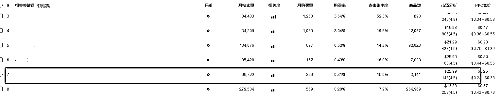

通过截图反查可以看到反查结果中这个关键词的商品数量并不多，但是搜索量可观，而且客单价相比其他也比较高。

然后再来搜索这类产品是否已经有卖家在赋能相关动漫的元素，发现搜索结果比较少，甚至第一页很多都是不相关的产品，说明是可以操作的。

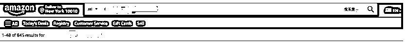

这时候我们就可以拿这个需求产品去和爆款元素结合做新的产品去上架，把以上步骤做成 SOP，就可以让员工主动开发出新的产品去上架，在不断的上新过程中，一方面避开了同类目同质化现象严重的局面，同样的也是匹配粉丝群体需求的蓝海产品。

下面是初始 MVP 测试拿到的结果，某款动漫相关产品的的自发货成本利润以及定制化产品的采购数量。

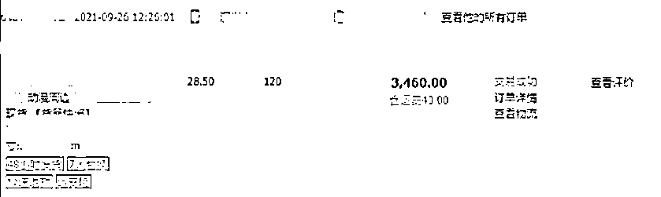

**（3）产品运营进阶**

不断的测款出效果之后，就要通过进一步的后台运营获取更多的流量，亚马逊产品的运营主要是产品编辑优化、广告、QA、以及站外推广，产品优化以及广告后文会提到。

对于这个赛道来说，更重要的是做 QA，为什么先单独拿这一点来说，是因为这个群体更希望先了解产品细节以及配套的定制化服务，比如动漫道具的一些还原细节是忠实的粉丝更想了解清楚的。

在已经稳定出单的阶段，可以通过业务报告针对各个变体的浏览量或者是已经出单的产品有节奏的做几个 QA，尽量围绕产品的材质、细节工艺、制作周期、发货时效等卖家关注的点去做。

**（4）产品编辑优化**

基于亚马逊网站的特点，产品主图是否亮眼，卖点是否突出是转化的关键，所以产品的编辑非常重要，尤其是对于动漫这个赛道来说，产品的材质，各个国家对于尺码的描述，以及使用场景这些细节都是需要前期打磨好的。

**1、首先是标题、五点以及描述**

这里一定要注意有些动漫名称本身就是侵权的，所以能不能做一定要提前查，一方面可以看是否有卖家在这个赛道，另一方面也要看相关的元素是否已经有版权。

一定要避免上传以后收到绩效风险，另外就是核心关键词，可以通过工具反查关键词组合，也可以看同行卖家的核心出单关键词。同时要从动漫粉丝的角度出发，利用一些需求点的长尾关键词去布局

**2、图片**

不管做什么赛道，主图一定要让你选择的受众感兴趣，比如书包上的图案要很有代表性，这里为了避免和大量同行竞争直接去 1688 拿图，还是建议尽量原创图片。

比如我的一个思路就是找一些国内二次元的插画师合作将二次创作的原画赋能到产品上，这样就是原创度极高的新品，同时也能规避一些知识产权的问题。在这个细分领域你的产品就是很独特的定制化产品，等到出单以后可以再找厂家一件定制

## 五、关于广告

对于这个赛道来说，初期产品数量比较多而且关键词比较精准，基本上都是靠自然流量出单的，后期可以适当按照关键词组合给到爆款产品一些广告活动，这里的目的还是为了提升排名，能够让更多的粉丝看到获取更多的流量。

关于广告的逻辑，首先我都是手动开的，因为 sku 比较多，所以还是要筛选出主推的产品给到一些广告活动。

这里还是用爆款元素的关键词加产品关键词做成组合去投放，有一定效果之后用精准匹配去吃流量，这里一定要控制预算，因为本身前期铺货的回款周期会比较长，所以还是要把握好利润和现金流。

通过精准匹配的方式让几个链接的自然排名提升以后，可以把广告的竞价调低，因为本身做的产品对于小众群体来说就是很精准的，有一定的排名吃自然流量对于提升利润是很有帮助的。

## 六、退款以及售后问题

如果有海外仓的话后期可以退到海外仓进行中转，如果没有的话自发货的缺点就是退货的运费昂贵，建议多和卖家沟通，给予一定的折扣来避免退货。

另外就是根据不同时期的物流价格表核算好自己的利润，保证自己的利润能够覆盖全年运费最高的时期，同时也能在售后范围内再给顾客发一次货。

## 七、这个赛道的一些风险和挑战

（1）发货时效

很多产品客户买来都是过节或者当做礼物的，节日属性很强，需要很强的发货时效，一些定制化产品国内的发货时效+海外时效太长会导致店铺绩效激增。

如果没有去优化好方案，初期会损失很多订单，所以合理优化 listing 并且和客户以及厂家做好及时沟通非常考验一个人的耐心和效率。

（2）知识产权

这个赛道知识产权的是重灾区，很多人只看到高利润（比如做盗版手办），看不到背后存在的合规性风险，有些人会说动漫游戏这种本身是有 ip 就是侵权的。

但是我想说的是合理规避风险非常重要，目前我没有一个店铺因为知识产权绩效而挂掉的，这需要去按照规则上架自己的产品并且规避。

（3）平台规则以及自身发展

跟卖、品牌注册、绩效审核、发货时效都是需要面对的问题，店铺合规性管理，绩效管理也是自发货的一大挑战之一，毕竟产品众多，铺货转成精铺才是长久之路。

（4）回款周期

前期的回款周期比较长，每天都需要先垫付现金去付给供应商和物流商，所以需要合理规划自己的现金流，盲目的订货和打价格战的话容易崩盘。

## 八、新人建议

（1）行业门槛

这个行业的门槛并没有大家看到的那么简单，需要一定的选品和电商思维，有些国内的产品运营思路完全是可以用在这个平台的，需要投入一些时间和精力去经营你的店铺。

另外这个行业深入了解才知道每一步的不规范都会导致全盘皆输。如果你是只想一夜暴富或者花一点时间去收获很高利润的话，不是很建议大家现在入局。

（2）我的一些建议

任何赛道都有值得深耕的地方，关键在于合理的分配自己的时间和精力，盲目的铺货早已不适合这个行业，合理的选择赛道拿到利润以及现金流才是关键的。

希望我的分享对你有一些启发。

* * *

评论区：

雨烟 : 不会侵权吗
从头学起的小白 : 谢谢分享!
青川 : 基本上不涉及到 ip 侵权关键词的，比较偏定制类的产品
一笑 : 感谢分享，有收获！🌹
箭人🇨🇳Tao : 三十多家店铺注册起来会不会遇到很多问题呢？还有维护都是一个人吗
青川 : 这块业务主要是小团队的形式的，维持在三到五个人，注册都是亲戚朋友的资料的，之前相对还是比较好注册的
英娜 : 问下毛利润有 50%吗 小团队 2 个人的话可以长期做吗
青川 : 有的，这个赛道还是以选品和规避侵权为主，2 个人建议可以小规模测试数据

* * *