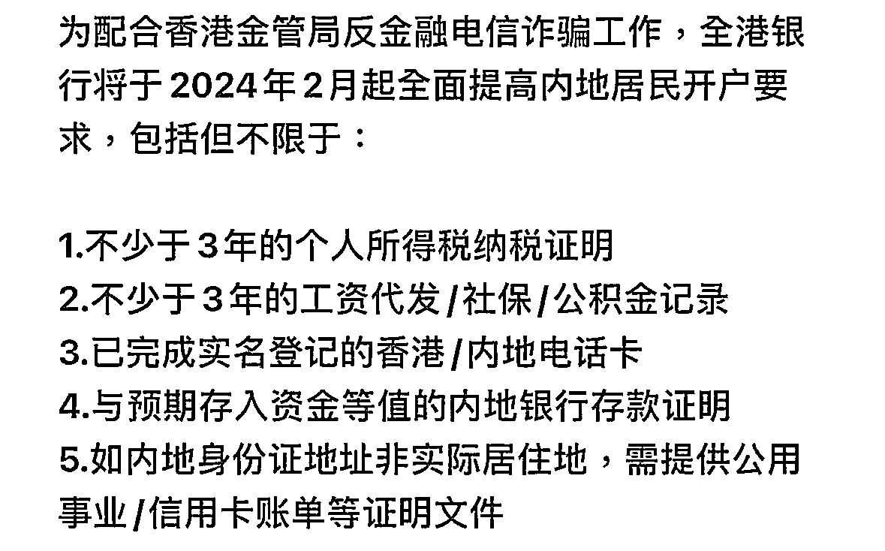
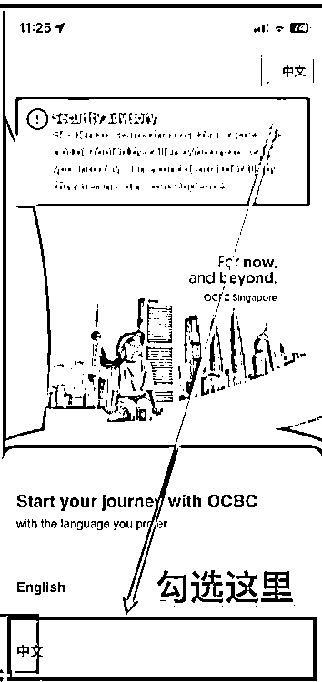
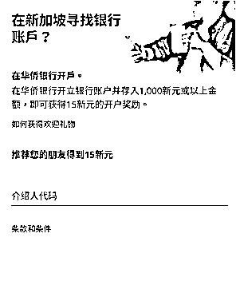
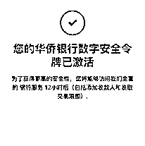

# 如何注册一个正规海外银行账户并获得实体借记卡

> 原文：[`www.yuque.com/for_lazy/thfiu8/lux4x9px7txd79z3`](https://www.yuque.com/for_lazy/thfiu8/lux4x9px7txd79z3)

## (20 赞)如何注册一个正规海外银行账户并获得实体借记卡

作者： 麻木尔杜斯戈里亚

日期：2024-01-15

今天在微信群里看到了这么一则消息，真假不明，但估计会引起一些朋友的 fomo。如果这则消息为真，那现在临时突击过去办港卡，除了 ZA、永隆和信银，其他的银行不一定能来得及了。

去年因为一些需要，也动过办港卡的念头，不过调研了一圈，（因为不想出门）最后选择办了新加坡卡。过程很简单，下账户和下卡也非常快，关键是不用出门跑流程。今天看到这条消息之后，打开银行 App 确认了一下，去年的实操流程还没失效，干脆分享出来，给打算办海外银行账户和实体借记卡的圈友多一条备选。

**整个流程大致是：**

一、准备工作

二、申请"Statement Savings Account"&"Global Savings Account"

三、激活"Statement Savings Account"

四、申请"360 Account"与实体借记卡

五、接收并激活实体借记卡、重设卡密码

六、激活银联支付

**一、准备工作**

因为这个方法是通过新加坡华侨银行（新加坡第二大银行）的数字银行 App 完成的。所以需要一部带 NFC 功能、且具备谷歌框架的安卓手机（苹果也可以，但是有朋友反应某些型号的苹果 NFC 识别护照容易失败，而**整个流程要是没有一次性通过的话，有概率无法重新回到正常流程里**，所以建议还是用安卓）。

我是选用的小米 10。

*注：当时调研下来内置谷歌服务框架的小米手机型号：小米 MIX4、小米 MIX FOLD、小米 11 Pro、小米 11 Ultra、小米 11、小米 10 至尊纪念版、小米 10 Pro、小米 10、小米 10s、小米 9 Pro、小米 9、小米 MIX 3、小米 MIX 2s。*

1.下载安装/打开 Google Play

1）打开“设置” → 搜索框输入“谷歌” → 选择“谷歌基础服务” → 打开开关；

2）打开“小米应用商店” → 搜索框输入“play 商店” → 点击“Google Play 商店” → 点击“升级”；

3）返回桌面，查看是否出现名为“Play 商店”的 App。

2.使用魔法（这个不能教，需自行解决）

3.检查手机 NFC 功能是否打开

有两种方法：

1）从手机顶部下拉，在快捷设置中找到 NFC 图标，看它是否亮起；

2）或者，打开手机的设置，找到「更多连接方式」，点击进入，看看 NFC 开关是否打开。

4.下载数字银行 App

下载链接：[`play.google.com/store/apps/details?id=com.ocbc.mobile`](https://play.google.com/store/apps/details?id=com.ocbc.mobile)

**二、申请"Statement Savings Account"&"Global Savings Account"**

1.打开下载好的 App，一直点击“next”，直到下面这个选语言的页面，点击右上角语言标，将语言切换为中文

  

*注：如果找不到中文界面，退出重进*

*注 2：过程中 APP 会要各种权限，比如位置等，全部同意*

2.点击“注册成为新客户”按钮

3.点击“持电子护照的外国人”

4.点击“开始申请”

*注：点击允许访问相机权限*

*注 2：点击“启用 NFC”（如果之前已经启用过，可能不会弹这条）*

5.介绍人代码页面

  

这个页面应该是可以跳过的，如果填写的话，“介绍人”和“使用人”会各得 15 新币的奖励（换算成人民币大概是 80 多元），金额上正好跟跨境汇款的磨损差不多（后续激活账户需要转入 1000 新币存款，电报费+中转行费等也是 80 多元）。

*注：这个介绍人代码，为了避免广告嫌疑就不放出来了，页面如果不能跳过的话，可以自行去搜索引擎搜索“新加坡华侨银行介绍人代码”，一搜一大把。当然，如果一定要跟我双赢也欢迎私信我要代码哈哈。*

6.选择“86”区号，输入自己的手机号接收验证码，邮箱填一个海外邮箱即可（比如 Gmail）

7.扫描护照人像页条形码

8.扫描护照 NFC（这个看手机的 NFC 模块位置，比如我用的小米 10 就是用手机上半部分放在护照的下半部分来扫）

9.扫身份证正面

10.人脸识别（这步有两个注意点，一是每个动作需要在 30 秒内完成，二是保持环境明亮）

11.点击“提供我的详细信息”，进入信息核对页面

**注意：这步如果发现护照扫出来的生日错位，先不要管，往下走流程，之后再找客服处理**

12.修改邮寄地址，在地址栏留下自己的手机号码

**注意：这步一定要做，因为后续的借记卡与密码函等会分别以挂号信和平信的形式寄到，而且地址会经历一轮机翻，不在地址栏留下手机号的话，邮递员是定位不到咱们的。**

13.点击“我的详细信息正确”

14.填写就业信息

**这步有几个注意点，我列在下方：**

1）工作类型要选“受雇”，选“自雇”的话会触发审查

2）年收入最好写高些，太低会被驳回申请

3）开设账户的目的选“储蓄”，选“投资”的话可能会被驳回申请

15.税务身份照实写，税务识别号就是自己的身份证号

16.是否是政治公众人物这栏照实选（这个大家都懂）

17.确认一遍自己的资料，阅读条款，然后在最后选择：电子邮件和其他电子渠道+电话号码短信，**千万不要选邮政信件**

18.选“本人确认懂英文......”，点击提交，然后开户申请就完成了，没有触发审查的话会秒批（当场收到短信）。

19.设置账号和密码（**这两个要记住，后续登录 App 需要用到**）

20.点击启用“onetoken”

  

*注：等几分钟，等到这个界面出现，就算启用完成了。*

21.点击“开始”，登录账户（访问代码就是之前设置的账号名，PIN 码就是之前设置的登录密码）

22.登录后，选择左上角“三”，进入语言设置界面，点击右上角“EN”，将界面语言改成简体中文

**三、激活"Statement Savings Account"**

账户申请成功之后，需要**同名账户**转账 1000 新币进去才能激活账户。假设华侨是咱们第一个海外银行账户，那成本最低的激活路径就是用工行跨境转账过去。跨境转账就不详细写步骤了，跟着银行 App 提示一步步操作就行。

*注：华侨银行的汇款信息就在 App 的首页上。*

**四、申请"360 Account"与实体借记卡**

申请"360 Account"有两个目的，一是获取它附带的实体借记卡，二是降低账户的维持成本。因为"Statement Savings Account (STS 账户)"是针对非新加坡本地居民的储蓄账户，一年免费期过后（如果连续 6 个月账户金额为 0，则自动关闭账户），最低存款要求为 2 万新币，达不成的话每月会收 10 新币的管理费。

而 360 账户是面向新加坡本地居民的，一年免费期过后，存款要求为 3000 新币，达不成的话每月仅收 2 新币管理费。更重要的是，在特定渠道申请，非新加坡本地居民也能拿到账户附带的实体借记卡。

所以我们要做的就是，申请 STS 账户 → 激活 STS 账户 → 申请 360 账户 → 将 STS 账户的余额转入 360 账户 → STS 账户 6 个月 0 余额自动关闭 → 仅保留低成本且带卡的 360 账户。

*注：为什么不直接开 360 账户？因为非新加坡本地居民通过数字银行 App 只能先开 STS 账户。*

**接下来是实际申请步骤：**

1.登录 App，在首页点击左上角的“三”

**注意：一定要登 App 申请，不要用网页申请，网页申请的有账户无卡。**

2.点击“申请” → “账户” → “360 账户” → “立即申请”

3.填写基本信息

**注意：这步里“是否自雇人士”一定要否认**

4.填写税号

5.填写姓名（拼音全部大写，姓和名之间有个英文的空格）

6.确认申请资料，选择“电子邮件和其他电子渠道+电话号码短信”，点击“立即开设账户”

7.耐心等待借记卡创建（大概 3 分钟）

**注意：创建完成后会弹一个到期日和 CVV 的界面，截屏保留下来，后面这个界面不会再出现了**

**五、接收并激活实体借记卡、重设卡密码**

**1.接收实体卡**

360 账户申请成功后，一定要第一时间去数字银行 App 的安全信箱里问借记卡的追踪号。因为他们的回复速度极慢，第一时间去问，等到对面回复的时候，卡已经差不多快到了，这时追踪正好。如果问晚了，附近片区的邮递员又不是很负责的话，卡就会被退回。退回后再想拿卡，就会很麻烦。

这么问就行：May I ask if my debit card has been sent out and what is the email tracking number

拿到追踪号之后，去这两个网站追踪卡片物流

1）新加坡境内：Singpost 官网

2）国内：中国邮政官网

大概率已经在邮政手上了，直接打邮政客服，说有个新加坡的挂号信过来，请当地邮政拿到直接联系你。

*注：这样可以确保第一波就拿到卡，避免卡片退回。*

**2.激活实体卡**

1）登录 App，在首页点击左上角的“三”

2）点击“银行卡服务” → “激活信用卡/借记卡”

3）填写实体卡上的有效期

**3.重设卡密码**

其实华侨是会寄出密码函的，但因为它的密码函是平信形式寄出的，所以几乎是收不到的。所以我们激活实体借记卡后，需要立即重设一下卡密码，来使那张不知道寄到哪的密码函失效。

重设的流程很简单：

1）登录 App，在首页点击左上角的“三”

2）点击“银行卡服务” → “重设银行卡密码”

**六、激活银联支付**

1.登录 App，在首页点击左上角的“三”

2.点击“个人资料与设置” → “管理 Unionpay”

3.打开“激活银联支付功能”

**写在最后**

因为是去年的实操流程，可能某些步骤的细节已经有所变化，大家参考着来，有问题可以评论区交流哈。

* * *

评论区：

大壮 : 这个卡入金买港股嘛
麻木尔杜斯戈里亚 : 可以买港美股
白菜 : 你好这个可以再办新加坡的信用卡吗
麻木尔杜斯戈里亚 : 信用卡不太清楚

* * *