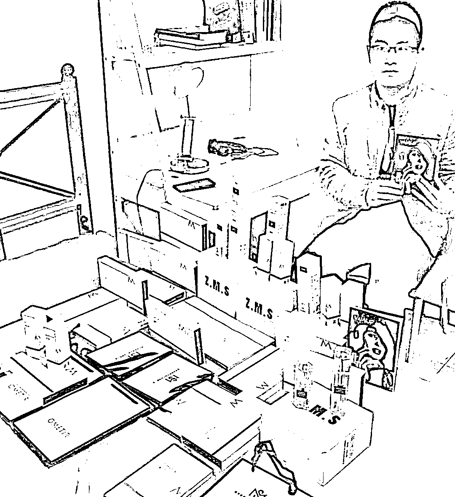

# 人生至关重要的第一个 100 万，我是怎么赚到的？！

> 原文：[`www.yuque.com/for_lazy/thfiu8/cak9b0wxu8atqqvq`](https://www.yuque.com/for_lazy/thfiu8/cak9b0wxu8atqqvq)

## (154 赞)人生至关重要的第一个 100 万，我是怎么赚到的？！

作者： 书豪

日期：2024-01-19

大家好，我是在杭州的龙珠圈友书豪，小红书店铺和直播航海教练，特别感谢生财有术让我成功的进入了电商圈，开启了自己全新的创业路程。

今天跟大家聊聊我是如何赚到自己人生的第一个 100 万，创业故事就没有一帆风顺的。

我是在 2020 年的 4 月加入生财有术的老圈友，也是在 2020 年赚到的人生的第一个 100 万元。

今天的内容我分享一些自己很狼狈的故事，有多狼狈呢？

我想每个走上创业之路的人，大差不差的都是因为被逼的，都是因为只有创业这一条路可走。

在这篇帖子里，我会将自己的初次创业的第一年，以及在创业之前在职场上班过渡到创业这条路的过渡经历。

力争对圈友们毫无保留的分享，希望能对正在创业以及打算创业的圈友提供一些价值。

目录：

1.  为什么走上创业这条路？

2.  在职场如何过渡到创业这条路？

3.  如何积累到人生的第一个 100 万？

4.  如何往第一个 1000 万冲刺！？

## **一、为什么走上创业这条路？**

为什么我会走上创业这条路呢？坦白说，是因为我失业太多次了 ！

我失业过 5 次以上，失业的经历让我内心痛苦，无助又迷茫。我想，经历过失业的人能够体会，特别是失业过多次的人。这不仅仅是现金流断裂的痛苦，更是精神上的挫败。

为什么我会失业那么多次呢？

我是**2016 年**大学毕业的，毕业后我在上海闵行区一家世界五百强公司工作，拿着月薪四五千的工资，我感到很难受很失望，上海这个城市很繁华，但是我却过的如此底层，想买双 nike 的鞋子都要犹豫很久。从大学毕业离开校门时候来到上海的眼含星光，满眼都是对未来的憧憬，到进入社会后工作现实处境的低落，我是满心的焦急。

在上海，我知道做大数据分析做 IT 工资高，然后果断转型自学编程，但是我大学学的是法学专业，自学编程对我来说压力也很大，难度也很大，但是想迫切的在上海赚到钱，拉高在职场上班的收入积累现金，我没有犹豫，果断从 2016 年的 11 月开始一边上班一边自学编程。

2017 年这一年，我的薪资慢慢从月收入四五千冲到了月薪 7000 到 8000，在 2018 年，我的收入冲到了月收入 1.6 万，2019 年一路冲到了月收入 1.8 万！

这期间，失业了五次以上，为什么呢？因为我自学编程虽然勤奋，但是我的编程技术确不扎实，写 SQL 我不熟练，写 Python 我也不熟练，写 R 语言我也不熟练。虽然我工作态度上愿意加班加点，什么杂活都愿意干，但是奈何我写代码的工作效率低下，一直处于不断失业的状态。

失业对于在上班时候的我来说，是一件压力很大的事情，因为失业的那一个月现金流断裂，没有收入。而且在上班的时候，试用期没有转正，这让我也觉得非常丢人，同事看着你因为试用期不转正而离职，我觉得自己好丢脸，面子上真难看。

2016 年到 2019 年的这三年半，每天我都觉得很艰难，因为觉得自己连一份工作都保不住。

2016 年到 2019 年的这三年半，在一份工作都无法保住的情况下，爱情更离我遥远，我一直记得 2016 年在上海时候，追过一个女生，那个女生告诉我，：书豪，对于爱情和婚姻我都很现实的，而且我比你大两岁，你目前房车都不具备，事业更是不牢固。

2016 年~2019 年的这三年半的时间，没有稳固的现金流，攒钱买房速度缓慢，每天忧心忡忡，失业多次的经历在我脑海里种下了一颗上班收入不稳固，需要一份副业来支撑你两条路走路。

## 二 .  在职场如何过渡到创业这条路？

2017 年，因为上班收入很少，我只能晚上和周末去做副业，争取把在上海每个月的房租和吃饭钱赚出来，工资就攒下来。

我一边上班，一边做了很多副业尝试，2017 年主动找网站老板合作，录制数据分析的课程，我出课程内容，他出流量。小赚过几万块钱，这个网站是一个类似于网易云课堂中国慕课网的一个大数据分析相关的垂类学习在线教育网站。

因为这个在线教育网站老板的微信群，认识了一帮出过在线教育视频课程和写过自己编程类目书籍的作者群，我在这个微信群认识了一帮写过自己书籍的人，大家原来能够通过写书还能赚一些钱，而且好多个大学毕业几年就出版自己书籍的朋友，我决定，自己也要写一本书，去赚一点书稿。

**2018 年我又主动联系机械工业出版社的主编，毛遂自荐，最后又写了一本书叫做《R 数据科学实战：工具详解与案例分析》，这本书在京东上现在都还要卖的，卖了 6000 本左右，也小赚过几万块钱。**

2017 年到 2019 年，一边上班，我还一边做过微商卖护肤品，屯了一批乳液精华面霜，卖出去了 70%的货，还有 30%的货没有卖掉，做微商卖护肤品没赚也没亏钱。

2018 年因为做微商的缘故，在 2018 年的国庆节，我在福建旅游的时候，我注册了公众号，自那一刻起，我的命运开始慢慢发生了改变。你们中有些人可能知道，我早期是通过公众号积累的第一桶金，公众号这个业务，给我贡献过超过 300 万左右的收入。

但是你们不知道的是在 2018 年 10 月一直到 2019 年的 4 月，长达 7 个月的时间，公众号业务我没赚到过一分钱。我只是傻傻的在写文章。

后面接触了生财编程类目的公众号圈子，才开始慢慢一路起飞，在 2019 年上班的情况下，靠公众号都赚到过 10 万+。我从 2019 年 5 月公众号开始有盈利，2019 年的 5 月，我只有一个公众号，一个月能赚 1000 多块钱，这打开了我新世界的大门，我傻傻的坚持做公众号这条路没有错，了解行业圈子了解到公众号具体玩法变现方式更没有错。

一直到 2019 年的 12 月底，我公众号 1 个月能赚 1 万+，是在职场晚上 9 点左右到家后，每天晚上忙碌 4 个小时做到的收入。

**我从职场过渡到创业，不是我主动的。**

不怕丢人，也不怕说出来大家笑话，我是因为一边上班，一边做公众号，上班的时候做公众号，在上班的时间刚好被我的上级领导发现了，我的上级领导发现我上班在摸鱼在做自己的副业。我的上级领导呢在发现我上班摸鱼，第二天就让我离开了。

这是我又一次失业，2019 年的年底，第五次失业了。

2020 年的 1 月，快过年了，我仍然没有找到工作。2020 年的 1 月，发生了 YQ，我知道，我估计在 2020 年的 2 月 3 月都无法找工作了。

就这样，我从职场失业再加上 2020 年的第一季度不好找工作，YQ 期间，大部分公司都不招人。

就这样，2020 年的上半年，我发现自己没有退路了，只能创业了。

## 三、如何积累到人生的第一个 100 万？

我算是从 2020 年 1 月出来被动创业，因为失业，并且失业期间 YQ，根本找不到工作。我就只能多做几个公众号，把公众号业务做大！

我没有退路！也只有把公众号业务做大！

很幸运，2020 年我靠公众号业务赚到了 80 万。加上我之前上班和副业积累的 30 万，人生的第一个 100 万达到了！

我进入生财的引路人是子木，我和子木是做编程类目公众号时候认识的，子木很清楚的知道，我当时的公众号矩阵比如程序员大佬、程序员涨点薪吧、JAVA 大数据架构师、JAVA 面试仓库、不装逼的程序员等 15 个编程公众号矩阵。2022 年编程公众号已经彻底没有行情，我就把手里的公众号都卖了。仅仅依靠这 15 个公众号我完成了 300 万（到手利润）本金的积累。当然，生财上我认识几个靠公众号赚到千万以上的大佬，我在他们面前是不算什么的。

2019 年~2022 年编程公众号的这波历史行情，我当时的变现方法是靠接广告，而且仅仅是接广告，我最大的客户叫开课吧，开课吧隶属于慧科集团，生财上应该有不少大佬知道这个公司，当然，开课吧在 2022 年接近破产，已经倒闭了。开课吧这个客户贡献了我 70%的收入。拉勾教育、图灵教育、马士兵教育、极客时间、中国慕课网、网易云课堂等客户贡献了我 30%的收入。

2020 年是我第一年的创业之路，当时是有很多的卡点和难关的，比如怎么从一个公众号做到 15 个公众号，如何搞定流量，如何接朋友圈广告，我当时选择的办法是免费流量靠公众号互推。但是我裂变到第 15 个公众号是靠了一招创新，就是我是在编程公众号市场，第一个开始玩收购 5 万粉丝以下公众号的开拓者，我当时觉得想快速做大，需要不断买公众号去接公众号，利用市场行情好的时候疯狂收购公众号，收购公众号大概花了 80 多万，2020 年我第一年创业的压力不仅仅在于收购公众号，还要回本，还要赚钱。

搞定多个公众号的涨粉动作，都是有很多卡点的。这其中的艰辛和焦虑只有走过来的人才能体会。2022 年 3 月，公众号已经没有收入了，公众号的大势已去，我就开始转型转电商了

1.  不怕大家笑话，2020 年出来创业时，连租办公室都不会，第一个办公室

1.  初次出来创业，我连 BOSS 直聘作为招聘工具都不知道。

对于咱们普通人来说，我想，我们只有一条路，想逆袭，大概率需要抓住互联网行业的某个垂直赛道的红利。

1.  对于普通人来说，不适合直接创业，需要在上班的时候慢慢把副业做起来，当副业现金流超过主业或者持平再出来创业会比较稳妥。

1.  对于普通人来说，能在很年轻的时候赚到第一个 100 万大概率是需要抓住大的流量红利的，比如公众号、淘宝、抖音快手、小红书和视频号等大平台的流量红利！面对流量红利，最重要的是入场，先干再说。**在岸上，你永远学不会游泳。**

1.  **如果从来没有完整的经历过从流量获取到流量变现，流量红利来了也跟你没什么关系。**

1.  对于大多数人来说，30 岁之前赚到第一个 100 万，一定不是工作的第一天第一年完成的，前期都会经历第一个 10 万，第一个 30 万，第一个 50 万，然后才是慢慢积累到第一个 100 万。上班积累的资金也非常必要且非常宝贵！

1.  30 岁之前，**积累第一个 100 万的目标是一定要有的，但实现是慢慢实现的**，跟跑马拉松一样，终点就在那，但是要以一小段距离为目标，跑完那段距离，再跑下一段，一直坚持就会抵达终点，比如先积累第一个 10 万，第一个 30 万，当你积累到第一个 30 万的时候，就会有积少成多的信心。

2020 年是我创业的第一年，2020 年那一年我很煎熬，经常通宵达旦的看生财有术的精华帖，生财的精华帖，我是有认真读过 500 篇+精华的。我看到绝大多数赚到钱拿到结果的创业者，他们都是有强烈的**赚钱欲望，对商业机会很敏锐，并且最重要，我发现每个创业赚到钱的，都是拼执行力。**

**赚钱的欲望是我自己最原始的动力，我自己最原始的动力就是多赚钱，在大城市买房，在大城市找女朋友，然后在大城市娶妻生子，这是我最大最真实的动力，我对未来的一切美好的期望都需要金钱作为基础！**

但是我自己是一个商业**敏锐度不够的人，我的方法就是多在生财有术上看精华帖，我发现绝多数赚到钱的，都是会玩矩阵，不论是公众号矩阵还是电商店群矩阵！**

创业的这四年，随着接触的人越来越多，我才发现每个人的目标，每个人的理想都不一样，不是所有人都有强烈的赚钱欲望。更不是所有人都有执行力。

赚到第一个 100 万，不需要多牛逼的能力，一切都是逼自己疯狂去执行！

我认为赚到第一个 100 万，只需要多了解商业机会，多去挖掘商业项目，多在生财发现商业项目，然后拼执行力就够了！

## 四 . 如何往第一个 1000 万冲刺！？

我目前正在往第一个 1000 万的路上冲刺，目前已经完成了 50%的积累，希望自己能在 30 岁完成这个目标

在真实的商业世界中，我身边也有从第一个 100 万然后再冲刺到第一个 1000 万的朋友，他们基本都是在生财有术上认识的朋友。

这会激发起我自己的斗志，在生财这个圈子里，你不敢骄傲自满，能看见高山后面还有高山。

有人说，赚到第一个 100 万后，后面第二个 100 万第三个 100 万会更轻松，我觉得不一定。主要还是看你自己做的项目背后是不是有大趋势，现在的互联网行业的大环境，每个项目的红利期都是在急剧的缩短。所以每个夜深人静的时候，我总会感叹钱难赚，屎难吃!

第一个公众号项目给我贡献了 300 万+的到手收入。但是公众号已经赚不到钱了。没办法，万般无奈，死死抱住公众号这条路彻底行不通。

2022 年我又去尝试做了个抖音个护家清短视频带货赛道，但是做过电商的人都知道，抖音是一个极度竞争激烈的市场，你打品的短视频素材，投放数据，打品赛道实时销量榜单这些数据其实在第三方数据平台都是非常非常透明的。就算在抖音上面一个爆品能维持 1 个月，但是下个月你还需要用原创度高的素材去卷，波动性极大。我非常非常难受。抖音赛道对于内容能力的要求是很高的。抖音赛道对于我自己的能力是不适合的。

2022 年 10 月小红书店铺的红利出现，但是我对自己的电商能力不自信，一直没有动手，当时对小红书平台也没有认知，就迟迟没有动手。一直拖到 2023 年的 2 月才开始动手。现在回头想想，肠子都悔青了。这是自己认知和决心勇气不够踩的坑。但是到了 2023 年，从一个小红书店铺，我一直开到 30 个小红书店铺，一路咬牙坚持了过来，从百货赛道的笔记打法到小红书无人直播打法，把能挖掘利润的切入方式都尝试了一遍。

心里很急切的撬开财富的一道又一道大门，但没有人能代替我们去挖掘机会，去研究信息差去执行，我们必须自己对自己狠！有执行力且敢于尝试敢于坚持！2023 年的 11 月，我又开始测试快手平台的短视频引流直播这个赛道的机会。疯狂的测品，从小家电、服饰单品、日用百货，美妆各个赛道去进行切入测品，有测品亏钱无处诉说痛苦的无奈，又有爆单产生利润想要扩张通投拉满的希望！

我在生财看到的每个拿到 1000 万以上大结果的大佬，他们大部分都是通过两三个项目的积累才拿到 1000 万以上的结果，比如淘宝+视频号+抖音等多个平台红利组合拳才拿到大结果。而同时他们身上的执行力真是又快又狠，这些拿到 1000 万以上结果的朋友也在倒逼着我自己在执行力层面必须做到**快与狠。**

2022 年是我二次创业的开始，2022 年我的公司倒闭过一次，也让我认知到创业永远就没有稳定的阶段，如果有那也只是我们的臆想。

没有退路，也没有谁是我们的救世主。抱着战战兢兢的心态去执行好每一件小事，从前觉得电商是自己作为一个新手不可能学会的，执行下去发现也没有那么难，犹如付费投流从前我觉得很难，只不过是自己心中的恐惧。未知的恐惧是心中的贼，破了也就破了。

我发现我心态上害怕恐惧犹豫的时候，往往是我进步最慢成长停滞的时间。

商业世界，自身的能力都是被逼出来的。

**所以我真的十分强烈建议大家，发现一个商机，立马投身去做，不要怕没做出成绩来觉得丢人或者浪费了时间，大部分的互联网项目，都是轻资产项目，做失败了也亏不了多少钱，而时间成本才是最昂贵的代价！**

以上就是我今天关于如何赚到我人生的第一个 100 万的分享，以及往第一个 1000 万路上冲刺的一点思考。

希望对大家有所帮助有所启发。

也希望所有圈友在生财内都能找到适合自己的方法和技巧，拿到结果，遇到问题，就解决问题，不要害怕失败！

(我目前主要在做小红书、快手这两个平台，短视频直播内容电商是目前我在创业的方向。希望这次的分享能够对大家有帮助，如果对上述分享有疑问的，也欢迎跟大家多多交流，探讨，定当知无不言，我的微信：wsh137552775)

* * *

评论区：

一群 : 给书豪点赞，见过本人，又亲和又非常多干货！
广州摄影师林海盐 : 好厉害
安壹 : 书豪哥框框输出，内容、执行力都是杠杠滴
清一 : 书豪是实干家没错了
安宇轩~ : 给书豪打 call，线下见过面，很稳的一名创业者。
益雪 : 看眼神 就知道 坚毅是杀出来的
Dancy : 厉害[强]
谦墨 : 豪哥牛逼!

* * *