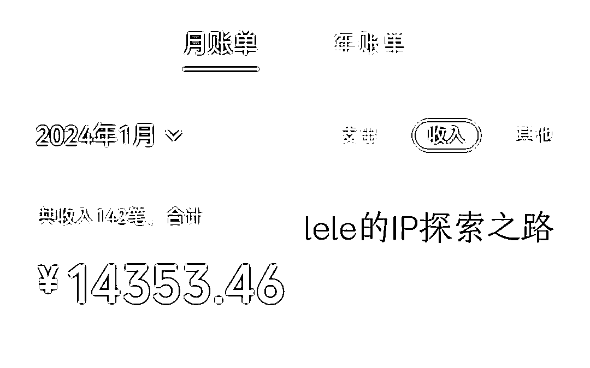
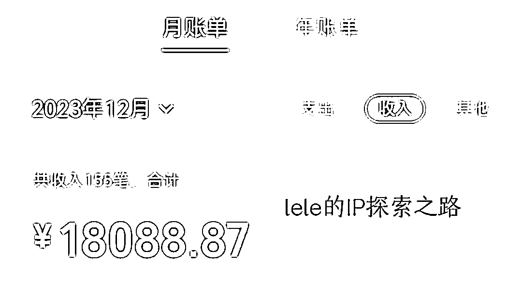
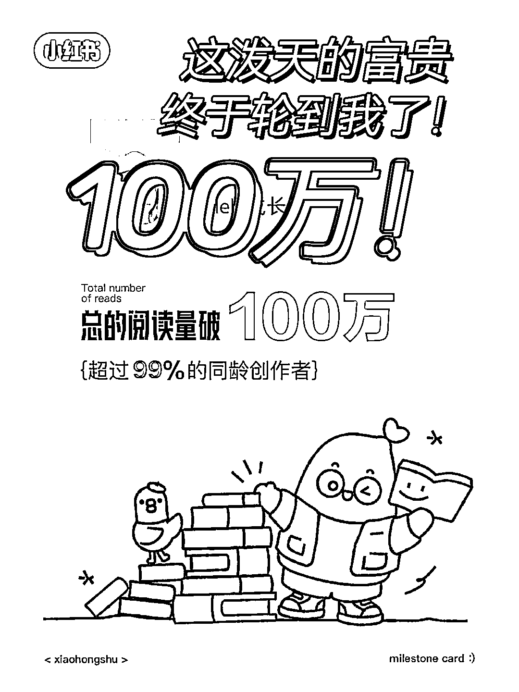
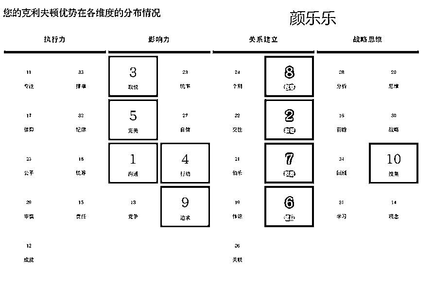
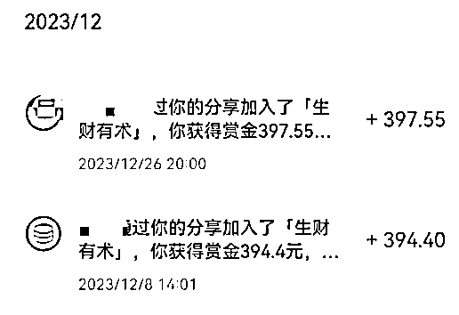
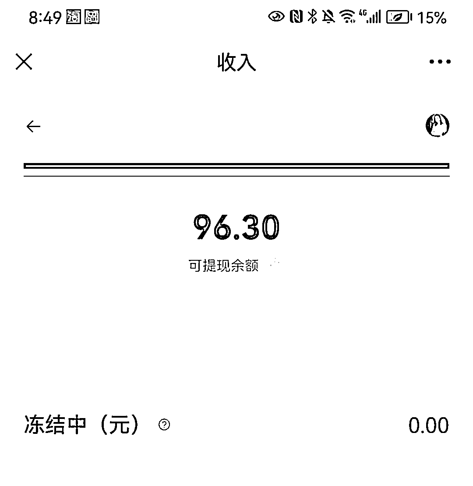

# 失业 240 天，32 岁宝妈从迷茫到月入 18K 的转型之路

> 原文：[`www.yuque.com/for_lazy/thfiu8/su9g48vue8imf3ev`](https://www.yuque.com/for_lazy/thfiu8/su9g48vue8imf3ev)

## (65 赞)失业 240 天，32 岁宝妈从迷茫到月入 18K 的转型之路

作者： 颜乐乐

日期：2024-01-19

各位生财圈友好，我是颜乐乐，十年互联网打工人。

2022 年 4 月 23 日加入生财，在参加了 7 次航海后，前后搞了 20 多条船，尝试众多不适合自己的路之后，我终于找到了适合自己的生财之路。

生财真的是宝藏，新人们一定要去好好的啃精华贴和航海手册。

在此感谢@芷蓝  @梁靠谱 还有众多生财伙伴发的贴子给我的支持和帮助。

* * *

23 年经历公司倒闭，失业在家，老人要回老家，没人带孩子，职场回归无望，尝试多个项目失败后，还喜提住院大礼包，劫后重生，再次转型 IP 赛道，一个半月，我变现了 3.2 万。

今天，我想跟你讲讲，我在失业后这 240 天里，经历了什么。

希望我踩的坑，你不要再踩了。

23 年 5 月，公司不幸倒闭。之后我做过各种尝试，包括但不限于短剧推广，IP 直播切片，公众号爆文。很不幸，我都成为了各大项目的炮灰。中间有小赚一些钱，但不多，不过练习的技能，后来也都用上了。

新项目没跑通，手上稍微有点收入来源的项目，是运营圈流传的：狗都不做的代运营。代运营是个累活，但没得选，必须要做，不然娃去游乐场的时候买票我还要犹豫好久啊！

当时自媒体 IP 之路也在探索，小红书之前跟着生财的航海一直在做，大概累积了 9000 粉丝，阅读量也有 100 万。公众号累积了 2800 的粉丝。（这是后面破局的关键） 但在产品闭环上，一直没有大的突破。

几个项目同时做，有一些收入但还是会焦虑失眠，常常在深夜中突然醒来，想到面对的困境哭流满面。老人不愿意再离家来深圳，他们辛苦一生，也是能理解的。看着身边熟睡孩子，我很清楚，没人帮忙带娃，是回不去职场的，哪个单位有一个朝 9 晚五按时下班，还能随时请假的工作。

多少宝妈也和我一样，因为这些原因不得不开始自己干点什么，甚至，都称不上创业，只是想做点什么事情让自己有价值又有收入。

9 月底体检不幸还查出了个 9cm 的瘤。只好停掉了所有的工作开始住院安排手术，10 月在医院住了 18 天。当时还在参加航海，志愿者很关心我，直接让我先下船了，保命要紧。

也是住院在这段时间，有机会独处，**人在独处的时候看问题往往会更清晰一些。**

过往我做了十年的互联网运营相关的工作，但在离开职场后，我似乎没有办法把自己卖出去了，除了卖时间卖体力（代运营的本质也是卖时间），代运营在账号有起色以后，客户就会收回去自己请人专职来做。**如何能有长期的积累呢？**

人这一生吧，你要卖很多东西，但本质上，都是在卖咱们自己这个人。是啊，能不能围绕我这个人，做点什么。在这一刻，做 IP，如雷击般进入了我的大脑。

在书中曾经看过一句话：**财富是可以抄的，穷，就是抄的样本不对。**

我们在职场的时候抄的是谁？某领导，他勤勤恳恳的工作了十年，然后升上了经理总监，拿着三五万的月薪，还着房贷，还有可能被随时被裁。

有幸在这个时间，我在刷到了芷蓝在生财的贴子，里面有段话特别打动我。

**“ 未来，教练这个 IP 人设会越来越有商业价值，比起各种副业搞钱的项目，具有更强的复利效应，尤其适合自由职业者、自媒体超级个体等角色。”**

对吧，IP 教练。这个是我想要的。我做不到和他们一样年入千万，能百万也是可以的哈哈哈哈~

**个人 IP 最难的，就是定位。**

在请教了芷蓝、靠谱，结合盖洛普的前五才干：沟通/和谐/取悦/行动/完美，我找到了自己的本命。

定位：小红书陪伴型教练，帮助想玩小红书的伙伴完成从 0-1 起号。

市场上虽然有很多人和我在做类似的事，但大家各有风格，行业不同，交付也会不一样，不用担心冲突。更何况，市场真的好大。选老师也是这样，最后都会选跟自己风格类似的，其他人很强，那关我什么事呢？永远不要对自己没信心，一路走来的踩的坑，你不说，有人就得重新踩一次。

既然选择出发，那就做吧！之前从小红书引流的用户，也该被激活一下啦！12 月 15 号我做出了海报和权益，发布了产品。我的年度陪伴社群 199，招了 90 人，私教预售了 2 个，还有十几个线下咨询，并接到了保险团队的培训。

小红书上的引流也开始实现闭环了，之前引流到私域一直没有产品触达，定位清晰，产品出来了，就可以触达转化，完成闭环了。

与此同时，大钱小钱都迎面而来，有人通过我加入生财，还有小报童分销也能赚鸡腿。

现在不会失眠了，焦虑还是会有，但也很快消失，情绪嘛，拥抱他就好了。

在这条探索路上，我总结了 6 个曾经困扰我的问题，如果你打算走 IP 这条路，希望可以给你启发！

**1、我不够牛，能做 IP 吗？**

这是我曾经最大的卡点。

学历吧，我没有，年少是个恋爱脑，中专毕业，本科是个自考的。

大厂经历吧，我也没有，起初是做客服的，后来做了运营和产品。

在 IP 这个圈子，望着大 V 们清华北大 985 的学历，

大厂升级打怪的工作经历，我知道怎么都是追不上的。

我就是个野路子运营，

但在微博时代曾做过品牌传播，话题传播过亿。

在抖音刚出来的时候，帮公司策划出播放过亿的短视频。

我在过往的工作中，有间歇发小红书，大概粉丝有 9000 多，一直有接一对一咨询。

我没法像大 V 一样，教别人当大 V，但我可以帮那些和我一样职场的伙伴，或者妈妈们，从 0-1 去开启自媒体这件事。

IP，就是我们的加速器。副业干成了一件事，**IP 就是加速杠杆，不要小看任何一项成就**。幸亏当初跟着航海，一路做内容也起了号。

如果你现在还没有一个干成的事，那就赶紧跟着航海先冲，用行动给自己一个闭环。

**过往怎么样，不重要，**

**重要的是，你未来想成为什么样。**

**2、不好意思卖，卖了但心交付不好。**

很多伙伴 可能都和我一样，会面临一个问题，担心自己做不好。担心到时卖了产品没法交付。那你就加紧去学啊，别人卖大几千的课，你去学，学了复制给你的伙伴 ，收个 99，不是对大家都好的事吗？

收了钱，你会死命去学。然后拼命输出，你的真诚，是会被看见的。

如果你对自己的服务是有信心的，那么你要早点去成交用户，因为他不跟你买，不会把钱留下，这个钱是一定要花出去的，那与其被不好的同行成交，不如你赶紧去成交，这也是一种良币驱逐劣币。

**3、不敢卖贵的产品，担心没人买怎么办？**

不敢卖贵的产品，是个卡点。我在这个问题的卡点上就是，啊，谁会去买这么贵的哦。可是我们自己不是买了大几千的吗？哈哈。。。对吧！

再说你只要开始讲了，就会有人知道你有卖，这样你低单价的产品就会更好卖，因为要么花五位数跟你贴贴，要么花 199 贴贴，后续还可以补差价，高低先付了 199 吧。你看，人的心理就是这么奇怪。

你有高单价，他考虑的是买高还是买低。

你没有高单价，他考虑的就是，买还是不买。

**4、不会发朋友圈，怕被太熟的人看到不好。**

你介意谁就屏蔽谁打个标签就可以解决的问题。既然他让你有心理包袱，前期介意就屏蔽他。

给想看的人看就可以了~

不会发朋友圈，我们不是有朋友圈 IP 航海吗

直接跟着就可以了。我在看其他伙伴的贴子的时候，也记录了一些方式。

**产品硬广结构**

【痛点引入】根据卖点反推痛点

【卖点概述】给出卖点，即痛点的解决方案

【具体素材】佐证卖点的素材，增加信服力

【下单指令】可在末尾，可在评论区

**认知类软广**

【给出观点】具体的认知类观点，最好和产品相关

【解释原因】论证观点，说服用户

【给出方法】给出痛点的解决方案，引入产品

【卖点罗列】罗列具体产品卖点，与痛点相呼应

**人设类软广**

【成就/感悟/干货】前置，吸引大家注意

【经历分享】详细分享自己学小红书的体验或经历

【引出产品】自然过渡到自己的小红书服务，自己有经验

【引导下单】告诉大家只要你执行力强，就可以咔咔干起来

（此内容来源于：小鹿朋友圈文案）

**5、输出没有灵感怎么办？**

输出从来不靠灵感，我对我的小红书学员也是这样哒。自媒体内容靠选题库搭建，5000 粉之前不用考虑创新。

朋友圈内容，一如前面所说，**财富是抄来的。哈哈，才华也是。**去翻最会写朋友圈的人啊，芷蓝姐，靠谱姐，找到对标学就行了。生财航海手册也有朋友圈的内容哦~

**6、谈客户怎么谈？不会谈怎么办？**

靠谱的销冠贴子，值得读十遍。https://t.zsxq.com/16MIxbvHJ

我用里面的方法，谈成了很多咨询的单子，基本只要来问我的，都会被我拿下。哈哈真的太好用了~ 肯定意图——挖掘需求——预设成交，个个都价值百万。

**持续发圈，持续行动，现在发圈是为了以后不发，现在谈单是为了以后不用谈单就有人哗啦啦打款。**

转型 IP 这条路，每一天的付出都是在积累。能量是相吸的，不要管别人怎么看，你释放出了能量，就会有同频的人去靠近你。**不要带朋友上路，要去路上交朋友。**

好啦，就到这里，我是小红书陪伴教练颜乐乐，如果这篇帖子的任何一个段落，给了你信心或者启发，我将不甚荣幸，2024 一起生财有术！

* * *

评论区：

旋子 : 特别能感同身受，乐乐太优秀了
胡慧 Plus : 棒棒哒[强]
亦磕树苗 : 太厉害了，好有启发，这种心路历程太值得再看一遍了！
颜乐乐 : 谢谢旋子，旋子视频号玩得嘎嘎棒！[鼓掌]
颜乐乐 : [偷笑]2024，一起棒棒！
安壹 : 牛🐮
安可 : 很棒[强][强][强]
颜乐乐 : [抱拳][抱拳][抱拳]谢谢伙伴鼓励吖

* * *