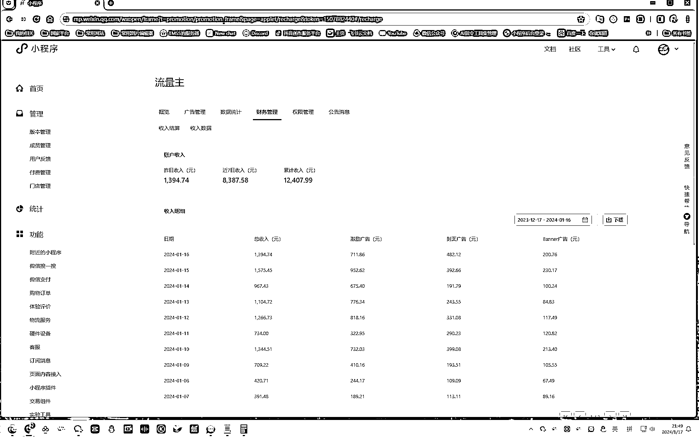
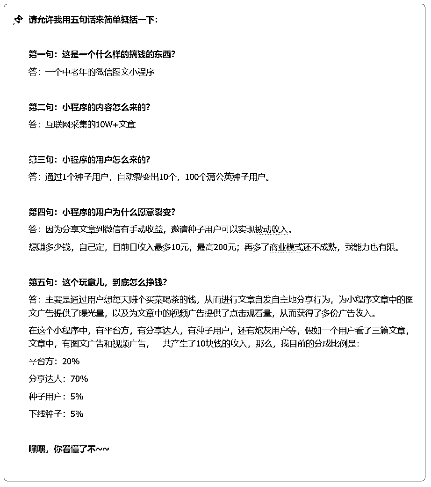
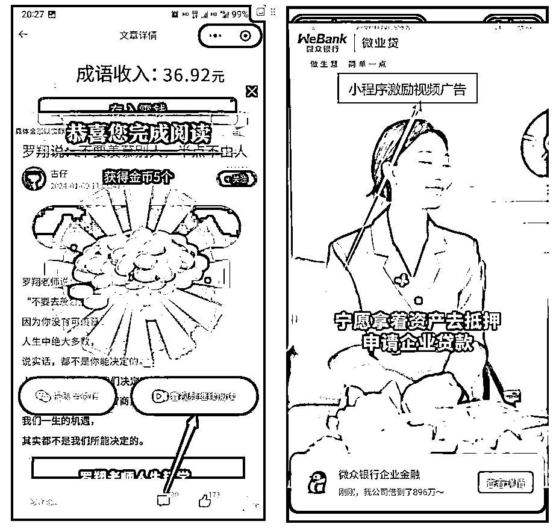
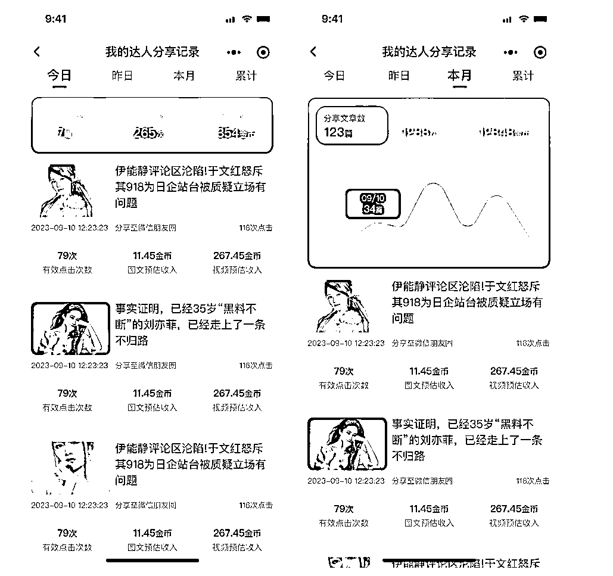

# 我是如何用 10 个中老年种子用户，打通《小程序流量主自动裂变终极玩法》

> 原文：[`www.yuque.com/for_lazy/thfiu8/gnge6lcd5l9zv7g0`](https://www.yuque.com/for_lazy/thfiu8/gnge6lcd5l9zv7g0)

## (19 赞)我是如何用 10 个中老年种子用户，打通《小程序流量主自动裂变终极玩法》

作者： 唐门三叔

日期：2024-01-17

我是如何用 10 个中老年种子用户，打通《小程序流量主自动裂变终极玩法》这套变现模式的实操分享

生财的兄弟姐妹，新年好啊~
我是唐门三叔，今天我又来做分享啦~

距离上次在生财分享被亦仁大大给加精，已经过去了一个月；
在这 20 天中，收到了很多圈友们的好评和点赞~
其实，现在的我，更像是一个被家长和老师们，双重表扬的孩子一样，很开心，很快乐，也更愿意努力的去做更多的分享，希望这次的分享能让大更从另一角度，更好的看懂，看懂互联网项目的玩法....

所以，我也越来越赞同生财的经营文化，这是一个很神奇，又让人很着迷的圈子~
通过自己的不断输出与分享，获得更多优质资源与人脉的链接机会~
恩！
关于牛皮的故事，我们后面找时机线下约个局，再一起吹哈~
今天先给大家分享一个我自己在操盘的项目，不，更为准确的描述应该是一份事业。
不敢说，这是自己压箱底的项目吧，至少是目前自媒体市场上主流乃至顶级的玩法之一。

先来看下这个小程序流量主的玩法，在内测期间一个变现情况：
2024 年 1 月 10 号，正式开启这个小程序的内测，当天我还做了一场直播来讲解整个玩法，刚开始的收入数据，因为没有公开上线，所以收入每天就是几块几十的到几百块的，也不是很多，自从在我的直播间公开宣讲以后，并结合了种子用户的玩法，当天就把整个收益拉到了 1300 多块，当然，这个收益，并非是我一个人的，而是有小程序用户的，我个人来讲，由于平台是起步期，所以，我把整个收入 90%以上的全部回馈给了用户，我自己每天也就只拿收入的 10%的样子。

当然，这份收入在咱们圈子里来说，很少，但我认可的价值在于整个项目的玩法，所以，收入和变现方式，也是一点一点积累起来的，因为用户的不断裂变会形成一个巨大的被动收入模型。

可能，看到这里你还是比较模糊，没关系，下面我针对此项目的整个玩法，梳理了一份详细的实战过程，大家可以跟上我的思路，一起来感受一下，一个互联网产品从 0-1，再到变现和运营的整个过程，看似很难，需要做很多事情，实际上，只要你做过任何一个互联网项目，再用旁观者的角度去看待这个玩法，就会显得很容易和清晰了。

更多详细实操内容，请移步至飞书文档访问：[`xqulkwki4ye.feishu.cn/wiki/AoaswqMThiLMX6kuy6NcEH8znAx?from=from_copylink`](https://xqulkwki4ye.feishu.cn/wiki/AoaswqMThiLMX6kuy6NcEH8znAx?from=from_copylink)

* * *

评论区：

刘同学 : 可以申请个分享达人吗[微笑]
Darren : 这又是一个卖系统，卖圈子的文章，哈哈，但是写的很好

* * *