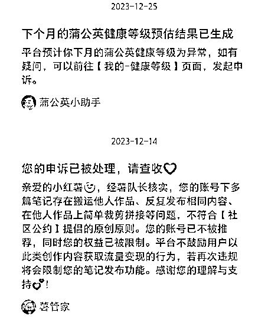
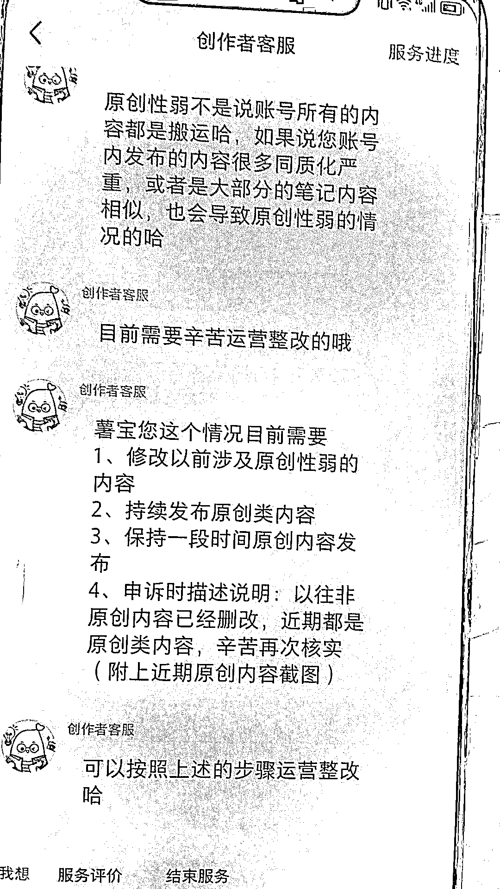
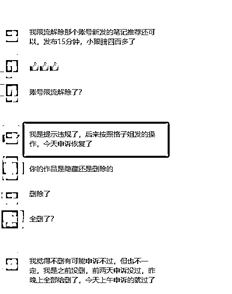

# 小红书限流，蒲公英异常救号攻略

> 原文：[`www.yuque.com/for_lazy/thfiu8/ef0ieyvxinz2fme6`](https://www.yuque.com/for_lazy/thfiu8/ef0ieyvxinz2fme6)

## (39 赞)小红书限流，蒲公英异常救号攻略

作者： 格子

日期：2024-01-15

12 月开始，小红书平台突然大杀特杀，开启了疯狂限流，不管你是做图文还是做视频，不管你是混剪、搬运还是自己拍图片写的文案，宁可错杀一千也不放过一个。

本来账号上午还出大爆款呢，下午后台就安安静静，再一查，账号限流了，甚至连个提醒都没有。

你去申诉，官方给的回复就是：**账号存在笔记原创性较弱，搬运他人内容的问题。**

账号限流了，随之而来的就是蒲公英异常，搞得大家心态都崩了，关键是账号接过广告了，短时间内也不能注销，那到底该怎么办呢？

别急，最近我们去试了一个解除限流的方法，亲测有效，大家可以试试。

**在教大家解除限流之前，先再讲一讲，怎么确定账号是不是限流了？**

其实限流很明显的，你平时发完笔记，后台点赞收藏的消息总是有的，小眼睛也至少都是 200 以上，如果你的小眼睛只有几十了，且后台安安静静，基本就是限流了。

当然了，我们不能靠猜，最简单的办法就是点开最近的笔记，右上角三个点进去，点击薯条推广，一般出现三种情况：

1、薯条能正常推广那就没问题，只能证明你这个作品不行；

2、薯条不能推广，第一条：账号符合社区规范显示黄色的感叹号，说你账号不适合推广，那就是账号限流了；

3、薯条不能推广，第四条：笔记符合社区规范显示黄色的感叹号，说你作品不适合推广，这种问题也不大，删掉笔记就可以。

最严重的就是第二种现象，就是咱们说的账号限流。

那账号限流怎么办呢？

我们咨询过客服，客服给的回答是：

1、修改以前涉及原创性弱的内容

2、持续发布原创类内容

3、保持一段时间原创内容发布

4、申诉时描述说明：以往非原创内容已经删改，近期都是原创类内容，辛苦再次核实

看到这里，大家基本也明白了吧，接下来就是详细的操作流程：

1、删除或者隐藏所有笔记，尤其是曾经违规过的一定要删除，如果账号笔记太多，那就只删除/隐藏近一个月的

2、每天发一篇纯原创的笔记，一定要是纯原创的，比如自己随手拍的视频或者照片，随便配点文案就行

3、以 7 天为一个周期，发了 7 天原创后，去后台申诉，申诉成功了那就解除了限流，如果申诉没成功，继续发，还是以 7 天为一个周期，7 天后再申诉

4、基本上按此流程操作 7-21 天，大部分的账号都能成功解除限流

5、账号流量恢复后，以后的笔记都要提高原创度，不能再和以前一样的创作手法，不然还是会再次限流

6、如果因为账号限流，蒲公英异常了，等账号恢复流量后，再去申诉蒲公英，蒲公英基本上一申诉就能恢复到健康，除非你账号真的违规太严重

我们去试了，确实发了一周的原创后去申诉，账号解除了限流，并且流量也没有受到太大影响。所以如果账号限流了，可以去试试。

大家可以去衡量时间成本，如果是我，我基本不会花时间去恢复，而是选择做新号。

如果是因为接了广告短时间内也不能注销，你想解除限流可以的，但是如果本来只有几十粉丝几百粉丝的，说实话没必要浪费这个时间，直接注销重来，一个新号涨粉 1000 也就一周而已。

毕竟限流过的账号，再次被限流的风险真的比新号要高很多。

好啦，今天的分享到此结束啦，祝愿大家天天出爆款。

* * *

评论区：

暂无评论

* * *