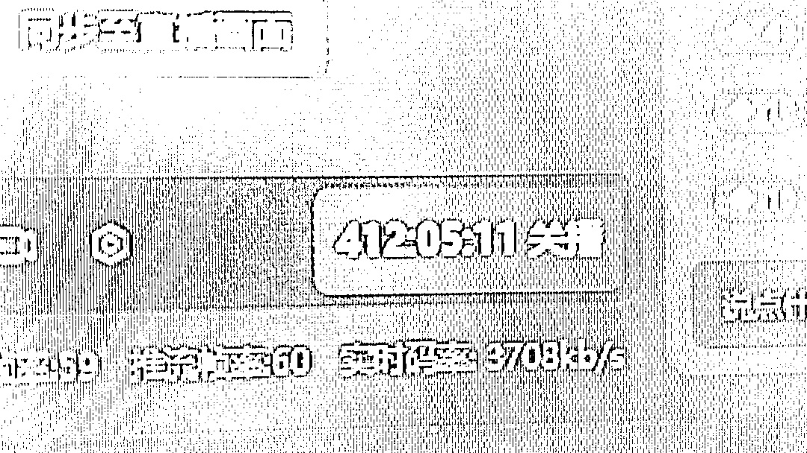

# 利用 AI 打造直播间，抖音真人转无人蓝海搜索流，高效矩阵 0 封号稳定日入 3000

> 原文：[`www.yuque.com/for_lazy/thfiu8/dgv5nip5eg4c710t`](https://www.yuque.com/for_lazy/thfiu8/dgv5nip5eg4c710t)

## (精华帖)(273 赞)利用 AI 打造直播间，抖音真人转无人蓝海搜索流，高效矩阵 0 封号稳定日入 3000

作者： 几许

日期：2024-01-15

利用 AI 打造直播间，抖音真人转无人蓝海搜索流，高效矩阵 0 封号稳定日入 3000

哈喽大家好，我是几许，也可以叫我东伟，是一位边上班边做副业已有六年的副业小达人。

从看不起无人直播到现在真香打脸，真的是感叹不要用自己狭隘的认知去轻易否定一个项目，这个道理我用了 7 个月的时间才感悟明白。

严格来说，我们这个不是单纯的无人直播，而是结合真人直播的打法转无人运营，这一篇我用了近万字长文拆解了这个项目的玩法，希望对大家有点帮助哦。

去年 12 月 13 号开始入局抖音无人蓝海赛道，到今天刚好一个月，目前租了个工作室，逐步启动了 10 个号在跑，每天收益在 1500-5000，这一个月下来预估佣金已经有 88104.85 了。

其中最厉害的号，12.27 开始的号，18 天的时间，到 1.14 为止已有 60863.14 的 GMV，带给我们的预估佣金已经有 23425.35（40%的佣，除去退货率差不多 2w 左右）

没记错的话，稳定这个词，按月要连续三月以上，按天要持续一周以上，所以标题保守点，用了稳定日入 3000，当然，继续矩阵下去，这个项目的上限绝对不止这个数字。

感谢谱姐 帮忙审稿，感谢生财提供的平台[爱心]

具体内容，还请大家移步飞书：
（不知为何被飞书官方限制分享，如果打不开，可以先看下方的语雀备份）

预防万一，又弄了个语雀备份：
[`y9r93uo8au.feishu.cn/docx/SsLgdPoAUoiCVRxBNtpcnOR3nOb?from=from_copylink`](https://y9r93uo8au.feishu.cn/docx/SsLgdPoAUoiCVRxBNtpcnOR3nOb?from=from_copylink)[`www.yuque.com/wishin/bn1ut0/wq3wyp7x232uuuix?singleDoc`](https://www.yuque.com/wishin/bn1ut0/wq3wyp7x232uuuix?singleDoc)

* * *

评论区：

文少 : 大佬优秀！
KK 妍 : 好优秀啊，向您学习
CHEN : 怎么链接大佬[奸笑][奸笑]
S.K : 膜拜，拜读。
一帆 : 要怎么链接你
少说多做 : 看一半看不了[机智]
海阔天空 : 没有权限，打不开[流泪]
几许 : 互相学习[握手]

* * *