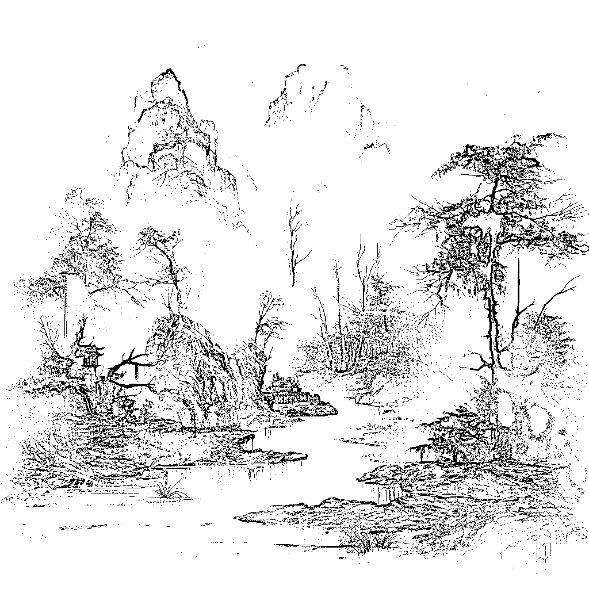

# 从第一性原理出发：构建优质 AI 图像的秘诀

> 原文：[`www.yuque.com/for_lazy/thfiu8/owqnlnoz2h5qh2wa`](https://www.yuque.com/for_lazy/thfiu8/owqnlnoz2h5qh2wa)

## (38 赞)从第一性原理出发：构建优质 AI 图像的秘诀

作者： 饼公子

日期：2024-01-18

大家好，如果我告诉你构建优质 AI 图像的秘诀，你愿意了解吗？

随着 AI 浪潮的席卷，想要用 AI 生成一张图片对我们来说都是一件简单的事情，但是要真正让 AI 生成的图像提升到较高质量的水平，我们需要探索更深层次的方法。

我要做的就是带你在充满变化的 AI 时代中找寻，不变的东西。通过从第一性原理出发，让你也能明白构建优质 AI 图像的秘诀。无论是一名初学者、设计师还是“老手”，我都希望这篇文章能够给你带来帮助。

接下来，我将分几个部分来讲述，如何构建优质 AI 图像的秘诀。

第一部分：优质图像的分析

第二部分：AI 生成规律的探讨

第三部分：构建高质量 AI 提示词的技巧

附：MidJourney 部分运用小技巧

## 第一部分：优质图像集的分析

首先，我们思考一个问题，什么是优质图像？我们的眼睛每天都会看到很多的“图像（视频也可以算是运动的图像）”，有时候让我们不禁发出“哇！”的赞叹。但你曾想过，那些令你赞叹的图像、艺术品背后，是什么神奇的力量在支持着它们？

优质图像集就像艺术世界的宝库，里面收录着无数精心挑选的图片，它们可以是来自大师之手的杰作，也可以是来自摄影师的珍贵瞬间，甚至可以是极具设计感的作品。这些图像集是 AI 图像生成的秘密武器，因为它们包含了无尽的创作灵感和构图元素。

首先，优质图像集并非是随便一堆图片的堆砌，它们是经过严格筛选和分类的。就像一位大厨在挑选食材时只选择最新鲜的食材一样，优质图像集中的图片都经过了仔细挑选，确保它们具有高分辨率、丰富的色彩和引人入胜的构图。其次，优质图像集的内容多种多样，涵盖了艺术、自然、人文等各个领域。这就像是一本巨大的百科全书，让 AI 可以在各种主题下寻找灵感，创造出多彩多样的图像。

然而，要记住优质图像集不仅仅是图像的堆砌，它们还蕴含着文化、历史和审美的内涵。每一张图片都是一个故事的一部分，一个瞬间的凝固，一个艺术家或摄影师的独特视角，它们是 AI 艺术的灵感源泉。

优质图像集的来源

我们已经了解了优质图像集的价值，那么哪些地方有优质图像集呢？我列举了一些：

1.  著名艺术家和摄影师的作品：

著名艺术家和摄影师的作品常常蕴含着丰富的艺术和创意。要寻找这些宝贵的资源，您可以考虑以下方法：

1.  美术馆和画廊

2.  著名画作

3.  获奖作品：

获奖作品通常代表着高水平的艺术和创造力。以下是一些获取这些作品的途径：

1.  艺术奖项网站：许多艺术和摄影奖项的官方网站会展示获奖作品图像。

2.  在线艺术展览：一些在线艺术展览网站会展示获奖作品图像。

3.  设计师作品：

设计师的作品集中有各种各样的视觉元素，可以为您的 AI 生成提供丰富的素材。以下是一些建议：

1.  设计师网站：许多设计师都有自己的网站，展示他们的作品。

2.  设计作品社区：一些在线设计社区如 Behance、Dribbble 等汇聚了全球设计师的作品。

3.  特定网站和资源库：

此外，还有一些专门收集和分享高质量图像集的网站和资源库，比如：

1.  Unsplash：提供大量免费高分辨率图像的网站。

2.  Pexels：类似于 Unsplash，提供免费高质量图片。

3.  Getty Images：一个专业的图像库，提供高质量的图片和矢量图。

4.  ArtStation：聚集了众多数字艺术家的作品，涵盖了各种主题和风格。

5.  杂志：

杂志上的图片都是经过编辑精挑细选的，而封面更是书籍的

1.  国家地理：National Geographic、Science、The Lancet

2.  时尚杂志类：VOGUE、时尚芭莎等

**※电影、电视剧和动漫：隐藏的图像宝库**

电影、电视剧和动漫，作为视觉艺术的高峰之一，不仅给我们带来了感人至深的故事，还提供了一种令人陶醉的视觉享受。然而很多人可能未曾想过，这些影视作品中蕴含着丰富的图像资源，正是优质图集的矿藏之地。

1.  精心设计的镜头：

电影和电视剧导演的每个决策都是为了让观众留下深刻的印象。精心设计的镜头、构图和视觉效果是 AI 图像生成的宝贵素材。例如，在电影《黑客帝国》中，独特的矩阵效果和视觉样式成为了影响整个科幻风格的经典之一。

1.  精彩的场景和背景：

电影和电视剧的背景和场景往往是精心打造的，以完美地配合故事情节。这些场景也是极为优秀的背景素材。举例来说，电影《哈利·波特》系列中，霍格沃茨学校的各种场景，如魔法课堂和宏伟的大厅，都是非常完美的 AI 训练素材。

1.  角色造型和服装设计：

电影和电视剧中的角色造型和服装设计是独具特色的，它们可以为 AI 生成的图像增添独特的风格和时尚元素。例如，电影《魔戒》中的角色装扮，如精灵的华丽服饰和兽人的战甲，成为了奇幻艺术的灵感之源。

1.  情感和氛围的表现：

电影和电视剧是情感和氛围的表现大师。视觉元素的运用可以让观众深刻地感受到故事的情感。AI 图像生成也可以从中汲取情感元素，创造出更具表现力的图像。

1.  来自导演/制片人/摄影的风格：

不同的导演、制片人、摄影师都对画面、风格都有自己独特的视角和风格，反映了不同创作者的个性和审美，比如著名导演希区柯克，他的画面中就充满了紧张和刺激的氛围。

1.  文化和历史背景：

每张图像都有其所属的文化和历史背景，所处的同一文化和历史背景的图像，都会有带有时代的“共性”，不论是技法特征还是主流社会的影响。

## 第二部分：AI 生成规律的探讨

上述这些内容和我这篇文章有什么联系呢？

我简单讲述一下 AI 类的软件的工作原理：AI 模型中含有大量的已经经过训练的数据集，每个数据都有一个“标签”。当使用者输入特定的提示或指令给 AI 软件，接着 AI 模型会根据提示中的信息，以及训练时接触到的大量数据，来生成相应的内容。这个生成的内容可以是文本、图像、音频或其他多种形式。

对应到 AI 绘画，再简化一下：我输入 Apple，AI 就根据这个词语，在已训练的数据集中检索相关内容，然后输出一个苹果的画面。（**输入 A→AI 软件寻找对应的 A’→输出相关图像**）

这里有两个内容，一个是标签，一个是已训练的数据集。对应到上一段的内容，标签就是提示词，数据集即为优质图像集。我们在使用 AI 绘画软件过程中，就要运用这一规则，巧用即可构建优质 AI 图像。

如果看不懂上述内容，那么就直接看这个：嗨，想象一下，AI 就像是一个很聪明的小助手，他住在一本非常厚的魔法书里面。这本书里有很多单词和图片，就像一个超级大的图书馆。当你告诉 AI 你想要什么的时候，比如你说：'请给我画一只可爱的猫咪'，AI 就会打开那本魔法书，翻找书里的页面，找到和'猫咪'相关的单词和对应图片。然后，它会用一些魔法，把这些单词和图片组合在一起，创造出一只可爱的猫咪画给你看。

## 第三部分：构建高质量 AI 提示词的技巧

通过上面的介绍，现在我们来探讨如何构建高质量的 AI 提示词，引导 AI 软件生成更出色的图像。

1.  清晰明确的描述：

清晰描述主体和内容。明确指出您想要生成的图像中包含的主题、元素和情感。避免模糊不清或含糊不清的描述，以便 AI 能够准确理解你的意图。

1.  指定关键细节：

为了得到更精细的图像，指定一些关键细节。这可以包括颜色、纹理、形状、大小等方面的具体要求。

1.  引导情感和氛围：

如果您希望图像传达特定的情感或氛围，不妨在 prompt 中加入一些情感词汇或形容词。例如，使用诸如"温馨"、"神秘"、"欢乐"等词语。

1.  引用优质图像集：

如果您已经收集了优质图像集，可以引用其中的图像或元素，以帮助 AI 理解您的期望。提到某位著名摄影师的作品、获奖图片或特定的图像来源可以为 AI 提供更多的参考。

1.  创意和变化：

鼓励创意和变化。尽量不要将 prompt 写得过于具体，以便 AI 有一定的自由度来表达创意。尝试不同的 prompt 以获得多样性的生成结果。

1.  反馈和调整：

根据生成的图像进行适当的调整。

举个例子，在 midjourney 中不同词的效果：

1.  山川 VS 由摄影师马克·阿达姆斯拍摄的山川

Mountains and rivers --v 5.2                 mountains and rivers photographed by photographer Mark Adames --v 5.2

1.  虾 VS 由齐白石画的虾

Shrimp --v 5.2                                           Shrimp painted by Qi Baishi --v 5.2

1.  两个人在亲吻 VS 来自电影泰坦尼克号两个人在亲吻

kissing --v 5.2            kissing from the movie Titanic --v 5.2

2.  圆形 LOGO 设计 VS 获得红点设计大奖的圆形 LOGO 设计

Circular LOGO design --v 5.2   circular LOGO design that won the Red Dot Design Award --v 5.2

1.  爆炸的场面 VS 由克里斯托弗·诺兰拍摄的爆炸场面

Explosions --v 5.2   Explosions shot by Christopher Nolan --v 5.2

2.  一个美丽的女人 VS 时尚芭莎杂志封面上的美丽女人

A beautiful woman --v 5.2                  beautiful woman on the cover of Harper’s Bazaar magazine --v 5.2

1.  父亲和女儿的合照 VS 电影氛围感的父亲和女儿

Photo of father and daughter --v 5.2   father and daughter with a sense of movie atmosphere --v 5.2

总结一下：

AI 通过你的描述词，寻找数据集/图像集中的标签，再根据自有的算法结合,给你呈现出来。

"我要用 MJ 画一个帅哥"。但其实你并不只是要“创造”一个帅哥，而是给你找一个“帅哥”，然后融合其他的元素，你所需要的其他特性，再给你呈现出。帅哥，会出现在哪里？  比如时装杂志，XX 画家笔下，以 XX 画家笔下的帅哥为基础，然后给你添加白头发、T 恤等内容。

当你在提示词中调用**著名艺术家、摄影师、设计师**可以让 AI 给你创造出相应风格的图片；调用**获奖作品、设计网站、杂志名称**可以让作品更具有质感；当你调用**电影、电视剧和动漫**可以画面更具有故事性、氛围感，贴近原作，复刻出属于你的独一无二的作品。

midjourneyV5.0 及更后续的 V6.0 版本中，大量使用电影抽帧、游戏抽帧、开源图库进行训练，所以反过来运用，写电影名称、游戏名称、优秀图源网站，都是让你出高质量图的“捷径”。尤其是对于电影，优秀的电影，每一帧都可以是能成为壁纸的存在。

在提示词写下“**著名艺术家、摄影师、设计师**”，“**获奖作品、设计网站、杂志名称**”，“**电影、电视剧和动漫名称**”，“**导演名字**”，可以让 AI 绘画软件，快速调取这些优质图像集中的标签，让你的 AI 图像更优质。因为数据集训练的模式较为类似，上述方式在 midjourney 和 stable diffusion 中都是可以运用到的，只是存在略微差异。

附：midjourney 图书馆网站这里可以查到非常多已验证在 midjourney 训练了的设计师、摄影师、动漫名称的网站[`midlibrary.io/`](https://midlibrary.io)

* * *

## 附：①custom zoom 功能应用

在 midjourney  2023 年 7 月的一次更新中，加入了 custom zoom 功能，也就是俗称的扩图。除了普通的扩图，还能拿来做什么呢？下面就是一个小小的应用。

先随便写个句子，出来一张图。

关键词：Vector illustration, black and white line pattern, artistic sense

矢量插画，黑白线条图案，艺术感

这里就用图 1 来举例了。

先放大，然后，点击 custom zoom 。

跳转到是这个界面。

然后，我把里面的词语都改掉，改成。

关键词：3D rendering, mug design, creative ideas --ar 3:4 --zoom 2

3D 渲染、马克杯设计、创意 --ar 3:4 --zoom 2

神奇的地方来了。图案被扩到了马克杯上去了，和原本的图案非常一致。

做过商品的朋友们应该发现了吧。

可以直接让你的图，生成实物效果图。

再来改写一下，还是刚才的图，继续点 custom zoom ，把界面的词语改成：

关键词：3D rendering, colorful picture frame design, creativity, real photography --ar 3:4 --zoom 2

3D 渲染、彩色相框设计、创意、真实摄影 --ar 3:4 --zoom 2

挂画一样 OK,再整个手机壳看看。

继续点击 custom zoom ，里面的句子改成：

从 1:1 的原图，变成了 1：2 的手机壳效果图，是不是很棒？

这个应用可以延伸出个头像，然后弄个手机壳，也省了还要再去醒图之类的软件 p 图了。

关键词：3D rendering, Apple mobile phone case, creativity, real photography --ar 1:2 --zoom 2

再换个图，我这有一张山水画，弄成 T 恤怎么样？

印花 T 恤搞定了。

关键词：3D rendering, white t-shirt design, creative idea, realistic photography, --ar 3:4 --zoom 2

随便再做个 LOGO,也不管他好不好看了。

直接点个 custom zoom。

写入句子，笔记本上带 LOGO。

关键词：3D rendering, notebook design, creativity, real photography, --ar 3:2 --zoom 2

运用这个功能，我们可以先出一张图，或者是平时出的好看的图，直接就让他上“实物”看看效果

减轻设计师的工作量又近了一步。

我让我的山水画，变成大理石看看？

成功的融入了环境。

关键词：3D rendering, marble slab design, creative, realistic photography, --ar 1:2 --zoom 2

总结一下改写的句式，可以写成：

3D 渲染,真实摄影,XX 设计 +修改的图的比例

这里的 XX 设计，就是你想要的实物，

比如刚才的 T 恤、大理石、笔记本、马克杯。

以上就是关于 custom zoom 功能的一个应用

## ②V6.0 之后的“识字”

在近期 midjourney 更新的 V6.0 版本中，画面可以做到更好的"识字",实现多个字母的理解和呈现，

但不是每次都准确，需要在出图时多尝试几遍找到领你满意的。

Tips：V6.0 中，在图像中描述文字时，提示词结尾使用--style raw 可以提高画面文案的准确率；

建议使用“”引号将文字内容包围起来，能够更好的呈现在画面中。

举例:

The English word "DECEIT" is written in the middle of the blackboard with chalk drawings --v 6.0

黑板中间用粉笔画写着英文单词“DECEIT” --v 6.0

The English word "KFC" is written on the sign of a street candy store, HD street photography --v 6.0

街头糖果店招牌上写着英文“KFC”，高清街头摄影--v 6.0

Skyscrapers by the sea, neon lights in the shape of the word "KFC", night, fog, Hong Kong photography --v 6.0

海边的摩天大楼，“肯德基”字样的霓虹灯，夜晚，雾，香港摄影--v 6.0

如果你想要让字母呈现出更好的画面效果，可以尝试添加一些词语，而不是单纯的把字“写”在画面上。

例：

书写(wirted)   手写(handwirted)

印刷/打印(Printed)   倒影(refiected)

涂鸦(scrawled)  激光(lasered)

刺绣 (embroidered)  刻蚀 (etched)

展示着(displayed)  3D 打印 (3D printed)

烤瓷 (Decalcomania) 贴画 (Sticked)

钢印 (Steel Stamped)  水印 (watermarked)

。。。。。。

还可以选择载体：

便利贴（sticky notes） 气泡（bubbles）

气球（balloon） 名片（business card）

标签（Tags） 贺卡（greeting card）

海报（poster） 电脑屏幕（computer screen）

。。。。。。

Laser engraved letters "SCYS" --v 6.0 --style raw

激光雕刻字母“SCYS”（生财有术）

Letters "SCYS" written on business card, simple, black gold --v 6.0 --style raw

写在名片上的字母“SCYS”，简洁，黑金

* * *

以上就是分享内容了，希望能帮到你。也在这里感谢帮助到我的每一位伙伴，谢谢！

附：[非设计专业的如何快速找到设计的思路，用 midjourney 做出商品 (](https://articles.zsxq.com/id_0cxm5sv345o1.html)[zsxq.com](http://zsxq.com)[)](https://articles.zsxq.com/id_0cxm5sv345o1.html)

[让 AI 绘画，从随机出图到随心定制](http://%E8%AE%A9AI%E7%BB%98%E7%94%BB%EF%BC%8C%E4%BB%8E%E9%9A%8F%E6%9C%BA%E5%87%BA%E5%9B%BE%E5%88%B0%E9%9A%8F%E5%BF%83%E5%AE%9A%E5%88%B6https://t.zsxq.com/16nqZFwCP)[`t.zsxq.com/16nqZFwCP`](http://%E8%AE%A9AI%E7%BB%98%E7%94%BB%EF%BC%8C%E4%BB%8E%E9%9A%8F%E6%9C%BA%E5%87%BA%E5%9B%BE%E5%88%B0%E9%9A%8F%E5%BF%83%E5%AE%9A%E5%88%B6https://t.zsxq.com/16nqZFwCP)

[《新人小白 30 天利用 AI 作画技巧，让我的作品快速变现的经验分享》 (](https://articles.zsxq.com/id_hhfr33l9lfmk.html)[zsxq.com](http://zsxq.com)[)](https://articles.zsxq.com/id_hhfr33l9lfmk.html)

* * *

评论区：

诗农 Hope : 手动 666
饼公子 : [坏笑][坏笑][坏笑]
旭哥 : 太棒了，感谢分享
饼公子 : 😆很高兴能帮到你
旭哥 : 目前刚好在学 MJ 和 SD，确实受益匪浅[抱拳]
悟空悟空空 : 优秀
饼公子 : 感谢

* * *