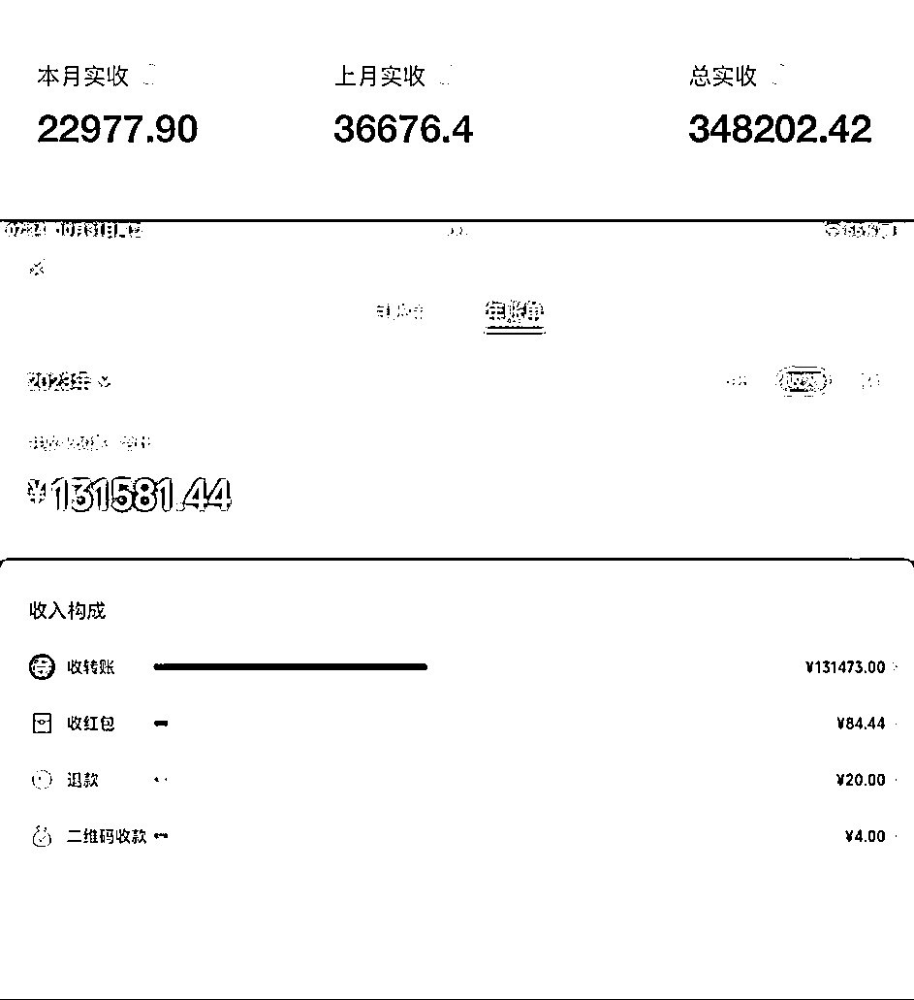
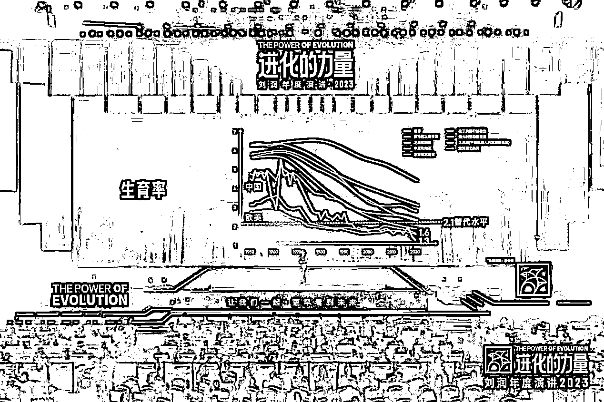
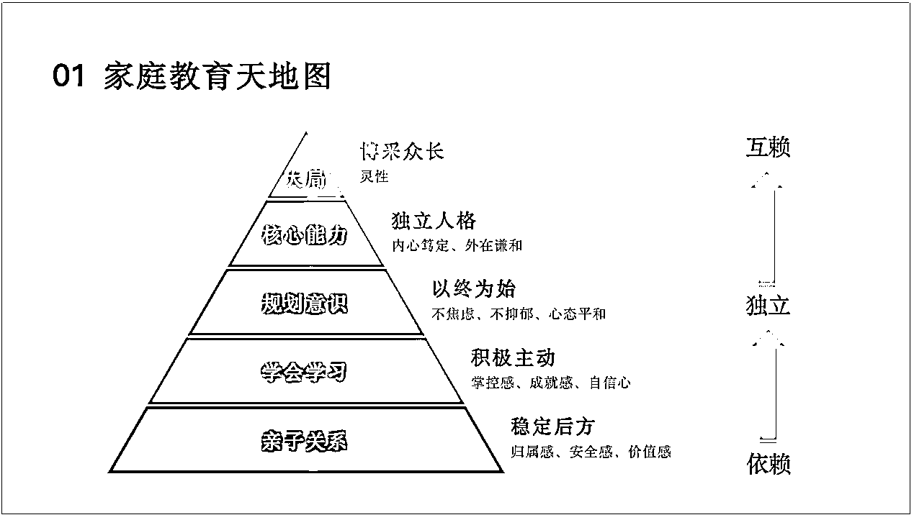
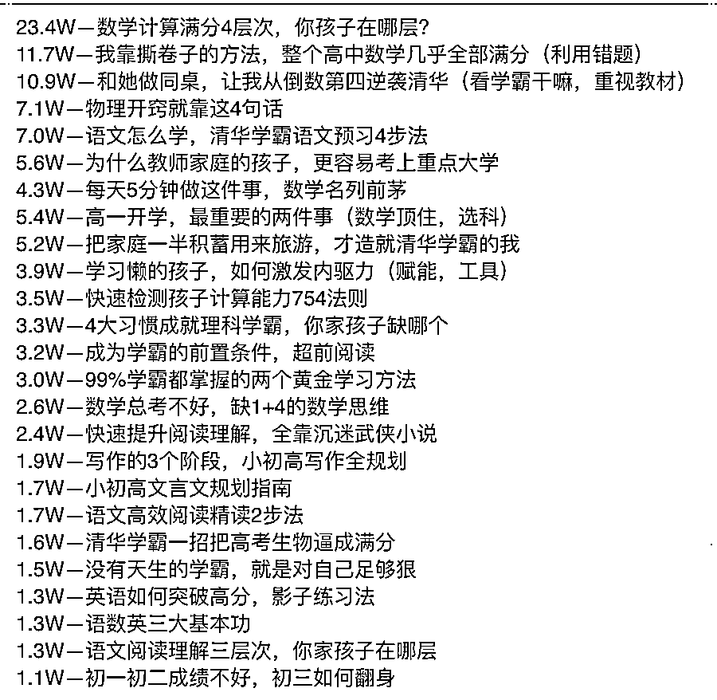

# “双减裁员“后，如何转型做家庭教育私人顾问？

> 原文：[`www.yuque.com/for_lazy/thfiu8/brygiwpb32m1cmng`](https://www.yuque.com/for_lazy/thfiu8/brygiwpb32m1cmng)

## (37 赞)“双减裁员“后，如何转型做家庭教育私人顾问？

作者： 芒果

日期：2024-01-17

都说“双减”是一次重大危机，但对我来讲，这未尝不是一次机遇。从新东方出来以后，我开始转型做家庭教育，一年时间，变现了 50 万。

我是从 0 开始做的家庭教育，之所以选择这个赛道，是因为过往接触了大量遇到问题自己没有办法处理、爸妈给不到关键支持，还总说风凉话甚至打压的孩子。也接触了大量想要内卷，但具体从哪里开始卷、什么阶段卷什么、怎么卷才能有优势、不以牺牲孩子的长远利益为代价都不清楚的家长。

那一年，抖音知识付费很火，我跟风做了录播课，结果一节课都没卖出去。直到今年 2 月加入生财，我开始学习搭建自己的产品体系，设计自己的课程体系，通过陪伴群的筛选、朋友圈的铺垫以及一对一的转化，提高家长的教育意识和付费意识。9 月一个月，赚了 3 万。

这篇帖子主要讲我的学科培训转型之路，包括定位、产品体系、流量转化模型、后端盈利模式，以及未来规划，希望给大家的转型带来一些思路。

大家好，见帖欢喜，我是潜水半年、终于发出了第一篇帖子的生财圈友石萌，是一名家庭教育私人顾问，“家庭教育天地图”的创始人。

一年半以前，我还在新东方做学科培训，双减裁员后，开始转型家庭教育，专注帮助家长解决孩子的教育以及学习问题，提升教育效率。

今年 4 月，在靠谱的引荐下加入生财，截止 11 月底，已实现营收 50W。

以下是今年的收入截图（视频号小店未统计）

10 月 15 日起，《校外培训行政处罚暂行办法》正式实施，很多个体老师面临补课违规风险。

这篇帖子主要讲我的学科培训转型之路，包括定位、产品体系、流量转化模型、后端盈利模式，以及未来规划，希望给大家的转型带来一些思路。

以下是目录：

一、定位

1、背景介绍

2、家庭教育的需求和痛点

3、为什么要做家庭教育私人顾问

二、流量转化模型

1、产品体系

2、流量转化流程

3、后端盈利模式

4、业务拓展

5、未来规划

## 一、定位

（1）背景介绍

我曾经是一名学习管理师，在新东方工作 5 年，离职前做到了校区主管，坐标重庆。

双减裁员后，有一种惊醒的感觉，忽然明白工作的主控权不应该交给别人，而且家里人一直渗透“打工是没有前途的”，再加上也不想像之前那样，生活纬度单一，工作是唯一重点，亲戚朋友们的人生大事缺席、生命中美好的日出日落也缺席。

刚开始休息的那半年很煎熬，就是突然自由了之后的那种不适应，不用打卡、不用早出晚归，就连做梦都会梦到回去上班，然后哭醒，觉得自己没有组织托底，有一种特别强烈的不安全感。

后来就自己给自己找事做，抖音那个时候风头正盛，知识付费也很火。

买了婵妈妈，整天看着别人日赚几万、几十万，听着他们讲课觉得讲的也没有特别专业，就特别想自己录课。买装备、做抖音，发了半天视频也不温不火，一节课都没卖出去，特别沮丧。

今年 2 月机缘巧合认识了靠谱@梁靠谱，在她的影响下进了生财，就感觉打开了新世界的大门，这里面的人、事、物都是我原来世界没有的。

现在我是一名全职的自媒体创业者，用自己喜欢的方式继续做教育。刚开始做家庭教育的初心，是希望改善孩子们的生活环境。

因为接触了大量遇到问题自己没有办法处理、爸妈给不到关键支持，还总说风凉话甚至打压的孩子，这些孩子没有情绪出口，慢慢就会出现心理疾病，甚至演变成性格缺陷伴随一生。

所以最初是希望自己扎根进去，通过改变父母给孩子更自由、温暖的空间，让爸爸妈妈们可以给孩子提供必要的支持，消除掉孩子的情绪内耗，这样孩子就可以把精力放在更有价值的学习上，做更多的探索。

我一直相信，父母进步一小步，孩子进步一大步。

深入接触后，才发现父母这个群体，也是一把辛酸泪，有很多需求和痛点需要被挖掘。

**（2）家庭教育的需求和痛点**

**①家庭教育理念和方法碎片化**

因为不能让孩子输，所以积极参与内卷，但具体从哪里开始卷、什么阶段卷什么、怎么卷才能有优势、不以牺牲孩子的长远利益为代价，很多家长并不清楚。

一般采取的方式，就是看别人家孩子在学什么，或者从专家那里东学一点西学一点，导致自身的教育理念都很难自洽，时常感到迷茫和犹豫，不知道什么是正确的、应该坚持的，做了很多事，但结果并不好。

**②课很好，但听完不能落实**

有教育意识的父母会学习，甚至会屯课，笔记记了一大堆，但依旧觉得不知道从哪里开始落实，鼓起勇气下手去做，常常因为理解偏差导致动作偏差，因为不合理所以遭到孩子拒绝配合，结果往往不了了之。

很多时候，父母学习的积极性也会受到打击，会自我怀疑也会怀疑上课的老师，最后归结到“儿孙自有儿孙福”、“我已经尽力了，比大多数爸妈负责”，虽然躺平但时常内心挣扎。

**③遇到棘手问题，没有人及时支援**

教育大 V 只管卖课，即使有答疑也是限时限量，当遇到孩子问题急需解决的时候，往往找不到人。

而且教育是一个千人千面的属性，即使是相同的问题，但孩子不同的年级、不同的背景，解决方式可以是千差万别。

不了解个性化信息的情况下，大 V 给到的方法不一定是适用的。

还有一点，就是当孩子经历一些不太光鲜的问题，比如抑郁、学校霸凌、成绩不及格，父母是不会愿意向身边经常打交道的人求助的，这个时候，如果身边有一位可以随时提问、答疑解惑的老师就很满足。

**（3）为什么要做家庭教育私人顾问**

之所以给自己的定位是家庭教育私人顾问，是我深深的意识到，家长需要的，是这样一个人：

**①有小初高教育经验，可以打通 K12 分阶段壁垒，帮助提前避坑甚至做准备**

**②可以协助定位分析当下最需要解决的问题，并且拆解可落实的教育起步点**

**③落实过程中，有问题可以及时沟通、获得指导**

总体来说，家庭教育私人顾问给家长提供的，是家庭教育的整体解决方案，而不是某一个问题的解决办法。

除了满足了家长的个性化需求，我还做了市场分析，目前家庭教育行业发展特点如下：

**①行业红海，大 V 聚集，个体从业者获客难**

和专业包装、团队分工明确的大 V 不同，个体从业者无论是视频还是直播，从内容到展现形式、到投流，专业度都缺乏优势，所以每一个家长资源都很珍贵。

**②生育率持续下降，存量市场专业取胜**

根据联合国发布的《2022 年世界人口展望》显示，2022 年中国的生育率仅有 1.175%，出生人口比死亡人口少了 85 万人，位居全世界倒数第五，成为全球生育率最低的国家之一。

由于人口生育率的下降，学生数量会减少，同样意味着家长资源会减少。

所以相比于单一产品需要不断获取流量，持续且长久的做好 KOL 的维护、不断复购会更容易一些，陪伴一个家庭成长的养成系也更有价值。

所以，家庭教育私人顾问定位核心关键词：问题解决、深度陪伴、让普通家庭也有优越感。

相信不少圈友会疑惑，持续解决问题、深度陪伴的「专业」问题应该如何解决，看起来就不是专业基础欠缺的小白可以复制的事。

事实上，关于家庭教育我也是从小白开始的，唯一不同的是，我喜欢教育工作，所以它给了我强大的学习动力。

接下来，我跟大家分享，我是怎么从小白到有一定的知名度的，包括我的产品体系是如何做出来的。

## 二、流量转化模型

**（1）产品体系的雏形**

首先我根据以往对教育的了解，并参照创业酵母 cherry 的企业管理天地图，做出了家庭教育天地图，搭建起了家长教育孩子从下到上应该遵循的教育内容和次序，这就是产品体系的模型。

孩子教育的底层是亲子关系，有了关系一切才没有关系，所以第一个课程是「亲子关系提升营」。

关系稳定、大后方安全，孩子需要解决的是占据生活主要部分的学习问题，分为学习流程和习惯以及具体学科的学习方法，所以第二和第三个课程是「学习力基本功训练营」和「学习力高效提分营」。

关系和学习的基本盘搞定，父母和孩子就有了精力为未来做长远打算，比如什么样的学科学习可以提前，小学做什么可以为初高中减轻压力等，所以有了第四个课程「学习规划营」。

后来又发现孩子们的人际关系同样会对学习以及生活造成困扰，所以最近又做了「青少年人际关系课」。

所以，我做的每一个课程都来自于家庭教育天地图，家长也清晰的知道自己现在急需解决的问题，哪个课程可以帮助解决，以及解决了这个问题以后可以往哪里进阶。

当然，有教育意识和信任感的家长会直接锁定年卡会员，把所有课程进行系统学习。

结合课程，我给家长提供的是整套的家庭教育解决方案，主要包括以下步骤：

①一对一问题分析及诊断：了解孩子详细信息以及成长经历，根据家庭教育天地图，确定当下主要解决的问题，比如亲子关系

②教育问题解决策略配方：课程（药方）+一对一指导（手术）+行动营（保健）

③学习及落实情况跟踪：跟踪父母的学习和落实，及时解决过程问题、提供指导。

**产品差异化是我认为我们可以快速转型和盈利的核心。**

**问题诊断：**每次沟通完家长和孩子都有豁然开朗的感觉，理清了思路焦虑就会减轻，信任感也快速增加。

**课程学习：**进一步了解孩子学习和成长的规律、方法，父母情绪逐渐变稳定，孩子开始投入学习、正确学习。

**行动营跟练：**手把手的带着孩子和家长一起做落实，比如古诗词背默行动营、作业管理行动营、英语单词行动营，把课程落到孩子身上，避免家长中间传达影响内容的准确，以及因此发生的亲子冲突，直接从学到到做到。

**落实跟踪：**家长遇到问题可以及时求助，避免错误的解决方式造成次生灾害，比如高一的弟弟早恋，在指导下顺利过渡。

整套解决方案系统协调父母和孩子双方需要做出的改变，所以最终效果就很明显，每天都可以接收到爸爸妈妈的报喜，通过朋友圈又吸引相同问题的孩子咨询和加入。

**（2）小白如何做课程设计**

实际做课程内容的时候，由于学科培训出身、一线经验不足一年半升职做管理，可以说对孩子、对家长的实际了解并不深入，自己也没有孩子，也没有办法感同身受，只知道自己想要的孩子大概长什么样。

所以刚开始做第一个课程的时候，关于具体课程应该包含什么内容、具体解决什么问题，一无所知。

**结果不是思考出来的，而是调研出来的。**

我的方法是：

**①爆款问题收集确定课程标题**

时间长了就会发现，家长的问题是一个轮回，每个阶段的问题是相差不多的，也就是说，家长在孩子的相同阶段（比如青春期），需要解决的问题或者说是痛点是大体相同的。

所以理论上讲，家长的需求已经被市场挖掘清楚，我们只需要做信息的整合、筛选，最后按照关注度进行排序即可。

**②主题阅读确定课程大纲**

确定需要解决的用户需求以后，通过主题研究得出解决这个问题的主流框架，就形成了课程内容的大纲。

比如为了研究学习方法，我把市面上销量排名靠前的书以及课程进行了综合分析，通过目录调取需要的内容，快速而且便捷。

**③逻辑串联确定课程血肉**

备课环节，根据整体框架，按照逻辑顺序进行案例以及观点的补充，一节课就顺利完成了。

课程大纲确定以后就开始进行发售，第一期采用直播课的形式，以上课代替录课，因为有家长互动，所以上课状态和呈现会更好。

我的习惯是准备一节直播一节，相比于集中备课再上课，备课压力要小很多，节奏感会更明确，不知不觉一个训练营就上完了。

等第一期课程上完，整体流程就已经有了清晰的认识，根据家长们的反馈，课程内容需要调整和升级的地方也逐渐明确，升级打磨以后，我开始了第二期的直播课。

到了第三期直播，内容已经比较完善，家长口碑也很好，最终就形成了可以反复售卖的录播课。

**（3）流量转化模型**

实现目前营收的私域基础来自接手了一批已经死掉的家长群，这些家长没有加私信、没有信任甚至不认识，相当于公域式私域，需要从头再来。

通过投放直播链接、短视频，然后加微信领资料，最终真正引流到了私域，并且已经跑通了私域运营流程。

目前，我们的产品体系如下：

**①新父母学习圈（免费）**

交付内容是我总结的 100 个教育真相，还包括一些教育感悟、本月教育大事件以及部分家长的分享稿。

现在属于刚刚开始的阶段，目的是做内容沉淀，也是一个建立人设和信任的过程，设定的交付周期是一周 2-3 次，感悟就比较随机。

**②365 天教育陪伴群（阶梯价，目前 49.9 元）**

今年 9 月之前，我做的是免费的社群维护，每周直播课两场、文字分享一次，做的很累，事情每天都在做，但是心里是空的，因为群太多，不知道哪些人在听、他们的感受如何，是不是持续在听。

免费、精力不聚焦，还筛选不出来意向家长。

因为加入了靠谱的陪伴群、理白的陪伴群、老马的陪伴群，所以意识到我也应该做一个陪伴群，通过每天分享持续建立家长链接，锁定家长注意力。

9 月初通过模仿老马的陪伴群运营思路以及海报，陪伴群开始招募。

始发价 19.9 元，3 天招募了 100 位家长，目前三个月已经有 226 位家长加入。

**③主题训练营（499 元）**

目前有 4 个主题训练营，但感觉现在应该不太符合训练营的交付模式，更多的是录播课，交付内容是录播课、技能打卡练习、两次一对一的学习指导。

上半年是按照每个月一个营、一学期 4 个营的带练模式进行新用户的维护，后期因为单个营的报名情况不乐观，所以改成了录播课+行动营练习的模式。

**④****行动营（99-199 元，退押金）**

这是今年最重要的一个创新，可以明显感觉到大家对录播课已经免疫了，从教学效果上来说，确实也有很明显的弊端。

为了让妈妈们把学到的东西落地，我们决定去掉“中间商”，直接对孩子，每周一节直播课讲学习方法，然后孩子打卡练习一周，再增加练习点，逐层推进。

因为不用家长亲子去教孩子（很多家长也教不明白），孩子自己参与学习方法的学习，学习的动作变成了他们自愿参与的事儿，孩子们的学习积极性很快就有了提高，这个也是我们比较意外的。

同时，行动营也增加了我们和家长的触点，年卡会员以及训练营学员免费参与，起到了维护作用，新家长通过参与建立了信任，很方便做高课单的转化。

目前我们开设的行动营有古诗词背默行动营、作业管理行动营、英语单词行动营以及寒假新开的突破数学行动营。

今年寒假，这几个行动营可以帮助爸爸妈妈们把孩子的主要学习给拉起来。

**⑤年卡会员（1880 元）**

这是一个综合产品，包括了所有线上课程，赠送一次一对一学习规划，还有全年所有行动营免费参加练习，因为还没开放合伙人，所以是一个身份象征，凡是有优惠都会年卡第一。

很多家长希望系统学习家庭教育、不用再去报其他课程，所以会一次性锁定。

**⑥一对一私教（1200/节）**

针对问题相对复杂的孩子和家庭，我们设置了家庭系统规划和学习规划两种不同规格的一对一私教，都是线下面对面交流，一对一的帮助他们制定计划并监督执行，这也是目前盈利比较多的一个设置。

明年会遵照芷蓝姐的建议，推出合伙人的高客单产品，进一步实现和妈妈们的长期绑定，也充分利用起手里的教师资源。

产品说完了，来浅说一下我们的转化流程。

**①家长信任铺垫——朋友圈**

虽然这不是一个产品，但我觉得它比产品更重要。

关于朋友圈我也经历了几个阶段，这里就不详细说了，我一直有在认真发朋友圈，但实际转化不好，销售链路也很长，花了很多时间答疑但不成交。

**路径：私聊——解决问题——铺垫课程——家长考虑——不下单**

后面经过仔细分析，我发现问题出在我的朋友圈内容上，晒好评、讲干货、踩痛点，但唯独没有把课程拿到明面上，所以导致家长私聊咨询不是问课程而是问问题的。

为了让家长感受专业度，所以家长第一次问问题我都会认真且耐心的回答，这就导致了他最痛的那个问题在私聊的这个地方就已经有解决思路了，更加不会报课程。

所以后面我做了调整，每天至少一条朋友圈干货+课程+课程价格，好评和报喜也都附上他们是学了什么课程、是什么身份，甚至会直接硬广讲权益讲福利。

再看到转化效果之前，我先观察到了一个有趣的现象，就是抄我朋友圈的一个同行不抄了，因为都有我广告的影子。

接下来私聊的家长内容上开始有变化，他们问问题但会自带解决方案，结构是先讲孩子的问题，再问某个课程，这下子我的转化就轻松很多，可以直接进入正题。

而且，最近已经有部分家长是看了朋友圈以后被动成交，会有突然收到的一笔一笔钱，虽然还不多，但我觉得是个好苗头。

**②高客单转化——一对一体验课**

家庭教育和自媒体变现圈的用户不同，自主自发寻求学习机会的意愿没有那么强烈，除非孩子的问题已经严重到不得不解决，比如抑郁、休学、成绩极速下滑，是遇到问题解决问题的防御型，而不是防患于未然的进攻型。

所以我设置了 299 元的线下体验课，一对一的做高客单的转化，通过问题梳理、提供整体的解决思路，让家长明确这是一个需要长期学习的过程。

产品方面，我会提供家长两个选择，一个是单个的训练营，一个是长期的配套解决方案，比如年卡会员+一对一规划。

一般家长会选择单个训练营，有信任基础的家长或问题比较严重的家长会选择配套方案，但因为有了整体解决方案的铺垫，后期单个训练营转年卡的家长不在少数。

我还依葫芦画瓢，仿照靠谱的玩法，允许家长后期补差价升级年卡，再加上我已经收了 299 的体验课费用，所以长期的短期的都有了，自己也很淡定。

通过陪伴群的筛选、朋友圈的铺垫以及一对一的转化，同频的家长教育意识和付费意识都大幅度提高，9 月转化一对一规划学员 15 个，年卡会员 3 个，总营收 38410 元。

一对一规划是一个重交付，一组 2 个小时，9 月每周 5-7 组，导致其他事情无法正常推进，所以 10 月做了销售调整，重点推边际成本低的课程以及年卡会员，陪伴群、年卡、课程、一对一都有出单，营收 26000 元，虽然营收暂时减少，但是日子轻松很多。

目前的不足，是还没有精力去主动做引流裂变，因为前期已经积累了很多内容，接下来会做系统的整理，包括成功案例、教育百问百答手册、陪伴群分享精华手册等便于传播的引流品。

再接下来，重心会放在公域，研究视频号和小红书。

总之，因为初始有一部分流量，所以我的成长路径可能和大家有所不同，我攻克的顺序是按照产品—转化—裂变—流量进行。

因为有生财和靠谱这样强大的资源库，每个环节集中精力去学习、研究、打通，所以我心里并不慌，每攻克一个环节，产能就会成倍提升。

这就是我的主线业务，是我的主阵地。

## 三、后端盈利模式

最近接到了几位前同事的吐槽，作为学科培训的个体老师，他们会遇到一些学习动力欠缺或者家庭关系影响以至于孩子不能专心上课，持续没有效果甚至家长放弃补习的案例，这让我意识到了一个没有被满足的需求。

个体老师多半是学科出身，即使专业能力足够强，也往往不善于解决家庭教育问题，甚至不善于和家长沟通。

和个体老师合作可以一箭三雕：

1.  挽回个体老师因家庭教育问题导致的学员流失，并获得 CPS，老师受益

2.  利用家庭教育及学习力相关产品辅助学科培训取得教学效果，家长受益

3.  把我们需要补课的学员，推荐给学科培训的个体老师，拿推荐费，我们受益

三方受益，皆大欢喜，也刚好可以把我之前积累的老师资源利用起来。

目前已经有前同事推荐学员家长进行咨询，模式正在探索中，另外，已有机构邀请我做抑郁、休学学员的案例分享，成功的话可以拿下一年的学员心理疏导，这就是小二十万的收入。

因为有一些学校资源，所以目前有一所学校已经谈好了「家校共育」，把我们的家庭教育课程引进校园，在学校里协助老师和家长解决孩子教育问题，大概是十万左右的一个费用，有学校做背书，也可以更方便做家长资源的承接和转化。

除此之外，我还想做个人商业顾问，当然，这是后话。

一年多的创业经历，让我彻底进入了探索世界的新阶段，我现在觉得人不应该给自己设上限，无论你想获得什么，都可以通过找对圈子、跟对人的学习不断向上。

因为有生财和靠谱，我知道我在做正确的事，而且在正确的做事，内心平和且喜悦。

特别鸣谢：

感谢靠谱@梁靠谱的一路指引和助力、感谢芷蓝姐@芷蓝的宝贵建议和专业指导、感谢老马的倾情分享，还要感谢鱼丸老师的不断提醒。

希望我在生财的第一篇帖子，也能给你带来力量。

* * *

评论区：

凌心 : 好棒！
荔枝家教| 陈老师 : 也是做教育相关的，方便留个 v 交流吗[憨笑]
芒果 : 好嘞陈老师，15923166903

* * *