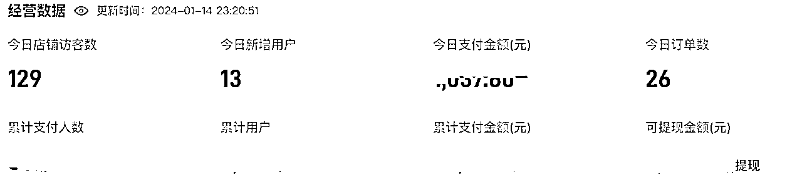
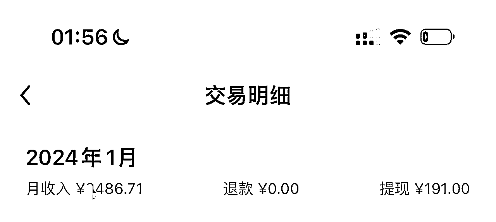
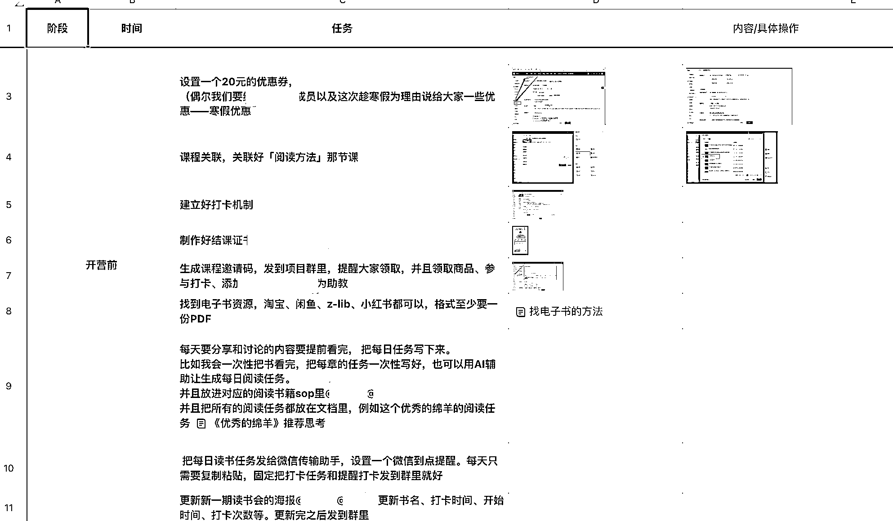

# 大学生赛道，知识付费创业，私域日均 2000+利润经验复盘

> 原文：[`www.yuque.com/for_lazy/thfiu8/kr5ogzxw1gyhy8fs`](https://www.yuque.com/for_lazy/thfiu8/kr5ogzxw1gyhy8fs)

## (30 赞)大学生赛道，知识付费创业，私域日均 2000+利润经验复盘

作者： 漫漫 mansi

日期：2024-01-15

大家好，我是漫漫，是一名小红书 34 万粉丝的知识博主，之前在生财分享过我做小红书账号的复盘：https://t.zsxq.com/1675mrJo6 ，以前在小红书都是接广告变现：https://t.zsxq.com/16X8PlhJX 最近几个月都没有在生财更新，因为我在开发自己的产品，跑自己的商业模式。

在经过 3-4 个月的努力，目前我的产品实现了稳定【单日付费 2000】左右，其中订单来源是【小鹅通、知识星球】。终于有结果有底气和生财的圈友来分享我的知识付费产品成果啦！

这是小鹅通数据

这是知识星球截止目前本月成交量

我简单介绍一下我的商业模式。（一直在摸索和优化，目前算是比较清晰了，但提升空间依然很大）👇

做生意无非就是 1⃣️产品+2⃣️渠道

1⃣️【开发产品】都是课程和陪跑学习

（1）我主导开发，把控大方向，具体的授课和答疑找更专业的老师！

比如我的英语课程，我会把老师的资质检测、面试、和她们一起做一期小规模的内测，看看老师的水平、责任心强不强。主要是责任心！如果 ok，那么就扩大宣传。

（2）产品都是根据用户需求来开发，用户需求=市场需求=赚得到钱

因为我是以分享英语类学习、阅读、职场经验等其他知识做博主的，所以我的粉丝基本上都是对英语类学习、阅读、求职有兴趣和需求的人群。因此我根据用户/市场需求开发了线上读书会（2 期/月）、英语口语营（1 期/月）、求职产品、学习方法课程等等，符合需求所以转换率很高

2⃣️【我的渠道】：

1.各种公域流量，包括但不限于小红书、即刻、闲鱼、知识星球、微博

2.和我一起开发产品的老师们的私域，我也会教他们一起做公域，教他们怎么引流和维护个人 IP

前几个月一直沉寂，因为创业途中非常非常多问题出现，这几个月终于有结果了，所以想和大家分享一下这几个月的经验和教训。

当然很多细节说不完，我尽量以复盘的形式把一些个人觉得比较节点和重要的心得写出来。

我想本篇内容应该比较适合想要做知识付费的同行看：做知识赛道，创业卖知识付费产品、做大学生赛道的、从公域引流私域的、个人 IP 转换成交的

真正做出结果也就这一两个月理清了点头绪，一点点小反思，还要向各位前辈多请教。

* * *

# 一、公域发布内容的逻辑

## 1\. 一定要有一个目标群体，目标人群要垂直，不要什么人的生意都想做。

❌一开始因为觉得自己可以做的培训太多，所以在什么内容都发，一会儿是求职，一会儿是小红书训练营，结果就是吸纳的人群非常乱，既有想要做小红书的宝妈，也有想要换工作的职场老油条，这样导致我账号定位很乱，并且引流私域的人群也不精准，报名我的课程的人群差异很大，交付起来非常吃力。

✅后来公域垂直以针对大学生的知识分享为主，并且圈定大学生这个群体，我分享的依然是大学生需要的学习方法

英语学习等等，即使是想要宣传自己的小红书训练营，也是以大学生或者知识为切入口。

❓我还看到很多知识体系产品的博主，每天发关于知识体系的内容，没有聚焦人群。

如果是对准某个人群发布内容，算法就会精准推算给那个人群。

如果不针对某个人群，用户画像也会逐渐清晰，但是过程就会比较慢。

所以，如果想要吸纳更多人，可以多埋关键词，对准要吸纳的人群说。

如果觉得产品人人都适用，想要人人都看到，结果很可能就是大家都看不到，因为算法不聚焦。

但是有舍有得吧，这也是一种筛选用户的方式。

## 2\. 内容选题从自己的产品体系找一些切片，找个能引起重视的切入点发布

（1）很多人做知识付费产品，不知道在自媒体平台发布什么内容，其实**从自己的课程体系里面摘录一部分出来****就好。**

比如我的课程里有教大家如何阅读一本书，整个文章内容有 5000 字，而我的其他自媒体平台就是挑选了我认为最能吸引眼球的作为笔记内容。

（2）我看到很多人做「打造知识体系」的产品，在小红书发布的内容有的发一些课程或者干货文档的截图，有一些是一些强调结果，前者你不强调结果不能刺激大家的眼球，或者大家联系不到自己身上。后者只有结果没有干货。

**一个好的爆款公式应该是：****（基本上在所有平台按照这个方式写的内容都能爆。）**

**标题/封面：能获得一个好处/我获得了一个好处/这个东西有好处（更快、更多钱、更多人喜欢、更美）**（比如：职场人 10 天学会这套职场知识体系建立思路，工作效率提升/老板喜欢/升职加薪

**内容：好处+重要性+你该怎么做**

比如：

01 好处：知识体系打造让我工作效率提升了。

02 重要性：人人都应该学知识体系打造，因为这个时代的家都太卷，技能谁都可以学会，但如果你有体系化思维，不管是干什么行业都会 xxx

03 你该怎么做：搭建知识体系有几个步骤：1、2、3

（想要刺激大家学习，就要强调学习的重要性

「你该怎么做」最后一部分你写得好用户会觉得你有料，就会想继续关注你或者看你的产品。=

## 3\. 一定要蹭热点

我教我的老师做矩阵刚好碰上上个月期末考和四六级，每天发这几个主题的内容，流量刷刷有，成交很多

# 二、公域引流私域的方法

## 1\. 只要看到潜力群体，就可以同步内容

只要有人群的平台都可以同步内容。

（1）我目前是让大家**小红书、微博、即刻都做，**粘性高一点，反正内容同步一下，动动手指的事儿～

**（2）闲鱼**可以直接卖，指向明确一点。

 (3）多做社群，买别人的社群

每个平台其实人群调性都不一样，内容适当修改一下下～

## 2\. 不要过度营销

其实我还不太懂营销方法，所以我基本上没怎么营销，**在没搞懂怎么营销之前我觉得不如做好自己，做好内容，不然画蛇添足，效果反而不好。**

## 3\. 正价卖/宣传产品

❌踩过的坑：0.1 的商品链接卖高客单价产品，会导致很多人买了之后搞不清楚到底卖的什么，解释也解释不清楚。

❌踩过的坑：0.1 的商品会导致大量的人抱着白嫖心理购买，引流很多难搞的客户占据精力。而且加微信后态度很不好地要资料，并且拿到就拉黑也有人。

✅正确做法：正价卖产品，减少和客户沟通的成本。

可以正价卖低客单价产品，卖低客单价产品后发货引流到私域，之后再在私域成交其他产品。

也可以正价直接卖高客单价产品。这样大家知道你有多种产品，他们一开始就有选择权～会更觉得被尊重！

✅绝对不能免费

这样筛选出有知识付费意识的人，筛选掉很多白嫖的人。

我挂车价格上调到合适价格后拍单的人反而多了，也很重视产品，有付出才更珍惜～

# 三、做产品的经验

## 1\. 始终围绕用户

### （1）根据用户需求开发/找产品才能赚钱

❌千万不要觉得「我觉得这个东西好，所以我要做」，因为这样很可能赚不到钱。

✅做市场需要的！！市场刚需的才是赚钱的！市场需要的才是赚钱的！当用户提出诉求——看看有多少人有需求——好，可以做。

（血泪教训。

如果你有能力可以自己参与开发，没有的话找一个靠谱的产品去卖，整合资源。

### （2）用户有反馈马上收集改正

我的产品的 sop 详细到每一个小动作。

他们购买产品时不懂的，补充进产品介绍。

交付课程时不懂 app 使用的，补充进第一课介绍。

有疑问的，专门拉一个常见 Q&A 文档，并且文档名称叫：必看，强制用户看完问题减少一半。

## 2.和专业的人做专业的事情

比如我擅长阅读，但不擅长口语，那我就找个人来做口语的交付，这样大家一起各司其职，发挥自己的优势，把产品做好，一起赚钱，也让学员有更多收获～

## 3.先小闭环跑一遍，再逐渐扩大渠道，不要想一口吃成大胖子

因为和其他人合作过程中会有很多碰撞，所以先要小规模测试一下，不要一开始就想吸纳很多学员用户，万一出现退款或者两个人合作出问题就会很麻烦。我们想不到问题会有哪些，所以在认知以内让事情可控。

低客单价学员预期也会低一点，我们的压力也会小一点，慢慢价格提高。

人少一点出问题也会可控一点，先小规模跑一跑。

## 4\. 小鹅通和知识星球的使用：（还在探索和比较 ing）

目前觉得小鹅通适合卖课程，知识星球适合卖圈子。

购买了小鹅通的，直接给星球优惠券，方便补差价。

小鹅通的课程被囊括在知识星球里。

# 四、营销

其实我个人并不是那么擅长营销，最近有在看一些书，结合我自己的经验，总结几个不知道算不算经验的结论

## 1\. 做好自己能筛选同频用户，减少售后麻烦。

我筛选客户的方式：主要还是做好自己、做好自己的产品

我确实还不太擅长营销，朋友圈发的也不多，小红书的营销也比较佛系，店铺开着，也不怎么发广告，这样购买我产品的人大部分都是因为我笔记的内容而对我产生信任度的人群，有的是特意点开店铺购买的。

我在小红书群聊里的发言也少了很多，主要是大家提问我回复一下，偶尔成交偶尔不成交，但是比起之前吆喝引流到很多售后麻烦的客户，这样成交的客户事更少，因为大家购买产品其实购买的更多的是信任度、情感链接，

「互联网上好的课程好的方法到处都是，我之所以买你的东西，是喜欢你这个人，你做事的态度和方法。」

当然，**基数越大流量越大成交的可能性越大**，有舍有得，目前觉得没有最优解，慢慢学习营销方法 ing～

## 2.私域转化以信任为基础，大家购买产品购买的是人的信任和情感链接

所以平时朋友圈多发自己因为生活细节产生的思考，而且可以适度发一些情**感的关键词，比如爱情、情绪，这种关键词会无形加深人和人之间的联系。**

我之前发布一篇「我喜欢一个人看电影，别人不懂我为什么喜欢一个人看电影，但是电影的选择和看电影时展露出来的情绪很私密，我不想和人共享」，这个朋友圈发了之后收到好几条私信想要成为和我一样细腻观察又独立的人，就报名了我的一些课程。

## 3\. 做好产品就是做好口碑

我的产品转化基本都是前一期的用户，付过一次费用的大部分都会付第二三四五次，所以我觉得**1000 个铁粉**很重要，要维护好自己的信任力～

## 4.拜托大家帮我宣传

这点以前经常被我忽视，后来我在对方 cue 产品的时候，会加上一句「麻烦你帮我宣传一下」等等，我的学员就会把我的产品转发到朋友圈。

（听说最好的模式是收费合伙人+分销，但我目前觉得自己还不够格收费带合伙人，等我商业模式彻底跑通了再谈～）

## 5\. 不要把产品复杂化，一次做一个产品，一个周期宣传一个产品，减少售后成本

即使我们自己很清楚自己的产品体系，在用户看来就是会很乱。

比如我之前在朋友圈发求职产品，又是训练营又是陪跑营，大家就不理解区别，而且觉得这个也行那个也行，不知道自己需要哪个。

不如一个周期就做一个产品，一次只宣传一个产品。

减少他们购买时的阻力，不要让他们还要去比较，分析来分析去其实差别不大。反正学员学了就是会有收获的～

# 五、创业过程中觉得自己平时的一些好习惯

## （1）知识付费，向有经验的人请教

在生财光是看各位的文章已经能学到很多东西了，有时候刷到商业模式值得借鉴的前辈发个红包问个问题，比自己绞尽脑汁想半天要高效得多。

之前和小伙伴一直在构想幻想，结果想的天花乱坠，做起来全都是坑。因为大家都没经验。

后来认识了一些知识付费创业成功的前辈，给我指点了很多迷津，有时候一两句话能拨开我的迷雾。

在这里也希望如果有做大学生赛道的前辈，希望能够请假一些营销方面的问题，因为大学生群体确实付费意识很低，即使我个人觉得我的产品真的做得很良心很有意义，但是付费的人群比我想象得要低很多。

## （2）看书

从开始创业以来，阅读量每个月至少五本，这几个月最开始是看

**运营**方面的书、

**小红书内容创作、写作、表达**方面的书、

**个人 IP**打造的书，

前两个月疯狂迷恋**投资理财、创业**方面的书，

这个月一直在看**营销**方面的书，很感兴趣**用户心理学、消费者心理**学。

看书其实也是一种知识付费，因为很多问题在书里也能找到答案。

## （3）执行+反思+改进

也被不理解和骂过，也做过一些蠢事，不停执行实践+反思+改进+继续执行，路是一步一步走出来的。

## （4）给自己预设最坏的结果，悲观预测，乐观执行～

如果这个最坏的结果也能承受，那么就做，即使不能有很高的收益，教训也是一种经验，更宝贵。

# 六、希望得到的帮助

（1）在这里也希望如果有做大学生赛道的前辈，希望能够请假一些营销方面的问题，因为大学生群体确实付费意识很低，即使我个人觉得我的产品真的做得很良心很有意义，但是付费的人群比我想象得要低很多。

（2）希望多对接一些大学生资源～

* * *

评论区：

顺利 : 先赞后看
27 : 看到你的文章说获取公域流量没有提到 B 站，不知道圈友有没有尝试在 B 站获客。我也是做大学领域的课程，主要从 B 站获客，单日最高能做 1W+收益
这是轻舟 : B 站是应该做的，如果大学生群体居多
漫漫 mansi : 非常感谢提醒，是我确实对 b 站不了解。

之前有尝试过视频口播，在不擅长的事情（视频口播）上花了很多时间，一条视频要好几个小时，但这几个小时我可以写好几篇小红书爆款，可以同步到好多平台，可以很快给我的矩阵改出爆款，同样的时间成本，我做擅长的远比我做不擅长的效果好好多倍。

后来我意识到，精力是有限的，要花在对自己来说成效最最好的地方。
所以放弃了 b 站，也不教视频矩阵。

所以我对 b 站不是特别了解，我目前的心得和想法就是有限的时间找到一个效果最好的关键点去放大。

如果我的小红书、矩阵这边跑得不错了，精力节省了，有时间我一定再去研究一下 b 站！

感谢！
27 : 不客气 只是一个建议，B 站区别其他平台有个特别大的优势，长尾流量持续时间很长。今年期末期间发布的内容可能明年对应的时间会再被推送一次。如果你是视频录播课程，可以尝试发一半课程到 B 站上，剩下的一半让用户加到你私域来购买。
漫漫 mansi : 感谢！我没想到在 b 站也可以直接发切片，非常感谢，之后我摸索一下！

* * *