# 0-1 知识类 IP，如何 3 倍提升销售增长空间

> 原文：[`www.yuque.com/for_lazy/thfiu8/rp52gr7yf36hiptl`](https://www.yuque.com/for_lazy/thfiu8/rp52gr7yf36hiptl)

## (20 赞)0-1 知识类 IP，如何 3 倍提升销售增长空间

作者： 咏舍

日期：2024-01-15

大家好，我是咏舍。

之前是一名在职场奋斗打拼了 12 年的互联网设计师，5 年设计管理经验。

现在是一个能量心力极强的学习猛人，去年一年不断付费学习，融会贯通的实践应用整合成：设计师个人 IP 商业私教体系，一共变现 20w+

**如果你刚开始做知识类 IP，不知道自己卡在什么阶段？**

**在销售过程中不敢去收钱，羞于谈钱，不敢卖自己产品，不相信自己产品的价值，那我相信这篇文章能够帮助到你。**

我的盖洛普前三：思维、学习、成就

我复盘了我过去年一里，2023 年 1 月份我变现 400 来块，12 月变现 5w+。总结出，我是如何 0-1 实现结果，并不断优化销售转化提升收入？

在这里很感谢我的销冠老师梁靠谱一年里不断的指点，才有了我现在的成绩。

给大家看下我这一年前后，自己谈单的对比。

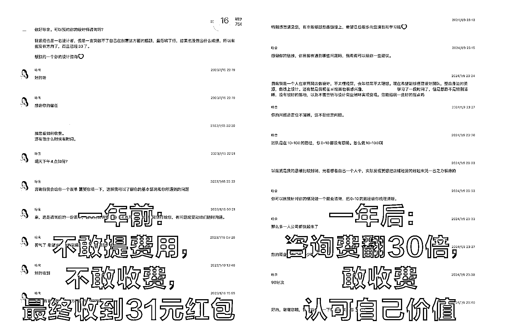

昨天，我在生财线下组主题局，把这个内容初次拿出来给大家分享，被圈友认可价值很高，决定分享出来，**希望能给更多像我这样 0-1 初期的圈友一些启发。**

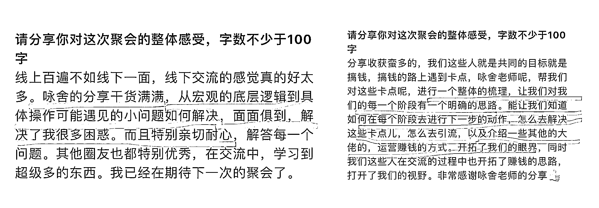

整体的框架如下

### 第一部分：0-1 知识类 IP，不同阶段的策略

1.  0-1 知识类 IP，不同阶段的策略和认知

2.  学习成长期：1 倍销售提升在于布局多元收入渠道，里程碑结果拉高势能

3.  跑通闭环期：2 倍销售提升在于梳理 sop 的流程，提升效率，打造独特高价值

4.  增量放大期：3 倍销售提升在于私域生态布局，多次激活私域存量

### 第二部分：私域销售中的一些常见卡点和技巧

1.  销售成交 6 大卡点：配得感低、自我卸力、陷入帮客户解决问题、无愿景、急于成交、缺少逼单理由

2.  洞察客户决策的四种心理：危机感、价值感、信任感、认同感

3.  4 种话术轻松化解客户顾虑

## 第一部分：0-1 知识类 IP，不同阶段的策略

### 0-1 知识类 IP，不同阶段的策略和认知

#### 1、学习成长期

目标：先以学习陪伴为核心目标，积累第一个阶段结果，分享自己的结果或变化。

跑通流量转入私域的路径，并设计出产品体系成功变现。

#### 2、跑流量和产品闭环期

目标：从成功路径里去找关键点优化，并梳理流程，用模版提升效率。

#### 3、增量提升期

目标：全方位私域布局，放大增量提升转化收入

## 成长期：1 倍销售提升在于布局多元收入渠道，里程碑结果拉高势能

我的普通人的条件：

我其实是跟大家一样，一个普通的人代表，不是大 V，没有很多的流量，没有团队操盘，也没有特别知名的背书，就是长期坚持下来，一点一点的积累起来。

2 个月下来：

1 个成长陪伴社群 140 人，增长至 330 人

微信好友：2800 人增长至 3700 人

公众号+全网粉丝量 1w+

我的产品：陪伴社群 199/年、咨询 699/次、设计师个人 IP 商业变现私教 6980/6 个月、12800/年

我的结果 1 年收入 20w+，4 月份 3.4w，12 月 5w+，这跟原来职场收入相比很不稳定，比如 1 月份只有 400 块收入，8、9 月的时候只有几 k 的咨询+线下办活动收入，但我看到另一种可能，是一个可以不断创造的无上限天花板的空间。

我的收入方式是多元收入结构。

具体是什么概念呢？

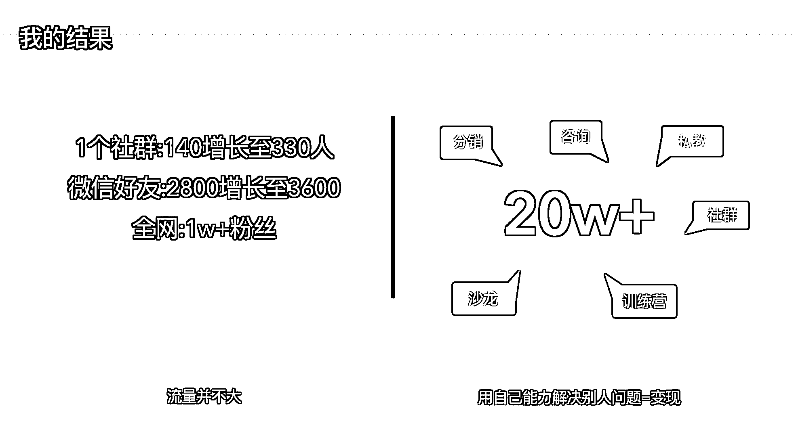

主动收入不能当做唯一收入，要建立自己的多管道收入，在我们面对危机时候能有更多选择。

有个说法叫：鸡蛋不要都放在一个篮子的。

我认为很理想的收入比例是这样：**30%主动收入+40%被动收入+30%资产收入**

事实上，大部分人的收入上不去的原因就在于比例是这样：95%主动收入+5%其他收入

有投入就有产出，没投入就没有产出。

我为什么会提出这样比例的收入方式？

比如主动收入，我的投入时间会占据 80%以上的时间，剩下的 20%时间留给其他收入方式。

而我的主动收入不像在职场发工资，依赖于市场不确定因素。所以，我会寻找一些稳定的被动收入的方式来支撑整个创收。

这个不稳定时期，我更建议考虑卖别人有分销模式的好产品。

比如生财有术的知识星球，这么好的产品带分销，只需要我们发一个朋友圈，在社群、公众号推一下，就有一定的被动收入。

而且这个过程，我们还可以近距离的观摩的整个发售销售过程是怎么做的？

这样的学习价值是不是很大呢？

**其次，人的势能形成需要长期持续的积累。**

当我们刚刚初步涉入这个领域，前期需要大量的时间积累势能，也就是当你还不太厉害时候，用户或粉丝都很容易产生幕强心理。

这个时候可以选择先观摩学习，帮别人做事，建立程碑的结果，形成一定势能。

当我 2、3 月份收入超过了 2w 时候，就形成了一定的势能，之前的一些粉丝就很感兴趣来问我怎么做到的？

举个例子，我 4 月份的收入结构，其中被动收入来源生财有术知识星球的分销带来了 9k 多的收入。

主动收入：咨询+私教（40%）

被动收入：多渠道分销收入+社群（60%）

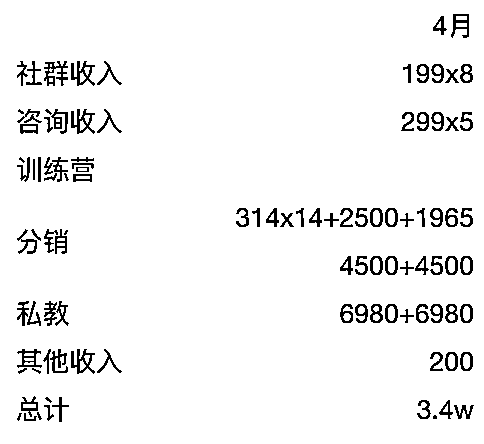

我们需要注意的是，主动收入联动被动收入是一项在未来越来越值钱的投入。

**1、影响力越来越大，思维+系统能力越来越完善。**

**2、资源和圈子越来越优质。**

## 闭环期

## 2 倍销售提升在于梳理 SOP 的流程，提升效率，打造独特高价值

在早期不存在差异化定位，拼的就是同质化下谁最先胜者为王。

一开始都是找到这个领域成功的对标，而不是找差异化。这个底层逻辑就是别人跑通的模式就说明是可行的路径，我们只需要照着模仿。

并在这个领域的垂直标签下，深入打透。快速跑通整个商业模式拿到正反馈。

这个路径就是：

**垂直定位—内容持续输出—获取流量—产品解决方案—销售转化**

从这一套模式中，找到每一个闭环的关键点。

如何差异化竞争?利用田忌赛马的机制。

#### 1、标准化效率，**SOP 优化各个环节的触达效率**

个例样本有偶然性，并不具备持续复制性，要持续实践拿到反馈，从更多样本里持续深挖，找到增长的确定性是什么？

路径 1：公域流量转私域流量

我在公域流量做了 2 个动作，开设 2 个小红书资料号，一周时间迅速承接 100+流量进入私域

其次，标准化路径+步骤+话术，节省精力操作转入私域。

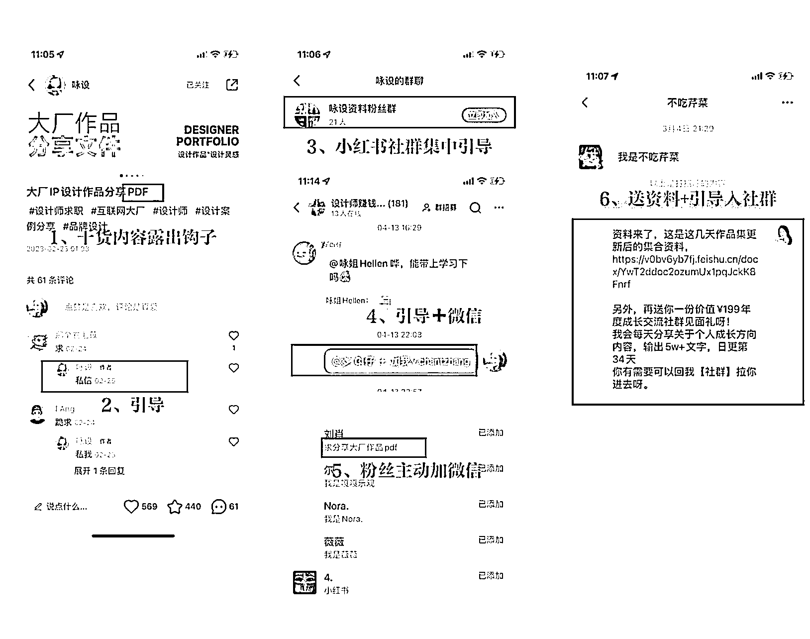

路径 2：梳理私接公的销售路径，在一些节点用标准话术筛选，提升效率

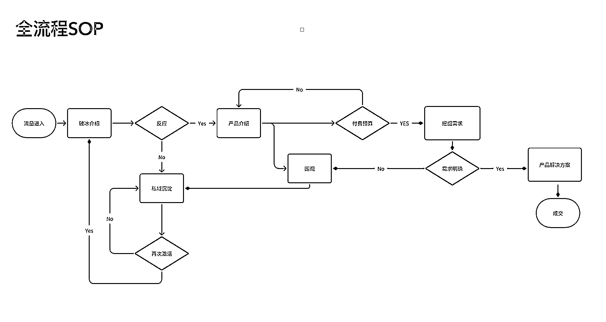

比如，我把公域流量承接到到私域的环节跑通了整个路径，梳理所有流量样本的路径，并在每个节点上进行模版标准化话术，效率提升了 3 倍。

经过多次的触点接触，原来需要 20-30 分钟的多次来回，在流程化+标准化话术后只需要 5 分钟内解决完。

并把流量来源打上标签，放入不同私域的容器中。

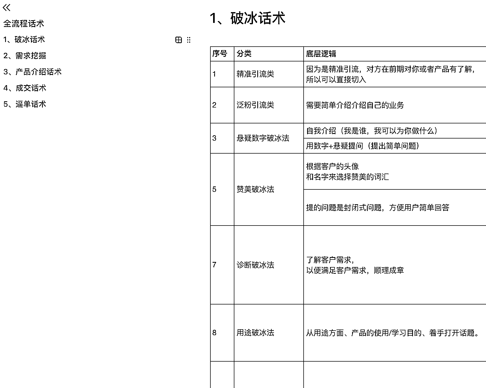

标准话术 1：介绍模版

标准化的自我介绍，承接公域流量。

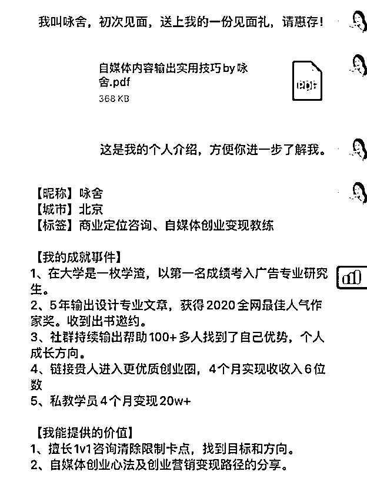

标准话术 2：需求痛点挖掘模版

对感兴趣的用户进行兴趣、需求的深度挖掘。

并通过不一样的情况进行话术打消顾虑。

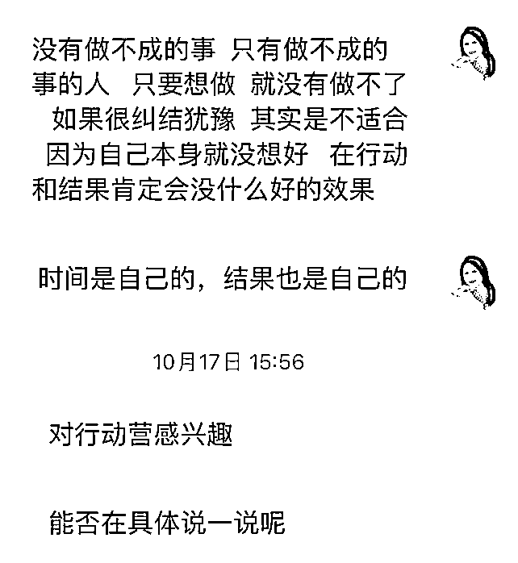

比如结果信任顾虑，通过结果案例塑造打消顾虑。

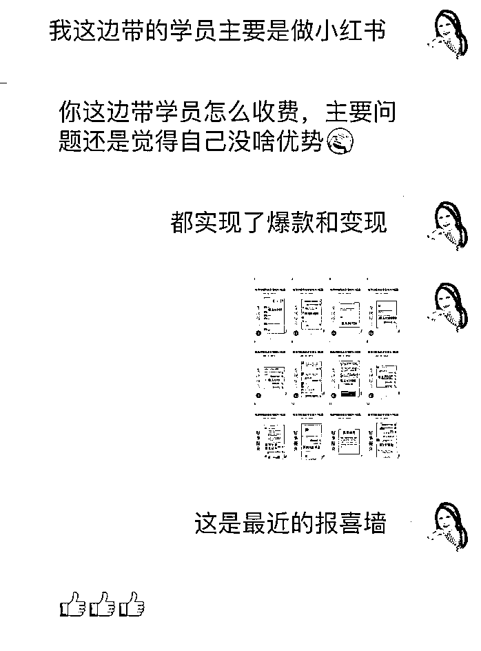

标准话术 3：付费预算模版

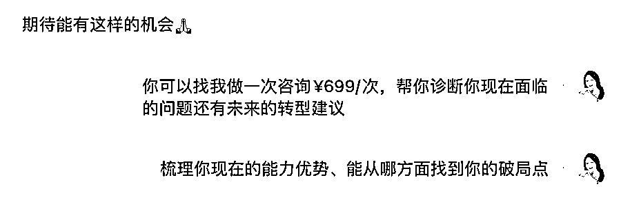

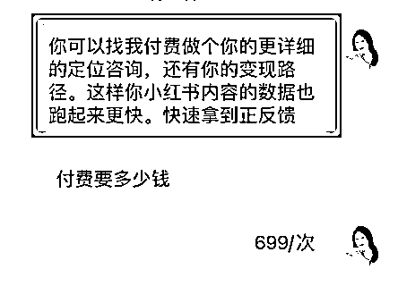

标准话术 4：产品+价格介绍模版

根据客户的需求，进行产品推荐介绍，进行转化。

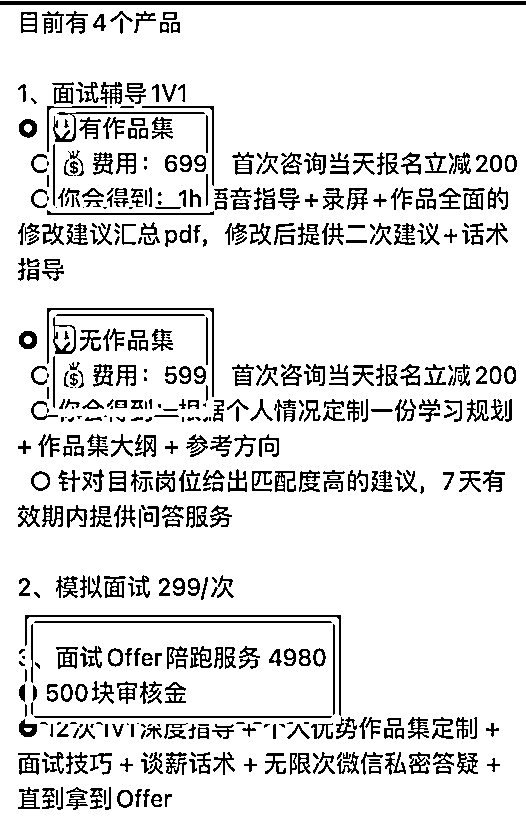

（辅导学员的产品）

最后，不断优化是持续的在关键节点上不断进行的动作，最后找到一套更有效率的规律和方法。

提升效率的本质在于，我们在战略模式中把更大的时间和精力用于提升无法标准化的竞争力。

例如把更多人力用在高价值的产品上。

#### 2、**低成本标品，打造独特价值的非标品**

把与市场中的同质标品变得成本更低，用标准生产的方式去做。

流量产品尽可能降低成本，而不是一开始追求创新差异化，创新就意味着成本越大。

如何找到非标品价值的溢价空间呢？

**首先，挖掘更垂直细分痛点**

进一步分析目标客户的需求，以便能够提供更垂直细分的非标品产品和服务。

通过市场调研、用户反馈和数据分析等方式获取客户洞察，从而制定针对客户的策略和创新方向。

**其次，强化个人核心优势**

孙子兵法中的攻在于胜势，而在市场中竞争追求的是优势足够形成壁垒 无法被模仿超越。

比如，我观察发现个人 IP 的教练不少，我的核心优势是：**内容输出深度+心力能量强大+洞察力准确**

跟我同样做个人 IP 的人，不一定有我强大的心力赋能，也不一定有我的内容输出有直击本质的能力。

所以，我认为专注在优势形成的壁垒，建立不可替代性是拉开同质中形成差异化竞争的核心。

核心优势的建立有这几个方面：

**①经验和成就打造个人品牌故事**

找到独特的成就或经验，可以打造自己的「个人故事」

比如：我通过输出拿到了专业作家，站酷、优设、36kr、得到知识城邦等平台的一些推荐等等不同的结果。

我在过往的取得成绩关键点在于执行力强，而执行力强来源心力和目标清晰。

这些经验成就是我和其他人的不同地方。

**②强化服务成功案例**

我在设计管理职场有近 5 年的管理经验，带团队拿到过优秀的结果，现在创业我定位的是个人 IP 营销教练。

无论管理或教练，身份虽不同，但都是带领更多的人拿到更多的成功结果。

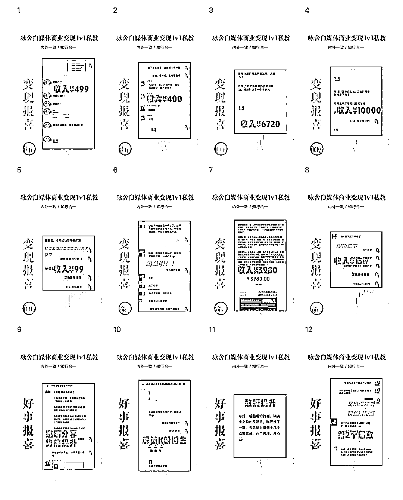

**③个性特点、特殊爱好等**

我有喜欢阅读，并有深度思考的习惯，长期保持输出的习惯。很多人是冲着这样的长期输出对我喜爱。

## 增量期

## 3 倍销售提升在于私域生态布局，多次激活私域存量

在私域通过 4 件套搭建营销事件，进行多次的激活。

我把这个私私域四件套形容成不同容器的角色。

**客服角色：**我们去跟这个来的客户去微信聊天，就是我们充当一个客服角色。

**展柜角色：**在朋友友圈里展示，相当于我们在装修自己产品的一个展柜。

**圈子角色：**我们搭建的社群其实就是建立一个社交圈子，这个社交圈子里面，通过一些这个互动话题、分享内容，来增加信任度。

**活动角色：**最后我们可以通公众号、视频号和直播内容再一次的去激活，去做一些活动福利。

这样私域生态布局完整后，我们再通过增量动作，比如每天发 5 条朋友圈，每天在社群输出，每天跟 5 个人聊天，每周直播的动作，就可以不断的激活私域的用户，就能进一步提升销售转化。

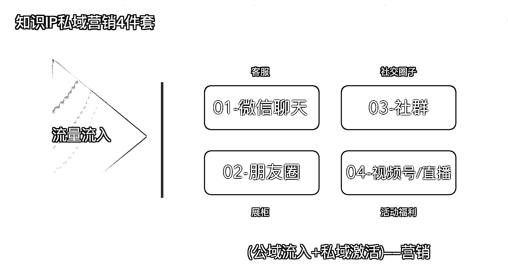

**增量动作 1：每天 5 条朋友圈科学布局文案内容+产品+案例**

梁靠谱老师说她今天的结果是朋友圈日更 5 年，发了 8000 条内容。

所以她也一直强调我朋友圈要每天发够 5 条，量做不到肯定就结果不行。

我每天都要坚持日更朋友圈，通过内容传达我长期持续在做的事，以及拿到的一些结果。

这里有几点需要注意的：

1、朋友圈文案忌讳自嗨

朋友圈小作文不能光自己抒情，引发点赞没有任何意义，还需要表达出你所指向的是什么？

2、要放大痛点+植入产品

痛点背后都是人性的弱点，比如赚不到钱、懒、认知、圈层等。

3、适当的秀肌肉：用户证言+成功案例刺激。

把别人对我们的评价反馈，做出来的成功案例在朋友圈展示出来，并衔接上产品的宣传。这样才算是把反馈变成了朋友圈转化的素材。

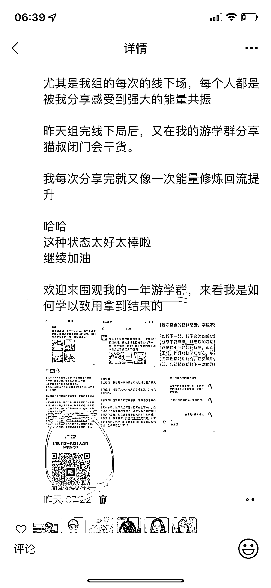

**增量动作 2**：每天社群互动+制造话题+主题分享营销

每天，每月定期在社群发起主题内容，以及持续的内容分享。

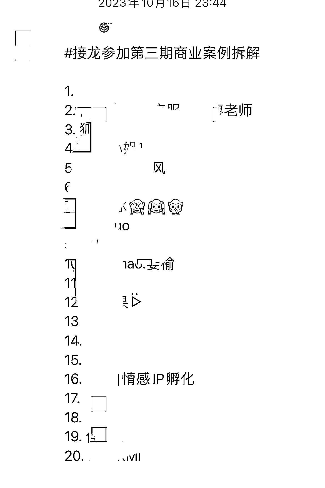

**增量动作 3**：每天跟 5 个人 1v1 私聊+营销

每日 1v1 的聊天激活。通过社群的活动、朋友圈点赞进一步去私聊对方兴趣点。

**增量动作 4**：：公众号更新+视频号定期的直播互动

通过主题的直播分享，来做产品内容宣传。

# 第二部分：私域销售中的一些常见卡点和技巧

## **1、销售成交 6 大卡点**

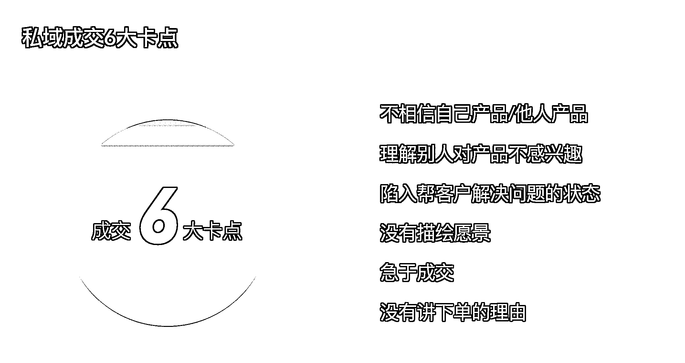

①**不相信自己产品价值，不敢提钱收钱**

大多数人刚做知识付费不敢去卖，或者是不敢去谈钱，会有一些这样的一些卡点。

最主要原因是不相信自己价值，或者不相信别人产品价值。

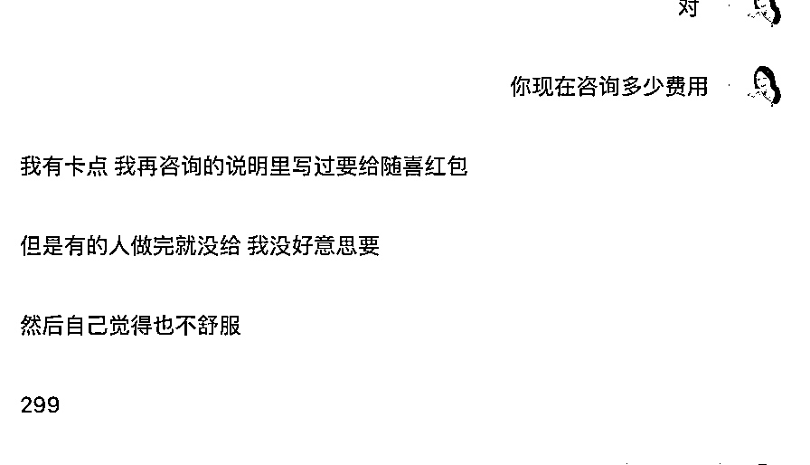

所以，最初时期，我们可以先把自己变成一个学习者，自己变得更好。或者是帮自己的客户变得更好，拿到更好的结果，这样，我们的价值感就会提升了。

我的万元高客单价是第一个学员变现 2w 后，做出的客单价提升。

当帮助到越来越多的人，配得感也会变强，也会觉得自己越来越有价值，当觉得自己很有价值的时候，就敢于收钱提钱。

**②简单理解别人不感兴趣**

如果说客户不感兴趣，那其实我们需要去判断是不是真的不感兴趣。

是买了其他产品？还是目前没有这个需求？这都需要我们进一步挖掘。

我们可以通过社群的一些话题去交流，一些案例分享，就能筛出来感兴趣的用户了。有的人在社群只看，但并不会真的主动来私聊，这个时候，我们可以自己主动去沟通，也可以关心的态度去私聊。就能识别出一些可以再深入进一步推动成交的动作。

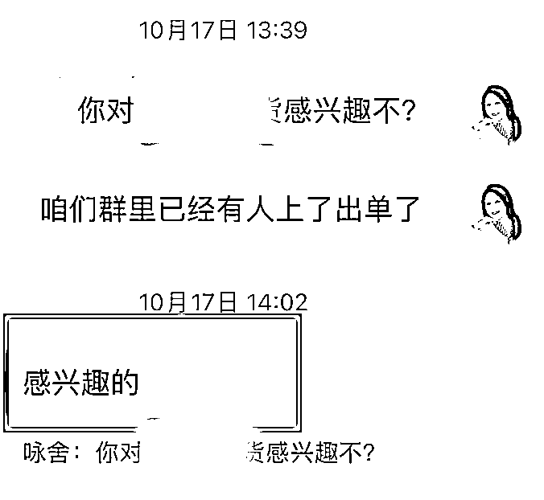

靠谱有个 100%进度条的理念，当客户到兴趣这个 20%环节，我们自己就先卸力，等于又回到了 0 起点。

我们需要进一步深挖根源问题，继续往前推进成交进度条。

**③陷入帮客户解决问题的状态**

有的人遇到来互动的用户，别人提出一个问题，就陷入一个帮别人解决问题的过程了。

我们不要去过度的服务，更应该要明确边界在哪里，哪里是帮忙回答一下的？哪里是比较复杂需要梳理来付费咨询的。

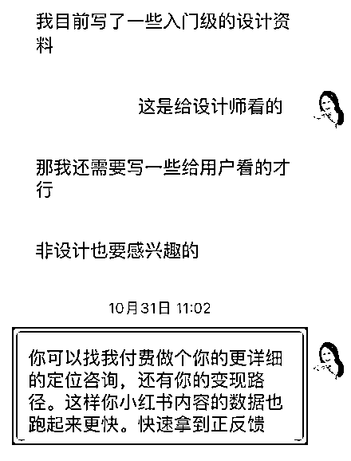

**④没有描绘愿景**

在沟通中放大未来愿景，所有的人都希望自己能最快出结果。未来享有变得更好的生活，而不是更苦逼的生活。

我们可以把自己的结果，还有学员中类似的案例找出来，是如何变得更好的。

也可以通过行业趋势描绘，比如 AI 方向的趋势，视频电商等一些趋势给客户描绘到未来的一个发展趋势。

**⑤急于成交被带入框架**

当别人问这个产品的时候就很容易陷入到一问一答的过程中，处处显露出了急迫想赚钱的心态。而是跳出对方问的框架，稳扎稳打的去挖他的核心需求。

大部分人在前期挖挖需求的时候容易卡住，本质原因就是样本练少了，我觉得就是要去谈多去练，不断的复盘，就能找到痛点在哪。

需要注意的是，痛点不要太多，只需要精准抓到核心问题就可以解决。

比如收入要么是流量，要么是定位不清，要么是产品体系转化问题。只需要抓到其中一点就可以提升成交率。

**⑥没有讲下单的理由**

谈到最后，如果还没有成交。

那就是我们没有给给到别人一个买入的一些理由，他还有一些疑问还没有解决清楚，我们需要进一步去引导他说数出来疑问。

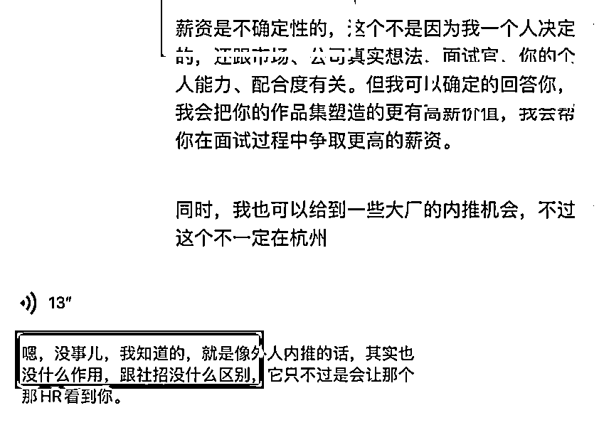

比如，这是我一个私教学员谈单过程。没有下单原因是因为要拿到确定性 offer 薪资的回复。

这种确定性的回复我们需要判断是否符合。

其次，可以给一些下单的限时优惠条件。

比方说当天当天报名就可以立减 200 块钱，额外赠送一些福福利。

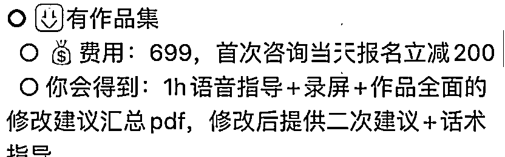

## 2、洞察客户 4 种决策的心理

很多人在跟用户谈的过程中遇到“我再考虑一下”，“价格太贵了”“你有什么差异”“有哪些结果”“已经买了别的课程”

很多人看到就会束手无策，我来给大家一一拆解对应的话术应该怎么应对。

转化就在临门一脚的关键回应对策里。

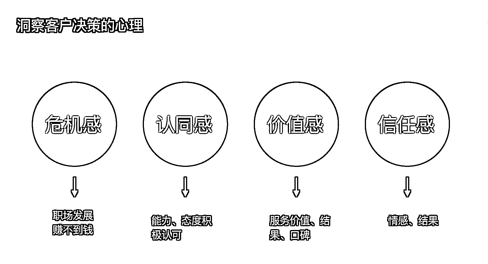

①危机感决策

深入挖掘用户焦虑危机的痛点：

是不是找不到职场发展方向了？

越来越找不到未来赚钱的方向了？

说到底，都是对赚钱的焦虑。

②认同感决策

肯定对方的能力结果，还有对方的态度，每个人都是想来赚到更多的收入。

已经有了这么好的基础，其实就在于最后自己肯再往前迈进一步，做出这样的行动。

③价值感决策

塑造服务的价值，结果，以及口碑的传播，减少决策的犹豫

当多个人都在说好的时候那就说明是真的很不错。

④信任感决策

增加个人品牌故事，塑造鲜活的人格。

再小的个体都有个人品牌。

## 3、不同话术回应策略

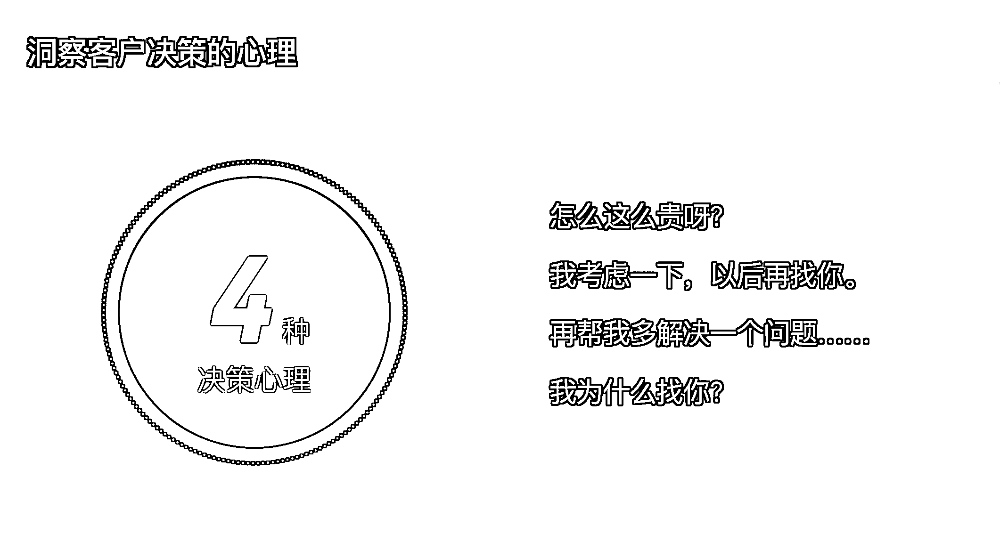

策略和技巧 1

客户说“太贵了”—可以用锚定效应+算账”

在销售过程中可能会遇到很多人会说 1w 多太贵了，那这个时候我们可以突出稀缺价值，比如背书比较稀缺，福利比较多，结果很好都可以作为价值的突出点。再结合同行，同类的产品都是 5w 的价格，相对来说这个很实惠。

其次，帮用户算笔账，比如 365 元的社群，一天 1 元钱，就能得到价值 3w 的干货。

这都是可以减少客户决策犹豫的时间，说到本质上都是站在客户角度作为他的嘴替，给她一个下单的理由。

另外需要注意的是，我们遇到的人觉得太贵了，还需要结合对方的收入、群体来判断，可能她的收入情况并不是这个高客单价的用户。

遇到这样的情况，我们再从高转低的销售，反而更容易谈成低客单价的产品。

所有的核心，都是通过在跟客户反映的互动中洞察需求识别需求。

策略和技巧 2

客户说“跟别人有什么不一样”—可以用差异化突出价值

有的人会说我学了很多没有效果，那我们就会告诉他这个学习的特点是什么？我们就可以介绍往期服务结果和服务特点。

在这个客户疑虑的时候，我们要进一步去追问疑虑什么。有能办法帮他怎么去解决？

是因为自己执行力不够呢?是因为自己的信念感不强了。

比如这个聊天中，我刻意的强调有老师带着做，就解决他的疑虑。

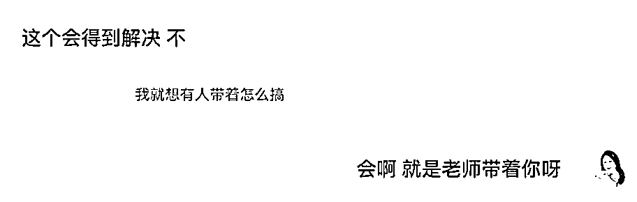

策略和技巧 3

客户说“我买了别的课程”—可以用反问，进一步加大痛点

还有一些客户，他可能会有一些比方说我买了别的课程呢。

我们可以问一下他：学的怎么样呀？有结果吗？为什么没有没有拿到结果？

有一个客户问我的时候，他在他学了很多，报了很多课，没有拿到结 果，他说他报的课都是那种录播课。

我就告诉他，是自己执行力，需要有人来来手把手指导取得结果。

策略和技巧 4

客户说“我考虑一下”—识别客户类型

在销售过程中还需要判断客户是什么类型，我们可以多去去翻一番对方朋朋友圈。大致能判断对方是什么类型的人，

思考型客户，不要过多逼单。

主动型客户，讲同类客户结果。

这里面有个很关键的点，我们在介绍产品的时候，千万不要去介绍一大堆，比方你的产品有 123456789 卖点。其实别人根本就关注不到的，其实我们只要去挖到他的核心的诉求，用其中的一条解决他的核心诉求就好了。

而不是这么好的圈子，有这么好的老师，这可能真的不是他核心关注他，关注的是是不是自己能够拿到结果，你就告诉他 。

## 最后一个反思总结：

经过前面那么多的方法和招术，如果还没有打动到客户的话，那可能就是我们需要去总结这 3 点。

1、是不是自己做的还不够好，这个势能还不够强，还需要持续的提升。

2、是不是我们的朋友圈还这个门店展示量还不够，是不是自己经验不够多，现在案例还不够多？

3、是不是别人对你信任还没有那么强。

4、是不是痛点还不够痛点。

没关系，那未来时间还很长，那就慢慢的把这些这个客户在我们朋友圈里面，把它当成朋友，等到有需要的时候，我们再给他们去解决问题。

私域营销最核心的一点就是不被删除，不惹人讨厌，不树敌，真实的做自己。以上希望对你有启发

**做个人 IP 这件事很让我兴奋的有 2 点：**

（1）这是一个有很大的提升空间的方向

这一年下来我所有的不断跑出想法—落地的闭环验证，梳理路径找关键点优化，我都发现还有很大的增长空间，这让我现在看不到天花板在哪，有很强烈拿到结果的那种渴望。

（2）遇到更精彩的自己

这一路的披荆斩棘，让我遇到了一个精彩绝佳的自己。

在事上学，事上练，事上做，不断修炼人生厚度宽度长度，自己变得更好，帮助更多人过上更美好的生活

**贡献越大价值越大。**

全文链接

https://v0bv6yb7fj.feishu.cn/docx/BOyddnSIWoPdSLxHO2vcQUWfnYb?from=from_copylink

* * *

评论区：

🔥逆熵增者💰 : 感谢咏舍分享，对我很有帮助❤️

* * *