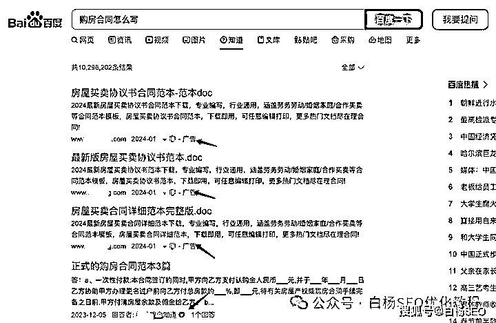
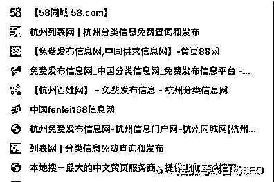
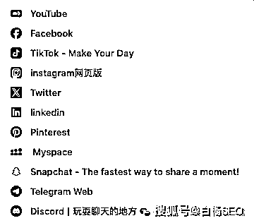
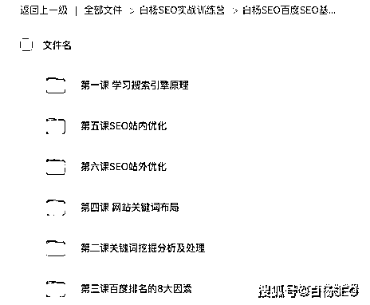
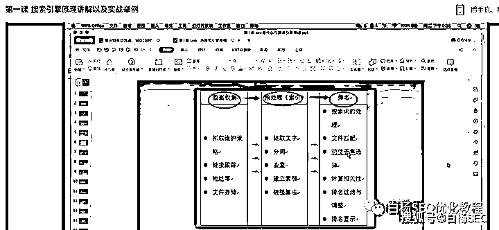
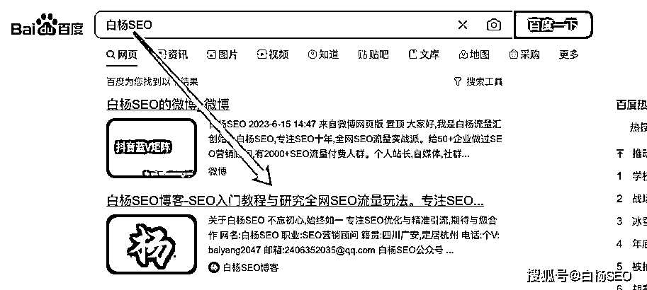
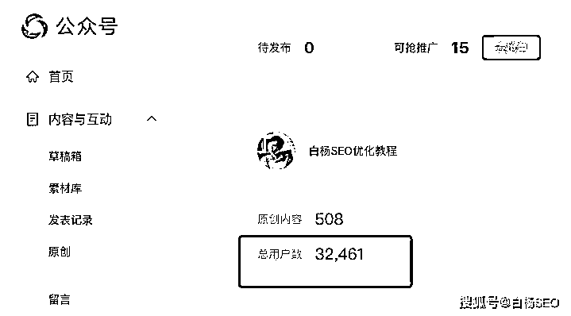
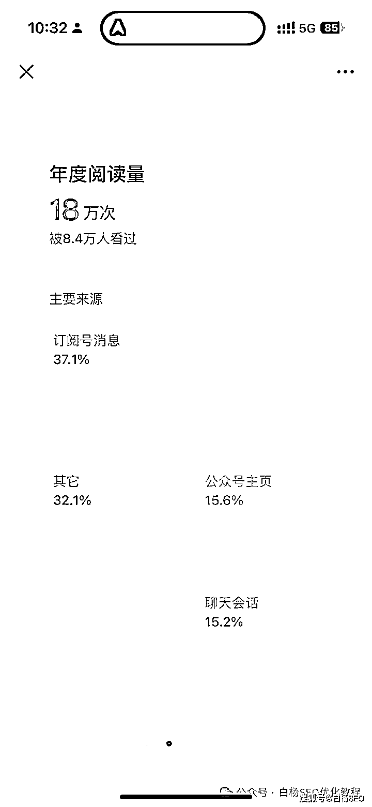

# 2024 年搞网络推广哪个平台流量更好？

> 原文：[`www.yuque.com/for_lazy/thfiu8/zbz1iumyb0a1rld8`](https://www.yuque.com/for_lazy/thfiu8/zbz1iumyb0a1rld8)

## (17 赞)2024 年搞网络推广哪个平台流量更好？

作者： 白杨 SEO

日期：2024-01-19

**目前主流网络推广平台有哪些？**

白杨 SEO 这里提前说下，这里网络推广主要是指企业或个人推广自己的产品或服务，与在网络上售卖还是有一点区别，所以主流的电商平台均不在网络推广平台里。你可以先看看我两年半以前写的另一篇：[白杨 SEO：做网络推广时，如何选择合适的平台与怎么分配时间？](http://mp.weixin.qq.com/s?__biz=MzU2NTQzMzA4Nw==&mid=2247490621&idx=1&sn=4fb7b1cb74f1637c643766d03fea4980&chksm=fcba9badcbcd12bb5587ced2c7cecc9edd223e50b579d7c43495f2d58f44856c03013691ebb3&scene=21#wechat_redirect)

**从国内来说渠道有：**

1、百度系

1）百度免费推广渠道：百度知道、百度贴吧、百度文库、百度经验、百度图片、百度百科、百家号、好看视频等等。

PS：虽然上面写这些可以去免费推广，但是比如百度百科你自己很难做上去。比如百度知道前面也有广告，同时花钱认证账号排在前面等。

2）百度付费推广渠道：百度竞价、百度爱采购、百度惠生活等百度各垂直领域付费产品。

3）做网站获取百度上用户自然搜索流量。

2、腾讯系

1）QQ：QQ 好友，QQ 群、QQ 空间、QQ 短视频等。虽然 QQ 是很古老的产品，但谁没有一个 QQ 呢？

2）微信

微信生态免费渠道：公众号、视频号、小程序、问一问等

微信生态付费渠道：广点通、微信朋友圈广告等 3）其它腾讯企鹅号 QQ 浏览器里搜狗搜索

3、字节系

1）头条，今日头条 APP、网页版，免费付费推广都有。头条里免费头条号，付费巨量头条信息流投放等。

2）抖音，短视频一哥，免费自己发抖音短视频，做直播。付费有投 dou+，有投千川等等。3）其它，西瓜、懂车帝、火山小视频、头条百科等等。

4、其它主流垂直的

1）短视频领域二哥或三哥，快手

2）热门热点第一手平台，微博

3）生活方式女性主流平台，小红书

4）问答社区，知乎

5）中视频学习平台，B 站

6）宝宝宝妈平台，宝宝树

5、传统的 B2B、分类网站

58 同城、顺企网等。

**说说国外的渠道有：**

1、谷歌系，谷歌网页搜索，谷歌 SEO，谷歌付费推广，谷歌 ADWORDS 等。

2、社媒系，FACEBOOK，X，YOUTUBE、TIKTOK 等等。

**白杨 SEO 的个人建议参考**

其实互联网上的网络推广渠道太多太多了，白杨 SEO 不可能全部给大家列出来。即使列出来，你也不可能有精力全部去做完！2024 年做网络推广选哪个平台流量更好？我们一定要有所取舍，才能做精，做好！

如果你是做国内推广的话，2024 年最主要的关注平台如：小红书、抖音、视频号、百家号、公众号。如果只选一类的话，那就是短视频平台和直播。

如果你是做海外推广的话，2024 年最主要关注的平台是 google、FACEBOOK、YOUTUBE 和 TIKTOK。

**对于 SEO 新人或者从其它行业想了解 SEO 这个的人来说，**

白杨 SEO 建议你，一定一定要把 SEO 基础学牢靠，比如关键词挖掘分析，比如搜索引擎基本原理等如何学习？白杨 SEO 这个公众号菜单栏上有一个 SEO 学习点进去免费自学。

如果你想系统学习一下，可以看白杨 SEO 之前的网站 SEO 视频课程，如图。

**对于 SEO 老人来说，**

如果你本身网站做得还可以，变现也还可以，你可以继续做网站，不管是中文站还是英文站。因为**剩者为王**。越多人离开，竞争不相对低了嘛。至于新人加入，根本不用担心哈哈哈。

如果你虽然在 SEO 行业做了好些年，但是在网站流量这块做得并不好，建议你不要再只盯着网站 SEO 这块了。适当学习一些新的平台 SEO，或者甚至转型去做推荐流量，与时俱进，有可能比你现在还好。

拿白杨 SEO 我自己实际举例来说，如果只是在网站 SEO 行业，尤其百度 SEO 上，我的博客就算再用力，最多做到权 2 权 3（因为我不想做一些与我网站定位不符的不相关流量），即使做到这样，依旧会在某些人眼里不行。

但是，我从 2018 年转到微信生态公众号，所有人不看好公众号，从 0-1 写原创，如今已经有 3 万多关注粉丝，在这个行业有一点小知名度，这是不是选对平台更重要？如图：

上图 2 是我 2023 年一整年的数据，虽然比不上其它行业的大牛几百万上千万阅读，18 万的阅读，去年总数新增五千多人（当然取关也有很多）就是最好的案例是不是？

但即使这样，我依旧错过了抖音 SEO 上的第一波机会。我可能是最早提出【抖音 SEO】这个关键词，但我依旧守着在微信生态。在抖音上，有一个同行把 SEO 这个关键词曾经做到 TOP 前三，吸引的粉丝量比我公众号做到 TOP 前三要多得多！

所以我想跟大家说，**选对平台，同样的努力，可能会让你事半功倍！**2024 年如果让白杨 SEO 重点只选一个平台和赛道的话，一定是**视频号平台和直播**。

对了，**私域流量**这个词会在 2024 年被所有人提起，虽然这个词已经算老了。还有社群什么的，甚至 2024 年知识付费等也许都不再那么火热，反而沉寂多年的**免费社群方式**可能会卷土重来！

当然，所谓免费社群方式，有可能会成为那些做私域流量或者所谓打造个人 IP、联合共赢他们最基础的私域盘子！你相信吗？

即便如此，白杨 SEO2024 年继续坚持自己已经运营六年的付费社群模式，因为我一直坚信：只有经过筛选才更有价值，往往免费的才是最贵的！你怎么看？欢迎留言，说说你的看法~

**作者介绍：**

白杨 SEO，专注 SEO 十年，全网 SEO 流量实战派，对互联网精准流量有深入研究。全网同名个人品牌：白杨 SEO。

**相关推荐：**

[白杨 SEO：如何在抖音搞到 TOB 客户流量？](http://mp.weixin.qq.com/s?__biz=MzU2NTQzMzA4Nw==&mid=2247498569&idx=1&sn=1d361984715bfab89e29aaad7348fd8a&chksm=fcb97cd9cbcef5cfad44a3c3e07838c8550db53617cc170907ccfb39d499d5d108c91bb47b4c&scene=21#wechat_redirect)

[白杨 SEO：视频号 SEO 是什么？怎么做关键词排名和视频号推广？【必看】](http://mp.weixin.qq.com/s?__biz=MzU2NTQzMzA4Nw==&mid=2247493540&idx=1&sn=6626369c7a895e557783967d99b3dfe9&chksm=fcb96034cbcee922378e2fd2e1b6a2a9aa06f1affef44b805dc4aaea4e0d3bc07335543434c6&scene=21#wechat_redirect)

[白杨 SEO：旅游行业小红书引流怎么做？免费 SEO 手段+付费投放结合](http://mp.weixin.qq.com/s?__biz=MzU2NTQzMzA4Nw==&mid=2247498923&idx=1&sn=3eead2227985241ce4b52d1f049293c7&chksm=fcb97b3bcbcef22dd01562261a287e201ba22026eee28ea62a5bffda5f7a690006d3f6c7a29b&scene=21#wechat_redirect)

* * *

评论区：

暂无评论

* * *