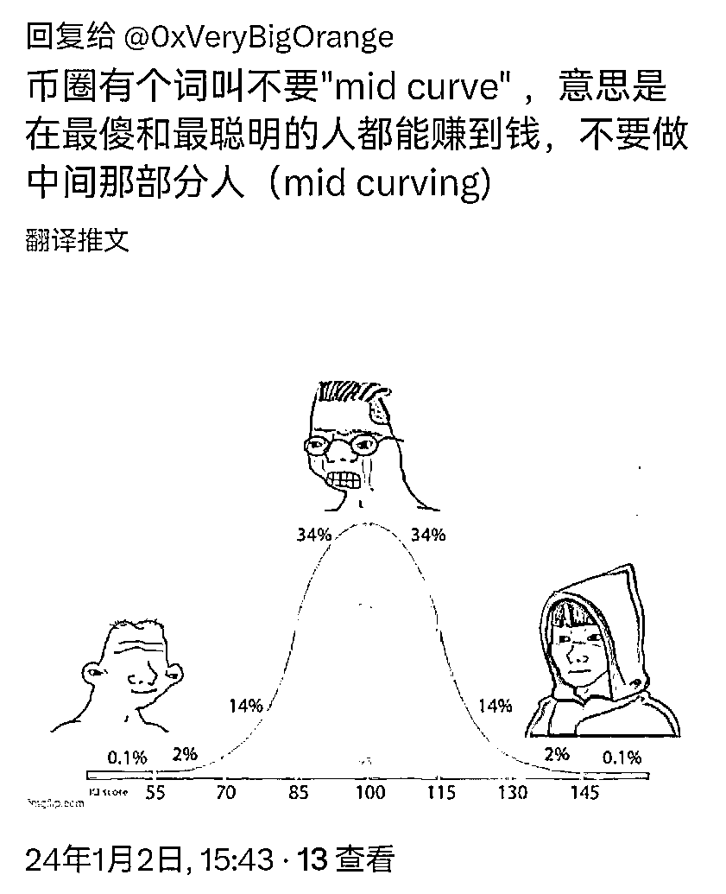

# 在最傻和最聪明的人都能赚到钱，不要做中间那部分人

> 原文：[`www.yuque.com/for_lazy/thfiu8/ki3rkh526xc2hmeb`](https://www.yuque.com/for_lazy/thfiu8/ki3rkh526xc2hmeb)

## (22 赞)在最傻和最聪明的人都能赚到钱，不要做中间那部分人

作者： 亦仁的收藏夹

日期：2024-01-18

在最傻和最聪明的人都能赚到钱，不要做中间那部分人(mid curving)

* * *

评论区：

caozhao : 老大，没看懂哦
江吉仪-墨鱼 : 我个人理解是：最傻的是老老实实买币，屯币的，最聪明的是搞量化，发币，坐庄的。中间的就是炒币，加杠杆。

* * *