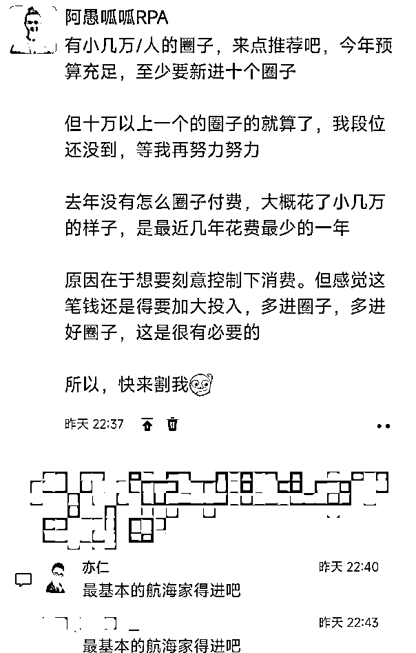
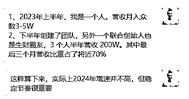
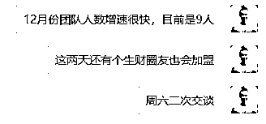
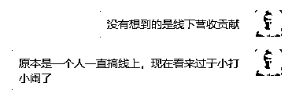
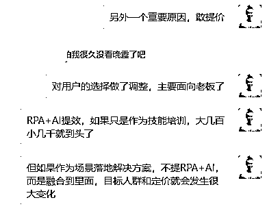
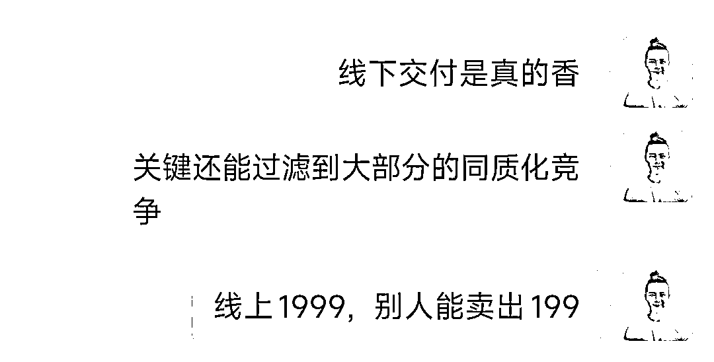

# 刚进航海家，亦仁拷问我：你今年目标是去年 4 倍，背后的信心和路径是什么

> 原文：[`www.yuque.com/for_lazy/thfiu8/ygqt8ek4sm6oa349`](https://www.yuque.com/for_lazy/thfiu8/ygqt8ek4sm6oa349)

## (精华帖)(249 赞)刚进航海家，亦仁拷问我：你今年目标是去年 4 倍，背后的信心和路径是什么

作者： 阿愚呱呱 RPA

日期：2024-01-25

如题。讲实话，遇到这个问题，我当时就特么有点慌了，真慌了哈。但过了一天，我决定尝试回答仔细一些，通过更详实的文字来梳理我的答案。还有，下周的年会上，我也要跟团队成员去阐述我的思考。就借此机会一并完成吧，这也可能是生财有术里面非常奇葩另类的一篇贴子吧

首先，向各位生财圈友问个好。大家好，我是阿愚呱呱。昨天我终于加入了生财有术航海家俱乐部啦！

生财有术航海家俱乐部，我很早就向往了。我是真的需要这么一个圈子。主要两个方面需求：商业认知和信息筛选。我们团队偏向技术，而且我的合伙人有霸夫（也是生财圈友）直接就是 23 年程序员背景（三年前他说有 20 年开发经验）。我之前之所以一直没有加入航海家，主要是两方面原因吧

1.  一方面是生财有术航海家俱乐部确实太神秘了。我印象中好像偶尔看到过一两次。我甚至忘记了还有这么一个地下组织的存在。所以确实没有想起还有个航海家俱乐部要加入。

1.  另一方面是生财有术航海家俱乐部确实太神秘了。一月份我进入三个大几千到将近两万的圈子。航海家俱乐部是第三个。我发了一条朋友圈，亦仁老板带动了大量水军发起了饱和式评论，下面一连串「基本的航海家得进吧」。然后就没有下文了。这时候，不应该是万能的鱼丸发个私信：是靓仔哦……然后一鼓作气顺势把我收了。这是真的可行的，我发了下面这条朋友圈之后，有好友私信我推荐了他的圈子，我就顺势加入了

加入一个圈子，我很少这么认真去填写加入申请资料。估计花了我半个小时。也很少那么认真发个人介绍。我在群里发的个人介绍如下

【姓名】阿愚呱呱

【坐标】长沙

【自我介绍】

1、鹅有招创始人，提供 RPA+AI 自动增效和矩阵获客解决方案，目前服务 20+矩阵团队

2、国内最大 RPA 运营自动化社群主理人，生财有术 RPA 提效航海教练

3、2023 年下半年营收 200W，计划 2024 年做到 800W

【我能提供】

1、RPA 自动增效服务（培训+社群+定制）

2、图文工厂服务（培训+工具+代生产）

3、企业级自动增效深度实施落地服务

【核心需求】

1、给 10 到 100 阶段的合作伙伴深度实施自动化

2、承接矩阵团队图文、视频的自动化生产

3、推荐 5K 到 5W 高质量的圈子给我，谢谢

【链接我】#公众号：……我的免费知识星球（人数 2900+）链接……

免费知识星球人数现在需要修正了，已经 3067 人了

在这个地方我插一句，免费知识星球很重要，很重要，很重要！尤其是做个人 IP 的还在早期的伙伴，那么一定要搞个免费知识星球。还有做个人介绍的时候，记得加上你的星球链接啊，是真有用

发完个人介绍，红包一发，立马秒光。过了一会，亦仁大佬抛出了一个灵魂拷问

讲真，当时我大脑立马进入了漫无边际的想象，想到了洋洋洒洒很多内容，最后就是回复了两条消息

第一条是数据回溯，第二条是总结。对，增速是真的不高，但稳定节奏是真的很重要

我前面提到了我一个人单干的时候，营收月入众数是 3-5W。但少的时候，也有不过万的。多的时候，一周就十万了。但这两种情况，都不是常态。我更喜欢现在的状态。说个很土鳖的话：做大做强，2024 年要干 800W 营收

后面，我又陆陆续续做了一些细节补充

虽然当时回复的比较零碎，但信息线索还是比较清晰的。但确实少了很多细节，我再补充下

1.  **历史数据参考**。为什么重点说下半年的数据，尤其是后三个月的数据。6 月份和有霸夫（也是生财圈友）组队创业，开启新的一段创业之路。6-9 月份是磨合阶段，营收呈增长态势，平均每个月 20 万。9-12 月份营收继续上涨，平均下来每个月四五十万

1.  **团队能力增长**。6 月份之前，团队 1 人。6-9 月份，团队 2 人。9-12 月，团队 3 人。12 月，人数直接飙升到了 9 人。实际上在我写下这篇文章的时候，团队确定的人数是 11 人了，新增的两人春节后正式到岗。当然，人数的增加跟团队能力增长完全不是一回事。我想说的是，团队人员的增加，确实极大拓展了我、有霸夫的能力边界。另外，对于我们这种口号就是「自动增效鹅有招」团队来说，每增加一个人，还是非常谨慎的

1.  **线下贡献放大**。说实话，我之前完全没有想到我们搞线下的能力。这里得重点提下 9 月份正式加入的成员小糖果。在 9 月份之前，小糖果已经是远程的形式参与团队协作了。作为团队中唯一一个有线下运作经验的人，她的线下能力得到发挥。11 月份我们组局了第一场会员见面会，人数 20+；12 月份组局了生财有术长沙见面会，人数 70+，创下了生财有术长沙站人数新高；1 月份开启了线下第一场图文工厂面授。到目前图文工厂报名人数 110+

1.  **目标人群调整**。实际上，创业者、负责人一直是我们的客户主体。但我前三年，一直没有下定决心切这块人群。花了很多功夫想把技能课程和技能训练整的更丰富，一直想做好职场人的技能培训。无意中，我们设计了一个会员，名字就叫老板会员。现实很残酷，老板会员贡献了起码 80%的收入。 我再傻，也知道这意味着什么了，咱得向现实低头啊。以后就安安心心主做老板们的服务

1.  **产品设计重构**。说是向老板们服务，但产品设计得跟上啊。提个小插曲。有段时间，我们打卡训练推的很猛。会员价值感确实爆棚了。有老板会员就直接跟我们说，训练营很好，别让他们参加打卡训练营了，那是给「精技会员」的，得重新设计下怎么交付。嗯，钱不是问题，有适合他们的交付，他们就掏钱就行，他们哪有花了钱就不想再「遭受打卡的罪」。我去，还有这种好事！听会员的话，吃饱饭。于是，我们很快推出了图文工厂、视频工厂、流量工厂、操盘手 RPA 等产品。现在，产品设计与交付，我们时刻提醒自己，要有会员视角

经过 2023 年的历练，终于走过了 0-1 阶段，我们目前属于 1-10 阶段的创业。2024 年到底怎么做到 800W 的营收。我想，答案不仅仅在于我 2024 年如何规划，答案更应该从 2023 年看出端倪

对于 2023 年做的作业，以及 2024 年要发力动作或方向，我从产品/交付、流量/获客、运营/转化、公司/团队这四个方面做了梳理与阐述。第一次写这种大的度梳理，很多地方思考的也不是很清晰，但贵在真实，至少反映了我当前的思路。如果能给其他圈友一些借鉴帮助，那是我的荣幸。同时，也请各位圈友多多指正，

# **一、产品/交付**

## **1、产品升级**

① 项目名称从「RPA 帮」到「AI 帮」再到「鹅有招」。RPA 帮：十倍高效运营要有 RPA 帮。AI 帮：帮职场人从 AI+RPA 中受益。鹅有招：自动增效鹅有招

② 我们主要帮客户解决两大问题：增效问题、引流问题。从而引申出两大类解决方案。第一类是最普适性的自动增效，把人从重复的工作中解放出来，最佳解决方案就是 RPA+AI（装逼过头的时候，我们有时候会吹没有人比我们更懂 RPA+AI）。第二类是增效在引流获客场景的深度落地。我们陆续推出图文工厂、视频工厂、流量工厂等解决方案

③ 服务产品形态从最开始的单个课程，慢慢发展到了课程、训练、社群、工具、见面会、面授、深度定制。很多人震惊了，没想到我们一个小小的干线上的团队，干起线下来，非常的猛。组局了生财有术长沙最大的一次见面会，开启 了 2024 年第一场挤满培训室的图文工厂面授……

④ 我们可能是国内最早一批落地 RPA+AI 的团队。在 2023 年 2 月份，我就推出了 RPA+ChatGPT 超级写手，直接就打爆了。下面是当时受生财官方邀请发的分享帖

ChatGPT 航海启动当天，我开启 RPA+ChatGPT 的项目，一周创收 7W

[`wx.zsxq.com/dweb2/index/topic_detail/181125548182442`](https://wx.zsxq.com/dweb2/index/topic_detail/181125548182442)

我本人在三年前就开启了 RPA 项目创业，是生财有术 RPA 提效航海教练，也是生财有术圈第一位分享 RPA 内容的人。大概半年后，才有其他圈友陆续发帖

⑤ 2024 年，我们下决心继续下沉做深。一方面会建立更系统的 RPA+AI 解决方案，主要通过培训、社群、工具来完成交付。另一方面加强线下部署。包括全国各大城市进行面授宣讲和走进大客户现场深度服务

## **2、图文工厂**

① 作为 RPA+AI 的一个大型落地解决方案。我们赶在元旦节前，在 12 月 29 日正式对外发布推文，开启图文工厂面授计划

② 虽然非常仓促，从发布到正式面授也就隔间两周的时间，一般做面授，需要提前两个月。但效果远远超出预期。真的是爆了爆了

③ 图文工厂将会是我们的产品矩阵中的重要构成。它的兄弟级产品是视频工厂，父级产品是内容工厂。是我们对外进行面授的第一个大型解决方案

④ 2024 年，将推出不低于 12 场图文工厂面授（还会启动视频工厂、流量工厂）

## **3、工具**

① 发布了两款小红书笔记批量生成工具，图文版和导图版。都在疯传中（可能是我们自我感觉超出预期了）。这些工具都是服务于我们提供的解决方案。虽然有零售和代理，但目前我们没有把精力放在单个销售上

② 整理上线了 RPA 机器人，多达 60 个，对小红书、抖音、ChatGPT 等多个产品实现了自动化驱动

③ 工具受欢迎的秘密就在于：从会员中来到会员中去，简单可信赖。当然，说起来简单，做起来实际上也不难。我们也踩过不少坑，最终换得轻轻松松说出 So Easy

④ 2024 年，会有多款特别棒的工具和 RPA 机器人上线

## **4、 训练营**

①  从 6 月份到 12 月份，开展训练营场次 70+

② 训练营是很好的交付价值的手段，也是提升会员活跃度和满意度的重要方式

③ 2024 年，会控制训练营场次，大概是 100+。同时提出更高的品质要求

## **5、线下交付**

①    互联网团队普遍有个不足，就是对线下的不重视。或者虽然重视，但不敢搞线下。这是要不得的。我们的感受是，搞了线下，就发现了另外一片天地。当然，收入肯定肉眼可见的增长。嗯，星辰大海，等我们去驰骋

② 线下交付，除了能增加收入。本身也是提升客户获得感的重要途径。线上聊千遍，不如线下见一面。还有开展线下活动，你能够得到更好的反馈，这些反馈，很多在线上永远都拿不到的

③ 2024 年，我们全年要搞不下于 20 场线下见面会和面授

## **6、知识星球**

①   建议大家重视知识星球，应该说是当前最合适做社群内容沉淀的工具。还有个特别管用的用法，就是你一定要搞个免费星球，尤其是想做超级个体的朋友。绝逼要搞个免费星球啊

② 我个人手头上有 5 个知识星球，还有两个星球码。一个免费知识星球人数 3000+ 人。这个星球是 2022 年搞的，但由于没重视且把星球迁移到小鹅圈。 我得承认，这个策略有问题。一个付费星球人数 650 人。2023 年，人数不增反减。2024 年会重开，会有重大升级动作

③ 之所以会宣布迁移到小鹅圈，是出于 ALL IN 小鹅通的想法。现在看来，这个运营策略的调整，实际上是走了一些弯路的。不过弯路也算数。ALL IN 很美好，但现实是搭配着用才是最合适。大概会在 2024 年 3 月 1 日重启知识星球，敬请期待

④ 2024 年，要干到 5000 个星球用户（这个真的是很有挑战了，主要是产品策略上会做很大的调整）

# **二、流量/获客**

## **1、私域**

① 我们目前有 16 个微信号，好友总计 3W+。但说实话，对我们来说，这个数量远远配不上我们的实力。总之，就是有能力但没有把能力变成行动

②   加好友是我一直坚定的要去做的事情，是永远正确的做法。但绝大部分打工人很难理解加好友的意义。我个人主要管理 2 个微信号，总计 1.2W 好友

④ 2024 年，计划做到 30 个微信号，好友做到 10W

## **2、公域**

①   我们目前有账号 200+，干的就是矩阵霸屏的活。2024 年，绝对是我们大放异彩一年，请各位等着看我们的漂亮结果

② 之前我们并没有下场，主要给客户提供支持。但既然我们有这个技术，完全可以把自己的矩阵霸屏搞起来。公域开始有了成效，RPA 已经实现了霸屏

③ 建议小白、素人，不要有啥 IP 情节。多干活，多发内容、多搞账号、多抄爆款，对，这样就行了。咱们普通人就只能干干这些简简单单的

④ 2024 年，计划做到 1000 个账号，要实现多个小品类霸屏

## **3、公众号**

①   我们目前有 16 个公众号。我个人主理的公众号粉丝在此时此刻 6743 人。虽然没有认认真真去搞，但确实很省心。公众号引流到转化，简直不要太丝滑

② 建议大部人先从公众号做起，虽然流量上不会有泼天的富贵。但你每认认真真搞的每一个流量，你是有大概率的机会做转化的。但如果是抖音、小红书，很多人很难解决公域到私域的问题

③ 2024 年，计划做到 50 个公众号，要搞大，要有几个大号，也要有矩阵号霸屏

## **4、视频号**

①  我们目前有 12 个视频号。这个数量目前远远不够。毕竟我们不是做什么 IP 账号，就是靠量取胜

② 视频号引流转化，机会是真的很大。昨天亦仁老板还在航海家提了这个事情。我们去年无意中尝到了甜头。今年会放大放大再放大

③ 2024 年，计划做到 50 个视频号，要搞大，要有几个大号，也要有矩阵号霸屏

## **5、流量工厂**

①  实际上，在 2022 年，就有了流量工厂这个计划。流量工厂也是我们诸多客户的特别需要的解决方案。2023 年，但由于诸多原因以及决策，流量工厂并没有很好地去实施，或者说，并没有去启动。

② 既然是流量工厂，我们不会只局限于某一个平台。我们没有什么 IP 情节，有的就是无情的内容饱和式输出。可持续地搞流量，实际上极其简单，就是低成本高效率大规模给平台供给有效内容

③ 流量工厂融合了大量的 RPA+AI 的技术，也融合了大量的作业流程。对内，流量工厂不仅是我们自己的流量生命线。对外，流量工厂是我们输出的重磅大型解决方案

④ 2024 年，我相信，我们会让大家看到流量工厂的威力。大家不妨来见证

# **三、转化/运营**

## **1、会员见面会**

① 线上聊千遍，不如线下见一面。11 月，开展了第一次鹅有招（那时候还是 AI 帮）会员线下见面会，人数 20+

②  这是第一次搞线下见面会，效果很好，各个环节做的比较到位。我参加过很多线下见面会，感觉我们搞的确实有不少亮点。会员普遍体会到了我们的用心，他们彼此之间也有了更深度的交流。顺带还用升级消费支持了我们

③ 一般团队很难有我们这个能力，那时候，我们团队一共四人（其中一个新人刚来没几天）。就能把第一次线下见面会搞得有声有色，这个团队是真能打仗的

④ 2024 年，计划搞 4 场城市见面会

## **2、销售能力**

① 作为一家互联网科技公司，团队成员基本上是跟电脑、手机打交道。往往是不太喜欢谈销售的。因为我们往往是默认产品会说话，产品能让客户静默下单。我们越来越深刻认识到，我们对销售的理解太浅薄了

② 静默下单比较适合标品或者简单的低价产品。但随着我们服务越来越深，价格也相应提高，销售的重要性就体现出来了。不要用有色眼镜看销售，销售是把价值传递给客户

③ 对于互联网团队，具备销售能力是很难的，因为对销售不感冒。很庆幸，团队有人热爱销售。我们的快速发展，销售贡献特别明显

④ 2024 年，我们要构建更强的自我增长和复制销售能力

## **3、客户运营**

① 坚持绝不贩卖焦虑，必须给出解决方案。这是我们坚持的基本准则

② 坚持从会员中来，到会员中去。这是我们坚持的基本准则

③ 我甚至认为，我找到了持续输出被认可的价值的心法。对，就源于上面两条简单质朴的准则

④ 2024 年，我们将赢得更多的客户的信赖

# **四、团队/公司**

## **1、团队组建**

① 在「RPA 帮」阶段，我没有所谓的创业团队，主打就是单干。2023 年 3 月初，我推出 RPA+ChatGPT 训练营，一周进账 8W。于是决定组建创业团队。在 6 月份，新阶段的团队正式成立

② 鹅有招的联合创始人有霸夫，也是一名生财圈友，也是是一名持续创业者。春节后，还会加入一名生财圈友。夸下生财这个圈子吧。我最开始的 RPA 创业也是从生财圈子得到验证的，合伙人也是从生财有术找的，很靠谱

③ 任何一个创业团队的组建是困难的，尤其是初创人员。目前我们比较好的构建了「产品×流量×转化」这个组合。这个组合，我们又进行了迭代优化。即产品线和增长线。分别由我和霸夫来主导。我们走过了 0-1 阶段，正处于 1-10 阶段。创业维艰，如履薄冰，请祝我们好运，谢谢

④ 2024 年，我们会积极纳入新的重要人才。真的，感觉方方面面都缺人来大干一场啊。欢迎大家帮忙推荐哈，谢谢

## **2、公司搬迁**

① 场地选择：原来办公室只有 32 平米，这次换了个 160 平米的，两层复式楼。离地铁口 47.98 米。这点很重要，离地铁一定要近。员工满意度会提升不少

② 公司装修：说简单也简单，但有许多值得分享的点。并没有请外部人员来装修，都是自己内部人员慢慢折腾出来的。他们很给力

③ 总得来说，我们对这次搬迁满意度很高。但要找到又便宜又好的办公场地，还是需要快速多看一些。集中抽个一两天时间，多看几个十几个的，再做决定，不太会后悔

④ 2024 年，大概率不会再次搬迁公司。会严格控制人员规模，毕竟我们干的就是增效降本的活

## **3、团队协同**

① 我们团队主要是基于文档协同，飞书就是最好的承载。甚至我们的很多交付内容，也是放在飞书上。真的很香。如果你们有更好的，可以推荐下

② 我们对飞书做了很多的摸索和实践，使用门槛很低，但要用得更满足需求，还是需要下一番苦功夫的。这个功夫带来的回报也是超值的。当然，飞书也有其边界，需要和其他产品配合使用，才能更好承载内部协同与对外交付

③ 更重要的是，要建立协同体系。比如我们不写日报，不写月报，要写周报。更重要的是，要建立执行 SOP，尤其是我们这种没啥文化底蕴的创业团队，就是要争取让新人跟着 SOP 就能上手。好像我们有点 SOP 信仰

④ 2024 年，要进一步优化协同体系，要建立详细的各版块各环节 SOP。这是需要下苦功夫的

## **4、团队管理**

① 团队成员增加的时候，肯定会带来各种问题与挑战。包括个人执行、团队协同、薪资设计、业务理解、劳务合同等等

② 在这次创业之前，我前前后后也带过将近 100 人（主要是工作了多年，然后换工作比较多，导致带的人还不算少）。但对于创业团队人员管理，我不敢说有什么管理经验，但有实实在在的心得。其中一点，人可比机器人复杂多了，我们要在人性化和制度化两方面下苦功夫。也需要在创业中不断修行

③ 2024 年，我们团队成员不会有大的扩张，初步估计会在 15 人左右

关于 2023 年的梳理与 2024 一些量化指标，我的汇报分享就到这里。现在已经是接近凌晨 0 点了。创业都挺不容易的，都挺忙的，而且很多时候，都是忙着到处救火。我的梳理，不仅仅是赶着回答亦仁老板的灵魂之问，也是对自己和对团队的一个交代。也希望得到大家的点评，也希望看到大家的年度梳理分享。

还有，2024 年，大家都要大发啊，身体健康，家庭美满

* * *

评论区：

周彦充 : 重视线下，做老板业务是关键，[强]
阿愚呱呱 RPA : 厉害啊，你一下子看到一个关键点[强]
有霸夫 : 阿愚呱呱真的是一个非常真诚、特别努力、极其坚定的人，跟我一样棒棒哒！
特别感谢生财有术，我们在这找到了合适的合伙人！
Amy : 默默像阿愚学习
詹伟平 : 优秀，这块市场今年会大爆发
Vivian : 超级真诚的帖子，谢谢您的分享。有一个问题，不知可否探讨。今年，我们也决定 all in 小鹅通，所以停掉了知识星球，搬迁到了鹅圈子。因为过去一年，虽然我们的星球内容很多，但是因为有配套微信群，所以大家星球打开率很低。

看到您文中写的，搬迁到鹅圈子这是错的，您今年要重启免费知识星球。

这样的考虑是因为什么呢？谢谢您
阿愚呱呱 RPA : 当初搬迁到小鹅通，最核心的原因是想 ALL IN。

1、一键完成「支付」与「发货」。我们有培训内容在小鹅通，但社群内容沉淀在星球，就割裂了「支付」与「发货」。这里的「发货」是指用户瞬间开通权益
2、用户的权益无需在多个平台切换，或者说主要是小鹅通+微信就可以了
3、用小鹅圈平替掉知识星球，说实话，小鹅圈功能还是很强大，有不少比知识星球更好的地方。后台功能对运营人员非常 nice
4、越研究小鹅通，越发现其强大，想要实现的运营玩法，几乎都能实现

但现实是
1、小鹅圈并不能平替知识星球。甚至造成了社群产品的弱化（有很多原因，这里不一一展开）。用户几乎不会去用小鹅圈的，教育成本太高。我今年是要重启付费星球。付费星球可以是一个独立的产品。小鹅圈不能。那么对我来说，严重影响了我的产品矩阵协同。
2、小鹅通并不能承载 ALL IN 这个重大的任务。看起来啥都有，啥都能做，但很多内容呈现不适合用小鹅通。比如知识库，我们之前放在飞书，也想转到小鹅通。太痛苦了，说多了都是泪，不仅用户体验巨差，我们也付出了很大的人力和时间成本

我们用的是小鹅通最高版本旗舰版，今年还会用旗舰版。但有了更深的理解，用其之长吧。如果用其之短，就是坑自己了
阿愚呱呱 RPA : 一起加油，很高兴在生财长沙见面会上见到你，期待下一次见面

* * *