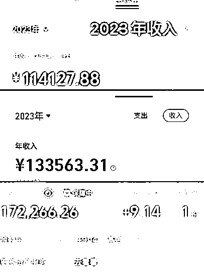
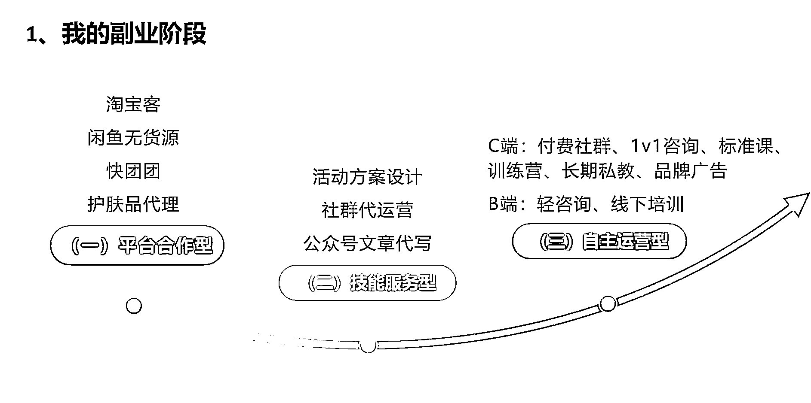
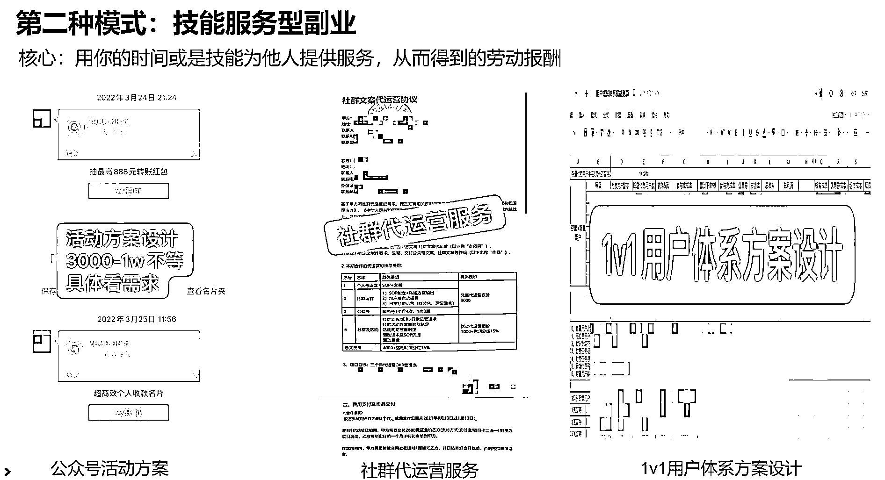
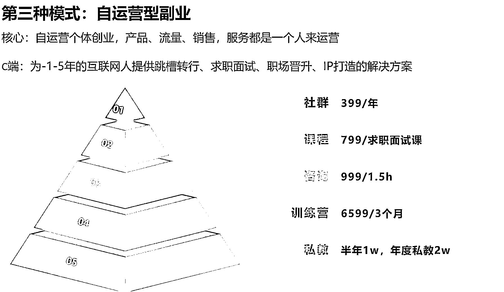
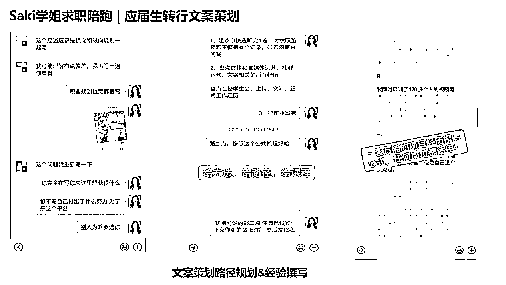
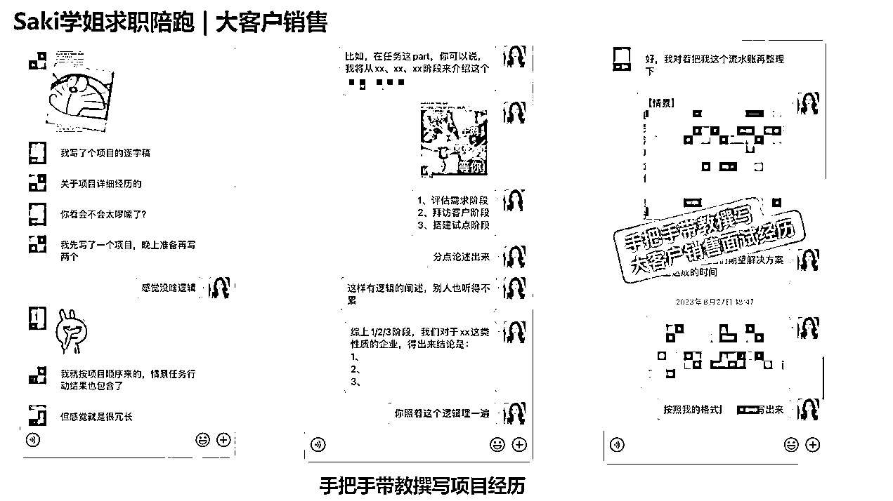
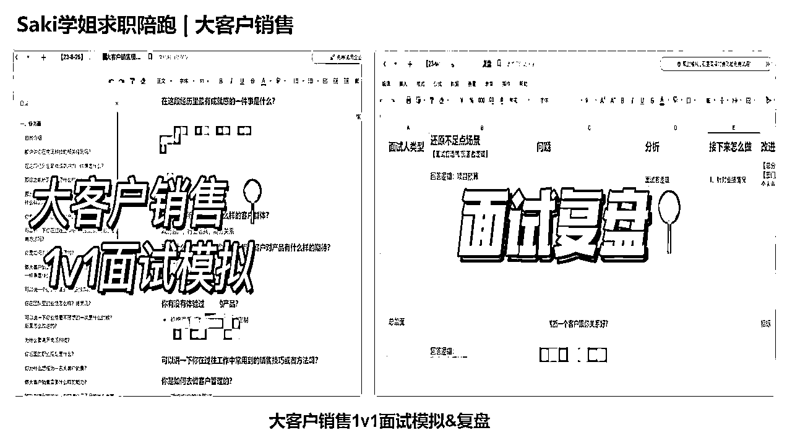
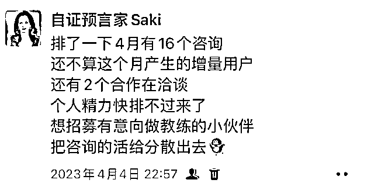

# 从副业到自由职业，我是如何成为一名月入 4w 的知识 IP 的？

> 原文：[`www.yuque.com/for_lazy/thfiu8/ddicwkn2qopxsgwg`](https://www.yuque.com/for_lazy/thfiu8/ddicwkn2qopxsgwg)

## (43 赞)从副业到自由职业，我是如何成为一名月入 4w 的知识 IP 的？

作者： 自证预言家 Saki

日期：2024-01-25

大家好呀，我是自证预言家 Saki，现独立职业咨询师、知识 IP 孵化教练。

在大环境求职环境寒冬环境下，我却副业超过主业 2 倍然后裸辞出来单干，成为一名月入 4w 的知识 IP，从 996 打工人到自由职业月入 4w，并且实现了全国边旅居边赚钱的生活；

我将分为两个部分毫无保留分享给大家

1.  过往的副业阶段的 3 大尝试

2.  我是如何突破内心卡点，快速启动副业的 3 条行动清单

如果你也是处于一名想要拓展副业，未来想成为一名自由职业者的话，抑或是不满足现状，想拥有一技之长开拓副业收入的人，我相信这篇文章的副业探索路径对你一定有启发；

如果你对知识 IP 的打造有兴趣或需求，欢迎随时来找我聊聊！

过去的一年中，Saki 我也经历了从打工人到自由职业者的身份蜕变。

期间也有过茫然与不确定，也犹豫要不要回去职场，也求助过许多大佬，尝试了各种方式，帮助明晰规划自己的未来。

我有时候也难免迷茫，离开了职场，离开了稳定的收入，我真的可以过得更好吗？

我不想在大好岁月，在生命最年轻、最有活力的一段时光中，每天都呆在办公室里，对着电脑加班到很晚。

特别是深圳互联网高速发展的打工人之都，996，007 对我来说已经是家常便饭，甚至为了熬夜肝项目，睡在公司也是难免的

有同样感触的小伙伴，可以拍拍我~

在没有离开职场之前，我的自我介绍都是产品活动运营，操盘过多个千万级会员活动，GMV 过亿

但是，我也很恐惧，这些平台带来的光环，我一旦离开后，它究竟能给我带来什么呢

恐惧的背后是源于不确定性的未来

在这里，我想问一个问题，如果你们年薪 30w+，有各种补贴，你们愿意离职吗？

但我做一个大胆的决定，没错，我离职了。

如今一看，离职六月有余，怕是再也不会回去了。

期间去了很多地方，我实现了边旅行边办公的梦想生活，认识了很多有趣的人儿；

额尔古纳河畔留下我的足迹，室韦边境在马背上深刻了对自由的理解，大王鹿的鹿角指向天空，原来自由并不遥远。

我对活在当下又有了不同的定义，学会体验生活、体验不同的民族文化。学会拍照和记录，父母会老去，我们会有新的身份，唯有把回忆留在镜头，美好从刹那便成永恒。

先开眼，打开信息的触角，接触优质的圈子，多出去走走，观察不同地域商业模式，多思考生意和行业之间的差异与壁垒……释放大脑内存的同时，我理解到，放松之后才会有更多的创意。

延边、丹东、烟台、济南、阿勒泰、博尔塔拉、伊犁、乌鲁木齐、兰州、安吉、黄山…

2023 年边旅居边工作，走过了 20 多座城市~

尝过自由的味道后，在只上班不工作的情况下，我的收入也没有收到骤减，我大概不会再回去了。

但我不是贸然的离职，而是在裸辞前，就做了很多沉淀，拥有选择的能力和权利

今天主要是想聊聊，我是如何一步步从副业 3k 到自由职业月入 4w 的这个过程~

从 21 年 8 月开始，我开始探索副业之路，那时候副业收入只能赚 3k，到现在脱离职场做自由职业，每月稳定收入 40k＋，我好像真的把自己养活了。

说出来不怕大家笑话，在副业探索这条路上，前前后后我试探了 7、8 种网赚项目

## 一、我过往副业阶段的 3 大尝试

### （一）平台合作型

身边借助平台开启副业的人特别多，这也是小白最容易入门的副业类型，比如 3 年前很火的淘宝客、闲鱼无货源，快团团…

这类平台型项目，能赚到钱的核心，就是通过你的流量和销售能力来拿到推广的佣金。

那时候看见别人赚钱，就觉得自己也可以，也尝试了一段时间，也确实赚了点小钱。就拿闲鱼无货源来说，进入电商行业，还是需要大量的学习，例如平台的规则、选品的逻辑、定价等等

除此之外，你还需要大量时间去坚持上新，以及时刻回复客户消息，这对当时还在上班族的我来说不是很友好，而且略显琐碎，处于主业收益来看，我就放弃了。

平台型项目类型 tips：从事这类型的副业，需要稳定的流量获取和选品能力，0 门槛，其实意味着不需要太强的私域技能，以及你没有太高的沉默成本，未必会坚持做下去。

这似乎不是我想要的，那我想要承接的副业具体是什么样子呢？

### （二）技能服务型

尝试了平台类型副业后，决定再也不要做大段时间，琐碎，又需要回复消息，利润又低的项目；

从自己原有的经验和能力出发，我靠着朋友的推荐和过往工作的资源积累，拿到了社群代运营、活动策划等兼职工作;

这类的副业，核心是用你的时间或者技能去为他人提供服务，从而获得劳动报酬。

从短期来看，我的收入还是比较可观，在接手社群代运营的第一个月，就月收入过万，半年累计收入赚了 6.5w

但这类工作越算是一种兼职，除了上班外，我相当于把下班的全部时间都贩卖给甲方爸爸去做他的项目，静下心来一复盘，主业副业共同推进，晚上 10 点下班，还要和兼职的甲方爸爸去打业务电话，对方案进度，熬着迷人的夜，加着另外一种新形式的班！

啊——简直就是在打两份工！！！

打工人的生活真是太窒息了，什么时候我才能拥有自己支配的时间呢？

这种技能型的副业做起来，越发越不得劲，就像从一家公司又上了个工号。

这也不是我想要的生活。

我开始学着开眼见世界，接触更优秀的、三观更加契合的老师、付费进入更优质的圈子，四位数的训练营，五位数的私董会。

有句话说的很对，你永远也赚不到自己认知之外的钱。

在我羡慕别人能日入 5 位数，月入 6 位数的时候，注意力都放在别人身上去了

完全忽略自己的性格底色，我是一个什么样的人？有哪些技能与优势？我有什么样的价值观？

白天上班，晚上学习，夜间复盘。

想找到合适自己的副业项目，脱离职场这个格子间之前，要先知道自己是谁，有什么技能和资源，能为这个市场去提供些什么；

他当时销售转行汽车行业渠道运营，组里的人都不太懂营销，当时看我工作做的风生水起，想来咨询我如何做好一名运营；

命运的齿轮就此转动，谁懂啊，当时我都没带过人，突然有个人说，付费向我请教，我还怪慌的

在我的帮助下，我们 1 周会打 1 次咨询电话，定价是在 99 元，那是我定价最低的时候，799/3 个月陪跑

他每次遇到问题都是 1v1 打电话和手把手改方案，生怕给人带不好

3 个月陪伴过去，他也顺利转正了，我突然如释重负，想明白了点什么

原来，成人达己，成己达人，是这种非常满足的感觉，在帮助他人拿到结果的同时，我也找到内在的正反馈

这种感觉好像很不错，我已经帮助了一个职场新人完成职场进阶这个事，也赚到了一笔小钱，能不能把事放大出去，让更多人看到我的价值呢？

我想要把这个闭环跑通，帮助更多的职场人求职面试、升职加薪！

### （三）自运营型

在 22 年 3 月，我正式开了小红书账号，结合私域一起搞起来知识付费，当时的我边做主业，边做副业，用 1 年的时间，跑通了自己的职场 IP 项目，搭建了线上的知识产品矩阵，付费社群，陪跑，标准课，1v1 咨询，训练营…

这时候的我进入了第三种模式，自运营型副业。

相当于是个体创业了，产品、流量、销售、服务都是由我一个人来做；

我用自己在职场上沉淀下来的求职面试方法论，帮助了很多迷茫想转行，想跳槽的小伙伴找到工作；

**比如，我用 21 天的时间，帮助在国企打工人成功跳槽进入互联网行业做文案策划；**

学员是一名应届生，初入职场时，按照家里要求进入了国企。但工作了一段时间后发现，和自己预期不符合，比如国企的工作重复机械，没有创造力，死气沉沉。

当时他和我聊起不知道转行能做什么的时候，给我分享了自媒体经验，我通过 grow 提问的方式觉察他的个性在写作，创造力这块比较突出，大学期间靠语音写了 30w+字的小说。

对于想转行的同学来说，简历就显得至关重要了，可以把自己的优势案例作为转行的项目去进行输出，当时我就是一步步教他把过去社团，项目上的案例输出在简历上。

**再比如，我用 3 周的时间，帮助学员拿下 22k 的大客户销售 offer，薪资涨幅 47%**

他是个 2 年工作经验的大客户销售，面对现在呆的这家公司，对于客户和领导关系，感觉非常压抑，很多事，很多决策都非常受限，没法发挥出优势...

结果和我陪跑了一个月，一起模拟了几次面试，认真的做了几遍面试题，一起盘点周围的资源，第一次面试就有了非常好的正反馈“

他直呼，这一切来的太快了，原本以为找工作得 3 个月以上，毕竟都好久没面试了，都没做好要上班的准备；

有策略的努力真的很重要，能帮人少走不少弯路，节省不少时间。

一次次实践证明，从撰写面试简历-面试模拟-面试复盘-投递 offer-挑选合适 offer，但是有方法可循的，我的这套求职面试方法论是完全可以复用的，只要听话照做和坚持下去就能看到成果；

与其求职路上自己瞎琢磨，不如找专业的人逐步攻破每个卡点，主动出击拿到 offer！

在 4 月的时候，我主业还在上着班，每个月的咨询起码排到快 20+个咨询，当时我萌生了想培养自己的教练学员的想法，想把单子给分出去给他们；

当时发了个朋友圈，有很多老学员都联系我，想让我系统出教练课，在课程大纲还没有出来，就收了 2 个全款+1 个定金；

当时小试牛刀，把课程粗略的做出来内测版本，拉着内测班的同学从 0-1 把自己如何获客，做知识产品和内容，还有交付梳理和沉淀下来；

有的小伙伴虽然私域 110+人，但是粘性非常高，4 个月变现 2.6w+，还有的小伙伴，通过放大自己主业的优势，做产品求职教练，单月变现 7k+，还有的小伙伴，从国企转行文案策划，开始做起职业咨询师，手上带出来的学员已经顺利拿到新 offer 来报喜…

和用户们一起养成的快乐，让我非常动容！我几乎每天都能收到各种用户的报喜和反馈

看到自己指导和陪伴，让学员产生了行动上的变化，开始慢慢变好的时候，真的是无法用金钱衡量的充盈和价值感。

这也证明这套课程的逻辑是有效的，我开始系统的引流，想把业务盘子扩大…

## 二、突破内心卡点，快速启动副业的 3 条行动清单

我从一开始的拧巴到现在的自洽状态，也是经历了好几个阶段。

那么也来和大家聊聊，在新手探索期，我出现了哪些卡点，以及是如何克服的？

## **卡点 1：信息来源闭塞，不太清楚行业外有哪些赚钱方式，很想知道别人是怎么赚钱的，商业 sense 不够**

如果你曾经和我一样，不知道市场上有啥项目，能做什么，搞不懂生意的逻辑的话，可以去加副业/创业类的星球/社群，不需要加非常多，只需要加 3-4 个即可~

### **行动清单 1：保证自己信息摄入的来源，先开眼**

想搞钱，还是要把自己沉浸在搞钱的圈子里。靠近优秀的圈子，和高能量的人同行。当你想躺平，大家在报喜的时候，大家还在努力写着朋友圈的时候，你也会被这种积极的状态所带动。

## **卡点 2：不清楚自我优势，认为自己无能力、无资源、无技能不知道如何变现**

### **行动清单 2：借助工具探索自己的定位和资源，匹配变现方式**

在这里，我推荐两种解决方式：

**1）借助工具探索自己的定位和优势**

我做过非常多类的工具测试，盖洛普、MBTI、大五人格、九型人格、霍兰德代码、玛雅天赋等等…

我特别推荐盖洛普，它的颗粒度真的很细致，可以快速减少很多试错成本和不必要的内耗。

借着盖洛普的测试，可以帮你清晰自己很多的行为规律，从自己习以为常的思维模式、行为模式，意识到这些模式里有哪些自己不曾发觉的优势，以及有哪些限制你的思维盲点。

**2）盘点自身的资源，匹配变现方式**

不知道大家有没有听过，擅长、热爱、能变现这种定位交叉图，但实际情况，很多小白就是一做就废；

如果你是做个人 IP，那么它是对你过去积累的沉淀的变现，那有些小伙伴她们在主业上是刚开始，并且没有技能能去售卖的；

1、选择自己喜欢的，擅长的，能赚到钱的

2、离市场，离业务近，有项目红利期去积累练习手感

3、重新花时间去积累和沉淀一项技能

在这个维度我是这样去排列组合，和我的学员说的，因为每个人的情况不一样，所以不同的人匹配不同的资源和变现方式，成长周期也会不同~

也许你看到一个 IP 能够快速做起来，是因为他背后积累了好多年的经验和能力，所以在这点上，小伙伴们可以先不急~

只要你持续在进步和微调，成绩和结果是早晚的事。

## **卡点 3：正反馈不足难坚持，东一榔头，西一锤子容易放弃**

这个点最大的负面例子，就是我自己哈哈，半年多尝试 7,8 个网赚项目，但是坚持下来寥寥无几。我发现除了代运营以外，几乎网赚没有坚持超过 3 个月的；

### **行动清单 3：至少留 3 个月时间去试错迭代**

无论你是做账号也好，做其余网络项目也罢，还是做个人 IP，至少留给自己 3 个月的时间去迭代试错；当有了一定时间维度，项目收益维度，你才能真正准确评估 ROI，才能去真正判断这事到底合不合适我。

项目关键因素成败都是在人，不是事，比如闲鱼无货源这个赛道也有大佬做的风生水起。

最后送给大家一句，我很喜欢的话：商业利润源于不确定性。

既然选择自由职业，那么我也会努力把这个有限游戏在人生这个无限游戏里玩好~

2024 年，也祝生财的大家有更多的心力，愿力，能力去做自己想做事~！

* * *

评论区：

咿呀花花 : 飞书链接打不开
自证预言家 Saki : 已经重新发布啦宝~
吴大脸 : Saki 厉害[强]，深入了解了
小吴姐 : 商业利润来自不确定性，这话怎么解？
Eason : 优秀 优秀～
自证预言家 Saki : 能赚取更多利润的人，就是因为承担了风险。凡事不是因为存在了才相信，而是因为相信才存在。
自证预言家 Saki : [社会社会]谢谢大脸
自证预言家 Saki : [嘿哈]

* * *