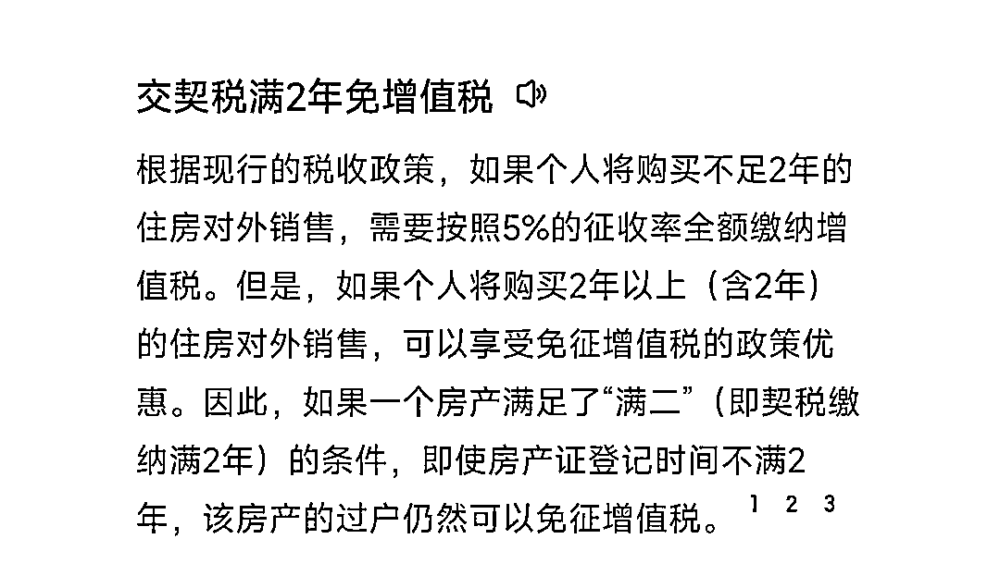

# 自媒体 3 年，经历过低谷期，挺过煎熬期，迎来曙光期

> 原文：[`www.yuque.com/for_lazy/thfiu8/hx0qpvg7b8nnfbgh`](https://www.yuque.com/for_lazy/thfiu8/hx0qpvg7b8nnfbgh)

## (23 赞)自媒体 3 年，经历过低谷期，挺过煎熬期，迎来曙光期

作者： 赵卿久

日期：2024-01-25

哈喽，生财有术的友友们好，我先自我介绍哈，我是卿久，97 年中文系，运营两个公众号，慕卿久与未来可期的小赵，全职自媒体 3 年，粉丝 18w+。

擅长公众号运营和打造个人 IP、搭建自己的付费产品和私域运营，如今通过自媒体成功变现 60w+，目前月入 4w+。

入行自媒体已经有 3 年了，从刚开始的负收入，到最近 3 个月稳定月入 10 万啦！

算是有一些小成绩，但在这过程不算很平坦，今天卿久想跟大家唠唠我走过的路，也希望能够给大家一些启发

**✅01 低谷期**

3 年前，卿久刚从大学毕业 2 年，经过几次工作不顺，准备全职自媒体，4 个月下来成绩不错，公众号达到了 2 万粉丝。

春节期间，卿久也是在当时男朋友（我大学期间的学长，毕业 2 年后阴差阳错在一起的）老家过的年，见了很多亲戚朋友，我们准备五一期间结婚。

年假结束，我俩先回广州了，毕竟学长要上班，这时候，意外来了，学长的妈妈，我当时的未来婆婆，身体不舒服去体检，因为疫情中断了 1 年的复查，很不幸这次发现时已经晚期。

我们的心情都很沉重，婆婆不想治了，妈妈劝她坚持治疗，我决定把 15 万元的彩礼都拿出来给婆婆治病，爸妈也支持我，亲人的健康最重要。

因此，结婚时，卿久是没有拿到一分钱彩礼的。

嫁妆方面，虽然妈妈给我存了几万块，是给我们婚后用的，但是学长想着，我弟弟还在读书，既然我俩已经结婚了，两个人应该支撑起小家庭，不好动用这笔钱，想着就存起来备着。

还有一个原因，卿久大学 4 年读的是民办学校，学费很贵，家里已经负担了很多，婚后妈妈还帮我带娃，感觉已经给家里添了不少麻烦！

支出方面，学长之前在常德买了套房子。公公出首付，学长每个月要还房贷。婚后，还加上孩子的奶粉、衣服、尿不湿，我们负担挺大的。

**因此，最初做自媒体的那一年多，也是我十月怀胎生下孩子的期间，日子真的非常苦。**

学长辞了在广州做了 4 年、过万月薪的工作，回长沙找新的公司面试、上岗，薪资不足广州时的一半，我们有大半年的时间，都是支出大于收入的。

也是因为小家庭的负担更重了，卿久就决定要加倍努力搞事业，等休完产假，我的身体恢复以后，我全职自媒体。

这时候是做公众号的第 2 年，我开始月入过万，但基本也存不下多少钱，我仍然迫切想赚更多钱。

**一方面是担心婆婆的身体，另一方面，想在长沙买房子，要存首付款，要还房贷，得月入 2w、3w，甚至更多，我没敢想在长沙买房子的事，但是孩子要上学时总归要面对的。**

何况，我们还想尽可能帮衬家里、回报父母。

**✅02 煎熬期**

这 3 年，公公也从广州回了长沙，一直在陪着婆婆治病，好一点的时候公公会去做事，他有一门装空调的手艺。

我们也会时不时带着孩子去看婆婆，她做了放疗和化疗，虽然没法乐观地面对，但有在认真地治疗。

直到今年，婆婆情况越来越不好了，我和学长轮流陪护在医院……8 月份，婆婆去世了。

虽然知道是迟早的结果，但是一家子陪伴婆婆近 3 年，独生子的结婚生子，让她生命最后的时光，少了些许遗憾。

也考虑了很久，做出一个决定，那就是把常德的房子卖掉，一家人都在长沙生活，后期也在长沙发展，于是我们把房子挂了在 58 那些平台。

等待买家的过程，持续了很久，经济不好，买房子的人少，加上地级市的房价基本上都在跌，这个大家应该都知道。

9.10 月份的时候，终于等到了买家，学长问我是不是确定要买，现状是孩子由外婆在带，在长沙乡下，而学长老家是常德澧县乡下，我们怎么也住不到常德市里去，我说，卖掉吧。

这一卖，我们直接亏了 20w，房子地段还可以，卖出去其实没有很低，亏是因为踩了很多买房的坑。

比如说，虽然没有像很多人那样，房子转手不掉，失业了房贷还不起，变成失信用户，但学长他 4 年前买房那会儿，一是利息最高的时候，二是不懂怎么就选的先息后本，还了很多利息

比如说，前两年没入住，也没想过卖房子，不知道要早点把契税交了，导致转手房子时，要交 5%增值税……办手续时，肉疼得想哭。

公公与学长心情都很沉重，因为他父子为这房子付出了不少，学长说感觉自己这 4 年都白打工了……但还是非常感谢他俩尊重和支持我的决定，未来一起生活在长沙。

卖掉房子后，我的压力变得很大，一方面是不想这 20w 白白浪费，另外一方面是卖房子到长沙生活是我的决定。

**于是，卿久当时就暗自下定决心：年前必须要赚回来。**

为了把钱赚回来，卿久把之前付费得到产品和资源都利用起来，薅老师们的一对一，努力向上链接，持续破圈，学习优秀自媒体人的商业思维，不断装备头脑和多维度提升自己。

浸泡式学习一段时间后，卿久开始尝试实践起来：

✅运营私域，每天坚持发 6-8 条朋友圈，不断优化文案。

✅搭建社群，打造课程，不断迭代，全心全意交付学员。

✅联名婷子、小她推出私教合伙人，每天跟合伙人语音/文字交付。

✅参加见面会，吸收分享嘉宾的精华，内化后再次进行学习。

✅坚持输出，分享次数高达几十次，带动社群学习氛围。

✅抓住机会，主动请缨推销自己，操盘觉醒团队千人规模的社群发售活动。

顶着压力，不断努力前行。

大三大四，我对于未来的迷茫，对不知道找工作上班的不确定性，让我卷到了励志奖学金，优秀毕业生等等荣誉。

生娃前后的这三年，压力作为我形影不离的朋友，让我突破了月入 10 万。

**✅03 曙光期**

终于，2023 年下半年卿久有了质的飞跃，熬出头了。

月收入，从年前的 2w，到年中的 4w，再到第四季度，连续 3 个月的月入 10w+，已经把亏掉的那 20w 赚了回来。

卿久 3 年里

✅帮助 1000+人自媒体变现；

✅帮 7 年合伙人搭建属于自己的产品体系；

✅两个微信积累私域流量达 13000+；

✅与合伙人累计通话 200+次；

✅操盘千人社群，累计转化 30w+销售额……

算了算 3 年来的自媒体总收入，还不足百万，这个月努力冲上去，此时说“轻舟已过万重山”还为时尚早，但一切都已经苦尽甘来。

2024 年，卿久有新的打算，准备在长沙买新房子，我们对房子不太熟悉，感觉有好多坑，如果有什么注意的地方，欢迎支招！

存款是有了几十万，但可能买完房子，再装修一下，差不多就把积蓄用完了。

所以，2024 年，我们要赚更多的钱，让自己有更多的安全感和选择权！

✅04 最后，卿久还有些心里话想跟大家说

做自媒体前，自己没有想过能变现这么多。回看这一路，有很多感概。但更感谢的是那个坚持下来的自己。

**所以，我们永远不要给自己设限，要大胆一点，勇敢一点。可以的话，目标设得更高一点。**

新的一年，卿久已经给自己制定了不少 KPI，也会更加努力带着团队以及合伙人搞钱！

希望 2024 年的我们保持对自媒体的热情，保持对生活的积极上进！

今天和大家分享的是我的近况，就聊到这里。自媒体的心得干货，详细实操篇，会在小报童，以及社群我们互相陪伴未来的日子里，和大家细细分享的！

* * *

评论区：

暂无评论

* * *