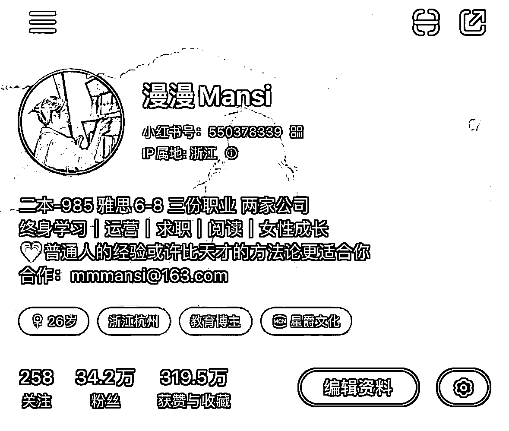
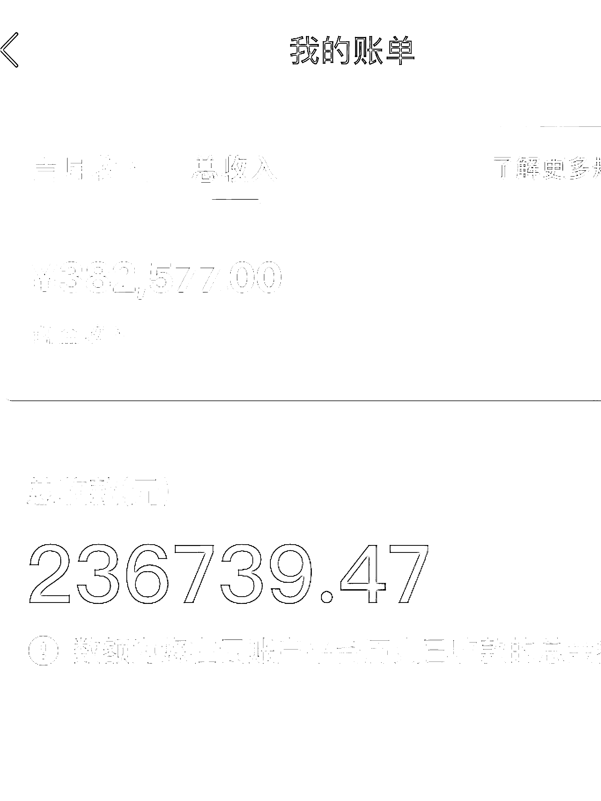
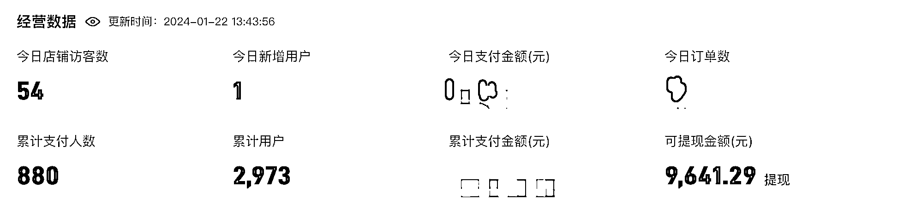
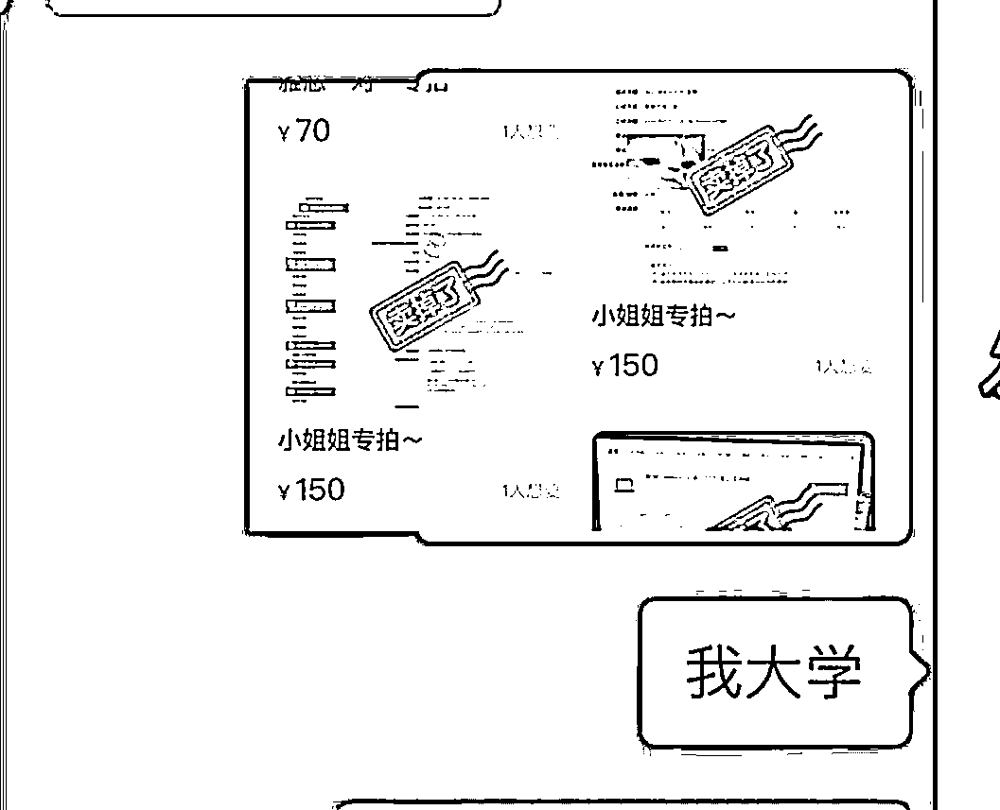

# 97 年 34 万粉小红书博主终于赚到人生第一个一百万的搞钱反思

> 原文：[`www.yuque.com/for_lazy/thfiu8/gweoxp0kzqc1o1fw`](https://www.yuque.com/for_lazy/thfiu8/gweoxp0kzqc1o1fw)

## (49 赞)97 年 34 万粉小红书博主终于赚到人生第一个一百万的搞钱反思

作者： 漫漫 mansi

日期：2024-01-22

大家好，我是漫漫 mansi，小红书做了 2 年半博主，博主生涯靠广告接单赚了 60 多万差不多，今年开始做知识付费半年 30 多万。

  

  

这是去年截图的部分广告收益，还不算微信和支付宝打款的。

这是今天小鹅通截图

这篇内容是一边听姜 Dora 百万博主搞钱那期播客一遍整理的，结合自己的经历，整理了自己的做内容做 IP 做内容创作搞钱的经验。

## 一、为什么要自由职业，为什么要做自媒体

❶欲望是第一生产力。

姜 Dora 千辛万苦打工月薪三万，做自媒体一个月涨粉 5000 后一条广告 5000，努力打工一年才涨薪 5000，建立个人品牌的一个月的每一段时间报价就+5k。

而我是 20 年看到从小一起长大的朋友已经是微博大 v 财富自由，我的实习 leader 是 B 站 up 小有成就，眼红。

❷有成就感。

打工做的是螺丝钉，精细化做一个岗位。

做内容实现很多 0-1 的突破，一个小闭环就能拿到很多正反馈，一条视频就能涨粉几千赚几千，也能被很多人认可自己的观点和付出。打工不如创业有价值感。

❸公司是来分我钱的人，不是给我工资的人。

《脱口秀手册》里关于公司的定义：公司是你的劳动经济人，在你没有自己的独立机构时，公司会把你赚的钱分走 90%以上，剩下的是你的工资。

❹自己有独立面对市场的能力

“而当你有独立面对市场的能力的时候你就可以撤。”——姜 Dora

独立面对市场在我看来就是你知道咋自己卖东西了，因为赚钱的逻辑就是卖东西，我从 19 年开始在闲鱼上卖自己的雅思辅导，20 年在做小红书之前开始在阿里巴巴进货，然后在闲鱼和上卖，这些都培养了我的商业意识。

当我通过副业赚到第一个 100 块你就会知道怎么赚 1000，赚 1000 之后我想办法赚 1 万，找到这个赚钱的因素然后专心放大了，就是「把东西卖给有需要的人」

然后你就可以去为了这个目的，去给有需要的人找产品

大学的时候我甚至为了能做雅思家教而去刷分，以及当时各种做倒爷、微商，

本科毕业那个暑假靠着带英语赚了两万，那个时候其实英语也不是那么那么会教学，所以收费很低，但是在那个过程中我是一边赚钱一边把自己的雅思又往上提，后来居然考了 8 分，这个 8 分就为我后来做小红书英语博主起号打下来基础，赚钱的良性循环。

## 二、怎么做自媒体？通过自媒体赚钱？

❺积累，量变产生质变

为什么能涨粉那么快？是因为过去有很多年的积累。

我做小红书之前做了 5 年自媒体打工人。16 年开始实习做公众号。15 年在学校做小报社记者。17 年考雅思研究写作的表达的逻辑。读高中的时候写议论文读初中的时候看小说写武侠小说，

而且我认识的所有的博主都有和我类似的经历，大部分都是写作好多年。

❻爆款选题≠扎实的内容。爆款≠好的内容创作者。

内容创作者要考虑到的是方方面面，把内容写好包含了太多东西，既包括写作的基本的东西：结构清晰是最基本的，观点独到情绪有感染力是进阶，想赚钱的话，内容上的就还要围绕着用户的需求作为选题切入点。

❼做自媒体和开一家店没什么区别，区别大概就是不怎么花钱。

做账号/自媒体/开店：

你的目标用户你的店铺装修也就是你的页面，你的店卖的什么东西是你的认知你的思维还是你的实物产品？你要怎么去把你的认知把你这个人设你的产品卖出去？你要怎么去营销怎么去包装？你自己怎么去看用户的反馈怎么根据他们反馈去调整自己的销售的方式？等等

所以真的做好或者说在做的过程中能学到东西是很多的。

都是在看世界，但是创业的人看到这个世界意识到的信息会更多一点，因为会很敏感的意识到哎，每个人的需求是什么？赚钱的本质是什么？包括在做的过程中遇到的一些反馈产生的起伏波动也会让自己变得更坚强、包容一点。

  

❽研究人的发展，研究人怎么变得更好，其实自己是第一受益人。

我做内容发自己的学习路径学习感受、总结自己的复盘自己的经验教训，其实我是在研究自己的系统的知识体系，倒逼自己学更多东西，也都是为了帮自己变得更好。所以做小红书让我非常有成就感因为能够感受到自己进步很快很快。

❾发挥自己能赚钱的那个优势，或者说把自己的注意力放在自己能赚钱的那个点去把它放大，而不是放在别人赚钱的点然后把自己的短板弥补，只要知道自己的长版自己赚钱的点是什么，然后不断地去优化这个点也可以。

优势天赋这个东西要么是基因里自带的，要么是自己长期积累的，不可能模仿别人一下子就能学会的，大部分后天习得者都是在一个事情上反复花很长时间打磨才习得这个技能变成自己的优势。

所以从现在开始，从你在做的事情里面找到一个你相对来说能够最高效的做成的事情，把它继续变成你的不可被别人替代的优势。

从小红书以来一直有很多人跟我说我要应该要去做视频、应该尝试做口播会更火、我做教育的话应该搬到 B 站上去，但是我真的尝试过在 23 年下半年尝试过做口播拍视频，大概十几二十多个小时做出来一条视频，非常耗费时间，效果又不如我一条图文效果好，

这样算一算 roi 哈：

我做一条视频需要 20 几个小时，但是这 20 几个小时：

1.我可以用来做很多片小红书图文爆款 2.同时发在好几个图文平台，3.还能写一篇两篇长文，作为我的更深入的知识体系，4.并且还有多余的 10 个小时，我可以用来教我的学员怎么去帮我宣传，或者开发产品，为赚更多钱做准备。

比我再去做一个号并且我还不知道结果会怎样，我这个做法能拿到的这种明确的结果已经很好了，

精力有限，精力放在哪里成果就在哪里。要守住基本盘，维护好基本盘，维护好对自己影响最关键的因素并且发展成优势，并且维护自己的优势。

不要别人说这个好做那个好做你就全去做了赚钱的方法太多了，如果什么都想做的话，最后结果很可能就是什么都做不好。

❶𝟎很多人不敢尝试新事物缺的不是客观条件是主观的勇气，我觉得主观的勇气，其实就是对自己的自信，还有了解自己的需求，比如说我 2023 年也就是刚过去的半年，我刚开始创业，小红书的广告停摆了，创业也没有什么收入的时候，小半年没收入我其实很焦虑的。

但是我能够继续在没有收入的情况下也坚持创业，是因为我认清我的需求——就是传递我自己的价值，这个需求不一定纯粹的钱。然后我对自己也很自信，因为我觉得我自己确实在知识传递这方面是有一定经验的，我相信我自己能够把这事讲的很好以及能够帮到其他人。

❶❶一定要讲自己的故事，一定要做人设，一定要发有围绕自己的内容。

如果你一直当自己是工具人、把自己工具话的话，其他人也会工具话你。

他们来看你内容来找你，就是为了白嫖你的价值，不是真正喜欢你这个人。

当你不做一些工具的内容，你偶尔会做一些真实的你的展现的时候，你失去的只是那些白嫖你的人，而留下来的是那些真正喜欢你的人。

❶❷我是建议大家在业余时间可以尝试一下做博主，但是不建议盲目的去 all in 做自由职业。因为我们大部分人依然还是处于传统的思维，需要有稳定的工作稳定的收入那种安全感的。而博主这份职业收入波动非常大。需要你自己又比较强的安全感，那么你要判断一下自己可不可以接受这种所谓的“不稳定性”。

而且你不一定能立刻赚到钱，有的人做博主可能几天赚到钱有的人几个月赚到钱，有的赚几百块有的赚几千块，这些和自己个人的关系非常大，就像我上面说的你的积累也很重要。

❶❸如果着眼未来就不要计较一时的得失。

对我而言的话，即使创业也没有什么收入，我依然知道我自己能够赚到钱，我觉得【笑到最后笑得最远，就是笑得最好】。即使我今年挣不到钱，我可能明年能赚到钱，或者后年能赚到钱。只要健康、活得时间长，就有赚钱的时间。

保持自己的健康，然后在健康的基础上每年保持一定的稳定收入，或者说自己手上能够有自己 cover 风险的那个基本收入就够了，然后稳稳当当一点一点积累。

一开始收入骤减的时候自己会很恐慌，但是后来想明白这一点的时候我就不恐慌了，就是把我的目光放在未来的五十年，甚至我觉得自己可能不止还能活 50 年可能活 60 年呢？

要对自己有信心，相信自己能够把生意做长久。一时的波动不会影响长久的发展，只要我坚持，只要我在这个事情上面投入精力积累经验。我的技能积累了，变得更擅长了慢慢地优势更突出了，今年赚不到钱，明年也是会赚到钱的。

❶❹已经在局里的，已经在做内容创作者的人不要担心平台变化带来的波动。

只要坚持做好内容，只会一年比一年好，钱一定都能赚到的。和我上面说的一样。

✅一方面内容创作是一种能力，在做的过程中自己是在精进这个技能，这个技能的精进很重要，特别是内容创作其实和我第七点说的一样，包含的不仅是写作，还有各种思维的锻炼，这些思维的培养能够让我们遇到很多问题都可以迁移解决。

✅另外一方面是，我们会比在局外的人更加敏锐地意识到风口。

其实我中间也有想转行做职场博主，想像别人那样去做很多的鸡汤和观点累的博主，因为这里博主爆款概率高能接广告多。

但是后来我发现很多观点和鸡汤不能落地，所以我还是回归到之前做知识类的干货类的分享，

这过程中，我其实是会担心赚不到钱的，我大概已经有半年都没有接到广告了，

然后我就发现我能够通过交换我的知识来获取收益，然后我就开始专心的去做知识付费这个赛道，稳定之后发现我的收益和我之前广告接单差不多，

✅并且从长远上来看，做自己的知识产品做自己的品牌历史比接广告收益更高的，因为生产资料掌握在自己手里客源掌握在自己手里，只有自己的品牌接广告基本上还是在广告方或者平台打工。

赚大钱和长远的钱意味着要放弃一部分快钱。

❶❺人只能赚到自己认知以内的钱=赚的钱都是自己之前认知的积累，积累到一定程度的量变就会产生质变。积累得越多赚的天花板就越高。

经常搞一些博主活动和大家聊我们到底是怎么做成大博主的，基本上每一个人都在初中就开始写小说，很多人也写过公众号，过去的积累都是量变的过程，直到开始做小红书的质变达成。

可能即使没有系统研究过写作，但是写的多了反馈多了，自然知道怎么写得更好之前，之前不知道自媒体能赚钱，但是看得多了就意识到了，所以开始进军小红书。

所以什么时候都不晚公众号的风口可能已经过了抖音的封口，可能已经过了小红书的封口可能也会过去，但是从现在开始积累自己的内容，创作能力和商业意识，说不定就能抓到下一个风口。

所有赚的钱都是自己认知的积累。

过去积累的越多，你能赚到钱的天花板就越高。

❶❻以自己自洽的方式赚钱，之前也会有“这些内容不是我想写的”纠结写不写发不发的想法，后来想明白了不能既要又要，赚钱的内容得是用户喜欢的，自己喜不喜欢不重要。写自己想写的自己开心的并且意识到可能是不被大多数用户喜欢的内容的话，就接受呗，起码初心能自洽。

总比欺骗自己“这既是自己喜欢的又是用户喜欢的”要好，不然自己会一直纠结内耗：这么好的内容怎么点赞不高呢。

一篇文章好不好的评价是多维度的，但是如果目的是更多用户看到，就是要考虑平台用户的喜好和平台的规则，所以检测自媒体文章“好”“不好”的标准就很单一了，用户不喜欢就是“不好”

要以目的为导向，不能自己想什么就是什么，想赚钱就以赚钱为衡量的标准，没赚到钱肯定是过程出了问题。想满足自己的话就满足自己开心就好，不能既要又要。

* * *

评论区：

暂无评论

* * *