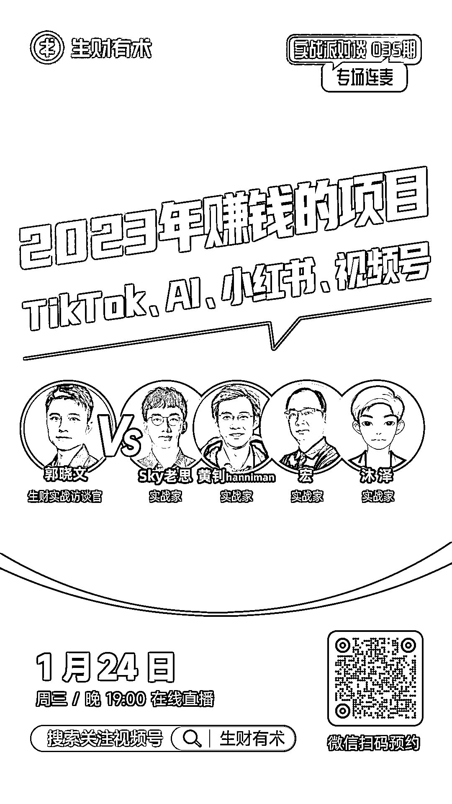

# 第 35 期直播对谈的文字稿：借势 AI（新技术周期早期）赚钱的 3 个底层逻辑

> 原文：[`www.yuque.com/for_lazy/thfiu8/mqugmaugwx6l1b5y`](https://www.yuque.com/for_lazy/thfiu8/mqugmaugwx6l1b5y)

## (21 赞)第 35 期直播对谈的文字稿：借势 AI（新技术周期早期）赚钱的 3 个底层逻辑

作者： hanniman

日期：2024-01-26

【第 35 期直播对谈的文字稿：借势 AI（新技术周期早期）赚钱的 3 个底层逻辑】
大家好，我是黄钊 hanniman，11 年 AI、14 年互联网背景，现“AI 产品经理大本营”创建者，前腾讯 PM。

之前在第 18 期的对谈直播里，和刀姐聊过「AI 领域 10 个非共识认知」；

前天的第 35 期里，我分享的主题是：借势 AI（新技术周期早期）赚钱的 3 个底层逻辑。

[今天来分享文字版，包含三个部分]
一、借势新技术热潮“卖信息差”的 5 个形式（卖工具、卖内容、卖流量、卖课程、卖圈子）

二、借力新技术的功能价值，做自己的“产品”

三、洞悉新技术的趋势，做“投资”（不是指狭义的股票等，还包括提前布局自己的职业发展或者事业）

[其中 10 个核心认知，先列出来，方便大家快速了解]
1、(即使）我们是 AI 的核心圈层，但不是投资的核心圈层——想靠 AI 公司内幕消息甚至个人 AI 认知去股市套现，是非常危险的。

2、“AI 的信息差”在 AI 产品经理大本营，但“靠 AI 赚钱的信息差”在生财——这是 2 个东西！

3、关于使用 AI 的一个最典型认知误区：这么差，还没有我厉害，垃圾！不用了！——AI 真正价值是：对自己不擅长的领域，快速从 20~60 分；对自己擅长的领域，能让 80 分的人，有机会做出 90 分的作品。

4、【重要】在新行业早期，存在 3 个特殊的职场机会：“转型红利期”、填补行业空白的机会、“越级”向上破圈的机会。

5、最核心的心法：不是去追，而是等她来。

6、如果作为普通用户，最优解其实是等到技术成熟，再去用就好了，根本不会错过什么。比如现在刚学会用滴滴或淘宝的老年人。

7、即使对于 AI 从业者，绝大多数信息的价值衰减都是非常快的。

8、【重要】不要焦虑获取信息“时间的早晚”，但应该焦虑获取信息“质量的高低”。因为会有想赚快钱的人进来浑水摸鱼、会人工生成一些低质信息——如果先入为主的吸收一些似是而非的认知，以后纠偏会比较麻烦（类似 AI 认知的童子功坏了）。

9、获取信息的最佳模式：“泡”在最精华的信息源/圈子里！（类似熏腊肉）

10、一个时代性的赚钱机会，是会“铺满”整个时代的。所以真正关键的，是知道不同赚钱模式背后的底层逻辑，以及是否适合自己——千万不要错配、不要仅仅由于贪欲或“焦虑感”而被收割。

原文详见：

注 1：直播时，在第三部分，有些临场发挥（文字稿里没准备的认知点），大家可以重点看下。

注 2：视频回放，可以下图里的二维码。总体有 4 个嘉宾，我是第二个出场，大概 50 分钟之后（视频里显示倒数的“172 分钟”开始）

附：我在生财的分享汇总
1、2023 年 9 月，文章「关于 AIGC 商业化的 13 个非共识认知（8000 字长文）」有被加精，详见：

2、第 18 期的对谈直播的文字稿「AI 时代超级个体的 10 倍、100 倍、1000 倍成长路径，到底在哪里」，详见：[`shimo.im/docs/MzOWrWzFpjm2naPD`](https://shimo.im/docs/MzOWrWzFpjm2naPD)[`t.zsxq.com/16UV0yq62`](https://t.zsxq.com/16UV0yq62)[`t.zsxq.com/16GncyO6Y`](https://t.zsxq.com/16GncyO6Y)

* * *

评论区：

暂无评论

* * *