# tiktok ads 特殊玩法：域名停放广告套利赚差价

> 原文：[`www.yuque.com/for_lazy/thfiu8/vmg8yngg34euxwwz`](https://www.yuque.com/for_lazy/thfiu8/vmg8yngg34euxwwz)

## (21 赞)tiktok ads 特殊玩法：域名停放广告套利赚差价

作者： 阳光杉木

日期：2024-02-01

最近通过 pipiads 观察分析

发现了 tiktok 广告的一个特殊玩法，域名停放广告套利赚取差价 调研的比较浅，就当发给星友看看资讯

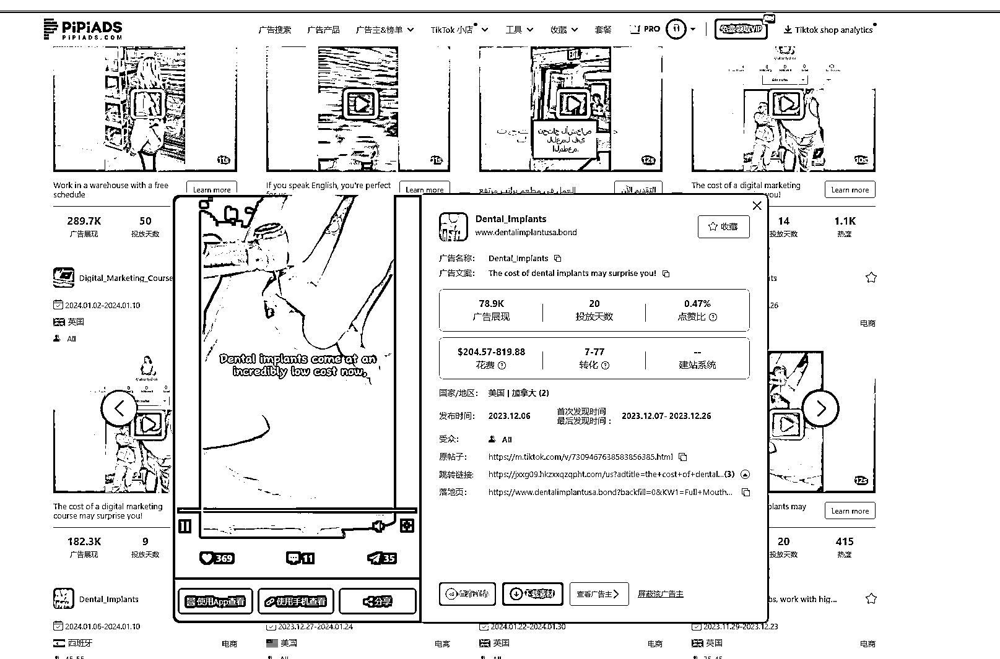

停放域名，通过投放 tiktok ads 访问停放后的网站，点击彩色列表按钮，

然后用户登陆带有一些列表条款的 sedo 停放域名，当用户点击时进入 google adsense 广告，获取差价

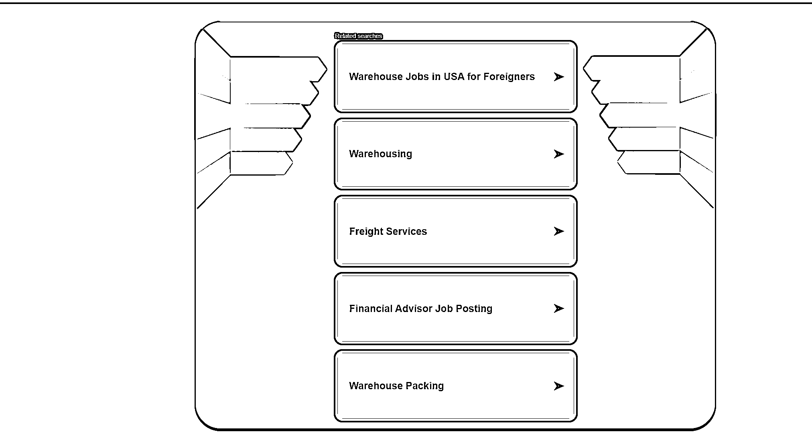

pipiads 搜索核心关键词 **System1 SEDO domainactive  [tonic.com](http://tonic.com)**

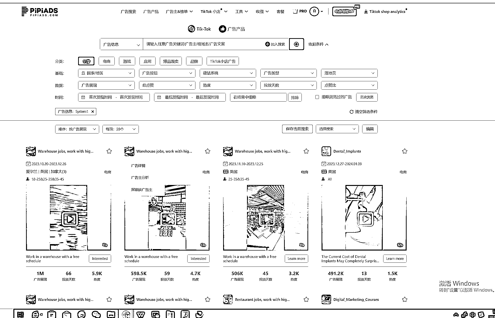

观察其中一条招聘求职的 tiktok 广告 从文案到名称到素材都在吸引垂直的找工作群体

观察域名，也是和工作相关[`warehouse-jobs-6238066-intl-sasha.com/?`](https://warehouse-jobs-6238066-intl-sasha.com)

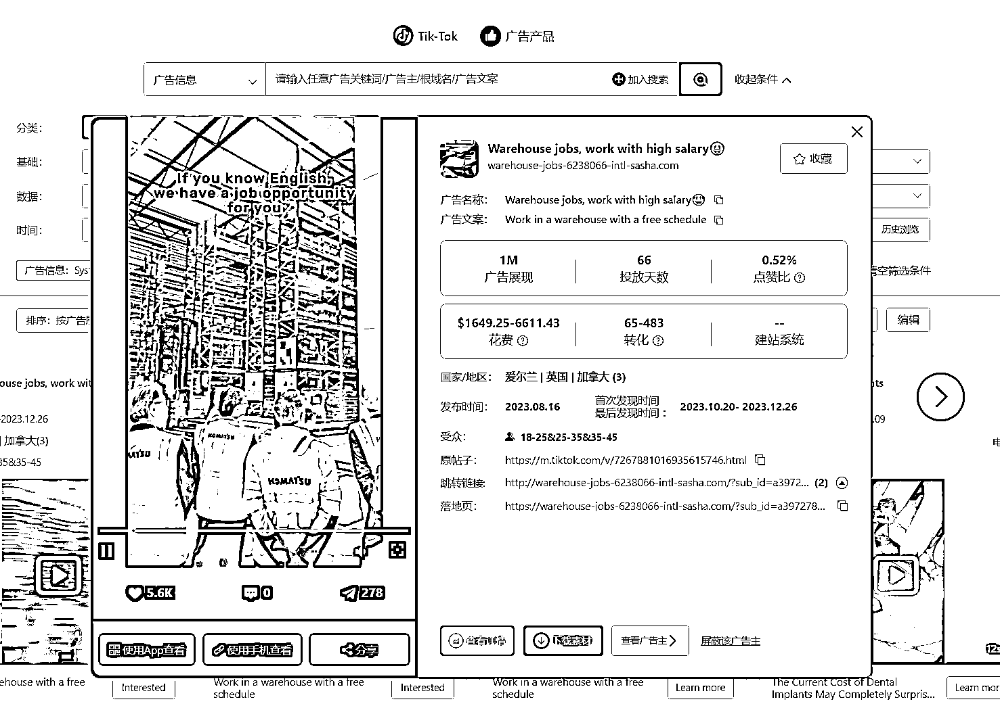

点击链接进入，发现这是一个中转链接，对应的是定向的招聘信息，点击第一个 Warehouse Jobs in USA for Foreigners 进入

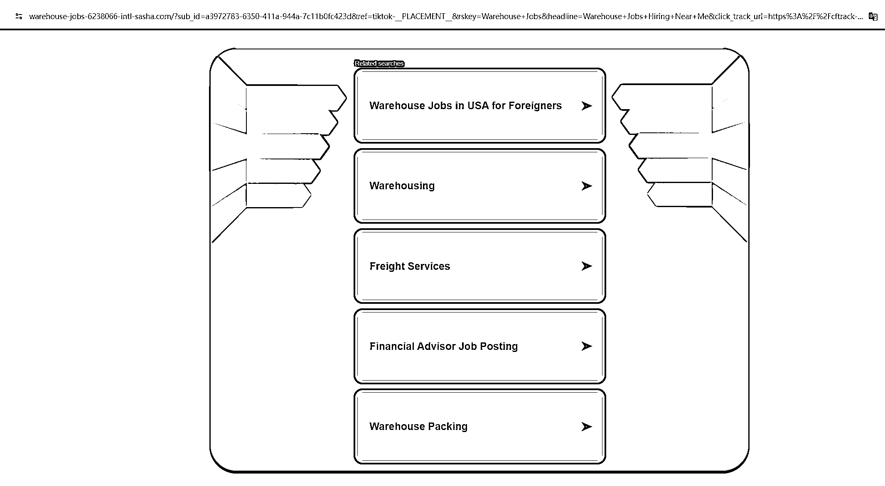

发现又出现了一个中转广告链接

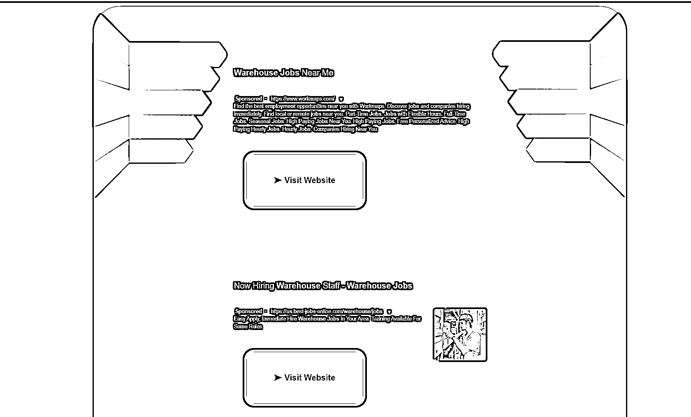

进入最终页面 tiktok 用户点击这些广告完成整个操作 实现广告差额赚取

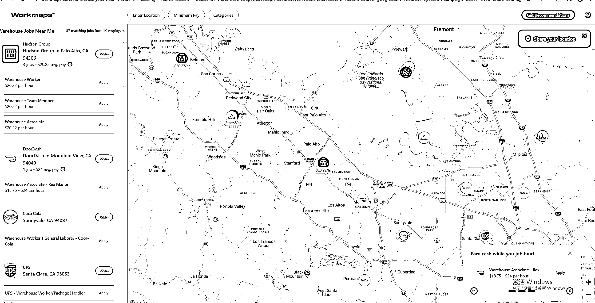

在我们了解域名停放之前首先要了解域名

**1.域名是什么**

**域名**（英语：Domain Name），又称网域。域名是用于在互联网上标识和定位特定资源（如网站、服务器等）的字符串。它提供了一个易于记忆的方式来访问互联网上的各种服务和资源，而不必记住数字形式的 IP 地址。每个网站都有一个唯一的域名，这有助于用户快速而方便地访问他们想要的网站。

简单来说域名就像互联网的地址簿，可以方便我们记忆的文字标识，用来找到和访问网站、服务器等。

**2.什么是域名停放**

**域名停放**（Domain Parking）是指将一个域名指向一个特定的网页或者一个临时的站点，而不是一个实际的网站内容。通常情况下，当域名停放时，访问该域名的用户将会看到停放页面，上面可能包含广告、链接或其他信息。这样做的目的可以是临时性的，例如当网站正在建设或者域名持有者尚未决定如何使用该域名时。

就好比你有一块空地，暂时还没建房子，但你想先让这块地方有点用处。于是，你在那块地上摆了一些广告牌或者链接，可能还有一些简单的信息。这就是域名停放，你把域名先指向了一个暂时的页面，而不是一个真正的网站。

**这种模式通过点击广告来获取收益。该服务主要依赖于域名所带来的访问者，通过这些访问者点击页面上的广告来赚取收益。****3.为什么会出现域名停放**

1.**暂时未使用**： 有些人在购买域名后，可能暂时没有准备好用于建设实际的网站。在这种情况下，他们可以选择将域名停放，以便在将来决定如何使用域名之前，至少显示一些暂时的信息或广告。

2.**保护有价值的域名**： 一些域名可能是非常有价值的，但域名持有者可能尚未决定如何利用这个域名。停放域名可以防止其他人在此期间购买并使用相同或相似的域名，保护了域名的价值。

3.**域名交易**： 有些人可能购买域名，但并非立即使用。相反，他们可能希望将域名保留一段时间，等待有人愿意以更高的价格购买这个域名。在等待买家的过程中，他们可以通过将域名停放来显示一些信息或广告，以获取一些收入。

4.**防止滥用**： 一些域名持有者可能拥有多个与其主要网站相关的域名，这些域名可以被设置为停放，以防止网络滥用或防范其他人试图注册类似的域名来欺骗用户。

**4.适合停放的域名类型**

1.**短域名**： 短域名通常是没有建站的域名，但却每天都吸引大量自然流量。尽管这类域名价格较高，但它们是停放赚钱的理想选择。

2.**大站的其他后缀域名**： 例如，类似大型知名网站的 cn 域名，即使未建站，仍然拥有庞大的流量。然而，这类域名较少用于停放，因为存在被仲裁的风险。除了大型网站，其他小型网站的后缀域名同样具有相当可观的流量，但它们同样价格不菲。

3.**Typo 域名**： 这些域名是容易拼写错误的，因此也很受欢迎。人们在输入域名时经常犯错，尤其是对于较长的域名或互联网初学者，Typo 域名发挥了最大的作用，截获原域名的一部分流量，带来不错的收益。域名流量越大，截获流量的概率也越高。

4.**带有极佳关键词的域名**： 这类域名通常在英文域名中较为常见，同时在国内的拼音域名中也能找到。这些域名通过包含常用关键词可以提高停放流量。

5.**色米**： 一些国外色情网站的流量可能超过国内一些巨头网站。尽管在国内法律下不被允许，但这些色站仍然存在大量流量。色站通过色站联盟的广告实现巨额收入，远远超过停放收入。

6.原来建过站的域名： 曾经建过网站的域名具有较高的知名度，通常拥有大量外链入口，因此非常适合停放，甚至重新建站。这类域名是停放领域的宝贵资产。

**5.域名停放服务商**

拥有了合适的域名后，接下来就是选择一家域名停放服务提供商。大致流程概括为“注册域名—注册停放公司会员账号—进行域名停放—分享广告收入”。

四个域名停放接广告的服务商 **System1 SEDO domainactive  [tonic.com](http://tonic.com)**

[1.sedo.com](http://1.sedo.com)是全球最大的域名停放平台。国外最专业的域名停放商，纯英文广告停放页面，点击收入高，目前不支持国内流量。一家拥有全方位配套服务的网络 [域名交易](https://baike.sogou.com/lemma/ShowInnerLink.htm?lemmaId=7845896&ss_c=ssc.citiao.link)商, 其公司坐落在德国科隆和美国波士顿。目前有超过 500,000 的客户以多达 10 多种的语言在 Sedo 的平台上进行 [域名交易](https://baike.sogou.com/lemma/ShowInnerLink.htm?lemmaId=7845896)，是 Google 的合作伙伴。

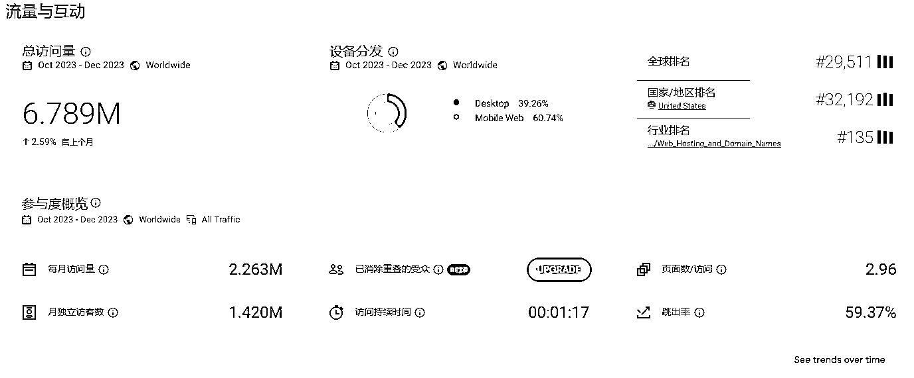

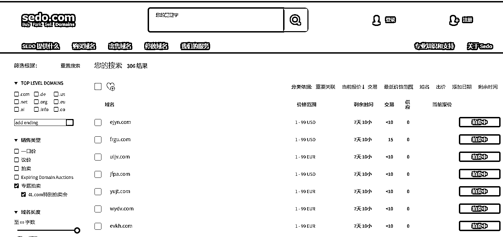

[2.tonic.com](http://2.tonic.com) 是一个独特、易于使用的自助平台，用于购买和变现域名流量。广告商可以购买具有各种定位选项的独家高质量流量。出版商可以通过轻松创建高效广告系列来变现他们的流量。作为全球最大的流量市场之一，TONIC 每秒处理超过 40,000 个请求。

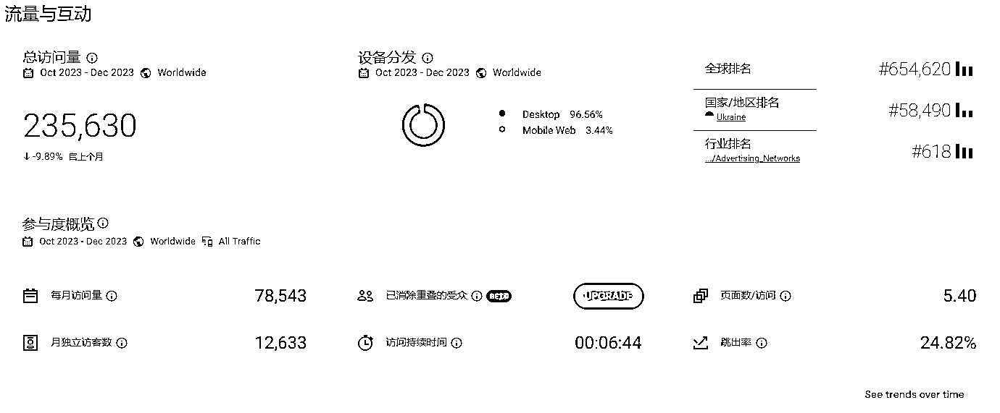

3.Domainactive

与数字媒体行业内的广告商和网络建立了合作关系。他们的合作伙伴利用 Domain Active 的平台和全套优化解决方案，通过他们的网站、流量和域名组合实现盈利。Domain Active 为他们的合作伙伴提供了详细的报告和收益管理工具，为他们提供了业界先进的货币化解决方案。

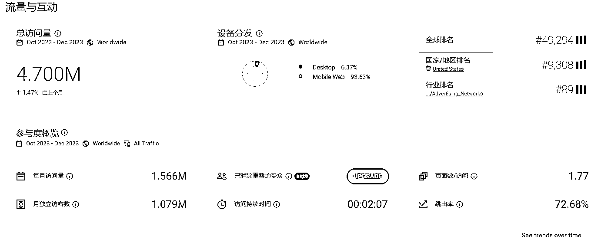

4.System1

网站每月覆盖 1.2 亿消费者，涵盖健康与保健、汽车、个人理财、旅游和娱乐等多个垂直领域。网站包括 Startpage、私人搜索引擎和 [info.com](http://info.com)。利用受众扩展能力为不断增长的应用程序组合（包括受保护的安全产品套件）建立受众。

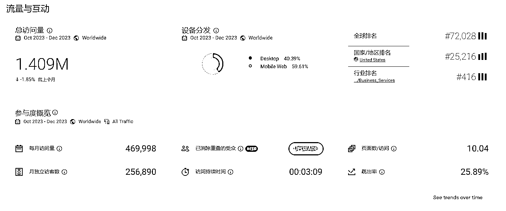

以 sedo 举例

了解 sede 的申请详情页面

开始注册

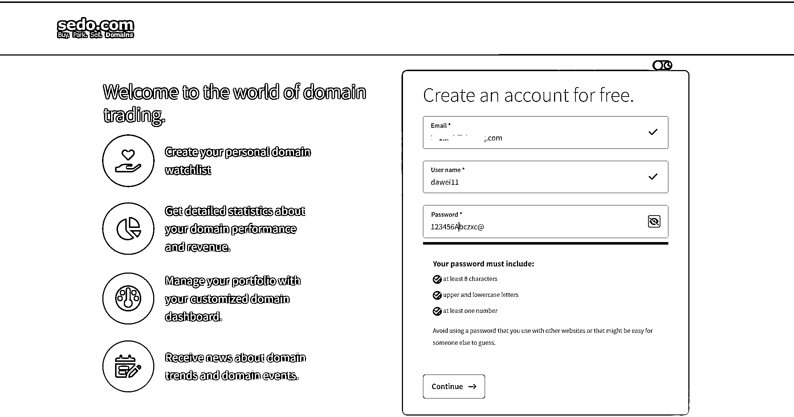

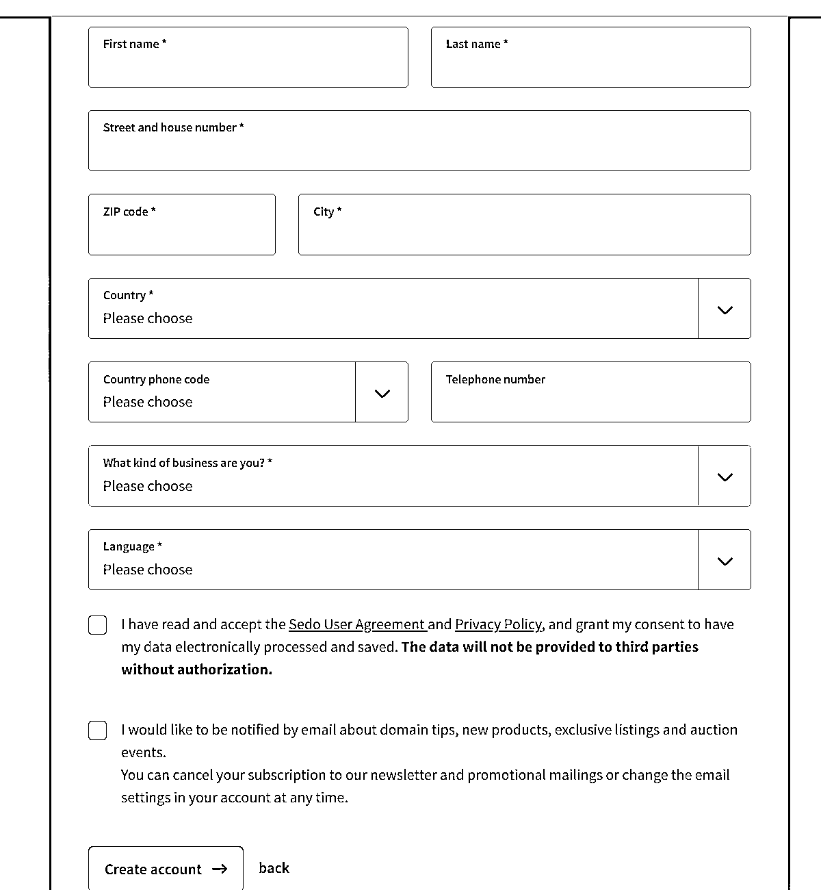

注册完成进入后台域名停放页面

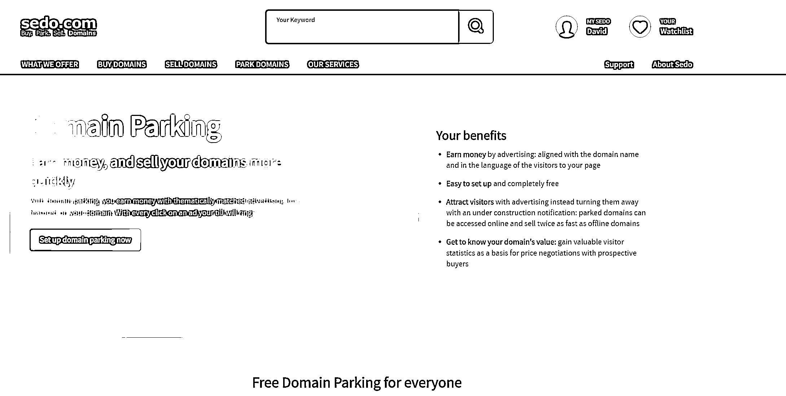

需要提供域名：

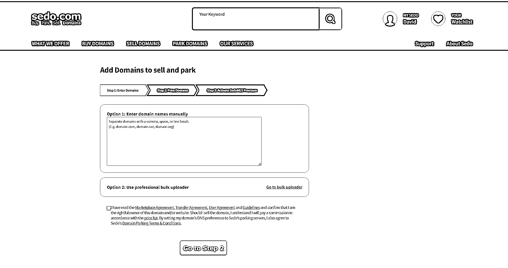

设置价格

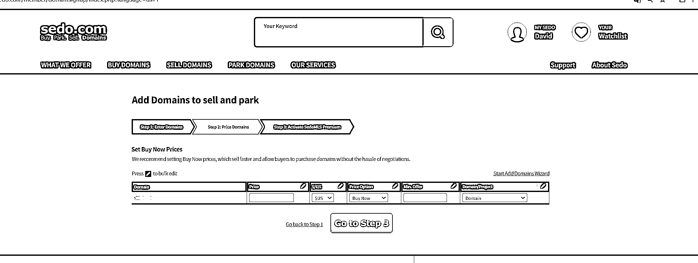

协议可以看出对这种行为是明面制止的

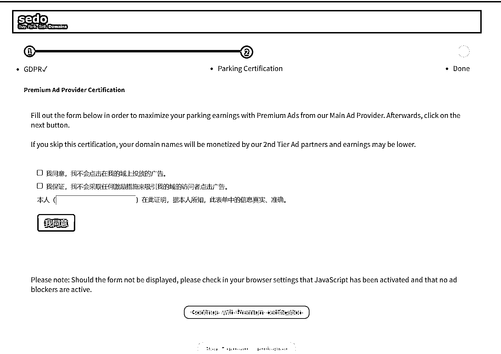

规则：可以看到这个行为是有一定风险回收费用的

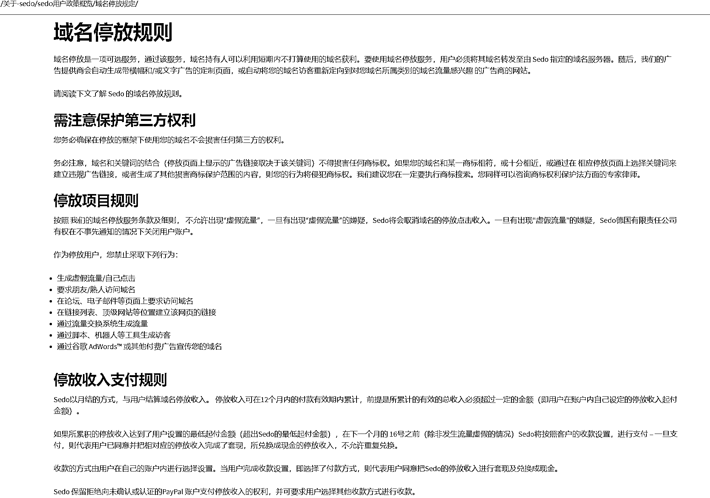

进行认证后就可以挂靠广告：

正常来说认证是比较麻烦和复杂的，我不知道我的怎么突然就过了..

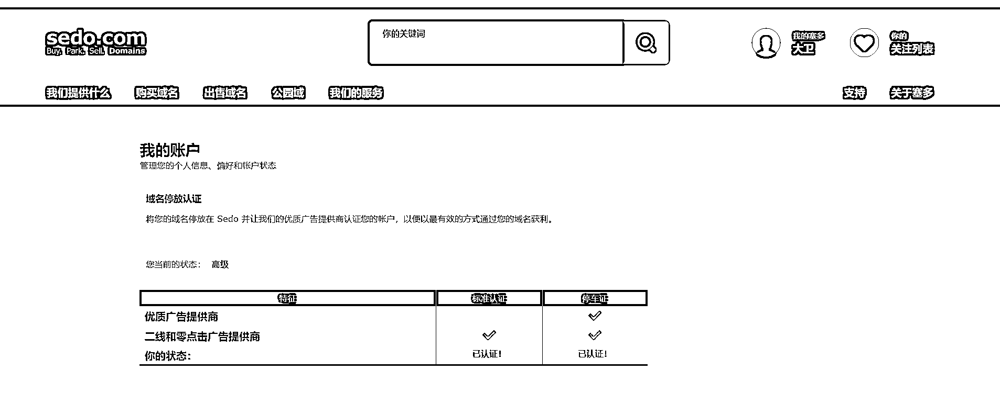

回归大家关注的点

本质就是过 tiktok 广告购买廉价流量并将其重定向到 AdSense 的登陆页面来套利。

tiktok 的流量费用只需要低于广告回报，就有得赚。套利该差价的思路也就这么清晰

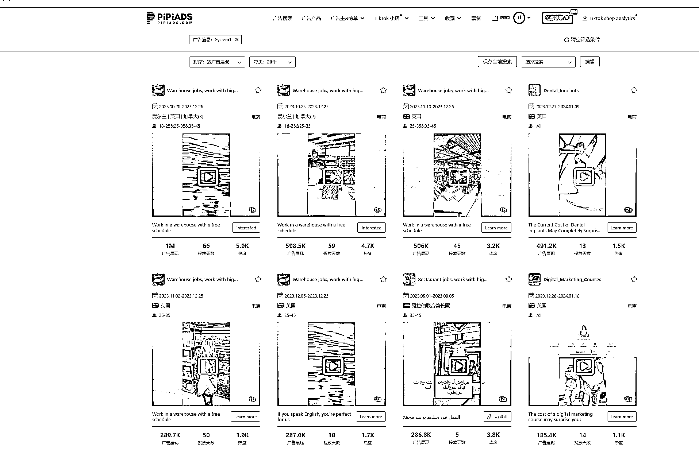

不过，据相关信息反馈，利润率极薄。人们需要每天投资 5 万到 10 万美元才能获得可观的回报，但这会带来相当大的风险。初次之外需要解决跟踪方面的实施问题。确定哪些点击 ID 可以很好地转换 并且创建白名单和黑名单并不简单。

此外，帐户经常被禁止。现在网上关于这种方法的信息很少，除非您有团队和大量的投资预算，否则该方法不可行。即便如此，利润率也不是那么可观。

pipiads 上的广告数据可以挖掘到大量玩法和有用信息，该信息仅提供参考

* * *

评论区：

暂无评论

* * *