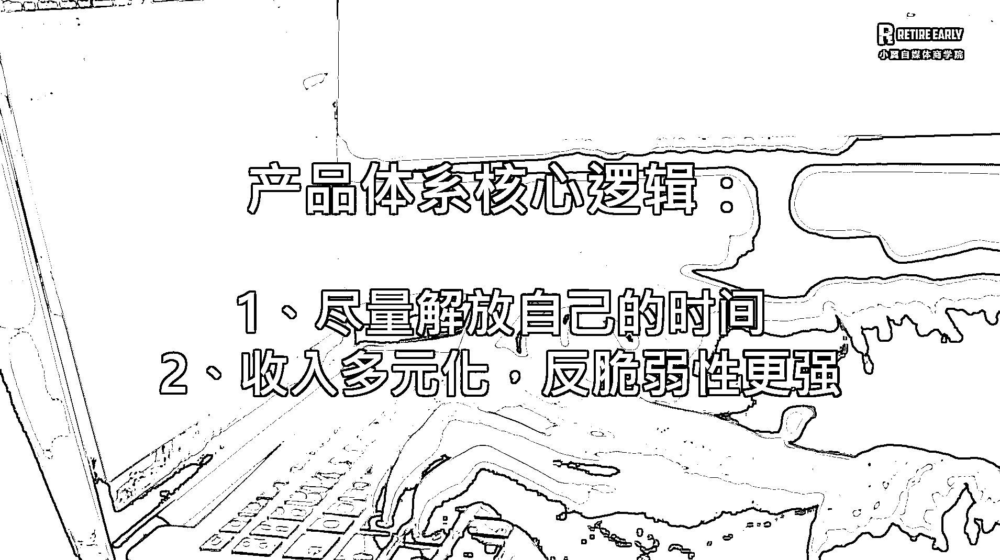

# 副业从 0 到月入 10 万，辞职做自媒体 7 步教程

> 原文：[`www.yuque.com/for_lazy/thfiu8/is1n7d7ox5dzgrt4`](https://www.yuque.com/for_lazy/thfiu8/is1n7d7ox5dzgrt4)

## (98 赞)副业从 0 到月入 10 万，辞职做自媒体 7 步教程

作者： 丁小翼|觉醒合伙人

日期：2024-01-29

《**副业从 0 到月入 10 万，辞职做自媒体 7 步保姆级教程》**

你好哇我是小翼。

从去年 7 月开始，我已经不上班正好半年啦。

去年 1 月，我还是个普通打工人，

去年 12 月，我已经可以不上班，还能出去旅游，当月营收破 10 万。

熟悉我的朋友都知道，我很少晒收入，我收获了很多比金钱更重要的东西，但收入至少能说明，我的商业逻辑跑通了。

这段时间，我收到的最多的问题就是：

**小翼，我也想要辞职不上班，需要做些什么呢？**

今天就给大家系统复盘总结下《**副业从 0 到月入 10 万——辞职做自媒体 7 步保姆级教程》**，聊聊如何开启自由职业之路，做到“不上班也有钱”。

总共分为七个阶段，建议 1-4 阶段，最好在辞职前就完成，辞职后可以专心做 5-7 阶段，稳稳过渡成功。

**（肝了一周，全程 7000 字硬核干货，记得先赞后看，欢迎分享你的启发！）**

# 一、**认知：看了一本书，决定做自媒体**

2021 年末，我看了一本书叫《认知觉醒》，

相信很多伙伴都有读过，作者的巨大转变，击中了我。

在此之前，我自认为还算“上进”，主业之外兴趣爱好广泛，但大多数都浅尝辄止。

（关于这之前的经历：[扒一扒小翼的故事](https://mp.weixin.qq.com/s/lRnTO_erdfdXiE0M2xiZAg)）

自媒体这块，我尝鲜都非常早，公众号是 2012 年注册的，小红书是 2016 年，抖音是 2019 年，

现在来看都是“傻子都能做好”的红利期，但跟大多数人一样，只是偶尔兴致来了发几下，然后就没有然后了。

看了这本书之后，我终于明白了自己看似“上进"，为什么生活没有发生转变。

核心原因就两点：

**一是我的认知不足，我的学习停留在表层，不懂得自媒体的拐点思维。**

**二是我没有强烈的动力，陷入“小富即安”的生活中，没有什么“痛苦”迫使我快速转变。**

第一点就特别容易踩坑，我曾经以为自己是个“3 分钟热度”的人，后来发现并不是我没有耐性，而是不知道拐点的存在！（现在朋友对我的评价是“特别有定力”，可见转变之大）

什么是拐点思维？指的是任何有杠杆食物，都存在这样一个拐点，在拐点前增长非常缓慢，收益可以忽略不计。

等积累到拐点后，会爆发式指数级增长。

打工人容易用线性的眼光去看待自媒体，认为跟上班一样，应该是一份付出，一份收获。

**所以如果没有这个思维，当你付出已经到 10，而收获还是 0 时，特别容易以为是自己没天赋/不适合/没前途而放弃。**

第二点也是大家普遍面临的原动力不足问题，因为转变的过程注定是逆人性的，无人监督的，需要自发的深层动力，才能走得更远。

针对这一点，我问了自己 3 个问题：

**1）我为什么要做？至少深挖 5 个为什么。**

比如我为什么要做小红书？——因为想做副业赚钱。

为什么想赚钱？——因为赚钱如果能比主业多，就能不上班养活自己。

为什么想要不上班？——因为我想实现 40 岁退休，上班是 100%无法实现的。

为什么想要 40 岁退休？——因为我想过更多可能性的生活，我可以决定自己今天几点起床、在哪里、做什么。

为什么想要有更多可能性？——因为我想一生过得更有意义，作为一个没有父母托举的普通女孩，靠自己实现目标，并帮助更多人做到，是很有价值的事。

**2）我不这么做可不可以？**

这个问题，是确认自己有没有退路，斩断任何退缩的借口：

我的答案是“不可以”，理由如下：

1、工作 8 年，即使年薪 50W，打工这条路，无法实现我的目标。

2、致富靠杠杆，我个人背景既没有资本，也没有资源杠杆；作为文科生，也没有代码杠杆。

3、唯有自媒体杠杆，是不需要资金和人脉，我完全可以学习掌握的。

**3）我愿意牺牲什么？**

这个问题非常重要，不能只看到得到，不想要付出。比如：

你是否愿意牺牲休息和娱乐时间：下班后很累了/周末想出去玩，你还能坐在电脑前探索副业？

你是否愿意花钱投资自己：别人买衣服、买吃的，你优先买不能吃不能穿的知识产品？

这些都需要你提前想象、确认可以付出，做好“先舍后得”的心理预期。

李笑来说，改变想法即改变生活。

对我来说，正是这两个核心思维改变，让我坚持到了现在，已经通过自媒体，实现了不上班的第一阶段目标。

**所以做自媒体比具体项目、方法更重要的是发心，**

**你一定要做一个很大的转变，才能改变命运。**

# **二、方向：选择大于努力，换圈子开眼界跟对人**

我之前分享过，拉开人与人之间差距的 4 个点：信息差-认知差-选择差-执行差

想要做自由职业，你之前又没有副业成功经验的话，建议先做这 3 件事：

**1、混圈子**

**混圈子可以帮你分清是能力问题，还是见识问题。**

有些事情你不会做，可能只是因为你不知道。

进优质圈子，可以让你快速开眼界。

**2、找导师**

你遇到的百思不得其解的卡点，可能只是别人的日常经验。找对导师，成功概率高一半。

**3、学对标**

对标是你够一够能够达到的榜样，找到方向后，快速模仿学习，拿到短期反馈。

如果你不知道有哪些圈子和导师，可以找我给你推荐适合的，绝不会坑你。

因为我曾经也是个“超级抠”的人，觉得自己“搜商”还较高，这些资料用心搜索下，都能免费找到嘛。

**但真的实践过后，发现付费才是“捡便宜”。在初期，你的时间和热情是最值钱的，也许消磨后再不可逆。**

而且在免费攻略中，你很难找到针对你个人背景和个性化问题的精准解答，这会让你产生不必要的内耗，多走很多弯路。

我自己比较幸运，因为主业就是做 marketing 的，所以方向上很快就锁定了小红书，在 2022 年达成了 10W 粉丝。

同年，我果断加入了自媒体创业星球，深度链接导师。第二年，我又加入了合伙人，到现在算下来，当初加入星球的那几百块钱，已经百倍赚回学费了。

所以第 2 步，不要瞎努力，保护好自己的热枕，投资你想要紧密同行的人（契合度比对方名气更重要）。

**要知道花出去的这些小钱，相当于游戏里的加速器，按照提示的方向走，最终都能赚回来。**

**这就是终局思维，我已知结果，就敢于投资，大胆执行。**

# **三、实战：从 0-1 最艰难，一定要熬过去**

**0-1 阶段界定：**

-以粉丝数，我认为小红书到 10000 粉，公众号到 5000 粉。

-以变现数，每月能有 2000 元以上的收入，持续 6 个月。

说下这个阶段，即使你思想上做好了准备，现实中不可避免的遭遇：

**1、所有的第一次，都需要你 1 个人来搞定**

在上班时，你可能习惯了团队作战，但做自媒体，你很快会发现，几乎什么都要自己来。

以做一篇小红书笔记为例，如果你之前 0 基础，那么：

-发什么内容（选题）每周发几条（排期）要你自己定

-文案、标题得自己来撰写

-图片拍摄、排版设计得自学

-视频拍摄、剪辑更是困难重重

每个步骤都存在很多卡点，小白需要从 0 开始学，这个时候不要着急，给自己尽量多的学习和试错，尽量不要给自己加难度。

**我的解法是，1 次只学 1 个技能点，用到熟练，再学下一个。**

比如做小红书，有的同学一上来就纠结图文和视频哪个流量好，但没有考虑到，视频所需的技能点，比图文要多一个量级。

这种导致数量上不去，新手花了巨多的时间做了一篇笔记，大概率不会火，特别容易被打击到。

（我早期的视频作品，也花了一段时间才定型）

这时不妨从相对容易的图文开始，图文里从有固定模版的“干货合集类”开始，先学会做这一类图文笔记，用到熟练，

再换另一种形式测试，又学一个技能，这样你的技能越攒越多。**就像武器库一样，可能最终的爆款，是 2-3 个技能的组合，也是一种降维打击的形式。**

**2、与家人充分沟通，但不要拉家人/朋友入伙**

前面说了，副业做自媒体必然会牺牲休息、娱乐和社交时间。但你的家人可能会不理解，因为你看起来忙忙碌碌还没啥成果，又减少了陪家人的时间。

这个时候就要做好充分沟通，让 TA 给你一段时间，去全力探索。

我那个时候就跟家人说，我的预期就是一年，预期一年能达到 XXX 成果，这是为了未来实现 XXX 的目标，就是需要投入业余这些时间来做。

这个阶段，我不建议拉家人入伙一起搞。有学员跟我说，自从搞了自媒体，对伴侣的耐心都下降了，想让他帮忙一起搞。

我建议不要，因为你自己都还没拿到结果，对方也没有你现在的认知，而自媒体本身的不确定性就很高，两个人一起干活意见不合，就容易吵架。

**所以不用拉着 TA 进步，先自己做出成果，吸引 TA 主动想要了解学习。这跟做私域经营一样，我们只吸引，不强求。**

另外在职场中，要尽量低调。可以用小号来做副业，这样可以大胆放心做，不必担心遭小人妒忌。

**3、坚持不下去时，重新回顾你的“北极星”**

北极星指标，就是我们第 1 步想通的“发心”，因为在过程中一定存在“计划赶不上变化，结果不如预期”的时候。

我虽然在主业上做过几家公司的市场负责人，但从幕后走到台前，给自己做 IP 的过程中，该遇到的坎仍是躲不掉。

比如一开始我给账号定位的是理财博主，没成想 2021-2022 年理财市场一路低迷，官方政策也开始打压理财类内容，导致很多内容都违规不能讲了，而这些内容在 2020 年发就是爆款，有种生不逢时的感觉。

遇到这种“不可抗力”的变动都是非常正常的，千万不要因为这个被打倒了，我重新回顾我的初心，我的目标是通过自媒体不上班也有钱，那不做理财博主可不可以？

答案是完全可以，后面我开始讲读书，又扩大到职场，再扩大到干货 vlog。

**形式和内容在变，我的北极星始终不变，指引着我总能找到对的路径。**

# **四、变现：尽早开启商业化，赚到第一块钱**

人是极其需要反馈的生物，短期拿到正反馈很重要。从自媒体上赚到的 1 块钱，可相当于职场上的 10 块钱。

因为做自媒体相当于掌握了生产资料，你分到了 100%的收益，而不是只有 1/10。

**1、把自己产品化，敢于收钱**

纳瓦尔说过，想要不靠运气致富，就要把自己产品化。

**当你有了一定的粉丝基础后，小白做这 3 个方向，必定能赚到第一块💰：**

**1) 资料/技能收费。**

比如我整理了一份 XX 绝密资料，打赏任意金额送给你；

我会做红包封面，我会 AI 绘画，19.9 元帮你搞定一张图；

这种你不需要面面俱到，只要你有一个价值点，就可以收费。

**2) 1V1 咨询。**

刚开始没什么影响力的时候，咱们就拿时间换钱，比如求职咨询、自媒体咨询、情感咨询、某个你跑通的小结果咨询等等。

可以从几十块低价开始积累案例，然后就边发案例边涨价。我就是这样做的，1V1 咨询价格从去年刚开始的 99 元/时，到现在的 888 元/时。

这里一定要算下你的打工时薪，比如是 100 元/小时，那后期固定的咨询价格起码要超过时薪。这不就比打工更香吗，自己也更有动力去做。

这里提下，越到后期你的时间越贵。如果想接更多单，可以把时间颗粒度放小，比如 30 分钟，15 分钟咨询可不可以，效果可能反而更好。

**3) 陪伴群。**

这是我去年验证成功的模式。

即使是小小小 IP，都有自己的受众，不用担心自己的水平才 60 分，60 分教 30 分是刚刚好的，你讲的东西对 TA 来说是最有共鸣的，大佬反而早就过了这个阶段了。

所以这个“阶段性”就非常值钱，反而是你的优势。如果你还不知道怎么做，欢迎来我的群学习观摩。

**金钱是最好的筛选器，真正认可你的人，是会给你打钱的，而商业本身就是提升资源效率的最大慈善。**

**2、克服羞耻症，大胆接广，大胆推广**

接广告不要有心理负担，也不要嫌钱少就不接。

只要不是恰烂饭，接广告的好处多多：

1）正好锻炼你的商务合作能力，熟悉整个商业推广的流程，提升商业价值。

2）锻炼自己写软广的能力，如何才能自然植入，内容既对粉丝有帮助，又让金主爸爸满意。

3）作为阶段性结果，可以向粉丝报喜，我的自媒体开始变现啦，这反过来又将提升你的势能。

4）识别出假粉、黑粉，那些骂你恰饭的粉丝，正好识别拉黑一波，从而看到真正爱你的粉丝。

带货也不要有“发朋友圈羞耻症”，很多人不敢做销售尝试，怕“没效果”，怕“丢面子”，怕被别人说“割韭菜”。

于是在行动前，先自己把自己绊倒了。所以在心态上，一定要纠正自己的认知：

-把好产品推荐给有需要的人，是对对方最大的善意！

-带动身边人一起读书、写作、进步，这不是有功德的事吗？

-朋友通过我买，并没有多花一分钱，我还多送几十几百几千元的赠品，这不是为对方好吗？

-即使你不推广，粉丝也会去别人那里买，万一买到了其他糟心的产品，你是不是替他觉得不值？

（我有好几个学员跟我说“为啥没早点认识你”，我才知道他们之前真的好多冤枉钱，我听着都心疼啊）

同理，给别人带货的好处同样多多：

1）一次简单的带货，就能学到文案、销售、产品营销节奏等各方面的技能，还能筛选出信任你的铁粉，是一举多得的锻炼机会。

2）得到分佣变现。目前合伙人的分销佣金基本在 50%-100%，所以如果流量质量好的话，带货会比接广赚得更多，后续的变现空间也更大。

3）增加被大佬看到的机会：很多产品都会有分销榜单，排名靠前不仅能被大佬看到，而且未来会有合作机会。由此所带来曝光、机会、势能，长远来看无法用当下的金钱来衡量。

4）你一个人不可能生产所有产品，而用户的需求是多样的，带货好产品，能够最大化地用好手上的流量。

**小翼建议“格局打开”，未来不用太在意这是“你的”还是“我的”产品，“自营”和“加盟”都是 OK 的商业模式。**

标准就两个：

1）这是不是用户需要的好产品？2）这是不能能够给你带来足够的投入产出比？

我自己严选的产品，每次分销带货基本都在前 3、至少在前 10。

这样不断向上链接，大佬也愿意给我更多曝光，粉丝也得到了好产品和额外福利，可谓三赢。

# **五、流量：总结、放大自己的成功模型**

在小有成绩后，别忘了及时总结自己的成功模型。

我记得 2022 年 7 月 31 日，在我坚持了半年多之后，有个视频突然就爆了，

而且是小红书和 B 站双平台热门，那它就成为了我做自媒体的那个“拐点”。

其实现在看来，那个视频制作还是挺粗糙的，但爆款就是这样有随机性，于是我赶紧总结了自己的成功模型：

1.  1、相比图文，我的优势在视频，因为敢于出镜，就刷到 50%以上的人了。然后我的表达还不错，相比文字就能够更生动地呈现效果。

3.  2、我擅长把一些相关知识/认知整合到一个主题，用自己的语言简单易懂地讲出来，这种一种稀缺能力。

5.  3、我的爆款公式=选题 50%+封图&封图 20%+视频前 5 秒 15%+文案内容 15%，那就持续 copy。

**这个模型是结合了我的喜好、优势、市场和数据反馈的，接下来就是不断复制、放大自己的成功模型。**

依靠这个，下半年完成了相比于上半年，足足 4 倍的增长。

# **六、产品：0-1 搭建产品体系，收入多元化**

关于产品从 0 搭建，先说下误区：

**误区 1：**小白一上来就先做自己产品，然后花很多时间在制作上，最后宣传后发现很难卖，开始怀疑自己的产品。

这个就是顺序搞反了，不是说不要做自己的产品，而是你先带货大佬的产品“测试下实力”，

因为大佬的影响力和产品，在这个阶段肯定比你自己的成熟，如果大佬的产品都带不动，证明不是产品的问题，是你流量和销售（大概率是流量）的问题。

**正确的顺序是：先搞定流量，再分销大佬靠谱产品，最后再做自己的轻产品。**

在这个阶段，因为是小白又接不到广告，没有收入来源又很容易放弃，合伙人带货的模式其实是最合适的，

自己专心做内容搞流量（先让别人“白嫖”），然后分销各种大 V 产品获得持续收入（因为有信任才有成单），慢慢流量积累了，也可以开始做自己的轻产品了，这个轮子就转起来了。

**误区 2：**先把产品生产出来，再开始卖。

这个也是经常容易犯的错误，一是时机原因，等你生产完可能已错过了最好的时机。

二是市场需求，闷头做完了才公布，万一没啥市场需求，不就浪费了。

自媒体产品完全可以边做边卖，甚至还没做前先盲订，既是销售策略，又能测试市场需求。

我的小红书课程的生产和发售节奏，供大家参考：

-先公布课程核心信息，开始 200 元定金盲订，完成 60%进度

-产品预售阶段，完成 20%进度

-产品正式发售阶段，完成 10%进度

-开营倒计时阶段，完成 10%进度

在这个过程中，我也一直在制作优化课程，我的“责任”优势靠前，已经宣传出去的东西，会督促我去完成承诺，制作效率爆棚。

这招特别有效，后面的小红书副业案例库产品也是如此，要知道在没宣传之前，我已经积攒了半年了，就是迟迟不动笔。。

**解决了误区，再说下产品体系搭建。有两个要点：**

1、一定要有从低到高的漏斗层级。高送低，低转高。

2、不一定都是自己的产品，用户需求导向。

我每个月初，都会发下我的产品说明书，涵盖了我围绕自媒体整合的产品体系：

这样让自己收入更加多元化，反脆弱性更强，同时也尽量解放我的时间，这是我如此搭配的核心原因。

# 七、团队：**小成本招助理，优化赚钱飞轮**

最后一个阶段，我们前面很多时候都在拿时间换钱，现在开始拿钱换时间。

只要你的模型跑通了，最快的放大路径，其实是投放。

低价购买别人的流量（花 5 元），然后在你这产生更大的价值（赚 10 元）。

如果你还没准备好投放，那最简单的模式，就是把自媒体挣来的钱，低价购买别人的时间。

**有 4 种路径：**

**1、从你的社群里，招募志愿者**

最好是从付费社群/用户里招募，这样对你更了解，也更认可。

志愿者主要做一些社群维护和整理工作，可以没有钱，需要给一些其他激励。

**2、从你的付费用户里，招募小助理**

或者志愿者升级成小助理，做一些你不想做的、难度比较低的工作，

比如多平台同步，资料整理、文章排版、视频剪辑等，视工作量给到每月报酬。

**3、招募更多兼职，优秀者升级为兼职小管理**

如果你需要更多兼职，同时他们做的任务是相同的，那可以从中挖掘比较优秀的成为小管理，

替你管理兼职团队，解答各种常见问题，解放你的时间。

**4、小助理升级成全职员工，可远程办公**

等业务扩大了，优秀的助理/兼职，可升级为全职办公。自媒体可远程办公这一点，还是很有吸引力的，

不过全职员工务必慎重选择，设置试用期，三观一致充分认可，才能走得更远。

这里要点有两个：

1、一定要从认可你的人里面招募，可以大大降低不合适的概率。

2、 每个任务，都有清楚的 SOP（业务标准流程）给到对方。可以先让他先试做一件，看是否存在误差，再批量做。

**个人 IP 一定要把团队做小，不要盲目扩大规模，几个核心员工，足以成为超级个体。**

恭喜你看到这里！如果觉得有启发别忘了三连哦，欢迎链接我分享你的反馈，小翼给每位认真反馈的朋友，准备了见面礼~

好啦，最后祝大家 2024 年自媒体起飞，我是小翼，人生辽阔，希望我们一起：实现早日退休！

* * *

评论区：

马姐 : 谢谢小翼的用心分享！我是小白，有时间愿意学习，刚加入生财圈，可以做你的朋友吗？
逍遥公子 : 腻害！学习了[强]
丁小翼|觉醒合伙人 : 可以呀
丁小翼|觉醒合伙人 : 一起加油！
胡晓磊 : 谢谢小翼的精彩分享，用心了，全说我心坎里了~🙏
Chloe : 感谢走心分享！目前是一名程序员，在副业探索初期，请问可以加个微信嘛~
丁小翼|觉醒合伙人 : dingxiaoyi1234  欢迎交流哇
🦄运气爆彭同学 : 一直都在小红书看你的内容，哈哈，居然在生财遇到了，真好[呲牙]

* * *