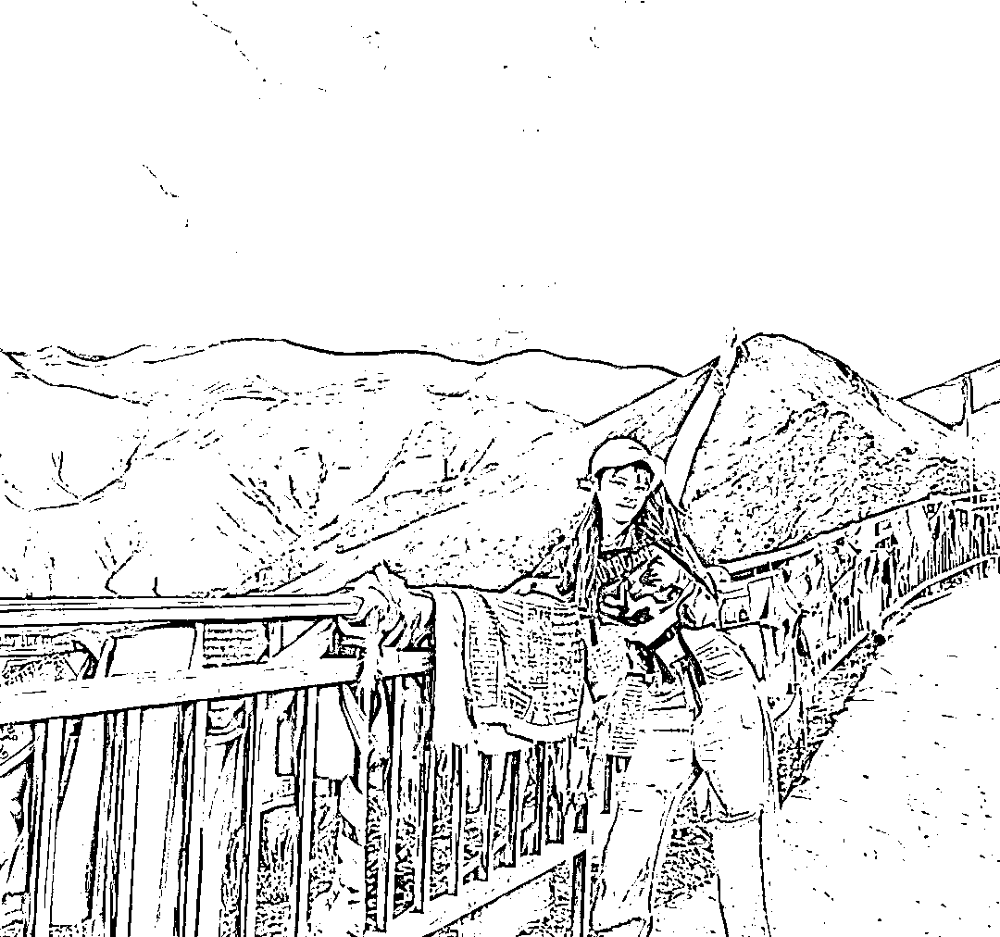
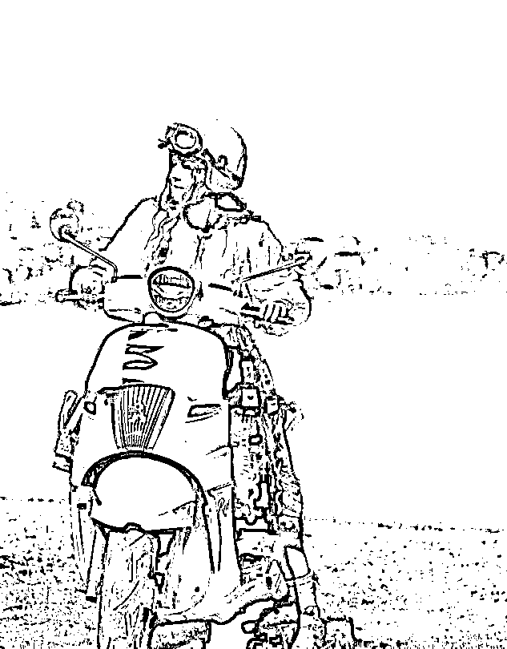
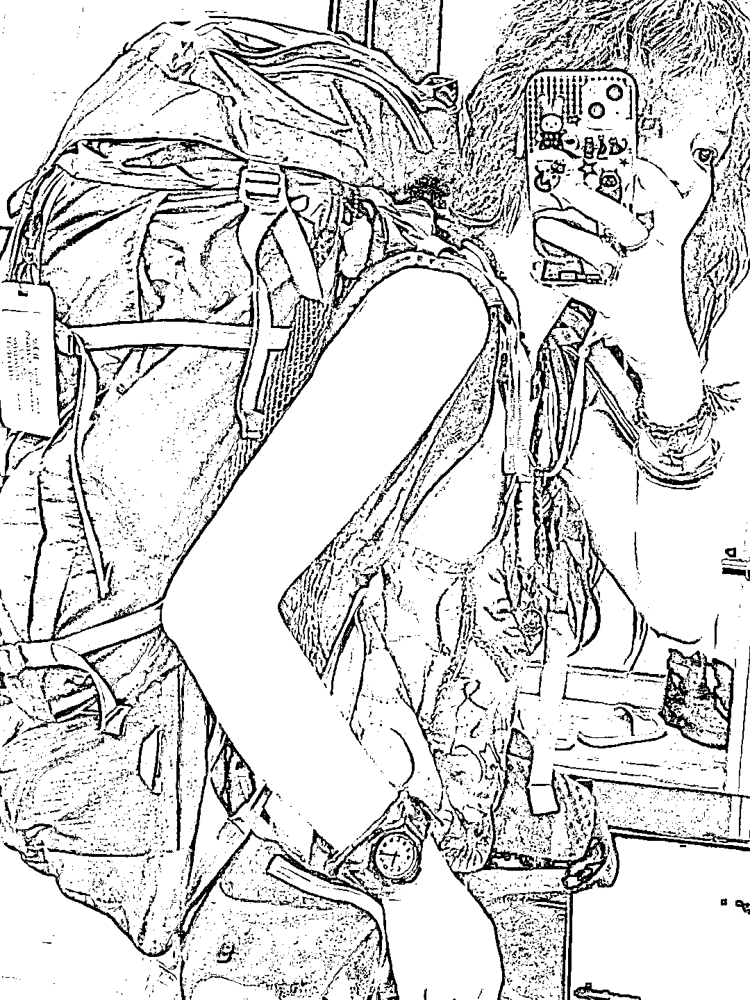
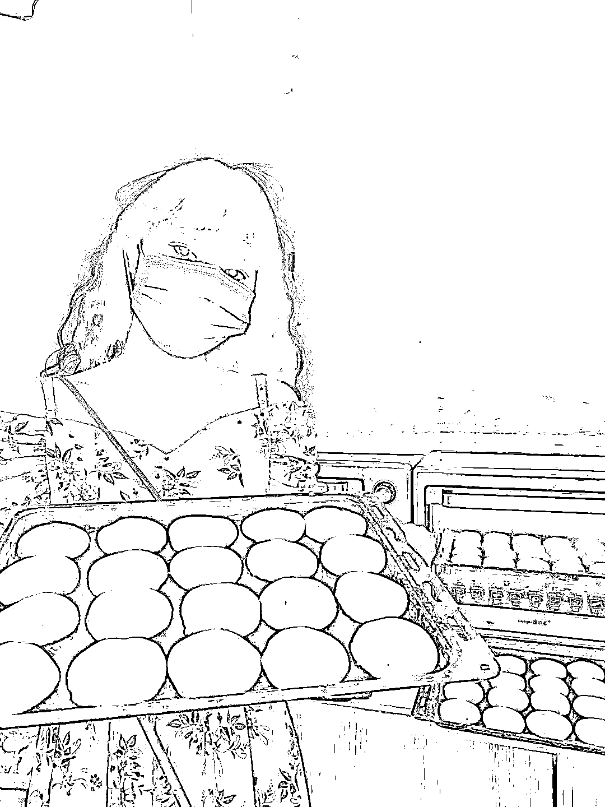
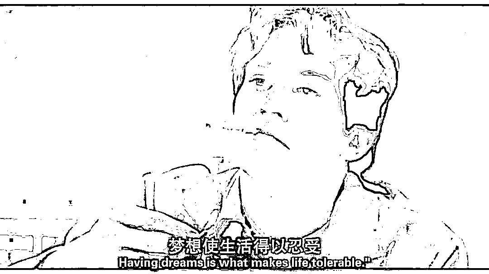
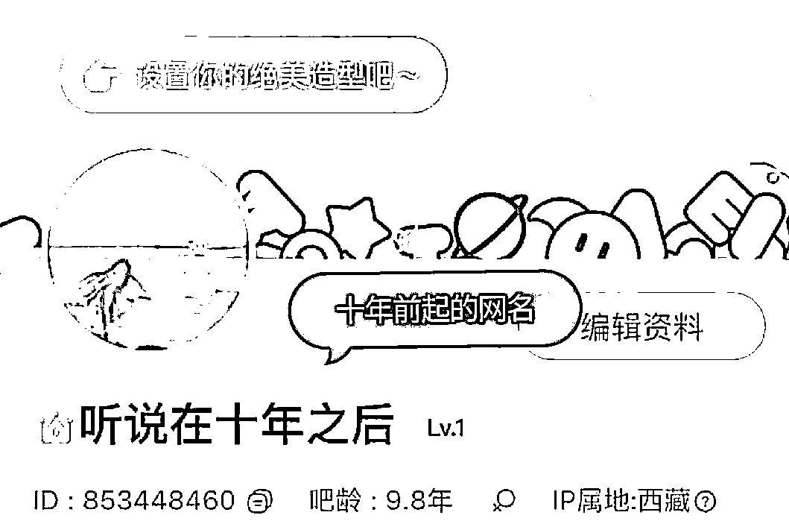
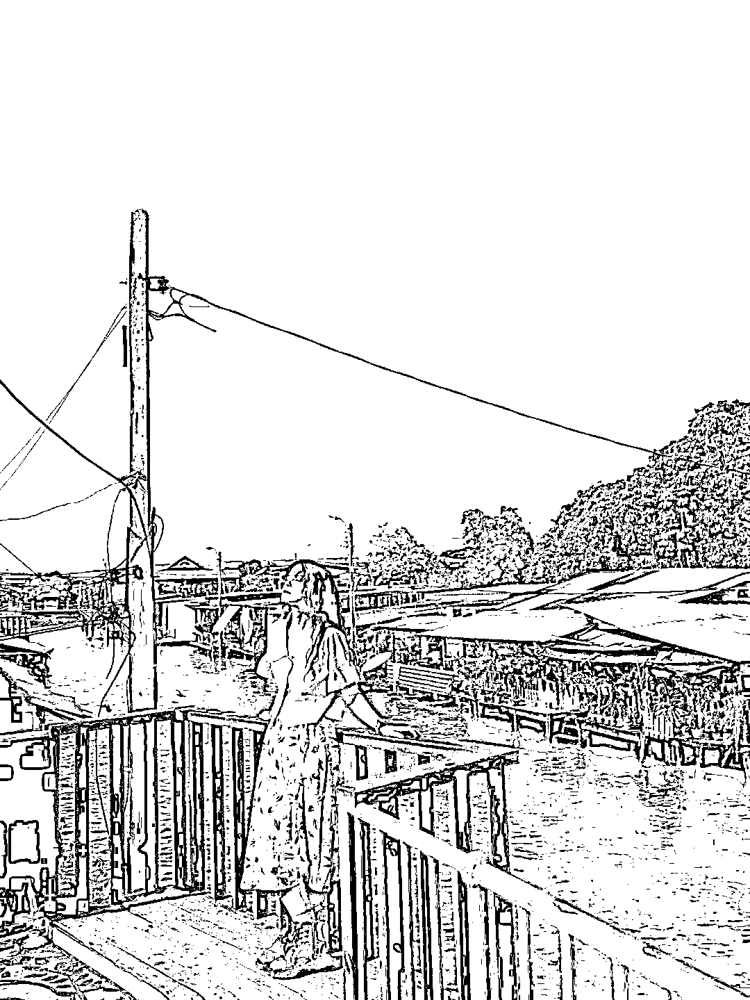
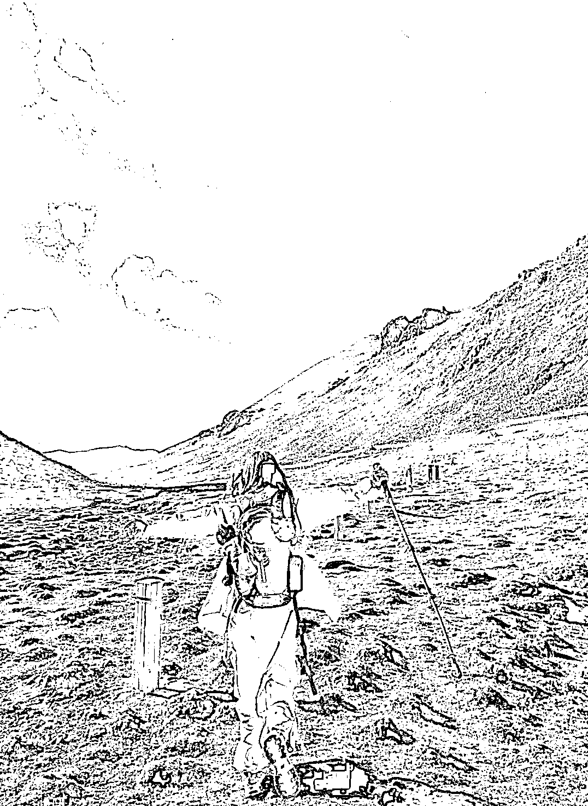
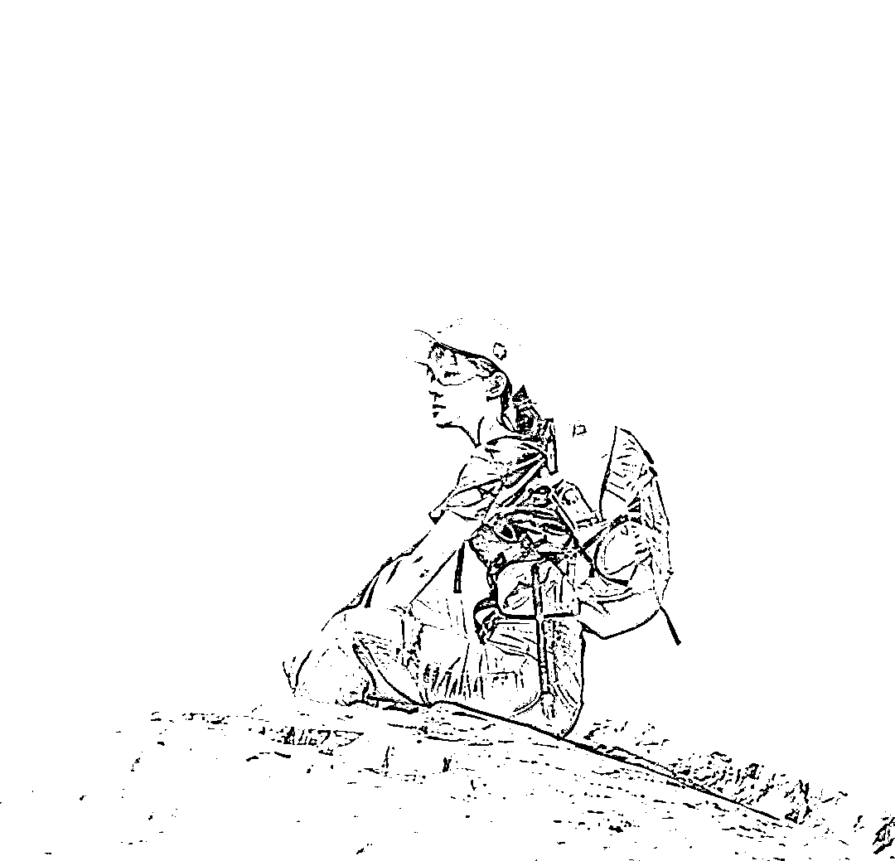
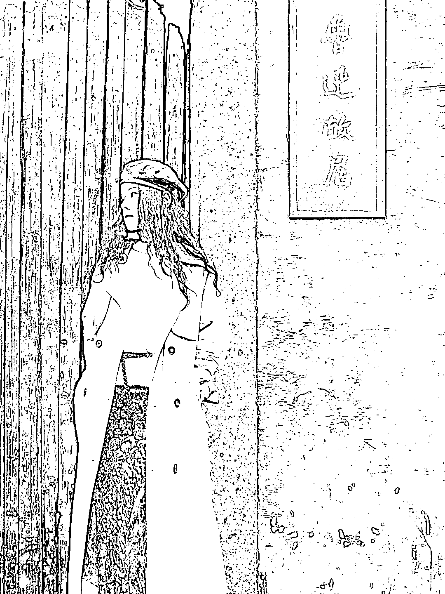

# 如何才能边旅游世界，边挣钱买房！一个八年背包客的分享

> 原文：[`www.yuque.com/for_lazy/thfiu8/mvykotdxgk1lo85x`](https://www.yuque.com/for_lazy/thfiu8/mvykotdxgk1lo85x)

## (32 赞)如何才能边旅游世界，边挣钱买房！一个八年背包客的分享

作者： 小光

日期：2024-02-02

背包客，相信大家对这两个词并不陌生，2018 年以来，相继出现了大量的人裸辞去做旅行自媒体，或者直接裸辞环游世界了，但绝大部分人的结果都是回来打工了。

那旅行自媒体、背包客这条路目前还能走下去么？能赚钱么？

答案也是不言而喻，能！但需要真正的热爱！

大家好，hello，大家好，我是小光，前某官媒的记者和全能编辑，从事新闻宣传工作已经三年时间，2023 年，经我手的视频稿件接近 300 余篇，文案超过 100 多篇，B 站单平台播放 100 万+的爆款视频有 15 篇左右。

近期，我采访了一位名叫郭堇安的姑娘，她从 16 岁就辍学开启自己的旅居生活，到 24 岁时她已经环游完中国 100 多个城市和 8 个国家，出发时可谓是正儿八经的身无分文，也经历了非常痛苦的打工生活，但到现在已经靠着自己赚的钱买了房。

今天，我就把她的故事分享给大家，**阅读完后，请谨慎考虑！**

**本人无法为其故事真实性做背书！**

采访文章如下：

 **住网吧，吃泡面，16 岁辍学穷游的姑娘是怎么活成电影中的女主的？**

如果毕业时给你考公和环游世界两条路，你会选择哪条？

一个按部就班生活稳定，但工作不自由；

一个自由自在，但可能吃了上顿没下顿;

我相信绝大部分人的选择都是考公

面对未知的不确定性时，大家都有一种本性，希望能够有一条确定的路线。

毕竟，不确定性就意味着未来有可能是惊喜，但更有可能是惊吓

特别是近两年来，大环境的影响下，考公考编的人数在不断升高，追寻自我的人变得越来越少。

但同样也因为稳定，这些人只能在按部就班的轨迹中，将自己的生活埋没于无穷无尽内卷之下。

也许，工作过在某个深夜你也会想，如果当时自己选择了岔路口中另一条路的话，会怎样呢？

我们没办法同时涉足两条路，但我们可以从别人的事迹中管中规豹。

**这两天，我采访了一个叫郭堇安的姑娘，她给我讲述的故事，着实令我感到震撼。**

**如果你看过《追梦赤子心》这部电影的话，你会不自觉的将她和用八年青春换来 27 秒辉煌的主人公鲁迪联系在一起。**

**她的故事，或许能够解答你的疑惑**

**01 缘起**

先来简单介绍下这位姑娘

16 岁时辍学开启旅居生活

18 岁时就一人骑行 6000 公里，从中国的南端海南岛一路游至中国的最北端漠河；

19 岁时又单人单车穿过中国、越南、柬埔寨、泰国四个国家。

十次进藏，五年环游中国

等等............

到 24 岁时她已经环游完中国 100 多个城市和 8 个国家。

△18 岁第一次进西藏时拍摄

年纪轻轻，走过如此多的地方，看到这里，可能你的第一反应是：“她是个富二代吧？”

毕竟这年头谁不想去环球旅行？可绝大多数人裤兜里的贫穷终究限制了身体的远行。

**不过郭堇安的经历，或许跟你想像中的完全不一样。**

**她拿到的不是逆天开局的剧本，而是靠着自己的努力撰写出了自由的人生。**

相比富二代来说，郭堇安出生在一个普通的家庭里，她的父母只是从茂名前往深圳打工的普通人。

在她小的时候，原本的生活可能算不上多富裕，但最起码衣食无忧。

她也在深圳长大上学，那些年，在父母的精心呵护下，成绩一直名列前茅。

或许，如果能一直按这个方式走下去，她也是一名出色的大学生。

但不幸的是意外来了，美好的生活在她 10 岁的时候戛然而止——父亲出车祸去世了。

就这样家里的顶梁柱忽然塌了。

堇安原本生活的节奏完全被打乱，命运的轨迹也因此改变了方向。

本来家里的经济来源由父母两人承担突然变成了母亲一人独自承担，因此家里已无力负担她在深圳的生活，只得跟随爷爷奶奶回老家继续上学。

△旅居中骑着电动车转悠

突如其来的变故使得堇安很不适应，尤其是老家的观念跟深圳大不相同，最明显的是当地教育观念相对比较落后，普遍认为女生与其费力读书，还不如“早点”嫁人，有个安稳的家。

**这个“早点”早到什么程度？**

**早在她 16 岁的时候就开始给她张罗相亲嫁人。**

或许你会觉得夸张，但魔幻的现实就是这样。

也正是在这种观念的影响，家里连高中都没让她上，而是安排其进了一所卫校，以期她能早日毕业赚钱养家。

**那个时候，她 14 岁。**

但家里没想到的是，正是这个决定，彻底改变了她的一生。

刚上卫校的第一天，当她跟着老师走到学校的模拟病房里时，她看着面前的场景就愣住了。

她很清楚的记得那一幕，在那个充斥着酒精味的实验室里，摆满了各类毫无“气色”的冰冷仪器，它们**冰冷到似乎没有任何的温度，就连自己不多的好奇心也被彻底冰封住。**

**眼前的这一幕让她明白，如果继续沿着这条路下去，未来跟现在将没有任何的区别**

**仿佛，自己的人生已经被判处了死刑**

就这样一眼就望到头的人生，还有什么好期待的？

那天她哭了整整一上午

她极其地不甘心，外面的世界明明那么精彩，而自己却要沿着这样一条路走下去。

她没法说服自己，于是在做了四节课的思想斗争后，她跟谁也没说，径直的离开了学校，决定去看看外面的世界。

彼时的她并没有什么旅居的规划，就只是单纯的想逃离当下的生活。

△旅居中准备出发的路上

但很快她就回来了，因为她就带了 90 块钱。

不过这一次出行虽然短暂，但在的逃离中她感觉重新找回了自我。

自此后，命运的齿轮开始转动。

经历了这一次逃课，内心深处这场有关未来究竟是按部就班还是追寻自由的博弈，结果已不言而喻。

最终这名“叛逆”的姑娘，经过跟家里人不断地沟通、商议甚至是争吵，在 2016 年 2 月份退学了。

**很难想象，堇安当时到底顶住了多大的压力。**

她的母亲、老师、同学都不理解她，每个人跟她讲的都是：

“你学完毕业，找个人嫁了，踏踏实实多好啊”

“你一个姑娘家出去闯荡，多危险啊”

…………

甚至，家里人在她出门的那一刻对她说到，**从她出门的那一刻起，便不会再给她一分钱。**

而家里，真的再也没有给过她钱

就这样，堇安把仅有的 100 块钱用来买了张到深圳的车票就上路了。

虽然身无分文，但这一路上她带着理想和热爱。

出发前，她给自己说了一句话：山南海北我还没走完，你却跟我说只要平凡。你想庸淡，可我还爱着河川。

**这一年，她 16 岁**

**02 磨难**

在后来旅居的生活里，她遇到了一系列的困难。

她被人抢劫过；仅剩的百元纸钞被人找零时全换成了假币；骑行时还摔出过脑震荡…………

但这些痛苦比起她退学后第一年的生活，都还是算小菜一碟。

整整一年的时间里，她都是在打工中度过的，**贫穷和焦虑始终伴随着她。**

最穷的时候，她连吃饭的餐具都买不起，为此，她只得买了一个碗装的方便面，当作自己吃饭的餐具，当她把里边的泡面吃完后，便把碗留下来当餐具使用；

一日三餐吃的要么是几块饼干，要么是打折方便面，即便这样一次吃一包她都舍不得，通常都是一包泡面吃两顿

△旅居中的打工时刻

由于租不起房，晚上睡觉就选择睡在网吧，10 多块包宿太贵，只能花 3 块钱开一个小时，趁机趴在桌子上睡；

肯德基、火车站广场她都睡过，而至于被褥，则根本没有。

在这过程中，还因为吃的条件太差而得了肠胃炎，她甚至连看病的钱都没有，每次病痛发作时只得强忍，直到后来慢慢赚了点钱才终于看了病。

△旅居中的打工时刻

在这一年的时间里，她先后当过**超市收银员、理发店前台、传单地推人员、饭店刷盘子服务员、甚至还进厂打了几个月的螺丝。**

在她打工的日子里，本来生活就很拮据，受尽了欺负，更过分的是，竟然还有黑心老板坑她，忙忙碌碌干了一个月，结果最后老板一分钱都不给她发。

就这样的情况下，她仍然坚定不移的认为当初的选择是对的。

即便在最困难的时刻她也始终相信，如果灰溜溜的回去，那以后的生活，一定会更惨。

我自成海，又何必赶潮

**毫不避讳的说，那时的她看起来更像是流浪汉。**

那一年的生日，她没有给自己准备任何的礼物，在网吧中她度过了自己的 17 岁生日这平凡又不同寻常的一天。

**她唯一的感慨就是：自己还活着，挺好！**

正如《追梦赤子心》中那句经典的台词一般：**梦想使生活得以忍受。**

****

**03 收获**

从 14 年第一次旅行开始，到现在整整十年。

她用自己的实际行动给十年前的网名“听说在十年之后”写下了答案

**十年来，她最大的收获就是更多的认清了自己。**

**同时也学会了坚定自己的热爱**

她从最初出发时的自卑、焦虑变成了自信浪漫又坚定的自己。

旅居路上，她也遇见过很多的杂音，也曾动摇过。

△泰国旅居期间

开启新生活后，很多人都跟她说玩了这么多年，该回去过踏实日子了，这让她有一段时间很迷茫。

在她的社交平台上，也曾明确的回复过“我不会这么一直走下去。”

20 年的时候，她有个朋友开了家网店，请她前去帮忙，待遇不错，每个月收入能够破万，于是乎她便决定去试试。

但是打工生活的第一天她就有些受不了了，天没亮去上班，夜深了才下班

标准的打工生活又让她找回了当年逃课时候的感觉——日子一眼望穿。

在还没见过世面的日子里，她都忍受不了这样的生活，更何况是已经走过万里路呢？

**于是乎，这份工作，在她的经历中只存在了三天。**

**但是这三天，她彻底认清了自己，明白了自己想要的生活，从此外界的杂音再也无法干扰到她。**

**小众的人生，何必在意大众的眼光？**

你问她现在对未来的规划是什么样，她也没个答案，她只知道未来也要活的自由，这就是她的初心，也是衡量快乐的准则。

十年来，她也遇到过很多裸辞去环游世界的人，但是最终绝大部分人都知难而退，玩了一段时间就选择了回去上班。

**究其原因来看，最主要的问题还是大家没有找到自己真正出发的目的。**

环游世界看似很精彩，但却未必适合每一个人，一方面是经济因素，另一方面是本身的性格因素。

有的人出发是为了短暂的逃避生活中的苦恼，有的人只是羡慕互联网上的精彩生活。

所以很多人旅行一段时间就会觉得很累，因此，对于旅行最终也只能选择逃避。

而十年来的旅居生活，她也彻底明白了自己能够坚持到现在的主要原因：

带给她快乐的不是旅行本身，而是一路上**的新鲜感和冒险感**

**旅途之所以让她着迷，是因为每天都有新鲜感，都能期待着未知美好的发生**

△泰国旅居期间

这份新鲜感和冒险感可能是未曾见过的雪山；也可能是路上行人讲出的未曾听过的故事；亦或许是第一次坐几十个小时的大巴车的感觉；也可能是做一份从来没体验过的工作……

所以你会发现，她辍学这么多年来，在物欲横流的社会里，能仅凭着“一文不值”的勇气在极低的开支中走完祖国的大好河山；

所以你会发现，即便在艰苦的打工岁月里，她也会用仅剩的空余时间，到当地的城市里花一元坐公交车或者骑着共享单车漫无目的的闲逛；用网吧开机一小时上网的时间导出拍摄的照片;

所以你会发现，即便是现在经济条件富裕了，哪怕目的地的青旅价格跟酒店差不多，她还是会选择住宿青旅，因为这样她才能认识到更多的人，听到更多不一样的故事；

所以你会发现，每次她去任何地方都很随性，出发前很少做规划，而是到了以后现场刷攻略，在跟别人的交流中，寻找出发点；

△高原旅居期间

所以你会发现，在这个照片主宰社交的时代里，自拍照不是堇安旅行的必需品。她的照片看着多，其实只是旅行时间长了存货比较多而已，路上她经常好几个月没有新的个人自拍；

所以你会发现，很少看到她靠着接广告而挣钱。

因为真正的自由，不是随心所欲，而是能够自我主宰。

写到这里，很多人会好奇她是怎么赚钱的，其实她的赚钱模式跟我们认知中的旅行自媒体其实挺不一样的。

她的主要经济来源不是靠接广告，而是在旅行的过程中售卖当地特产，更像是微商。

因为在不断地寻找产品，接触客人中，她能感受到极大的新鲜感。

相反的是，在我们传统理解上的自媒体收入接广上面，她会对广告非常苛刻，因此你很少在她的社交平台上看到她发有关广告的内容。

顺便再给大家讲个有趣的故事。

在 22 年前往西藏期间，她 HS 检测结果本来是阴性，但当时的负责人闹了个乌龙，搞错了检测结果，因而她就被拉到了方舱医院隔离。

△旅居期间休息时的照片

但就在第二天搞清楚情况要放她走的时候，她却主动留了下来，尽管方舱医院的生活条件很差，供给的饭菜简单，睡的床铺也很简陋，甚至每天还有各种虫子爬来爬去

但是她还是觉得非常开心，因为这里充满了新鲜感。在这里她听到了援藏医生的故事，接触到了不同故事的旅人，还跳起了从没有跳过的广场舞……

**在很多人眼中条件极差的方舱医院，在她眼中反而成了反而成了巨大化的“青旅”**

于她而言，正是这份对新鲜感的最求和向往，让她在路上不断认识自我，活成自我。

**正如她身上纹的那句话一般：“永远年轻，永远热泪盈眶”。**

面对路人的杂音，她完美的诠释了什么叫唯有热爱可抵漫长岁月。

毕竟如果谁都能理解自己，那自己的人生又是多么平庸。

**04 热爱**

堇安的这条路，我相信很多人都想走，但是少有人会这么干。

原因有太多了，可能是经济条件上的困顿，也有可能是生活环境的压力，亦或许是对于未知的恐惧。

但无论如何，很少有人迈出这条路。

或许，在工作后很多人会抱怨生活很苦，环境很差，自己有多压抑。

但跟堇安相比，大家不妨想想，自己又对自己真正的热爱投入了多少呢？

如果自己都不能为热爱买单，那旁人凭什么对你有所尊重。

因此，忍受生活中不断地加班内卷和挨骂也是应该的

而被困于囚笼中的人，又怎么能发挥出自己的最大价值，让自己活得开心？

不要总说未来如何，对自己真正的慷慨，应当是把浪漫奉献给当下

**相比之下，堇安折腾退学的时候，只有 16 岁。**

彼时的她，身无分文，空无一物，唯一有的只是一份对现状的不屈和对生活的热爱。

虽然不知未来究竟在何方，但她仍然毅然决然走上了一条她热爱的道路

△前往绍兴旅居期间

她知道，这样的人生，即便随便写写画画，给自己交出的答卷也一定是满分。

她在十几岁的时候在日记本上写过一段话：

**“我不要把 1 天过成 365 天，我不要把一天重复成一年，我不要把这重复的一年过成一生。我要活着，而不是活下去。我要鲜活，我要热烈。”**

如今她已经自由了整整八年，为自己而活了接近三千天。

**她说：我的全部野心 就是自由一生**

当然，我们并不是鼓励大家裸辞去环游世界，正如前文所讲一般，人最重要的是要明白自己的初心，同时也要能够对自己的行为负责

这份责任，不仅是对当下生活，也是对自己的那份热爱。

对自己的热爱规划当然这可以是短期的，也长期的规划。

但不论如何，需知人生是一张单程票。

只有真正为了热爱敢于去争取，生活才会真正的回报自己。

**毕竟，勇敢的人，才能真正享受世界。**

* * *

评论区：

暂无评论

* * *