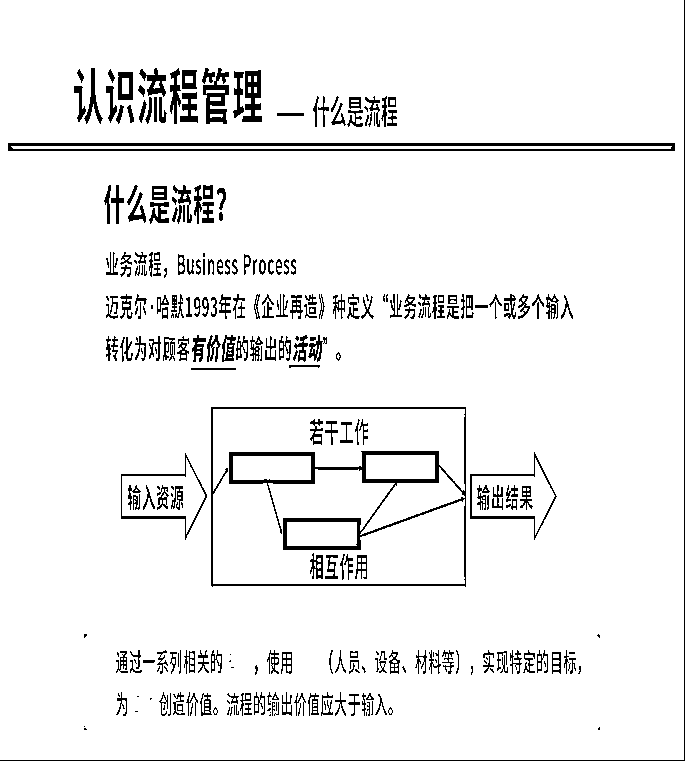
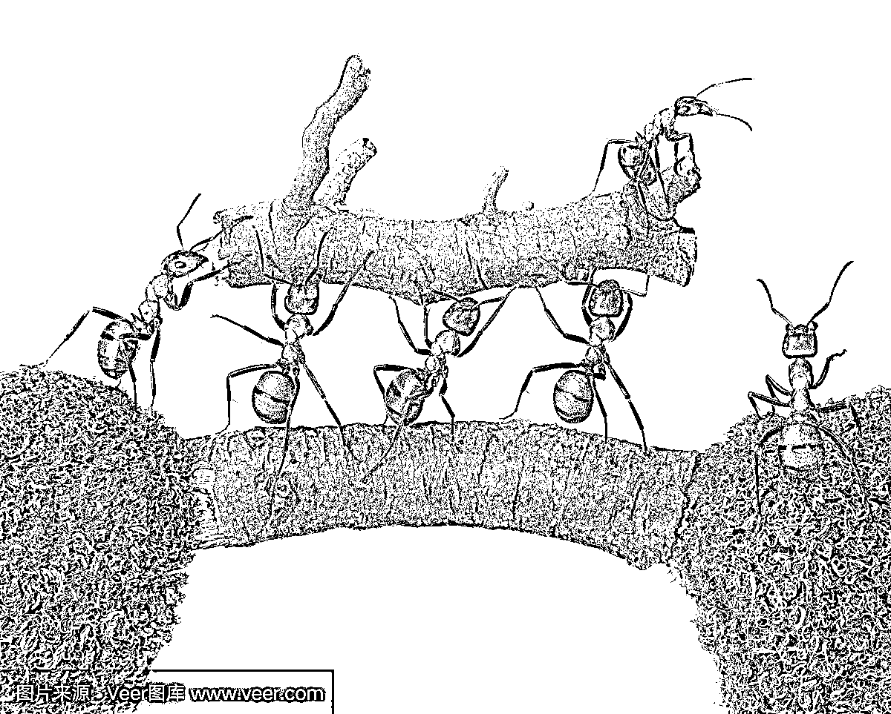
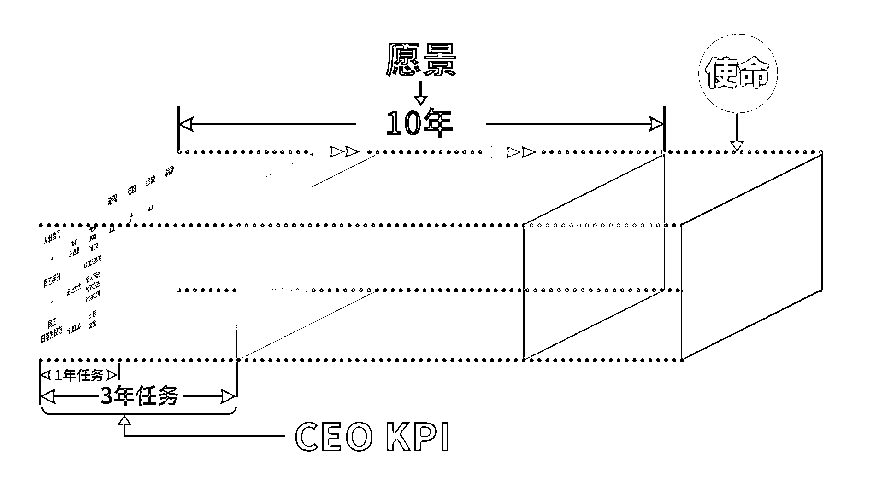
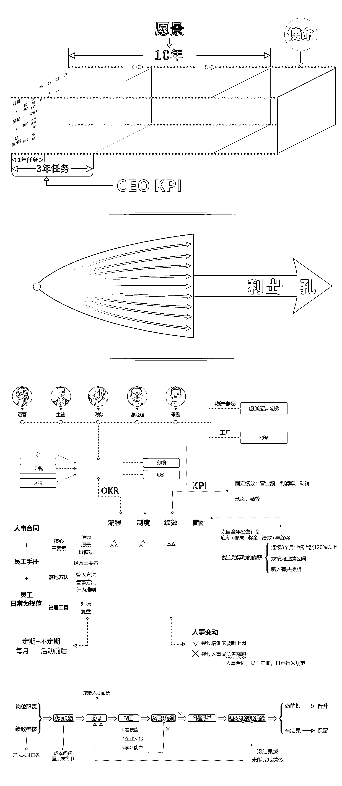
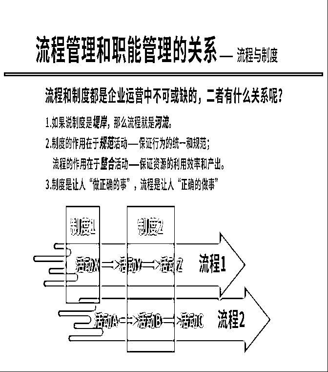
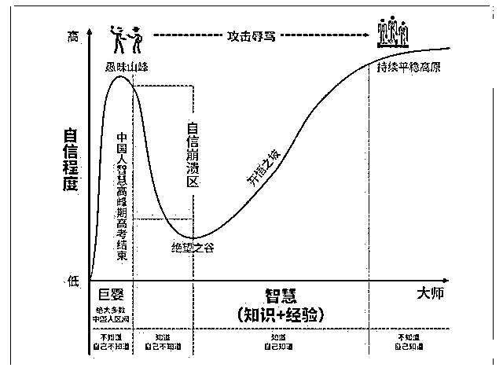
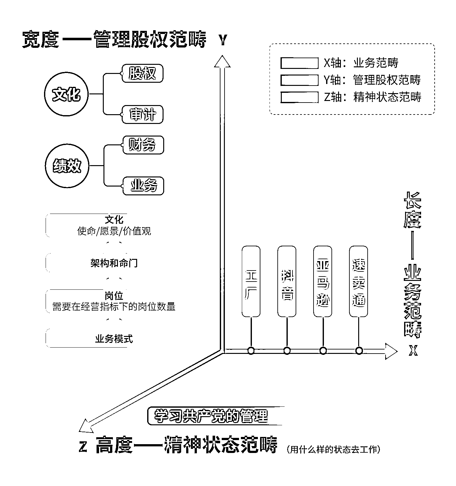
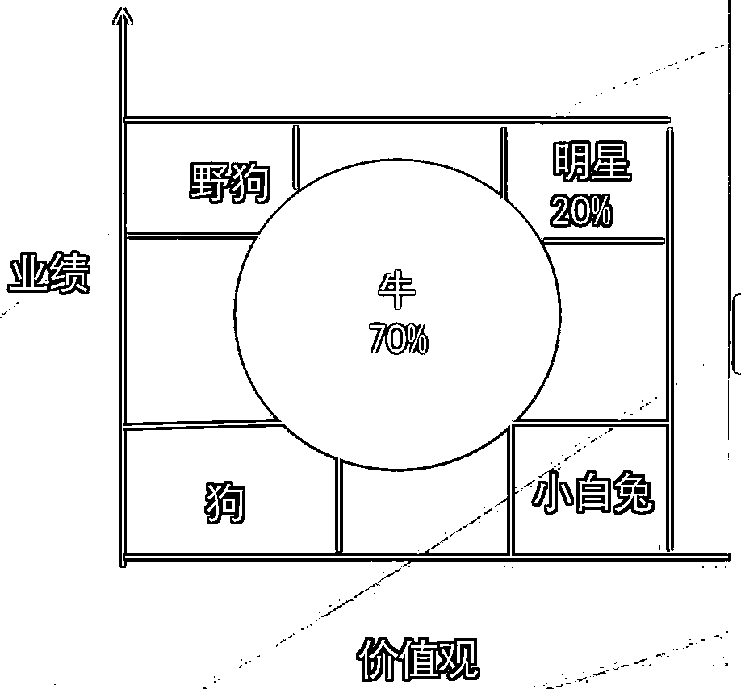
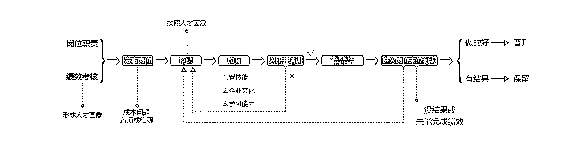

# 企业管理实操手册：老板如何管理公司

> 原文：[`www.yuque.com/for_lazy/thfiu8/to3qfkuvygxb2olm`](https://www.yuque.com/for_lazy/thfiu8/to3qfkuvygxb2olm)

## (22 赞)企业管理实操手册：老板如何管理公司

作者： William

日期：2024-02-06

**《企业管理实操手册》暨一个看了就能懂，做了就能拿到结果的公司管理宝典，企业管理方法都以因人而异的，不是只有这样的就是对的，其他都是错的，只要拿到结果都是好的。**

本文介绍的管理方法，是用企业文化驱动公司发展战略，用战略决定组织，组织完成使命和愿景，从而拿到结果的一套方法，也可以从侧面找到一个公司的基准点，给大家做为参考。

本篇主要说明作为企业主作为公司老板，应该如何让公司自动运转，怎么做好公司流程，做好公司生态的。

后续还会推出老板如何管理业务团队、财务团队以及人事团队的部分，敬请期待。。。

最好的老师，从不把自己当老师，他只会用一切办法让你深刻的认识自己，在听课的同时能够想到自己公司的问题，并且找到答案，找到解决自己公司问题的答案，写出 sop 流程，解决问题，从而成为更加优秀的自己。

听到好的课程，它就像背景音乐一般的存在，在无形当中给你鼓励，让你更好的找到和挖掘自己，让你一点一点实实在在的长大，而不是张牙舞抓地表现自己，让别人臣服。

所以，我希望大家可以通过今天的交流找到自己更多的答案。

# 第一章：别人口中的企业文化到底是什么？

首先在讲企业文化之前先普及一点认知的内容，便于理解文化为什么这样设计。

**企业是一个讲奉献和结果的地方，不是幼儿园和学校，是球队俱乐部或者战场**

所以大家想一下，思考一下，什么家文化管理？什么是俱乐部模式管理？什么是半军事化管理？（请大家看完全片回来做答）

**一、公司的氛围应该如何改善？**

首先说明公司需要什么样的氛围，是员工见到老板点头哈腰，相亲相爱一家人的氛围吗？这样的氛围确实让人喜欢，但是我们是企业主，我们要活下去，我们需要的是每个人眼里有事，手中有活，紧锣密鼓，紧张有序的状态和氛围，我们要的是战斗力。

稻盛和夫认为，“六项精进”是搞好企业经营所必须的最基本条件，同时也是我们度过美好人生必须遵守的最基本条件，“六项精进”指的是：

1、付出不亚于任何人的努力；

2、要谦虚，不要骄傲；

3、要每天反省；

4、活着，就要感谢；

5、积善行、思利他；

6、忘却感性的烦恼。

“如果我们每天都能持续实践这“六项精进”，我们的人生必将更加美好，甚至超乎我们自己的想象。我自己的人生就是如此。”----稻盛和夫

注：

1.付出不亚于任何人的努力：这条非常好理解，当员工松懈的时候，滑水的时候，或者和领导提出各种要求的时候，你都可以问他，你有没有付出不亚于任何人的努力？然后选择是否要同意员工申请，本身荣誉就是给最有结果的人，如果这个人不是你最想给的人，那么老板用什么工具去解决这个问题呢？

2.要谦虚，不要骄傲：这条可以让有成绩的员工不要沾沾自喜，自以为是，是可以解决办公司员工关系的好方法；

3.要每天反省：这个类似于复盘，是个人成长非常重要的事情，也是让员工长期能够跟随公司一起发展下去非常重要的步骤，是体现超强学习能力的好方法，也是先天学历不高，后天态度补足的唯一方法；

4.活着，就要感谢：说是感谢，其实是内心放下的一种方式，为办公室氛围和文化发挥作用；

5.积善行、思利他：小善亦可为，而且要多为，在公司管理的不同层级以正确的方式而为之，流程中没有自己的分工，那就不要乱指点，流程中有自己的职责，那就负责到底，积极响应。

**二、老板或者企业家应该具备的素质是什么？（公司干着干着就不发展了是为什么？****）**

企业家是企业发展的天花板，所以，企业家必须把不断提高自我修养纳入自己的岗位职责，要不断学习精进，提高认知，一定要知道，当好老板的最后一公里就是认知。

**老板的认知解决什么问题？**

厨师做菜还要讲究火候，老板手里拿着资源，带着团队，什么时候切入哪个市场，最终要的就是判断天时是否到来，天时到了就可以入场了，没到就得等。

任何一个电商平台的崛起都是伴随着数以万计的卖家冲进去抢占市场获得的，往往第一波出来挣钱的大多是服务商，以平台红利为诱饵进行割韭菜；

第二波就是实实在在做生意的卖家，他们看到一些人成功才会进入，是一定要确定能拿到结果；

第三波就是大公司或者资本入场了，因为市场人才成熟了，团队组建到复制变得容易，资本的公司往往都是卖品牌的，所以转化率极高，具有极强的收割能力。回顾抖音的生态发展就是这样的。

还有就是老板的认知解决向上兼容的问题，只有向上兼容，才能向上社交，才能有机会上一个圈层，为什么是有机会，因为能不能上一个圈层，还要看你公司的业务有没有发展到可以让你能把向上社交变成正常社交，就是公司体量要做上去才行，没做上去，只是有能力偶尔混个圈子。

企业家是企业大厦的建设者，企业家的高度是企业发展的天花板。企业发展了，企业家的自我修养也必须提高，否则就如同将一辆高速行驶的汽车交给一个小孩子驾驶一样，一旦企业家的能力不足以驾驭企业，企业就会出现问题。

**三、判断一个人是不是有能力的标准是什么？（到底该如何招聘？）**

**1、有能力（解决问题、有亮点、业绩好）**

**解决问题：**解决问题的能力有称为曾经拿到多少结果，如果你面试一个人，她的简历里面都没有说明她在曾经的工作时间里面为上一家公司取得了什么结果，谁能保证他来到你的公司会为你赚到钱呢，有的行业甚至是之前确确实实拿到结果的人，换了一家公司也有拿不到结果的时候。

因为天时变了，挣钱的难易程度不同了，所以，我们要知道，工作不是老板一个人在干，是你的 hr 团队在做，我们公司每个招聘专员在招聘的绩效是每天看 200 份简历。

所以他们在日常工作中，为了提高效率是不会赌那种小概率事件的（就是你又是人才，有不会写简历），hr 更喜欢那种逻辑清晰，思维能力在线，那种看简历就能感受到溢出来的能力的人。

**有亮点：**什么是亮点？亮点就是非一般的工作能力，也就是超乎领导或者老板的意料的工作动作。我们深圳公司的一个亚马逊运营，刚入职 3 天就把原来青岛公司的店铺营业额翻了 3 倍了，我就很惊讶，店铺什么都没变，只有在售库存在减少，回款在变多，什么原因？

这激起了我的好奇心，到了 20 天的时候，她的营业额稳稳的稳定在 2.5 倍，到 30 天的时候就是 3 倍销售额，后来我们在一起聊天我才知道，他每天 9 点下班，回家睡觉 11 点，后半夜 1 点、3 点、5 点到的时候是起来看广告的。当时作为一个从山东去深圳创业的我来说，真是让我吃惊。

**业绩好：**这个就非常容易理解了，前面两个做的再好，没有业绩也是不行的，公司需要营业额和利润，这个在后面具体讲解企业文化的应用时候会说到。

#### 2、成熟（刚开始做生意如何寻找合伙人？）

所有美好的关系，只发生在成熟的两个个体之间。爱情、友情、亲情、合作关系都是如此。

所谓成熟的个体，是实现了三个独立的关系：财富独立、人格独立和精神独立。

世间很多的不完美，爱而不得都是一厢情愿，那么大概率是一方成熟而一方不成熟，例如癞蛤蟆想吃天鹅肉，天鹅已经成熟了，而癞蛤蟆还没有成熟。

所以结果可以想象，还有例如富家女爱上穷小子的故事，富家女一方通常都会有人站出来拆散他们两个人，为什么呢，是因为富家女家庭经济和事业是相对成熟的，而穷小子远远不够成熟，结合在一起也很难有美好的结果。

所以老话讲做事要门当户对，讲的就是这财富独立、人格独立和精神独立的两个人，现在大家是不是脑海里想到的是自己哪方面的成功或者失败的经历呢，那是什么原因呢？

**四、什么是能让公司长期盈利的两件法宝？**

**1、一个作风优良的团队——铁军**

战场上，打胜仗靠的不是某个人而是一支队伍，拥有一支铁军才能打胜仗。拥有铁军，是打胜仗以及持续打胜仗的重要路径。

铁军，固然需要兵强马壮，军事技术过硬，但更重要的是，要有信仰，志同道合，没有信仰的军队是“有奶就是娘”的雇佣军，遇到困难就会将利益，这样的团队是不可能成为铁军的，到关键时候是没有战斗力的。到关键时刻能够经受住考验的团队都是有信仰的团队。

企业经营和管理的目的，就是打造一支招之能来、来之能战、战之能胜的铁军。

成功的老板是不靠某一个人的，成功一定是团队规模化运作带来的必然结果。

也就是说，公司能盈利靠的是前端销售，中台供应，工厂生产，设计研发等等，每一项内容之间一定是有巨大不同的，公司的成功是靠规模带来的成功，还有所谓隔行如隔山，单一部门的一个人是不可能代替公司整体的。而且结果是制定出来的，正常发挥就能做到，团队要抗衡的是变化，变化才是团队重要的对手。

**2、铁军的特征**

是精兵强将、志同道合以及令行禁止。这些特征，唯有靠文化才能锻造出来，唯有使命、愿景和价值观，才能让一支队伍“兵是精兵，将是强将”，队伍中的人志同道合、令行禁止。

这里提出一个老板对公司的掌控力的概念，大家一定听过“静如处子，动如脱兔”这句话，当公司还没有开展一个项目的时候，公司内部和外部是不会有人能够感觉到有这样一个项目的。

当公司一声令下，一个文件下达到位，立马千军万马来相见，老板想让公司怎么变化，怎样动作公司就能对外做出什么样的成绩，这就是企业主对公司的掌控力，而铁军毫无疑问是老板的掌控力最强的一种形式。

我们做生意，动用了多少资金，承担多少风险，我们自己是知道的，那么我是为了嘻嘻哈哈把人招聘进来，给她机会让她成长，然后业绩做成什么样子还要看同事们能干成什么样子。

来和同事做朋友和家人的老板认知都是还没到位的，我们做生意是来赚钱的，是来给精准的用户群体提供价值的，伴随用户做出价值成长，然后让公司立于不败之地，有机会再做点对社会有贡献的事，这才是我们的目标。

对于公司同事，我们现在要求 hr 招聘的时候，操作技能占 20%权重，对企业文化的认同占 30%权重，拥有坚持不懈的学习能力占 50%权重，现在公司从 2022 年 12 月份全公司人手一个 chatgpt 账号。

今年我们亚马逊团队广告部分全部有 AI 接管，人效直接提高 50%，公司重复的工作全部交给 rpa 来操作，这里面每个系统都是需要学习的，例如 rpa 吧，我们用的影刀这个 app，它可以将重复的工作用机器人代替人工，可以节省非常多的人力。

但是他需要学习，需要写作业，并且考试，我们公司全体在 3 周内全部通过考试，1 月份公司 95%的工作需求已经可以用机器人代替人工了，以前的工作人员，现在负责设计工作的思维逻辑和链路，从操盘转向监盘，实现人效的提升，从而公司实现 24h 工作，这个是非常大的改变，对公司发展起着非常重要的作用。

**3、一支铁军要从四个方面入手**

1.  建立共同的愿景、使命、价值观，也就是建立相同的方向，树立相同的目标。

2.  建立共同的基本纪律，做到令行禁止。

3.  践行共同的方法论和战术原则。

4.  建立组织结构及指挥体系。

企业文化是企业战斗力的源泉和倍增器。公司治理，下等公司靠亲友义气，中等公司靠制度，上等公司靠企业文化。

不得不承认有些公司发展到今天，就是曾经靠着亲友义气干起来的，当年不远千里把老家的亲戚朋友搞过来，也拿到结果了，这样是真的都有。

但我们说的做一件事的普遍性和概率最大化，小概率的成功案例如果正好发生在你身上我觉得也很好，起码你是拿到结果的。

但是现在如果从新开始做公司，要去创业，我真的不建议，亲戚、朋友的加入只能解决短期信任问题，但是带来的是长期的不能使用科学的绩效等管理方法，让人情发挥不良的作用，让道德绑架老板的行为和决策，还是建议通过大概率成功获得结果，创业，很多人堵上身价，我们就需要确定性的结果。

**4、另一个是公司自动运站的法宝——流程**

（线下分享重点讲）

**五、告诉大家一个管理公司的好方法（创业三要素）**

**创业三要素：方向、方法、结果**

**公司负责方向，中、高层管理者负责方法，员工负责拿到结果**

方向——公司

方法——中高层

结果——基层

在企业管理上管理者想方法，员工执行规则，把公司做成蚂蚁一样的结构。

蚂蚁一样的公司，是由蚁后来确定方向的，也就是选择在什么地方筑巢，有的蚂蚁就是中层领导，就会出来找吃的，找到以后就会传递消息回公司。

然后叫来工蚁来拿结果，那么大家都是出来一次，有的人能拿起 5 倍与自己的食物，有的人能拿回 1 倍自己身体的食物，那么就是产生了绩效，每次工作都统计上，再按照月度维度来比，那就是人员考核，如果一年能比 12 次，最终就出现了人才库（后文会讲到人才库是如何建立的）

、

老板对企业的投入不在于物理上的时间，而在于是否履行老板的岗位职责和绩效，而履行老板的岗位职责诸如建班子、定战略、带队伍等的关键事情，并不需要物理上亲力亲为的时间，需要的是老板的修为。

老板如果每周 7 天×16 小时地坐在办公室处理日常事务，在我看来这基本上是在“用自己战术上的勤奋来掩盖自己战略上的无能”。

老板的岗位职责是制定企业的人才标准并招贤纳士，为企业制定正确而高明的战略，建立并推广企业文化，带出一支队伍，在经营管理上控方向、抓协同和做后备，而不是事无巨细地亲自处理。老板的岗位职责履行的好与坏，关键要看老板的自我修为，修为越高，履职越胜任。

老板的岗位职责，时间里有序的企业内部的流程，形成稳定的运转秩序，让每个员工充分发挥他的职能作用，企业业务运转良好，不出问题。

**六、想知道企业文化的核心究竟是什么吗？**

企业文化的核心是使命、愿景、价值观，企业经营管理的核心也是基于价值观，去实现愿景和使命，二者是高度合一的。

使命、愿景、价值观被称之为企业文化的核心三要素，是企业的“精神层面”，决定了企业的高度问题，决定了一个企业能做多大，能走多远，能活多久。

使命，英文是 mission，有任务的含义，即为什么要建立企业，要解决什么社会问题，使命是企业一辈子要做的事情；

我们用三个建筑工人的故事来说明。

在建筑工地上，有三个建筑工人。

你问他们：“你们在干什么呢？”

第一个工人回答说：“这不是人干的活儿，天气这么热，这活儿太辛苦了。”

第二个工人回答说：“为了老婆孩子，我在养家糊口啊！”

第三个工人回答说：“我在建世界上最漂亮的教堂！”三个人，三种感觉，三种状态。

**提问：**如果你是老板你选择谁，来为你工作、来为企业创造价值？

来和你的小伙伴同路，成为同伴？

**第一种：眼睛里没光，只有负能量、消极情绪**。在做“被迫的、不得已”的事情，说不出“为什么而做，要做什么”。长远来看，随波逐流，没有方向感。属于**不靠谱、不担当、不负责**。这种人还有一个特征就是“从来不差理由”。

**第二种：眼睛里有光，有责任，有方向**。有人为了家人会说“我要努力工作、努力挣钱”等，属于**靠谱、担当、负责**，至少有小目标、小追求。

第一种和第二种的区别是无和有的区别，或者是负和正的区别。

**第三种：有使命感、宏大的目标和长远的追求（something bigger than yourself**）。比如马云做电商、乔布斯做 iPhone、任正非做 5G 等，属于大靠谱、大担当、大责任、大梦想。

注：

使命就是要说明公司是干什么的，以及为什么要干。

为什么比干什么还重要！

我们要做的这件事应该是一件非常有意思、有价值的事。这事可能需要我们花 10 年、20 年，甚至一辈子的时间去做。这是我们的人生价值所在，是我们的事业。

拥有使命感是那种“晚上睡觉都在想着，早上一起来就去干”的感觉，是每当说起来眼睛里有光的那种状态。

其实使命这个雪球是一点点滚大的。

**使命为什么重要？**

志不立，天下无可成之事。（提问：这句话谁说的？）

明确使命，就是明志，明确方向

作用：使命可以用来招人，越早制定好使命，说清楚我们是干什么的，以及为什么干，就能越早吸引那些认可我们的、和我们志同道合的人上车。有了人才之后，公司在有流程，就离成功不远了。

使命是用来指导工作的，使命确定好，日常工作就有了指引方向的航标灯。使命是指导工作的一辈子的大箭头，用来提醒我们每天的时间精力是否投放在了正确的方向上。

**愿景，即企业十年要达成的目标，我们公司十年后要干成什么样子。是使命和 5 年目标，1-3 年目标的过度目标。**

每一家厉害的公司，都是很早就对未来有一些想法和判断的。

**价值观，即对企业而言，什么是对的，什么是错的，就是公司的游戏规则，就是为了实现你公司的使命和愿景，公司对全体员工对行为要求。价值观表面是规则，本质是原则，是底线。**

**提问：**

为什么要有价值观？

没有规矩，不成方圆

找到对的人

用价值观管理公司胜过制度

表面是规则，深层是反映做人对好恶和决策逻辑。

**1、有没有老板害怕员工离职？**

不要怕员工离职，能离开的本身对企业忠诚度也是非常有局限的，离开的员工如果是因为薪酬低离开，那证明他脑子里也没有什么理想和逻辑，如果员工不是因为挣钱少而离开公司，那就更应该让他走，那证明他不喜欢和不认同公司的文化，这样的留不得，留下来到关键时刻也没什么用。

价值观是考核出来的，对符合/不符合对员工要奖罚分明，而且，作为老板，已经坚守原则和制度，公司除了老板没有人能够打破制度，谁想去挑战制度，就是在和全公司、和老板宣战，有一个人能够打破制度，就会有第二个、甚至更多人。

老板管理公司要的是老板不去认为干预公司也能顺利运转，所以，一定要各个岗位上的小伙伴都能够坚持原则，完成工作，推动流程，拿到结果。

企业文化也是一样，既然提出来是想让所有人都践行，就必须注意表述方式，用大众化的语言，简洁明了地提出来，这是宣贯企业文化的第一步。

不知道怎么踢球时，把球往球门里踢。企业文化让我们在不知道该怎么做时按照企业文化的要求去做。如果企业文化中也没有对应的要求，那就按照企业文化的精神去做。

**2、企业文化一张表（用一张表讲解老板应该用什么思维管理公司）**

**3、企业文化的举例**

**使命：**做有效果的产品，客户体验高于一切

**愿景：**一家行业数一数二、持续成长、受人尊重、世界一流的企业

**价值观**：（价值观前文已经说了是考核团队的，那么每一句话都是解决几项问题的，我那一部分举例）

1.  **求实  刨根问底 结果导向 做十说九**

2.  **进取  主人心态 竭尽全力 日新月异**

3.  **创新 抓住需求 打破常规 聪明工作**

4.  **协同 向上思考 遵守流程 完成绩效**

5.  **分享 做好汇报材料 按照流程执行 完成年度业绩**

6.  **节俭 做有结果的动作 按照预期完成计划 能够长期复利发展**

**结果导向：**老板开公司是非常需要各种结果来支撑公司发展前进的，结果就是公司前进的燃料，所以请全体小伙伴，变得专业起来，变得职业起来，请给公司提交结果，那么什么是结果，运营开好广告，拿到当天的利润；美工做好图片处理，让运营能够按照时间发布产品；

人事可以按照公司发展招聘到符合要求和人才画像到人才；物流专员能够按照预期时间发货，并且没有其他问题等等，那么公司各个项目才能顺利推进。写在我们公司墙上的标语有一句是我自己特别喜欢的，是“做有结果的动作”，意思是如果这件事你预计是可以拿到结果，或者阶段性结果的，那么请你专心去办（具体参考番茄工作法），如果拿不到结果，请你做有结果的工作。

**竭尽全力：**首先是对稻盛和夫“六项精进”的第一句一样，付出不亚于任何人的努力！你做的工作比同事努力了吗？然后比竞争对手努力了吗？最后问，比自己努力了吗？当一个公司方向、方法都确定了的时候，努力是唯一能够改变一切的法宝。

**抓住需求：**大家都知道要抓住需求，但是怎么做到呢，那做跨境电商为例哈，通常我们会使用工具，例如 voc 或者卖家精灵，看评论里面，都是什么场景使用了我们的产品，再看下都是什么人使用了我们产品，再结合关键词工具，做出关键词表格。

然后将场景和人群取交集，定义出几个链接，在把链接按照价格做出区分，形成品牌，最后就是得出来，什么品牌用什么价格的产品，覆盖哪些用户的需求，现在国内顶尖的电商公司都是这样做品牌规划和类目围剿的。

**经营方法论** ：建班子 定战略 带队伍

**建班子：**班子就是在团队之中，能够站在同样的高度和老板对话，并且能够独当一面以上的人。

班子成员和老板之间的关系：一句话，我认为是老板领导下的班子集体负责制。不是集体领导，是老板领导，集体负责。老板要听大多数意见，和少数商量，一个人做决定。

**定战略 ：**做企业为什么要定战略：战略非常重要，有战略就是瞄着打，没有战略就是蒙着打。瞄着打才能成功，而且是最经济和最高效的成功之路；

**四要素：**1.确定目标是什么？2.如何实现目标？3.资源怎么调配？4.怎么激励？

战略决定成败，为企业制定正确而高明的战略是老板的核心岗位职责。能够做到这一点，老板每天都不在公司也可以胜任；做不到这一点，老板每天早出晚归也是瞎忙，老板最忌讳的就是用战术上的勤奋掩盖战略上的懒惰。

**（1）什么是战略**

战略，即长期坚持的作战方略，凡是不能一蹴而就的事情，就必须确定目标是什么，如何实现目标，资源怎么调配，怎么激励，这既是战略的四个要素，也是战略。

**① 成功是瞄着打的结果**

想击中目标就必须瞄着打，成功都是瞄着打的结果，目标很清楚，打法很清楚，执行到位，成功就是必然的；反之，即便成功也是偶然事件。想成功就必须制定出正确的战略并执行到位。定战略的目的是保证企业的目标正确，打法正确，并且有足够的资源保障和激励保证。

**我曾经提出公司有“四个不做”：没有合适领军人物的项目不做；没有下决心死磕的项目不做；不掌控主动权的项目不做；无法复制的项目不做。**

**② 为企业制定正确而高明的战略是老板的首要岗位职责**

老板的岗位职责不是与基层战士一起出操、一个锅里吃饭式的同甘共苦，而应该是在中军帐里为企业制定正确而高明的战略。

**（2）定战略有方法**

**战略四步法**

定战略的四步法：目标、打法、资源、激励。

**第一步：目标。**

首先要明确战略目标，这是指引我们前进的方向。

企业的战略目标是由企业的使命和愿景决定的。使命，是企业一辈子奋斗的目标；愿景，是企业十年奋斗的目标；企业战略，一般是企业三年或者六年奋斗的目标。

**第二步，打法**

目标设定后，最重要的是寻找打法，找不到可行打法的目标是不可能达成的。

**第三步：资源。**

目标有了、打法有了，还要看资源是否支持选定的打法。不是所有的打法都适应所有的人，要考虑自己的资源，资源不匹配的打法同样必败。

**第四步：激励。**

没有配套激励措施的战略都是耍流氓。

一个战略目标必须配合一套打法，一套打法必须配合一个领军人物，以及一个激励计划。

激励并非只有物质激励，还有精神激励和信仰的力量。一些伟大的事业，更重要的是精神激励以及信仰的力量的激励，但必须要有物质激励。这是由世界的本质和人性决定的。

我们生存的这个世界，是物质的世界，物质是生存和生活所必需的。天上不可能掉馅饼，所以每个人都必须去争取物质，这就决定了，没有物质激励的事情，不可能有人长期坚持去做。

价值观中的“分享”，企业与员工的分享，就是激励。激励必须奖优罚劣，把 80%的激励给予那创造了 80%绩效的 20%的人，才是真正的公平。

#### （3）带队伍

所谓带队伍，就是招兵和练兵，把一群散兵游勇、性格各异的人捏合成一支具有共同价值观、令行禁止、进退有据的队伍，以便带领这支队伍攻无不克，战无不胜。

赢得胜利要靠铁军，招之能来，来之能战，战之能胜。任何一个时代，欲统天下，必先治军。

在战场上，打胜仗靠的不是某个人而是一支队伍，而且只能是自己的队伍，没有人能依靠雇佣军获得最终的胜利。打造一支铁军是革命胜利的前提，企业经营也一样。

带队伍要达成三个目标：一是让队伍有共同的目标；二是让队伍有基本的纪律，能够令行禁止；三是让队伍学会打仗，掌握各种战斗技能。

志同道合、令行禁止和掌握战斗技能，是军队和散兵游勇的核心差别，也是优秀企业和一般企业之间的差别，有的企业，像军队；有的企业，像平民，其差别就在于有没有企业文化。

一个企业，如果有了企业文化，就如同军队一样招之能来、来之能战、战之能胜；如果没有企业文化，就如同散兵游勇一样，一盘散沙。

战斗力不是由队伍中最聪明的那些人决定的，而是由一群志同道合、令行禁止以及掌握战斗技能的人决定的。相反，队伍中的个别“聪明人”有时会成为队伍中的危险分子。他们总认为自己聪明。

所以贯彻领导指示之前总要评估一下领导对不对，往往不会去理解领导的意图而是沉湎于自己的小聪明，登山时他们总想抄近路，行动时他们总想去守株待兔，随时可能脱离预定位置让同事踏空。

带队伍的过程，就是要不断去除队伍中的所谓“聪明人”的过程，让所有成员用一个频道思考和行动。

**七、老板能够脱离公司两件法宝（一手管事，一手管人）**

**（1）管事方法论 （公司中层其主要作用）**

**1、先问目的**

干一件事之前先问目的，问清楚了目的，就知道该干不该干，以及应该怎么干，因为同一件事如果目的不同干法也不同。

**2、再打样**

主要是为了低成本测试成功率，收集各种信息，小步试错

**3、再复盘**

在复制和推广过程中，要及时复盘，每个阶段都要停下来复盘，不仅要保证自己在预定的轨道上，还要保证预定的轨道是可以带领自己走向目的地的轨道

**4、在复制**

最后总结出成功的方法论以后，做复制和裂变，做到利润最大化，前提是在一定时间内

**（2）管人方法论 （公司中层其主要作用）**

**1、设目标**

给每个被管理的人设目标，这个目标一定是有完成时间节点的

**2、控进度  **

主要是控制发展的方向，在每个节点时间检查事情发展的方向是否正确 ，监控进度，确保下属能够达成目标。让每个下属都达成预期计划是第一目的，如果他达不成，你就要进行干预，如果干预了也没用，就要换人，如果没人可换，你就要亲自上。

**3、抓考评  **

我们公司其中一半是对业绩的考评，另一半是对文化的考评。

**4、理规范**

规范就是公司的规章和流程，在管人上，凡是经常重复性发生的事情，一定要整理出规范，即简洁的规则以及操作流程，当规范出来之后，就意味着任何人在 80%的情况下都可以做到 80 分以上。

**十二准则：**

1.  指令 确认指令 及时汇报 亲撰周报

2.  行动 说到做到 保持准时 解决问题

3.  沟通 两次日报 每周复盘 每月评比

4.  汇报 三条总结 一页报告 统计分析

#### （3）指令

**确认指令**

**1、为什么要确认指令**

提问：

相信每个上级都遇到过以下这些令人恼火的场景：

给下属发微信通知一件事情，对方没有反应，搞不清楚他到底是看到了还是没有看到，只好再发信息或者打电话去追问，如果一旦忙得忘了追问下属收到没收到，后果就严重了……

突然发现下属在做一件莫名其妙的事情，问起来，下属的回答是，这是你的指令，而实际上你的指令并非如此，是下属理解错了并且在按照自己的理解执行……

这些虽然都是小事，但却耗费了管理者大量的精力去追踪，一旦哪一点没有盯紧，就会出问题，甚至小问题引发大灾难。为了跟进指令的落实情况，我甚至一度专门设立了集团秘书长一职。

后来我发现，造成这些现象的本质原因是没有建立起“确认指令”及“及时报告”的纪律，如果所有人都遵守这样的纪律，上述的问题都将不会存在。

**2、如何确认指令**

十二条令规定：收到指令必须相同渠道、第一时间、重复指令，对于复杂指令必须回复拟执行思路及预计完成时间。

**“确认指令”的三个关键词：**

第一个关键词是“相同渠道”。必须以相同渠道回复，以确保上级收得到。上级以邮件下达指令你以短信回复，或者上级以微信下达指令你以短信回复，这都是不对的，因为不知道上级会不会随时查看你使用的通信手段，最简单也是最保险的方式是采取上级发送指令的相同渠道回复和确认指令。

第二个关键词是“第一时间”。必须第一时间回复，刻不容缓。和上级通短信或者邮件，上级的每一次回复你都要回复，直到上级不再回复，即上下级之间沟通时，最后一句话应该是下级收尾，只要上级回复了你，你就要继续回复，直到上级不再回复，即便是说“再见”，最后一个“再见”也必须是出自下级。这是非常重要的商业礼仪。

第三个关键词是“重复”。指令分为简单任务、复杂任务和转达任务三种，各自有不同的确认要求，但共性是，都需要重复你收到的指令内容，以便上级知晓你对指令的理解是准确无误的。

**1.简单任务指令的确认模式**

1.  简单的任务，收到指令要第一时间回复“收到+重复指令内容”。

2.  如果只是按照上述模式“确认指令”，等于你默认这是一个简单任务，可以在两天之内完成。

3.  否则，必须按照“复杂指令的确认模式”确认指令。

**2.复杂任务指令的确认模式**

复杂的任务，收到指令要第一时间回复“收到+重复指令内容+拟执行要点及预期完成时间”，如果需要支援（人力、物力、财力）要同时提出。

需要一个周期才能完成的复杂任务，确认指令时必须告诉上级大概准备怎么去做，大概什么时候能做完，如果需要人力、物力、财力的支援也要一定提出，让上级心中有数；如果自己力所不能及，或者是有完不成的危险，都要在回复指令时明确告知上级这种可能性。目的只有一个，让上级对你准备如何去做以及会做成什么样心中有数。

在确认指令时，如果指令是自己完不成的任务，一定要告知上级自己可能完不

在确认指令时，如果指令是自己完不成的任务，一定要告知上级自己可能完不成，这不丢人，也不是大问题，谁都有擅长的和不擅长的，加之受手头工作的制约等因素影响，完不成上级准备交办的任务很正常。

但是一定要在收到指令的第一时间告诉上级有问题，以便上级更改决策或者换人执行，如果稀里糊涂"扛猪肉"接下自己完不成的任务，害人害己。

对复杂指令采取这种确认模式还有一个好处，就是上级知道你计划的路径和方法后，如果觉得有问题会第一时间提醒你调整，可以极大地避免你走弯路；

同时，上级如果有资源可以帮到你也会主动告知你，很多时候你竭尽全力也接触不到的资源对上级而言可能只是一个电话的事，关键是上级知不知道你需要这个资源。

**3、及时汇报**

所有的军队都要求部队到达指定地点应立刻与总部联络，报告当前敌情；部队与敌年的所以国敌军的通讯体系，让敌军信息不能沟通，指令不能传递。这些都说明联络和沟通的重要性。一个组织，一旦不能顺畅联络和沟通，就会各自为战，战斗力顿减，无法形成合力。

十二令第二条，及时报告，是保障组织内部沟通和联络的工作纪律。及时报告，规定了四种情况下的报及时求援。其分别针对四种情况，明确了沟通的方式、方法和内容，确保组织内部的协同作战。

**4、为什么要及时报告**

相能够建立起常态化的内部顺畅沟通机制，组织的战斗力也将成倍提升。

上级需要对市场变化及时感知，需要对每个下属的进展了然于胸，希望他每一条指令都在不折不扣的执行，上级最担心的，是指令被执行偏了，理解错误了，在执行的过程中停滞不前，而自己并不知道。

造成这些问题的原因其实很简单，要么是信息没有形成回路，约定的事情被更改了没有及时的回报给相关人员，要么是因为彼此的事情没有相互通报。

**5、如何及时报告**

**十二规则中，四种种情况需要"及时报告"**

**1．及时汇报**

及时汇报，就是事事有回音，针对的对象是"承诺的对象"，也许是上级，也许是同级，甚至是下级，要及时把承诺事情的进展报告给对方，要事事有回音。办理过程中的任何重大进展或者变化，要第一时间把信息告知给对方，让对方第一时间了解，以便对方做出反应，要么调整计划要么启动 B 计划。

**2.及时汇报的方式**

你可以按照事情的重要性和紧急性采取不同的汇报方式：

1.  不重要的事情，不要专门汇报，写在周报中即可，拿着不重要的事情当作重要的事情汇报，会让上级看低你的判断力；

1.  重要不紧急的事情，不要急忙约时间，可以请上级在方便的时候安排时间专门处理，上级最厌烦的就是在匆忙和不合适的场合被下级请示重要且不紧急的问题；

1.  重要且紧急的事情，可以采取一切手段联络上级。

1.  约上级的时间汇报时，不要只约时间不说事情，必须同时说明要汇报的问题，让上级心中有数，也让上级可以判断事情的重要性、紧迫性以便更好地安排时间。

现在移动互联网的发展给我们提供了很多新工具，有很多不骚扰上级的汇报方式可以采用，例如飞书、钉钉、微信等等，都是上级忙的时候可以不理会、有空时再阅读和思考回复的汇报方式。

采取飞书、微信、钉钉等方式发送汇报，但上级几天都没有理会，怎么办？如果觉得事情重要，可以重新发送，甚至反复重新发送，因为上级每天很忙，邮件和微信很多，很可能没有注意到。如果这件事情重要且紧急，可以采取电话等方式联络上级的秘书或者上级本人。

对于有秘书的上级，最好的方式是和秘书联络而非直接联络上级，因为有秘书就意味着这些事情是秘书在处理而非上级本人在处理。

**及时汇报的意义在于：**

首先，有助于让上级对你的工作心中有数。

人都喜欢掌握自己的命运，没有任何人会喜欢总是给自己制造意外的下属，对下属的动态心中有数才能不出意外。

其次，有助于借助上级帮助把关方向和打法。

只有做正确的事才可能成功，如果做的都是不对的事情，越努力越错误。及时汇报的另外一个好处是，上级可以及时发现问题，并及时给予指导。

**（3）亲撰周报**

**1、什么是周报**

周报，即每周的工作报告，要求以邮件或者邮件+微信的形式发送。

周报要有三个内容：上周工作总结、下周工作计划，以及任何想让上级或者上上级知晓的事项、想法、请示等。

我们要求，每周一中午十二点之前，每个人必须把自己亲自撰写的周报发送给自己的直接上级，并抄送上级的上级。

多年实践证明，这是非常有效的管理方法。

**2、为什么要亲撰周报**

亲撰周报，是一种强迫性的、持续性的工作方法，有以下四大作用：

**第一是强制复盘。**

写周报，相当于强制要求每个人每周对上一周的工作进行回顾，这就是一种复盘。如果每周都总结经验和教训，个人能力成长的速度想不快都很难；

而且，上级和上上级都能够看到周报，让每个人的工作无所遁形，有没有进展，有没有竭尽全力，一目了然。

**第二是强制计划性。**

写周报，相当于强制每个人每周做下周的工作计划，思考工作重点，并且不断引导每个人思考终极目标，即思考目前的做法和进度是否能够实现本人的终极目标。

**第三是制度性打破层级壁垒。**

周报，相当于制度性地建立起越级沟通机制。很多公司都存在领导不喜欢下属越级沟通的状况，周报要求发送给直接上级并且抄送给上级的上级，就是为了打破层级之间的壁垒，防止心胸不够宽广的领导阻碍自己的下级和自己的上级之间的沟通，防止有人欺上瞒下。

周报是一种非常好的“上达天听”的方式，聪明的员工一定会善用周报，通过周报让上级知道自己的工作情况，渗透自己的影响力，潜移默化地影响上级对自己的看法，争取上级的支持；也是让上级的上级注意到自己的工作能力的绝佳渠道。

不善用周报的员工，至少是一个没有上进心的员工，这种员工的潜力有限，我对那些对周报敷衍了事的员工一般直接贴上“不进取”的标签。

周报，可以帮助上级全面掌握情况。很多时候，一个部门人尽皆知的事情，部门的上级可能毫不知情，而他们其实是非常需要知道的，亲撰周报就是为了让上级的上级持续地知晓信息。

**第四是便于指挥。**

管理的本质就是组织下属达成目标以及防微杜渐。亲撰周报是非常好的一个指挥工具，如果有必要，可以随时批阅下下级的周报，及时干预，防微杜渐。当然，上级应该尽可能避免跨级给出具体的业务指示，但即便是方向上的点拨或者文化上的批示已经足够防微杜渐，如果需要出手干预，也可以尽早决定。

上级可以随时点名要求哪怕与自己隔了多级的人的周报抄送自己，以显示自己对某人或者某事的关注。

我经常会有意识地回复周报，也许我并没有真正看，但是我会就周报中的一两个问题提问一下或者给予批示，只是想让下级以及某个下下级知道我在看每个人的周报。

上上级的存在感是一种无形的压力，可以督促大家更努力工作。再严谨的人，在四顾无人的时候也会有些许松懈，再懒散的人在镜头前也会打起十二分精神，当知道有上上级在关注时，所有人都会不自觉地加把劲儿。

我们的核心价值观要求求实、进取、创新、协同、分享，怎么让大家协同起来？天天喊协同不如十二条令的一条“亲撰周报”，只要每个人都照着做，协同自然就有了。

#### (4）行动

行动，非常重要。认知是前提，决策是基础，行动决定结果，只有行动才能达成决策的目标。

执行力，决定了能否达成决策的目标，执行力强大的队伍是招之能来、来之能战、战之能胜的铁军，执行力薄弱的队伍是散兵游勇，再高明的战略在拙劣的执行力面前也不可能取得胜利。

十二条令中关于行动的条令有三条，都是提高执行力的关键，做到了，执行力自然强大。

**1、说到做到**

很多人对说到做到的理解是有偏差的，例如：他们会认为“因为出现某些原因所以没有做到”不算是没有说到做到，或者“做到大部分”甚至“做到了关键的部分”就是说到做到了，或者认为“不管什么品质什么成本，只要拿到了结果就算做到了”，等等。这些对说到做到理解的偏差是很多没有说到做到的根本原因。

能力原因也是不能说到做到的重要原因，没有想清楚就承诺了自己力所不能及的事情，自然无法说到做到；没有搞清楚别人要什么就大包大揽，自然做不到对方需要的。

**2、保持准时**

保持准时，相信所有的管理者没少为此浪费口舌，甚至有人专门想了各种办法，设计了各种制度来解决这个问题。比较著名的大家耳熟能详的例子：杨元庆规定开会迟到罚迟到人的秘书。

保持准时，虽然是一个小事，却是一个大问题，因为一个人的迟到必然影响所有准时的人。按照鲁迅先生的说法，浪费别人的时间无异于谋财害命。迟到就是对别人时间的最大浪费，而且是一个人同时谋害所有准时的人的生命。

即便是吃饭聚餐这种生活小事，不准时也是对别人时间的巨大浪费，本来两个小时可以结束的饭局，因为重要客人迟到一个小时，导致所有准时的人都要多花一个小时才能结束，同样是对别人生命的浪费。

越是身份和地位高的人，在聚会时越不应该迟到，迟到并不能体现你的地位和身份，只能彰显你的傲慢和无礼；相反，约会时，身份和地位高的人准时，是风度和人格魅力的体现。

**3、解决问题**

世界上任何事情都不完美，都可能存在问题，一味地指出问题抱怨问题，很多时候除了给大家添堵、添乱之外没有任何意义。唯一有意义的是解决问题，只有解决问题才能让事情变得更好一点。

一个组织，如果以解决问题作为衡量能力的标准，其成员就会奔着解决问题去，以解决问题为荣，以不能解决问题为耻。

**什么是解决问题？**

解决问题，就是把阻碍我们前进的障碍清除掉，使得我们可以继续前进，并最终达成预期目标。

只有解决问题才能向前推进，只有不断向前推进才能达成目标，这是一个显而易见的道理。

**解决问题有三个要点：**

1.竭尽全力

2.分阶段解决问题

3.解决不了问题时，及时求援

#### （5）沟通

沟通顺畅、令行禁止，是一个组织能够拧成一股绳的基础。

沟通，是令行禁止的基础。

🌟**沟通的方法：认可，比较，提升（这个是老板提高领导的主要方法）**

**1、两次日报**

关于两次日报，已经有非常多深圳包括各地的卖家给我反馈，使用了两次日报的管理方法，团队中层和基层员工头脑清晰，知道自己该做什么工作了，每天都是有计划的，这是非常重要的

那么两次日报，是指早上全体员工到了公司，都先做出今天的规划，写出来第一次日报，然后晚上按照早上的日报工作完毕，去挨个写工作完成结果，注意，这里说的是工作结果，不需要大量文字，只要结果。

重点是，早上员工写完日报，要提交，这时候，他的主管会去审核日报，写的是不是今天应该做的工作，那么什么是应该做的，什么是不应该做的，就看这个员工写的内容是不是这个周的工作里面的，这个周的日报是不是这个月的工作计划里面的，以此类推，所以管理好计划，就是管理企业发展的方向。

**2、会议记录**

开会，是工作的常态，每个人每天的大量时间都消耗在会议上，但是这些会议真的起到了预期的效果吗？如果没有，对所有参会者而言，都是巨大的时间浪费。

**关于会议，常见的一些现象：**

会议参加人太多，不应该参加的也来参加，很多人只是来听听也就罢了，经常会有无关人员在会议上长篇大论离题万里。

会议没有主题，大家七嘴八舌；或者有主题，但是被参会者的话题带着越走越偏。

**3、如何开会**

一个好的会议，要做到以下五点：

1.  提前通知：提前发出议题，并且将会议资料发给参会者，以便大家对会议讨论的议题事先有所思考有所准备。

2.  慎选参会人

3.  要有主持人

4.  做好会议记录

5.  会议主席亲自修改会议记录二、为什么要做会议记录

**4、每周复盘**

每周就看大家有没有完成月度计划的 25%，然后找到问题，在月底前提前解决，到了月底再解决哪怕你方法再好，也没有时间了，时间对老板来讲是最贵的！懂得自然懂！

**5、每月评比**

到了月底是一定要做员工评比的，没有评比怎么考核，没有考核哪里会有进步呢？

#### （6）汇报

**1、三条总结**

凡事唯有简单，才能被理解；唯有被理解，才能被记忆；唯有被记忆，才能被执行。

**2、一页报告**

统计分析：描述一件事物，通常有两种方法：一种是定性的方法，一种是定量的方法。前者是语文题，通常使用各种形容词来进行描述；后者是数学题，通常以数字说话。

定性的方法很多时候是不准确的，因为语言是一个层次很匮乏的工具，如果说数字是无级变速，有无限种层级来描述一件事物的话，语言对层级的描述就非常匮乏了。

语言常见的形容只有“大、比较大、很大、非常大、极其大”以及“小、比较小、很小、非常小、极其小”几种而已，而这些层级之间彼此的界限也是完全不清楚的，“很大”和“非常大”之间差多少？我相信一百个人会有一百种理解。

这就是定性描述的局限性，也是在我们把“统计分析”作为十二条令的一条纪律的原因。

**3、统计分析**

不管怎么样的汇报，都需要数字支持。

**（7）制度（什么是制度，他和流程哪个重要？）**

一般指要求大家共同遵守的办事规程或行动准则，也指在一定历史条件下形成的法令、礼俗等规范或一定的

**1.规范性**

从内容上看，制度是「规则」和「准则」。它告诉员工的是，在履行自己的职务时应当做些什么和应当如何去做，以及不应当做什么和一旦做了要承担什么样的后果。

**2.强制性**

从执行上看，制度是「要求」「遵守」的规程和准则。所以它具有严肃的权威性，不是可做可不做的「自选动作」，而是必须完成的「规定动作」；也不是可以随意变通的，而是必须不折不扣去执行的。

**3.群众性**

从设计对象上看，制度是要求「大家」「共同」遵守的规程和准则。也就是说它具有普遍的约束力，不仅需要也让员工周知，而且需要坚持制度面前人人平等，没有任何例外和特殊

**4.科学性**

从本质上看，制度只不过是为了达到某种自的 而采用的工具或者手段。因此，它必须体现鲜明的公司文化，具有统一的目标指向，形成完 备的制度体系，不能模棱两可，不能相互矛 盾。

**5.相对稳定性**

从实施上看，最好的状态使员工能够处于自觉 习惯而不是迫于某种压力区执行制度。达到这 样的状态，需要日积月累的养成训练，所以制 度一经颁布实施，就应当在一定的时间内保持 稳定，不能朝令夕改、翻云覆雨，使人无所适 从。

**八、流程和制度的关系**

流程是做事情的顺序和逻辑关系，制度是做事情的尺度问题，主要是要做到有痕迹管理

# 第二章：对于企业管理的建议

**🌟🌟人生成长曲线的解读（为什么有人靠运气赚的钱可以靠实力亏进去？为什么有人失败以后一蹶不振，而有的人可以触底反弹？）**

横坐标代表认知水平，纵坐标代表自信程度，他把人分成三大类。

**第一类人，介于 0-A 之间，他们数量最多。**

他们看起来成年了，还是需要每天进行心理安慰，活在假象里，自以为是，最终屹立在“愚昧之巅”。站在愚昧之巅的时候更加目中无人，滔滔不绝，容易因为得意忘形而遭遇重大挫折。

**第二类人，就是指那些因为看不清事物规律而遭受现实巨大打击，并且开始重新审视自己和世界的人。**

人到了 B 点只有两个出路，一个是从此一蹶不振，再也没有爬起来，开始愤世嫉俗，一辈子活在阴影里面；第二类就是开始痛定思痛，反思自己，看清自己，看清世界，重新再来，这种人拥有跌落谷底而触底反弹的能力，从此开始不太好大喜功，脚踏实地，从 B 点开始一路往上爬，一边学习，一边实践。

第三类人，到达 C 点后仍然往上爬，为了接近人类的极限，接近真理，有意思的是人越往上爬，越发现自己的无知，苏格拉底说，我唯一知道的就是我的无知，因为知道的越多就会知道自己知道的越少，也就会越谦卑。

**当老板一定要懂得付费学习、快速掌握：**

第一，完全没有必要自己去研究公式或者定理，公式和定理前人早已经研究出来了，找懂的老师认真学习就好了。

第二，要体系化学习，了解全局和局部，局部在全局之中的地位及局部之间的关联，这样才能系统性地掌握。不能一叶障目不见泰山，也不能盲人摸象以偏概全，要从过程维度，全面、动态、彼此关联地认知，而非从结果维度，局部、静止、孤立地认知。

第三，要找对学习的对象，不能随便学习，需要找到真正懂的名师来学习，才能学到真知灼见，如果跟错了师父，不但学不到真本事还会被带到沟里。

提问：

为什么要向名师学习？

因为老师从业几十年，在业内的资源非常丰富，对于学生或者徒弟来讲，是站在平台上；还有名师一定有更高效的学习方法和逻辑，关键有成功的经验，也就是拿到过结果。

人生可悲的事，莫过于你的顿悟是别人的常识。本来可以简单跟老师或者书本学会的一个公式，不去找老师学习也不读书，自己花很长时间摸索，走了很多弯路跌了很多跟头最后想出来了，而这个公式对于很多懂的人来说是常识，这是非常悲哀的。更可悲的是，也许你摸索了很久还没有摸索出来公式而事情已经告败。

所以，适当的知识付费是对自己成长的肯定，也是必要的付出，同时不要和不肯知识付费的人相交太深，认知相差大了，往往得到的都是一种不认可的结果，原因请大家思考。

还有一件可悲的事情是拜错师父。就像郭靖为学武功去拜师江南七怪，师父不可谓不用心，但是因为自己尚未摸到高深武功之门，自然无法教出武功高强的弟子；而全真教的马钰，仅仅是点拨了郭靖几次就让郭靖的内功飞速精进。

人生可悲的事，莫过于你的顿悟是别人的常识。本来可以简单跟老师或者书本学会的一个公式，不去找老师学习也不读书，自己花很长时间摸索，走了很多弯路跌了很多跟头最后想出来了，而这个公式对于很多懂的人来说是常识，这是非常悲哀的。更可悲的是，也许你摸索了很久还没有摸索出来公式而事情已经告败。

还有一件可悲的事情是拜错师父。就像郭靖为学武功去拜师江南七怪，师父不可谓不用心，但是因为自己尚未摸到高深武功之门，自然无法教出武功高强的弟子；而全真教的马钰，仅仅是点拨了郭靖几次就让郭靖的内功飞速精进。

**提问:**

既然经营和管理是一门科学，那是不是可以请专业人士或者职业经理人来管理公司呢？

答:理论上是可以的，如果专业人士或者职业经理人有足够的责任心和职业道德的话，至少对于大公司而言是可以的，但对于初创的公司则不可以。因为初创公司最需要的不是经营和管理而是创业。

创业就是找方向、找人和找钱，这些不是靠按部就班就可以做到的，需要的是以主人心态进行创新。

还有就是，初创公司想做好一个业务，需要创始人先去了解这个业务是怎么干起来的，成熟的方法论是什么，再将项目拆解，去掉华而不实的东西，找到直接创造价值的最小单元和重要环节，以最少的人工，博取最大的价值，热不是招聘一个负责任，让他去招聘一支队伍，很多项目往往因为成本巨大，盈利周期过于长而夭折。

**特别提示：**营业额 1 个亿内，企业文化不明确的小公司，不建议直接招聘职业经理人，公司要在发展速度、成本付出、拿到结果等诸多方面综合考量，找到属于自己的平衡点，往往是创始人走访很多行业内拿到结果的大佬。

知道具体核心盈利模式之后，再去设计好组织架构，一点一点招聘，拿到一点结果，招聘一点人，切记上来就拉大团队，急于投资非常容易变成组织臃肿，战斗力弱，企业发展不明确，员工人数众多，绩效考核跟不上，从业在还没能非常盈利的时候提前固定了高昂的成本，导致项目难以进行。

**创业、企业的经营、企业的管理是三件事。**

创业是要解决从零到一无中生有的问题；经营是要解决做对的事情的问题；管理是要解决把事情做对的问题。三者不能混为一谈。三者的相同之处是，它们都是科学，都有其本质和规律可循。

所谓科学，就是有规律可循、结果可重复的学问，是有原理、方法论和工具的知识。

**芒格说：我们不需要新的思想，我们只需要正确的重复。**

什么是正确的重复？

第一，选对方向，用时间悄悄地做杠杆；

第二，找到优势，用效果不断底座叠加。

真正聪明的人都在下笨功夫。

**一、企业管理的三个维度🎯**

**企业管理是解决把事情做对的问题**

**企业经营是解决做对的事情的问题**

**二、如何请示领导**

请示误区：请示只是一个手段而不是目的，请示不是工作的终点，请示之后没有获得指示不是你达不成结果的理由。请示之后要及时跟进。

岗位职责并不会因为请示了领导而发生改变，并不会变成领导的责任。

**三、271 管理方法**

关明生，2001 年加入阿里，任职 coo，曾经在 GE 工作过，阿里对独孤九剑，六脉神剑对创始人。

把杰克韦尔奇对差异化管理达到了阿里

业绩好且价值观好的“明星”；

业绩中且价值观中的“牛”；

业绩好但价值观差的“野狗”；

业绩差但价值观好的“小白兔”；

业绩差且价值观差的“狗”。

同时，他强制规定了四种类型的分配比例：明星 20%，牛 70%，其他 10%。也就是“271”。

差异化管理的核心是八个字：“区分开来，区别对待。”每个称职的管理者都必须做到对员工进行差异化管理，否则就是不担当、不负责。

**四、人才库的建立**

详细的统计出，公司在一个自然年中 2-7-1 各个部分成员的比例和数量，为日后公司发展壮大做好人才盘点

**五、人员的招聘和离职流程，以及监管（见图）**

**1、一个人的认知水平取决于两大要素：**

第一是接纳有效信息的效率；

第二是处理有效信息的效率。

**老板的核心精神：心有猛虎，细嗅蔷薇；心怀大爱，雷霆手段。**

心中有坚定的理想，大刀阔斧，甚至高举高打，也可以细致入微，透过报表看实质，一阴一阳；对家庭负责，对员工包容，对社会有爱，同时也可以为了公司发展立刻做出抉择。

* * *

评论区：

希声 : 牛逼！
William : 别激动，兄弟
William : 第一次在生财有术发帖，后面还会持续改进，平时不干活，所以不怎么打字的，大家对付看，有机会来线下，每句话都有案例的
亦恒 : 来的太及时了，在生财找了好久
William : 感谢🙏🏻还有很多内容没能细化，每条企业文化都是解决对应企业管理的一个或者多个问题的，所以还有很多案例要完善，有案例配合才很容易懂，今年逐渐细化，敬请期待和关注
亦恒 : 非常期待更新[色]
William : 谢谢，主要是太忙了，时间太少了，果然时间才是最奢侈的奢饰品
亦恒 : 向优秀的人学习[憨笑]

* * *