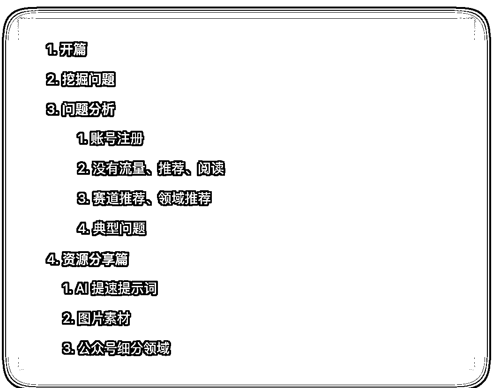

# 复盘 公众号爆文写作

> 原文：[`www.yuque.com/for_lazy/thfiu8/llz2rl8z5ec4ois8`](https://www.yuque.com/for_lazy/thfiu8/llz2rl8z5ec4ois8)

## (58 赞)复盘 公众号爆文写作

作者： 叉叉敌

日期：2024-02-07

12 月航海已经过去快 2 周了，你还在继续前行么？

首先，在 12 月份有幸成为「公众号爆文写作」的教练，和大家一起成长和学习。我在这趟航海中收获颇丰，现在，我也想借此机会，和大家分享一下我的航海总结，希望能对大家在航海结束后，还能继续航行，继续搞钱，不要下船～

航海绝不是一帆风顺的，在航海的过程中，看到大家的提问来看，遇到各种各样的困难和挑战。

最大的问题就是：**写的文章，没有流量。**

但，好多船员和达尔文进化论提到的一样，通过不断地精进和进化，坚持不懈，永不放弃，获得了正反馈，找到自己的赛道和写作方法。

在航海中，教练们通过精选日志、高手分享和多个环节来促进大家继续前行，一起赚到钱。

航海结束后，如果没有一群人每天报喜、分享和解答问题，如果这个时候还没有钱，就很难有激情，继续前行。

希望我的这次航海总结，对大家有所帮助。预祝大家在航海后，继续深耕、取得进步、取得成功，一起生财有术！

最后，提前祝大家新年快乐～

为了阅读体验请移步到飞书文档：[复盘 - 公众号爆文写作-202312 月航海](https://y3my0b87ql.feishu.cn/docx/WQEYdrt7foNBN4xhVMJcR7bnnDb?from=from_copylink)。

* * *

评论区：

悟空悟空空 : 先赞后看！
叉叉敌 : 谢谢悟空大佬[呲牙]
悟空悟空空 : 叉叉敌大佬客气啦～写的真不错！
Denggh : 感想分享，收藏了[强]
文少 : 优秀啊！

* * *