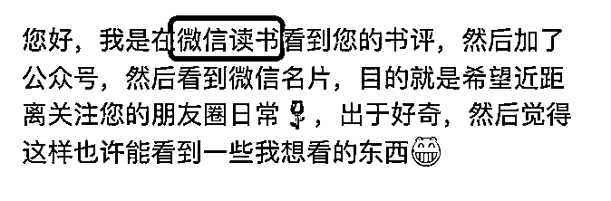
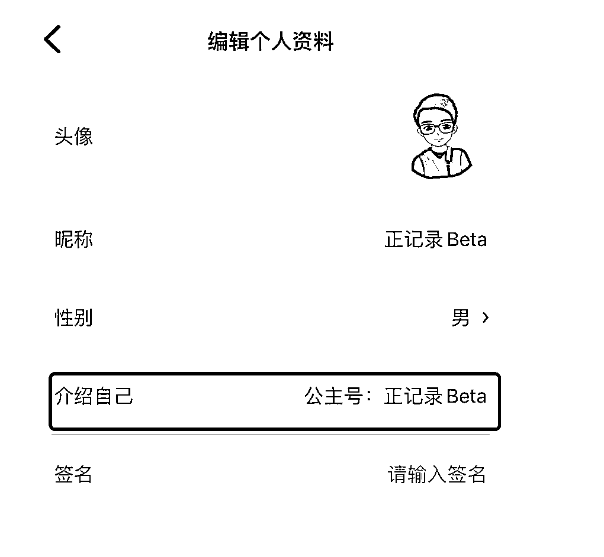
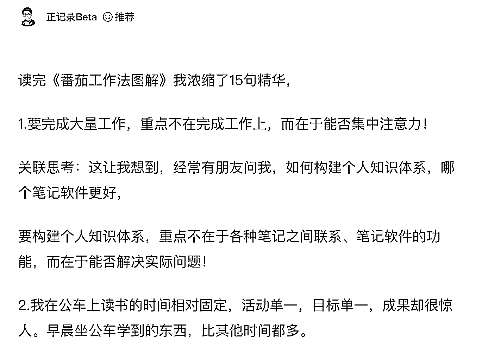
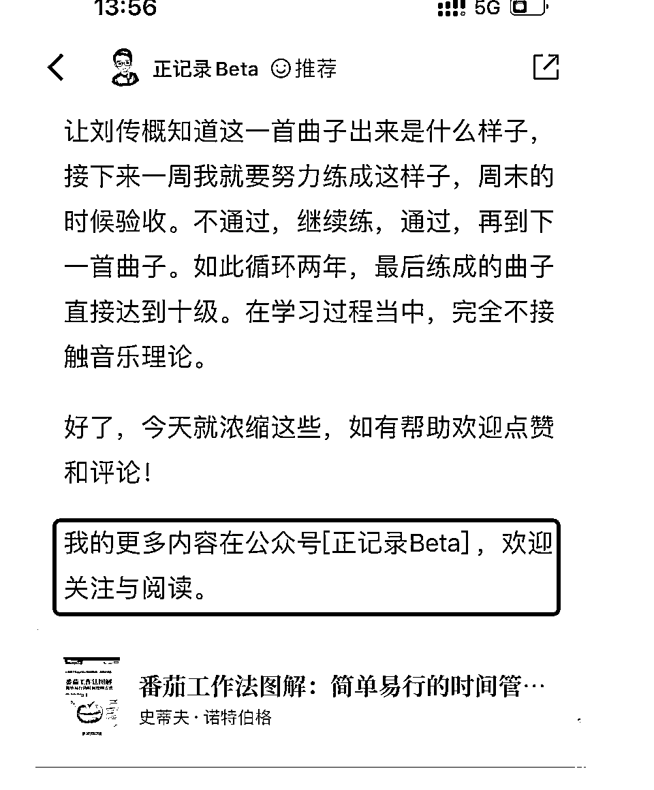
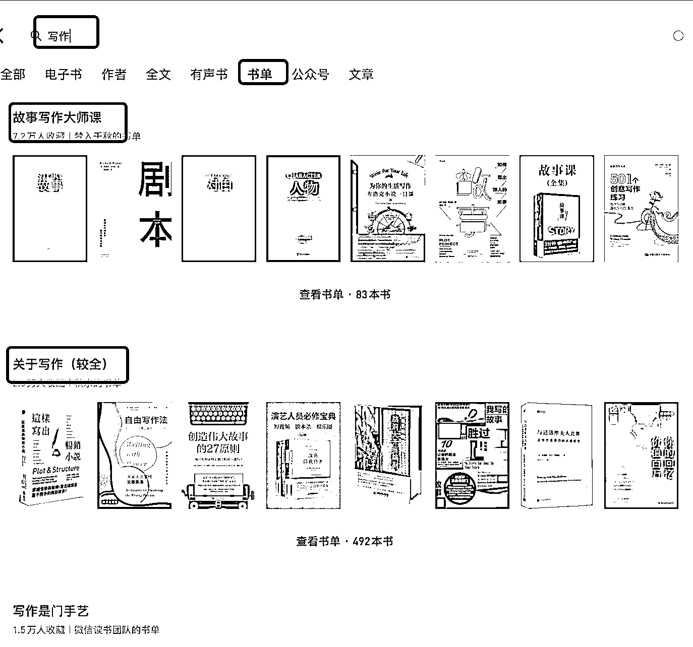
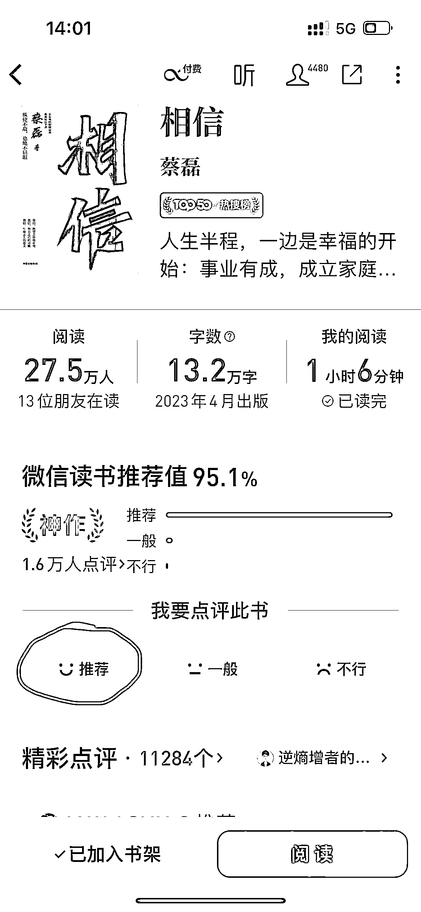
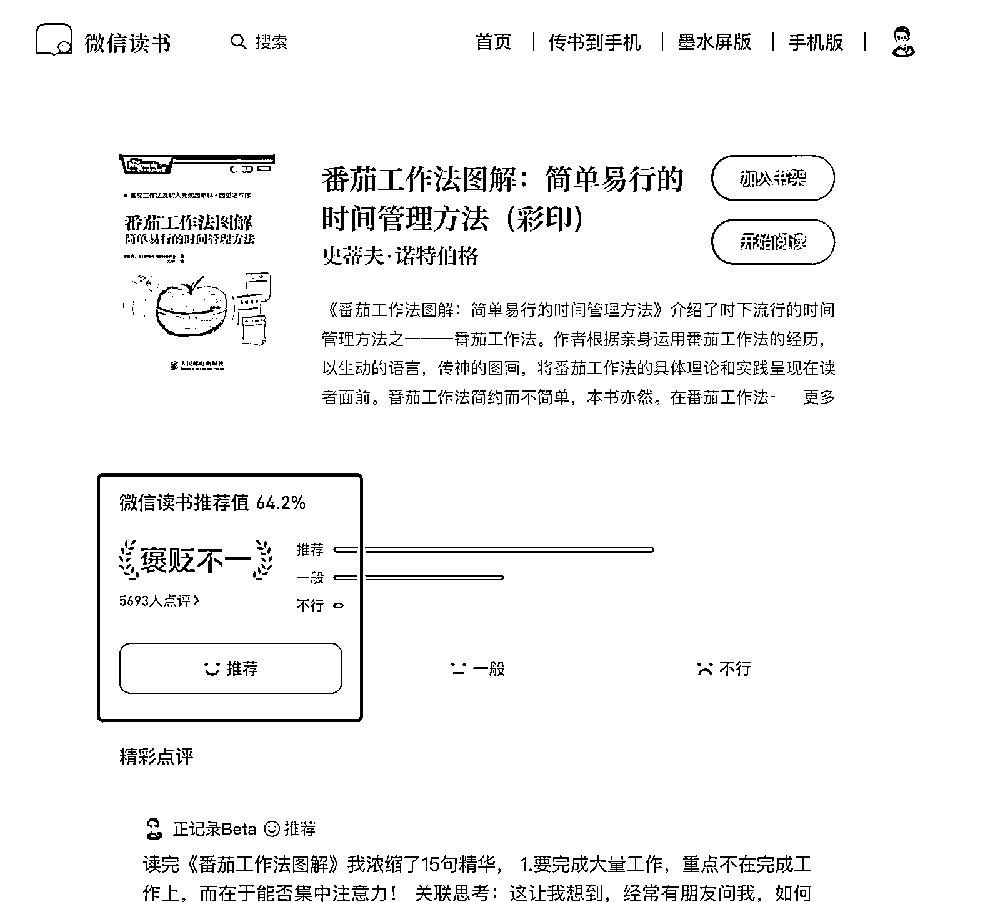
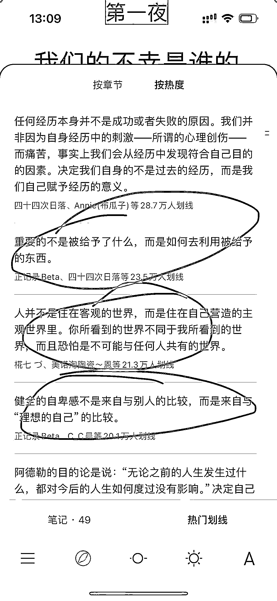

# 如何在微信读书 App ，通过快速写书评进行引流

> 原文：[`www.yuque.com/for_lazy/thfiu8/chh2dww9edbl7yvc`](https://www.yuque.com/for_lazy/thfiu8/chh2dww9edbl7yvc)

## (24 赞)如何在微信读书 App ，通过快速写书评进行引流

作者： 正记录 Beta

日期：2024-02-05

最近有不少人，通过我在「微信读书」APP 的书评，关注了我公众号了，之后又加了我微信。

**引流的首要条件是，需要在有流量的地方去引流，比如，在微信读书写书评，就是符合在有流量的地方引流。**

接下来需要紧张账号的装扮，

  

接下来需要紧张账号的装扮，

  不知道为啥这里没办法直接写「公众号」，只能起个别名了，这里也可以放个人微信了，具体放哪个根据自己喜好来。

虽然公众号和微信读书都是腾讯的产品，但可能是不同部门的，所以也会有引流的限制。

我目前点赞最多的书评是《番茄工作法图解》这本书，一共有 一百多个个赞，陆续有人通过这篇书评，关注到我的公众号。

> 
> 
> 我目前点赞最多的书评是《番茄工作法图解》这本书，一共有 一百多个个赞。
> 
>   
> 
> 接下来的问题是，针对哪些书进行写书评。
> 
> 第一，可以是你读过的任何一本书；第二，可以集中找主题书单进行写书评
> 
> 比如，你要写「写作」的主题书单的书评了。你在「微信读书」里面搜索「写作」然后切换到「书单」按钮，就会出来好多写作相关的书单，从里面选择几十本就行。
> 
>   
> 
> 在微信读书里面找到这本书，然后点击「推荐」就可以写书评了。比如，蔡磊的这本书《相信》。
> 
>   
> 
> 如果你需要写长一点的内容，可以在微信读书的网页版 [`weread.qq.com/`](https://weread.qq.com/) 搜索这本书写书评。
> 
> 
> 
> 接下来是，如何快速写书评。
> 
> 第一，打开「微信读书」 APP
> 
> 第二，找到任何一本你想读的或者之前读过的书
> 
> 第三，找到书中的热门划线，然后从里面选出来几条
> 
> 
> 
> 也可以使用浏览器插件「Wereader （[`github.com/Higurashi-kagome/wereader`](https://github.com/Higurashi-kagome/wereader)）」来一键提取微信读书的热门划线。
> 
> **这种热门划线，就是之前的读者精选出来的，书中爆款内容，写书评某种程度上就是告诉读者书中有哪些精华内容，关于这些精华内容，你有什么思考和行动。**
> 
> 然后使用：
> 
> 这种格式写就行了，你有没有读过这本书其实不太重要，重要是这个方法，让用户感觉你读过这本书，让用户感觉你读完这本书用户有收获。
> 
> 这种关联思考，可以用 ChatGPT 之类的 AI 进行写就行了，根据我的经验，熟练的情况下，写这种书评，十来分钟一篇。
> 
> * * *
> 
> 评论区：
> 
> 暂无评论
> 
> 
> 
> * * *