# 医药私域案例复盘：GMV 增长 42.8%，复购率提升 30%，私域如何改善经营？

> 原文：[`www.yuque.com/for_lazy/thfiu8/qcyubdhzf8yrg6sf`](https://www.yuque.com/for_lazy/thfiu8/qcyubdhzf8yrg6sf)

## (13 赞)医药私域案例复盘：GMV 增长 42.8%，复购率提升 30%，私域如何改善经营？

作者： 大江

日期：2024-02-06

大家好，我是大江，一名私域商业操盘手&私域老炮。今天跟生财圈友们分享一个公司级别的私域运营案例复盘，这个案例来自一家国内 top 级医药企业（项目负责人也是生财圈友@小野），我们一起历经半年实践、落地、优化，拿到了不错的结果。写这篇复盘，是希望跟更多做健康类行业和业务的圈友们分享交流。但出于商业保密义务，这篇复盘不会涉及过多细节，更多会从方法论角度来做拆解。我始终认为，无论什么行业，当你搞定了私域，就相当于获得了一定程度的财富密码。

本文分享的一个案例是一家在国内 top 级别的医药企业，不到半年，GMV 增长 42.8%，患者用药周期（DOT，Duration of Therapy，即药物治疗持续时间）从 3.5 个月延长至 5 个月，复购率提升 30%。在私域层面，我们带领他们做了哪些工作，私域如何持续改善经营？今天为大家带来完整的案例复盘。因商业保密，我们就叫 A 企业。

私域存在的意义在于创造价值：

从消费者角度来讲，产品给我带来的价值才是我付款的主要原因。这里的价值不仅是产品本身的功能，也可以是一个故事、一个场景、一个设计、一次服务、一次关怀，你需要有东西去支撑它。

以下正文

**项目背景**

众所周知，过去医药行业比较风光，从市场角度来看，药品的产品生命周期很长，每年都呈高增长趋势，一路高歌。

但那是以前，近几年，随着国家药品集中带量采购工作（以下简称「集采」）的实施和常态化，降低药价对老百姓来说是好事，但医药行业确实受到了不小的冲击。政策在变、行业在变、渠道在变、营销模式也在悄悄发生着改变。

对医药企业的影响，主要表现在这几个方面：

首先，国家集中采购，以量换价，**导致药品价格大幅下降。**

其次，**集采导致企业间竞争加剧**，如果集采中标，价格必然大跳水，索性很多企业选择不参与集采，那么就要考虑其他出路，这时候全渠道营销的拓展，以及提供更优质的服务，才能走出不一样的路来。

再次，**药品的产品生命周期缩短**，过去一款药品批准上市，只要市场销售能力还不错，花个几年时间，打造亿元甚至十亿元品种是不成问题的，而现在，可以抓住的市场窗口期非常短，市场还没热乎起来，很快就会被纳入集采。

最后，**市场份额锐减**，虽然有少数企业因集采中标扩大了市场份额，但对于大多数企业来说，中标意味着降价、未中标意味着失去医院这一主要市场，不管哪一种，结局都是其市场份额面临严峻挑战，甚至可能会被淘汰。

总之，医药企业既要面对利润下降，产品生命周期缩短，又要面对市场份额减少，竞争加剧等现实又严峻的问题。

面对这一情况，很多医药企业开始寻找和拓展全渠道营销的新思路——院外渠道，包括医药电商、互联网医院、DTP 药房等。

但遗憾的是，即使这几个渠道可以承接住部分市场销量，但在一些特定疾病领域里，除了**在渠道上使劲，如何做到以患者为中心的服务来延长患者用药周期 DOT，从而提升复购**，单纯凭借传统院外渠道的打法是比较难做到大幅提升的。

对于 A 企业，同样也面临如上的问题，怎么办？

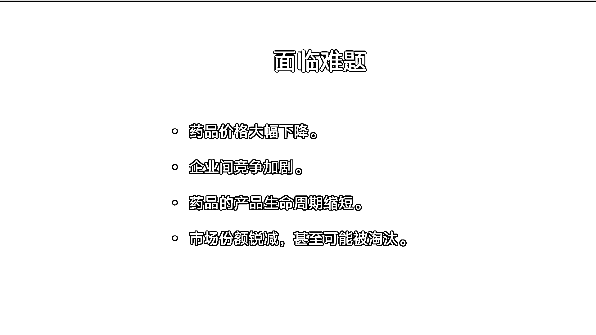

图 1 医药企业如今面临的难题

接下来，我们通过从策略、内容、组织和工具四个方面，全方位为品牌私域进行梳理、案例拆解如下。

## **一、策略**

对于医药企业，利润下降是几乎是无法改变的事实，所以只能力求更多销量，“薄利多销”。

医药是一个高度依赖渠道的行业，**无论院内还是院外，传统提升销量的市场策略很少会从消费者本身出发**，因为这些渠道离消费者太远，患者离开后，有太多不可控的因素导致他们脱落或者在其他渠道购买：

-院内渠道，更多依赖于患者对医生的信任度和依从性，很多患者去一线城市就诊后回到自己城市复诊，由于很多因素就没有复诊；

-电商渠道，是用户主动搜索后下单，在平台也可以做很多患者沟通和服务的事，只是没有私域那么方便和高效；

-互联网医院，虽然患者可通过各互联网医院平台，以线上复诊、问诊的方式直接跟医生沟通，但线上问诊的收费和医生无法实时在线等现状，大多数患者是没有通过这个渠道来续方购药的习惯的；

-DTP 药房/连锁药房，这是最接近用户的渠道，执业药师可直接向患者提供药事服务，但也存在诸多限制。不同药房的专业水平不一使得患者获得的服务体验不一致，DTP 药房在医院周边以服务就诊患者为主，一旦患者回到居住地所在区域或城市，就可能买不到药，用药可及性大大降低。

因此，**自建「通路」，和患者建立双边联系，建立起可以直接服务和对话的场所，才是解决问题的根本办法。**

解决办法如下：

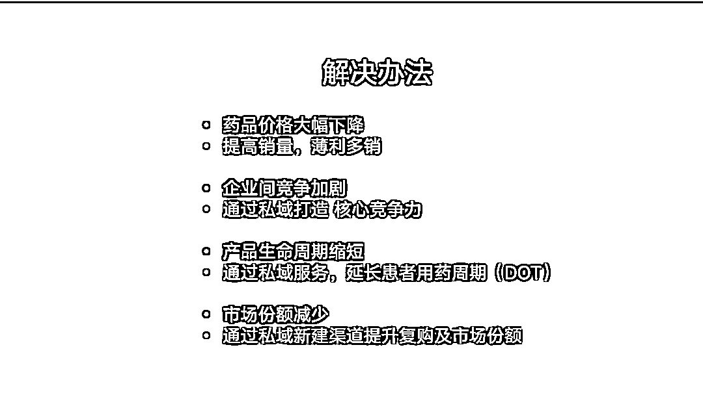图 2 医药企业难题的解决方向

对于医药企业，一直以来是卖货思维，渠道为王，私域运营是一种用户思维，以用户为中心，让企业和用户之间能形成某种双向关系。如今消费者主导的时代，无论选择哪种渠道，即使能成交，也无法解决三个根本问题：

1.  无法保证销量

2.  产品生命周期缩短

3.  企业竞争加剧

对于任何一家规模大小的医药企业，这三个问题都是无法承受的。急需有解决之道，否则影响的不仅是企业的发展，更是生存。

**与患者建立双向联系，为患者提供良好服务和关怀，在患者需要的时候出现，做好患者的全生命周期管理，打造绝佳的患者体验，最终改善患者疾病、提升生活质量、或是延长用药周期。**

**这是医药私域成败的关键点。**

由此，核心业务结果指标为：

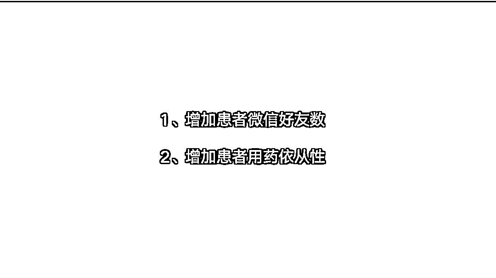图 3 医药私域核心指标

我和 A 企业接触的时候，他们线下有医院渠道、药店渠道，线上有互联网医疗渠道，电商渠道，和私域相关的基建三件套也搭建了，企业微信、微信公众号、微信小程序，**但私域里没有业绩产出。**

这种情况其实并非个例，而是一种非常普遍的私域现状。

很多人以为注册个企业微信、公众号或小程序就是做私域了。表面上看，该有的都有了，但没有实际的业务增量。

我们通过对他们业务现状结合数据分析，以及和销冠、医生访谈，发现了几个关键信息（不仅是医药行业，大部分行业都可以此做参考）

1、患者买完药后，在用药和治疗过程中，是有很多疑问和需要帮助的地方，但他们很难及时回到医院或跟医生联系上，而很多药店又无法以一致的专业水平解决，因此患者很容易流失。**意味着患者需求没有被得到满足。**

2、关注公众号后会引导添加企业微信，但添加率很低。**意味着引流路径有问题，需要找到有效的引流路径。**

3、2023 年新患者，仅有 30%+有第二次购药行为。**意味着大多数患者自第一次购药后脱落，提高用药依从性，让患者持续服药是核心。**

4、针对第 3 项数据进行下挖，首次用药的患者如果在第一个用药周期 30 天内部不进行第二次续方，则基本不会进入下一个用药周期。**意味着在首次处方用药后的 30 天内是触达患者使其治疗不脱落的黄金机会。**

图 4 我们在客户现场调研（深蓝色衣服为本人）

至此，通过策略和数据分析，我们做了如下工作：

1、**调整加微顺序**：在患者买了药后，引导先加微信再关注公众号，加微率瞬间提高到 90%多，这样和患者建立了双向联系，提供服务更方便，患者需要的时候可以找到人。

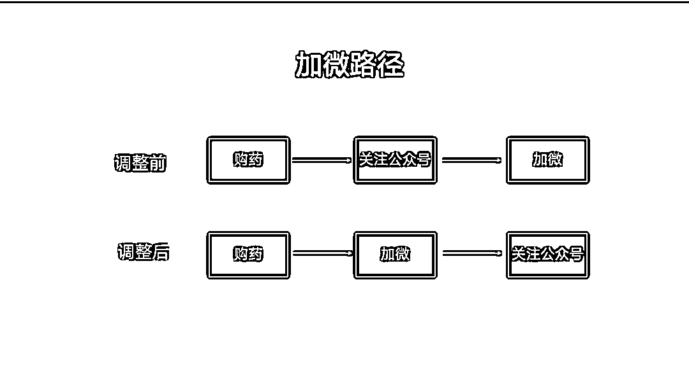图 5 加微路径的调整

2、**设计 IP 身份**：企业微信以医生助手的专业身份（由具有资质的互联网医院平台提供服务），给患者提供购药后的关怀和服务，有了明确的身份，不仅可以明确服务范围，而且可以拉近和患者的关系。

3、**设计客户旅程：**根据实际业务流程，从患者视角，设计了「患者用药治疗康复旅程」（以下简称患者旅程），实现患者的全生命周期管理，从首次用药、到使用商业报销、到复查，服务包括：随访、提醒、关怀、咨询等。

尤其是他们的癌症病人，特别需要关怀和专业用药指导，也特别容易脱落（流失），所以患者旅程我们设计得非常的精细化。

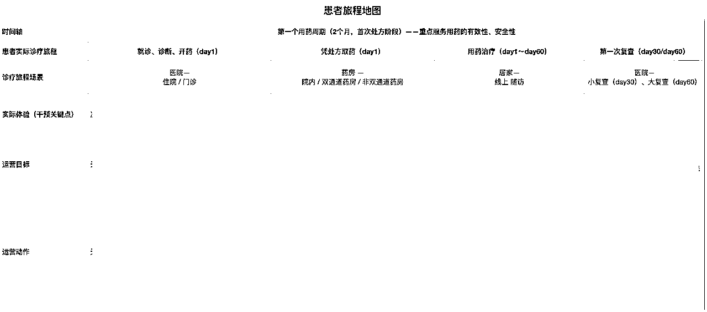

图 6 患者旅程图部分展示

4、**标准化运营 SOP**：基于患者旅程，设计标准化的运营动作。

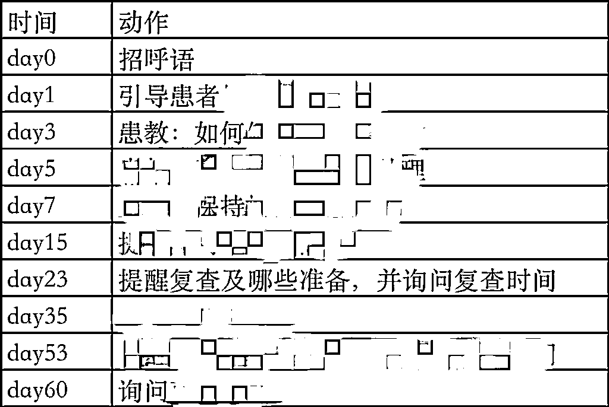图 7 标准化运营动作部分展示

其中，有三个环节至关重要（以癌症患者为例）

1）招呼语，患者在加过来的时候，通过招呼语提供商保报销服务，告知服务范围和未来服务提醒，这样做有三个目的和好处：

第一，在刚接触患者时，通过提供服务，与患者建立第一印象；第二，患者知道有什么问题可以有个人找，心理有安全感；第三，会告知未来服务提醒，为以后的触达提前做了铺垫，患者也不会随意删除微信，提高了留存率。

2）复查提醒，在复查前提醒患者复查，以及要去复查要做哪些准备，并询问复查时间

癌症患者每个月需要复查一次，但用药期间，有诸多原因可能导致患者不去复查，不继续用药和治疗。所以，要进行提醒和引导。

3）鼓励积极治疗，劝导患者不要放弃

当患者没有在既定时间去复查时，意味着患者可能放弃治疗了，所以要了解情况和鼓励他们。

当然，实际上每一个运营动作都非常重要，因为患者私域运营的核心是服务和信任，服务是长期的，建立信任也是长期的。

只有这样，才有可能跟癌症患者站在一起共同战胜疾病、改善患者生活质量、延长生命周期。

策略梳理清楚了，就要开始写内容。

## **二、内容**

很多人以为私域是一个广告渠道，广告就是内容，但这并不是事实的真相。

在私域里，表现出来的任何东西，都是内容。

私域的内容是一门艺术，即在你微信环境里在与客户不见面的情况下，既要把话说清楚，还要让客户乐意看，看了乐意回、乐意相信、乐意买。

**内容决定策略的效果。**

医药私域的内容难度在于既要达到上面的艺术效果，又要保持合规性。

回到【策略】中，对于几个关键节点的内容如下：

1、招呼语

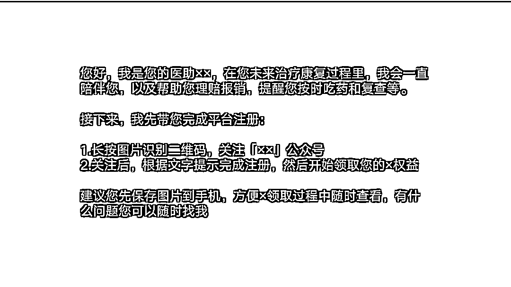图 8 招呼语话术

2、提醒复查

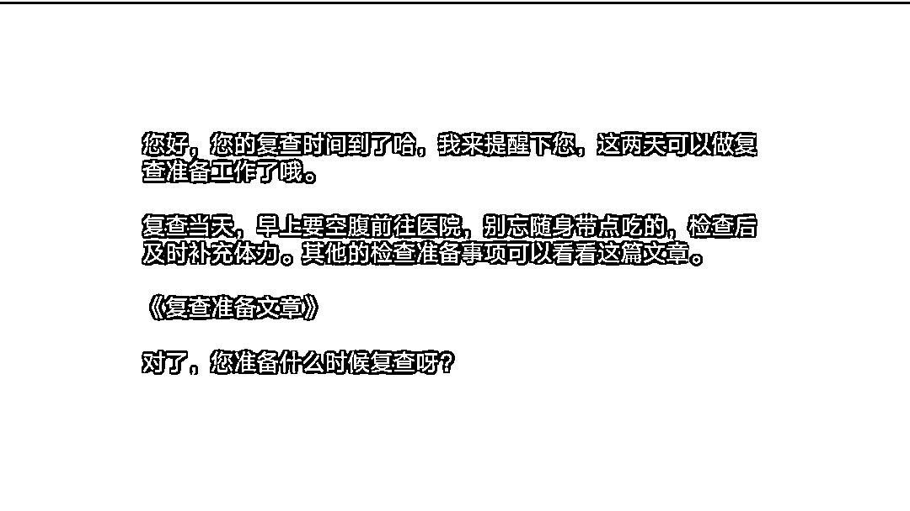图 9 第一次关键触达

3、鼓励积极治疗

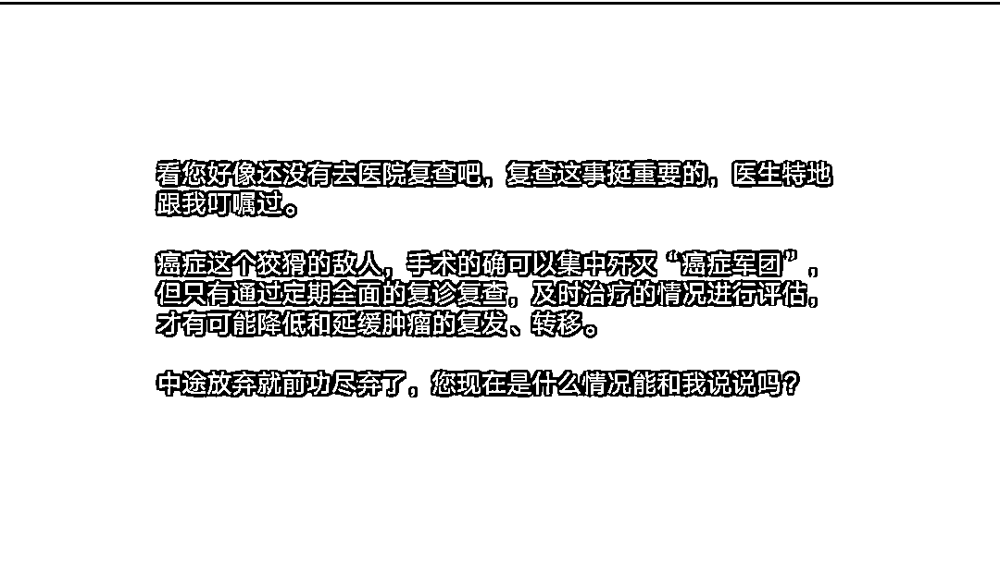图 10 沉默患者唤醒

一些数据呈现：

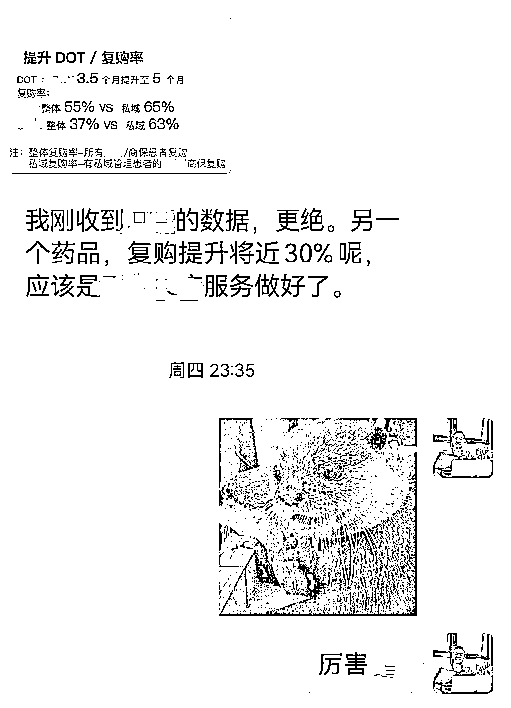图 11 客户反馈

试想下，**当把复购率提升 30%，患者用药周期延长 1.5 个月，不管对于医药企业，还是单个药店，会是多大的增量，利润将增加多少？**

一旦利润模型跑出来，就可以放心大胆铺开和放量。

## **三、组织**

A 企业的私域开展是由一个专门的小组负责，但很多工作超出了他们的管辖范畴，比如患者旅程就涉及多个部门业务，所以在设计患者旅程时，我们组织了多个部门的人一起参与，并且分工明确，**最重要的是，让他们做自己擅长的事情：**

1.  总部：负责项目落地，包括策略，客户旅程设计，内容撰写。

2.  领导：负责给预算，给支持，做决策；

3.  销售：最懂业务，他们提供业务洞察、患者洞察；

4.  医生：医学内容非常严谨，医生提供专业的医学支持；

5.  患者：享受到前所未有的被关怀、被服务，更愿意相信和选择他们。

多个部门合作的结果就是**设计好了患者的全生命周期精细化管理，以后这套患者全生命周期管理体系，可以赋能给所有渠道，可以长期复用。**

并且，真正做到了多方的“极致利他”。

利患者、利渠道、利销售、利总部

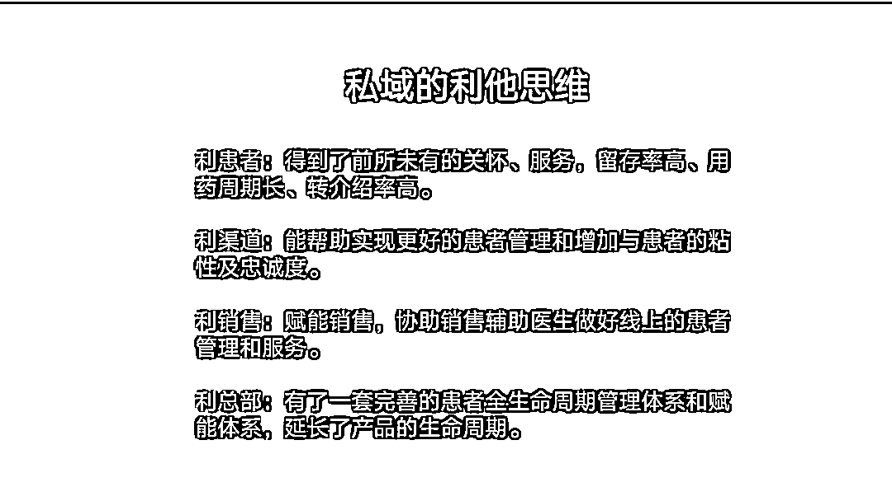图 12 极致利他在私域中的运用

**四、工具**

俗话说“工欲善其事必先利其器”，私域工具的作用是自动化的能力和数字化能力，一款「自动化营销工具」和「数字化管理工具」

**内容决定策略的效果，工具放大效果。**

好工具不仅能大幅度地降低成本、提高效率，而且可以抹除人的不可控。

**更为关键的是能将有效的流程（策略和内容）标准化的执行，使得效果统一。**

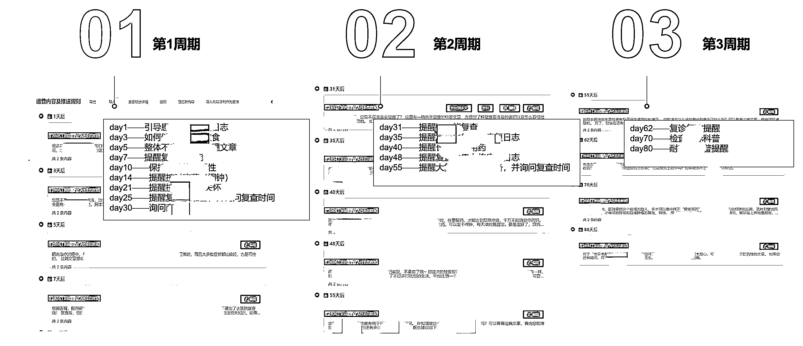

图 13 系统后台标准化 SOP 部分展示

在设置好所有的策略和内容后，系统会自动化执行，一个不漏、一个不缺。

好的工具就应该是这样，人不应该被禁锢在低效、繁琐的流程里，人应该被解放出来去干那些需要思想、创造力和情绪等服务于人的工作。

当然，工具的好用是一个方面，还要放在会用它的人手里，否则再好的工具，用不起来也白搭。

**结束语**

医疗医药行业是一个非常传统、长期依赖渠道的行业，在国家逐步深化医疗医药行业改革、以及消费者主导的时代背景下，**避免内卷和被淘汰出局的唯一方式就是认认真真做私域。**

以微信为载体，以药店为半径，线上+线下有效结合，打通健康和康复的服务通路，为患者提供全方位的服务，注重患者体验，提高患者依从性，延长用药时长（DOT），结合数字化，实现患者的全生命周期管理。

**私域这件事，能持续改善企业经营，给企业带来增长已经是显而易见的，但我希望它的意义不仅如此，不仅要让患者吃上药、吃对药，更要尊重患者、服务患者，让医疗医药回归价值本质，让人类更健康和美好。**

这就是私域的价值所在。

全文完

这套从“策略到内容到组织到工具”的私域落地方法论，不仅适用于医药医疗行业，很多其他行业都适用，无非是不同行业其中的重要性占比不同。最后，感谢生财提供了这么好的平台，感谢帮我改贴的@小野，她提供了很多医药行业专业的洞察。大家有什么问题，欢迎不吝赐教。

* * *

评论区：

暂无评论

* * *