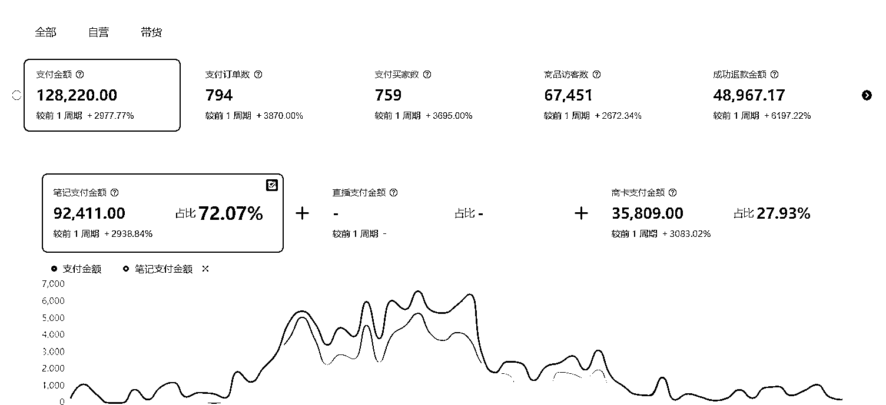
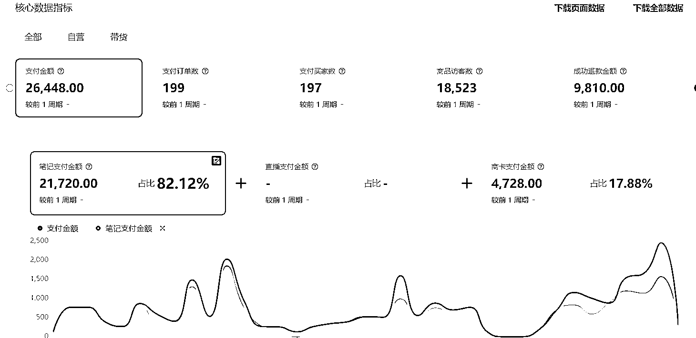
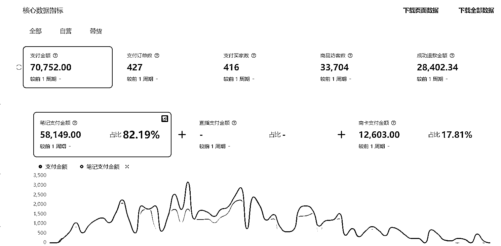
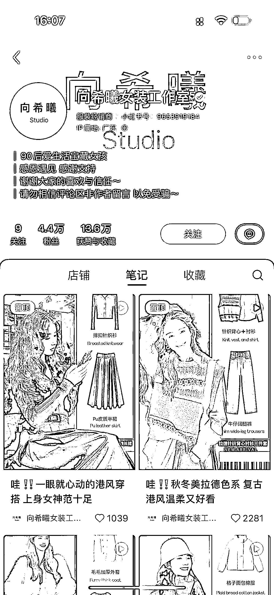
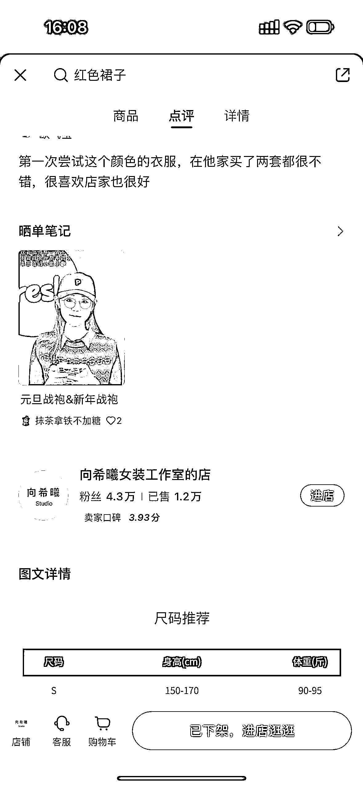
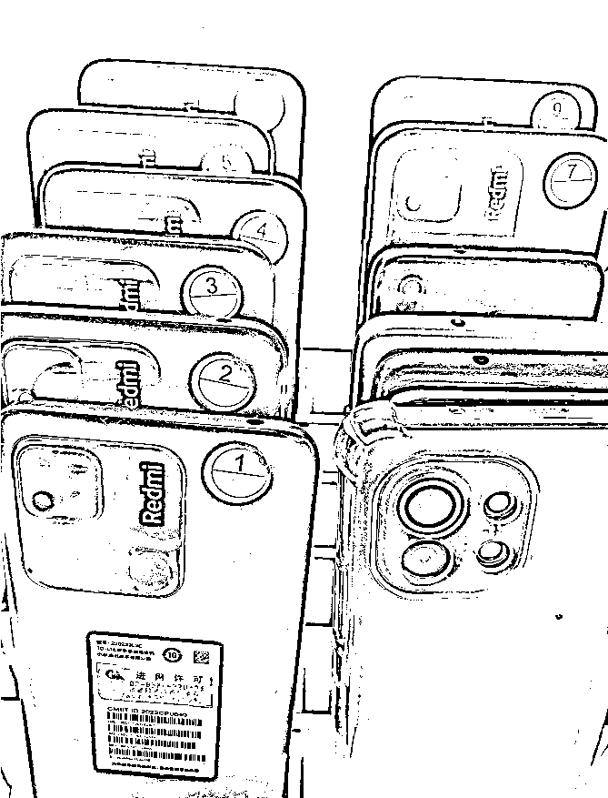
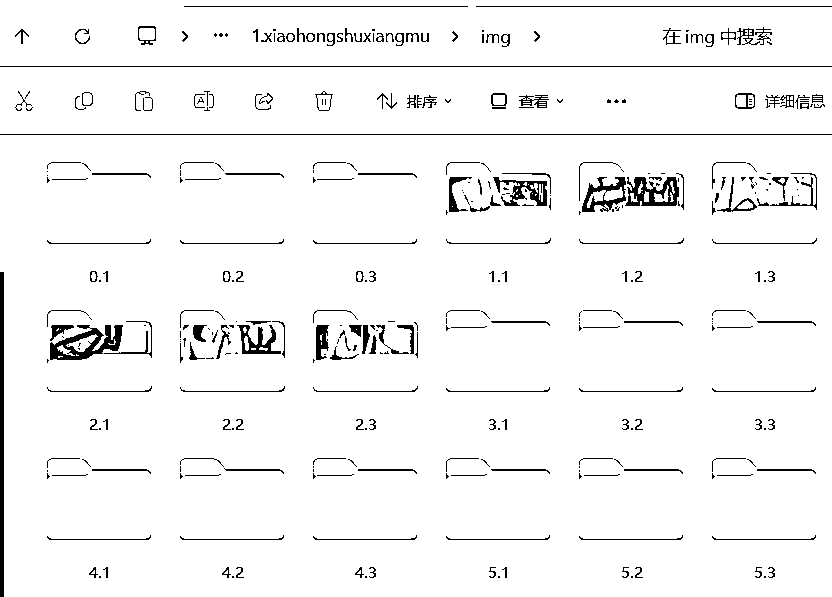
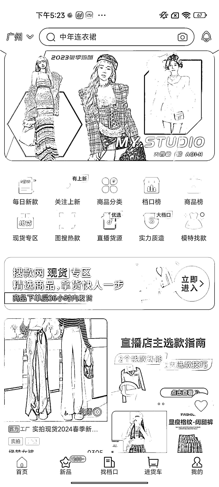

# 多账号操作小红书女装店铺 新店 2 个月营业额 20W+

> 原文：[`www.yuque.com/for_lazy/thfiu8/xo60o434kuz2ogen`](https://www.yuque.com/for_lazy/thfiu8/xo60o434kuz2ogen)

## (38 赞)多账号操作小红书女装店铺 新店 2 个月营业额 20W+

作者： 锦辉

日期：2024-02-05

大家好，我是锦辉，2020 年 4 月 18 日，进入生财有术，不知不觉中都快 4 年了。

趁着放假期间，有空给大家分享小红书图文视频玩法，**多账号批量操作，新开小红书 2 个月营业额 20W+** ，没有团队，只有自己做。（附上其中几家店铺近 2 个月的数据）

# **背景及发展历程：**

大家都知道，上年抖音一直对图文内容进行扶持，而小红书这边却对视频增加了权重，小红书变得更加商业化了，很多圈友也发现挂了车却有更高的播放量。10 月，我发现有一个小红书直接把那个抖音的女装图文做成视频，2 张图片做成 10 秒左右的 PPT 视频，每天只发一个视频，发在小红书上面还挂了车，而且销量很高！当时我记录了他一个店铺每个月都能出个 1-2 千单，这什么概念，**每个月出个一千单，平均每单利润 50 元，单单一个店铺就可以 5w 利润，多开几个账号发视频的话，一个月利润岂不是非常可观吗。**

（同行账号）

同行就是最好的老师，马上我就用了两个号测试了一下，我是直接搬运抖音上面图片，用剪映逐个图片做成视频的，然后再配上音乐，效率是比较慢，每个号每天发 3 天视频，但是这样坚持发了一周以后，突然有一条视频点赞量增加到 50 多赞，评论区陆陆续续有评论“**衣服怎样买**”，当天用自己的号马上开个人店，然后上品，当天就出单了！第 1 天就上千的营业额了。

# 批量放大操作

流量持续了一周之后慢慢下降了，销量也开始慢慢的下降，尝到出单的甜头，想继续干下去，实践发现这种简单发视频的方法是可行的，而且也不会违规，问题是因为视频比较简单，每个视频的点赞量太低了，女装的话比较吃款式 每天几个视频太难爆了，所以我要批量操作，大量发视频，一个账号不能发太多视频，那就注册多些账号操作，用数量来放大概率！之后配备手机卡，流量卡，还有十几台手机注册小红书来做。手机卡买回来后直接打电话改最低价套餐即可，流量卡在淘宝买 5 元一张，月租才 1.9 元 10G。

(工作手机，我用的是红米手机)

# 持续优化

个人店只能开一间，想开多间店铺的话，需要开蓝 V 认证再开店铺，我没有全账号直接开蓝 V，毕竟一个蓝 V 的话需要 600 块钱，帐号没有起来之前，我是不会随便去认证蓝 V 的，据我观察一个账号到了**50 个赞**左右就基本可以确定起号的，这时候再认证然后开店铺挂车，这样不浪费钱，而且确定性高些。视频**10 个赞**左右的再上品挂车，出单确定性高，不用每个视频都上品，毕竟点赞量少的视频基本是不出单的。

# 提高制作做视频效率

账号这么多，如何快速生成视频，提高效率尼，我用 CHATGPT 帮忙写了一个 python 代码，直接将 2 张图片做成有个 10 秒的轮播图片视频，然后附上音乐，采集好图片后分好对应文件夹，用一下这个代码一分钟就能生成十几个视频了。附上 python 代码。

*python 更改一下 8 行图片文件夹地址，9 行音乐地址，10 行生成地址，即可使用。*

这样操作，我发现我的思路是正确的，这个项目就是**大力出奇迹，用数量拼概率**，只要账号多，视频发得够多，这个账号视频还未爆完，接着另外一个账号的视频也爆，东边不亮西边亮，流量一直在持续，当然店铺订单也在持续！接下来我也会不断增加账号去操作，目标所有店铺总共月营业额 30W。

# **项目遇到的问题**

小红书逐渐封杀拼多多无货源，接着所有用拼多多货源的店都被违规了，接着找找淘宝的货源才稳定了下来，但是的话淘宝的货源差不多都比小红书贵一倍，货是差不多的，其实很多货源都是广州档口进的货，质量上面的话跟淘宝的质量其实一样，价格比淘宝便宜。虽然我在佛山，但自己去进货退货的话也挺麻烦的。广州沙河女装批发市场那边的话其实有一个**搜款网**，主要是广州沙河档口的档主卖的货都会上款到这个网站上面，我们也可以直接在搜款网下单发货，也能规避无货源的问题。

目前，售后地址是不能够随便填的，所以我目前的话是寄到自己的工作室里面，然后退货到搜款网或者淘宝。

文笔不太好，就写到这里，有做小红书引流的，亚马逊电商，视频号直播圈友，可以一起交流交流哈

最后祝各位圈友 2024 年，生财有术，发大财！

* * *

评论区：

书豪 : 很棒
锦辉 : [憨笑]谢谢豪哥
向阳 : 女装退货率大概有多少呢
在三亚卖金枪鱼和野生* : 确实要靠工具来提升效率[偷笑]
我的执着 : 流量卡可以推荐一下吗
锦辉 : 和行业的退货率差不多 40%左右
锦辉 : 淘宝 晚荷旗舰店 元黛器旗舰店 之前买的 你问问客服 可能套餐有改变
我的执着 : 好的，谢谢

* * *